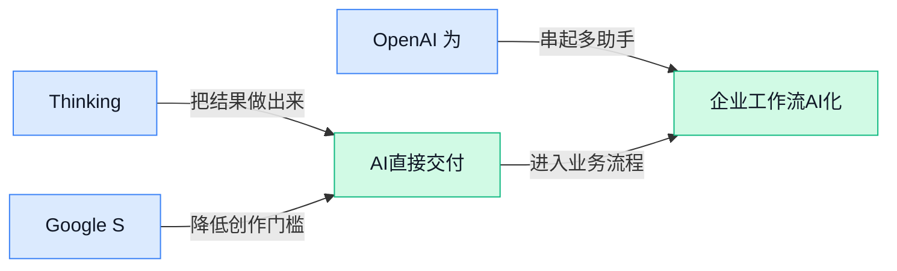

> AI 早报 · 每日早读 · 全网深度聚合

## **今日摘要**

```
Apple Intelligence获准在中国上线并接入阿里通义千问，OpenAI首款无屏AI音箱曝光
Thinking Machines连发首个通用模型与开源Inkling，穆拉蒂从OpenAI出走后正面开战
Claude网页抓取曝信息外泄风险，GPT-Red让OpenAI自家AI互攻，Agent安全警报拉满
```

### 🔵 产品与功能更新

1. **Thinking Machines（穆拉蒂创立的 AI 公司）发布首个面向广泛使用的 AI 模型。**
这家公司由前 OpenAI 高管穆拉蒂创立，如今正式拿出首个可供更广泛用户使用的**AI 模型**，信号很明确：新玩家也开始从“讲故事”走向“真上产品”了 🚀。对行业来说，这不只是多了一个模型，更意味着头部人才创业公司正在加速把研发成果推向市场。对于普通用户和企业团队，这类动态值得关注，因为可选模型变多，往往会带来**价格、能力和接入方式**上的新竞争。[财富杂志报道(briefing)](https://news.google.com/rss/articles/CBMilwFBVV95cUxNOHZmVXduVjhLM2RvNUl3dEw0RmVlc2daOWxqaVFGVXl5blN2UVExS1RxRjB4Y29fTDE3enVRQ3EyNTQxSDA0OXJVZ05mUkxPT0RsMmJQRjNoNjdkSC14N2w0cXltNGhGWkdIanoxUllWbkFLR1RnR1dUX0x3RW5HenVYZk1BSEk3SjNyeFRwMEk5bjJ1MW5B?oc=5)


2. **Google Search 在搜不到网页结果时会直接生成 AI 图片。**
Google 给 **Google Search** 加了一层更主动的补位能力：当网页里找不到你想要的内容时，它会尝试直接生成**AI 图片**给你看 💡。这其实是在把搜索从“帮你找现成信息”，推进到“当场生成可用内容”，对设计灵感、内容策划和概念草图场景尤其有想象空间。这里的生成依赖 **AI 图像生成**能力，也就是让模型根据文字描述直接画图；对普通用户来说，搜索框以后可能不只是找答案，还会变成一个轻量创作入口。[功能更新报道(briefing)](https://the-decoder.com/google-search-now-generates-ai-images-when-it-cant-find-what-youre-looking-for-on-the-web/)

3. **OpenAI 为 Codex 推出一款 230 美元发光键盘。**
OpenAI 新发布了一款和 **Codex** 配套的**发光键盘**，文章将它描述为专门搭配这款 **agentic coding app（具备一定自主执行能力的编程助手应用）** 使用的硬件产品 ⌨️。这说明 OpenAI 不只在做模型和软件，也在继续试探“AI 工具 + 专用硬件”的组合形态。对外界来说，键盘本身也许不是重点，重点是它在尝试把 **AI 编程助手**做成更完整的使用体验；而 **Codex** 这里可以理解为 OpenAI 面向编程场景的智能助手产品。[TechCrunch 报道(briefing)](https://techcrunch.com/2026/07/15/amid-hardware-legal-battle-openai-releases-a-230-keyboard-for-codex/)

### 🟢 前沿研究

1. **GPT-Red（OpenAI 的自动化红队测试系统）让 AI 开始“攻击”自家 AI。**
OpenAI 这次展示的重点，是用 **GPT-Red** 做 **自动化红队测试**（让 AI 扮演攻击者，主动寻找另一个模型的漏洞），而且效果据称比纯人工测试更强 💡。它采用 **self-play（自我对抗训练，让两个 AI 彼此博弈、互相找问题）**，持续挖掘**安全性**、**对齐**（让模型行为更符合人类意图）和 **prompt injection（提示词注入，用恶意指令诱导 AI 偏离原任务）** 方面的薄弱点。对普通用户和企业来说，这意味着未来 AI 产品上线前，可能会先经历一轮更高强度的“内部攻防演练” 🚀。想看官方怎么解释，可读 [OpenAI 官方介绍(briefing)](https://openai.com/index/unlocking-self-improvement-gpt-red)；媒体解读见 [完整报道分析(briefing)](https://the-decoder.com/openai-is-now-using-ai-to-attack-its-own-ai-and-its-working-better-than-humans-ever-did/)。


2. **SynthDocBench（长上下文文档理解测试集）瞄准“超长文档读图”能力。**
这篇工作提出 **SynthDocBench**，核心是评估模型处理 **long-context（长上下文，指一次要读很长很杂的内容）** 文档时的视觉理解表现 📄。它属于 **benchmark（基准测试，用统一题目比较不同模型水平）**，重点不只是识别单页内容，而是看模型能不能跨页、跨段落地理解复杂文档。对企业场景很有现实意义：合同、财报、招股书、报销材料这类长文件，未来是否真能交给 AI 读懂，靠的就是这类测试先把“短板”照出来。论文入口可见 [论文页面说明(briefing)](https://huggingface.co/papers/2607.10400)。

3. **Blind-Spots-Bench（多模态模型盲点评测集）专门检查 AI “看见却没真懂”的地方。**
这项研究聚焦 **multimodal models（多模态模型，能同时理解图片、文字等多种信息的 AI）** 的 **blind spots（盲点，表面答得像对，其实理解有缺口）** 👀。它做的是 **evaluating（系统评估）**，也就是把模型放进更细的测试框架里，看它究竟在哪些情境下容易误判。对业务团队来说，这类研究很关键：AI 在演示里“会看图”不等于在真实报表、海报、流程图里就稳定可靠，盲点不被发现，落地时就容易翻车。详情可看 [论文页面说明(briefing)](https://huggingface.co/papers/2607.08317)。

4. **MonkeyOCRv2（面向文档理解的视觉文本基础模型）继续押注文档 AI。**
从标题看，**MonkeyOCRv2** 是一个面向 **Document AI（文档 AI，让模型直接读懂扫描件、表格、票据等材料）** 的 **foundation model（基础模型，可作为多种下游任务底座的通用模型）** 🧾。这类模型通常不只做传统 **OCR（光学字符识别，把图片里的字提取出来）**，而是进一步理解版式、结构和文字之间的关系。对行政、财务、法务等岗位最相关的意义在于：未来票据整理、档案识别、合同抽取，不会只停留在“识字”，而是走向“读懂整份文档”。原始论文入口见 [论文页面说明(briefing)](https://huggingface.co/papers/2607.11562)。

5. **Read It Back（让多模态大模型反过来给文生图打分的研究）探索“零样本质检”。**
这篇论文提出，预训练的 **MLLMs（多模态大语言模型，既能看图也能读文字的模型）** 可以直接充当 **reward models（奖励模型，给生成结果打分、指导模型往更好方向优化）**，用于 **text-to-image generation（文生图，根据文字生成图片）** 🎨。其中 **zero-shot（零样本，不额外专门训练就直接上手）** 是亮点，意思是模型可能不用再单独学一轮“审美规则”，就能参与判断图片和提示词是否匹配。对行业的启发是，未来文生图质量控制也许能更自动化，减少大量人工挑图和打标工作。论文可见 [arxiv 论文入口(briefing)](https://huggingface.co/papers/2607.11886)。

6. **Search Beyond What Can Be Taught（Agentic Visual Generation，带自主决策能力的视觉生成）想把 AI 从“照着学”推向“自己找答案”。**
这项研究从标题就很有意思：它讨论的是在 **Agentic Visual Generation（带自主决策能力的视觉生成，让 AI 不只出图，还能主动探索生成路径）** 里，如何突破“老师能直接教给它的知识边界” 🚀。其中 **knowledge boundary（知识边界，指模型靠现有训练内容能掌握到哪里）** 和 **evolving（持续演化）** 是关键，说明研究关注的不是一次性喂更多数据，而是让系统通过搜索不断扩展能力。对普通读者来说，可以把它理解成：未来的生成式 AI 可能不只是“背题库作答”，而会更像“边做边找解法”的助手。论文入口见 [论文页面说明(briefing)](https://huggingface.co/papers/2607.05382)。

7. **What LLM Forecasters Know but Don't Say（大模型预测器“心里知道却没说出来”）研究模型隐藏认知。**
这篇论文研究 **LLM forecasters（用大模型做趋势或概率预测的系统）** 的内部表示，想看模型是否“内部其实更清楚”，但最终输出没有完整表达出来 🤔。文中提到的 **calibration（校准，指模型给出的置信度是否和真实正确率匹配）** 与 **faithfulness（忠实性，指模型说出来的话是否真的反映它内部判断）**，都直接关系到 AI 能不能被放心用于预测和决策。对企业应用很重要：如果模型表面回答含糊，但内部信号其实更稳定，那未来产品设计就可能从“只看一句答案”升级到“同时读取模型把握度”。详情可见 [arxiv 论文入口(briefing)](https://huggingface.co/papers/2607.08046)。

### 🟡 行业展望与社会影响

1. **OpenAI 提出“reverse federalism（反向联邦治理思路，用各州规则先试验再汇总成全国框架）”推进 AI 安全治理。**
OpenAI 这篇表态的核心意思是：先由**州级法规**探索不同做法，再逐步沉淀成**联邦层面**的统一规则，而不是一开始就只靠全国一刀切 📌。这种“reverse federalism（反向联邦治理思路，用地方试点反推全国制度）”被 OpenAI 描述为建设**安全、民主 AI**的一条现实路径，也反映出美国正在同时从州和联邦两个层面推进治理。对企业和普通员工来说，这意味着未来 AI 合规很可能会先在地方出现差异，再慢慢走向统一，业务落地时要更关注政策变化节奏。[OpenAI 官方说明(briefing)](https://openai.com/index/advancing-ai-safety-through-state-and-federal-action)


2. **GPT-5.6 Sol（一款据报道擅长数学推理的 AI 模型）90 分钟内推翻 30 年统计学猜想，引发“AI 能否做科研”再讨论。**
这则报道最抓眼球的点，是 GPT-5.6 Sol（一款据报道专攻复杂推理的 AI 模型）在**90 分钟**内完成了人类多年未解问题的“反例构造”（用一个具体例子证明原猜想不成立）🧠。这里提到的**统计学猜想**，本质上是学术界长期讨论的一类理论命题；如果报道属实，说明 AI 不只是会写总结，还可能参与更深层的知识发现。对行业的意义在于，AI 正从“提高办公效率”往“辅助科研与高难度分析”迈进，但也提醒大家：这类突破仍需学界进一步核验，不能只看标题就下结论。[完整报道原文(briefing)](https://the-decoder.com/gpt-5-6-sol-reportedly-disproves-a-30-year-old-statistics-conjecture-in-90-minutes-after-humans-couldnt-crack-it/)


3. **Apple Intelligence（苹果的系统级 AI 功能套件）获准在中国上线，并将接入阿里巴巴通义千问。**
这次获批，意味着苹果推进 **Apple Intelligence（苹果内置在设备和系统里的 AI 功能套件）** 在中国市场落地，终于迈出了关键一步 🍎。报道指出，它将与阿里巴巴的**Qwen（通义千问，阿里巴巴推出的大模型系列）**合作，这也说明跨国科技公司想进入中国 AI 市场，往往需要和本地模型及合规体系深度结合。对行业来说，这不只是一次产品上线，更像是一个信号：**国际终端厂商 + 本土大模型**的合作模式，未来可能会越来越常见。[TechCrunch 完整报道(briefing)](https://techcrunch.com/2026/07/15/apple-intelligence-approved-for-launch-in-china-with-alibabas-qwen-ai/)

4. **OpenAI 首款硬件被曝是一台“无屏 AI 音箱”，主打更有生命感的陪伴体验。**
报道称，OpenAI 的第一款硬件产品可能不是手机也不是眼镜，而是**screenless AI speaker（无屏 AI 音箱，不靠屏幕而主要靠语音交互的设备）** 🔊。它的设计方向据说是“feel alive（更像有生命感的陪伴式交互）”，这说明下一代 AI 硬件竞争点，可能不只是功能多少，而是谁能把“陪伴感”和“自然交流”做得更强。对普通用户和企业观察者来说，这代表 AI 正在从软件工具走向日常设备，未来人机互动可能越来越少点按钮、越来越多“直接开口说”。[产品爆料报道(briefing)](https://the-decoder.com/openais-first-hardware-product-is-a-screenless-ai-speaker-designed-to-feel-alive/)

5. **Thinking Machines（一家主张“别用一个模型包打天下”的 AI 公司）发布首个开源模型 Inkling。**
Thinking Machines 这次拿出的 **Inkling（该公司首个公开发布的开源模型）**，是它成立一年多后首次给外界看的明确成果 🚀。报道强调，这家公司并不认同“one-size-fits-all AI（一个模型适配所有场景的思路）”，而是押注更灵活的模型路线；换句话说，不同行业、不同任务，也许需要不同能力侧重的 AI。对市场的启发很直接：未来大模型竞争未必只看“谁最大最全”，也可能比谁更懂垂直场景、谁更适合被企业按需使用。[TechCrunch 报道原文(briefing)](https://techcrunch.com/2026/07/15/thinking-machines-amps-up-its-bet-against-one-size-fits-all-ai-with-its-first-open-model-inkling/)

### 🟣 开源TOP项目

1. **OmniVoice-Studio（本地语音克隆与配音桌面应用）开源，想自己做 AI 声音工具的人可以直接上手。**
这个项目主打**本地运行**，定位是开源版的 ElevenLabs（知名 AI 语音生成服务），覆盖**语音克隆**、配音、听写等场景 💡。对普通用户来说，最大的看点是声音相关工作不一定非要依赖云端平台，本地部署通常也意味着对**隐私**和素材控制更直接。它还是个 **Desktop App（桌面应用程序，不用进浏览器也能直接在电脑上使用）**，对做内容制作、短视频配音或内部语音素材处理的团队很有吸引力。[GitHub 项目页(briefing)](https://github.com/debpalash/OmniVoice-Studio)


2. **anysearch-skill（给 AI Agent 用的实时搜索技能组件）想把“会搜信息”做成通用能力。**
这个项目的关键词是**统一实时搜索**，目标是给 AI Agent 提供一个可复用的搜索能力模块 🚀。这里的 skill（技能组件，指可插拔的一段能力，让 Agent 像加工具一样扩展本领）强调的是“统一接口”，也就是不同搜索任务尽量用同一种方式接入，方便开发者少做重复活。对业务侧的意义在于，未来很多 AI 助手如果想回答最新信息、查网页或联动外部资料，往往都离不开这种实时搜索底座。[项目仓库说明(briefing)](https://github.com/anysearch-ai/anysearch-skill)


3. **deja-vu（给编码 Agent 用的开源记忆系统）主打通过 SSH（远程安全连接协议，常用于登录另一台电脑）同步记忆。**
它瞄准的是 coding agents（编码 Agent，能自动写代码、改代码的 AI 助手）经常遇到的“做过就忘”问题，用**记忆系统**保存上下文和经验 🧠。项目摘要里特别提到通过 **SSH** 同步，意味着这些记忆可以在不同机器之间传递，而不只是锁死在单台设备里。对团队协作来说，这类能力有点像给 AI 同事配了“工作笔记本”，让它下次接手任务时不必从零开始。[GitHub 仓库页(briefing)](https://github.com/vshulcz/deja-vu/)


4. **Grok Build（xAI 放出的开源构建项目）进入热门视野。**
从候选信息看，这个项目目前公开摘要非常简短，核心可确认的是它来自 xAI 的 GitHub 开源仓库 📦。由于原材料没有展开功能说明，我们不宜过度解读它具体解决什么问题；但它进入这组候选，本身说明社区已经开始关注这类与 **Grok** 相关的开源构建项目。想进一步判断适用场景，还得直接查看项目仓库里的说明文档与更新内容。[官方仓库入口(briefing)](https://github.com/xai-org/grok-build)

### 🔴 社媒分享

1. **Inkling（Thinking Machines 推出的开放权重模型）正式亮相。**
Thinking Machines 这次发布的 **Inkling**，核心看点是 **open-weights（开放权重，指把训练好的模型参数公开出来，方便别人下载和二次开发）** 路线 🚀。这类模型对企业和开发者的意义很直接：不仅能用，还能按自己的业务场景做适配，灵活度通常比只能在线调用的封闭服务更高。HuggingFace（全球最大 AI 模型共享社区）和官方新闻页都同步介绍了它，说明这次发布既想触达开发者，也在强调生态扩散 💡。[HuggingFace 介绍页(briefing)](https://huggingface.co/blog/thinkingmachines-inkling) [官方发布说明(briefing)](https://thinkingmachines.ai/news/introducing-inkling/)


2. **Real World VoiceEQ（评估语音 AI 是否像真人的测试体系）发布，语音模型开始比“人味儿”。**
这篇内容聚焦 **VoiceEQ**，它要衡量的不是“声音清不清楚”，而是 **human quality（人类真实感，也就是听起来像不像一个自然的人在说话）**。对普通用户来说，这很关键：语音 AI 未来不只是客服念稿，还要在陪伴、教育、沟通里更自然，少一点“机器腔” 🎙️。如果说过去很多评测更像看考试分数，这类 **benchmark（基准测试，用统一题目比较模型水平）** 更像是在比“交流体验”本身。[语音评测介绍(briefing)](https://huggingface.co/blog/real-world-voiceeq)


3. **Shippy（AllenAI 打造的 Agent 项目）复盘：做 Agent 难点不在会不会答，而在能不能把事办完。**
AllenAI 在复盘 **Shippy** 时，讨论的重点不是模型多聪明，而是搭建 **Agent** 过程中踩过哪些坑：从任务拆解到工具调用，再到流程稳定性，都比“单次聊天”复杂得多 🚧。这也点出一个现实：一个能写漂亮回答的大模型，不等于就是一个能可靠执行任务的系统。对企业来说，这类经验尤其有价值，因为真正落地 Agent，常常卡在 **workflow（工作流，指任务从开始到结束的一整套执行步骤）** 和异常处理，而不是卡在演示效果。[项目复盘原文(briefing)](https://huggingface.co/blog/allenai/shippy-tech-blog)

4. **Claude 网页抓取功能被曝存在信息外泄风险，Agent 安全再敲警钟。**
这篇文章讲的是研究者如何诱导 Claude 通过 **web fetch（网页抓取，指让模型主动读取网页内容的能力）** 泄露本不该暴露的信息，重点落在 **exfiltration（数据外传，指把原本在系统内部的数据偷偷带出去）** 风险上 ⚠️。它提醒大家：当 AI 不只是“会聊天”，而是能访问网页、文件或外部工具时，安全问题会立刻升级。对公司内部使用者来说，这类案例尤其值得关注——一旦把敏感资料接给 AI 工具，权限设计和边界控制就不能只靠“默认相信模型”。[安全案例解读(briefing)](https://simonwillison.net/2026/Jul/15/claude-web-fetch-exfiltration/#atom-everything)

5. **IBM 财报波动背后，老牌主机护城河与 AI 转型压力被放到台前。**
这篇分析从 IBM 的初步业绩切入，讨论它的 **mainframe（大型主机，银行和政府等机构长期使用的核心计算机系统）** 护城河还能撑多久，以及公司在 **AI** 时代面临的多重压力 📉。有意思的是，文章并不只是看短期股价反应，而是在追问：当传统强项仍能赚钱时，公司有没有足够快地完成下一轮技术转身。对职场人来说，这也是个很典型的商业课题——旧业务越稳，往往越容易让新增长显得更难推进。[深度分析原文(briefing)](https://stratechery.com/2026/ibm-misses-ibms-mainframe-moat-ibms-many-ai-problems/)

---



### 📊 行业洞察（今日 4 条）

1. Thinking Machines 连发首个面向广泛使用的模型和开放权重模型 Inkling（公开模型参数，方便企业自己改）
  【洞察】新玩家不再只靠明星创始人讲故事，而是直接用“可落地、可改造”抢企业市场，模型竞争正从拼名气转向拼适配度

2. Google Search 搜不到就直接生成图片，OpenAI 又做 Codex 键盘和无屏 AI 音箱
  【洞察】AI 正从“藏在软件里回答问题”变成“主动补位并包进使用场景”，以后抢的不是单点功能，而是整套体验入口

3. OpenAI 用 GPT-Red（自动找漏洞的内部测试系统）攻击自家模型，Claude 又被曝网页抓取存在信息外泄风险
  【洞察】这两件事放一起看，能调用外部信息的 AI 越强，翻车面也越大；安全已不是加分项，而是产品能不能上线的门槛

4. GPT-5.6 Sol 被曝 90 分钟推翻统计学猜想；同时多篇研究都在补盲点评测、长文档理解和图片自动打分
  【洞察】行业一边冲高能力天花板，一边拼命补测评短板，说明“看起来很强”和“稳定可用”仍是两回事，落地还远没到放心阶段

### 💭 对我们的启发（今日 3 条）

1. Google Search 直接补生成图片，说明“找素材”和“做素材”正在合并。我们的视频剪辑软件不能把搜索、选图、改图、入剪辑分开做，流程越断越容易被平台型产品吃掉。

2. GPT-Red 和 Claude 外泄案例提醒我们，凡是接入商品库、脚本库、客户资料的自动生成功能，都要默认“不可信先审后发”，高风险步骤必须有人接管，别赌模型自觉。

3. Thinking Machines 主打“别一个模型包打天下”，这验证我们别把能力全押在单一模型上。做视频工具更该按场景分配：写口播、改封面、配音、审片可分别选更省钱或更稳的方案。


---

> 本周周报：[第29周综合分析](https://zhuxinfei.github.io/ai-daily-site/blog/weekly/2026-w29/)
