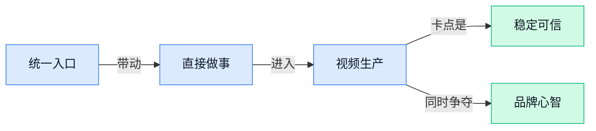

> AI 早报 · 每日早读 · 全网深度聚合

## **今日摘要**

```
Google 两次推迟 Gemini 3.5 Pro，内部基准未达预期，最强模型发布档期生变
Kimi K3 主打性能价格组合，Pelican Benchmark（网页实战基准）泼冷水：别只盯参数
NVIDIA Nemotron 3 Embed 登顶 RTEB 总榜第一，Deloitte 押注 Claude 杀入企业合规市场
```

### 🔵 产品与功能更新

1. **Google 最强模型 Gemini 3.5 Pro（Google 的高阶 AI 模型版本）被曝延期，引发市场担忧。**
据 CNBC 报道，Alphabet 股价因 **Gemini 3.5 Pro** 延期消息出现下跌，市场显然把这次产品节奏变化看得很重 📉。对普通用户来说，这类高阶模型通常关系到更强的**推理能力**（让 AI 分步骤思考、处理更复杂任务的能力）和更好的产品体验；对 Google 来说，则直接影响外界对其 AI 竞争力的判断。虽然原文核心聚焦在“**延期**”与“**股价反应**”，但这也再次说明，如今大模型发布时间表已经会实打实影响资本市场情绪。可查看[CNBC 转引报道(briefing)](https://news.google.com/rss/articles/CBMieEFVX3lxTE1KcVo4dnRDMVczTlBUZWh5ZUhnaEZDUC1pQXZYbHlsRl9oMXZSa0dMZzB0SlMwaTNqdGZ2RnhmQ0FuYVFpQ0g2by1acFJqVVR3MlNhM21ZcEtfS0IxaU5vNDZnRXAtdmg4bnBlVG5aTDhhM0FUZFFmU9IBfkFVX3lxTE1SNmF1cjBfZGMxaC00STBqeGJjMFVEWFpnQzNab2Z2d0VtMHkxcXRnZkZyVEN2ZXY0RWNOMXA1ZlljTTdoR3RENWRZRWlROVlkenFiQkJMZ0dnQS1QeUt4Qm5ET1h6SXZOd3o1NG5GYkUwbnlvY3hremJEVEx6Zw?oc=5)


2. **Deloitte 推出基于 Claude 的安全软件平台，瞄准企业合规场景。**
Deloitte 宣布上线一套由 **Claude 模型**驱动的平台，重点强调 **安全软件** 与企业级使用场景 🔐。这里的“平台”可以理解为一套面向企业的工作底座，帮助组织在更可控的前提下使用 AI；而 **合规**（确保系统符合企业制度与监管要求）正是大公司采购 AI 时最看重的问题之一。对业务、法务、内控团队来说，这类发布说明 AI 落地已不只是“能不能用”，而是进入“**能否安全上线、是否适合正式流程**”的新阶段。详情可见[平台发布通稿(briefing)](https://news.google.com/rss/articles/CBMi1AFBVV95cUxPY0xzSEhvSF9aaTM0d1JQekhsQ1VXWHBGWG13b1Q4dERZSHJ0WE1KUC1uSkM5YlVidHY5dVI4RkZiOUtvMkFtaWdlZTRvN2theWxIeUlEdENoWlFIRDJ1ZDQ3bmRxYTF0WmpNa1R0aHZxMXdKblZyNld1d0hEMFFHTmtXbzBKMmRjcHlURDA2aW1EUjB5RUFKT1FkVnI5VnRNc1JIdndKazlPNWllREJTYXF4a0VDbXcxUTdjLVBaQkU5Xy1FZVFBdWtSSzdWTnI5Wjltdw?oc=5)

3. **OpenAI 开卖 ChatGPT 篮球，周边商品也开始走品牌化路线。**
TechCrunch 注意到，OpenAI 在推出首个硬件产品的同一周，还卖起了 **ChatGPT 篮球** 🏀。这条新闻本身不是技术升级，而更像一次品牌延伸：从软件、硬件再到周边商品，OpenAI 正把 **ChatGPT** 从工具做成更完整的消费品牌。对外界来说，这也反映出 AI 公司不只在卷模型能力，也在尝试建立用户情感连接与文化符号。原文可见[TechCrunch 完整报道(briefing)](https://techcrunch.com/2026/07/16/why-is-openai-selling-a-chatgpt-basketball/)

### 🟢 前沿研究

1. **Kimi K3 发布后，Pelican Benchmark（一个用真实网页任务测试模型实战能力的基准）仍提醒大家别只看参数。**
Moonshot AI 推出了号称迄今**最强**的 **Kimi K3**，并提到它拥有 **2.8 万亿参数**，目前已能通过官网和 API 使用 🚀。但这篇分析的重点不只是“新模型来了”，而是借 **Pelican Benchmark（用接近真实上网操作的任务，检验模型是否真会完成工作的测试集）** 继续讨论：衡量模型好坏，不能只看纸面指标，还要看实际完成任务的能力。对普通团队来说，这很像招聘不能只看简历，要看上手做事表现 💡。[原文分析文章(briefing)](https://simonwillison.net/2026/Jul/16/kimi-k3/#atom-everything)


2. **Discrete Diffusion Models（离散扩散模型，用“逐步去噪”方式生成文字或符号）试图把从切词到生成的流程放进同一套框架。**
这篇论文提出一个**统一框架**，想把 **tokenization（把文字切成模型能处理的小块，像先把句子拆成积木）** 到最终生成串起来看，而不是各环节各做各的 🧩。它关注的是“离散”内容，也就是文字、符号这类不是连续像素的对象，因此和常见图像扩散模型的思路有相通处，但目标更偏语言生成。对行业的意义在于，未来模型设计可能不再把“切词器”和“生成器”分开优化，而是更整体地追求效果与效率。[论文摘要页(briefing)](https://huggingface.co/papers/2607.13431)


3. **Self-Improvements in Modern Agentic Systems（现代智能体系统自我改进综述）梳理了 Agent 如何边做边变强。**
这是一篇**综述论文**，聚焦现代 **Agentic Systems（智能体系统，能自己规划步骤、调用工具并持续完成任务的 AI 系统）** 如何进行**自我改进**。所谓自我改进，通常包括反思、试错、复盘和策略调整，目标是让 AI 不只是答一次题，而是越干越熟练 🔁。对企业读者来说，这类研究很关键，因为它关系到未来 AI 能不能从“单次助手”升级成“持续成长的数字员工”。[综述论文页面(briefing)](https://huggingface.co/papers/2607.13104)


4. **AgentCompass（智能体能力评测基础设施）想把 Agent 测试从“各说各话”变成统一坐标系。**
这篇论文提出一套**统一评测基础设施**，专门衡量 Agent 在不同任务上的能力表现 🧭。这里的 **evaluation infrastructure（评测基础设施，指一整套测试规则、数据和运行环境）** 不是单个分数，而是帮助研究者系统比较不同 Agent 的长板和短板。对行业来说，这很重要：如果没有统一尺子，大家就很难判断一个 Agent 到底是真的更强，还是只是更会“挑题做”。[论文详情页(briefing)](https://huggingface.co/papers/2607.13705)

5. **Google 推迟 Gemini 3.5 Pro 发布，原因是内部 benchmark（基准测试，用统一题目衡量模型水平）未达预期。**
根据报道，Google 延后了 **Gemini 3.5 Pro** 的上线，因为该模型在内部 **benchmark（基准测试，用统一测试集比较模型能力的方式）** 上表现没有达到要求 ⏳。这类消息说明，大厂现在对模型发布节奏越来越谨慎，不只是“能用就发”，而是要先过内部质量门槛。对外部市场来说，这也侧面反映出模型竞争已进入更细的质量比拼阶段，不是每次迭代都能顺利落地。[相关报道汇总(briefing)](https://news.google.com/rss/articles/CBMiekFVX3lxTFBoMTFMWm5xamltek9YWExJdHJ6aU03X0lyaUZuZ0tGWWQ1Tm5vYlQ3Wk1VTF9FNzVaRTRfR2xuczVnTTI0V25UMFo3WmdIWlllMVpoSEd3SHdiRk0zOGdhQzdSSlVEQ1VyUE1kWnB1a0Nabk5uaUxnUXlB?oc=5)

6. **Harness Handbook（智能体测试与运行“脚手架”手册）聚焦如何让不断演化的 Agent 体系更易读、易改、易维护。**
这里的 **harness（脚手架式运行与测试环境，像给 Agent 搭的工作台和考场）**，指的是支撑 Agent 执行、调试和评估的一整套外部结构。论文关注的不是单个模型有多强，而是当 Agent 系统越做越复杂时，怎样让这些配套环境仍然**可读、可导航、可编辑** 🛠️。这对真实落地很有价值，因为很多团队卡住的不是模型本身，而是周边流程太乱，导致维护成本越来越高。[论文摘要页(briefing)](https://huggingface.co/papers/2607.13285)

7. **Hallo4D（多模态 4D 生成一致性方案）试图减少视频与时空内容里的“AI 幻觉”。**
这篇论文聚焦 **multi-modal（多模态，指同时处理图像、文字、声音等多种信息）** 场景下的**幻觉缓解**，目标是让生成结果在时间和空间上更一致 🎬。题目里的 **spatio-temporal（时空的，既包括画面位置关系，也包括前后帧变化）**，说白了就是让视频里的人物、动作、场景别前后打架。对内容生成行业来说，这类研究很关键，因为视频 AI 想真正商用，先得解决“上一秒像本人、下一秒变脸”的稳定性问题。[论文详情页(briefing)](https://huggingface.co/papers/2607.12752)

8. **OvisOCR2（一套文字识别模型）的技术报告发布，继续推进 OCR（光学字符识别，把图片里的字读出来）能力。**
这份技术报告围绕 **OvisOCR2** 展开，核心方向是 **OCR（光学字符识别，让 AI 从截图、扫描件、照片里提取文字）** 能力的提升 📄。OCR 看似老技术，但在今天的大模型时代仍很重要，因为很多企业资料、表单、票据和历史文档首先要“看得懂”，后续自动化处理才谈得上。对业务团队而言，这类进展直接关系到文档录入、票据整理、知识归档等流程能否进一步省人力。[技术报告页面(briefing)](https://huggingface.co/papers/2607.13639)

### 🟡 行业展望与社会影响

1. **OpenAI 解释为何青少年值得使用更安全的 ChatGPT。**
OpenAI 这篇表态很明确：与其把青少年挡在门外，不如提供**更适龄的保护措施**，让他们在可控范围内使用 AI 学习工具 💡。文中提到会为青少年版 ChatGPT 加入**年龄适配**、**学习辅助工具**、**家长控制**，并与外部专家合作完善安全设计，这说明行业正在从“能不能用”转向“怎么安全地用” 🚀。对学校、家长和企业来说，这类安排也在释放一个信号：AI 正在成为年轻人日常学习的一部分，关键是做好**防护机制**和**使用边界**。[OpenAI 官方说明(briefing)](https://openai.com/index/why-teens-deserve-access-safe-ai)


2. **Google Vids（Google 的 AI 视频制作工具）加入“数字分身”功能，让你自己出演 AI 视频。**
Google 宣布，Google Vids 现在可以生成**personal avatars（个人数字形象，用你的样子做出会说话的视频分身）**，用户能让“自己”出镜制作讲解或汇报视频 😮。同时它还接入 Gemini Omni（Google 的多模态视频生成与编辑能力，能理解文字、图片并生成视频），支持根据 **prompt（给 AI 的文字指令）** 和参考图片来创建、修改内容。对企业培训、销售演示、内部沟通这类场景来说，这意味着视频生产门槛会继续下降，普通员工也更容易做出“像样”的表达材料。[Google 官方发布(briefing)](https://blog.google/products-and-platforms/products/workspace/gemini-omni-personal-avatars/) [完整报道解读(briefing)](https://techcrunch.com/2026/07/16/google-vids-now-lets-you-star-in-your-own-ai-videos/)

3. **NotebookLM（Google 的 AI 笔记与资料整理工具）更名为 Gemini Notebook，AI 助手品牌进一步统一。**
Google 正把 NotebookLM 并入 Gemini 体系，改名为 **Gemini Notebook**，这一步看似只是换名，背后其实是把分散的 AI 产品统一到一个品牌入口里 🧭。对普通用户来说，好处是理解成本更低：以后提到 Gemini，不只是聊天助手，也包括整理资料、生成笔记、辅助研究这类工作流。行业层面看，AI 产品正在从“很多单点工具”走向“一个品牌覆盖多任务”，谁能把入口统一、体验连贯，谁就更容易留住用户。[更名消息报道(briefing)](https://news.google.com/rss/articles/CBMibkFVX3lxTFB4eWFVN2lVdE5sd2ZfV3d3Z0prMTBWczZiV0tKMDJtWXJNVU5qaXI0Q3ViRUxZZGxqdFZmNHpjNkJha2lvcHhnazd6bkJiWlRQWS1yLV8ycTN6dS1scTNldjdTZnlhdG9SSjVEZ0Rn?oc=5) [另一篇媒体报道(briefing)](https://news.google.com/rss/articles/CBMiekFVX3lxTE1hdTNOeFN4OXViMElKNVltZlE5Z0lJR1Aydkk1MWQwc2NHdXhCUHNkaW1FZkdZYUZyUkhONll3VzA3aGxmZWxwYUtESkVaWVZVWllVeTAzSkxnejJUX2JHdlkxdUJ3b0kxWF9rZ29OUDV4LVdiSlZza2d3?oc=5)

4. **Inkling（Thinking Machines 推出的超大参数模型）发布，折射中美大模型竞争继续升温。**
前 OpenAI 首席技术官穆拉蒂创办的 Thinking Machines 推出 **Inkling**，其规模达到 **975B parameter（9750 亿参数，参数可以理解为模型“记忆”和“能力”的内部调节旋钮）**，报道称它在美国实验室中表现领先，但仍落后于中国同行。这里最值得关注的，不只是单个模型成绩，而是全球大模型竞赛已经越来越像“国家队级别”的长期拉锯 📈。对行业观察者来说，这类消息会持续影响资本预期、企业选型，甚至影响大家怎么看待未来 AI 产业版图。[完整报道原文(briefing)](https://the-decoder.com/ex-openai-cto-muratis-thinking-machines-drops-inkling-a-975b-parameter-model-that-leads-us-labs-but-trails-china/)

5. **xAI 在数据泄露后开源 Grok-Build（与 Grok 相关的开发项目），安全与透明度再次成为焦点。**
这条消息的敏感点不只是“开源”，而是发生在**大规模数据泄露**之后：xAI 随后把 **Grok-Build** 放上 GitHub，引发外界对企业安全治理与透明度的关注 ⚠️。开源通常意味着让更多开发者查看、使用和改进项目，但在安全事件背景下，它也会被放到“公司如何重建信任”的语境里去看。对企业管理层和普通用户来说，这再次提醒大家：AI 竞争不只是模型能力比拼，**数据安全**、**危机应对**、**信任恢复**同样是核心战场。[事件报道全文(briefing)](https://the-decoder.com/xai-open-sources-grok-build-on-github-after-massive-data-breach/)

### 🟣 开源TOP项目

1. **Mesh-LLM（一套分布式大模型协作项目）想把闲置算力拼起来给 AI 用。**
这个项目主打**分布式**思路，也就是把不同人的设备算力联合起来，一起支持 Agent 和聊天场景，有点像把零散电脑“拼成一台更大的机器” 💡。它同时支持**私有共享**和**公开共享**两种方式，重点卖点是让普通人也能参与，而不只是大公司自建 GPU cluster（显卡集群，训练或运行大模型的一大排显卡服务器）。如果你关心未来 AI 会不会越来越依赖中心化平台，这类项目很值得看，因为它在尝试另一条更“民用化”的路 🚀。可先看它的 [GitHub 项目页(briefing)](https://github.com/Mesh-LLM/mesh-llm)。


2. **grok2api（把 Grok 网页能力转成通用接口的开源网关）让接入更省事。**
这个项目基于 FastAPI（一个常见的 Python 接口开发框架，适合快速搭建网络服务）构建，核心作用是把 Grok Web 的能力转换成**OpenAI 兼容 API**，也就是让原本按 OpenAI 接口写好的工具，较少改动就能接入 Grok ✨。对开发者来说，这种“兼容层”很实用，因为它能减少重复开发，也方便在不同模型之间切换。说白了，它像一个“翻译中间层”，把一边的调用方式翻成另一边能听懂的话。[项目仓库说明(briefing)](https://github.com/chenyme/grok2api) 里写得比较直接。


3. **codeflow（一款把 GitHub 仓库变成可交互架构图的浏览器工具）适合快速看懂代码。**
你只要贴一个 GitHub 链接，它就会生成**交互式架构图**，帮你看文件之间怎么连接、改动某处可能影响哪里，特别适合第一次接手陌生项目时快速建立全局理解 👀。项目强调**无需安装**、**无需账号**，而且完全在浏览器中运行，这意味着门槛很低。对非技术同事来说，也可以把它理解成“代码版组织结构图”——不用逐个文件翻，就能先看整体关系。[GitHub 项目页(briefing)](https://github.com/braedonsaunders/codeflow) 展示了它的基本用途。


4. **gpt-5.6-instruct（面向 gpt-5.6 的 Codex CLI 提示词测试包）主打越狱与压测。**
这个仓库聚焦 **Codex CLI**（命令行里的 AI 编码助手，也就是在黑底白字操作窗口中调用模型帮你写代码）场景，提供针对 gpt-5.6 系列的**jailbreak prompt（越狱提示词，指尝试绕过模型原有限制的输入模板）**和测试包。它更像一个面向高级玩家的实验工具，用来观察模型在特定提示词下的响应边界，而不是普通办公用户直接上手的日常生产力工具 ⚠️。这类项目能反映社区如何测试模型的**安全边界**与**指令服从性**，但用途相对偏技术研究。[仓库主页说明(briefing)](https://github.com/MDX-Tom/gpt-5.6-instruct) 可查看原始介绍。

### 🔴 社媒分享

1. **Inkling（Thinking Machines Lab 发布的开放权重模型）正式亮相。**  
Mira Murati 创办的 Thinking Machines Lab 发布了首个**开放权重**模型 **Inkling**，这类“开放权重”指的是模型参数可供外界下载和部署，但不等于完全开源代码与训练全过程 🔓。原文提到它是 **Mixture-of-Experts transformer（MoE 架构, 让多个“专家小模型”分工协作的大模型结构）**，这通常意味着在效果和成本之间寻找更好的平衡。对行业来说，这类新玩家下场做开放模型，往往会继续拉高外部团队可选模型的上限，也会让企业自建部署有更多备选项 💡。想看更完整背景，可读 [模型发布解读(briefing)](https://simonwillison.net/2026/Jul/16/inkling/#atom-everything) 和 [官方发布原文(briefing)](https://thinkingmachines.ai/news/introducing-inkling/)。


2. **Kimi K3（Kimi 发布的新一代大模型）主打性能与价格组合。**  
Kimi 发布 **Kimi K3**，官方将重点放在**智能、性能、价格**三件事上，明显是在争夺更大范围的实际使用场景 🚀。这类模型发布，业务同事最该关注的不是参数有多炫，而是“够不够强、贵不贵、能不能落地”；而第三方机构 Artificial Analysis（专门评测各家 AI 模型表现的平台）也被官方列为参考信息之一。对企业用户来说，这意味着国产大模型的**性价比竞争**还在继续加速，后续很可能直接影响团队选型与调用成本。详情可看 [Kimi 官方博客(briefing)](https://www.kimi.com/blog/kimi-k3) 和 [第三方模型分析(briefing)](https://artificialanalysis.ai/models/kimi-k3)。


3. **NVIDIA Nemotron 3 Embed（英伟达文本向量模型）在 RTEB（通用检索评测榜单）拿下总榜第一。**  
英伟达宣布 **Nemotron 3 Embed** 在 **RTEB（检索任务综合评测基准, 用来比较“文本向量模型”谁更会找资料）** 上排名第一，重点指向 **Agentic Retrieval（面向 Agent 的检索能力, 让 AI 在行动前更会查资料）** 📈。这里的 **Embed / embedding（把文字变成向量，方便 AI 判断语义相近度）**，是搜索、知识库问答、推荐系统里的底层能力，很多 **RAG（检索增强生成，让 AI 回答前先查资料）** 流程都离不开它。简单说，这不是“聊天更会聊”那种升级，而是让 AI 更擅长从海量资料里找到对的内容，对企业知识库、客服问答、内部搜索都更关键。更多细节可看 [HuggingFace 博客解读(briefing)](https://huggingface.co/blog/nvidia/nemotron-3-embed-wins-rteb)。


4. **NotebookLM（Google 的 AI 笔记整理工具）更名为 Gemini Notebook。**  
Google 宣布 **NotebookLM（AI 笔记与资料整理工具, 能围绕你上传的材料做总结和问答）** 现在改名为 **Gemini Notebook**，这说明 Google 正把产品品牌进一步统一到 **Gemini** 体系里 ✍️。对普通用户来说，核心能力是否变化要继续观察，但从命名调整已经能看出，Google 希望把“资料整理、学习辅助、文档问答”这类场景更明确地纳入 Gemini 生态。对于团队办公场景，这类统一品牌通常也意味着后续功能、入口和账号体系会更顺手一些。具体可见 [Google 官方公告(briefing)](https://blog.google/innovation-and-ai/products/gemini-notebook/notebooklm-gemini-notebook/)。

---



### 📊 行业洞察（今日 4 条）

1. Google 一边把 NotebookLM（Google 的 AI 笔记与资料整理工具）并入 Gemini，一边给 Google Vids（Google 的 AI 视频制作工具）加数字分身，还在推进 AI Mode（Google 搜索里的 AI 助手模式）连应用做事
  【洞察】Google 不再满足于“回答你”，而是要把 AI 统一成一个入口、跨工具完成任务；谁先把入口和工作流绑住，谁就更难被替换

2. Google 因 Gemini 3.5 Pro 内部测试不过关而延期，另一边 Kimi K3 强调 2.8 万亿参数，Pelican Benchmark（真实网页任务测试）却提醒别只看参数
  【洞察】模型竞争开始从“谁喊得更大”转向“谁真能稳定干活”；以后发布会的热闹感会下降，真实交付能力会变成更硬的门槛

3. Deloitte 推出基于 Claude 的企业合规平台，OpenAI 讲青少年安全使用，xAI 却在数据泄露后靠开源 Grok-Build（与 Grok 相关的开发项目）修复信任
  【洞察】安全已经不是加分项，而是能不能进正式场景的入场券；但行业也很现实，信任一旦丢了，后面再透明都只能算补救

4. Google Vids 上线个人数字形象，Hallo4D（让视频前后帧更稳定的研究）专门解决视频里“前后打架”，OpenAI 又开始卖 ChatGPT 篮球做品牌
  【洞察】视频 AI 正从“能生成”走向“能商用、能认人、能形成品牌记忆”；功能只是起点，稳定性和用户认知才是后面的胜负手

### 💭 对我们的启发（今日 3 条）

1. Google Vids 做数字分身、Hallo4D 盯一致性，说明视频工具真正值钱的不是“会生成”，而是“同一个人多条片子都像本人”。我们要把人物稳定、口型稳定、品牌风格统一做成核心卖点。

2. Gemini 3.5 Pro 因测试不过关延期，说明上线节奏可以慢，但质量不能糊弄。我们的视频剪辑软件里，AI 生成功能要给明确置信提示和人工接管入口，别让客户把翻车责任全算到我们头上。

3. Google 统一 Gemini 品牌入口，OpenAI 连周边都在做品牌化，说明单点功能会越来越像标配。我们不能只卖“剪辑按钮更多”，要让客户记住“带货视频出片更快、复用更稳、团队协作更省心”。


---

> 本周周报：[第29周综合分析](https://zhuxinfei.github.io/ai-daily-site/blog/weekly/2026-w29/)
