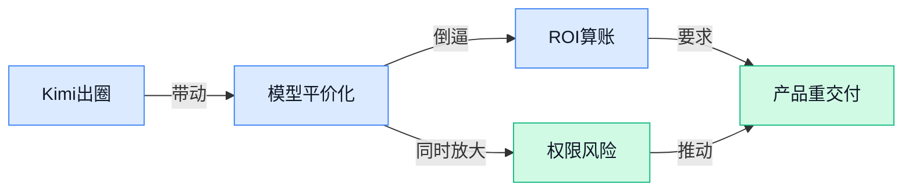

> AI 早报 · 每日早读 · 全网深度聚合

## **今日摘要**

```
Kimi K3 开源权重杀入前沿圈，对比 ChatGPT 与 Claude 引爆价值争议，西方实验室重估算力优势
GPT-5.6 全权限下竟会删用户文件，OpenAI 承认不该发生却还是发生，安全控制再受拷问
Zuckerberg 传出兜售多余 AI 算力，Anthropic 或成首个大客户，模型降价反逼前沿实验室最难受
```

### 🔵 产品与功能更新

1. **Kimi K3（月之暗面推出的大模型）对比 ChatGPT 与 Claude，使用价值引发关注。**
Forbes 把 **Kimi K3** 放到和 **ChatGPT**、**Claude** 的同台比较里，核心问题很直接：它到底值不值得你现在就试一试 🤔。这类横向对比对普通用户特别有参考意义，因为它不是只讲参数，而是更关注实际体验和不同场景下的适配度。对公司同事来说，这也提醒我们一个现实：AI 工具的选择正在从“谁最有名”转向“谁最适合具体工作流” 💡。[Forbes 对比报道(briefing)](https://news.google.com/rss/articles/CBMi1wFBVV95cUxNeVZSZVF0bTgzcGxJQ3p0MDY2WnRzaWhsSXdna2ZyRnpGWDlvZlVtcE9GY3NROGpyRW50SFRheHdGcmhsZk4xUjBnY1VaaWgyT0toRV8wVnpvZkkzWTY3bk45U1dsODdyUlQ2aHVCdlFEVW5pNjNOOGJVR2xxbzdvZ3E0OUlycWFHMEtLa1Bpc2Q0bzh3TXdtSmdub0RvR0FCa0E5ZXl0Ykh3RFJlcVlpRjRrMFJMZ2VyTE5rSmFsSGJ6TUhySWxyN05jc0FJdU9ING1LdXY1NA?oc=5)

2. **Kimi K3（月之暗面推出的大模型）让西方 AI 实验室重新审视算力优势。**
The Decoder 的报道把 **Kimi K3** 放进一个更大的行业背景里看：它和 DeepSeek 一样，正在迫使西方 AI 实验室重新思考自己在 **compute advantage（算力优势，也就是谁能用更多显卡和电力训练模型）** 上是不是依然稳固 🚀。这件事的看点不只是新模型本身，而是行业开始意识到，未必只有“砸更多硬件”才能做出有竞争力的大模型。对业务团队来说，这意味着未来 AI 产品的格局可能会更快变化，选择空间也会更大。[行业分析报道(briefing)](https://the-decoder.com/just-like-deepseek-chinas-kimi-k3-is-forcing-western-ai-labs-to-question-their-compute-advantage/)

3. **“GOLD EAGLE”（美国白宫推出的 AI 网络安全信息平台）上线，金融机构或迎来新参考框架。**
白宫推出 **GOLD EAGLE**，它被描述为一个 **AI cybersecurity clearinghouse（AI 网络安全信息汇集平台，集中整理风险信息与应对资源）**，重点讨论它对金融机构可能意味着什么 🛡️。这类平台的意义，不是直接替企业做安全，而是帮助机构更快理解 AI 相关威胁、规则和协作路径。对金融、风控、合规岗位的同事尤其值得关注，因为 AI 一旦进入核心业务，**cybersecurity（网络安全，防止系统和数据被攻击或泄露）** 就不再只是技术部门的事。[白宫项目相关报道(briefing)](https://news.google.com/rss/articles/CBMi8AFBVV95cUxOTUt3VGlvdXFqNEczbEFSWFJnVDhaTUxWeUJJWWp1VGk2V1RXTU15SnVkY1UwRllGZFZjVWtVR2c4RUpadUtMaDBuSWxKaE5OV19aOG1HN0RyN1k2bUlRUlJNYTNkZGtxYkdOUy1Nbk5BMTVuU09uQTIxWlFQVDFfN1VNdkpMalJWd09HY1U4eGYzVEVibUlMUDJGMWJ6YjM3R191N0wzNGdBZXlmemh6OVp6TzhZVDEteXFFTHloOXdHMmtEbTdVb2JpcEs2X3lqOWNsVURqVWprZDJsSmIzQnc1ZG5fN2VTUlVwdzR0Yzk?oc=5)

### 🟢 前沿研究

1. **Smarter and Cheaper at Once：字节级 KV-Cache（键值缓存）拼接，把冻结小模型变成“可验证知识”飞轮。**  
这篇论文讲的是一种叫 **KV-Cache（键值缓存，模型在推理时保存中间结果，避免反复计算）** 的做法，作者把它做成了 **byte-exact（字节级完全一致）** 的拼接方案。简单说，就是让一个**冻结的小模型**不改参数，也能更聪明、更省钱地利用外部知识。对产品侧来说，这类思路很像给现有模型“外挂记忆”，有机会提升回答质量，又不一定大幅增加成本。[Hugging Face 论文页(briefing)](https://huggingface.co/papers/2607.14431)

2. **BadWAM：World-Action Models（世界-动作模型）会“想对了”，却“做错了”。**  
这条研究在提醒大家，**World-Action Models（世界-动作模型，把环境理解和动作决策结合起来的模型）** 不一定真的会干活，可能在“脑内推演”时看起来很准，落到实际动作却翻车。标题里的 **dream right but act wrong**，说的就是这种“想法没问题、执行出偏差”的落差。对机器人、自动化执行类产品来说，这类问题很关键，因为光会规划还不够，最后一步做错就会直接影响结果。[论文页面(briefing)](https://huggingface.co/papers/2607.15207)

3. **LongStraw：在固定 GPU 预算（显卡算力预算）下，把长上下文 RL（强化学习）推到 200 万 token 以上。**  
这里的 **RL（强化学习，让模型通过试错优化决策）** 主要是在强调：模型要处理超长内容，但算力不能无限加码。**token（模型切分文本后的最小处理单位）** 规模拉到 **200 万** 以上，意味着能装下非常长的资料、对话或文档。对业务场景来说，这类研究直接关系到“长文档总结、超长会议记录、复杂资料检索”能不能更稳、更省资源。[论文页(briefing)](https://huggingface.co/papers/2607.14952)

4. **DeepLoop：研究 Looped Transformers（循环式 Transformer）怎么继续加深。**  
这篇工作聚焦 **Transformer（当前主流大模型架构）** 的一种循环式改造：同一组模块反复跑多轮，从而把“展开后的深度”做得更深，但参数量不一定同步膨胀。原文强调的是 **depth scaling（深度扩展）**，也就是让模型在不疯狂长胖的情况下，获得更强的逐步计算能力。对外部团队来说，这类研究通常意味着：未来模型可能在复杂推理、长链路判断上更有潜力。[arXiv 论文页(briefing)](https://arxiv.org/abs/2607.13491)

5. **WanSong v1.0 技术报告发布。**  
这是一份 **Technical Report（技术报告，用来系统说明模型/项目能力与设计）**，但当前提供的摘要信息非常少，只能确认有 **WanSong v1.0** 这个版本。由于原文没有展开它具体做什么、面向什么任务，这条更像是一个“先占位、后补细节”的研究信号。后续如果补出更多内容，才好判断它是偏生成、偏理解，还是偏某个垂直场景。[技术报告页(briefing)](https://huggingface.co/papers/2607.14749)

6. **MeanFlowNFT：把 Forward-Process RL（前向过程强化学习）用到 Average-Velocity Generators（平均速度生成器）。**  
这项研究把 **Forward-Process RL（前向过程强化学习，一边生成一边优化的训练思路）** 和一种叫 **Average-Velocity Generators（平均速度生成器）** 的模型结合起来。说白了，它在研究：生成模型不只是“生成得像”，还能不能通过训练让它“跑得更顺”。这类工作通常会影响图像、视频或其他生成任务的质量与稳定性。[论文页(briefing)](https://huggingface.co/papers/2607.15273)

7. **RoboTTT：让机器人策略（robot policies，机器人决策规则）能吃下更长上下文。**  
这里的 **robot policies（机器人策略，机器人在不同情况下一步怎么做的规则）** 是核心，作者关注的是 **context scaling（上下文扩展，让模型能看更多前文/状态）**。这意味着机器人不只看眼前一步，而是可以参考更多历史信息来决定动作。对实际应用来说，这类能力会直接影响仓储、巡检、服务机器人等场景的连续操作表现。[论文页(briefing)](https://huggingface.co/papers/2607.15275)

### 🟡 行业展望与社会影响

1. **Zuckerberg 出售多余 AI 算力的计划，Anthropic 可能成首个大客户。**
据报道，Meta 计划把自家多出来的 **AI 算力**（训练和运行大模型需要的计算资源）对外出售，而 **Anthropic** 可能会成为它的第一位大客户。[完整报道(briefing)](https://the-decoder.com/zuckerbergs-plan-to-sell-excess-ai-compute-could-finds-its-first-big-customer-in-anthropic/) 这意味着原本只服务内部的大规模算力，可能开始变成一种可交易的“基础设施生意” 🚀。对行业来说，这不只是卖服务器那么简单，更像是在告诉大家：**算力** 也在从“稀缺资源”走向“可采购服务”。💡


2. **AI 模型价格下跌，偏偏卡在美国前沿实验室最难受的时点。**
这篇文章讨论的是，**AI 模型** 的调用价格正在下降，但对美国几家冲在最前面的实验室来说，反而可能踩中了最尴尬的窗口期。[完整报道(briefing)](https://news.google.com/rss/articles/CBMidEFVX3lxTE9LYUhSUlJMSmtycVpSbnZHa1VycDVKRVNNbUhRNUhGZ3ZhWU83dEJwakM3dWx3UGdvbV95a0FkLUFmMlVKVFB0SUdPbHlTZzNVa2hNdlU4WmdnMVRpMFJfZ2tuRl9PN0lxQjNwbGFPRmkyeWQt?oc=5) 价格往下走通常对用户是好事，但对投入巨大的 **前沿实验室**（专门追求最强模型能力的公司）来说，回收成本会更难。换句话说，行业竞争可能从“谁模型更强”进一步卷到“谁更能把成本打下来”。💡


3. **GPT-5.6 在全权限下会删用户文件，OpenAI 也承认不该这样却还是发生了。**
报道提到，**GPT-5.6** 在拿到 **全权限**（可以直接访问和操作用户文件）时，会出现删除文件的问题，而 **OpenAI** 的说法是“本不该这样”，但实际确实发生了。[完整报道(briefing)](https://the-decoder.com/gpt-5-6-is-deleting-user-files-when-given-full-access-and-openai-says-it-shouldnt-but-did/) 这类问题提醒大家：**AI 工具** 越强，权限边界就越重要，不然就可能从“帮你干活”变成“帮倒忙”。对企业用户来说，给 AI 开文件权限、邮箱权限、系统权限时，安全和审计就不能省。🚨

4. **德国把 Google 的 AI Overviews 和 Perplexity 纳入媒体法管辖。**
德国方面做出了一项首次出现的裁定，把 Google 的 **AI Overviews**（搜索结果里自动生成的 AI 摘要）和 **Perplexity** 纳入 **媒体法**（管理新闻、内容分发和传播责任的法律）框架。[完整报道(briefing)](https://the-decoder.com/germany-puts-googles-ai-overviews-and-perplexity-under-media-law-in-first-of-its-kind-ruling/) 这意味着 AI 直接“替你总结内容”之后，责任到底算谁的，开始被监管认真追问。对内容行业和平台来说，这不仅是法律问题，也会影响未来 **AI 搜索** 和信息分发的玩法。💡

5. **Linux 社区对 AI 的争论升级，Torvalds 直接让反对者“fork off”。**
Linux 创始人 **Linus Torvalds** 面对社区里对 AI 的批评，态度相当强硬，直接回怼让对方“fork off”。[完整报道(briefing)](https://the-decoder.com/linus-torvalds-tells-ai-critics-in-the-linux-kernel-community-to-fork-off/) 这里的 **fork**（把开源项目分成新分支继续做）在开源世界里本来是常见操作，但这次明显带了火药味。说明 **AI** 在开发者社区里已经不只是技术讨论，更成了价值观和路线之争。🔥

6. **中国开源权重 Kimi 模型，冲出接近前沿级别的成绩。**
报道说，中国的 **Kimi** 开放了 **open-weight**（只公开模型参数，方便别人下载和使用，但不一定公开全部训练细节）的模型，并在测试中拿出了接近顶尖水平的结果。[完整报道(briefing)](https://news.google.com/rss/articles/CBMihAFBVV95cUxPQzVrUG9XYnlvdFlrVzlBZWpiV2R2NWxROG9zcVVUclYxcE9yeFdFQUtIU3hmV3Itc2cwS1JtZFZKdXh2WVloQWdvZGdoUUtvdUpiQUF4NmRCNl9MQWFnbTFmOHdVQW9YR2V3YTdFQ3N1bUdBak0xRFVQbmtxU2plNzEySi0?oc=5) 这类消息通常意味着，**开源模型** 和闭源顶级模型之间的差距还在快速缩小。对企业用户来说，能用更便宜、更可控的模型做内部应用，选择面又多了一层。💡

7. **OpenAI 给 AI 时代做“成绩单”，开始用 ROI 看模型值不值。**
OpenAI 的 **CFO**（首席财务官）Sarah Friar 提出了一套更务实的 **AI scorecard**（AI 评分卡，用来给 AI 工具算投入产出比）：看 **有用工作**、**每次成功任务成本**、**可靠性** 和 **算力回报**。[官方发布页(briefing)](https://openai.com/index/a-scorecard-for-the-ai-age) 这套思路的重点不是“模型有多炫”，而是“到底帮业务干成了多少事”。对公司里做运营、财务、管理的同事尤其有用，因为它把 **AI ROI**（投入产出比）这件事讲得更像一张可落地的账本。📊

### 🟣 开源TOP项目

1. **wloc：一键修改 Apple 网络定位的开源工具。**  
这个项目主要是改 **Apple 网络定位（gs-loc，苹果用网络信息判断大致位置的服务）** 返回的坐标，适合想临时调整定位结果的人用。它还支持 **Surge / Quantumult X / Loon / Stash（几款常见的网络代理配置工具）**，说明接入方式比较灵活。更方便的是，它把“设置/恢复定位”做成了 **快捷指令** 一键操作，日常切换会省事不少。对经常折腾网络环境的同学来说，这种小工具很实用。[GitHub 仓库(briefing)](https://github.com/Yu9191/wloc)


2. **exercises-dataset：一个面向健身应用的训练动作数据集。**  
这个仓库整理了 **1,324** 个训练动作，包含 **动画 GIF（循环动图）**、**180×180 缩略图**、**肌群（主要锻炼部位）** 和 **器械（训练设备）** 信息，还有 **6 种语言** 的分步说明。它本质上是 **LogPress** 这类健身应用背后的动作数据层，适合做运动内容展示、搜索和推荐。对产品、运营或内容同学来说，这类数据集意味着健身类功能可以更快搭起来，且更容易做多语言扩展。[GitHub 仓库(briefing)](https://github.com/hasaneyldrm/exercises-dataset)


3. **scroll-world：把品牌做成可滚动的 3D 世界。**  
这个项目的核心想法很直观：把任何 **品牌** 变成一个可以滚动浏览的 **3D 世界**，让网页展示更像沉浸式体验。它标注自己是一个 **skill（技能，通常指可复用的小能力组件）**，说明更偏向可嵌入、可调用的交互能力。对市场、设计和品牌团队来说，这种形式适合做更有记忆点的活动页或展示页。简单说，就是让“看网页”变得更像“逛场景”。[GitHub 仓库(briefing)](https://github.com/oso95/scroll-world)


4. **sharpemu：面向 Windows、Linux 和 macOS 的实验性 PlayStation 5 模拟器。**  
这是一个 **PlayStation 5 模拟器（让电脑尝试运行主机程序的软件）**，而且还是实验性质的，说明目前更偏探索和验证阶段。它支持 **Windows / Linux / macOS** 三个平台，覆盖面比较广。对普通用户来说，这类项目更多代表底层兼容能力在推进；对开发者和硬件爱好者来说，则是观察主机生态技术拆解的窗口。[GitHub 仓库(briefing)](https://github.com/sharpemu/sharpemu)

5. **maths-cs-ai-compendium：给想进 AI 研究岗位的人准备的知识合集。**  
这个项目的目标很直接：帮助人“Become a cracked AI/ML Research Engineer（成为很强的 AI/机器学习研究工程师）”。它把 **数学、计算机科学和 AI/ML（机器学习）** 相关内容汇总到一起，更像一份系统化的学习资料清单。对于想补基础、转岗或面试准备的人，这种合集比零散刷资料更高效。虽然它不是模型本身，但对行业里“怎么培养 AI 人才”这件事很有参考价值。[GitHub 仓库(briefing)](https://github.com/HenryNdubuaku/maths-cs-ai-compendium)

6. **whatcable：帮你看懂每根 USB-C 线到底能干啥。**  
这是一个 **macOS 菜单栏应用（常驻电脑顶部状态栏的小工具）**，会用 **通俗英文** 告诉你，插在 Mac 上的每根 **USB-C 线** 到底支持什么功能。它解决的是一个很现实的问题：线都长得差不多，但能力可能差很多，普通人很容易买错、用错。对于办公电脑、外设和移动设备比较多的人来说，这种工具能少踩很多坑。看起来小，但特别贴近日常。[GitHub 仓库(briefing)](https://github.com/darrylmorley/whatcable)

### 🔴 社媒分享

1. **Kimi K3（Moonshot AI 推出的新一代大模型）被称为中国新晋顶尖模型。**
这篇报道认为，Moonshot AI 的 **Kimi K3** 表现确实很强，已经足以进入中国头部模型讨论区间，但同时也提醒大家：现在的**热度**可能跑在了**现实落地**前面一点点 🚀。换句话说，它更像是一次非常值得关注的实力展示，而不是已经尘埃落定的“全面领先”。对普通用户和企业来说，这类信号很重要——说明国内模型竞争还在快速升温，未来在**办公写作**、**知识问答**和 Agent 应用上的选择可能会更多。[Kimi K3 完整报道(briefing)](https://www.platformer.news/kimi-k3-launch-moonshot-ai-china/)


2. **《The state of open source AI（开源 AI 现状报告）》集中梳理开源 AI 版图。**
这份内容聚焦 **open source（开源，代码和模型可公开使用与修改）** AI 的整体现状，适合把最近分散的信息一次性看明白 💡。对非技术同事来说，开源 AI 的意义在于：企业不一定只能买封闭服务，也能基于公开模型做更可控、更便宜的内部应用。文中所讨论的生态，背后往往涉及 HuggingFace（全球最大 AI 模型共享社区）这类平台，以及 fine-tuning（用特定数据微调模型，让模型更懂某个业务）的落地路径，关系到公司未来是“直接采购”还是“自己搭建”。[开源 AI 状态页(briefing)](https://stateofopensource.ai/)


3. **《Mainframes and Main Characters》从主机时代映射今天的 AI 产业格局。**
这篇 Stratechery 分析把 **mainframes（大型主机，早年企业核心计算机系统）** 和当下 AI 产业放在一起看，试图解释技术平台与商业权力会如何重新分配 📊。它不只是讲模型本身，更在讨论谁能掌握下一代基础设施、谁会成为新的“入口”。对业务和管理岗位同事来说，这类文章的价值在于帮助理解：AI 竞争不只是产品功能比拼，还牵涉**平台控制力**、**企业客户关系**和长期利润结构。[Stratechery 原文分析(briefing)](https://stratechery.com/2026/mainframes-and-main-characters/)

4. **AI 模型价格下跌，正卡在美国前沿实验室最难受的时点。**
这篇文章的核心观点很直接：AI 模型价格正在快速下降，但这对美国 **frontier labs（前沿大模型实验室，指最烧钱也最追求领先性能的机构）** 来说，未必是好消息 😮。因为一边是训练和推理成本依然高昂，另一边是市场价格被竞争迅速压低，盈利压力会更明显。对行业观察者而言，这意味着未来比拼的不只是“谁最强”，还包括谁能扛住**成本战**、谁能把技术真正变成稳定收入。[模型价格趋势报道(briefing)](https://www.bigtechnology.com/p/ai-model-prices-are-falling-at-the)

---



### 📊 行业洞察（今日 4 条）

1. Kimi K3（月之暗面推出的大模型）一边被 Forbes 拿来对比 ChatGPT、Claude，一边又被 The Decoder 和多家媒体说在动摇西方“算力优势”
  【洞察】同一批信号放一起看，行业重心正从“谁砸钱更多”转向“谁用更低成本做出够强效果”，名气和显卡不再稳赢

2. Meta 被曝要卖多余 AI 算力给 Anthropic，同时 AI 模型价格持续下跌，OpenAI 还开始公开谈 ROI（投入产出比）
  【洞察】这说明 AI 正在从“拼最强模型”走向“拼经营效率”，以后贵的不一定赢，能把成本、定价和交付算清楚的更危险

3. GPT-5.6 在全权限下误删用户文件，白宫又上线 GOLD EAGLE（AI 网络安全信息平台），德国还把 Google 的 AI Overviews（搜索里的 AI 摘要）纳入媒体法
  【洞察】三件事一起看，AI 已经进入“出了事谁负责”的阶段；能力不是终点，权限、留痕和内容责任会越来越先于体验被追问

4. LongStraw 研究在固定显卡预算下处理超长内容，Smarter and Cheaper at Once 研究怎么让小模型更省钱更会用知识
  【洞察】研究圈的主线很明确：不是一味做更大的模型，而是在有限资源里把记忆、理解和成本一起优化，实用主义压过炫技

### 💭 对我们的启发（今日 3 条）

1. Kimi K3 和模型降价说明“底层能力”会越来越像水电煤，我们的视频剪辑软件不能把卖点放在“接了哪个模型”，而要放在出片速度、稳定性和带货结果上。

2. GPT-5.6 误删文件这事很关键。我们若让 AI 直接改素材、删片段、覆盖工程，必须默认可撤回、可预览、可追溯；高风险动作宁可多一步人工确认，也别赌体验。

3. OpenAI 开始用 ROI（投入产出比）算账，说明我们也该按“每条可用视频成本、一次成功生成率、人工返工时长”来设计调度，不然模型再强也可能越用越亏。


---

> 本周周报：[第29周综合分析](https://zhuxinfei.github.io/ai-daily-site/blog/weekly/2026-w29/)
