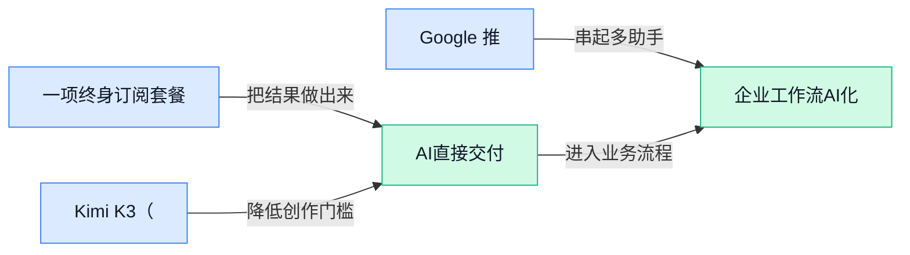

> AI 早报 · 每日早读 · 全网深度聚合

## **今日摘要**

```
60 美元终身打包 ChatGPT、Gemini、Claude，Anthropic 又下调 Claude Fable 5 额度炸裂价格战
Kimi K3 逼西方实验室重估算力优势，Google 却推迟 Gemini 3.5 Pro，只因编程表现未达预期
GPT-5.6 靠一个 prompt 补上凸优化30年空白，中国拟推世界人工智能合作组织重塑 AI 秩序
```

### 🔵 产品与功能更新

1. **一项终身订阅套餐把 ChatGPT、Gemini、Claude 等多款 AI 模型打包到 60 美元。**
这条更新的核心卖点是**低价聚合**：用户据称只花一次性 **60 美元**，就能长期使用多款主流 AI 模型，相当于把多个助手装进一个入口里 💡。对普通办公同事来说，这类产品最直接的意义是少切换平台、少管多个订阅，日常写稿、翻译、总结和查资料会更顺手。它本质上更像 **AI 聚合服务**（把不同模型接到同一个界面的工具），而不是某一家模型公司自己降价，所以真正值不值还要看可用模型、调用限制和后续稳定性。[PCMag 报道原文(briefing)](https://news.google.com/rss/articles/CBMinAFBVV95cUxQLW9QRGtGRDJkS2Nhckd2QnlPemRnWjlHRFNLU2pScnMtY21pZEo3VWdPTGM1MXc3ZDJHaTM0d0FFdDJMdVMyVU11SXV0V3dVaDBSRE5vRnQtTHlZbDhzU2FwMVBOMmFPaU52aklIaURMc2lNTnVTZHVKX0tQZVlNYzdydm5TbDJyZXpYbDFYVThfN29EVC0yWmJCb3M?oc=5)

2. **Kimi K3（一款来自中国公司 Moonshot AI 的大模型）让西方 AI 实验室重新审视算力优势。**
报道把 **Kimi K3** 与 DeepSeek 放在一起讨论，意思很明确：当中国团队持续拿出有竞争力的模型时，西方实验室原本引以为傲的**算力优势**，正在被重新评估 🚀。这里的算力，指的是训练和运行模型所需的大规模计算资源；而 **AI 实验室**（专门研发大模型的团队或公司）最关心的是，更多机器是否还一定能换来更明显的领先。对行业来说，这会继续推动大家从“拼谁资源更多”转向“拼谁效率更高、方法更聪明”。[The Decoder 完整报道(briefing)](https://the-decoder.com/just-like-deepseek-chinas-kimi-k3-is-forcing-western-ai-labs-to-question-their-compute-advantage/)

3. **Google 推迟 Gemini 3.5 Pro（Gemini 系列中的高阶模型版本）发布，原因是编程表现未达预期。**
这次延期传递出的信号很直接：哪怕是 Google，也不愿在**编程能力**不过关时仓促上线新模型 ⚠️。所谓编程表现，通常看的是模型在写代码、改代码和理解复杂开发任务上的能力；这类能力如今已成为衡量大模型竞争力的重要标准。对普通用户来说，这意味着头部厂商越来越重视“能不能真正干活”，而不只是先发布再慢慢修补。对于企业选型也有参考价值——模型发布节奏很快，但**实际可用性**才是最该盯住的指标。[Android Headlines 报道(briefing)](https://news.google.com/rss/articles/CBMimwFBVV95cUxQcUt0czZhOVE3aTdSZGlrbFBBVUk3Nk5qblQwNnBUWkZ0WEhFTGhLNUhIVjUxM29rMFZrSGJlakx3MHl5ZlFJZTJSUk1hUzh5UmRuZXBBYmMybS1RSF9vOVFVZlhSdzFaVm96SUtNXzRIREhFRHpOY3BoX09wYmc3Yzk2Tm5GUGJGSDZyM1FmQk1CcjdFaVl2YUVJRQ?oc=5)

### 🟢 前沿研究

1. **From Pixels to States（从像素到状态的世界模型研究）重新思考把交互式世界模型当“游戏引擎”。**
这篇论文从标题就点出一个很有意思的方向：不再只让模型“看画面猜下一帧”，而是把**world model（世界模型，让 AI 在内部模拟环境如何变化）**往更像**game engine（游戏引擎，负责管理场景状态与互动规则的底层系统）**的方向推进 💡。对行业来说，这意味着未来 AI 不只是生成视频画面，还可能更擅长处理“用户一操作，世界就跟着变”的交互场景，比如游戏、机器人模拟和虚拟训练。哪怕只是研究层面的信号，也说明前沿团队正在从“会生成”走向“会运行” 🚀。可先看[论文信息页(briefing)](https://huggingface.co/papers/2607.14076)。


2. **开源权重模型追平前沿网络安全能力，成本却低得多。**
这篇报道的核心结论很直接：**open-weight models（开放权重模型，开发者能拿到模型参数并自行部署）**，如今已经能达到四个月前前沿模型在**cyber performance（网络安全任务表现，如找漏洞、分析攻击路径）**上的水平，而且成本更低 📉。这对企业很重要，因为它意味着一些原本只能依赖顶级闭源模型的安全能力，正在更快向可落地、可控、可本地化部署的方向扩散。对做业务和管理的同事来说，可以把它理解成：高端 AI 能力的“门槛”正在下降，未来安全产品和企业内部工具都可能更便宜、更普及。详细内容见[完整报道原文(briefing)](https://the-decoder.com/open-weight-models-now-match-frontier-cyber-performance-from-just-four-months-ago-at-a-fraction-of-the-cost/)。


3. **SearchOS-V1（面向信息搜索协作的 Agent 系统）瞄准更稳健的开放域信息检索协作。**
从题目看，这项研究关注的是多个 Agent 如何在**open-domain information-seeking（开放域信息搜寻，也就是面对不限主题的真实世界找资料任务）**里协同工作，而不是单个模型单打独斗。这里的“稳健”很关键，因为真实搜索任务往往会遇到信息冲突、网页质量参差不齐、任务拆分不清等问题；研究者显然在尝试给 Agent 协作建立一套更可靠的组织方式 🧭。这类方向如果成熟，未来会直接影响智能调研、知识助手、企业情报收集等场景，让 AI 不只是会回答，还更会“分工找答案”。可参考[论文信息页(briefing)](https://huggingface.co/papers/2607.15257)。

4. **SEED（自进化蒸馏训练框架）探索 Agent 强化学习的自我迭代。**
这篇论文聚焦 **on-policy distillation（同策略蒸馏，指模型一边按当前策略行动、一边把有效经验压缩回模型里）** 与 **agentic reinforcement learning（面向自主 Agent 的强化学习，让 AI 通过试错学会完成复杂任务）** 的结合。标题里的“self-evolving（自进化）”意味着研究重点不只是训出一个 Agent，而是让它在执行和学习中持续改进 🌱。对普通读者来说，可以把它理解成：研究者在尝试让 AI 像“边干活边复盘边成长”的员工，而不是只能一次性训练完就定型。相关信息可见[论文信息页(briefing)](https://huggingface.co/papers/2607.14777)。

5. **Concurrent Image Understanding and Generation（图像理解与生成并行进行）尝试让模型边看边改。**
这项研究把**image understanding（图像理解，让模型识别画面内容与关系）**和**generation（生成，根据条件产出新图像）**放到同一个过程中处理，而不是先理解、再生成两步分开。标题中的 **self-correcting（自我纠错）** 很值得关注，说明模型可能在生成过程中不断根据自己的理解回头修正，从而减少“越画越偏”的问题 🎨。其中的 **Markov jump processes（马尔可夫跳变过程，一类描述状态突然切换的数学模型）** 属于较底层的方法设计，但业务上能感受到的价值是：未来图像编辑、内容创作和多轮修改可能会更自然、更少返工。可查看[论文信息页(briefing)](https://huggingface.co/papers/2607.13188)。

6. **KeyFrame-Compass（关键帧视频生成评测基准）想把“按关键帧生成视频”测得更全面。**
这篇论文不是直接做视频模型，而是做**evaluation（评测体系，用来判断模型好不好）**，目标是更全面评估 **keyframe-conditioned video generation（由关键帧控制的视频生成，即先给几个核心画面，再让模型补全整段视频）**。这类研究很重要，因为视频模型现在越来越会“做片子”，但到底有没有按照指定镜头、人物、动作去生成，常常缺少统一标准 🧪。对公司做营销素材、短视频制作、虚拟内容生产的人来说，评测基准成熟后，选模型会更像“有尺子量”，而不是只靠主观观感。详情可见[论文信息页(briefing)](https://huggingface.co/papers/2607.14202)。

7. **UniVR（统一视觉推理模型）主打在视觉空间里“思考”。**
从标题看，UniVR 关注的是 **visual reasoning（视觉推理，让模型不只看见图像，还能根据图像做判断和分析）**，并强调在 **visual space（视觉空间，也就是直接围绕图像结构和空间关系进行推理）** 中统一处理任务。简单说，这不是只做识图或问答，而是希望模型对“物体在哪、怎么动、彼此什么关系”有更连贯的理解 👀。这类方向如果做成，能提升 AI 在质检、设计审查、安防分析、复杂图表理解等场景里的可靠度，因为很多任务真正难的不是“看见”，而是“看懂并推断”。可先看[论文信息页(briefing)](https://huggingface.co/papers/2607.12800)。

8. **MultiRef-Compass（多参考音视频生成评测基准）补上多条件生成的评估短板。**
这项研究关注 **multi-reference-to-audio-video generation（基于多个参考样本生成音视频，比如同时参考人物形象、声音风格、动作示例）** 的评测问题。现实内容生产里，客户往往不会只给一个素材，而是会同时给“脸、声音、动作、风格”多个约束；如果没有好的**benchmark（基准测试，统一比较模型能力的标准题库）**，模型强弱就很难公平比较 🎬。因此，这篇论文的价值更像“先修路再跑车”——先把评估体系搭好，后续多模态内容生成（同时处理图像、声音、视频的 AI 生成）才能更快进入可选型、可验收阶段。更多内容见[论文信息页(briefing)](https://huggingface.co/papers/2607.14189)。

### 🟡 行业展望与社会影响

1. **Anthropic 下调 Claude Fable 5（Claude 的长篇内容生成功能）额度，算力紧张开始传导到定价。**
Anthropic 正在削减 **Max** 和 **Team Premium** 套餐里 Claude Fable 5 的使用上限，同时把 **Pro** 用户更多引向 **API**（程序接口，适合企业或开发者按量接入）计费 🚦。这件事最值得普通用户关注的，不只是“能不能多用几次”，而是大模型行业正在从“先放量抢用户”转向“按真实算力成本精打细算” 💡。当 **compute（算力，也就是支撑模型运行的芯片与服务器资源）** 变紧，厂商就会优先把资源给更高价值的企业场景。相关变化可看 [额度调整报道(briefing)](https://the-decoder.com/anthropic-slashes-claude-fable-5-limits-in-max-and-team-premium-and-pushes-pro-users-toward-api-pricing/) 和 [算力吃紧说明(briefing)](https://news.google.com/rss/articles/CBMilwFBVV95cUxNUXQwTXRDbG04V2lsc3NQLU8tX2RpRTFkZ2VqR0w4UF9qXzJnd3hWTnU4aUZwdC1lQUNPYmZLc1k2M2VvZUNjNC1LRjloUVZDSnJPR2QwN1pWNjRxcFNMNlFQV2psdW1wLVJNUFRyNHRrRjFwajNEVE1DZVkydEpaY09JUmJlY0NPYkd1T0I0cEphbndYMjhV?oc=5)。


2. **中美 AI 竞赛正分成两条路：中国主推 open-weight（开放权重，外界可下载并部署模型参数）路线。**
Axios 的观察很直白：全球 **AI race（AI 竞赛）** 不再只是“谁模型更强”，而是在“封闭平台”与“开放权重”两种路线间加速分化 🌍。所谓 **open-weight（开放权重）**，可以理解为厂商把模型“核心参数”开放出来，企业和开发团队更容易二次部署、微调和本地使用；相比之下，封闭模式更像只能租用、不能改造的服务。对行业来说，这会直接影响未来谁更容易形成生态、谁更快铺开海外市场。可参考 [竞赛分化报道(briefing)](https://news.google.com/rss/articles/CBMigAFBVV95cUxQTU1GSXFEb1NUS21rRXFCa2ZvaTh5dnhxUHpFRWpUakVzdW5ydmZKTVVSUF82VGJxX0Mzc01zQlc0alBBdGRYNnItSGhxR0RuRVp5TTI3ZnByMU5IenVNdWZ3OWY3Zk5QbW9MUVFzSnJwbmxYU1RXVXZoUU40NXBlNw?oc=5) 和 [华尔街视角解读(briefing)](https://news.google.com/rss/articles/CBMingFBVV95cUxNX0JEZ2x1UUF4UHEzUVJYS1loOFM2RzVjazlLdDd4OVdpV3pEdmxyV2ZrZGFKcWJnTU5XNnBJQ1Z4OW43dF96T0pGR3p1bHppdlhGaGd5dVM3RTA1MmllQ1BDMlEydlJBMW1aTG5Ja01EY0J3NzQ1Xy1HekkzZnNELWluVVpUcnZEM0RDWHhjS3paUWtJV0dDMl94TV9ydw?oc=5)。

3. **五角大楼新 AI 手册把“慢 adoption（采用、落地）”看得比“不完美 alignment（对齐，让模型行为更符合人类意图）”更危险。**
The Decoder 报道显示，美国国防部的新思路是：与其过度担心 AI 不够完美，不如先解决部署太慢的问题 ⚠️。这里的 **alignment（对齐，让模型行为尽量符合人类目标）** 一直是 AI 安全核心议题，但五角大楼现在更强调 **adoption（采用、把工具真正装进流程里）** 的速度。对社会层面的启示很强——在高竞争环境下，机构往往会把“先用起来”放到比“完全无风险”更前的位置。原文可见 [五角大楼新手册(briefing)](https://the-decoder.com/the-pentagons-new-ai-playbook-treats-slow-adoption-as-a-bigger-risk-than-imperfect-alignment/)。

4. **中国拟推动 World Artificial Intelligence Cooperation Organization（世界人工智能合作组织），争取建立平行 AI 秩序。**
这篇报道把信号说得很明确：中国正尝试通过新的国际合作组织，推动一套更强调 **开放合作** 与 **全球参与** 的 AI 协作框架 🤝。如果说过去很多 AI 规则更多由少数技术强国和大公司主导，那么这种新组织的意义在于给发展中国家提供更多制度参与空间。它不只是外交姿态，也关系到未来谁来制定标准、谁来组织资源、谁能在全球 AI 治理里拥有话语权。相关内容可看 [合作组织解读(briefing)](https://the-decoder.com/chinas-new-world-artificial-intelligence-cooperation-organization-is-president-xis-clearest-play-yet-for-a-parallel-ai-order/)。

5. **习近平呼吁推进全球 AI 协作，发展中国家成技术扩散的重要落点。**
在上海一场人工智能大会上，中国领导人呼吁 **开放** 与 **全球协作**，并明确提到要支持发展中国家的技术进步 🌐。这说明 AI 竞争已经不只是拼模型、拼芯片，也开始进入“谁能带动更多国家一起用、一起建”的阶段。对企业和从业者来说，这类表态背后往往会影响后续的国际合作、标准制定与市场机会分布。可结合 [大会消息摘要(briefing)](https://news.google.com/rss/articles/CBMi0wFBVV95cUxQcHNTUUlSZFpBbm95UjJBVXdiRUVYaUlVS3A5VUpuNkVXT3pSS1p4MnhkUVRlTnB1OW9PV0trOEpfMXBISWV0MGdIcS1udnRUR09NNUhSd0RWWmNOQUFNVUY4LUh2T3h1NWZZWTRGdzNqQnZ4UUxuUHVVMWtSejh1Q0V3b0VIZGMwV0FQRkFzTWpXV0hYSmh6OGNSOHJjYjBNMTA5OVBWR1VGOWdRX2x6YWJBRkZ4QzQ5TjlHbFFpb1QtMWVxTmswb09UMnBZSktCT0Nn?oc=5) 与 [合作组织原文解读(briefing)](https://the-decoder.com/chinas-new-world-artificial-intelligence-cooperation-organization-is-president-xis-clearest-play-yet-for-a-parallel-ai-order/)。

### 🟣 开源TOP项目

1. **reflect-open（一款本地优先的 AI Markdown 笔记应用）把笔记工具做成了更适合 Agent 协作的开源替代品。**
这个项目主打 **local-first（本地优先，数据先保存在自己设备上，不必完全依赖云端）**，同时支持 **Markdown（轻量文本标记格式，适合写文档和知识整理）**，对重视隐私和可迁移性的团队很有吸引力 💡。它还特别强调 **agent-friendly（适合让 AI 助手参与整理、检索和处理内容）**，意味着未来不仅是“记笔记”，还可能变成“让 AI 帮你用笔记做事”的工作台。对运营、产品、行政这类需要长期沉淀资料的人来说，这类工具的价值在于把零散信息变成可复用资产，而不是堆在聊天记录里。[GitHub 项目页(briefing)](https://github.com/team-reflect/reflect-open)


2. **OpenBidKit_Yibiao（一款开箱即用的 AI 标书编写工具）瞄准了投标场景里最费时的那部分工作。**
项目介绍里直接点明了它覆盖 **标书生成**、**知识库**、**查重** 和 **废标项检查** 等环节，等于把投标流程中常见的重复劳动打包进一个开源工具箱里 🚀。这里的 **知识库（把历史材料、规范要求、模板内容集中管理，方便 AI 调用）** 很关键，因为标书最怕“写得快但不合规”；而 **查重（检查内容是否重复或过度复用）**、**废标项检查（提前排查可能导致投标无效的硬性问题）**，也都很贴近真实业务痛点。对于销售支持、商务、采购协同团队来说，这类项目最大的意义不是“完全替人写”，而是让 AI 先把基础活干掉，再由人把关质量。[项目仓库说明(briefing)](https://github.com/FB208/OpenBidKit_Yibiao)


3. **colibri（一个极简的大模型运行引擎）尝试让普通电脑跑起超大规模 GLM-5.2 模型。**
它宣称可以在 **25GB 内存** 的消费级机器上运行 **GLM-5.2（一个超大参数量的大模型）**，核心做法是支持 **MoE（混合专家模型，多个“小专家”分工协作，不必每次都把整套模型全部调动起来）**，并把专家模块从磁盘按需读取，而不是一次性全塞进内存 😮。项目还强调 **pure C（用 C 语言实现，运行开销更低）** 和 **zero deps（几乎不依赖额外软件组件，部署更轻）**，这对想低成本试验大模型的人很有吸引力。简单说，它代表了一条很现实的方向：不是人人都买得起高端显卡，但大家都想把更大的模型带到本地环境里。[GitHub 仓库页(briefing)](https://github.com/JustVugg/colibri)


4. **wardrobe（一款用 AI 自动整理衣橱的工具）把“识别衣服、分类管理”做成了轻量开源项目。**
它的核心思路是借助 **gpt-image（用于图像理解与生成的 AI 能力）**，把用户的衣物从照片里“提取”出来，再做整理和归类 👗。这类应用看上去生活化，但背后其实对应的是 **图像识别（让 AI 看懂图片里是什么）** 和个人资料结构化管理：原本一堆杂乱照片，最后变成可搜索、可筛选的衣橱清单。对零售、时尚、电商团队来说，这也很有启发——AI 不只是聊天工具，还能把视觉信息直接变成可运营的数据。[项目主页入口(briefing)](https://github.com/tandpfun/wardrobe)

5. **Codex-Dream-Skin（一套面向 Codex 的界面皮肤项目）主打把编码助手的视觉体验做得更顺手。**
从仓库名称和摘要来看，这个项目聚焦 **skin（界面皮肤，也就是一套视觉主题与样式方案）**，属于典型的“提高使用舒适度”的轻量开源方向 ✨。虽然它不像模型、框架那样“硬核”，但这类项目往往切中真实需求：很多人每天长时间和 AI 编码工具打交道，界面是否清爽、信息层级是否好看，都会直接影响使用感受。对设计团队来说，这也是个提醒——AI 产品竞争不只比能力，**交互体验** 和 **视觉细节** 同样会拉开差距。[仓库项目页(briefing)](https://github.com/Fei-Away/Codex-Dream-Skin)

6. **Bonsai-demo（一个名为 Bonsai 的演示项目）进入了本期开源榜单。**
目前候选材料里提供的信息只有 **Demo（演示版本，用来展示产品或功能的基本形态）** 这一层，能确认它是一个用于展示 **Bonsai** 项目的公开仓库 🌱。这类 demo 仓库通常价值在于让外部用户快速上手、看见效果，而不是先读一大堆技术文档；对关注开源生态的人来说，它常常是判断项目是否“易试用”的第一入口。由于原始摘要信息较少，现阶段更适合把它视为一个待进一步观察的项目样本。[GitHub 演示页(briefing)](https://github.com/PrismML-Eng/Bonsai-demo)

### 🔴 社媒分享

1. **一张图看懂 AI 对 Stack Overflow（程序员问答社区）的冲击。**
这条社媒分享直接用一张图把变化讲透了：**AI 普及后，Stack Overflow 的提问活跃度出现明显下滑** 📉。对非技术同事来说，这背后其实很好理解——很多原本要去论坛发帖等人回复的问题，现在先被 ChatGPT 这类工具“当场解答”了。它也侧面说明，**知识获取入口**正在从“社区搜索”转向“对话式助手”，对内容平台和搜索产品都是个很现实的提醒 💡。[数据图表原帖(briefing)](https://data.stackexchange.com/stackoverflow/query/1953768#graph)


2. **Controlling Reasoning Effort（控制大模型推理投入）讨论：让 AI 该多想时多想，该快答时快答。**
这篇分享关注一个很实用的问题：**大模型推理**不是“想得越久越好”，而是要能控制它到底花多少“脑力” 🧠。文中回顾了 OpenAI 的 **o1** 和 DeepSeek-R1，并提到 **reinforcement learning with verifiable rewards（带可验证奖励的强化学习，让模型做对可核查的题目时得到明确反馈）**，这是让模型更会“推理”的关键路线之一。对普通办公场景来说，这件事的意义是：未来 AI 可能不只是一个统一模式的助手，而是能在**速度、成本、准确率**之间灵活切换，像“速答模式”和“深度思考模式”那样更贴近真实工作流 🚀。[原文解读文章(briefing)](https://magazine.sebastianraschka.com/p/controlling-reasoning-effort-in-llms)

3. **GPT-5.6 靠一个 prompt（给模型的指令文本）补上凸优化领域 30 年空白。**
这则讨论来自数学社区，核心说法是：有人用一个精心设计的 **prompt（给 AI 下任务的文字指令）**，让 GPT-5.6 产出了与**convex optimization（凸优化，一类“在很多可行方案里找最优解”的数学方法，广泛用于调度、资源分配、金融建模）**相关的重要结果 😮。原帖把它描述为“补上 30 年空白”，所以在社媒上很吸睛，但它本质上仍是社区讨论，不等同于正式同行评审结论。对业务同事来说，这类案例最值得关注的是：**高质量提问**本身正变成生产力，好的指令设计有时真的能把模型能力往上“拽一截” 💡。[Reddit 讨论原帖(briefing)](https://old.reddit.com/r/math/comments/1uxj3cy/after_openais_cdc_proof_announcement_gpt56_used_a/)

4. **Fable 5（一款 AI 推理模型）对比 GPT-5.6 Sol（面向复杂求解的模型版本）：/goal（目标提示词）能否攻下 NP-Hard Problem（极难求解的问题）？**
这篇分享拿 **NP-Hard Problem（求解难度极高的一类问题，规模一大计算量就会暴涨，像排班、路径规划都常会碰到）** 做测试，对比不同模型在复杂任务里的表现。作者特别关注 **/goal（在提示词里先明确最终目标的写法）** 是否能帮助模型更稳定地找到解法，这其实是在讨论“怎么提问，才能让 AI 少走弯路” 🤔。对非技术岗位也很有启发：当任务复杂、约束很多时，**先把目标说清楚**，往往比补充一堆背景更有效，这个规律在人和 AI 协作里都越来越重要。[对比测试文章(briefing)](https://charlesazam.com/blog/fable-5-gpt-5-6-sol-goal/)

---



### 📊 行业洞察（今日 4 条）

1. Anthropic下调 Claude Fable 5（Claude 的长篇内容生成功能）额度，Google又因表现不达标推迟 Gemini 3.5 Pro（Gemini 系列高阶模型）  
  【洞察】头部厂商现在一边缺算力，一边更怕翻车，说明行业竞争已从“先发再说”转向“算得过来且真能用”才行

2. Kimi K3（Moonshot AI 的大模型）冲击西方算力优势，中国又推动开放权重路线和世界人工智能合作组织  
  【洞察】这几件事放一起看，中国不只是在追模型成绩，而是在同时抢成本优势、开放生态和国际规则话语权

3. 开放权重模型在网络安全任务上追平数月前前沿水平，60美元聚合多模型套餐又把主流能力打包卖  
  【洞察】高端 AI 正快速变成便宜通用货，真正稀缺的不是模型本身，而是稳定交付、场景适配和使用门槛控制

4. KeyFrame-Compass（关键帧视频生成评测基准）和 MultiRef-Compass（多参考音视频生成评测基准）同时补评测短板  
  【洞察】视频生成行业开始从“能不能生成”转向“能不能按要求生成且可验收”，以后拼的会是可控性，不只是惊艳感

### 💭 对我们的启发（今日 3 条）

1. Anthropic限额、Google延期都说明底层模型不稳定是常态，我们的视频剪辑工具不能把关键流程押注单一模型，得预留多模型切换和人工接管入口。

2. 关键帧、多参考评测同时升温，验证我们该把产品重点放在“按品牌素材和脚本稳定出片”上，而不是只追一次性生成的炫技效果。

3. 60美元多模型聚合和开放权重追平能力，意味着基础能力会越来越便宜；我们收费不能只卖“接了 AI”，而要卖更快改稿、更稳交付和更低返工。


---

> 本周周报：[第29周综合分析](https://zhuxinfei.github.io/ai-daily-site/blog/weekly/2026-w29/)
