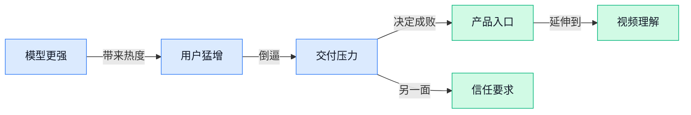

> AI 早报 · 每日早读 · 全网深度聚合

## **今日摘要**

```
Qwen 3.8 露面先指向 token 计费，月之暗面 Kimi K3 还自称仅次于 Fable 5
Siri AI 预览版开始内测，苹果一次放出 7 个新功能
OpenAI 把 Codex 上下文从 372k 调到 272k，Claude Code 转用 Bun 的 Rust 版
```

### 🔵 产品与功能更新

1. **Qwen 3.8（阿里巴巴推出的开源权重大模型）对上 Kimi K3（月之暗面推出的模型），还自称仅次于 Fable 5（另一款对标模型）。**  
   这条消息的重点不是单纯“又发了一个模型”，而是阿里系 **Qwen** 这次直接把自己摆到和 **Kimi K3** 的对比台面上，明显是在抢 **大模型** 话语权。原文还提到它是 **open-weight（开放权重，模型参数可供外部使用）**，这意味着外界更容易拿来二次开发或做本地部署。标题里那句“second only to Fable 5”也很有火药味，说明它在宣传口径上给自己定了很高的定位。[原文报道(briefing)](https://the-decoder.com/alibabas-qwen-takes-on-kimi-k3-with-open-weight-qwen-3-8-says-model-is-second-only-to-fable-5/)


2. **Siri AI（苹果语音助手的 AI 预览版）开始内测，能先玩 7 个新功能。**  
   这次更像是苹果把 **Siri** 往真正的 **AI 助手（能理解并执行更复杂指令的智能助手）** 方向再推一步，而且已经进入 **beta（测试版，给少量用户先试用）**。对普通用户来说，最直接的感受大概率是语音交互会更像“能办事的助手”，而不只是“会答话的语音工具”。这类更新通常也意味着苹果在跟 ChatGPT 这类产品的体验差距上继续补课。[Siri 体验报道(briefing)](https://news.google.com/rss/articles/CBMiWkFVX3lxTE1UaThxRWlGb0d0ZDBVU3Ezc3dTN0R6STNmdzBXRVNxQkl3THFrd2ZRdFpKVFlvMk1Da091Z0NGdllSdV9EdC1SS3MyNWlWcnYydmV3cGpNRU1HZw?oc=5)

3. **Spotify 给 Premium 用户上了一个像 ChatGPT 的 AI 音乐助手。**  
   这意味着你不只是“搜索歌名”，而是可以更自然地用对话方式找歌、找歌单，体验更像和一个懂音乐的助手聊天。对平台来说，这类 **AI 音乐助手** 往往能提高用户停留时长，也更容易把“找内容”这件事变得顺手。原文强调它只面向 **Premium（付费订阅）** 用户，说明这是先从核心付费人群开始试水。[Spotify 功能报道(briefing)](https://news.google.com/rss/articles/CBMikgFBVV95cUxNUXZOWG41U29CTUN3V3FzR2J3aVF6T3BNWlM3V25KZW52ek5aaUVaNnhnWGJxSm1wTjhkVHhOYklRenVmQkJ4bURXTWJuQzJ1akhXY0ZOcTJ5MFUtXzhuU1VWVTF0TGRvcG4weFQyc3RjZXpMb3AzalVmN0hPc3M2eU12MHFtUEhhcEt2NEJERENPZw?oc=5)

### 🟢 前沿研究

1. **VideoChat3（一款完全开源的视频多模态大模型）主打高效通用的视频理解。**
这篇研究聚焦**视频理解**能力，核心是把模型做成“**完全开源**”且兼顾**效率**与**通用性** 🚀。标题里的 MLLM（多模态大语言模型，能同时处理文字、图像、视频等多种信息）说明它不只是“看视频”，还强调和语言推理结合。对企业团队来说，这类模型的意义在于未来做**会议录像整理**、**培训视频检索**、**安防视频分析**时，可能更容易基于开源方案落地而不是完全依赖闭源服务。[论文信息页(briefing)](https://huggingface.co/papers/2607.14935)


2. **Google DeepMind 提出视频生成模型可能就是计算机视觉一直在找的“世界模型”。**
这篇报道的核心观点很有意思：**视频生成模型**不只是会“做动画”，还可能在内部学会了对现实世界运行规律的表示 💡。所谓世界模型（让 AI 在内部形成“世界怎么运转”的认知结构，像脑中先做一遍情境模拟），一直被认为是通向更强理解与推理的重要方向；而计算机视觉（让机器看懂图像和视频的领域）过去常被认为缺少这一步。若这个判断成立，未来视频生成系统的价值就不只是内容创作，还可能成为更强**机器人感知**、**场景理解**和**预测能力**的基础。[完整报道(briefing)](https://the-decoder.com/google-deepmind-argues-video-generators-already-contain-the-world-models-computer-vision-has-been-missing/)

3. **Partition, Prompt, Aggregate（一种提升大模型稳定性的统计自洽方法）尝试让答案更稳。**
这项研究从**自洽性**入手，想解决大模型回答同一问题时前后摇摆、不够稳定的问题。标题里的 Statistical Self-Consistency（统计自洽，简单说就是让模型从多个角度独立作答后再综合，减少“拍脑袋”式波动）很像开会时先分组讨论、再统一结论。Partition（拆分，把问题切成更清晰的小块）、Prompt（提示词，引导模型按特定方式思考）和 Aggregate（聚合，把多路结果汇总）这三个动作连起来，目标就是让模型输出更可靠 📌。[论文信息页(briefing)](https://huggingface.co/papers/2607.15277)

4. **RxBrain（一种结合语言、视觉与想象能力的具身智能基础模型）瞄准更像“会思考的机器体”。**
这篇论文把重点放在 Embodied Cognition（具身认知，强调智能不只靠“想”，还和身体感知、行动经验紧密相关）上，目标是让模型同时拥有**语言-视觉联合推理**和**想象**能力。这里的 foundation model（基础模型，像通用底座，可再适配到不同任务）意味着它不是单点工具，而是可扩展到更多场景的底层能力。对外行同事也可以这样理解：这类研究是在为未来更聪明的**机器人**或可与真实环境互动的 AI 打地基 🤖。[论文信息页(briefing)](https://huggingface.co/papers/2607.14187)

5. **Spectral Rewiring（一种按“结构频谱”重连模型的方法）同时研究探索、净化与模型合并。**
这项工作把一个比较底层的问题放到台前：怎么在不从头重训的情况下，更好地**调整模型结构**。标题中的 model merging（模型合并，把多个模型的能力尽量拼接到一起）近来很热，因为它可能比重新训练更省资源；purification（净化，去掉模型里不稳定或有害的部分）则关系到模型质量与安全。Spectral（频谱，可理解为从整体结构特征看模型，而不是只盯局部参数）这一路线，说明研究者在找更系统的“改造模型”办法 ⚙️。[论文信息页(briefing)](https://huggingface.co/papers/2607.03065)

6. **Demystifying On-Policy Distillation（解析一种边做边学的模型蒸馏训练方式）梳理了机制、问题与约束。**
这篇论文关心的是 On-Policy Distillation（同策略蒸馏，指学生模型在当前自己生成或参与的轨迹上学习，而不是只照搬固定样本），属于比较前沿的训练议题。Distillation（蒸馏，把大模型或强模型的能力压缩给更小模型）本来就是降成本的重要方向，但这种训练方式可能伴随 pathologies（病理性问题，也就是训练中容易出现的系统性异常）与 regulations（约束规则，用来控制训练别跑偏）。换句话说，它不是单纯“教小模型变强”，而是在研究怎么教得**更稳、更可控** 🧠。[论文信息页(briefing)](https://huggingface.co/papers/2607.13399)

7. **研究显示 AI 文本检测器在模型模仿作者文风时会明显失灵。**
这篇报道指出，AI text detectors（AI 文本检测器，用来判断一段文字是不是机器写的工具）在语言模型刻意模仿某位作者风格时，识别效果会明显下降。也就是说，只要模型学会“像某个人那样写”，检测器就更难判断内容到底出自真人还是机器 ✍️。这对教育、招聘、内容审核等场景都很关键，因为很多流程正试图依赖“机器检测”来判别文本来源，但现实可能远没有想象中稳妥。[完整报道(briefing)](https://the-decoder.com/ai-text-detectors-struggle-when-language-models-mimic-an-authors-style/)

### 🟡 行业展望与社会影响

1. **黄仁勋日本行后，英伟达与日本科技版图的合作值得关注。**  
Jensen Huang 这趟东京之行带回来的不是单点合作，而是覆盖日本**整个科技生态**的一串交易 🚀。这意味着英伟达（**Nvidia**）在日本的布局，可能不只是卖芯片，而是更深入地嵌入产业链。对业务同事来说，这类合作往往会影响**算力供给**、供应链协作，甚至后续的行业项目节奏。[TechCrunch 分析报道(briefing)](https://techcrunch.com/2026/07/19/what-to-watch-for-after-jensen-huangs-japan-visit/)


2. **Netflix 斥资 5.87 亿美元收购 Ben Affleck 的 AI 电影制作创业公司。**  
这笔交易把 **AI** 直接带进了影视制作的上游，说明大厂已经开始认真买入“内容生产力”而不只是内容本身 🎬。这里的 **AI filmmaking startup（AI 电影制作创业公司, 用 AI 辅助或改造电影制作流程的新公司）**，很可能会影响后续的拍摄、剪辑和特效工作方式。对内容、品牌和市场团队来说，这类收购意味着未来创意生产链条会更快、更自动化。[TechCrunch 收购报道(briefing)](https://news.google.com/rss/articles/CBMilgFBVV95cUxPRHA2WVpadmo4Q3B1Z3BHVV8tb3RjMWNNcVlWNXJ5SjNIcTREcm1LY1dWSEtVaGp3dmNuY1lSVUQ2X0h0YmxMeHZrWXJCTi1kazd0QmM4cU9wTm45OVRzdkVSX2xyNWVjMUdOM3pHZE42bWhvTGRRTllPbmNERzN1eWp5ZXFvUm90a09QRDhzZ1QzdWNramc?oc=5)

3. **WSJ 揭开阿联酋 AI 突破背后的“秘密任务”。**  
这篇报道关注的是阿联酋为什么能在 **AI** 领域跑出成绩，以及背后有哪些外界不太看得到的动作 🤔。从标题看，重点不是某个单一模型，而是国家层面的组织和推进方式，也就是把 AI 当成战略工程来做。对企业管理层来说，这类案例更像是一个信号：**政策、资金和产业协同**，正在决定一个地区能不能快速做出 AI 突破。[WSJ 深度报道(briefing)](https://news.google.com/rss/articles/CBMilgFBVV95cUxPUkMyOHJmM0ZvRmF6YkFjMmVTcDZJaEJxVWpNYmtwRzhxS1lleWw2ekZCSmNqempFTGd6XzdISExicFIxTFRjMlI0eHAwSHVHU3oxVklmbDhNQlhmR29nV0FFOTNQWFBNaVlfcW1qbEVtVVVLaUZhelJUX0dUQVEtN2xmSDBvR2pyc3NFTDg4VlkyWGtIUEE?oc=5)

4. **月之暗面计划在六个月内推进 IPO，市场关注中国 AI 竞争新格局。**  
Moonshot 传出准备在半年内冲刺 **IPO（首次公开募股，公司第一次向公众卖股票融资）**，说明资本市场对中国 AI 公司的预期还在升温 📈。这类消息通常不只是融资新闻，也会影响行业对产品、人才和估值的判断。对招聘、业务和财务团队来说，背后反映的是：AI 赛道已经从“拼技术”进入到“拼商业化和资本化”的阶段。[Bloomberg 报道(briefing)](https://news.google.com/rss/articles/CBMiswFBVV95cUxObkIwb3FxcDJpbndYYkJTMWlSbUI3VmVWMTNrXy1QRmQ1TmdJeElDMTRUYmlJWG14R3lqWks3S01WSUxCLVJXakd3QVJiRVAtLUVPUmZVelNGNVQ4OHZOYlFQd1lzV2o0YzN6MWp6V2FDdEdpTG1pbjJ5bHQweXJfOWI5dkhOYk50MHI4ZWgzX0VCMVJxYmRSMmhydFluRlFxY0hsLVJRVk1CUVRZX05tV28zTQ?oc=5)

### 🟣 开源TOP项目

1. **nullclaw/nullhub：给 AI 代理和工作流的管理控制台。**  
这是一个面向 **Null 生态** 的管理后台，主要用来安装、配置和监控 **AI agents（能自动执行任务的智能代理）**、**orchestration workflows（编排工作流，像把多个步骤串起来自动跑）**、任务流水线和系统健康状态。对团队来说，它更像一个“总控台”，方便把分散的自动化能力统一管起来。[项目主页(briefing)](https://github.com/nullclaw/nullhub)

2. **KytyPS5：运行在 Windows 上的 PlayStation 5 模拟器。**  
这个项目的定位很直接，就是让 **Windows** 用户体验 **PlayStation 5** 游戏环境的模拟器（把一台机器“假装成”另一台设备来运行程序）。虽然它和 AI 没有直接关系，但在开源世界里属于话题性很强的基础项目，说明开源社区对复杂系统模拟依然有持续投入。[GitHub 仓库(briefing)](https://github.com/KytyPS5/KytyPS5)


3. **nitrostack：面向 MCP 服务器和 AI 原生应用的 TypeScript 全栈框架。**  
它提供的是一个 **TypeScript（常用于前后端开发的编程语言）** 全栈框架，帮助开发者构建、测试和部署面向生产环境的 **MCP 服务器（Anthropic 提出的模型上下文协议服务端，用来让 AI 更容易接入外部工具和数据）** 以及 **AI-native apps（AI 原生应用，天生围绕 AI 设计的产品）**。这类项目通常意味着：AI 应用不只是“加个聊天框”，而是开始有更完整的工程化搭建方式。[项目主页(briefing)](https://github.com/nitrocloudofficial/nitrostack)


4. **OpenAI 将 Codex 的上下文长度从 372k 调整到 272k。**  
这条更新说的是 OpenAI 在 **Codex** 的代码仓库里，把 **context size（上下文长度，AI 一次能“记住”并处理的信息量）** 从 372k 调到 272k。对普通用户来说，这类改动会影响模型一次能看多少内容，进而影响长文档、长代码场景下的表现。[代码变更记录(briefing)](https://github.com/openai/codex/pull/33972/files)

5. **MoonshotAI/kimi-cli：面向命令行的 Kimi Code 工具。**  
这个项目主打 **CLI（命令行界面，黑底白字那种文字操作窗口）** 场景，定位是一个 **CLI agent（命令行里的智能代理，能帮你在终端里执行任务）**。对日常办公来说，它代表着 AI 正从网页聊天走向更“干活型”的工具形态，尤其适合需要批量处理任务的人群。[GitHub 仓库(briefing)](https://github.com/MoonshotAI/kimi-cli)

6. **ibelick/ui-skills：给设计工程师准备的 UI 技能集合。**  
这个仓库面向 **design engineers（设计工程师，既懂设计也能动手实现界面的人）**，提供一套 **UI（用户界面）** 相关的技能内容。它的价值在于把“会设计”进一步落到“能做出更顺手、更像样的产品界面”，对产品、设计和前端协作都很有帮助。[GitHub 仓库(briefing)](https://github.com/ibelick/ui-skills)

### 🔴 社媒分享

1. **Moonshot AI 因 Kimi K3 热度暂停新订阅。**  
Moonshot AI 在社媒上表示，**Kimi K3** 需求太旺，已经先暂停**新订阅**。这类动作通常说明产品热度突然冲高，短期内公司会先把**稳定性**和**供给**放在前面。对用户来说，最直观的信号就是：现在想新增服务，可能得先等等。[官方社媒说明(briefing)](https://twitter.com/kimi_moonshot/status/2078855608565207130)


2. **Claude Code（Claude 的编程助手）转用 Bun（前端运行环境）的 Rust 版。**  
这条更新说的是 **Claude Code** 后端开始使用 **Bun（一个让 JavaScript 运行更快的工具）** 的 **Rust（更底层、性能更高的编程语言）** 版本。结果是 Linux 上启动速度提升了 **10%**，说明连 AI 编码工具也在拼“开得快、跑得稳”。对普通团队来说，这类优化往往意味着工具更顺手、等待更少。[更新说明原文(briefing)](https://simonwillison.net/2026/Jul/19/claude-code-in-bun-in-rust/#atom-everything)

3. **AI Mania（AI 热潮）正在拖慢全球决策。**  
这篇文章的核心观点很直接：**AI mania（AI 过热情绪）** 已经开始侵蚀全球的**决策质量**。文中引用的是 Nik Suresh 的一篇评论，主张大家别只盯着技术热度，也要看它如何影响判断、讨论和公共决策。对职场人来说，这也是个提醒：AI 不只是提效工具，信息氛围本身也会被它放大。[原文评论报道(briefing)](https://simonwillison.net/2026/Jul/19/ai-mania/#atom-everything)

4. **Qwen 3.8 露面，配套先指向 token 计费。**  
阿里 **Qwen 3.8** 相关信息出现在社媒里，链接指向的是 **token plan（按 token 计费方案，token 就是模型处理文字时切分出来的小单位）** 页面。虽然这条本身没有展开讲模型能力，但从动作上看，通常意味着产品或服务的使用方式、收费方式正在同步更新。对业务同事来说，最值得关注的往往不是版本号本身，而是它会不会影响**用量成本**。[计费方案页面(briefing)](https://www.qwencloud.com/pricing/token-plan)

---



### 📊 行业洞察（今日 4 条）

1. 阿里发布开源权重 Qwen 3.8，月之暗面一边推 Kimi K3、一边因热度过高暂停新订阅，还传出半年内冲刺 IPO（首次公开募股，公司第一次向公众卖股票融资）
  【洞察】中国大模型竞争已从“谁更聪明”转向“谁既能拉新、又扛得住交付、还讲得出资本故事”，真正的短板开始暴露在供给和商业化上

2. Siri AI（苹果语音助手的 AI 预览版）内测 7 个功能，Spotify 给付费用户上线对话式 AI 音乐助手
  【洞察】AI 正从单独 App 变成平台自带入口，用户以后未必专门打开 AI 产品，而是直接在原有工具里“顺手用上”，入口战争比模型参数更重要

3. VideoChat3（完全开源的视频理解模型）主打高效通用，Google DeepMind 说视频生成模型可能已经学到“世界怎么运转”
  【洞察】视频不再只是内容成品，而是在变成 AI 理解现实的训练材料；谁先把“看懂视频”和“生成视频”接起来，谁就更接近下一代内容工具

4. 研究说 AI 文本检测器遇到“模仿作者文风”会失灵；另一边 Partition, Prompt, Aggregate（把问题拆开、多次作答再汇总的稳答案办法）在补可靠性
  【洞察】行业正在进入“更像人”和“更可信”同时拉扯的阶段：模型更会伪装了，但真正可用仍取决于稳定、可复核，而不是像不像真人

### 💭 对我们的启发（今日 3 条）

1. Siri AI 和 Spotify 都把 AI 塞回原产品里，说明我们的视频剪辑软件别把 AI 做成独立专区，应该嵌进脚本、找素材、配音、改片这些高频动作里，减少用户切换成本。

2. VideoChat3 和 Google DeepMind 的方向说明，视频工具下一步不只是“帮你生成”，还要“先看懂你的素材”。自动识别商品、口播、镜头节奏，可能比再加一个炫技生成功能更值钱。

3. Kimi K3 爆火到暂停新订阅，给我们泼了盆冷水：AI 能带来流量，但交付扛不住会反噬口碑。做批量出片能力时，必须保留人工接管、降级输出和成本上限，别把承诺说满。


---

> 本周周报：[第30周综合分析](https://zhuxinfei.github.io/ai-daily-site/blog/weekly/2026-w30/)
