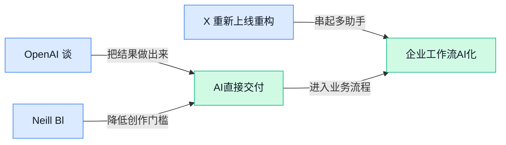

> AI 早报 · 每日早读 · 全网深度聚合

## **今日摘要**

```
Hugging Face称遭AI Agent端到端攻击，还借中国模型应对，安全护栏现实矛盾炸裂
Kimi K3被海外媒体点名搅动格局，Qwen 3.8与Anthropic同场算经济账，Kimi Work单独上线
OpenAI首谈长时任务模型安全对齐，特朗普政府被曝慢动作封锁中国AI模型震撼升级
```

### 🔵 产品与功能更新

1. **OpenAI 谈长时任务模型（能连续执行更久、更复杂任务的 AI）的安全与对齐新经验。**
OpenAI 这次分享的重点，不是单纯“模型更强了”，而是**长时任务**一旦落地，风险也会跟着变复杂：模型跑得越久，越可能在中间步骤里出现偏差或失控 💡。文中提到他们通过**迭代部署**（先小范围上线、边用边修正的发布方式）观察真实失败案例，再逐步补上防护措施，这比只在实验室里测试更接近真实世界。对普通团队来说，这意味着以后用 AI 处理多步骤工作流时，不能只看最终答案，还得关注它中间“怎么做”的过程。想看 OpenAI 的完整总结，可读 [官方安全说明(briefing)](https://openai.com/index/safety-alignment-long-horizon-models) 🚀


2. **Neill Blomkamp（《第九区》导演）发布首部完全用 AI 视频生成制作的短片。**
这条最值得关注的，不只是“导演用了 AI”，而是知名电影创作者开始把**AI 视频生成**当成完整创作工具，而不只是做特效试验 🎬。报道指出，这部短片由 AI 全程生成，说明这类工具正在从“新奇演示”走向更正式的内容生产流程。对品牌、营销和设计团队来说，这会继续拉低视频内容的试错成本，也会让“创意 + 快速生成”成为更常见的工作组合。具体报道可见 [完整新闻报道(briefing)](https://the-decoder.com/district-9-director-neill-blomkamp-releases-first-short-film-made-entirely-with-ai-video-generation/) ✨


3. **X 重新上线重构版 Android（谷歌手机操作系统）应用，历时一年完成。**
X 表示，经过一整年的重建后，这个新版 **Android 应用**已经面向全球上线 📱。从信息来看，这次重点是“**重构**”（不是小修小补，而是把底层架构重新整理一遍），通常意味着产品在性能、稳定性和后续更新效率上会更好。对用户未必会立刻看到戏剧性的新功能，但对平台来说，这是为后续功能迭代打地基。详情可看 [TechCrunch 报道(briefing)](https://techcrunch.com/2026/07/20/x-relaunches-a-rebuilt-android-app-after-year-long-effort/) 🚀

### 🟢 前沿研究

1. **Understanding Reasoning from Pretraining to Post-Training（从预训练到后训练，系统研究模型“推理能力”怎么形成）提出了一个更完整的推理观察框架。**
这篇工作把**预训练**（先用海量通用数据打基础，像先读完整个图书馆）和**后训练**（再针对特定目标补课、纠偏）放在同一条链路里看，核心是在追问：模型到底是在哪个阶段学会“会想”的 🤔。对非技术同事也很有启发——它提醒大家，今天看到的“会推理”并不一定只靠最后那次调教，而可能是前面长期积累的结果。对企业选型来说，这类研究会影响大家怎么判断一个模型是真懂业务，还是只是被“训练得更会答题”。可参考这篇 [论文概要页(briefing)](https://huggingface.co/papers/2607.16097) 💡


2. **When Does Muon Help Agentic Reinforcement Learning?（研究 Muon 优化器在 Agent 强化学习中什么时候真正有用）聚焦训练阶段的“提效边界”。**
这里的 **Muon**（一种用于训练模型的优化器，作用类似“帮模型更稳更快找到正确方向”）并不是面向普通用户的产品，而是更底层的训练工具 🛠️。论文关注 **Agentic Reinforcement Learning**（面向 Agent 的强化学习，让 AI 通过不断试错和反馈学会完成任务）在什么条件下能从这种优化器里受益。它的现实意义在于：不是所有“新训练配方”都能通吃全部场景，行业会更重视“什么情况下值得投入算力和时间”。相关内容可看 [HuggingFace 论文页(briefing)](https://huggingface.co/papers/2607.16169) 🚀


3. **RESOURCE2SKILL（把人类制作的多模态资料提炼成可执行 Agent 技能的方法）瞄准“把资料变能力”。**
这项研究关注如何从人类已经做好的**多模态资源**（同时包含文字、图片、视频等不同形式的信息）里，提炼出 Agent 真能执行的技能，而不只是“读懂内容” 📚。标题里的 **Distilling**（蒸馏，把复杂知识压缩成更容易调用的能力）可以理解为：把分散在教程、文档、演示里的经验，整理成 AI 能直接复用的操作模板。对企业来说，这很像把培训材料、流程手册、演示视频，逐步转成“AI 新员工”的可执行 SOP（标准操作流程，让做事步骤更一致）。原始信息见 [论文详情页(briefing)](https://huggingface.co/papers/2606.29538) ✨

4. **Cura 1T（面向医疗 Agent 场景的专用模型）显示垂直行业模型还在继续深挖。**
这篇论文强调 **specialized model**（专用模型，针对某个行业而不是“什么都做一点”的通用模型）在医疗 Agent 场景中的价值 🏥。这里的 **healthcare**（医疗健康服务）对模型要求往往更高，因为场景更专业、流程更复杂、容错空间也更小。对业务同事来说，信号很明确：未来 AI 不只是“一个通用聊天框”，而会越来越多地进入专业岗位，吃透行业知识和流程。可查看 [医疗模型论文页(briefing)](https://huggingface.co/papers/2607.15314) 💡

5. **RecGPT-V3（第三代推荐系统大模型）技术报告继续推进“推荐+生成式 AI”的结合。**
从标题看，这是一份 **technical report**（技术报告，通常用于系统说明模型设计、能力与实验结果）📄，聚焦推荐系统方向。所谓推荐系统，就是大家在电商、短视频、内容平台里看到的“猜你喜欢”，而 **RecGPT** 这类路线代表的是把大模型能力引入推荐场景，让推荐不只会“猜你爱看什么”，还更可能理解原因。对企业而言，这类研究直接关联用户停留时长、转化率和内容分发效率。详情可见 [技术报告页面(briefing)](https://huggingface.co/papers/2607.15591) 🚀

6. **Recursive Harness Self-Improvement（通过递归式流程让模型自我改进）探索 AI“自己练自己”的可能性。**
这里的 **recursive**（递归式，结果再喂回流程中，形成一轮轮自我迭代）可以理解成“做完一版后自己复盘，再继续优化下一版” 🔄。而 **harness**（约束与调度框架，像给模型套上一套可重复执行的工作流程）意味着这种自我提升不是随意发挥，而是在固定机制里反复跑。它之所以值得看，是因为行业一直希望降低人工标注、人工调参的成本，让模型能更自动地变强。原文入口见 [论文原始页面(briefing)](https://huggingface.co/papers/2607.15524) ✨

7. **S1-Omni（面向科学理解、预测与生成的一体化多模态推理模型）把“看图、读文、做判断”放进同一个系统。**
这里的 **multimodal reasoning model**（多模态推理模型，能同时处理文字、图像等多种信息并进行判断）是重点，因为科学问题往往不只靠一句话就能说明白 🧪。论文标题里还提到 **prediction**（预测，根据已有信息判断后续结果）和 **generation**（生成，输出新的内容或方案），说明它想覆盖从理解到产出的完整链路。对普通读者来说，可以把它看成一种更像“科研助理”的 AI：不只是回答问题，还试图读懂复杂材料并给出推断。可查看 [科学模型论文页(briefing)](https://huggingface.co/papers/2607.15686) 💡

8. **Loop the Loopies!（一项以“循环”机制为核心的研究工作）延续了前沿论文爱用新设定挑战模型能力的趋势。**
从当前提供的信息看，这篇论文公开的只有标题与链接，能确认的是它属于近期前沿研究的一部分，但具体方法与实验细节还需要以论文正文为准 🔍。标题中的 **loop**（循环，让同一流程多次反复执行）通常暗示研究关注反复推理、迭代求解，或某种闭环机制。对关注趋势的人来说，这类工作值得留意，因为“循环执行—再修正—再输出”正是很多 Agent 系统的关键思路。可先看 [论文入口页面(briefing)](https://huggingface.co/papers/2607.16051) 👀

### 🟡 行业展望与社会影响

1. **AI 正在改写中国迷你短剧产业，连编剧、演员和制作都被卷进来了。**
NBC News 把镜头对准中国**迷你短剧**这门约 **140 亿美元**的生意，核心变化是 AI 已经开始参与**写剧本、演角色、做制作** 🎬。这不只是“省点人力”这么简单，而是在重新定义内容生产链条：哪些岗位会被替代，哪些岗位会转向“用 AI 管 AI”。对业务和内容团队来说，这类变化尤其值得盯紧，因为高频、短平快、模板化强的内容，往往最先被自动化吃下 💡。[NBC 报道原文(briefing)](https://news.google.com/rss/articles/CBMitwFBVV95cUxNS2FuZlgxWm14YU56QkhaQVZmLWdBclpocEVaU2VjV2VvdEFvQ0ZXWUJWY0NBT3lyajY1QmRJTnA5TEE3djRGSWJCdU92cDNFOWVCZEhZN3dVYlBIc01oLTNoSXg0Y1Z4M25wU1NRSnhfRk5MRXMySDlhXzFROU1tRlZ0M0pCNEprMHcwdTZuRWFBX2FMZ0RIcUdVSFN5bjdZSEgycUxLT1FOSWlTeHVFTjhNZTdaNEk?oc=5)


2. **Hugging Face（全球最大 AI 模型共享社区）称遭遇 AI Agent（能自主执行任务的智能体）端到端网络攻击。**
这条消息之所以扎心，是因为它描述的不是普通黑客脚本，而是一个能自己完成多步操作的**全自动网络攻击** 🛡️。Hugging Face 表示，攻击方使用了 AI Agent，而防守方也不得不用 AI 回击，等于安全攻防进入了“机器打机器”的新阶段。对企业管理层来说，这意味着传统靠人工巡检、人工响应的安全流程，未来很可能跟不上节奏；**网络安全**会越来越像一场实时自动化对抗。[事件解读报道(briefing)](https://the-decoder.com/hugging-face-says-an-ai-agent-hacked-its-infrastructure-and-it-used-ai-to-fight-back/) [Axios 简讯原文(briefing)](https://news.google.com/rss/articles/CBMifEFVX3lxTE9NNHVrV0x5WWFrbjhTaGlSdEtHX0k4c0NCTm9KcmhwOHBXRzZmeENLR0J2aHlVQm9YOWw3MDdLUE1LMkxYVWVKWnRVSnozcTFuX0NXUlZEcGIyeFJEOFhOYjBkQUhhbmMzUWpadXJpX2tKTThrWTBUTU9iOWI?oc=5)

3. **Hugging Face（全球最大 AI 模型共享社区）称曾借助中国 AI 模型应对攻击，暴露“安全护栏”现实矛盾。**
Fortune 这篇报道把焦点放在一个很敏感的问题上：当美国模型的**guardrails（安全护栏，限制模型输出危险内容的规则）**让防守动作受限时，企业会不会转向别家的模型来完成防御 ⚠️。如果报道属实，这反映出一个越来越现实的行业矛盾——**安全限制**一旦过严，可能也会影响正当防御效率。对政策制定者和企业采购团队来说，这不是单纯的技术选型，而是“风险控制”和“实际可用性”怎么平衡的问题。[Fortune 报道原文(briefing)](https://news.google.com/rss/articles/CBMi8AFBVV95cUxPZl8yc3o4Q0FyYlRxRzZzTE0wV0RydTlJVEpGNmlEOGtQdHFOYzZFbmRxR1JXRHJRZFhrN1VCNlpuaEY3b3NVbUhkWkp4eDlwUjhsWVlOTWlScjFVeG1JMlRJY0pvZVdXRGR4M1EwSDRYVk9VUTRiTmdIV1BFRUstM0YzNjExNnRQc2VRR01uU3luWmxvYTVvcU8tNDZ0RUhzMnRsQVNqNnFLNlo3ZExuUUxxQkZpem12TkM3aEFTQXUwT0FJQUNMejhsQVJ0U2QtRjYxNHFhbUcyWjJQNDJmdXFvbUhlb0lMUjgzTnNmb0Q?oc=5)

4. **Anthropic 推出 AI for Science（用 AI 加速科研）罕见病研究资助计划。**
Anthropic 宣布开放面向**罕见病研究**的资助项目，属于其 AI for Science 计划的一部分 🔬。这类项目的意义，不在于再发一个更会聊天的模型，而是把 AI 往更具体的社会议题上落：帮助科研人员处理复杂资料、缩短研究路径、提升早期探索效率。对普通职场人来说，这也是个很直观的信号——AI 的价值正在从“办公提效”扩展到**医学与公益导向研究**。[Anthropic 官方公告(briefing)](https://www.anthropic.com/news/rare-disease-research-grants)

5. **特朗普政府被曝正通过制裁与软性施压，推动对中国 AI 模型的“慢动作封锁”。**
The Decoder 的说法很直接：美国并非一次性明令禁止，而是在用**制裁**和**soft pressure（软性施压，指不直接下禁令、但通过政策和合作关系形成约束）**逐步收紧中国 AI 模型的活动空间 🌐。这类做法的影响不只在科技圈，还会波及企业采购、跨境合作和模型接入选择。对公司来说，今后评估 AI 工具时，除了看效果和价格，**地缘政治风险**也可能变成正式考量项。[完整分析报道(briefing)](https://the-decoder.com/trump-administration-reportedly-builds-a-slow-motion-ban-on-chinese-ai-models-through-sanctions-and-soft-pressure/) [Axios 相关报道(briefing)](https://news.google.com/rss/articles/CBMibkFVX3lxTE9PWTlIa1VpT2FIbVZmcFZOeURoNEtPdEE5MzVib0YxNGhUOWg2cFBncmxoLU1idmN4eXhLX1FxQzZpbjNIck9NdEZZcVBMNlRpaTVlTHNwSi1KYzYweW9xMm1RWGpWT0pyZ216Wk53?oc=5)

6. **美国 AI 安全机构负责人上任 3 个月即辞职，监管稳定性再打问号。**
CNBC 报道称，特朗普政府旗下负责 AI 安全事务的机构负责人在任仅 **3 个月**便辞职，这让外界对美国 AI 监管的**连续性**和**执行稳定性**产生更多疑问 🏛️。AI 安全机构本来承担的是“给高速发展的技术装刹车和护栏”的角色，如今关键岗位频繁变动，往往意味着政策方向更难预测。对企业和投资方来说，监管不确定性本身就是一种风险，因为它会影响合规、合作和长期投入判断。[CNBC 报道原文(briefing)](https://news.google.com/rss/articles/CBMipAFBVV95cUxQakNEQlhTN0EyQ19FQnA4T2Nub05IWmNBUnAteVZTNXM3Skd5ZjB2QUJiWG1qdHJMVFJkejlJd3V5aUdoaVlOc1FxM2Fjb3FtUEMzb01iOWJHX0F3MXJLYW5lNGVtc2hrMjRpOFJEb3d5RWpnTVZ0T2Nfc0IwelFZSFRpU3NKbmZCMTFRczE3TUZXaGR4VGJKX0FnN2xwWjJxam9LWtIBqgFBVV95cUxOczQyenJJUXNSUWZ3bXRCRXJuR0ZzNnN1eVJYVDNmSzJyTC1FeVhCMkMzQ2N0TERWbnNPTzR3MGlIYl9nZGgwMzJXWF90QVZDQzFnUU9DeTQ2RDcxQkZkRWl3TmhIRFQxQ1k3QzQ2a21OUi1MTmk2S3paT1drR2RraVFubjU5NG1iWVVlX0J5TWdNVW1KbGtWdmxwcXpLSEtHbF8yVmNQY2xZZw?oc=5)

### 🟣 开源TOP项目

1. **llm-space（一款用来试验 Agent 点子的桌面应用）把调试、回放和评测放进一个工作台。**
这个项目主打 **本地优先**，适合先在自己电脑上快速搭建 Agent 流程，再决定是否接入云端托管 🚀。它能查看每一步 **harness（Agent 执行时的“操作流水线”，方便定位哪一步出了问题）**，还能把失败过程重新回放，特别适合排查那些“偶发翻车”的场景。项目还提供 **performance evaluation（性能评测，用来比较不同方案谁更稳、更快）**，对需要持续优化 Agent 效果的团队很有帮助 💡。想看功能和安装方式，可以直接翻 [GitHub 项目页(briefing)](https://github.com/deer-flow/llm-space)。


2. **SkillHub（企业自建的 Agent 技能注册中心）瞄准权限治理和私有化部署。**
这个开源项目面向企业内部场景，核心是把各种 Agent 技能做成可发布、可版本管理的“能力包” 📦。它支持 **RBAC（基于角色的权限控制，简单说就是按岗位分配谁能看、谁能改、谁能发）** 和 **audit logs（审计日志，记录谁在什么时候做过什么操作）**，对合规要求高的公司尤其重要。部署上既能用 **Docker（把软件和运行环境一起打包的容器工具）**，也支持 **Kubernetes（管理大量容器的系统，适合大规模企业部署）**，还能放在本地机房做 **on-premise（私有化本地部署，数据不出公司）**。项目详情可见 [GitHub 仓库页(briefing)](https://github.com/iflytek/skillhub)。


### 🔴 社媒分享

1. **Kimi K3（Kimi 最新推出的大模型）被海外媒体点名，成了又一款搅动 AI 格局的中国模型。**
海外科技媒体把 **Kimi K3** 放到“中国新一代强模型”这个语境里单独解读，说明它的关注度已经不只停留在中文圈 👀。这类讨论背后，核心不是单一跑分，而是大家开始重新评估中国模型在**能力、成本和全球影响力**上的位置。对普通职能同事来说，这意味着以后可选的 AI 工具很可能越来越多，不再只盯着少数几家海外厂商。[完整报道解读(briefing)](https://www.bigtechnology.com/p/everything-you-need-to-know-about)


2. **“Reverse-engineering（逆向工程，把现成设备或软件拆解研究其工作方式）变便宜了”，社媒作者直指编码 Agent 正在降低自动化门槛。**
Simon Willison 提到，越来越多人开始用**编码 Agent**去研究家里的设备并做自动化改造，这本来是过去只有很会写程序的人才做得到的事 ⚙️。这里的 **reverse-engineering（逆向工程）**，可以理解成“没有说明书也要摸清它怎么运作”；而 **automation（自动化，让系统自己完成重复动作）** 的门槛，则因为 AI 帮忙写代码而明显下降。对企业来说，这种变化的现实意义是：很多原本嫌麻烦的小流程、小工具，未来都可能更快被内部人员自己搭起来。[原文观点分享(briefing)](https://simonwillison.net/2026/Jul/20/cheap-reverse-engineering/#atom-everything)

3. **《Who’s Afraid of Chinese Models?（谁在害怕中国模型？）》把中国模型争议直接摆上台面。**
这篇文章讨论的重点，不只是“该不该用中国模型”，而是行业里对**模型蒸馏**的态度是否存在双标 🤔。所谓 **distillation（模型蒸馏，把大模型的能力压缩迁移给更小模型）**，本质上像是“让小模型向大模型抄作业学方法”；而文章认为，一些实验室一边反对别人这样做，一边又受益于更开放的生态。对公司管理者和业务团队来说，这类争论会继续影响今后模型的**合规、采购与合作选择**。[原文评论文章(briefing)](https://stratechery.com/2026/whos-afraid-of-chinese-models/) [转引摘要页面(briefing)](https://simonwillison.net/2026/Jul/20/afraid-of-chinese-models/#atom-everything)

4. **Kimi K3（Kimi 最新模型）、Qwen 3.8（阿里通义千问的新版本模型）与 Anthropic 被放进同一篇分析，话题指向前沿实验室的经济账。**
这篇分析把几家头部模型放在一起看，讨论的不只是技术能力，还有**前沿实验室**怎么维持投入、回收成本以及面对竞争压力的处境 💡。其中“实验室经济学”可以理解为：当训练模型越来越烧钱，谁能持续投入、谁能形成商业闭环，就会决定下一阶段的话语权。对非技术同事来说，这提醒我们一个现实：AI 行业的胜负，不只是模型聪不聪明，还取决于背后的**资金结构与商业模式**。[分析原文页面(briefing)](https://www.emergingtrajectories.com/lh/frontier-lab-economics/)

5. **Kimi Work（Kimi 推出的办公协作产品）单独上线，Kimi 正把能力从聊天延伸到工作场景。**
从独立产品页来看，**Kimi Work** 已经不是单纯“问答型 AI”，而是在朝更明确的**办公使用场景**推进 🚀。这类产品通常意味着 AI 不再只回答问题，而是更深地参与资料整理、任务处理和日常协作流程。对业务、运营、行政等团队来说，真正值得关注的是：Kimi 正试图从“一个模型”变成“一个能落地到工作里的工具”。[Kimi Work 产品页(briefing)](https://www.kimi.com/products/kimi-work)

---



### 📊 行业洞察（今日 4 条）

1. Hugging Face（全球最大 AI 模型共享社区）称遭遇全自动 AI 攻击，OpenAI 同时强调长时任务模型要盯中间过程
  【洞察】两件事放一起看，AI 现在最大的风险已不是“答错一句话”，而是会连续做很多步错事；真正的护栏要管过程，不只管结果

2. Hugging Face 说美国模型的安全护栏妨碍防守，特朗普政府又被曝推动限制中国模型
  【洞察】这说明模型竞争已不只是能力和价格，比的是“谁在关键场景真能用”；安全、政策和可用性开始互相打架，采购会更复杂

3. Neill Blomkamp（《第九区》导演）用 AI 做完整短片，中国迷你短剧也在把编剧、演员、制作一起卷进 AI
  【洞察】视频生成已经从“玩具演示”进入正式生产链，先被改写的不是电影工业，而是高频、模板化、求快的内容行业

4. Kimi K3 被海外热议、需求 48 小时内吃满显卡产能，相关分析又把 Kimi、Qwen 和 Anthropic 放进同一张经济账
  【洞察】现在头部模型的瓶颈不只是谁更聪明，而是谁扛得住流量和成本；热度能带来客户，也可能立刻拖垮交付能力

### 💭 对我们的启发（今日 3 条）

1. OpenAI 提醒长流程风险、Hugging Face 又遭多步自动攻击，说明我们的视频剪辑工具若让 AI 连续改脚本、找素材、出片，必须给用户看清每一步并能随时人工接管。

2. 导演全 AI 短片和迷你短剧自动化一起出现，验证“出片会越来越便宜”。我们不能只卖剪辑功能，得把价值放在爆款模板、品牌风格控制和稳定交付上。

3. Kimi K3 因需求过猛暂停新订阅，给我们泼个冷水：接入再强的模型也可能遇到算力挤兑。产品上要提前准备多模型切换和降级方案，别把服务绑死在一家。


---

> 本周周报：[第30周综合分析](https://zhuxinfei.github.io/ai-daily-site/blog/weekly/2026-w30/)
