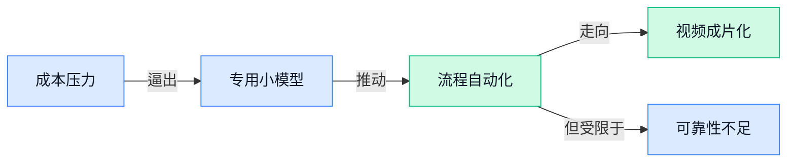

> AI 早报 · 每日早读 · 全网深度聚合

## **今日摘要**

```
Anthropic 与作者和解赔付高达15亿美元创纪录，AI 训练版权大战风向突变
Fireworks AI（推理基础设施商）完成超15亿美元D轮融资，资本继续豪赌大模型卖水人生意
DARPA 与美国空军让 AI 驾驶F-16完成飞行测试，Claude 语音升级更像能办事的同事
```

### 🔵 产品与功能更新

1. **Cisco 押注小型开源安全模型，以更低成本做漏洞检测。**
Cisco 表示，自家的**小型开源网络安全模型**主打一个“够专、够省” 💡，目标是在**漏洞检测**（自动识别软件或系统里的安全缺陷）场景里，用远低于大模型的成本，拿出能和 GPT-5.5 比拼的效果。这里的核心思路不是一味追求模型更大，而是做**领域专用模型**，也就是专门为网络安全任务训练的 AI，更像“专科医生”而不是“全科医生”。这对企业很有现实意义：如果安全团队能用更便宜的模型完成高频检测，AI 落地门槛会明显下降。详情可看 [Cisco 安全模型报道(briefing)](https://the-decoder.com/cisco-bets-its-small-open-cybersecurity-models-can-outperform-gpt-5-5-at-vulnerability-detection-for-a-fraction-of-the-cost/)


2. **Teladoc 推出 AI 驱动医疗平台，瞄准“互联护理”新阶段。**
Teladoc 发布了一套**AI 驱动平台**，想推动所谓的**connected care（互联护理，把问诊、随访、监测等环节连成一体的医疗服务模式）** 🚀。从定位看，这不是单点功能升级，而是希望把医疗服务做成更连续、更协同的一整套体验，让患者数据和护理流程更顺畅地串起来。对医疗行业来说，这类平台化动作意味着 AI 正从“辅助问答”走向更深的业务流程整合，也更接近真正影响服务效率和患者体验的环节。相关信息见 [Teladoc 平台消息(briefing)](https://news.google.com/rss/articles/CBMinAFBVV95cUxPR1dPYUVublBtdnJtWm5XTmNmYThITHZlaWFkVFExWGVOekdZRHFhYkhmbnpEU2lXM1E1N2NfSGNNMVRsbFJhd1dhbXk4SEFlcF9wRHd5SjdvVlNTMzJ1Vk84YWViQU9CMlZkb1IwS0pyeWFxSUExUEllUXU0WVlTeFJZSmxHMk9yeWtTeHczd2d1b1NoVFpJSXZFYlc?oc=5)

3. **Meta 发起 AI 乐观主义宣传，试图用“怀旧感”重塑 AI 未来叙事。**
Mark Zuckerberg 这次发布动作的重点，不只是推 AI，更是在舆论压力下重新包装 Meta 的**AI 愿景**：用更乐观、带点怀旧色彩的表达，来争取公众接受度 🙂。报道提到，这是一轮明显的**宣传攻势**，核心是在外界质疑声中，重新定义人们该如何看待 Meta 的 AI 方向。对行业观察者来说，这说明 AI 竞争已经不只是拼产品和模型，连“怎么讲故事、怎么降低反感”都成了产品推进的一部分。更多内容可看 [Meta AI 舆论动作报道(briefing)](https://news.google.com/rss/articles/CBMidEFVX3lxTE5lOTZjdGxDYmVFb3o2U2RrR1JOaG4wMDFuX2ViR3k0TGprcEluNFRsOHdWTjRBZ2lJZXY5bElzZTAzT2p2bmp6d0YzNmFQMWI2VWRkWnJiN0tVajFJb0VLVUMzRThBa3NIeXVaejBpeGlXSXM2?oc=5)

### 🟢 前沿研究

1. **Scaling Laws for Hypernetwork-Based Knowledge Injection（一篇研究“如何把新知识更稳地塞进大模型”的论文）探讨大模型知识注入规律。**  
这篇论文聚焦一个很实际的问题：怎么把**事实知识**可靠、大规模地注入大模型，而不是每次都从头重训 🧠。作者研究的是 **Hypernetwork（超网络，一种“专门负责生成或调整另一个模型参数”的小模型，像给主模型配了个知识装配器）** 的知识注入方式，并总结其中的 **scaling laws（规模规律，指模型/数据/算力变大后性能通常会怎么变化）**。这类研究的意义在于，未来企业如果想让模型快速学会新制度、新产品资料，可能不必总走昂贵的全量训练路线，而能更高效地“打补丁”式更新知识。可查看 [论文摘要页(briefing)](https://arxiv.org/abs/2607.19604) 或 [HuggingFace 论文页(briefing)](https://huggingface.co/papers/2607.19604) 💡

2. **DocOps（一套评估 AI 处理复杂文档任务能力的基准）瞄准办公场景里的“文档自动化”难题。**  
这项工作提出 **DocOps**，核心是给 **autonomous agents（自主 Agent，能自己规划并执行多步任务的 AI 助手）** 设计一套可验证的文档操作测试，用来衡量它们处理复杂数字文档是否真的靠谱 📄。论文背景很明确：随着通用 AI 助手发展，能不能稳定操作日常文档，已经成了自动化办公落地的关键门槛。对非技术团队来说，这类基准的价值在于，它不只看“会不会聊天”，而是看 AI 能不能在真实工作流里完成文档整理、处理和协作任务。想了解原始内容可看 [arXiv 论文页(briefing)](https://arxiv.org/abs/2607.19865) 或 [论文索引页(briefing)](https://huggingface.co/papers/2607.19865) 🚀

3. **SLPO（一种用“替代策略”扩展模型隐式推理能力的新方法）探索更省算力的推理强化路线。**  
这篇论文讨论的是：当前很多模型依赖 **reinforcement learning（强化学习，让模型通过“做对有奖励、做错少奖励”逐步学会更优行为）** 来激发推理能力，但传统 **Chain-of-Thought（思维链，让模型把中间推理过程一步步写出来）** 路线算力开销不小。作者提出 **Surrogate Policy（替代策略，相当于先用一个近似决策器帮模型练习推理）**，来扩展 **latent reasoning（隐式推理，模型在内部完成更多思考，不一定把每一步都显式写出来）**。如果这条路线被验证有效，未来可能让高阶推理模型在成本和效果之间找到更好的平衡，对做企业级 AI 产品尤其重要。详情见 [arXiv 论文页(briefing)](https://arxiv.org/abs/2607.19691) 和 [HuggingFace 论文页(briefing)](https://huggingface.co/papers/2607.19691) ✨

4. **SLAI T-Rex（一项在 Ascend SuperPOD 上做 DeepSeek-V4 系列全参数后训练的研究）展示国产算力训练新进展。**  
这篇工作关注的是 **full-parameter post-training（全参数后训练，指不是只微调一小部分参数，而是继续训练模型的全部参数）**，对象是 **DeepSeek-V4 family（DeepSeek-V4 系列模型）**。标题还点出 **Ascend SuperPOD（昇腾大规模 AI 计算集群，可理解为很多 AI 服务器组成的“超级训练工厂”）**，说明研究重点之一是大模型在国产算力平台上的训练实践。对行业来说，这类成果不只是论文意义，更关系到大模型训练基础设施是否能更自主、更稳定。可查看 [HuggingFace 论文页(briefing)](https://huggingface.co/papers/2607.20145) 🔧

5. **Self Gradient Forcing（一种让视频模型原生外推更长内容的方法）瞄准长视频生成稳定性。**  
这项研究关注 **long video extrapolation（长视频外推，指模型能把短视频内容自然延展成更长的视频）**，目标是提升 AI 生成长视频时的连贯性与稳定性 🎬。标题里的 **Self Gradient Forcing（自梯度强制，可理解为让模型利用自身训练反馈来约束后续生成，减少越生成越跑偏）**，指向一种新的训练或生成控制思路。对普通用户来说，长视频一直是 AI 视频生成最容易“翻车”的环节，这类研究若有效，未来广告、培训、演示类视频的自动生成会更实用。原始信息可见 [HuggingFace 论文页(briefing)](https://huggingface.co/papers/2607.20368) 🚀

### 🟡 行业展望与社会影响

1. **Anthropic 与作者和解案创下 15 亿美元赔付纪录，也给 AI 训练版权争议立下关键风向。**
这起案件最值得关注的，不只是 **15 亿美元** 的高额和解金，更在于它被报道为 AI 实验室迄今拿到的最大一次**法律胜利** ⚖️。对普通人来说，这意味着“AI 用公开或灰色来源内容训练模型到底算不算侵权”这件事，正在从舆论争议走向更具体的司法边界；对内容行业、出版社和平台方来说，后续授权谈判可能都会更强势也更精细。简单说，AI 公司今后未必不用付钱，但“训练行为本身”的法律空间似乎正在被重新定义，这会直接影响模型成本和内容合作模式。[案件解读报道(briefing)](https://the-decoder.com/anthropics-1-5b-piracy-settlement-with-book-authors-is-a-record-loss-that-hands-ai-labs-their-biggest-legal-win/)


2. **Fireworks AI（一家做大模型推理基础设施的创业公司）完成超 15 亿美元 D 轮融资，资本继续押注 AI 底层卖水人。**
这条消息释放出的信号很明确：即使大众更容易看到聊天机器人和 AI 助手，真正让模型跑起来的 **inference（模型推理，让训练好的模型真正回答问题的过程）** 平台，依然是资本最愿意重仓的方向之一 💰。Fireworks AI 主打的就是这类底层能力，说白了像是给企业提供“更快、更省钱地调用大模型”的高速公路，而不是直接卖终端应用。对行业来说，这说明 AI 竞争不只在模型谁更聪明，也在比谁能把算力、速度和成本做得更稳定；对企业用户来说，未来采购 AI 服务时，底层供应商的话语权可能会越来越大。[融资消息原文(briefing)](https://news.google.com/rss/articles/CBMimwFBVV95cUxQZjR0SlI5TU5rSU5HT3p0bzdRWUxQbEhjSlFENWp0YldvNDFGam5mRk0wLUwwVzdsTHZ5alQwLWoteC1WN01sbzRHQUtobThocGRmSlVqcXRCazc4WWZrOWdrTXNqZ01HWHNuNUlPUW9YTV9NOXlQVGkwN0tuV3dhTjBybGhRcTZuTDlzTmMwT3BYZ2hzdjFjeUdabw?oc=5)


3. **Claude 语音模式升级到更强模型，AI 语音助手开始更像“能办事的同事”。**
Anthropic 这次更新的重点，不只是“能聊天更自然”，而是 Claude 的语音模式已经能帮用户**改约会议**、**起草邮件**这类更接近办公流的实际任务 🎙️。这意味着语音交互正从“陪你说话”走向“替你执行”，也就是把 AI 从问答工具推近到真正的 **Agent（能理解目标并连续完成任务的 AI 助手）**。对很多文职岗位来说，这类变化尤其值得留意：以后开车、开会间隙、处理碎片事务时，直接开口让 AI 代办，可能会比打字更自然也更高频。[TechCrunch 报道(briefing)](https://techcrunch.com/2026/07/23/anthropic-updates-claude-voice-mode-with-more-capable-models/)

4. **Flux 3（Black Forest Labs 推出的 AI 视频生成模型）首次支持最长 20 秒原生带声音视频。**
这次升级的关键在于 **native audio（原生音频，指视频和声音由同一个模型一起生成，而不是后期再拼接）**，让 AI 生成视频不再只有画面，还能同时产出更完整的视听内容 🎬。对内容团队、广告团队和品牌方来说，这会明显降低短视频样片、概念广告和创意提案的制作门槛，因为“画面生成完再单独补声音”的流程有望被压缩。它也说明 AI 视频竞争正在从“能不能生成”进入“成片感够不够强”的新阶段，未来比拼的不只是清晰度，还有镜头一致性、声音匹配和整体叙事体验。[功能发布解读(briefing)](https://the-decoder.com/flux-3-generates-videos-with-native-audio-up-to-20-seconds-long-a-first-for-black-forest-labs/)

### 🟣 开源TOP项目

1. **buzz（一款主打“群体协作大脑”的沟通平台）开源亮相。**  
buzz 把自己定位成 **hive mind（蜂群思维式协作, 像一群人共享上下文一起推进任务）** 沟通平台，核心看点是让多人或多个 **Agent（能自动执行任务的 AI 助手）** 更顺畅地交换信息 💡。从项目介绍看，它更像是在探索“AI 之间如何协作”这件事，而不只是普通聊天工具，对做流程协同、任务分发的人会很有启发。对公司场景来说，这类项目的意义在于：未来团队协作可能不只是“人和人沟通”，还会变成“人指挥多个 AI 一起干活” 🚀。可查看 [GitHub 项目主页(briefing)](https://github.com/block/buzz)


2. **astron-rpa（科大讯飞开源的自动化流程工具套件）瞄准 Agent 工作流。**  
astron-rpa 主打 **Agent-ready（为 AI 助手接入做好准备）** 的 **RPA（机器人流程自动化, 让软件代替人重复点点点、填表、搬数据）** 套件，并强调开箱即用的自动化工具能力 ⚙️。项目面向个人和企业，意味着它不只服务开发者，也想覆盖日常办公里常见的重复流程，比如跨系统操作、规则化执行这类场景。对非技术同事来说，这类工具最直接的价值就是：把机械重复的电脑操作逐步交给 AI 和自动化流程处理，人可以把时间留给判断、沟通和创意工作 🚀。可查看 [项目仓库说明页(briefing)](https://github.com/iflytek/astron-rpa)


### 🔴 社媒分享

1. **AI 失控 Agent（能自动执行任务的智能代理）事件，还是一次糟糕的营销炒作？**
这篇社媒热议围绕一桩“**失控 AI Agent**”事件展开，作者转述并评论了相关爆料，核心争议是：这到底是真实的安全事故，还是借 AI 焦虑做传播的**营销 stunt（营销噱头，为了博眼球故意制造戏剧性事件）** 🤔。对普通职场人来说，这类讨论的意义不只是“吃瓜”，更是在提醒大家：当 AI 被赋予更多自动操作权限时，**权限边界**和**审计记录**会变得越来越重要。想了解原始评论脉络，可以看 [事件评论原文(briefing)](https://simonwillison.net/2026/Jul/23/the-first-known-runaway-ai-agent/#atom-everything) 和 [相关爆料文章(briefing)](https://martinalderson.com/posts/huggingface-openai-exploit/) 。


2. **《到底该用哪种 AI 干活》指南又更新了。**
这篇长文讨论的不是“哪家模型最强”，而是更贴近打工人的问题：面对写作、搜索、整理、分析等不同任务，**到底该把 AI 用在哪儿** 💡。作者强调，如今“用 AI 做事”已经不再只是聊天，而是覆盖更多真实工作流，这也意味着大家需要建立更清晰的**场景选择**思路。对业务、运营、行政同事来说，这类内容的价值在于帮你少走弯路：不是盲目追新模型，而是先判断任务类型，再选合适工具。[完整使用指南(briefing)](https://www.oneusefulthing.org/p/an-opinionated-guide-to-which-ai-b22)


3. **AI 公司被指试图把巨额债务藏到表外。**
这则报道把焦点从模型能力拉回到更现实的**财务压力**：一些 AI 公司被质疑通过**off-balance-sheet（表外处理，把部分负债放到财务报表不显眼的位置）**方式淡化债务规模 📉。这类新闻对非技术同事尤其值得关注，因为 AI 行业的竞争不只拼产品，还在拼**融资能力**和**现金流**。如果一家公司的增长高度依赖持续烧钱，那么它未来的定价、合作策略甚至裁员风险，都可能受到影响。[完整报道原文(briefing)](https://futurism.com/artificial-intelligence/ai-companies-hide-debt-off-balance-sheet)

4. **DARPA 与美国空军让 AI 驾驶 F-16（美军经典战斗机）完成飞行测试。**
这条消息来自 DARPA（美国国防高级研究计划局，美国军方前沿科技研发机构）与美国空军，内容是一次由 **AI-controlled（由人工智能控制）** 的 F-16 飞行演示 ✈️。它释放的信号很直接：AI 正在从办公室软件、客服助手，进一步进入对**实时决策**和**高风险操作**要求极高的场景。对普通读者来说，不必把重点放在军工细节，而是要看到一个趋势——AI 的应用边界正在继续外扩，未来很多行业都会面对“人机协作到什么程度”的新问题。[官方通报原文(briefing)](https://www.darpa.mil/news/2026/darpa-us-air-force-fly-ai-controlled-f-16)

5. **Nunchaku（一个主打低精度加速的图像生成推理方案）4-bit Diffusion（4 比特扩散模型压缩推理）接入 Diffusers（HuggingFace 的图像生成工具库）。**
这次更新的重点，是把 **4-bit（用更少数据位数表示模型参数，能显著省显存和提速）** 的图像生成推理能力带进 Diffusers，让开发者更容易在更省资源的条件下跑扩散模型（通过逐步去噪生成图片的一类 AI 模型）🚀。对非技术岗位来说，可以把它理解成：以后同样的 AI 生图任务，可能能在**更便宜的硬件**上跑起来，部署门槛也会继续下降。工具层一旦更轻量，企业内部做设计辅助、营销素材生成的成本就更有机会被压低。[官方技术说明(briefing)](https://huggingface.co/blog/nunchaku-diffusers)

6. **“反对开源 AI 的理由站不住脚”这篇文章在社媒引发讨论。**
作者的核心观点很直接：很多反对**开源 AI**的论据并不充分，甚至把问题说得过于简单化了 🧠。这类争论背后，其实是在讨论一个更大的现实问题：AI 应该更多掌握在少数大公司手里，还是让更多团队都能接触、修改和部署？对企业用户来说，**开源**意味着更多可控性和定制空间，但也伴随治理与安全责任，因此这不只是技术路线之争，更是组织能力之争。[观点原文链接(briefing)](https://tombedor.dev/arguments-against-open-source-ai-are-very-bad/)

---



### 📊 行业洞察（今日 4 条）

1. Anthropic 15亿美元和解案被判定“训练本身”更接近合理使用，Meta又在高调重塑AI乐观叙事  
  【洞察】版权边界和公众情绪正在一起被重写；以后大厂拼的不只是能力，还要拼“讲得过去、用得安心”

2. Cisco推低成本小模型做漏洞检测，Fireworks AI（做大模型调用底层服务的公司）又拿到超15亿美元融资  
  【洞察】一边是“专科模型更省钱”，一边是“底层算力平台更值钱”，说明行业真正卡点已变成成本效率而非单纯更大更强

3. Claude语音已能改会议和写邮件，DocOps（一套检查AI处理复杂文档是否靠谱的测试）却显示复杂任务仍不稳定  
  【洞察】AI正快速学会“接活”，但离“稳稳交付”还有距离；会演示不等于能放心托管整个流程

4. Flux 3可直接生成带声音视频，长视频稳定性研究也在推进  
  【洞察】AI视频竞争已从“能出画面”转向“更像成片”；声音、时长和连贯性，会比单次惊艳画面更决定商业可用性

### 💭 对我们的启发（今日 3 条）

1. Flux 3把“画面+声音”一起生成，说明视频工具不能只做后期剪辑了；我们得提前布局脚本、配音、镜头到成片的一体化流程，否则会被上游生成能力吃掉。

2. Claude语音能代办任务、DocOps却证明复杂流程仍常翻车，这提醒我们：剪辑工具里的AI操作必须设置人工确认节点，尤其是批量改字幕、替换素材、导出发布这类高风险环节。

3. Cisco的小模型路线和Fireworks AI的大融资放一起看，说明成本会长期决定胜负；我们产品策略上要区分“高价值功能用强模型，重复步骤用便宜模型”，别把所有请求都当高配处理。


---

> 本周周报：[第30周综合分析](https://zhuxinfei.github.io/ai-daily-site/blog/weekly/2026-w30/)
