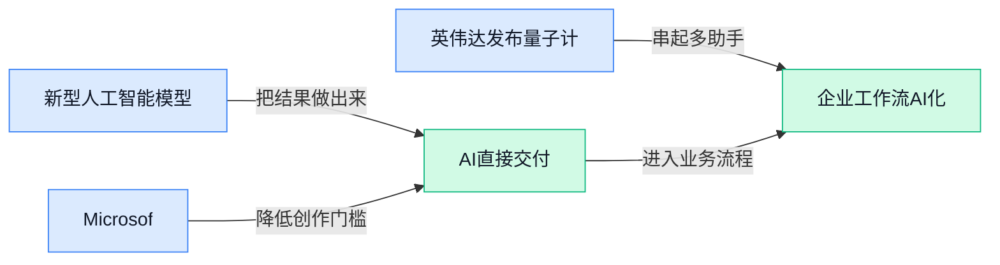

> AI 早报 · 每日早读 · 全网深度聚合

## **今日摘要**

```
英伟达、OpenAI商谈2500亿美元兜底，Ilya（OpenAI前高管）获50亿
微软MAI-Cyber-1-Flash突袭上线，MDASH（安全平台）接入智能体防线
Anthropic定调开放权重，Claude借Cognizant（IT服务商）杀入企业
```

### 🔵 产品与功能更新

1. **新型人工智能模型（从数据中学习规律的程序）可高效测量土壤碳（储存在土壤里的碳）。**  
这项更新聚焦一个很“接地气”的问题：如何更有效地测量**土壤碳** 🌱。土壤碳（储存在土壤中的碳，和农业、生态监测、碳管理都有关）过去往往需要较复杂的检测流程，而报道提到的新模型主打**高效测量**。对业务同事来说，这类工具的意义在于：人工智能不只会聊天，也正在进入农业与环境数据管理这种“看不见但很重要”的场景 💡。[土壤碳测量报道(briefing)](https://news.google.com/rss/articles/CBMie0FVX3lxTE85WmR2bmNBZ05aX2F3emFaRTl6UWVDOFZ2ZXd3VHNaOU5xVjl4R3A3dzF3T0dUOHR6MXZDOEE0Y1dyT0NncmJJNDk3cUkwMjVsczZVMjhyejJfYk1oMjhnZ1o2akFHRUs5bnNveVRKTm1NTDBiaXlQSjZnUQ?oc=5)


2. **Microsoft 推出首个网络安全模型（专门用于安全场景的人工智能模型）和智能体式网络安全系统（像助理一样分步骤处理安全任务的系统）。**  
Microsoft 本周加强了自己的**人工智能网络安全**产品线，发布了首个面向安全场景的模型，并带来一个新的安全平台 🚀。这里的网络安全模型（把安全相关数据和任务作为重点处理对象的模型）可以理解为“更懂安全问题的人工智能助手”。智能体式系统（能围绕目标拆解步骤、调用工具、推进任务的系统）则说明安全产品正在从“只提醒风险”走向“更主动地协助处理流程” 💡。[安全新品报道(briefing)](https://techcrunch.com/2026/07/27/microsoft-launches-its-first-cyber-model-and-a-new-agentic-cybersecurity-system/)

3. **英伟达发布量子计算（利用量子力学特性进行计算的新型计算方式）人工智能校准模型（帮助调整系统状态的模型）。**  
英伟达这次发布的是面向**量子计算**的人工智能校准模型，方向是推动**人工智能 + 量子计算**融合 ⚡。量子计算（不是传统电脑那套“0 和 1”思路，而是利用量子特性探索更强计算能力）仍是前沿领域，校准模型（帮助系统调整到更合适状态的模型）则属于其中的关键辅助环节。虽然离普通办公场景还比较远，但它释放的信号很清楚：人工智能正在深入更底层、更硬核的科研与计算基础设施中 (๑•̀ㅂ•́)و。[量子校准模型报道(briefing)](https://news.google.com/rss/articles/CBMiWEFVX3lxTE9KNUlOSmNCRGh2bDBtTVl4T0NiY01XcER2dlVLUzJrT0hsdi1WYy1nb0NSQ0NJWVBzenNuX1BqbXQ4d21HWklodUZXZnpzSmpoaWU1UGl0OEE?oc=5)

### 🟢 前沿研究

1. **OpenAI 研究：AI（人工智能）正在拓展人们的工作边界。**  
OpenAI 的新研究关注一个很现实的问题：AI 不只是“替人做事”，也在让员工跨出原本岗位边界，承担更多不同类型的任务 🚀。文中提到，ChatGPT 用户正在跨角色使用 AI，这意味着**岗位分工**和**工作流程**可能会被重新塑形。这里的“任务跨角色”可以理解为：运营可能更容易做数据分析，人事可能更快写政策说明，设计也能参与文案和方案整理 💡。这份研究适合管理者和业务团队关注，因为它讨论的是 AI 如何改变“人具体在公司里做什么”。[官方研究文章(briefing)](https://openai.com/index/how-ai-is-expanding-what-people-do-at-work)

2. **NVIDIA OmniDreams（英伟达实时生成式自动驾驶仿真模型）瞄准自动驾驶安全评估。**  
这篇论文讨论的是自动驾驶里的难题：车企需要在大量罕见、危险但现实中可能发生的场景里测试系统，而这类 **long-tail scenarios（长尾场景，少见但一旦发生影响很大的情况）** 很难靠真实道路测试覆盖 🚗。OmniDreams 的方向是做 **closed-loop simulation（闭环仿真，让自动驾驶模型在虚拟环境里一边决策一边影响后续场景）**，更接近真实开车时“你做了动作，环境马上反馈”的状态。标题中的 **generative world model（生成式世界模型，能动态生成和预测虚拟驾驶世界变化的模型）**，说明它不是简单播放固定视频，而是尝试实时生成可交互的驾驶环境。对行业来说，这类研究可能帮助自动驾驶系统在上线前更安全地“练习难题”。[arxiv 论文(briefing)](https://arxiv.org/abs/2606.03159)

3. **Gemma 4（Google 开放权重多模态模型）技术报告发布。**  
Google 在论文中介绍了 Gemma 4，这是 Gemma 模型家族的新一代 **open-weight（开放权重，模型参数可被下载和研究，方便外部团队复现或部署）** 模型。它被描述为 **natively multimodal language models（原生多模态语言模型，从设计上就能处理多种信息类型，而不是后期外挂能力）**，重点方向包括提升**计算效率**和**推理能力** 🧠。这对非技术同事可以理解为：模型不只会“读文字”，还在朝着更会综合理解不同材料、更省资源地完成复杂任务发展。报告本身偏研究和工程细节，但它释放的信号很清楚：开放模型阵营仍在快速推进多模态能力。[技术报告论文(briefing)](https://arxiv.org/abs/2607.02770)

4. **IDEAgent（用于生成科研想法的 AI Agent 方法）探索自动提出研究点子。**  
IDEAgent 的标题指向一个很有意思的方向：让 AI Agent（能按目标自主规划和执行步骤的 AI 助手）参与**科研想法生成**，不只是回答问题，而是尝试提出新的研究方向 💡。其中的 **Quality-Diversity Search（质量-多样性搜索，一边追求好结果，一边避免所有答案都长得差不多）** 很关键，因为科研创意既要靠谱，也要有差异化。对企业创新团队来说，这类研究的意义在于：未来 AI 可能不只是“帮你写报告”，还会参与头脑风暴、方案扩展和选题探索。由于候选摘要仅提供标题信息，具体实验效果还需要阅读论文页面进一步确认。[论文页面(briefing)](https://huggingface.co/papers/2607.22375)

5. **Molt（面向 Agent 强化学习训练的 PyTorch 原生框架）关注可扩展训练。**  
Molt 的研究重点是给 Agent 做 **reinforcement learning（强化学习，让模型通过奖励反馈学会更好决策）** 训练，并且强调 **scalable（可扩展，能支持更大规模训练任务）**。标题里的 PyTorch（最流行的 AI 开发框架之一，很多研究人员用它搭建和训练模型）说明它更贴近现有 AI 研发工作流，方便研究团队接入。所谓 **Agentic Reinforcement Learning（面向 Agent 的强化学习，训练 AI 助手学会分步骤完成任务）**，可以理解为教 AI 不只会“说”，还要学会“怎么做”。候选摘要没有展开性能数据，但从题目看，它瞄准的是 Agent 训练基础设施这类底层能力。[论文页面(briefing)](https://huggingface.co/papers/2607.21653)

6. **SceneActBench（评测 Agent 能否操作三维场景的基准）追问 AI 是否真懂空间。**  
SceneActBench 关注的问题非常直观：Agent 看到了 **3D scenes（三维场景，包含物体位置、空间关系的立体环境）**，能不能真的在里面采取正确行动？这里的 **benchmark（基准测试，用统一题目衡量不同模型能力的考试）** 很重要，因为它能帮助研究者判断 AI 是“看懂了场景”，还是只会描述画面 🧩。对普通办公场景来说，这类能力听起来遥远，但它是机器人、虚拟客服、空间设计辅助等应用的基础。候选摘要只给出标题，因此目前能确认的是：这项工作重点在评测 Agent 对三维环境的行动能力。[论文页面(briefing)](https://huggingface.co/papers/2607.22393)

7. **Scaling Native Multimodal Pre-Training（从零扩展原生多模态预训练）研究模型基础训练路线。**  
这项研究从标题看，讨论的是如何把 **native multimodal（原生多模态，从训练起点就同时学习多种信息形态）** 的模型规模做大，而不是先训练文字模型再补其他能力。**pre-training（预训练，模型正式用于具体任务前的大规模基础学习阶段）** 就像员工入职前的通识训练，决定了模型之后能不能更快适应各种任务 📚。所谓 “from scratch（从零开始）” 也意味着研究者关注的是完整训练路径，而不是在已有模型上小修小补。由于摘要信息较少，具体数据和结论仍需查看论文页面，但方向上它属于多模态大模型的基础研究。[论文页面(briefing)](https://huggingface.co/papers/2607.22043)

### 🟡 行业展望与社会影响

1. **Nvidia 拟向 Ilya Sutskever（OpenAI 联合创始人、知名人工智能研究者）的创业公司投资 50 亿美元。**  
据路透消息，Nvidia 计划向 Ilya Sutskever 的人工智能创业公司投入 **50 亿美元**，彭博也报道其面向的是这家人工智能研究实验室 💰。TechCrunch 报道称，Safe Superintelligence（安全超级智能公司，专注研究更安全的超强人工智能）在低调运行两年后，宣布与 Nvidia 建立长期合作，准备进入下一阶段扩张。这里的 **scale AI research（扩大人工智能研究规模，通常意味着更多算力、人员和实验资源）** 是关键词：它说明顶尖研究团队和芯片巨头的绑定正在加深。[路透投资消息(briefing)](https://news.google.com/rss/articles/CBMiugFBVV95cUxOcWtDYjVuY2NJcTIzMDJaa0hYZy1vaGthWFp5Zm9FNXdwMUU0cmxRNk1HTWhGelZqVjRpY0RvbkoyRHMwaGg4cnM4RENaZE9ob0IwdEpXMEw5SWwyM2VOcE1LUGUwRjlWU2x3eEVkRVA1b3VwVEhiZjdRelBEYlEtanZjZmN5ckRFQWxQVFZHOVFSOEJ2WXJQbWhsSHBIdVgyX0VvcXRtUmcwUFJvVFNaSWQ5MzBxWU4tUmc?oc=5) [合作报道(briefing)](https://techcrunch.com/2026/07/27/ilya-sutskevers-safe-superintelligence-partners-with-nvidia-to-scale-its-ai-research/) [彭博投资报道(briefing)](https://news.google.com/rss/articles/CBMisgFBVV95cUxQMDV4a0xGcU1UQTdQTmI0dHNMOGI5WXl6VVNqOWdEOUFNUmhWM2ZpNTh0bDJ3ZXZZYXk1eDdoX0pPQ211YzNQWnBoTDNUTFQ1aVBnNE5laW8wR19NRUh3SmxwUHh4UURCc2VzTnQxNUEwNlo0Y0M0d0pGQ1hxZkU5eDVXdXdfVU91WWM0WF9ZSWV4TzFraGl3RzlFa3JGaDd1ZVNwdk5qYnlXYUp1YnpuU3Vn?oc=5)


2. **Hugging Face（全球最大人工智能模型共享社区）遭黑客事件后，Nvidia 组建开放人工智能安全联盟。**  
路透报道称，在 Hugging Face 遭遇黑客事件后，Nvidia 牵头成立了面向**开放人工智能安全**的行业联盟 🛡️。这里的开放人工智能，通常指模型、工具或生态更容易被外部开发者使用；好处是创新快，风险是安全漏洞也可能被更快放大。对企业来说，这条新闻的信号很明确：未来采用开源模型时，不能只看效果和成本，还要把 **安全治理（提前制定权限、审计和风险响应规则）** 放进采购与上线流程。行业从“各家自己补漏洞”走向“联盟式防护”，这会影响人工智能产品进入企业的信任门槛。[路透安全联盟报道(briefing)](https://news.google.com/rss/articles/CBMitwFBVV95cUxPLTA5S2htM2dsTTR2MTQxOHV6UXNETUJHTHgtQXBUQzExYkhmdlZEWmhRdU93NzF0bzMyaTFVUXJob2VCRXpIa180WmRUTDlNUHFhclk2amxvcHczaGpzTVpYenBaX3ZWVHNoUlBlRkJ1ZjB3bG5sdy1sQUhob2xTWXZYek9vN1RnVTltcUNTenRHYU4wSlk3bDFlTDZXbnMxTTQ5TXFEcnVmUnhscFlJTHRXWHpkQ1U?oc=5)

3. **Nvidia 与 OpenAI 被曝商谈最高 2500 亿美元资金兜底，用于人工智能基础设施计划。**  
财经媒体报道称，Nvidia 与 OpenAI 正在讨论一项最高可达 **2500 亿美元**的资金兜底安排，用来支持人工智能基础设施计划 💡。这里的资金兜底，可以理解为大型项目的“备用保险资金”，在建设成本或融资需求很高时提供支撑。人工智能基础设施（支撑模型训练和运行的数据中心、芯片、电力等资源）已经从技术问题变成资本和产业问题。它也提醒我们：未来人工智能竞争不只是模型聪不聪明，还要看谁能持续承担巨额算力投入。[财经报道(briefing)](https://news.google.com/rss/articles/CBMipwFBVV95cUxOTXFNTG1IS2JkSThkaWkxX2N2UVIyM2RqTEhkQjAybnVVUmRXSER4SkxSRi1PZWtueEpSQldBd0xpbzdqZzUwSkpuUU9YTVJFUnBkUTJUbG9KeXlEajNkd2NxV1pzSTVRbV9PVEVxdTIzeFJkdFEwNDlDQjJNbzBpckp5Sk5nMEdZdHplbXNFalFDbE1pMGxSbG50N3F2aGtndWx1TEN5WdIBrAFBVV95cUxNeGlpWjRLQndUSmJ4VjdQTGFtSVFCOVZKMzUxTVBWSGhtdXQzeGR6Z2RTSWtpcVJDQ0V6QkVDUElzT2sxYkQzYzkwUmpaZDBLckhvYWdJZW1PWHgtLUhCN1hVWWE2MnNHVzNFNlBvZWFUQ2tuMDl2dzVSekVRTmtTREVnY0hvbW5XbWVaVDM2Rm11WU1LRnZrN2Q2bEdvQ204TVF2Q3ZlQjk0VXBo?oc=5)

4. **Anthropic 发布开放权重模型立场，回应模型开放边界问题。**  
Anthropic 发布了一篇关于 **open-weights models（开放权重模型，模型参数对外开放，外部可下载、部署或再开发）** 的官方立场文章 📌。开放权重模型和普通在线聊天产品不同，后者通常只能通过网页或接口使用；前者更像把“模型零件”交给外部团队，灵活性更高，也更考验治理。虽然候选材料没有给出更多细节，但仅从主题看，这属于人工智能行业正在反复讨论的核心问题：模型能力越强，开放带来的创新收益和滥用风险就越需要平衡。对企业同事来说，可以把它理解为“工具能不能带回公司自己装、自己改、自己管”的政策讨论。[Anthropic 立场文章(briefing)](https://www.anthropic.com/news/position-open-weights-models)

5. **Cognizant（此次与 Anthropic 合作、面向企业客户引入 Claude 的公司）扩大与 Anthropic 合作，把 Claude 带给企业客户。**  
Anthropic 宣布，Cognizant 与其扩大合作，将 Claude 引入更多企业客户场景 🤝。这里的企业客户，通常不是个人用户随手聊天，而是把人工智能接入客服、运营、知识管理、办公流程等业务系统。企业级落地（把工具嵌进公司流程并满足权限、合规、稳定性要求）往往比个人使用更慢，但一旦跑通，影响会更深。这个动向说明 Claude 正继续从“会聊天的助手”走向“公司业务流程里的生产力工具”。[Anthropic 合作公告(briefing)](https://www.anthropic.com/news/cognizant-anthropic)

### 🟣 开源TOP项目

1. **OpenMinis（跨平台 AI 智能体应用）即将开源。**  
OpenMinis 的仓库介绍很直接：它是一个**跨平台 AI 智能体应用**，目标是让同一个 AI Agent（智能体，能按目标自动拆解并执行任务的软件助手）在不同设备或系统上使用 🚀。目前摘要里明确写着 **Open source coming soon（即将开放源代码）**，说明项目还处在发布前或早期准备阶段。对非技术同事来说，可以先把它理解成“未来可能能在多端运行的 AI 助手底座”，但现阶段还不宜直接判断功能完整度或落地场景。[GitHub 仓库(briefing)](https://github.com/OpenMinis/OpenMinis)


2. **andrewyng/openworker（一个名为 openworker 的 GitHub 开源仓库）暂未提供摘要。**  
这个候选条目目前只给出了仓库名称，摘要为空，因此不能贸然推断它具体做什么、是否与 AI Agent（智能体，能自动执行任务的 AI 软件）或自动化流程有关 💡。从名称看，openworker（开放工作执行器，通常可理解为负责跑任务的程序模块）可能是项目关键词，但这只是命名信息，不等于功能说明。建议后续重点关注它是否补充 README（项目说明书，通常写功能、安装方法和使用限制），再决定是否纳入可试用或可研究清单。[GitHub 仓库(briefing)](https://github.com/andrewyng/openworker)


3. **nyblnet/bento（一个名为 bento 的 GitHub 开源仓库）信息仍待补全。**  
这个项目在候选材料中同样没有摘要，当前只能确认它是一个 GitHub 仓库，不能额外判断其功能、技术栈或适用人群 ⚠️。bento（便当盒式命名，常被项目用来表达“把多个组件打包在一起”的概念）本身不足以说明项目能力，所以需要等待更完整的项目说明。对业务、运营或管理同事来说，现阶段可以把它放进“观察名单”，等 README（项目说明书，帮助判断项目是否可安装、可复用、可商用）完善后再评估价值。[GitHub 仓库(briefing)](https://github.com/nyblnet/bento)


### 🔴 社媒分享

1. **Anthropic 谈 open-weights models（开放权重模型，公开模型参数但不等于完全开源）的立场。**  
Anthropic 发布了一篇关于 **open-weights models（开放权重模型，外界可下载或使用模型“参数”，但训练数据、训练过程未必公开）** 的立场文章，回应业界对模型开放程度的持续讨论 💡。这类话题看似技术，其实关系到企业能否更自由地部署 AI、以及安全责任如何划分。对非技术团队来说，可以把它理解成“AI 的核心配方要不要公开到什么程度”的问题。[Anthropic 立场文章(briefing)](https://www.anthropic.com/news/position-open-weights-models)


2. **英伟达 Cosmos-H-Dreams（面向手术机器人的实时生成式仿真系统）探索手术机器人训练新方式。**  
英伟达在 HuggingFace（全球最大 AI 模型共享社区）博客上分享 **Cosmos-H-Dreams（面向手术机器人的实时生成式仿真系统）**，主题是把 **real-time generative simulation（实时生成式仿真，用 AI 即时生成训练场景）** 带入手术机器人领域 🚀。这类仿真可以理解为给机器人搭一个“高度逼真的练习场”，让它在真实手术前先经历更多模拟场景。虽然原文标题信息较简短，但方向很明确：AI 正在从聊天、写代码，继续走向医疗机器人这类高风险实体场景。[英伟达技术博客(briefing)](https://huggingface.co/blog/nvidia/cosmos-h-dreams)


3. **Microsoft 推出 MAI-Cyber-1-Flash（微软 AI 网络安全模型）并接入 MDASH（微软网络安全研究平台）。**  
Microsoft 介绍了 **MAI-Cyber-1-Flash（微软面向网络安全任务的 AI 模型）** inside **MDASH（微软用于网络安全分析/研究的平台）**，重点放在 AI 与安全场景的结合 🔐。从标题看，这不是普通聊天助手，而是更偏向 **cybersecurity（网络安全，保护系统免受攻击和漏洞影响）** 的专用模型。对企业同事来说，它代表大模型正在进入更专业的后台工作：比如帮助安全团队分析风险、处理告警，而不是只做内容生成。[微软发布介绍(briefing)](https://microsoft.ai/news/introducing-mai-cyber-1-flash-inside-mdash/)

4. **Kimi-K3（Moonshot AI 推出的新模型）上线 HuggingFace（AI 模型共享社区）。**  
Moonshot AI 的 **Kimi-K3（Kimi 系列新模型）** 已出现在 HuggingFace（全球最大 AI 模型共享社区）页面上，并附带相关技术报告信息 📌。这里的 **model card（模型卡，像产品说明书一样介绍模型用途、限制和文件信息）** 对开发者很重要，因为它通常是判断模型能否试用、复现或集成的入口。对业务同事来说，模型上架 HuggingFace 往往意味着它更容易被全球开发者发现、测试和讨论。[Kimi-K3 模型页(briefing)](https://huggingface.co/moonshotai/Kimi-K3)

5. **An opinionated guide（带个人判断的 AI 使用指南）更新：到底该用哪个 AI 做事。**  
Simon Willison（长期关注 AI 工具的技术作者）分享了 Ethan Mollick（关注 AI 教育与应用的作者）这份 **opinionated guide（带个人判断的使用指南，不追求绝对中立，而是直接给建议）** 的演进观察 👀。标题核心很接地气：面对越来越多 AI 工具，普通人真正需要的是“什么任务该用哪个”。这类指南的价值不在炫技术，而在把复杂的 **AI tool selection（AI 工具选择，根据任务匹配合适工具）** 变成可操作建议，适合团队内部做工具选型参考。[AI 使用指南观察(briefing)](https://simonwillison.net/2026/Jul/27/an-opinionated-guide-to-which-ai-to-use-to-do-stuff/#atom-everything)

6. **Import AI 466（AI 行业周报）关注机器人苦涩教训、长周期编程任务和意外 AI 黑客。**  
Jack Clark 的 **Import AI（面向 AI 研究与产业动态的周报）** 第 466 期，标题提到三个方向：机器人领域的 **bitter lesson（“苦涩教训”，指规模和算力常常压过人工设计经验的观点）**、AI 完成持续一周的编程任务，以及 OpenAI 的“意外 AI 黑客”话题 ⚡。这说明社媒讨论正在从“模型会不会聊天”转向更硬核的问题：AI 能否长时间执行复杂任务、以及会不会带来新的安全风险。对非技术团队来说，可以把它看作一份观察行业风向的窗口，尤其适合了解 AI 从工具走向“自动执行者”的趋势。[Import AI 周报(briefing)](https://jack-clark.net/2026/07/27/import-ai-466-the-bitter-lesson-for-robotics-ais-complete-week-long-programming-tasks-and-openais-accidental-ai-hacker/)

---



### 📊 行业洞察（今日 4 条）

1. Nvidia 拟向 Safe Superintelligence 投资 50 亿美元并建立长期合作。
  【洞察】顶尖模型竞争继续资本化，因为算力和研究人才绑定更深，但回报周期与集中度风险上升。

2. OpenAI 研究称 ChatGPT 用户正跨岗位承担更多任务。
  【洞察】AI 正改变岗位边界，因为工具降低了跨职能门槛，但也会带来职责模糊与培训压力。

3. Google 发布 Gemma 4 开放权重（模型参数可外部使用）多模态（能处理文字图像音频）报告。
  【洞察】开放模型仍在追赶闭源能力，因为效率和推理被重点强化，但企业采用需评估安全与成本。

4. Microsoft 推出首个 AI 网络安全模型和智能体式系统（能分步骤处理任务的助手）。
  【洞察】专用模型正在进入高风险业务，因为通用聊天难覆盖专业场景，但错误处置成本更高。

### 💭 对我们的启发（今日 3 条）

1. OpenAI 跨岗位研究提醒我们，视频剪辑 Agent（能分步骤完成任务的助手）要支持文案、选材、成片一体化，但需保留人工确认。

2. Gemma 4 多模态进展说明，剪辑工具可更好理解画面、声音和字幕，机会是提效，风险是模型误判影响成片质量。

3. Microsoft 专用安全模型显示垂直场景更吃专业能力，我们的 Agent 平台可深耕剪辑任务，但要避免黑箱决策削弱创作者控制感。


---

> 本周周报：[第31周综合分析](https://zhuxinfei.github.io/ai-daily-site/blog/weekly/2026-w31/)
