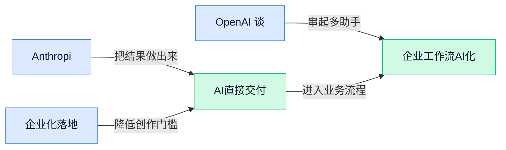

> AI 早报 · 每日早读 · 全网深度聚合

## **今日摘要**

```
Anthropic Claude揪出加密算法漏洞，Mythos（安全研究模型）把AI安全推向实战
Nvidia投资SSI（苏茨克弗AI实验室），芯片选择从Google倒向英伟达
Google Gemini托管Agent扩容3.6 Flash，OpenAI开源Codex Security
```

### 🔵 产品与功能更新

1. **Anthropic Claude 模型被报道可发现高难破解的加密算法（保护信息不被轻易读懂的数学规则）漏洞。**  
《纽约时报》报道称，一款 **Claude** 模型找出了难以破解的**加密算法**中的缺陷，这说明大模型正在进入更专业、更高门槛的安全分析场景 🔐。这里的“漏洞”可以理解为规则里的薄弱点，若被发现得早，就有机会在真正造成风险前修补。对企业来说，这类能力未来可能影响**网络安全审计**、**密码系统评估**等工作，但也意味着安全团队需要更认真看待 AI 的“双刃剑”属性 💡。[纽约时报报道(briefing)](https://news.google.com/rss/articles/CBMikgFBVV95cUxPMUZ6UGlFUVFUZk51VFBqdW9TcThwY21DVDRvVkhVRWJSNnM2LUtBQm52MC1TcVhyS1hXMWpmRVhNNkM0cVk4WFVsWG1nRVR0bVJnTHk4eWxMZU5SQUtVRVlzaHVPMHZ3bHlSLXRHRlFjSUQ1Ylo2V3JMOUlnNUh4b2dBVzhBOFFzN0RtcHJhdE1fUQ?oc=5)

2. **Amex GBT（美国运通全球商务旅行公司，企业差旅管理服务商）推出 Egencia AI Connector（接入 Claude 的商旅预订连接器）。**  
Amex GBT 宣布通过与 **Claude** 集成，推出由 AI 驱动的**商务旅行预订**能力 ✈️。其中 Egencia AI Connector（把 Egencia 商旅预订能力接到 Claude 里的连接器）意味着用户可能不用在多个差旅系统里来回切换，而是通过对话完成相关预订流程。对行政、运营和经常安排出差的团队来说，这类更新的核心价值是把“查、选、订”这类重复流程进一步搬进 AI 助手里，减少操作成本 (๑•̀ㅂ•́)و。[商旅连接器报道(briefing)](https://news.google.com/rss/articles/CBMiqAFBVV95cUxQamJqeVZIRW5NWWRHMnpPTW1Qal8tVllSMmoyV2ZBa2I4QkFwNk10VE0yYTZiYWNBcWc4OXJfOHo1OVltSGpPSzZDbVMtSm9WU0tjeTIwWW1TVUhKMlk3TlptRE85VzBWamx3bEdRSXV3am94a190M2ROVnJBWlppUmdvX3VmMzRLejlqRWtoVHlHWmxEWV9BYUxneW1Pel9kOWtjSTVMTDE?oc=5) [Claude 集成报道(briefing)](https://news.google.com/rss/articles/CBMi7AFBVV95cUxPUlVPYXY3aU0tRHAxbjgweEtiX1ZZaWhuSFMwTThNY2Uzc2dJT1BYdzM2OEtmai1NaVhOQmRBdkJFM2kxN05RV3h5aEdwbUNRVmpmbUwxT2t5QVUzbUxBQzJZZVdpSGFSdnhtN0dGZER1bk44OGNnOFFSbDJ3anpFNUVTb0xCZHM5TWRmMlZvUWp5YTJrSzhWVDFfM3BxRmJSNzd3SmhXNk5xenpwdFI3X19qTE04YzV6VWNPbFZWZ0o5ZkNNS0kweVJDV2RhU0lqb0tPcE1iVTVwb1VJU0J2dW11TTkyWG9FODZ4LQ?oc=5)

### 🟢 前沿研究

1. **dRAE（用球面编码压缩模型表征的自编码器研究）探索更稳的表征学习。**  
这篇论文关注 **Representation Autoencoder（表征自编码器，把复杂数据压缩成机器更容易理解的“内部表示”）**，并引入 **Hyper-Spherical Codes（超球面编码，可理解为把信息放到球面空间里重新组织）**。从题目看，它想解决的是模型如何更好地“记住”和“还原”信息的问题，这类研究常影响图像生成、语义理解等底层能力 🚀。对非技术同事来说，可以把它理解成：研究者在改进人工智能的“压缩记忆方式”，让后续生成或识别更稳。[论文页面(briefing)](https://huggingface.co/papers/2607.22148)


2. **Anthropic 的 Mythos（用于安全研究的模型）发现互联网加密算法漏洞。**  
Anthropic 表示，其 **Mythos（面向网络安全研究的模型）** 找到了用于保护互联网的 **cryptographic algorithms（加密算法，把通信内容变成外人看不懂的密文）** 中的漏洞。这里的 **vulnerabilities（漏洞，可能被攻击者利用的弱点）** 如果属实，意味着大模型不只会写文案、写代码，也可能参与更高门槛的安全审计 🛡️。不过这类发现也提醒行业：人工智能越强，越需要把能力放进受控、合规的安全研究流程里。[完整报道(briefing)](https://the-decoder.com/anthropic-says-its-mythos-model-found-vulnerabilities-in-cryptographic-algorithms-that-secure-the-internet/)

3. **Chamaileon（跨场景结合体设计模型）研究如何生成更适配环境的结合体。**  
这篇论文的关键词是 **Cross-Context Binder Design（跨场景结合体设计，让模型设计能与不同目标环境匹配的分子或结构）**。它还提到 **Contextualized Modeling（上下文化建模，让模型根据具体环境调整判断）** 和 **Mixed Sampling（混合采样，用不同生成方式挑选候选结果）**，说明研究重点在“同一个设计任务，换个场景还能不能靠谱”💡。这类方向常见于生物设计、药物发现等前沿场景，核心价值是提高候选方案的适配性，而不是只在单一测试里好看。[论文页面(briefing)](https://huggingface.co/papers/2607.23518)

4. **Codifying the Judge（把评审模型规则写成程序）尝试降低大规模评测成本。**  
这篇论文聚焦 **Scalable Evaluation（可扩展评测，让大量模型输出能被更高效地检查）**，并提出通过 **Program Distillation（程序蒸馏，把复杂评判逻辑提炼成可执行程序）** 来“编码”评审者。简单说，以前很多人工智能结果要靠另一个大模型或人工来评，现在研究者希望把评判标准变成更稳定、可复用的程序 ⚙️。如果这条路线可行，未来产品测试、内容审核、智能客服质检等场景可能会更省成本、更容易批量化。[论文页面(briefing)](https://huggingface.co/papers/2607.22561)

5. **Reasoning Denoiser（推理去噪器）用推理轨迹帮助识别大模型幻觉。**  
这篇论文研究 **Reasoning Traces（推理轨迹，模型一步步思考时留下的中间过程）**，并尝试通过 **Denoising（去噪，把混乱或误导性的中间信息清理掉）** 来发现 **Hallucination（幻觉，模型一本正经说错话）**。它面向的是 **Large Reasoning Models（大型推理模型，擅长分步骤解题的大模型）**，重点不是让模型“说得更像”，而是检查它推理过程中哪里可能跑偏 🧭。对业务使用者来说，这类研究的意义在于：未来模型回答不只看最终答案，还可能检查它“怎么想出来的”。[论文页面(briefing)](https://huggingface.co/papers/2607.22098)

6. **多轮长程规划研究梳理从预训练到后训练的 Agent 蒸馏路径。**  
这篇论文标题中的 **Multi-Turn Long-Horizon Planning（多轮长程规划，模型连续多步完成复杂任务的能力）**，对应的是现实工作里“不是问一句答一句，而是持续推进一个项目”的需求。它还提到 **Pre-training（预训练，用海量数据打基础）**、**Post-training（后训练，让模型更符合任务和人类偏好）** 与 **On-Policy Agentic Distillation（在线策略式智能体蒸馏，让模型在执行任务过程中向老师模型学习）**。这说明研究重点在于：如何把模型从“会回答”训练到“会持续做事”🚀。[论文页面(briefing)](https://huggingface.co/papers/2607.24720)

7. **Frozen 12B（固定不再训练的 120 亿参数模型）在可验证任务上打出 100% 准确率。**  
这篇论文标题很有冲击力：一个 **Frozen 12B（参数冻结的 120 亿参数模型，像把模型能力定格后不再改动）**，在 **Verified Work（可验证任务，答案能被明确检查对错的任务）** 上达到 **100% Accuracy（百分百准确率）**。它还强调 **0 Tokens（零文本生成单位，意味着不依赖常规逐字生成）** 和 **Bit-Exact（按位完全一致，每次结果像复制文件一样精确）**。如果只看标题，这项研究讨论的是一种非常确定、可复现的工作方式，对需要“结果必须可核验”的场景很有启发。[论文页面(briefing)](https://huggingface.co/papers/2607.23806)

8. **Classifier-Free Guidance（无分类器引导）在在线扩散蒸馏中被重新审视。**  
这篇论文关注 **Classifier-Free Guidance（无分类器引导，扩散生成模型用来让结果更贴近提示词的一种控制手段）**，并把它放到 **On-Policy Diffusion Distillation（在线策略扩散蒸馏，让生成模型在实际生成过程中学习压缩和改进）** 里重新讨论。这里的 **Diffusion（扩散模型，常用于图像生成，像从噪点一步步“擦”出画面）** 是当前生成式人工智能的重要路线之一 🎨。对设计和内容团队来说，这类底层研究最终可能影响图片生成工具的可控性、速度和稳定性。[论文页面(briefing)](https://huggingface.co/papers/2607.24731)

### 🟡 行业展望与社会影响

1. **OpenAI 谈 agentic AI（能主动拆解任务、调用工具完成工作的 AI）如何改造科学计算。**  
OpenAI 的新现场报告聚焦一个变化：科学家开始用 **AI 编程 Agent**（能帮人写代码、改代码、跑测试的自动化助手）来升级老旧科研软件 🚀。这对 **scientific computing（科学计算，用计算机模拟、分析复杂科学问题）** 很关键，因为很多科研发现都卡在代码维护和工具迭代上。报告提到，这种方式已在 **genomics（基因组学，研究 DNA 等遗传信息的学科）** 等领域帮助加速软件开发和科学发现。[OpenAI 现场报告(briefing)](https://openai.com/index/scientific-computing-agentic-ai)


2. **Anthropic CEO 重申 open-weight（开放权重，可下载模型参数自行部署）风险立场，但否认主张禁令。**  
Anthropic CEO Amodei 继续强调 **open-weight 模型**（把模型核心参数开放给外部使用，类似把“发动机图纸”也给出去）可能带来的安全风险 ⚠️。但他同时坚持，自己并没有呼吁直接**禁止**这类模型，这让争议焦点从“要不要封杀”转向“如何管理风险”。这件事反映出 AI 行业正在拉扯：一边是**开源与创新速度**，一边是**滥用和安全治理**。[风险立场报道(briefing)](https://the-decoder.com/anthropic-ceo-amodei-doubles-down-on-open-weight-risk-stance-while-insisting-he-never-called-for-a-ban/)

3. **Nvidia 投资 SSI（伊利亚·苏茨克弗创办的 AI 实验室），芯片选择从 Google 转向英伟达。**  
报道称，Nvidia 正投资 Ilya Sutskever 的 **SSI（Safe Superintelligence，专注“安全超级智能”的 AI 实验室）**，并推动其从 Google 芯片转向英伟达芯片生态 💡。这里的 **AI lab（AI 实验室，集中做模型研究和训练的团队）** 不只是普通创业公司，它的硬件选择会影响算力供应链和行业站队。对外界来说，这也说明顶级 AI 团队对 **chips（AI 芯片，训练和运行大模型的核心硬件）** 的依赖越来越深。[英伟达投资报道(briefing)](https://the-decoder.com/nvidia-invests-in-ilya-sutskevers-ai-lab-shifting-ssi-away-from-google-chips/)

4. **Google 扩展 Gemini API Managed Agents（托管式 AI Agent 开发服务），加入 3.6 Flash（更快模型版本）和 hooks（流程触发接口）。**  
Google 宣布扩展 **Gemini API Managed Agents**（让开发者把 Agent 交给平台托管运行的服务），目标是帮助开发者构建更可靠、可用于生产环境的 AI Agent ⚙️。这次提到的 **3.6 Flash** 是面向速度和效率的模型版本，**hooks（钩子，像流程里的自动触发按钮）** 则能让 Agent 在关键步骤接入外部逻辑。对企业应用来说，这类更新意味着 AI Agent 正从“演示好玩”走向“能稳定接业务流程”。[Google 官方博客(briefing)](https://blog.google/innovation-and-ai/technology/developers-tools/expanding-managed-agents-gemini-api-3-6-flash-hooks/)

### 🟣 开源TOP项目

1. **OpenAI 开源 Codex Security（围绕 Codex 的安全相关开源项目）。**  
OpenAI 这次把 **Codex Security** 放到了 GitHub 上，核心信息很直接：它已经从内部项目变成可公开访问的**开源项目**（把代码公开，外部开发者可以查看、下载并参与改进）🚀。目前候选材料没有披露更多功能细节，所以更适合把它看作一个值得关注的“安全方向信号”：Codex 相关工具链正在补上**安全治理**这一环。对业务同事来说，这意味着未来 AI 写代码不只是“更快”，也会越来越强调“写得更可控、更安全”💡。[开源项目仓库(briefing)](https://github.com/openai/codex-security)


2. **no-ai-slop（清理 AI 味写作痕迹的开源工具）帮文章去掉 20 多种套路表达。**  
这个项目主打一个很实用的痛点：把文章里常见的 **AI slop（AI 生成内容里那种空泛、套路、像模板一样的低质表达）** 清理掉 ✍️。根据项目摘要，它可以从任意一段写作中移除 **20 多种 AI 味模式**，适合用来给邮件、公告、方案、社媒文案做“去机器味”处理。对运营、行政、人事、市场同事来说，它的价值不在于替你写，而是帮你把 AI 草稿改得更像真人、更自然 (๑•̀ㅂ•́)و。[GitHub 仓库(briefing)](https://github.com/petergyang/no-ai-slop)


3. **codex-auth-helper（Codex 登录配置导出助手）让本地备份 ChatGPT 会话更省心。**  
这个项目的定位很明确：它是一个 **Codex 登录助手**，用于在本地安全导出已登录的 ChatGPT 会话配置 🔐。它会生成符合 Codex 规范的 **auth.json（Codex 用来读取登录授权信息的本地配置文件，类似一张本地通行证备份）**，方便用户做本地备份。需要注意的是，材料强调的是“安全地在本地导出”和“本地备份”，所以它更像是给 Codex 用户准备的账户配置管理小工具，而不是面向普通聊天用户的产品。[项目代码仓库(briefing)](https://github.com/zhishile/codex-auth-helper)


### 🔴 社媒分享

1. **Frontier Lab Agent Intrusion（前沿实验室智能体入侵事件）复盘：Hugging Face（全球最大 AI 模型共享社区）放出 2026 年 7 月技术时间线。**  
Hugging Face（全球最大 AI 模型共享社区）发布了一篇非常详细的技术复盘，梳理了 2026 年 7 月一次 **Agent 入侵事件** 的时间线 🚨。这里的 Agent（能自主执行多步任务的 AI 助手）不只是“聊天”，而是会调用工具、访问系统，因此安全边界更复杂。文章标题强调的是 **technical timeline（技术时间线，按时间顺序还原事件发生和处置过程）**，适合安全、研发管理和风控同事关注：未来 AI 系统越会“动手”，越需要可追踪、可审计的防护机制。[完整技术时间线(briefing)](https://simonwillison.net/2026/Jul/28/anatomy-of-a-frontier-lab-agent-intrusion/#atom-everything)


2. **LFM2.5-Encoders（Liquid AI 的文本编码模型）主打在 CPU（中央处理器）上跑长上下文推理。**  
Liquid AI 推出的 **LFM2.5-Encoders** 聚焦 “Fast Long-Context Inference on CPU”，也就是在 CPU（普通电脑或服务器里的主处理芯片）上更快处理长文本 📄⚡。Encoders（编码器，把文字转换成模型能理解的数字表示）常用于搜索、分类、匹配等场景；Long-Context Inference（长上下文推理，让模型一次读更多资料再回答）则对合同、报告、知识库很有价值。它的看点在于强调 **不一定依赖昂贵显卡**，这对预算敏感、但又要处理大量文本的团队很有吸引力。[模型发布博客(briefing)](https://huggingface.co/blog/LiquidAI/lfm2-5-encoders)

3. **Claude 帮忙发现 Cryptographic Weaknesses（密码学弱点），Anthropic 展示 AI 辅助安全研究。**  
Anthropic 发布研究文章，主题是用 Claude 发现 **cryptographic weaknesses（密码学弱点，指加密方案里可能被攻击者利用的问题）** 🔐。这类工作属于安全研究，不是普通“写代码”，而是让模型参与分析复杂规则、推理潜在漏洞。对非技术同事来说，重点是：AI 正在从“帮人写文案/代码”走向更专业的 **research assistant（研究助手，辅助专家做分析和验证的工具）** 角色。安全团队和合规团队尤其值得关注，因为未来 AI 可能同时提升防御能力，也放大攻击者的分析效率。[Anthropic 研究文(briefing)](https://www.anthropic.com/research/discovering-cryptographic-weaknesses)

4. **OlmoEarth Platform（艾伦人工智能研究所的地理空间推理平台）探索行星级 Geospatial Inference（地理空间推理）。**  
AllenAI 在 Hugging Face（全球最大 AI 模型共享社区）介绍了 **OlmoEarth Platform**，重点是 “Geospatial inference at planetary scale” 🌍。Geospatial inference（地理空间推理，基于地图、卫星影像等位置数据做分析判断）可以用于理解大范围地表变化、区域特征等问题；planetary scale（行星级规模）则意味着处理范围非常大，不是单个城市或单张图片。对业务同事来说，这类平台的意义在于：AI 不只会读文字，也在进入地图、遥感和环境数据等更“现实世界”的分析场景。[平台技术博客(briefing)](https://huggingface.co/blog/allenai/olmoearth-infrastructure)

---



### 📊 行业洞察（今日 3 条）

1. Anthropic Claude Mythos（安全研究模型）发现加密算法（保护信息的数学规则）弱点。
  【洞察】AI正进入高门槛安全研究；因其能辅助专家找缺陷，但也可能降低滥用门槛。

2. Google 扩展 Gemini API Managed Agents（托管式AI助手开发服务），加入3.6 Flash。
  【洞察】企业Agent（能分步使用工具的AI助手）更接近生产应用；因速度与可靠性被放到核心位置。

3. OpenAI 报告称科学家用AI编程Agent改造科研软件，覆盖基因组学（研究DNA信息）。
  【洞察】AI正从回答问题走向参与专业工作；因它能提升开发效率，但结果仍需专家校验。

### 💭 对我们的启发（今日 2 条）

1. Google 的Managed Agents提示我们：视频剪辑Agent平台要重视稳定体验，机会是提效，风险是复杂步骤出错。

2. OpenAI 科研Agent案例说明，内容创作工具可让AI参与脚本、剪辑、质检，机会是降本，风险是创意同质化。


---

> 本周周报：[第31周综合分析](https://zhuxinfei.github.io/ai-daily-site/blog/weekly/2026-w31/)
