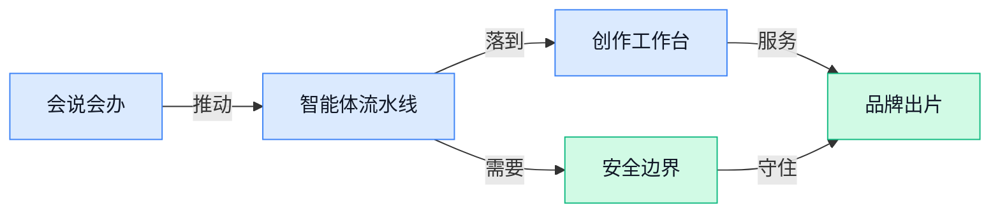

> AI 早报 · 每日早读 · 全网深度聚合

## **今日摘要**

```
GPT-5.6（未公开模型）让两队几乎同时解出量子密码难题
OpenAI、Anthropic、Google同赴白宫，Agent安全漏洞被国会追问
IBM曝92% AI事故公司缺基础访问控制，Interpol（国际刑警）点名非洲网络犯罪
```

### 🔵 产品与功能更新

1. **AI（人工智能）建模新方法加速先进材料研发。**  
劳伦斯伯克利国家实验室新闻中心报道了一种新的 **AI（人工智能，用机器模拟和辅助判断复杂问题）建模方法**，目标是让**先进材料**（性能更强、用途更专门的新型材料，比如用于电池、芯片、能源设备的材料）研发跑得更快 🚀。对非技术同事来说，可以把它理解成：过去靠大量实验试错，现在多了一个“先在电脑里筛一遍”的助手，帮助研究人员更快找到有希望的方向 💡。原文没有展开具体商业产品名称，但它指向的是**材料研发流程提效**，未来可能影响新能源、制造、半导体等行业的研发节奏。[材料建模报道(briefing)](https://news.google.com/rss/articles/CBMiswFBVV95cUxNUl9mUnZ6N2pUZlVwejVxcXMtbFhfQ3ZDY2ZQa0pBTWZtNWV6ODh1WlVVajlMNUZCMTRzQzN3dlB2RUdzOFhoeWFKYS1wMHFIc3A0OWl3T3Y5SHF4a2pWZ0RZd0xnQlVpU0RESHpPRUFiRklqN1BjNXhMQmdiUUFwRVhFdXJWakM4eFVERHE5dDY3bXNqOXF3bjVpVjBhczhvQWFvZXJBTVN6akdDUW9VT2hFQQ?oc=5)

2. **AI Product & Service Launches（人工智能产品与服务发布汇总）更新 2026 年 8 月 3 日动态。**  
PlanAdviser 发布了 2026 年 8 月 3 日的 **AI（人工智能）产品与服务发布汇总**，从标题看，这是一类面向行业读者的新品信息集合 📌。这里的 **Product & Service Launches（产品与服务发布）** 可以理解为“新工具、新功能、新服务上线清单”，方便从业者快速扫到市场变化。由于候选摘要未提供具体产品名单，当前只能确认它是一个**发布汇总入口**，适合后续追踪养老顾问、金融服务等场景里的 AI 工具动向 💡。[产品服务汇总(briefing)](https://news.google.com/rss/articles/CBMic0FVX3lxTE52YmRDRWx6OE5fcDZqRTg2S1NrLW5uUUdFajRzQkVzUlEwMmVkUUxfTWhweE1pV2FIaG1QUEtmZE0wRmxMNVFPejY1UldkYzRwNkFyQ2Zxa0RLYk9fcnZiOE51UkxDZWZ4T1c2UUxzWXpESEU?oc=5)

3. **MDConsult AI（面向医疗咨询的人工智能平台）推出白内障与屈光诊疗术前咨询平台。**  
MDConsult AI（面向医疗咨询的人工智能平台）上线了一个 **Pre-Consultation Platform（术前咨询平台，在正式就诊前先收集信息、辅助沟通的工具）**，服务对象是白内障和屈光诊疗机构 🚀。其中 **cataract practices（白内障诊疗机构）** 面向白内障相关检查与治疗，**refractive practices（屈光诊疗机构）** 则通常涉及近视、散光等视力矫正服务。对患者和诊所来说，这类工具的价值在于把正式面诊前的基础沟通前置，可能让医生更快了解情况，也让患者少一些信息反复确认的麻烦 💡。[眼科平台发布(briefing)](https://news.google.com/rss/articles/CBMisAFBVV95cUxPV2RFSDJmZ01hVlNjTk5DM2JlLS1hb1Z4aXZYVnAyenFmZHJVSHUwclVwWDVjelNRR1FNTEhnR2loVGxHdWdoZHBtREZUdkpSVlF4NE04NUFIa1A1cmh6RHVTNk9IODZCdF8wOWVNbHNXYk9oWmlIc2NBU2owZkxJUVVwT0Z4Si1EZVVkd1RnZ2RDZkYycjRSUE9DMkpoMnNzUHZrVDRYWjhjTWVwenp4TQ?oc=5)

### 🟢 前沿研究

1. **GPT-5.6（一款未被大众熟知的 GPT 系列模型版本）让两个团队几乎同时解出量子密码难题。**  
两支团队在相隔仅**三小时**的时间里，用 GPT-5.6（一款未被大众熟知的 GPT 系列模型版本）解决了同一个 **quantum crypto（量子密码学，用量子物理原理保护信息安全的研究方向）**问题 🚀。这条消息的重点不只是“AI 会做数学”，而是 AI 正在进入更靠近前沿科研推理的场景。对普通同事来说，可以理解为：AI 不再只是写文案、写代码，也开始参与那些需要专家长期推导的高难问题 💡。[量子密码报道(briefing)](https://the-decoder.com/two-teams-solved-the-same-quantum-crypto-problem-using-gpt-5-6-just-three-hours-apart/)


2. **Meshy T2（一项快速生成三维网格的研究）探索用 Flow Matching（让生成过程更平滑可控的训练思路）加速 3D 内容生成。**  
这篇论文题为 **Meshy T2: Fast Native Mesh Generation with Flow Matching**，核心指向是更快地生成 **mesh（三维网格，3D 模型表面的“骨架和外壳”）**。这里的 Flow Matching（让模型学习从噪声逐步变成目标结果的路径，像教 AI 按步骤雕出物体）说明研究重点放在生成过程本身。对设计、游戏、工业建模等场景来说，这类研究如果成熟，可能让“从想法到 3D 模型草稿”的流程更短 ⚡。[论文页面(briefing)](https://huggingface.co/papers/2607.28675)

3. **RLVR 到 RLSVR（让大模型自己验证奖励的新训练路线）尝试解决开放任务里的自我提升难题。**  
这篇论文讨论从 **RLVR（带可验证奖励的强化学习，让模型做完题后能用明确标准判断对错）**走向 **RLSVR（通过任务改造产生可自我验证奖励的训练方式）**。原文提到，RLVR 已推动面向推理的大语言模型进步，但它的适用范围仍受限制。研究的关键在于：对于开放式任务，模型怎样获得可靠的“做得好不好”的反馈，而不是只靠人反复打分 🧠。这对未来 AI 自我改进很重要，因为奖励信号越清楚，模型越可能稳定进步。[arxiv 论文(briefing)](https://arxiv.org/abs/2607.23802)

4. **SAF-OPD（用于在线策略蒸馏的稳定优势融合方法）关注模型训练中的稳定迁移。**  
这篇论文标题是 **SAF-OPD: Stable Advantage Fusion for On-Policy Distillation**，看点集中在 **on-policy distillation（在线策略蒸馏，让一个模型在当前决策过程中把经验传给另一个模型）**。其中 Stable Advantage Fusion（稳定优势融合，把模型在不同选择上的“更优信号”更稳地合在一起）听起来很技术，但可以类比为：让“老师模型”的有效经验更平滑地教给“学生模型”。这类研究通常服务于更稳定、更可控的模型训练，而不是直接面向普通用户的功能更新 ⚙️。[论文页面(briefing)](https://huggingface.co/papers/2607.29209)

5. **Mental World Modeling（心理世界建模，让 AI 推测人的想法与状态）把研究焦点放到“理解人”上。**  
这篇论文题为 **Mental World Modeling**，从标题看，研究关注的是模型如何表示人的心理状态或内在世界。Mental World（心理世界，指人的信念、意图、情绪等看不见但会影响行为的因素）如果能被 AI 更好建模，就可能提升人机交互中的理解能力。对业务同事来说，这类方向的意义在于：未来 AI 助手可能不只是回答字面问题，还能更好理解“用户真正想完成什么” 💡。[论文页面(briefing)](https://huggingface.co/papers/2607.27201)

6. **ExtractBench（企业文档抽取评测基准）瞄准 Agent 按指定格式读懂公司文件的能力。**  
这篇论文提出 **ExtractBench（企业文档抽取评测基准，用来测试 AI 能否按要求从文件里提取结构化信息）**，场景是企业流程中的 schema-guided extraction（按预设字段抽取信息，比如从合同里抽出金额、日期、甲乙方）。原文提到，企业工作流越来越依赖 Agent 来完成这类任务，但关键要求是：既要遵守用户定义的格式，也要输出正确内容。对行政、财务、运营同事来说，这很贴近实际工作，因为很多重复劳动本质上就是“读文件、填表格、对字段” 📄。[arxiv 论文(briefing)](https://arxiv.org/abs/2607.29677)

### 🟡 行业展望与社会影响

1. **Interpol（国际刑警组织，协调各国警方打击跨境犯罪）称 AI（人工智能，让机器模拟人类分析和生成能力）已成非洲网络犯罪核心驱动力。**  
Interpol 的判断很直接：在非洲网络犯罪中，**AI** 已不再只是辅助工具，而是变成了“核心运营驱动” 🚨。这意味着诈骗、钓鱼邮件、身份冒用等犯罪可能更容易规模化，因为生成式工具（能自动生成文字、图片或代码的软件）降低了作案门槛。对企业来说，安全意识培训不能只讲“别点陌生链接”，还要覆盖 AI 生成内容（看起来像真人写的欺诈信息）的识别能力。[非洲网络犯罪报告(briefing)](https://the-decoder.com/interpol-says-ai-has-become-the-core-operational-driver-of-cybercrime-across-africa/)


2. **OpenAI、Anthropic、Google 将参加白宫 AI（人工智能）安全会议。**  
这条消息显示，美国政府正在把**AI 安全**放到更核心的位置，邀请 OpenAI、Anthropic、Google 参与白宫会议 🏛️。这里的 AI 安全（让模型尽量不被滥用、不泄露敏感信息、不造成不可控风险）不只是技术圈话题，也会影响企业采购、合规和产品上线节奏。对普通公司来说，未来使用大模型服务可能会越来越强调安全审查、权限管理和责任边界。[白宫安全会议消息(briefing)](https://news.google.com/rss/articles/CBMisgFBVV95cUxQZ3hBOWtTak5hM3JQdjc2Z1E1anpYS0RtQW5Razg4UXdNdmNpeGN1UnVjMzRJY19IdGY3VkVOUC1JSWsxYno3ZlRXOEtDYm5wNmU4c0ZyT0dwUG1yYS1YejZqZ2hYbENNc041REV2VldRc1p2V1c1TXdvOURmOUZQaDFJY3luQTRGNEt3eFR1cTdHdzk4aVhvR2R3WW5CRkwtbDVNR0llRS1sRHFEd2hGNE5n?oc=5)

3. **美国众议院小组要求了解 OpenAI 的 AI Agent（能代替人执行多步任务的人工智能助手）安全漏洞。**  
美国众议院相关小组正在寻求关于 OpenAI **AI Agent 安全漏洞**的简报，这说明监管层已经开始关注“会行动的 AI”带来的新风险 ⚠️。AI Agent（能读取信息、调用工具、按步骤完成任务的智能助手）比普通聊天机器人更强，也更需要权限控制（规定它能访问什么、不能碰什么）。如果这类系统被攻击或误用，影响可能从“回答错了”升级到“自动执行了错误操作”。[安全漏洞简报消息(briefing)](https://news.google.com/rss/articles/CBMirgFBVV95cUxOZUJ3OG9JQXRfZ2I2Rkp1TjZWbXpOZXRYNFp3Yi1CZW5VczUxOC1LeVJmbUlaTFdkbFB5NVhXV3hvNTFJSy1CMDlIdDlyMFhwaFg3NVhvSHhuVHNTRW1JQmtxcmNLT1VDRGtjSFllRmN2T2lONXFJNDFsZTZqRDhJYkQ2cWdJcHEyd1kzWW9tVkJyVzdqQzJLMV93Qm5KbmZwOVV5THBnNTJNTE9pSnc?oc=5)

4. **IBM（老牌企业科技公司）发现，遭遇 AI（人工智能）安全事故的公司中 92% 缺少基础访问控制。**  
IBM 的发现很扎心：被 AI 安全事故影响的企业里，**92%** 没做好基础访问控制 🔐。访问控制（决定谁能看哪些数据、用哪些系统的规则）听起来像后台小事，但在 AI 场景里非常关键，因为模型可能接触客户资料、内部文档和业务数据。换句话说，很多风险不是模型太神秘，而是企业把“谁能用、能用到哪一步”这件事管得不够细。[企业安全调查(briefing)](https://the-decoder.com/ibm-finds-92-of-companies-hit-by-ai-security-breaches-lacked-basic-access-controls/)

5. **Orchard（微软推出的可扩展 AI Agent 开放框架）面向大规模智能代理应用开放。**  
微软介绍了 Orchard，一个用于构建可扩展 agentic AI（能自主规划并执行任务的人工智能系统）的开放框架 🧩。框架（给开发者搭应用用的基础工具箱）通常决定了团队能不能把一个原型稳定做成可用产品，而不只是做演示。对行业来说，这类工具的出现说明 AI Agent 正从“单个助手”走向“可组织、可扩展、可管理”的系统化应用。[微软框架介绍(briefing)](https://news.google.com/rss/articles/CBMinAFBVV95cUxOeE41QWVkRWZIRS1JNW1UQ2ItdllValRYMk1Uby11emRxWTdzcWFORmRUWThpRk1ZY25OdFFoNVBRYlgwa3VHcWd2SExZdWlhbTZhYTRMWl90cUNXRndVZXJXd29XemVHWk5Ed3VFcThVc09DbWNoeUo4RnhOb0lFSUp3RHhfQkNZMzhzeGxoemdNamJyVlVyaHFQNDk?oc=5)

6. **阿里 Qwen（通义千问，阿里推出的大模型系列）新模型再次瞄准工作场景。**  
The Decoder 用略带调侃的标题说，阿里的新 Qwen 模型“也在拿走你的工作”，但这次是件好事 😄。Qwen（通义千问，能处理文字、代码等任务的大模型系列）代表的是一类越来越实用的工作型模型：它们不是只会聊天，而是更强调把任务做完。对职场来说，重点可能不是“岗位被替代”这么简单，而是很多重复性文字、分析和流程工作会被重新分配给 AI 协助完成。[Qwen 新模型报道(briefing)](https://the-decoder.com/alibabas-new-qwen-model-is-also-taking-your-job-but-this-time-its-great/)

7. **Apple 的 Siri（苹果语音助手，用语音帮用户完成查询和操作）终于修好，但惊喜感变弱了。**  
TechCrunch 的评价很微妙：苹果期待已久的 AI 改造，终于让 Siri 更接近它本该成为的助手，但这个时点已经不太像革命性突破了 🍎。Siri（苹果语音助手）如果只是变成“合格的 AI 助手”，在今天的市场里可能已经不够震撼，因为用户已经被 ChatGPT、Claude、Gemini 等产品抬高了预期。对产品团队的启发是：AI 功能上线晚了之后，标准会从“有没有”变成“是否明显更好用”。[Siri 改造评论(briefing)](https://techcrunch.com/2026/08/03/apple-finally-fixed-siri-so-why-does-it-feel-anticlimactic/)

### 🟣 开源TOP项目

1. **kvcache-ai/AgentENV（用于大规模运行智能体环境的分布式平台）想把 Agent 环境跑得更大、更稳。**  
AgentENV（智能体环境平台，用来给 Agent 提供可执行任务和测试场景）定位为一个**分布式平台**（把任务拆到多台机器上一起跑，适合规模更大的计算需求）🚀。它的重点不是做一个聊天机器人，而是帮助团队在更大规模下运行 **Agent（智能体，能按目标自动执行任务的 AI 程序）** 环境。对业务同事来说，这类项目更像是 AI 产品背后的“训练场和调度系统”，让多个智能体任务可以更系统地跑起来。[GitHub 仓库(briefing)](https://github.com/kvcache-ai/AgentENV)


2. **open-jarvis/OpenJarvis（运行在个人设备上的个人 AI 助手）主打把 AI 留在自己设备里。**  
OpenJarvis（个人 AI 助手项目，目标是在用户自己的电脑或设备上运行）强调 **Personal AI（个人 AI，围绕个人数据和个人任务服务的智能助手）** 和 **Personal Devices（个人设备，比如自己的电脑、手机或本地硬件）** 💡。这意味着它关注的方向不是把所有事情都交给云端，而是让 AI 更贴近个人设备和个人使用场景。对普通办公用户来说，这类项目的想象空间在于：未来一些日常助手能力，可能会更多发生在自己的设备上，而不是完全依赖远程服务器。[GitHub 仓库(briefing)](https://github.com/open-jarvis/OpenJarvis)

3. **jakubkrehel/skills（帮助打造界面的智能体技能集合）聚焦把产品界面做得更好用。**  
skills（技能集合，这里指一组可复用的 Agent 能力模块）收集了多种帮助构建优秀界面的 **Agent skills（智能体技能，让 AI 按特定目标完成某类任务的能力包）** ✨。它覆盖 animation（动效，让界面操作更顺滑）、UI（用户界面，也就是按钮、页面和交互布局）、accessibility（无障碍设计，让视障等用户也能更好使用产品）和产品文案等方向。简单说，它不是单一应用，而像是给 AI 准备的一套“产品设计与打磨工具箱”，帮助团队在界面细节、可用性和表达上更省力。[GitHub 仓库(briefing)](https://github.com/jakubkrehel/skills)


### 🔴 社媒分享

1. **Meta 财报不及预期，AI 产品承诺反而更让人担心。**  
这篇分享聚焦 Meta 的最新财报：原文判断其**业绩表现有些令人失望**，但更值得注意的是公司对未来 **AI 产品**的承诺 🚀。这里的“财报”就是公司定期公布的经营成绩单，能看出收入、利润和市场信心；而 **AI 产品路线图**（公司未来打算推出哪些 AI 功能和服务）如果说得太远、落地不清，反而会让外界更焦虑。对业务同事来说，这提醒我们看 AI 公司时不能只听愿景，也要看它现在能不能把产品和收入讲清楚 💡。[Meta 财报分析(briefing)](https://stratechery.com/2026/meta-earnings-metas-timing-problems-the-financial-tail/)


2. **MiniMax H3（MiniMax 推出的多模态生成模型）首日接入 ComfyUI（可视化 AI 创作工作流工具）。**  
这条消息的重点是 MiniMax H3（支持多种内容生成能力的 AI 模型）在发布首日就获得 ComfyUI（用拖拽节点搭建 AI 生成流程的工具）支持 🚀。标题里提到 **Open Weights**（开放权重，开发者能拿到模型参数并自行部署或改造）、**Native Audio**（原生音频，模型直接处理或生成声音）和 **2K Video**（约 2000 像素级别清晰度的视频生成），说明它面向的是更完整的音视频创作流程。对设计、运营和内容团队来说，这类工具的意义是把“生成图片/视频/音频”放进同一个可视化工作台里，降低试错门槛 💡。[官方支持说明(briefing)](https://blog.comfy.org/p/minimax-h3-day-0-support-in-comfyui)


3. **Import AI（AI 行业观察通讯）讨论自我维持 AI 病毒与创作争议。**  
这一期 Import AI（由 Jack Clark 维护的 AI 行业观察通讯）把几个话题放在一起：**自我维持 AI 病毒**、AI 进展节奏，以及人们对 AI 与创造力关系的困惑 🚀。其中“自我维持 AI 病毒”可以理解为一种能借助 AI 系统扩散或延续的风险概念；“进展节奏”则是在讨论 AI 发展到底该快一点还是慢一点。对非技术团队来说，这类分享的价值在于提醒大家：AI 不只是效率工具，也会带来安全、治理和创意归属的新问题 💡。[行业观察通讯(briefing)](https://jack-clark.net/2026/08/03/import-ai-467-self-sustaining-ai-viruses-pacing-ai-progress-confusion-about-ai-and-creativity/)


4. **手动重敲 LLM（大语言模型）生成代码，或能减少“认知债”。**  
这篇文章提出一个很具体的观点：为了避免 **cognitive debt**（认知债，代码虽然能跑但自己没真正理解，后续维护会越来越吃力），可以把 LLM（大语言模型，比如能生成代码的 AI）写出的代码手动重新敲一遍 🚀。它讨论的不是“AI 能不能写代码”，而是人在使用 AI 结果时如何保持理解力和掌控感。对业务同事也有启发：AI 生成的方案、文案或表格不应该直接照搬，关键内容最好亲手过一遍，才能真正变成自己的判断 💡。[认知债文章(briefing)](https://ankursethi.com/blog/prevent-cognitive-debt-by-manually-retyping-llm-generated-code/)

5. **Kimi（国产大模型）与 GLM（智谱系列大模型）规模化运行主打更小、更快、更安全。**  
这篇文章围绕“如何在大规模场景运行 Kimi（国产大模型）和 GLM（智谱系列大模型）”展开，标题强调方向是 **smaller, faster, safer**（更小、更快、更安全）🚀。这里的“规模化运行”指大量用户同时调用模型时，系统仍要控制成本、速度和稳定性；“更小”通常意味着部署负担更低，但原文标题只明确给出了这个方向。对公司使用 AI 的团队来说，这类话题说明模型竞争不只看谁最聪明，也看谁能在真实业务里跑得稳、跑得省 💡。[规模化运行文章(briefing)](https://blog.cloudflare.com/smaller-faster-safer-models/)

6. **LLMs（大语言模型）反而会奖励真正懂行的人。**  
这篇分享的核心判断很直接：LLMs（大语言模型，能理解和生成文字、代码等内容的 AI）会“奖励”有专业能力的人 🚀。换句话说，AI 不是简单替代经验，而是让懂业务、懂标准、会判断的人更容易把工具用出效果；**expertise**（专业知识和经验）依然是区分结果好坏的关键。对文职岗位也一样，越熟悉自己的流程、数据和目标，越能写出好 prompt（给 AI 的任务说明），也越能发现 AI 回答里的偏差 💡。[专业能力观点(briefing)](https://www.seangoedecke.com/llms-reward-expertise/)

---



### 📊 行业洞察（今日 4 条）

1. OpenAI的GPT-Live（连续语音对话能力）、苹果Siri（语音助手）和阿里Qwen（通义千问）都在补“能连续办事”
  【洞察】入口竞争从“回答得好”变成“陪用户把任务做完”，慢一步就只剩追赶感

2. 微软Orchard（搭建多智能体应用的工具箱）、AgentENV（大规模测试智能体的平台）和ExtractBench（企业文件抽取评测）同日出现
  【洞察】智能体正在从演示走向流水线，真正难点是稳定、可检查、能接企业流程

3. Interpol（国际刑警组织）警告AI（人工智能）犯罪，白宫和美国众议院盯上安全，IBM说92%事故缺访问控制
  【洞察】行业不是突然怕模型变坏，而是发现企业根本没管好“谁能让AI做什么”

4. MiniMax H3（音视频生成模型）接入ComfyUI（可视化创作工具），Meshy T2（三维模型生成研究）也在提速
  【洞察】内容生产正从单点生成走向一体化工作台，图片、声音、视频、三维会被放进同一流程

### 💭 对我们的启发（今日 3 条）

1. MiniMax H3支持音频和2K视频，说明视频创作工具不能只做剪辑按钮，应该把文案、配音、画面生成和成片检查串成一个顺手流程。

2. ExtractBench强调按指定格式读企业文件，对我们有直接参考：品牌脚本、商品卖点、合规词和投放要求必须能被准确抽取，错了要能追溯和人工改。

3. IBM的92%访问控制问题是在泼冷水：如果剪辑软件接入客户素材、账号和商品数据，权限边界要做成产品能力，不能靠客服提醒。


---

> 本周周报：[第32周综合分析](https://zhuxinfei.github.io/ai-daily-site/blog/weekly/2026-w32/)
