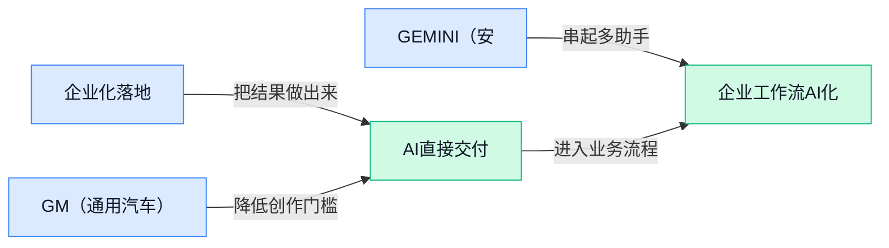

> AI 早报 · 每日早读 · 全网深度聚合

## **今日摘要**

```
Anthropic 砸下 Volta（AI云计算）100 亿美元算力大单，云端 Agent 军备战重磅
白宫拟放行 open-weight models（开放权重），OpenAI 补安全护栏形成强对比
Cisco 警告黑客已用 Claude Code、Codex、Cursor、Gemini，AI 编程工具反成攻击武器
```

### 🔵 产品与功能更新

1. **Cisco（网络与安全设备公司）警告：黑客正在使用 Claude Code、Codex、Cursor 和 Gemini。**  
Cisco（网络与安全设备公司）提醒，黑客已经开始把 **Claude Code、Codex、Cursor、Gemini** 这类 AI（人工智能，让软件能理解、生成内容并辅助决策）模型用于攻击相关活动 🚨。这件事对普通公司也有提醒意义：AI 编程助手（能帮人写代码、改代码的工具）越强，安全团队就越需要关注它被滥用的风险。换句话说，AI 工具不只是“提效神器”，也可能被不法分子拿来降低攻击门槛。[完整报道(briefing)](https://news.google.com/rss/articles/CBMi7wFBVV95cUxOS2hGazZIUV9tbVcxT3UtQmlLTWx1ZGdGUWI3am5TWUVLalM3Z1VoRWJqX2Yza0dJQ0tvZ1JXS3g5c3o3b2JrQS1DWGRMRHNnckhPcElaM2hhZk1fY2tVb3V1YmpoRUtabmxnTjRhSUJrVGxZSGpWbWdZa1NnMDBaVy1lc0VmWW5US2o0UTV5bGFobkJVa2trZmtpaTRUYVpkQ29rb0lkX2VSOUptT05vaFdPd2pLcUZmSmVBMGhkV3lsMThlOXFKRmdWRnM3eE1OQkctSHZUd0lWQzJzbW0zVnI3QVFlb05UVHRQNFdWQdIB9AFBVV95cUxQSl9lMzVZVUIxejlBdC04MHJ3MVU2Vm83Y1pvb0RzQk43NUdITGJUUHpRMlJlS1pGbFZsbkxpQ2lnVHZPd3RYQlozZkRoNWxNNXdMUkhNNnNkWk43V1lBOXliYWpHbEkwLVowUkdaazFRcFMzU0pkbk5IRUlXX01wRXgzVm1KbUo4RERJR1JVUUY4a1pQRTc1SHk4TGdZMHhONmtYdlh4eWhsUlh1RUVTTlZHdnM2RVdqVHFkeVRqR1lTRlowa0VaQ3NOZmtvb3JqVkMwZDREOTVDeDZlcEk5dVpkWFB5Q3FkNUpJNDNnYWlBaXJ1?oc=5)

2. **GM（通用汽车）刚把 Gemini 接入汽车，又开始打造自家 AI（人工智能系统）。**  
GM（通用汽车）已经在车内上线 Google 的 **Gemini**，让汽车功能开始更深地接入 AI（人工智能，让系统理解语音、文字并辅助完成任务）能力 🚗。报道还提到，GM 接下来正在建设自己的 AI，这意味着车企不只想“采购一个聊天助手”，也想把智能能力变成自家产品的一部分。对用户来说，车载助手（装在汽车系统里的语音或智能交互功能）可能会从简单听指令，逐步走向更自然的对话和服务体验。[车载 AI 报道(briefing)](https://news.google.com/rss/articles/CBMiaEFVX3lxTFB0MkxnSkNpXy1Rdmd4WU91VXhOeDJxXzRtVVVaWXFOeDNzYk91VlFzaE95NFd4ZGltV09VUFBhNkR4cEREN3EyR3ZwZm5sek81eWxtZlkzNUhCYnNQUFNhY05qRm5pTU5I?oc=5)

3. **GEMINI（安大略医院相关 AI 辅助试验项目）启动跨 13 家医院的谵妄预防试验。**  
GEMINI（这里指医疗场景中的项目名称，不是 Google Gemini）与合作伙伴启动了一项 AI-assisted trial（AI 辅助试验，用人工智能帮助临床研究或医疗流程做判断与支持）🏥。这项试验覆盖加拿大安大略省 **13 家医院**，目标是帮助预防 **delirium（谵妄，住院患者可能出现的急性意识混乱状态）**。对医疗行业来说，这类项目的重点不是炫技，而是看 AI 能否在真实医院流程里帮医生和护理团队更早发现风险、改善照护质量 💡。[医院试验公告(briefing)](https://news.google.com/rss/articles/CBMirwFBVV95cUxQczhHSXlrZ3Y5cDhBc0RPVnBEX0ZmTTRidjFqNlJGSEdiTDlSbG5hMC1fWnJETkRXclpJQ0ZyajZjRzFiRGlabHYtSWUxaGc5bC1OSVZXVzZIblVNeEZCZWdQdGNINFEtU3BLc2ZGUExtQnNwYWhCclpxTkZhTThVVTBxdnRrQWxPYzhvSUJQUjFadnItd3JFWnNfWkxWUHFCUHE3VVBkX1JCcGREOHpR?oc=5)

### 🟢 前沿研究

1. **DiffusionGemma（实验性开放权重语言模型）用“离散扩散”挑战逐字生成。**  
DiffusionGemma（一个可公开获取权重的实验语言模型）主打**高速文本生成**，核心差异是采用 discrete diffusion（离散扩散，把文本生成看成逐步“去噪修正”的过程），而不是传统大模型那样一个 token（模型处理文字的小单位）一个 token 往外吐 🚀。这意味着研究者正在探索一种更像“先打草稿、再快速修正”的生成路线，目标是提升回答速度。原文明确说它是 experimental open-weight language model（实验性开放权重语言模型），所以更适合看作前沿研究方向，而不是成熟商用品。[论文摘要页(briefing)](https://arxiv.org/abs/2608.00146) [论文聚合页(briefing)](https://huggingface.co/papers/2608.00146)

2. **OpenAI 公开第三方网络安全评测事件，并补上模型测试护栏。**  
OpenAI 解释了近期第三方 cybersecurity evaluation（网络安全评测，用模拟攻击和防御任务检查模型安全边界）中发生的相关事件，并说明会加强 AI model testing（AI 模型测试，评估模型在真实风险场景下会怎么表现）流程 🛡️。这类评测不是普通功能测试，而是看模型是否可能在网络安全场景里被误用或表现失控。对企业来说，重点不只是“模型更强”，还包括**评测过程本身要可控、可追溯、可复盘**。[OpenAI说明页(briefing)](https://openai.com/index/third-party-cyber-evaluations-involving-openai-models)

3. **SKT（一种用已验证合成数据训练技能使用的研究）尝试把模型“会用技能”规模化。**  
SKT 的全名指向 Skill-Use Training（技能使用训练，让模型不只会回答，还能学会何时调用某种能力）和 verified synthetic data generation（已验证的合成数据生成，用机器造数据但再检查正确性）💡。从标题看，这项研究关注的是如何用可验证的数据，把模型使用技能的训练做大规模化。它对行业的启发在于：未来提升模型能力，可能不只靠堆更多原始数据，还要靠**更结构化、更可检查的训练样本**。[论文聚合页(briefing)](https://huggingface.co/papers/2608.02287)

4. **Progressive Agent Skill Generation（一种让 Agent 逐步生成技能的训练研究）用强化学习推进任务能力。**  
这篇研究聚焦 Agent skill generation（Agent 技能生成，让 AI 助手形成可复用的任务处理能力），并强调 progressive（渐进式，不是一口气学完，而是一步步扩展能力）路线 🚀。标题里的 reinforcement learning（强化学习，像训练游戏角色一样通过奖励信号改进行为）说明，它关注的是让 Agent 在反馈中变得更会做事。对业务同事来说，可以把它理解成：AI 助手不只是“会聊天”，而是在研究如何**逐步学会更复杂的办事流程**。[论文聚合页(briefing)](https://huggingface.co/papers/2608.01678)

5. **DeepVoyager-VL（面向多模态 Agent 的视觉搜索研究）让 AI 在长任务里边看边找。**  
DeepVoyager-VL 指向 Vision-in-the-Loop Search（视觉参与搜索，让模型在搜索和决策过程中持续利用图像信息）和 long-horizon multimodal agents（长周期多模态 Agent，要处理很多步骤、同时理解文字和图像的 AI 助手）🔍。从标题看，它研究的是如何激励这类 Agent 在复杂任务中更好地使用视觉信息。直观理解就是：未来 AI 助手处理网页、图片、界面或视频任务时，不能只“读文字”，还要能**看见环境并持续调整行动**。[论文聚合页(briefing)](https://huggingface.co/papers/2608.01827)

6. **UEmbed（统一稀疏与稠密多模态嵌入的研究）想让不同内容更好被 AI 检索。**  
UEmbed 关注 multimodal embeddings（多模态嵌入，把文字、图片等内容变成 AI 能比较相似度的数字表示），并把 sparse（稀疏表示，像关键词索引一样突出少量关键线索）和 dense（稠密表示，像语义理解一样压缩整体含义）统一起来 💡。这类研究通常服务于搜索、推荐和知识库问答等场景，因为 AI 需要先“找到相关内容”，再组织答案。对非技术团队来说，它背后的价值是让系统更可能理解“意思相近但表述不同”的材料，而不只是死抠关键词。[论文聚合页(briefing)](https://huggingface.co/papers/2608.02583)

7. **Deferred Exposure of Future Trajectories（自动驾驶中延后展示未来轨迹的推理研究）关注可验证决策。**  
这项研究面向 autonomous driving VLMs（自动驾驶视觉语言模型，让模型同时理解道路画面和语言指令/解释），标题中的 future trajectories（未来轨迹，车辆或行人接下来可能怎么移动）是自动驾驶判断风险的重要信息 🚗。Deferred exposure（延后暴露，先不把未来答案直接给模型看）意味着研究者想检查模型是否真的会推理，而不是提前“偷看答案”。它强调 verifiable reasoning（可验证推理，让判断过程能被检查），这对自动驾驶这类高风险场景尤其关键。[论文聚合页(briefing)](https://huggingface.co/papers/2608.01755)

### 🟡 行业展望与社会影响

1. **Anthropic 与 Volta（新成立的 AI 云计算公司）签下 100 亿美元算力大单。**
Anthropic 最近连续扩大**云合作**，这次据称又与 Volta（面向 AI 公司提供算力租赁的云计算初创公司）达成了**100 亿美元**协议 🚀。这里的**算力**（训练和运行大模型所需的计算资源，类似 AI 的“电力和厂房”）已经成为头部 AI 公司最核心的战略物资。更特别的是，相关报道提到 Volta 是一家**六个月前还不存在**的云初创公司，说明 AI 基础设施赛道仍在高速吸金、快速重组。[TechCrunch 报道(briefing)](https://techcrunch.com/2026/08/04/anthropic-signs-10-billion-deal-with-ai-cloud-startup-volta/) [行业跟进报道(briefing)](https://the-decoder.com/anthropic-locks-in-10-billion-of-compute-from-volta-a-cloud-startup-that-didnt-exist-six-months-ago/)


2. **白宫拟让 open-weight models（开放权重模型，可下载模型参数自行部署）免于安全测试。**
多家媒体报道称，特朗普顾问告诉 AI 公司，白宫不会对**开放权重模型**进行安全测试；另有报道说，较低成本的“开放”模型可能被排除在安全审查之外 ⚖️。开放权重模型（把模型关键参数公开，企业或个人可在自己设备上运行和改造）一方面利于创新和普及，另一方面也让监管更难统一把关。这个变化意味着美国 AI 政策可能在**安全审查**与**开源生态**之间重新找平衡，行业里的产品路线和合规成本都可能被影响。[Reuters 消息(briefing)](https://news.google.com/rss/articles/CBMiyAFBVV95cUxNa1dFYnlpdVZxSzIyWnptbDAxbjlwMzNtdEFtVFRkYXQ5OWpxbTBBaU44LUg5Tl9oX2ZnT2R2REQ0S2JWdjVid1NkWmM5aUJyOTZFZE9lQnNRWHhhS1NIVXBsTW9CRGZoRHlQTVZTOXhzVndCYkxZUEFUcElGdG9leU1ISlpLaWJER3dZUC13NmQ2SjNGMVpPcXc4NzdrbWlhekFiV19aYWZKaGJCblhvNnVFbWo0UVJUSWQ4eWVCSHZtRXFqU01zOQ?oc=5) [政策报道(briefing)](https://news.google.com/rss/articles/CBMirgFBVV95cUxNQS1FYUZPYVdVdDlxdWdUcU5xNmV5S1l0MVpGRmJjOHJiSHl1SmdvTDN6UTROcmh5MjJtdE5VTnRjM0JScGVYeUdPaW56cnEycFR5VGx1R0x6Q0VZREFQaDVyOUVoT09KRkxvLUJqb0c3T1R4dWxNUko0SldIT0tON2VlY2dOeEhSNVQtWFNta1FlYzNwLVIzNS1mbUlOT0pqRU5pdVVLLWtkbGNJSWc?oc=5)


3. **硅谷围绕 open source（开源，公开代码或模型供外界使用）出现分歧，推迟对白宫限制中国 AI 的讨论。**
报道指出，硅谷内部对**开源**的看法并不一致，这种分歧正在影响白宫原本考虑的、针对中国 AI 的限制方案 🧭。开源模型（公开模型资源，方便开发者复用和改造）通常能加速创新，但也会带来跨国传播、监管边界和安全责任的问题。对普通公司来说，这类政策拉扯会影响未来能否继续方便地使用全球模型、工具和云服务，也会改变 AI 产品采购时的合规判断。[硅谷分歧报道(briefing)](https://the-decoder.com/silicon-valleys-rift-over-open-source-pushes-back-contemplated-white-house-bans-on-chinese-ai/)

4. **OpenAI 回应 Apple 诉讼，称对方指控没有依据。**
OpenAI 发布文章回应 Apple 的诉讼，称这起**诉讼**（企业通过法院解决争议的法律程序）没有事实基础，并纠正了对其员工的相关说法 📌。文章还提到，OpenAI 分享了**消息记录**（用于还原沟通过程的原始对话材料），希望说明事情经过。虽然这不是模型能力更新，但它反映出 AI 巨头之间的竞争已延伸到法律、人才和商业合作层面，行业关系会越来越复杂。[OpenAI 官方回应(briefing)](https://openai.com/index/apple-is-getting-this-wrong)

### 🟣 开源TOP项目

1. **digimata/parrot（极简 Mac 听写工具）把语音输入做得很轻。**  
这个 GitHub 项目主打 **macOS（苹果电脑操作系统）听写**，摘要里强调的是“超极简”，也就是尽量少打扰用户、专注把说话转成文字 🗣️。对办公室同事来说，它的价值点很直接：如果你经常写邮件、会议纪要或长段文档，**语音输入**可能比敲键盘更省力。这里的 dictation（听写，把语音转成文字的输入方式）不是复杂的 AI 工作台，而是一个更像“随手可用小工具”的方向。[GitHub 仓库(briefing)](https://github.com/digimata/parrot)


2. **MoonshotAI/Kimi-K3（月之暗面开放前沿智能项目）亮相 GitHub。**  
这个仓库的简介只有一句 **Open Frontier Intelligence（开放前沿智能，指面向更强 AI 能力边界的探索）**，信息很克制，但定位已经很明确：它不是普通应用，而是偏底层能力建设的项目 🚀。Kimi-K3（项目名，来自 MoonshotAI 的开源仓库）目前从候选材料看，重点在“开放”和“前沿智能”两个关键词。对非技术同事来说，可以先把它理解成：大模型公司把一部分前沿 AI 能力相关工作放到公开社区里，让外界能持续关注后续进展。[GitHub 仓库(briefing)](https://github.com/MoonshotAI/Kimi-K3)


3. **huangruiteng/loopx（长期 AI Agent 团队的状态管理内核）让任务交接更可追踪。**  
loopx 是一个 **轻量级状态内核**（帮系统记住目标、进度和上下文的核心组件），面向长期运行的 AI Agent 团队使用 🤖。它强调 agent-loop agnostic（不绑定某一种 Agent 循环框架，意思是可适配不同自动化工作流），能跨 Codex、Claude Code 和其他编码 Agent 使用。摘要里还提到 **durable goals（持久目标，任务不会因为中途暂停就丢失）**、**quota-aware auto-wake（感知额度的自动唤醒，避免在资源限制下盲目运行）**、可执行待办、证据日志和可验证交接，这些都在解决“AI 干了什么、做到哪一步、凭什么交班”的问题 💡。[GitHub 仓库(briefing)](https://github.com/huangruiteng/loopx)


### 🔴 社媒分享

1. **Shieldstral（Mistral 推出的内容安全审核模型）用 3B（约 30 亿参数规模）做多模态审核。**  
Mistral 发布了 **Shieldstral**，定位是一个 **open-weights（开放权重，模型参数可供外部下载和使用）** 的 **multimodal moderation（多模态内容审核，能处理文字、图片等不同形式内容的安全判断）** 模型 🚀。它的规模是 **3B（约 30 亿参数，不是最大但更容易部署）**，重点不是聊天，而是帮平台判断内容是否合规。对业务同事来说，这类模型意味着内容社区、客服、社媒运营等场景，可能更容易把“先自动筛一遍风险内容”做进工作流里。[Mistral 发布页(briefing)](https://mistral.ai/news/shieldstral/)


2. **Microsoft 与 Meta 的财报对比，凸显 AI 时代的效率回报。**  
这篇文章认为，Microsoft 最新 **财报（公司定期公布的经营成绩单，能看出收入、成本和战略执行情况）** 之所以有说服力，是因为它展现出更清晰的战略、更低的成本，以及更具体的应用落地 💡。文章还把 Microsoft 和 Meta 放在一起比较，核心看点是 **效率回报（同样投入能带来更多产出，尤其适合观察 AI 投资是否真的转化为业务价值）**。不过作者也提醒，这种变化背后的原因可能更令人警惕，说明 AI 竞争不只是“谁投得多”，还要看谁能更快把投入变成产品和利润。[财报分析文章(briefing)](https://stratechery.com/2026/microsoft-earnings-microsoft-vs-meta-the-efficiency-payoff/)


3. **LLM 0.32（面向开发者的命令行大模型工具新版本）支持推理轨迹和 OpenAI Responses（OpenAI 的响应接口）。**  
Simon Willison 发布了 **LLM 0.32**，并称这是该项目自最初发布以来最重要的新版本之一 🚀。新版支持 **reasoning traces（推理轨迹，让用户看到模型中间思考过程的记录）**、OpenAI **Responses（响应接口，用来统一处理模型输出和工具调用）**、**server-side tools（服务端工具，让模型在服务器侧调用能力而不是只在本地操作）**，还改进了日志记录。对非技术同事可以理解为：这类工具正在把“看模型怎么想、怎么调用工具、怎么留下过程记录”变得更清楚，方便团队排查问题和复盘结果。[新版发布说明(briefing)](https://simonwillison.net/2026/Aug/4/new-release-of-llm/#atom-everything)


4. **Slop（低质 AI 生成内容）进入第三阶段，平台态度开始分化。**  
这篇文章观察到，一些平台正在限制 **AI-generated content（AI 生成内容，由模型自动生成的文字、图片或视频）**，另一些平台却选择拥抱它 🤔。作者用 **slop（低质 AI 内容，常指批量生成、信息密度低、让用户体验变差的内容）** 来描述这类现象，并讨论为什么不同平台会做出不同选择。对内容、运营和品牌团队来说，这意味着以后不能只问“能不能用 AI 生成”，还要看平台规则、用户接受度和内容质量底线。[平台观察文章(briefing)](https://www.platformer.news/slop-restrictions-linkedin-substack-snap/)

5. **LFM2.5-2.6B（Liquid AI 的本地 Agent 小模型）主打把本地 Agent 部署到更多地方。**  
Liquid AI 在 HuggingFace（全球最大 AI 模型共享社区）发布介绍，主题是用 **LFM2.5-2.6B（约 26 亿参数的模型，体积相对较小，更适合本地或边缘设备运行）** 部署本地 **Agent（能按目标自动执行任务的 AI 助手）** 🚀。标题里的 **local agents（本地 Agent，尽量在用户设备或本地环境运行的 AI 助手）** 是重点：它强调不一定所有任务都要依赖远端云服务。对企业来说，这类方向通常和响应速度、数据留在本地、部署灵活性有关，但原文候选摘要没有提供更多细节，需要以发布页为准。[HuggingFace 博文(briefing)](https://huggingface.co/blog/LiquidAI/lfm2-5-2-6b)

6. **Interpol（国际刑警组织）称 AI 推动非洲过半网络犯罪，数字诈骗激增。**  
据报道，Interpol 表示 AI 正在助推非洲地区超过一半的 **cybercrime（网络犯罪，包括网络诈骗、盗号、勒索等线上违法活动）**，同时数字诈骗也在上升 ⚠️。报道还引用了 Interpol 的非洲网络威胁评估报告，说明这不是单个案例，而是区域层面的安全趋势。对公司里的财务、人事、行政和运营同事来说，这类消息的现实含义很直接：AI 不只提高办公效率，也会让诈骗话术、假身份和钓鱼信息更像真的。[非洲新闻报道(briefing)](https://www.africanews.com/2026/08/04/ai-fuels-more-than-half-of-cybercrime-in-africa-as-digital-scams-surge-interpol/)

---



### 📊 行业洞察（今日 3 条）

1. Anthropic与Volta签下100亿美元算力（运行大模型所需计算资源）协议。
  【洞察】判断AI竞争继续转向基础设施绑定，因为头部模型公司需要长期资源，但成本压力会同步放大。

2. DiffusionGemma发布，用离散扩散（逐步修正文段的生成方法）提升文本生成速度。
  【洞察】判断生成范式正在被重新探索，因为并行修正文段可提速，但实验模型离稳定商用仍有距离。

3. OpenAI公开第三方网络安全评测（模拟攻防检查模型边界）事件并补强测试护栏。
  【洞察】判断模型能力越强越需要可审查流程，因为误用风险上升，透明披露也会带来声誉压力。

### 💭 对我们的启发（今日 2 条）

1. DiffusionGemma提示我们的Agent平台可关注更快的任务生成体验，机会是降等待，风险是草稿质量波动。

2. OpenAI评测事件提醒我们的Agent平台要保留关键决策依据，机会是增强信任，风险是记录过多影响体验。


---

> 本周周报：[第32周综合分析](https://zhuxinfei.github.io/ai-daily-site/blog/weekly/2026-w32/)
