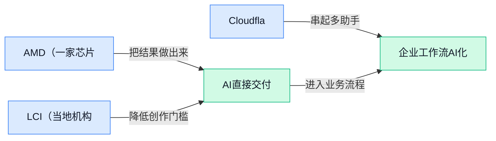

> AI 早报 · 每日早读 · 全网深度聚合

## **今日摘要**

```
DeepSeek V4 Flash 0731登上评测页，OpenAI 标记 Astra 触及最高网安风险
Anthropic 放宽 Fable 5 生物限制，仍死守病毒学、毒理学护栏
Cloudflare 推出 Kitesurf（云端浏览器），AI Agent 直接跑进 V8 isolates
```

### 🔵 产品与功能更新

1. **AMD（一家芯片公司）收购 Taalas（把 AI 模型直接做进芯片的初创公司）。**  
AMD（生产处理器和显卡的芯片公司）收购了 Taalas（专注把 **AI（人工智能）模型**直接嵌入芯片的初创公司）🚀。这类思路的关键在于把模型能力更靠近硬件本身，而不是完全依赖外部软件运行；可以理解为把“会思考的部分”提前装进机器的大脑里。对行业来说，这反映出 **AI 芯片**竞争正在从算力堆叠，走向更深层的软硬件结合 💡。[AMD 收购消息(briefing)](https://the-decoder.com/amd-acquires-taalas-a-startup-that-bakes-ai-models-directly-into-silicon/)


2. **LCI（当地机构）上线 AI（人工智能）打造的线上 HQ（在线总部）。**  
LCI（原文未展开全称的机构）推出了一个由 **AI（人工智能）**构建的线上 HQ（在线总部，也就是把信息和服务集中到一个网页入口）🚀。从标题看，这更像是把传统机构网站升级成一个更集中的数字办事空间，让访问者不用在零散页面里来回找信息。这里的 **AI 建站**可以理解为用智能工具辅助生成、组织或维护网站内容，对行政、运营类团队尤其有参考价值 💡。[线上总部报道(briefing)](https://news.google.com/rss/articles/CBMijgFBVV95cUxNRlVheUxXY2puY09KX3I0SmlyWENpQUJjOU1HeUVWUS12THFFckp2VlMxeUdQRlAyU24tWlRnYUFSN2ZudDZaU3VOMmxrN2JfaEVXWFh1cmZxSGNTR09GTjFNcGFrQk9kRXNyVTc2XzB4MkV4U0dfLVlNN3B5Q1IwbXhDSkM5VHBTdERKSXpR?oc=5)


3. **Cloudflare（一家互联网基础设施公司）推出 Kitesurf（给 AI Agent 使用的云端浏览器）。**  
Cloudflare（一家提供网络安全和网站加速服务的公司）发布了 Kitesurf（为 **AI Agent（能自动执行任务的 AI 助手）**设计的云端浏览器）🚀。它不是给人手动上网用的，而是让开发者更方便地构建“会自己打开网页、填写信息、完成流程”的浏览器型 AI Agent。原文提到，Kitesurf 在常见自动化任务中比 Chromium（Chrome 背后的开源浏览器内核）更省计算资源，这意味着同类产品可能更容易降低运行成本、提升效率 💡。[Kitesurf 发布报道(briefing)](https://techcrunch.com/2026/08/07/cloudflare-launches-kitesurf-a-browser-built-for-ai-agents/)

### 🟢 前沿研究

1. **Stanford（斯坦福大学）与 Arc Institute（美国生物医学研究机构）用 AI 设计出可杀菌的新病毒。**  
这项研究的核心信息很直接：科学家用 **AI** 设计了新的病毒，并在实验室里验证它们能杀死细菌 🧫。这里的“病毒”不是泛指电脑病毒，而是生物学里的病毒；“杀死细菌”意味着它可能与**抗菌研究**有关，但原文只提到实验室结果，不能直接理解成已经能临床使用。对普通读者来说，关键看点是 AI 正在进入**生命科学设计**环节，从“帮人分析数据”走向“参与设计可验证的生物对象” 💡。[研究报道(briefing)](https://the-decoder.com/stanford-and-arc-institute-scientists-used-ai-to-design-new-viruses-that-killed-bacteria-in-the-lab/)


2. **OSReward（一套跨平台电脑操作奖励模型评测基准）想给“AI 会不会用电脑”建立统一考试。**  
OSReward（用于评估 AI 操作电脑表现的标准化测试）关注的是 **Cross-Platform Computer-Use Reward Models（跨平台电脑使用奖励模型，判断 AI 操作电脑好坏的打分系统）**。简单说，以后 AI 不只是聊天，还要会点按钮、切窗口、完成任务，而这类能力需要统一评测，不能各说各的 🤖。Reward Model（奖励模型，像老师给 AI 行为打分的模型）如果评得不准，AI 就可能“看起来会操作”，实际任务却做不好。[论文页面(briefing)](https://huggingface.co/papers/2607.28609)


3. **WorldClaw（一种面向大规模 3D 开放世界生成的 Agent 系统）探索自动造虚拟世界。**  
WorldClaw（用于生成 3D 开放世界的 AI 系统）把重点放在 **Agentic 3D Open-World Generation（由 AI Agent 主动参与的三维开放世界生成）** 上。这里的 3D Open-World（三维开放世界，类似游戏或仿真里的可探索空间）不是一张图片，而是更复杂的空间与场景生成 🏙️。这类研究对游戏、仿真训练、虚拟内容生产都有想象空间，但从候选信息看，它目前仍是论文层面的研究方向。[论文页面(briefing)](https://huggingface.co/papers/2608.05248)

4. **OpenAI 标记 Astra（一款新模型）可能首次触及最高网络安全风险等级。**  
原文提到，OpenAI 将新模型 **Astra（OpenAI 的一款新模型）** 标记为可能达到最高 **Cybersecurity Risk Level（网络安全风险等级，用来衡量模型可能帮助攻击或防御网络系统的风险）**。这不是说模型已经造成攻击，而是说明 OpenAI 在安全评估里给出了非常高的风险提示 ⚠️。对公司同事来说，这类消息的意义在于：越强的模型越需要更严格的权限、审计和使用边界，尤其涉及代码、系统、账号安全时更不能“随手一试”。[风险报道(briefing)](https://the-decoder.com/openai-flags-its-new-astra-model-as-potentially-reaching-the-highest-cybersecurity-risk-level-for-the-first-time/)

5. **EnvACE（一种让 Agent 通过“世界预演”理解环境变化的强化学习方法）提升任务学习思路。**  
EnvACE（让 AI 在内部模拟环境变化来学习的研究）关注 **Agentic Reinforcement Learning（面向 Agent 的强化学习，让 AI 通过尝试和反馈学会做任务）**。标题里的 World Rehearsal（世界预演，像在脑中先排练一遍环境会怎么变化）说明它不是只看当前一步，而是试图让 Agent 更懂“做了某个动作后会发生什么” 🎯。这类研究如果成熟，可能帮助 AI 在复杂任务里少走弯路，但候选材料只给出论文标题，不能推断具体效果。[论文页面(briefing)](https://huggingface.co/papers/2608.06197)

6. **AgentOPSD（一种用于 Agent 强化学习的递归自蒸馏方法）让 AI 从自己的经验里反复变强。**  
AgentOPSD（面向 Agent 的递归自蒸馏训练方法）关键词是 **Recursive Self-Distillation（递归自蒸馏，让模型把自己学到的能力反复整理再教给自己）**。Self-Distillation（自蒸馏，模型用自身输出作为学习材料，像复盘笔记再训练）常用于让模型行为更稳定、更集中 📘。这篇论文把它放到 Agentic Reinforcement Learning（面向 Agent 的强化学习）场景里，说明研究者在探索 Agent 如何更高效地从任务反馈中改进。[论文页面(briefing)](https://huggingface.co/papers/2608.05987)

7. **Economic World Models（经济世界模型）论文提出从单个经济 Agent 到 Agent 经济体的系统蓝图。**  
这篇题为 From Economic Agents to Agentic Economies（从经济 Agent 到 Agent 经济体）的论文，讨论的是 **Economic World Models（经济世界模型，用 AI 模拟市场、交易、组织等经济运行环境）**。Economic Agents（经济 Agent，模拟企业、消费者或机构行为的 AI 个体）如果连接成系统，就可能形成 Agentic Economies（由多个 AI 个体互动构成的模拟经济体）💼。它更像一份系统设计蓝图，重点不是单个模型炫技，而是思考 AI 如何模拟更复杂的经济互动。[论文页面(briefing)](https://huggingface.co/papers/2608.06020)

8. **KVAE（一组面向多模态生成模型的 tokenizer）瞄准图文等内容的基础编码环节。**  
KVAE（面向多模态生成模型的一组分词器/编码器）关注 **Tokenizer（把文字、图像等内容切成模型能处理的小块的工具）**。Multimodal Generative Models（多模态生成模型，能处理或生成文字、图像等多种内容的 AI）要先把不同类型信息变成模型能理解的形式，tokenizer 就像入口处的“翻译和打包员” 📦。这类底层研究不一定直接出现在普通用户界面里，但会影响生成模型理解和生成多种内容的基础能力。[论文页面(briefing)](https://huggingface.co/papers/2608.05798)

### 🟡 行业展望与社会影响

1. **Amazon、Cursor、Microsoft、OpenAI 与 Vercel（面向前端开发者的云部署平台）联合推动 AI agent plugins（AI 智能体插件，让不同 AI 工具调用外部能力的小组件）共享标准。**  
多家公司一起推动 **AI 智能体插件标准**，信号很明确：未来的 AI 工具不能只在自家生态里“单机作战”，而要更容易接入外部服务和工作流 🚀。这里的 **插件标准** 可以理解成“统一插头规格”，让不同 AI 助手调用工具时少一些重复适配。对企业来说，这类标准如果落地，可能降低接入成本，也让采购和管理 AI 工具时更容易比较能力边界。[插件标准报道(briefing)](https://the-decoder.com/amazon-cursor-microsoft-openai-and-vercel-unite-on-a-shared-standard-for-ai-agent-plugins/)


2. **Anthropic 调整 Fable 5（一款 AI 模型）的生物安全防护。**  
Anthropic 官方发布了关于 **Fable 5 生物安全防护** 的更新，重点是改进模型在生物相关问题上的安全边界 💡。这里的 **biology safeguards（生物安全防护）**，指的是限制 AI 输出可能被滥用于生物风险的信息，比如危险实验细节。对普通用户来说，这不是“AI 变笨”，而是在知识问答和风险内容之间重新划线，避免模型把高风险信息直接交到不合适的人手里。[Anthropic 官方说明(briefing)](https://www.anthropic.com/news/improving-fable-5-s-biology-safeguards)


3. **Anthropic 放宽 Fable 5（一款 AI 模型）部分生物限制，但保留 virology（病毒学，研究病毒及传播机制的学科）与 toxicology（毒理学，研究有毒物质影响的学科）护栏。**  
The Decoder 报道称，Anthropic 对 **Fable 5** 的生物相关限制做了调整：部分限制放松，但病毒学和毒理学方向仍保留安全护栏 🔒。这说明 AI 公司正在尝试更细颗粒度的安全策略，而不是简单地“一刀切”拒答。对行业影响在于，未来模型安全可能会更像权限管理：低风险知识可以正常回答，高风险领域继续严格控制。[生物限制调整报道(briefing)](https://the-decoder.com/anthropic-loosens-fable-5s-biology-restrictions-but-keeps-the-guardrails-on-for-virology-and-toxicology/)


4. **OpenAI 提升 GPT-5.6 Sol（ChatGPT 中的新版模型）表现，同时将免费用户限制到较弱模型。**  
OpenAI 被报道在 ChatGPT 中改进了 **GPT-5.6 Sol**，但免费用户会被限制使用到较弱的模型版本 ⚡。这里的 **模型版本** 可以理解成同一款 AI 助手背后不同“发动机”，能力、速度和成本可能不一样。这个变化对用户很现实：高级模型能力继续提升，但免费体验和付费体验的差距也可能更明显。[ChatGPT 模型调整报道(briefing)](https://the-decoder.com/openai-improves-gpt-5-6-sol-in-chatgpt-and-restricts-free-users-to-its-weakest-model/)

5. **Google 发布“AI 动能下一章”博客，继续强调 AI 发展节奏。**  
Google 在官方博客中以 **“AI 动能下一章”** 为主题发布内容，延续其对 AI 布局和发展势头的公开表达 📌。这里的 **AI momentum（AI 动能，指公司在 AI 产品、研发和市场推进上的持续势头）**，更像是一种阶段性表态：告诉外界 Google 仍在加速推进 AI。虽然候选摘要没有展开具体产品细节，但这类官方博客通常会被行业用来观察大厂战略方向和优先级。[Google 官方博客(briefing)](https://news.google.com/rss/articles/CBMijAFBVV95cUxQcFZsVmdKNHhSVnQ0VDZwRXY1VmZWQno1V3MwUzMxM2VJMW5UeFFmODZXa1VDcXVBS0dOMldjY0dwcTI1V05Pc0hHUzJWcGFzMnhVMnlVLW96U0J1ZjJFQWpQVENFdnRvd0dNUFpMU003dlFlbWhSQUJDNG9qX3ZkdmJFeWloYnQ4VmNVeQ?oc=5)

### 🟣 开源TOP项目

1. **basketikun/infinite-canvas（面向 AI（人工智能）创作的无限画布工作台）把生图、视频和多 Agent（智能代理，可自动拆任务协作的 AI 助手）放进同一张画布。**  
这个开源项目主打**可视化创作流程**：你可以在无限画布上编排参考图、提示词、素材和对话创作，把原本散在多个工具里的步骤串起来 🚀。它还集成了 **AI（人工智能）生图、参考图编辑、视频生成、提示词库、素材管理**等能力，适合内容、设计和运营同事理解“未来创作工作台”会长什么样。更关键的是，它支持**多 Agent（多个智能代理协同工作，类似几个 AI 助手分工完成任务）**，说明 AI 创作正在从“单次生成”走向“流程协作” 💡。[GitHub 项目仓库(briefing)](https://github.com/basketikun/infinite-canvas)


2. **thebuggeddev/anatomy（交互式 3D（三维）人体解剖探索器）用 Three.js（网页三维图形开发库）做医学可视化。**  
这个项目是一个**交互式人体解剖浏览器**，摘要显示它使用 Three.js（让网页直接展示和操作三维模型的开发库）构建 🧠。对非技术同事来说，可以把它理解成“浏览器里的三维人体模型”，比平面图片更适合教学、演示和知识探索。原摘要还提到 **GPT 5.6 Sol（摘要中的模型/能力名称，具体用途未展开）**，但没有进一步说明它在项目里承担什么功能，所以这里不做额外推断。[GitHub 项目仓库(briefing)](https://github.com/thebuggeddev/anatomy)


3. **pranshuparmar/witr（帮你追踪程序为什么在运行的命令行工具）专治“这东西谁启动的”。**  
这个项目的核心问题很直接：**Why is this running?（为什么它在运行？）** 它可以把某个进程、端口、容器或文件一路追溯到“最初是谁启动了它”，对排查服务器和开发环境问题很有帮助 🔍。摘要提到它提供 **CLI（命令行工具，主要给技术人员在终端里输入命令使用）** 和 **TUI（终端用户界面，在黑窗口里提供类似菜单的交互界面）** 两种形态，既能快速查，也能更直观地看。对业务同事来说，它代表的是一类“让技术排障更透明”的工具，能减少服务异常时的定位时间。[GitHub 项目仓库(briefing)](https://github.com/pranshuparmar/witr)


4. **xdash/FDE-the-Guidance-Book-of-Forward-Deployed-Engineer（前沿部署工程师入门指南）把 FDE（深入客户现场解决业务与技术落地问题的工程角色）讲成一本成长手册。**  
这个开源仓库是一份 **FDE（Forward-Deployed Engineer，前沿部署工程师，通常需要贴近客户场景，把产品能力落到真实业务里）** 从零入门指南 📘。摘要说明它基于范冰《增长黑客》的原书框架，因此看起来不是单纯技术手册，而更偏向“怎么理解业务、增长和落地”的职业指南。对非技术团队也有参考价值：它解释的是一种介于**产品、客户成功、解决方案和工程**之间的岗位形态，适合观察 AI 时代“懂业务的技术角色”如何变重要。[GitHub 项目仓库(briefing)](https://github.com/xdash/FDE-the-Guidance-Book-of-Forward-Deployed-Engineer)

5. **brightdata/cli（Bright Data 的命令行数据采集工具）让网页抓取、搜索和结构化提取直接进终端。**  
这是 Bright Data（提供网页数据采集与代理网络服务的平台）的官方 **CLI（命令行工具，技术人员通过终端输入命令使用）**，用途是从终端里完成网页抓取、搜索和结构化数据提取 ⚙️。所谓**结构化网页数据**，可以理解成把网页里的杂乱内容整理成表格、字段或可分析的数据，方便后续做市场研究、竞品监控或业务分析。它体现了一个趋势：数据采集不只是“复制网页内容”，而是更强调自动抽取、整理和进入工作流 💡。[GitHub 项目仓库(briefing)](https://github.com/brightdata/cli)

### 🔴 社媒分享

1. **“Tokenpocalypse”（AI 用量计费失控）来了：企业开始压缩 AI 开支。**  
这篇文章聚焦企业为降低 **AI（人工智能）** 使用成本而采取的应对动作，核心矛盾是模型使用量越大，账单也可能快速上升。标题中的 **token（模型处理文字时切分出的计费单位，类似按字数收费）**，是许多大模型服务计算费用的重要依据。对业务团队来说，这提醒大家评估 AI 项目时，不能只看模型效果，也要关注实际使用量和长期成本 💸。[完整报道(briefing)](https://simonwillison.net/2026/Aug/7/pdfs-are-terrible/#atom-everything)


2. **Kitesurf（面向智能代理的浏览器）运行在 V8 isolates（隔离运行环境）中。**  
Cloudflare 介绍了 Kitesurf，这是一款优先服务 **Agent（能够代替人执行多步任务的智能助手）** 的浏览器。它运行在 **V8 isolates（把不同任务分隔开的轻量运行空间，避免相互干扰）** 中，说明浏览器操作可以被拆分到更独立的环境里执行。对运营、行政和业务流程而言，这类工具的方向是让 AI 更方便地浏览网页并完成连续操作，而不只是回答一个问题 🌐。[Cloudflare 官方介绍(briefing)](https://blog.cloudflare.com/kitesurf/)

3. **OpenAI 回应下一阶段关键网络安全能力。**  
OpenAI 发布文章，讨论下一阶段与 **网络安全能力（发现、应对和防范网络攻击的能力）** 相关的问题。这里的 **critical cyber capabilities（关键网络安全能力，指可能影响重要系统安全的技术与能力）**，关注点不只是普通账号防护，也涉及更高影响范围的安全场景。对企业管理者来说，这说明随着 AI 能力提升，安全治理、风险边界和使用规范也需要同步跟进 🔐。[OpenAI 官方文章(briefing)](https://openai.com/index/responding-next-frontier-critical-cyber-capabilities/)

4. **DeepSeek V4 Flash 0731（DeepSeek 的一款模型版本）登上评测结果页。**  
DeepSeek V4 Flash 0731 出现在 ARC Prize 的结果页面中，页面标题直接指向这一模型版本。**Flash（强调响应速度或运行效率的模型版本）** 这一命名，通常用于区分同系列中更注重快速处理的产品，但原页面标题本身未进一步展开具体能力。对非技术同事来说，可以把它理解为 DeepSeek 模型家族中的一次版本展示，后续仍需结合页面完整结果判断它适合哪些工作场景 ⚡。[ARC Prize 结果页面(briefing)](https://arcprize.org/results/deepseek-v4-flash-0731)

---



### 📊 行业洞察（今日 4 条）

1. AMD收购Taalas，押注把模型能力更贴近芯片层。
   【洞察】这说明AI芯片正转向软硬协同；机会是终端设备上直接跑模型更省电，风险是适配成本和生态锁定上升。
2. Cloudflare推出Kitesurf，面向Agent的云端浏览器。
   【洞察】它把网页操作交给AI执行；机会是表单和流程更顺，风险是权限边界与误操作成本更高。
3. Amazon、Cursor、Microsoft、OpenAI、Vercel推进Agent Plugins标准。
   【洞察】统一插件格式能降低接入摩擦；机会是生态互通更快，风险是标准未稳前各家实现仍会分叉。
4. OpenAI把Astra标成高风险候选，安全边界被提前收紧。
   【洞察】这表明能力越强越要收紧边界；机会是更早暴露风险，风险是高能力模型落地周期被拉长。

### 💭 对我们的启发（今日 3 条）

1. Kitesurf提示剪辑器可让Agent代做找素材、填表和审核提交，提速明显；但高风险动作要更细权限。
2. Agent Plugins标准意味着剪辑、配音、字幕能力可模块化接入；机会是扩展快，风险是接口碎片化。
3. infinite-canvas说明创作台应把素材、参考图、视频放同屏；机会是少切工具，风险是界面过重。


---

> 本周周报：[第32周综合分析](https://zhuxinfei.github.io/ai-daily-site/blog/weekly/2026-w32/)
