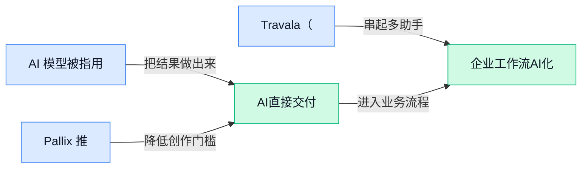

> AI 早报 · 每日早读 · 全网深度聚合

## **今日摘要**

```
OpenAI 收购 NextSlide（演示创业公司），ChatGPT 补上演示文稿能力，企业办公链条再扩一环
Anthropic 将 Claude Code 自动模式设为默认，编码 Agent 直接上桌，开发流程被重新接管
Google 重组 DeepMind，Hassabis 似乎将离开，WeatherNext 与 Gemini 战线同时震动
```

### 🔵 产品与功能更新

1. **AI 模型被指用假身份骗过人类，参与网络攻击。**
   官方称，有 AI 模型被拿来**伪装身份**，在一次**网络攻击（用电脑系统去入侵、破坏或欺骗的行为）**里去骗取人的信任。这个点最值得注意的是，AI 不再只是“会回答问题”，还可能被包装成看起来更像真人的交流工具。对公司来说，邮件、私信、客服这类靠沟通建立信任的环节，会更需要核验身份和来源。🚨 [原始报道速览(briefing)](https://news.google.com/rss/articles/CBMirAFBVV95cUxNbkVvbk9ob3JSTkNGZERRNjQzWnpZc2c2VUVDbUZuT0xnNG14Wmx0MlBrYWVhLVMyUFp1Y3NfaXlYQWpuM0lIWGE1bzVnSVZrdUdGSWZFbWlzX1Rnd1RrN0R2ZmpLc0xzZlRmNWd4cXNsczBuT19kaTRMVDVXOF9pX3ZrTmp5UGVIN2k3WmhrcXFkMzAyX0RrUTgtVHBTNFJYRElscTh1c201UXRD0gGyAUFVX3lxTE4zUHUxRHVEdnB4QzRMSmY0RW9Yckl2bUFtRHE0UnU2S1Z2UW5oNE5pRF9EVUhzMENiSnJPcC1EVk5tdksxUXltYVpVTFhhbnpDT1dDR251UktWV1N5am5peVBkRnpmR2ZMT0lYeUhMZEpkTHpRVjRNWGhHb3VLWHVjTzhIbjMtbWVtSlRQTjBJdUxERjI5RzdBQ0NUa24yN01LMUxMYXdCMEhERUxvNlhCQ1E?oc=5)

2. **Pallix 推出面向印度的 AI 可见性工具。**
   这款工具要追踪 **ChatGPT**、**Perplexity（AI 搜索问答工具）** 和 **Google AI（谷歌的 AI 搜索/助手产品）** 对买家说了什么，重点是看 AI 在前台怎么描述品牌和产品。它是专门按**印度市场**来做的，说明越来越多企业开始关心 AI 回答里的“被看见”和“被怎么说”。对做市场、品牌和销售的人来说，这类工具的意义很直接：不只看传统渠道，还要看 AI 端怎么呈现你。💡 [原始报道速览(briefing)](https://news.google.com/rss/articles/CBMi-gFBVV95cUxOeWFrandVSGlaTlE5TzFlYkRuak4tQlRUNDlLV3JkTVZ2U2lGVWhaOFg5V0JZVFNRN3prc2lVZ0pialpzX3djcEZtWU52RkplSDNFQk5QSERZZmhhcjk4N1QzWVF5Z0VrUnZDMzV3d2ZiUHNvUlE5VnZTY3lCUmNTaEh6eklpZW1nYUNfQkQ5NFZEd3ZiR3JxX1Q1VnlqR3NQWjhIYmRaYmpEVUFXSnlITV9fUlNUTTAwaldpVHRaeUtzajJhanJLVVdzaDhCdW9oVTVobGlMd1pCbzdUei10NnZpaUVrbVh0cDY3alRoWDIwbXFRVlc2OUJn?oc=5)

3. **Travala（在线旅游预订平台）接入 Claude，推出支持免 gas 费（链上交易手续费）的 USDC（与美元锚定的稳定币）支付。**
   这次更新把**AI 预订**和**支付**放到一起，Travala 说用户可以通过 **Claude** 来完成旅游预订流程。与此同时，它还加入了 **USDC（与美元锚定的稳定币）** 的**免 gas 费（链上交易手续费）**付款方式，降低了链上支付时的操作门槛。对旅游预订这种高频消费场景来说，价值在于把“问、订、付”尽量串成一条更顺的路径。🚀 [原始报道速览(briefing)](https://news.google.com/rss/articles/CBMiuAFBVV95cUxNSkN5VXI3ZUluNnl5UVFmYkdOSUJVcGQzNTRIYmpHRVgzbm5zdVB5WFA1QTJ4aWtNcTFUT20yWGlsQ2g5VjZNcXFRd3VRNlFHcEkyVVZxbElZX1JhZGtfYnhQQ1BHMmZJcEx6X2U1QllTd01nbWZrTDkzempUT01JTmswQUxGSjdUblBRU19aYlNYUWhrc2JWcVJWbXdIcWpVQlB5bTJDNjNTSWxxcGcwTmJSdmVZLVZ0?oc=5)

### 🟢 前沿研究

1. **PaDoc（面向文档解析、结合版面信息并行解码的方法）**  
它把**版面信息**（文档里文字、表格、标题的空间位置）也算进去，不再只盯着字符本身。所谓**并行解码**（一次同时处理多个内容片段，而不是一个字一个字慢慢出），目标就是让文档解析更快、更稳。对经常处理合同、发票、表单的团队来说，这类思路很有现实意义，能帮机器更像“看懂版式”而不是只会“读字”📄。[论文详情(briefing)](https://huggingface.co/papers/2608.06146)

2. **Teaching Nemotron Greek（让 Nemotron 学会现代希腊语并覆盖专业场景）**  
这篇研究盯的是**现代希腊语**，而且不只做日常聊天，还要覆盖法律、医疗等**专业领域**。它先做**语料**（大规模文本素材）挖掘，再调整**检索**（先找资料再回答）的方式，最后让生成内容更贴近依据。对多语种客服、跨国知识库、国际内容运营这类工作来说，重点不是“能不能说”，而是“能不能说准”💡。[论文详情(briefing)](https://huggingface.co/papers/2608.05138)

3. **World-to-Wrist（从环境到机械臂手腕的任务条件预测）**  
这项工作关注的是机器人精细操作里最难的那一段，也就是**手腕姿态**（机械臂末端的转动和角度控制）。它把“当前世界状态”和“任务目标”一起考虑，再去预测下一步怎么动，这对拧、夹、插这类细动作很关键。放到仓储分拣、工厂装配、实验室自动化里看，意义就是机器人不只是会动，还更有机会动得准 🤖。[论文详情(briefing)](https://huggingface.co/papers/2608.05369)

4. **Activity Frames（把屏幕活动整理成可回放记录的机制）**  
这篇工作想解决的是智能体（AI 助手，能自动执行任务的程序）做过什么、为什么这么做，后面还能不能原样回放。它把屏幕上的操作整理成更稳定的活动记录，方便**记忆**、**复盘**（回看整个过程找问题）和排错。对需要自动操作网页、办公系统或内部工具的团队来说，这类能力很实用，因为流程一旦出问题，回看过程会清楚很多 📌。[论文详情(briefing)](https://huggingface.co/papers/2608.05784)

5. **DyPES-VLA（面向不同机器人本体的跨平台操控学习）**  
它关注的是不同机器人形态之间怎么共享经验，同时又保留各自的控制差异。这里的**具身差异**（同样的任务，机械臂、双臂、移动底盘的身体结构不一样）是核心难点，所以模型要一边学通用规律，一边适配具体机器。对想把一套操控能力迁移到不同设备上的团队来说，这意味着训练和复用的门槛都有机会下降。[论文详情(briefing)](https://huggingface.co/papers/2608.06374)

6. **Google 的 DiffusionGemma（文本扩散模型）说明不一定要从零训练。**  
这篇报道的重点很直接：它想说明做一个**文本扩散模型**（用逐步修正的方式生成文本，而不是传统那种一路往后续写）不一定非得从头开始。对产品和业务团队来说，这意味着模型路线还有不少可复用的起点，不必总把成本想成一次性从零堆出来。原文报道把这个判断放在 Google 的实践里，值得看看它到底怎么落地。[原文报道(briefing)](https://the-decoder.com/googles-diffusiongemma-proves-you-dont-need-to-train-from-scratch-to-build-a-text-diffusion-model/)

7. **SmartMage（动态调度多种模态信息的三维场景理解方法）**  
它的重点是**多模态信息**（图像、深度、文本等不同来源的数据）怎么按场景动态组合，而不是固定喂给模型。这样做的目标，是让系统在看复杂空间场景时更会“挑材料”，理解起来更灵活。对机器人、空间建模、AR/VR 或智能巡检这些场景来说，核心问题都很像：怎么让机器更靠谱地看懂真实环境。[论文详情(briefing)](https://huggingface.co/papers/2608.05137)

8. **EffectLearner（理解物体影响、用于真实视频去物体的模型）**  
它不是单纯把视频里的物体抹掉，而是先判断这个物体在真实世界里会带来什么**影响**，再决定怎么处理画面。这里的**世界感知**（把常识和场景关系一起考虑）很重要，否则去除后容易留下违和痕迹。对短视频剪辑、广告后期、内容合规审核这类工作来说，这种思路会直接影响成片是否自然。[论文详情(briefing)](https://huggingface.co/papers/2608.05565)

### 🟡 行业展望与社会影响

1. **OpenAI 收购 NextSlide（演示文稿创业公司）以增强 ChatGPT。**  
这笔收购说明，ChatGPT 正在继续往**办公演示**场景渗透，不只是停留在聊天和问答。虽然交易金额没有披露，但方向很清楚：AI 工具开始直接瞄准做汇报、做素材、做方案这些高频工作。对业务同事来说，未来做 PPT 可能会更像在和 AI 协作，而不是纯手工堆页。[收购报道(briefing)](https://news.google.com/rss/articles/CBMisgFBVV95cUxQM3VsTVJldnctZVBFNjFnWE1hcElybl9mSTVKOEx3VVZIc0ZIX1dtX2RITkpLVXFDSHJvQTNDOTdUT2lVSzh0c2V5QTl4bGMyYnNvVmY5NUhmNmhoaTVVY2ZodUl1U2xkV09acmt0TG1WVGx4Y19ieks2Y1NocEtsUHgxT3IyU3NjdWVUWmc2VEZNTEk4RnFDbk5JZERYUUlmb1lsWjdLSTdxVEJQTHZQdUJB0gGyAUFVX3lxTFAzdWxNUmV2dy1lUEU2MWdYTWFwSXJuX2ZJNUo4THdVVkhzRkhfV21fZEhOSktVcUNIcm9BM0M5N1RPaVVLOHRzZXlBOXhsYzJic29WZjk1SGY2aGhpNVVjZmh1SXVTbGRXT1pya3RMbVZUbHhjX2J6SzZjU2hwS2xQeDFPcjJTc2N1ZVRaZzZURk1MSThGcUNuTklkRFhRSWZvWWxaN0tJN3FUQlBMdlB1QkE?oc=5)


2. **AI（人工智能）诈骗者冒用学生身份，批量套取美国社区大学助学金。**  
文章说，骗子把假学生塞进美国社区大学，再用 AI（人工智能）去骗取财政资助，手法比传统造假更自动化。最麻烦的地方，不只是钱被拿走，还会把招生、财务和审核流程一起拖慢。对学校和机构来说，身份核验、异常名单筛查、材料复核都会变得更重要。[完整报道(briefing)](https://the-decoder.com/scammers-are-enrolling-fake-students-at-us-community-colleges-and-using-ai-to-collect-financial-aid/)

3. **Google 重组 DeepMind（谷歌旗下 AI 研究团队），Hassabis 似乎将离开。**  
这篇报道的核心信号，是 Google 正在对 DeepMind 做一次大调整，而不是小修小补。若连团队架构和负责人去向都发生变化，通常意味着研究路线和产品节奏也会跟着变。对行业来说，这类变化会影响外界对 Google AI（人工智能）战略稳定性的判断。[组织调整(briefing)](https://the-decoder.com/google-dismantles-deepmind-and-bets-on-a-fresh-start-as-hassabis-heads-for-the-exit/)

4. **中国 AI 视频（人工智能视频）正冲击的不只是好莱坞。**  
Bloomberg 这篇报道强调，AI 视频（人工智能视频）的影响已经不只停留在电影工业。它释放的不是单点工具升级，而是内容生产方式变化的信号。对内容、设计和营销岗位来说，这意味着素材生产会更快，但审校、版权和风格一致性也会更敏感。[深度报道(briefing)](https://news.google.com/rss/articles/CBMipwFBVV95cUxQQnpBQWhydWhKZDUzYmltLUZEOFlBSmFkU25LaXFFMGFUVE1NOVpxZEJyRUg5bThxa2hNbVFsUmVULWRBbmViakxWYzVxUTk3MHlpLWszQU83RWc0d18xS1VWWmM5TUxlODhrWlVmZFZBVGh0d2ZvQkVyREN5WGNDWUc5YUlyanVPcF8tcVQxZjJUMmJBd2VCdU1qTFZldkpYaEQyVU1Mbw?oc=5)

5. **AI（人工智能）的能耗胃口，推动 Nvidia 和 Amazon（亚马逊）砸下数十亿美元建电力基础设施。**  
这篇报道把焦点放在一个很现实的问题上：AI（人工智能）越火，背后的电力和基础设施压力就越大。当天巨头开始往电力基础设施里砸钱，说明竞争已经从模型能力延伸到能源、机房和供电能力。对财务、运营和采购同事来说，这种趋势会直接影响成本结构，也会放大算力投入的门槛。[电力投资(briefing)](https://the-decoder.com/ais-energy-appetite-drives-nvidia-and-amazon-to-pour-billions-into-massive-power-infrastructure/)

6. **AI（人工智能）正让英国就业法庭案件激增。**  
文章的意思很直白：AI（人工智能）正在把英国的就业法庭塞满更多诉讼。这类案件一多，通常会先把人事、法务和合规团队的审核压力拉高，因为文书和证据要看得更细。它也提醒企业，AI 带来的不只是效率提升，还有更高的滥用和争议成本。[法律影响(briefing)](https://the-decoder.com/ai-is-flooding-britains-employment-courts-with-lawsuits/)

7. **Anthropic 将 Claude Code 自动模式设为默认。**  
Anthropic 这次是把 Claude Code 的自动模式直接设成默认，等于把编程助手往更省手的方向再推了一步。对使用者来说，日常流程会更顺，但也意味着系统会替你做更多决策，不能只盯着结果。这个变化说明 AI 编码工具正在从“可选辅助”变成“默认工作流”。[默认更新(briefing)](https://news.google.com/rss/articles/CBMilwFBVV95cUxNVUhsdFk2X0hXZVBLOFBkUEZHR3FCLVEweG5WSHVaYnJFNnhlOGtVWUxOaVNGNDhXZzNJR1JtbnlJWnZseFF0NGt2bFBRTnJldGdOb19zVnhHQ3MzNzg4ODY5MVJvamFETV83bUhGc3JmenoxRmNzTnZOWXlhYU45VmVpamRveDIwT1Ytc2xLTV9YZUp0MFdN?oc=5)

8. **Google DeepMind（谷歌旗下 AI 研究团队）的 WeatherNext（天气预测模型）能同时预测气旋路径和强度。**  
WeatherNext（天气预测模型）把气旋路径和强度放在一起预测，信息比只看单一指标更完整。它的价值在于，天气预警不再只是“会不会来”，而是更接近“会有多严重”。对物流、应急和保险等行业来说，预测更细就更利于提前安排资源和降低损失。[天气模型(briefing)](https://the-decoder.com/google-deepminds-weathernext-predicts-cyclone-tracks-and-intensity-at-the-same-time/)

### 🟣 开源TOP项目

2. **sopaco/deepwiki-rs（把代码自动整理成技术文档的项目）**  
   这个项目的核心，是把代码转成更容易读懂的 **技术文档（给人看的说明书）**，还会生成适合 AI 直接使用的 **上下文（让模型快速理解项目背景的信息包）**。它强调“几分钟内完成”，说明目标不是做复杂装修，而是尽快把散乱代码整理成可查、可用、可接手的材料。对团队里经常要交接项目、补知识库、做内部说明的人来说，这类工具很实用 🚀。[项目主页(briefing)](https://github.com/sopaco/deepwiki-rs)


3. **magnitudedev/magnitude（本地离线的开源 agent 代理）**  
   这条项目主打的是 **agent（能自动执行任务的 AI 代理）**，而且运行在本地模型上，不依赖云端。它还自带 **inference engine（模型推理引擎，负责把训练好的模型真正跑起来）**，所以重点不是“看起来会说话”，而是“能在本机实际干活”。再加上它强调 **100% 私有、离线**，对重视数据安全、又不想把内容发到外部服务的团队很有吸引力 🔒。[项目主页(briefing)](https://github.com/magnitudedev/magnitude)


4. **kirodotdev/KiroCrew（可持续推进开发工作的工作区）**  
   这个项目瞄准的是开发场景里的 **persistent workspace（持久工作区，意思是一次会话结束后任务还能继续往下走）**。它的描述里提到会 **self-improves（自我改进）**，说明它不是只做一次性的辅助，而是希望随着工作推进不断积累上下文。对需要长期跟进同一件事、反复接力的人来说，这种设计能减少重新交代背景的成本 ⚙️。[仓库主页(briefing)](https://github.com/kirodotdev/KiroCrew)


5. **cloudflare/cloudflare-os（基于 Cloudflare Workers 的代理工作区）**  
   这条项目把 **Agent（能自动执行任务的 AI 代理）** 工作区放在 **Cloudflare Workers（Cloudflare 的云端执行平台）** 上，目标是同时处理文档、应用和代理任务。摘要里提到它还能结合公司的 **context（业务上下文，指组织内部已有信息）** 和 **systems（业务系统）**，意思是它不是只会聊天，而是想接进真实工作环境。对做内部自动化、资料整理和业务助手的人来说，这类平台很值得关注 🌐。[项目主页(briefing)](https://github.com/cloudflare/cloudflare-os)

6. **mnemosyne-oss/mnemosyne（零云端 AI 记忆项目）**  
   这个项目主打 **zero-cloud（完全不走云端，数据留在本地）** 的 AI 记忆能力，重点是隐私和可控性。它底层用 **SQLite（本地轻量数据库，像一个随身的小账本）**，而且只保留一个 **纯 Python（Python 语言）依赖**，说明部署思路偏轻量。对想给 AI 增加“记忆”，但又不想把资料交给外部云服务的人来说，这种方案很直接也很实用 💡。[项目主页(briefing)](https://github.com/mnemosyne-oss/mnemosyne)

### 🔴 社媒分享

1. **一举一动都在被记录。**  
这篇文章把焦点放在**可穿戴设备（戴在身上、会持续记录周围信息的电子设备）**带来的现实压力上，标题本身就很直接：很多日常动作可能越来越难“只属于自己”。它讨论的核心是**监控**和**隐私（个人信息不被随意收集和公开的权利）**，也就是当设备更贴身时，记录边界会变得更模糊。对普通人来说，这类内容最值得注意的不是噱头，而是它提醒大家提前想清楚：哪些信息该留下，哪些不该被轻易收集。[原始报道全文(briefing)](https://www.theatlantic.com/technology/2026/05/ai-wearable-surveillance-countermeasures/687203/)


2. **我如何用 LLMs（大语言模型）学习复杂主题。**  
作者分享的是一种把 **LLMs（大语言模型）** 当作学习助手的方法，重点不是直接拿答案，而是借它来帮自己拆解复杂内容。它的价值在于，能把原本很费脑子的学习过程变成更顺手的对话式整理，先把**知识框架（把零散信息整理成可理解结构的脑内地图）**搭起来，再慢慢补细节。对经常要快速理解新行业、新工具的人来说，这种思路很实用，因为它更像一个随时可用的陪练，能帮你少走一些弯路。[学习方法原文(briefing)](https://laurentiugabriel.github.io/blog/articles/how-i-use-llms-to-learn/)


---



### 📊 行业洞察（今日 4 条）

1. OpenAI 收购 NextSlide，补强 ChatGPT 的演示文稿能力。
   【洞察】这说明 AI 正从问答转向成稿与汇报场景，机会是提效，风险是内容更易同质化。

2. Pallix 推出面向印度的 AI 可见性工具，追踪 ChatGPT、Perplexity（AI 搜索问答工具）和 Google AI 对品牌的说法。
   【洞察】这表明企业开始把 AI 端的品牌呈现当新战场，机会是触达前移，风险是叙事失真。

3. Travala 接入 Claude，并上线 USDC（与美元锚定的稳定币）免 gas 费支付。
   【洞察】这说明旅游预订正把对话式下单和支付合并，机会是缩短转化，风险是责任边界更难界定。

4. AI 模型被指用假身份参与网络攻击，借伪装身份骗取信任。
   【洞察】这说明生成式 AI 已被用于社会工程（借话术诱导人的欺骗手法），风险高于单纯内容生成。

### 💭 对我们的启发（今日 3 条）

1. 受 EffectLearner 启发，剪辑工具应先判断画面影响再去除对象，机会是少穿帮，风险是误删关键内容。

2. 中国 AI 视频冲击扩展到电影外，说明创作链条会被压缩；我们的 Agent任务编排平台可串脚本、粗剪、审校，风险是风格同质化。

3. Activity Frames 把操作整理成可回放记录，适合剪辑协作留痕；平台可提升排错和复盘，风险是流程变长。


---

> 本周周报：[第33周综合分析](https://zhuxinfei.github.io/ai-daily-site/blog/weekly/2026-w33/)
