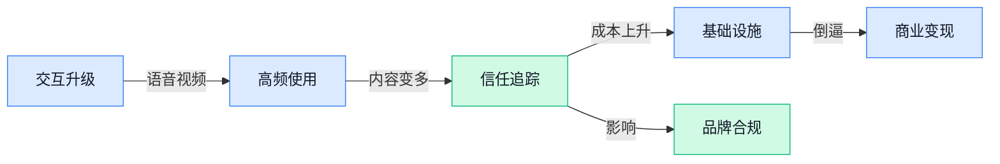

> AI 早报 · 每日早读 · 全网深度聚合

## **今日摘要**

```
Google Gemini用户冲到10亿，OpenAI在ChatGPT测试广告
Anthropic给Claude全球输出加水印，又签Riot Platforms（比特币矿企）91亿美元
英伟达用自家芯片价值担保，撬动5000亿美元AI基建融资
```

### 🔵 产品与功能更新

1. **Google 的 Gemini 用户数冲到 10 亿。**  
Google 披露，**Gemini 应用**用户规模已达到 **10 亿**，说明它不只是“能聊天”，正在变成更高频的日常工具 🚀。从使用方式看，**63% 的 Gemini 用户会直接用语音和助手交流**，这里的语音功能（不用打字、像打电话一样和 AI 对话）正在成为主流入口。Google 还表示，Gemini 现在每天生成超过 **1.5 亿张图片**，图像生成（用文字描述让 AI 画图或做视觉内容）已经是非常核心的使用场景。[用户增长报道(briefing)](https://techcrunch.com/2026/08/11/googles-gemini-app-surges-to-one-billion-users/)


2. **Anthropic 将给 AI 生成文本加“水印”。**  
Anthropic 表示，将为自家 AI 模型生成的文字加入**文本水印**（在内容里嵌入不容易被人眼看出的标记，用来识别是否由 AI 生成）💡。这件事的重点在于，它不只面向新模型，还会把水印支持扩展到**旧模型**，减少不同版本之间的识别空档。对内容审核、合规和品牌传播团队来说，AI 生成内容可追溯性（能判断内容来源，降低误用风险）会变得更重要。[文本水印报道(briefing)](https://techcrunch.com/2026/08/11/anthropic-says-it-will-watermark-text-generated-by-its-ai-models/)


3. **OpenAI 推出 GPT-5.6-Cyber（面向网络安全防守的 AI 模型）。**  
OpenAI 发布 **GPT-5.6-Cyber**，定位是帮助防守方在攻击者之前发现**漏洞**（软件或系统里的安全缺口，可能被黑客利用）🛡️。从标题信息看，它面向的是网络安全防御场景，也就是让 AI 协助安全团队更早识别风险。对企业来说，这类产品更新意味着 AI 正在从“写文案、写代码”进一步进入安全运营（持续监控和处理安全风险的工作）这类专业岗位流程。[网络安全发布(briefing)](https://the-decoder.com/openai-launches-gpt-5-6-cyber-to-help-defenders-find-vulnerabilities-before-attackers-do/)


### 🟢 前沿研究

1. **AMIE（Google 研究中的医疗人工智能系统）首次展示实时临床视频问诊能力。**  
Google 介绍了研究型医疗 AI 系统 **AMIE（用于模拟临床问诊的医疗人工智能系统）**，这次重点是展示它在**实时临床视频咨询**中的能力 🚀。原文强调研究发生在**模拟场景（不是直接面对真实患者，而是在受控环境里测试能力）**，这对医疗 AI 的安全验证很关键。简单说，它不是只会“文字答题”，而是在朝着更接近真实医生问诊的互动形态迈进。[Google 研究博客(briefing)](https://blog.google/innovation-and-ai/models-and-research/google-research/amie-video-consultations/)


2. **研究警示：专有大模型接口可能被“偷走”隐藏推理轨迹。**  
这篇论文关注一个敏感问题：主流大模型服务商会隐藏模型的**chain-of-thought（思维链，模型一步步推理的中间过程）**，目的是保护知识产权并减少信息泄漏 🔐。但研究标题指出，即使通过**专有大模型 API（应用程序接口，外部系统调用模型能力的入口）**访问，也可能存在推理轨迹被窃取的风险。对企业来说，这提醒我们：模型输出不只是“答案”，中间推理也可能成为安全与合规关注点。[论文原文页面(briefing)](https://arxiv.org/abs/2608.09867)


3. **Ouroboros（自我演进的人工智能编程助手）探索让编程智能体自己改进自己。**  
Ouroboros 这项研究的核心方向，是打造一个**自我发展的编程智能体（会自动写、改、检查代码的 AI 助手）** 💡。标题中的 **Reviewed Core Evolution（带审查的核心演化，让系统在被检查后再升级自身核心能力）** 很关键，意思不是让 AI 完全放飞自改，而是把“审查”放进演进流程里。它瞄准的是更强的自动编程能力，也提醒大家：未来代码工具可能不只是辅助人写代码，还会持续改进自己的工作方式。[论文介绍页(briefing)](https://huggingface.co/papers/2608.08311)

4. **Scaling Inherently Interpretable Language Models（可规模化的天然可解释语言模型研究）瞄准“看得懂”的大模型。**  
这项研究关注 **Inherently Interpretable Language Models（天然可解释语言模型，设计上就更容易看懂其决策原因的模型）**，重点是如何把它们做大、做强 📈。这里的 **scaling（规模化，把方法扩展到更大模型和更多任务时仍能有效运行）** 很重要，因为很多可解释方案在小实验里好用，放到大模型上就可能变难。对非技术团队来说，它的价值在于：未来 AI 不只是“答得准”，还要让人更容易理解它为什么这么答。[论文介绍页(briefing)](https://huggingface.co/papers/2608.07594)

5. **BDH-CQ（一种上下文学习与循环潜在推理研究）尝试增强模型临场推理。**  
BDH-CQ 这项研究围绕 **In-Context Learning（上下文学习，不改模型本身，只靠题目里给的例子临时学会做事）** 展开 🧠。标题还提到 **Recurrent Latent Reasoning（循环潜在推理，让模型在内部反复推敲但不一定把过程全写出来）**，说明研究重点在模型“边看题边思考”的能力。它对应的行业意义是：如果这类方向成熟，AI 在面对新任务、新格式时可能更少依赖重新训练，适应速度更快。[论文介绍页(briefing)](https://huggingface.co/papers/2608.09888)

6. **On-Policy Self-Distillation（无监督同策略自蒸馏研究）探索模型自己教自己。**  
这项研究标题里的 **Self-Distillation（自蒸馏，让模型从自己的输出中提炼经验，像自己整理错题本）** 是重点，方向是让模型在没有外部监督的情况下提升自己 ✨。同时，**On-Policy（同策略，使用模型当前自己的行为方式来产生学习材料）** 说明它更贴近模型当下的真实表现。原题还强调 **without Any Supervision（没有人工标注答案或外部标准指导）**，这类研究如果有效，可能降低模型改进对人工标注数据的依赖。[论文介绍页(briefing)](https://huggingface.co/papers/2608.06296)

### 🟡 行业展望与社会影响

1. **Anthropic 与 Riot Platforms（比特币矿企，靠大量服务器和电力参与数字货币挖矿的公司）签下 91 亿美元数据中心大单。**  
Anthropic 这笔交易的核心，是向 Riot Platforms 获取大规模**数据中心**（集中放置服务器、显卡和网络设备的“算力工厂”）资源，用来支撑 Claude 等产品背后的模型运行 🚀。比特币矿企原本就擅长管理高耗电机房，如今被人工智能公司看中，说明**算力和电力资源**正在成为新一轮行业竞争的硬通货。对企业来说，这类交易也提醒我们：未来人工智能服务的成本，不只取决于模型聪不聪明，还取决于背后有没有足够稳定、便宜的基础设施 💡。[数据中心交易报道(briefing)](https://the-decoder.com/anthropic-signs-9-1-billion-data-center-deal-with-bitcoin-miner-riot-platforms/)


2. **英伟达用自家芯片价值担保，撬动 5000 亿美元人工智能基础设施融资。**  
英伟达正在用一种很“金融化”的方式支持人工智能建设：为自家芯片的价值提供担保，帮助相关项目获得高达 5000 亿美元的**基础设施融资**（为数据中心、显卡、电力等长期资产筹钱）💰。这里的关键不只是卖芯片，而是把芯片变成类似“抵押资产”的东西，让银行和投资方更愿意下注。对行业来说，这意味着人工智能竞争正在从“谁模型强”扩展到“谁能把算力、资本和硬件打包成体系”⚡。[芯片融资报道(briefing)](https://the-decoder.com/nvidia-guarantees-its-own-chips-value-to-unlock-500-billion-in-ai-infrastructure-financing/)


3. **General Catalyst（美国风险投资机构）领投 River AI（主打个人智能代理的新创公司）11 亿美元融资。**  
River AI 成立仅两个月，就拿到由 General Catalyst 领投的 11 亿美元融资，创始人 Igor Babuschkin 曾是 xAI（马斯克创办的人工智能公司）联合创始人之一 😮。这家公司主打**个人智能代理**（像“数字助理”一样，能长期理解你的需求并帮你处理任务的人工智能工具）愿景，说明资本仍在押注“人人都有专属助手”的方向。虽然原文信息不多，但这么早期就获得大额融资，本身反映出市场对下一代个人工具入口的期待依然很高 🚀。[融资完整报道(briefing)](https://techcrunch.com/2026/08/11/general-catalyst-leads-1-1b-round-into-2-month-old-river-ai/)

4. **英伟达 Nemotron 3.5 Lightning（主打高速响应的开放权重大模型）选择快过“最聪明”。**  
英伟达的 Nemotron 3.5 Lightning 是一款**开放权重模型**（模型参数开放给开发者使用和部署，但不一定等同于完整开源），重点不是追求最高智能水平，而是优先提升响应速度 ⚡。这对很多业务场景很现实：客服、搜索、办公助手等产品，有时“快一点、稳定一点”比“极限聪明”更重要。它也代表一种趋势：人工智能模型不再只拼排行榜分数，而是开始按真实产品需求分化，比如速度、成本、部署灵活性各有侧重 💡。[模型发布报道(briefing)](https://the-decoder.com/nvidias-open-weight-nemotron-3-5-lightning-prioritizes-speed-over-maximum-intelligence/)

5. **Anthropic 给全球 Claude 输出加水印，部分编辑后仍可能保留痕迹。**  
Anthropic 开始为全球范围内所有 Claude 输出加入**数字水印**（隐藏在文本里的识别痕迹，用来判断内容是否可能由模型生成）🔍。原文提到，这些标记“可能在部分编辑后仍然存在”，意味着即使文字被稍微改写，也可能保留可识别线索。对内容、法务、品牌和教育等场景来说，这会让“这段话是不是人工智能写的”变得更可追踪，也可能推动企业建立更明确的内容使用规范。[水印机制报道(briefing)](https://the-decoder.com/anthropic-watermarks-all-claude-outputs-globally-with-marks-that-may-persist-through-some-editing/)

6. **OpenAI 开始在 ChatGPT 测试广告，以支持免费使用。**  
OpenAI 宣布开始在 ChatGPT 中测试**广告**（在产品里展示商业信息，用收入补贴免费访问），目标是继续支持免费用户使用服务 📣。官方强调广告会有清晰标识，并保持**答案独立性**（广告不影响回答内容或判断），同时提供隐私保护和用户控制。对普通用户来说，关键问题会变成：免费服务能否继续好用，以及广告会不会打扰对话体验；对行业来说，这也是人工智能产品寻找可持续商业模式的一次重要尝试。[广告测试说明(briefing)](https://openai.com/index/testing-ads-in-chatgpt)

### 🟣 开源TOP项目

1. **MiniMax-AI/MiniMax-H3（MiniMax 在 GitHub 上的开源项目仓库）已进入开源榜单。**  
这个条目目前只提供了 **GitHub 仓库**信息，原材料没有给出功能摘要或技术说明，所以这里不额外猜测它具体能做什么 👀。对关注开源动态的同事来说，可以先把它理解为一个正在被社区关注的**开源仓库**（公开存放项目代码、文档和版本记录的地方）。如果后续仓库补充说明文档，再判断它适合研究、产品集成还是技术学习会更稳妥。[GitHub 项目仓库(briefing)](https://github.com/MiniMax-AI/MiniMax-H3)


2. **firecrawl/anydoc（把多种文档转成干净 Markdown 的工具）让资料清洗更省事。**  
anydoc（一个文档格式转换工具）主打把 **Word（微软文字文档格式）**、**PowerPoint（微软演示文稿格式）**、**Excel（微软表格格式）**、PDF（常见电子文档格式）等文件转换成干净的 **Markdown（轻量级纯文本排版格式）** 📄。它还支持 OpenDocument（开源办公文档格式）、RTF（富文本格式）、EPUB（电子书格式）和 CSV（表格数据文本格式），适合把杂乱资料整理成更容易被系统读取的文本。项目使用 Rust（一种强调速度和安全性的编程语言）构建，并提供 Node.js（常用于网站后端的运行环境）和 Python（一种常用于自动化与数据处理的编程语言）接口，方便不同开发团队接入 🚀。[文档转换仓库(briefing)](https://github.com/firecrawl/anydoc)


3. **bojieli/ai-agent-book（《深入理解 AI Agent》开源书籍仓库）开放正文、PDF 与配套代码。**  
这个仓库是《深入理解 **AI Agent**：设计原理与工程实践》的开源主仓库，包含全书正文、编译版 PDF（方便阅读和分发的电子文档格式）以及按章节配套代码 📚。对非技术同事来说，AI Agent（能按目标自主拆解任务、调用工具并推进流程的 AI 助手）正在从概念走向实际业务系统，这类资料有助于理解它为什么不只是“会聊天”。配套代码（跟随章节提供的示例程序）也意味着技术同事可以边读边复现，更适合做团队内部学习材料 💡。[AI Agent 书籍仓库(briefing)](https://github.com/bojieli/ai-agent-book)


4. **cathrynlavery/diagram-design（给 Claude Code 用的编辑类图表模板）提供 13 种图表设计。**  
这个项目提供 13 种 editorial diagram（编辑类图表，用来解释观点、流程或结构的视觉图）类型，面向 Claude Code 使用 🎨。它采用自包含 HTML（网页结构标记语言）加 SVG（可缩放矢量图格式，放大也不糊）的方式，不依赖复杂外部组件，方便直接生成和调整。摘要中特别提到没有阴影，也没有 Mermaid-slop（指用 Mermaid 图表语法生成但视觉效果粗糙的图），说明它更偏向干净、可读、适合内容表达的图表风格。[图表模板仓库(briefing)](https://github.com/cathrynlavery/diagram-design)

### 🔴 社媒分享

1. **“窃取推理痕迹”研究提醒：专有 LLM API（闭源大模型调用接口）也可能暴露模型思考过程。**  
这条分享指向一项名为 **Stealing Reasoning Traces from Proprietary LLM APIs（从闭源大模型接口中窃取推理痕迹）** 的研究，核心关注点是：用户是否可能从模型返回结果里还原出部分“思考线索” 🕵️。这里的 **reasoning traces（推理痕迹，指模型解题时留下的中间思路或步骤）**，对企业来说既有解释价值，也可能带来安全与商业机密风险。Simon Willison（知名开发者与技术博主）也转发点评了这个项目，说明它已经引起技术圈注意。[研究项目页(briefing)](https://stolen-thoughts.com/) [技术博主点评(briefing)](https://simonwillison.net/2026/Aug/11/stealing-reasoning-traces/#atom-everything)


2. **Nvidia Nemotron 3.5 Lightning（英伟达大模型产品线的新版本）与 NeMo Switchyard（用于调度模型服务的组件）亮相。**  
Nvidia 官方博客分享了 **Nemotron 3.5 Lightning** 和 **NeMo Switchyard**，重点显然放在更快、更可控的大模型部署方向上 ⚡。这里的 **模型部署**，可以理解为“把训练好的模型真正放到业务系统里跑起来”，不只是实验室演示。对公司内部业务同事来说，这类产品的意义在于：未来客服、内容生成、数据分析等应用，可能会更依赖这种可管理、可切换的大模型基础设施。[英伟达官方博客(briefing)](https://blogs.nvidia.com/blog/nemotron-lightning-switchyard-rtx-dgx/)


3. **Nvidia Magpie TTS（英伟达多语言语音合成模型）面向低延迟语音 Agent（能自动完成任务的语音助手）开放权重。**  
HuggingFace（全球最大人工智能模型共享社区）博客介绍了 **NVIDIA Magpie TTS**，主题是构建 **低延迟多语言语音 Agent** 🎙️。这里的 **TTS（文字转语音，把文字内容自然地读出来）** 很关键，因为语音客服、实时翻译、智能前台都离不开它；而 **开放权重（公开模型参数，方便别人下载、改造和部署）** 则意味着团队能获得更强的自主控制。标题还强调 **full deployment control（完整部署控制，企业可以更自主决定模型跑在哪里、怎么跑）**，这对重视数据合规和成本控制的公司尤其重要。[模型社区博客(briefing)](https://huggingface.co/blog/nvidia/magpie-tts-multilingual-voice-agents)

4. **Platformer（科技媒体专栏）把超级智能比作“一条龙”。**  
这篇专栏标题是 **Superintelligence is a dragon（超级智能是一条龙）**，用“龙”来隐喻一种强大、诱人但难以驾驭的力量 🐉。这里的 **superintelligence（超级智能，指能力可能超过人类整体水平的人工智能）** 不是普通聊天机器人，而是更偏未来风险与社会影响的讨论。原文开头还披露作者未婚妻在 Anthropic 工作，这属于利益关系说明，提醒读者阅读观点类文章时也要关注作者背景。[专栏原文(briefing)](https://www.platformer.news/zuckerberg-ai-manifesto-dragons/)

5. **Stratechery（科技商业分析媒体）讨论 Nvidia 的“高风险生意”。**  
这条来自 Stratechery 的文章标题是 **Nvidia’s Risky Business（英伟达的高风险生意）**，看起来聚焦英伟达当前业务中的不确定性 📈。页面摘要显示部分内容为受限阅读，说明它更像是一篇深度商业分析，而不是普通新闻快讯。对非技术同事来说，关注点不只是“芯片卖得好不好”，还包括 **算力基础设施（支撑大模型训练和运行的硬件、数据中心与能源组合）** 是否会影响未来人工智能产品的成本和竞争格局。[商业分析文章(briefing)](https://stratechery.com/2026/nvidias-risky-business/)

---



### 📊 行业洞察（今日 4 条）

1. Google 的 Gemini（Google 的 AI 助手）到 10 亿用户，AMIE（Google 医疗问诊 AI）又在测实时视频问诊
  【洞察】AI 入口正在从“打字聊天”变成“语音和视频对话”，谁离真实工作场景更近，谁更容易被高频使用。

2. Anthropic 给 Claude 文本加水印，同时研究曝出隐藏推理过程可能被还原
  【洞察】这两件事放一起看，AI 信任机制正在升级，但也说明“可追踪”和“真安全”不是一回事，企业不能只信厂商承诺。

3. Anthropic 买 91 亿美元数据中心，英伟达又用芯片担保撬动 5000 亿美元融资
  【洞察】AI 竞争已经不只是模型聪不聪明，而是电力、机房、资本一起拼；未来便宜稳定的 AI 服务会更难做。

4. 英伟达 Nemotron 3.5 Lightning（主打高速响应的大模型）追求快，OpenAI 又在 ChatGPT 测广告
  【洞察】行业开始从“炫能力”转向“算账”：响应够快、成本够低、商业模式能跑通，比单纯最强更现实。

### 💭 对我们的启发（今日 3 条）

1. Gemini（Google 的 AI 助手）用户大量用语音，AMIE（Google 医疗问诊 AI）也在测视频互动，说明剪辑软件不能只靠按钮操作，要尽快支持“说一句话改字幕、换节奏、重剪开头”。

2. Anthropic 给 Claude 加水印提醒我们，品牌商以后会更在意内容来源。我们的视频工具应记录哪些文案、配音、画面由 AI 生成，方便客户对平台、达人和法务交代。

3. 英伟达强调高速模型，OpenAI 测广告补贴免费使用，说明 AI 成本压力是真的。我们应把便宜 AI 用在粗剪、字幕、分镜整理，把贵 AI 留给爆款脚本和最终成片检查。


---

> 本周周报：[第33周综合分析](https://zhuxinfei.github.io/ai-daily-site/blog/weekly/2026-w33/)
