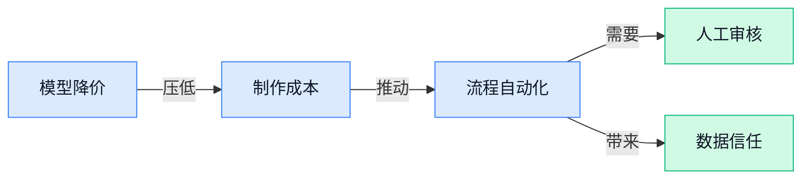

> AI 早报 · 每日早读 · 全网深度聚合

## **今日摘要**

```
OpenAI推出ChatGPT Linux桌面应用，称企业正从辅助使用迈向AI自主执行
Anthropic聘法律创业者Robert Mahari，Claude瞄准法律行业
Grok 4.6据称追平OpenAI旗舰模型，DeepSeek V4 Pro现身调用平台
```

### 🔵 产品与功能更新

1. **Anthropic 聘请法律创业者 Robert Mahari，推动 Claude（AI 助手）进入法律行业。**  
法律创业公司创始人 **Robert Mahari** 加入 Anthropic，负责推动 **Claude（AI 助手）** 在律师事务所和法律业务中的应用。这个动作显示，Anthropic 正把 **AI（人工智能）** 从通用聊天工具进一步带入专业服务场景。对法律行业来说，未来值得关注的是 AI 如何参与日常工作流程，而不只是回答问题 ⚖️ [完整报道(briefing)](https://the-decoder.com/legal-startup-founder-robert-mahari-joins-anthropic-to-lead-claudes-push-into-law-practices/)


2. **OpenAI 推出 ChatGPT（AI 助手）Linux（开源电脑操作系统）桌面应用。**  
OpenAI 发布了面向 **Linux（开源电脑操作系统）** 用户的 ChatGPT 桌面应用，让用户可以直接在电脑上使用这款 **AI 助手**。相比浏览器版本，**桌面应用（安装在电脑上的软件版本）** 更适合需要频繁调用 ChatGPT 的工作场景。此举也扩大了 ChatGPT 的桌面平台覆盖范围，为使用 Linux 的开发者和办公用户提供了更方便的入口 🖥️ [产品发布报道(briefing)](https://the-decoder.com/openai-launches-chatgpt-desktop-app-for-linux/)


3. **Suvi Health（医疗健康公司）推出环境式 AI（融入照护场景的人工智能）方案，帮助患者缩短住院时间。**  
Suvi Health 发布了一套面向患者的 **环境式 AI（在照护场景中辅助处理信息的人工智能）** 解决方案，目标是减少住院时长并支持后续照护衔接。这里的**照护衔接（患者从医院转入其他医疗或护理环节的过程）**，是医疗服务中连接住院治疗与后续照护的重要环节。对医院和患者而言，这类产品的价值在于支持更顺畅的出院与后续照护安排 🏥 [医疗产品报道(briefing)](https://news.google.com/rss/articles/CBMiyAFBVV95cUxQazZmS0t6SnI0OVJKT0pZUmtZNktCeGh6bDRaMlZ5S19vd3dMblktTXpDaUg3OXJsUkF4cEtQenhVSWhzcnRHWkppaGZocmljSnlyWjdGR0lmWFVYdjRiUHd4WWh0RzZUM3VKaVFYNEl3LW1SUDJKUU1nVFU0UTF5UU1nVFU0UTF5UU9tX0Radkt6c0RmSlhOREg2eU1pME9hY2N6N1pFRlc5bjJaenROeA?oc=5)

### 🟢 前沿研究

1. **Mendel Gödel Machine（递归自我改进编码智能体）探索代码 Agent 的自我进化。**  
这项研究聚焦于让**编码 Agent（能够理解需求并编写、修改代码的智能体）**通过递归方式持续改进自己。标题中的 **Comparative Evolution（比较进化）**，指的是通过比较不同版本的表现，筛选出更好的方案。它关注的核心问题是：AI 能否不完全依赖人工设计，逐步提升自身的编程能力 🤖。[arxiv 论文页面(briefing)](https://huggingface.co/papers/2608.07645)

2. **360CityArena（真实虚拟城市导航评测场）检验具身智能体的城市穿行能力。**  
这项研究提出了一个面向**具身智能体（能感知环境并采取行动的 AI）**的虚拟城市导航基准。所谓 **benchmark（基准测试，用统一场景比较不同模型能力）**，可以帮助研究者评估 AI 在城市环境中的路线判断与行动表现。它把测试场景从抽象地图推进到更接近现实的三维城市空间，为相关 Agent 的能力比较提供了新环境 🏙️。[arxiv 论文页面(briefing)](https://huggingface.co/papers/2608.08814)

3. **Not Worth Another Token（不值得再多用一个词元）让深度研究 Agent 更会“见好就收”。**  
这项研究关注如何提升**深度研究 Agent（能够分步骤查找、整理和分析资料的智能体）**的效率。标题中的 **token（模型处理文字时切分出的基本单位，可理解为 AI 阅读和生成内容时消耗的“字数额度”）**，是衡量模型工作量的重要单位。研究重点是估计继续搜索或生成下一个 token 的边际价值，从而避免 Agent 在价值有限时继续消耗资源 🔍。[arxiv 论文页面(briefing)](https://huggingface.co/papers/2608.08389)

4. **UniMoMo（基于专家合并的推荐模型加速方案）瞄准大规模推荐系统提速。**  
这项研究面向**大型推荐模型（根据用户兴趣提供内容或商品推荐的 AI 模型）**，探索如何提升其运行效率。标题中的 **MoE（混合专家模型，让多个小模型分工处理不同任务）**，通常会把复杂工作拆给不同“专家”完成。UniMoMo 的思路是合并部分专家模块，以减少模型运行时的负担，让推荐服务有机会更快响应 ⚡。[arxiv 论文页面(briefing)](https://huggingface.co/papers/2608.08627)

5. **Co-Evolution in Agentic Systems（智能体系统协同进化）探索超越人工设计的自主演化。**  
这项研究讨论**Agentic Systems（由多个能够自主规划和执行任务的 AI 智能体组成的系统）**如何实现协同进化。标题中的 **Co-Evolution（协同进化，多个参与者在相互影响中共同调整和提升）**，强调的不是单个模型独自升级，而是系统内不同部分彼此推动变化。研究目标指向更具自主性的 AI 系统，让它们逐步减少对人工预先设计的依赖 🧬。[arxiv 论文页面(briefing)](https://huggingface.co/papers/2608.10299)

6. **研究人员声称几乎可以从输出反推出大模型 Prompt（给模型的指令）。**  
这篇报道介绍了一项能够从模型输出文字反向推测 **LLM（大型语言模型，能够理解和生成文字的 AI）Prompt（给模型的指令或任务要求）**的研究。标题称，这种反向工程已经达到“近乎完美”的准确率，意味着只看 AI 的回答，也可能推断出背后的指令内容。对企业来说，这让 Prompt 的保密与管理变得更加值得关注 🔐。[完整报道(briefing)](https://the-decoder.com/researchers-can-now-reverse-engineer-llm-prompts-from-output-text-with-near-perfect-accuracy/)

7. **InSight-doc（长文档智能视觉理解系统）让 Agent 更有条理地读懂复杂材料。**  
这项研究聚焦于**长文档理解（处理篇幅很长、信息分散的文件并提取重点）**，并引入 **Agentic Visual Perception（智能体式视觉感知，让 AI 主动决定看哪里、如何理解页面内容）**。它关注的不只是识别文字，还包括让 AI 以更主动的方式浏览和分析文档中的视觉信息。对于报告、合同或其他长篇材料的自动处理，这类方向具有较强的应用关联 📄。[arxiv 论文页面(briefing)](https://huggingface.co/papers/2608.10628)

8. **ComBodied Agents（以人为中心的具身智能体）提出人机协作新范式。**  
这项研究提出一种**Human-Centric Agentic AI（以人为中心的智能体式 AI，让系统围绕人的需求和参与方式来工作）**的新方向。标题中的 **embodied agent（具身智能体，能够结合环境感知与行动完成任务的 AI）**，说明研究重点不只是让模型输出文字，而是关注 AI 如何在真实或虚拟环境中与人互动。它试图把 Agent 的设计重点从单纯完成任务，进一步拓展到更符合人类使用习惯的协作体验 🤝。[arxiv 论文页面(briefing)](https://huggingface.co/papers/2608.10915)

### 🟡 行业展望与社会影响

1. **OpenAI：企业正从“辅助使用”迈向人工智能自主执行。**  
OpenAI 的研究显示，企业采用人工智能的方式，正在从回答问题、生成内容等**辅助工作**，逐步转向能够自行推进流程的 **Agent（能按目标拆解并执行任务的人工智能助手）**。其中，ChatGPT 被用于日常工作协作，Codex（OpenAI 的人工智能编程助手）则帮助处理软件开发任务。研究还指出，领先企业正在人工智能应用进展上进一步拉开差距，说明企业竞争的关键已不只是“有没有用”，而是能否真正嵌入业务流程 🚀。[OpenAI 企业研究(briefing)](https://openai.com/index/how-enterprises-put-ai-to-work)

1. **OpenAI 员工再获 70 亿美元股票套现机会。**  
据报道，OpenAI 允许员工再次出售合计约 **70 亿美元**的公司股票 💰。这意味着员工持有的股权获得了新的变现渠道，也让外界继续关注 OpenAI 的股权安排与企业发展。报道重点聚焦于员工股票套现这一公司治理与人才激励议题，而非新模型或新产品发布。[员工股票报道(briefing)](https://the-decoder.com/openai-lets-employees-cash-out-another-7-billion-in-stock/)

1. **Mistral（人工智能模型公司）新增欧盟数据处理与优先访问服务，但附带限制。**  
Mistral 提供了**欧盟数据处理**选项，即数据在欧盟范围内进行处理，以回应企业对数据所在地和合规性的关注。平台同时增加了**优先访问**安排，让用户获得区别于普通用户的服务通道。报道特别强调，这两项服务都存在重要限制，企业在选择前需要仔细确认适用范围与使用条件 ⚖️。[Mistral 服务变更(briefing)](https://the-decoder.com/mistral-now-offers-eu-data-processing-and-priority-access-but-both-come-with-important-limits/)

1. **Grok 4.6（xAI 旗下人工智能模型）据称追平 OpenAI 旗舰模型，并以更低价格竞争。**  
报道声称，Grok 4.6（xAI 旗下的人工智能模型）在表现上已接近 OpenAI 最强模型。与此同时，它还试图通过**更低价格**吸引用户，直接把竞争从模型能力延伸到商业定价 💡。这对企业用户而言，意味着未来选择人工智能服务时，可能需要同时比较效果、成本与实际使用场景。[Grok 4.6 评测报道(briefing)](https://the-decoder.com/spacexais-grok-4-6-matches-openais-best-model-and-undercuts-it-on-price/)

### 🟣 开源TOP项目

1. **corsairdev/corsair（人工智能 Agent 的集成层）为智能体提供统一连接能力。**  
该项目定位为 Agent（能按目标执行多步任务的人工智能助手）的**集成层**，用于连接智能体与外部工具或服务。项目目前公开的信息较为简短，尚未说明具体支持哪些系统或使用方式。对需要搭建多个智能体流程的团队来说，它的价值可能在于减少重复开发连接工作的成本 🚀。[GitHub 仓库(briefing)](https://github.com/corsairdev/corsair)


2. **talivia-group/talivia（面向创业者的自托管收入分析平台）聚焦“收入优先”。**  
Talivia 是一个**开源、自托管**的收入分析平台，也就是企业可以自行部署和管理数据，而不必完全依赖第三方云服务。它覆盖网站分析、Session Replay（会话回放，把用户浏览过程重新展示出来）和收入归因（分析收入来自哪个渠道、客户或行为）等功能 💡。项目还支持接入客户收入数据，并将自己定位为 DataFast（另一款网站数据分析工具）的替代选择，适合希望把访问量与实际营收联系起来的创业团队。[GitHub 仓库(briefing)](https://github.com/talivia-group/talivia)


3. **Zeejay0/gathered-scenes-zine-skill（场景合集电子杂志技能仓库）公开亮相。**  
从项目名称来看，它与“场景合集”和 zine（独立制作、偏电子杂志形式的小型出版物）有关，并被标注为 skill（可供人工智能调用的一项专用能力或任务模块）。不过，原条目没有提供项目摘要，因此目前无法确认它的具体用途、适用场景或使用方式。感兴趣的同事可以先查看仓库内容，再判断它是否适合设计、内容制作或其他创意工作 🎨。[GitHub 仓库(briefing)](https://github.com/Zeejay0/gathered-scenes-zine-skill)


4. **Nasiko-Labs/nasiko（人工智能 Agent 的开发者控制台）尝试统一管理智能体开发。**  
Nasiko 定位为面向开发者的 Agent Control Plane（智能体控制中枢，用来集中管理和协调智能体相关工作的后台）。项目摘要没有进一步说明它具体包含哪些功能，例如任务配置、权限管理或运行监控等，因此不宜过度推断。对正在搭建多个人工智能助手的团队而言，这类控制中枢的方向值得关注，核心意义是让智能体从“单个工具”走向更有组织的系统化管理 ⚙️。[GitHub 仓库(briefing)](https://github.com/Nasiko-Labs/nasiko)

### 🔴 社媒分享

1. **Qwen3.8-2.4T（Qwen 系列大模型版本）现身模型社区。**  
这条分享指向 Qwen3.8-2.4T-A95B 的模型页面，但当前材料没有提供具体的性能、参数或使用说明。摘要还给出了 FP8（用 8 位数字表示计算结果、可用于压缩模型体积的一种格式）版本链接，说明该模型可能存在不同文件格式选择。对非技术同事来说，可以先把它理解为一个待进一步查看的大模型版本，具体能力仍需以页面内容为准 🚀 [模型页面(briefing)](https://huggingface.co/Qwen/Qwen3.8-2.4T-A95B)


1. **LFM2.5-VL-3B（面向边缘设备的视觉模型）主打更快的图像理解。**  
LiquidAI（人工智能模型研发机构）发布的文章介绍了 LFM2.5-VL-3B，这是一款具备视觉能力的模型，也就是能处理图片等视觉信息。标题强调它面向 Edge（边缘设备，即手机、终端设备等靠近用户侧的硬件），重点是提升视觉处理的速度与效果。对产品和运营团队而言，这类模型更值得关注在本地设备上实现更及时的图片识别与理解 💡 [官方介绍文章(briefing)](https://huggingface.co/blog/LiquidAI/lfm2-5-vl-3b)


1. **Grok 4.6（xAI 推出的人工智能模型版本）更新亮相。**  
xAI（人工智能公司）页面公布了 Grok 4.6，但当前候选材料只提供了名称，没有进一步说明它新增了哪些功能或性能变化。这里的“版本号”可以理解为模型迭代的标识，是否带来更强的回答、推理或多媒体能力，还需要查看完整发布内容。对关注行业动态的同事来说，这是一条值得后续跟进的模型更新线索 ⚡ [官方发布页面(briefing)](https://x.ai/news/grok-4-6)

1. **DeepSeek V4 Pro 0813（DeepSeek 的模型版本）出现在模型调用平台。**  
这条信息指向 OpenRouter（聚合多家人工智能模型、方便用户统一调用的平台）上的 DeepSeek V4 Pro 0813 页面。当前材料没有提供该版本的功能介绍、价格或测试结果，因此暂时无法判断它与其他 DeepSeek 版本的具体差异。对业务团队而言，可以先将其视为一个新的模型接入线索，后续重点关注它是否适合客服、内容生成或数据分析等场景 🔎 [模型页面(briefing)](https://openrouter.ai/deepseek/deepseek-v4-pro-0813)

1. **OlmoEarth embeddings（把地球观测数据转成可比较数字表示的工具）开放自定义导出。**  
这篇文章介绍了 OlmoEarth embeddings，其中 embedding（嵌入表示，即把文字、图片或其他数据转换成一组数字，方便人工智能比较相似性）可以从 OlmoEarth Studio（用于操作 OlmoEarth 模型的工作台）中按需导出。标题强调这些自定义导出结果可用于 downstream analysis（后续分析，即把模型输出继续交给其他工具研究和比较）。对研究、运营和数据团队来说，这意味着模型结果不只停留在页面展示，还可以被拿出来做进一步分析 📊 [功能介绍文章(briefing)](https://huggingface.co/blog/allenai/olmoearth-embeddings)

1. **Anthropic 的 AI 水印（Watermarking，给人工智能输出添加可识别标记）引发争议。**  
这篇文章讨论 Anthropic 计划加入的水印机制，并将其与欧盟《人工智能法》的要求联系起来。AI 水印可以理解为给模型生成内容加上一种不易察觉的“标记”，方便后续识别内容是否由模型生成。文章整体持批评态度，认为这一做法不仅存在实际问题，也带来理念层面的风险；不过候选材料没有展开具体技术实现 🚧 [相关文章(briefing)](https://stratechery.com/2026/anthropics-watermarking-how-it-probably-works-worse-than-it-seems/)

---



### 📊 行业洞察（今日 3 条）

1. OpenAI称企业正让智能体自主推进流程，Anthropic也专门招人把Claude带进法律行业，Suvi Health（医疗健康公司）则切入患者照护  
  【洞察】三件事放一起看，行业正从“万能聊天助手”转向“嵌进具体工作流程的员工”；谁能交付业务结果，谁才有付费空间。

2. Grok 4.6（xAI推出的人工智能模型）称以低六成以上价格完成复杂任务，另有研究让智能体在价值不高时主动停止搜索  
  【洞察】模型竞争开始同时压效果、速度和成本。以后“最强模型”未必最划算，能按任务轻重灵活选用才是真本事。

3. 研究称可从模型输出反推给模型的指令，Anthropic的内容水印计划又引发争议，Mistral（人工智能模型公司）也主打数据留在欧盟  
  【洞察】企业用人工智能的最大顾虑正从“答得准不准”转向“内容能否追溯、数据会不会泄露”；信任能力会变成产品门槛。

### 💭 对我们的启发（今日 3 条）

1. Grok 4.6降价和“见好就收”研究说明，剪辑工具应按任务分档：粗剪、字幕和素材整理优先低成本，成片质检再用更强能力，避免每条视频都烧高价。

2. 指令可能被反推，视频模板和爆款脚本不能只靠隐藏提示保护。应让品牌商可管理素材权限、查看生成记录，并在导出前保留人工审核入口。

3. OpenAI和Anthropic都在押注具体流程。我们的视频工具不能停在“生成一段视频”，要串起商品信息、品牌素材、脚本、剪辑、审核和发布，减少运营来回搬运。


---

> 本周周报：[第33周综合分析](https://zhuxinfei.github.io/ai-daily-site/blog/weekly/2026-w33/)
