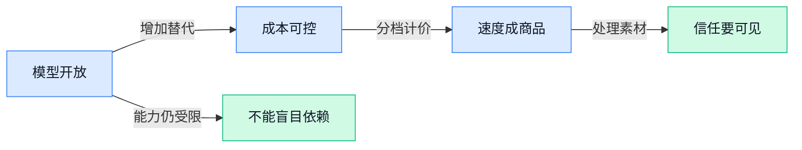

> AI 早报 · 每日早读 · 全网深度聚合

## **今日摘要**

```
DeepSeek V4 Pro开源Agent软件却上调API价，Qwen 3.8以Apache 2.0开放权重
OpenAI推出Ultrafast mode，GPT-5.6 Sol（OpenAI模型）速度提升14倍
Anthropic上线Claude文本水印检测，称AI风险上升暂不发布Model 2
```

### 🔵 产品与功能更新

1. **DeepSeek 更新 V4 Pro（升级版大模型），开源其 Agent 软件并上调 API 价格。**  
DeepSeek 推出了改进后的 **V4 Pro**，同时将其 **Agent 软件**（可自主拆解任务、调用工具完成工作的 AI 助手程序）开放源代码 🚀。这意味着团队可自行部署、研究或二次开发该软件，但使用 DeepSeek **API**（让自家系统调用模型能力的接口）时，需要留意新的价格调整。模型能力升级、工具开源与商业定价同步推进，也反映出开源生态和服务成本正在并行演进 💡。[产品更新报道(briefing)](https://the-decoder.com/deepseek-launches-an-improved-v4-pro-model-raises-api-prices-and-makes-its-agent-software-open-source/)


2. **Qwen 3.8（阿里推出的新一代大模型）以 Apache 2.0（允许商用和修改的开源许可）发布开放权重。**  
阿里巴巴 Qwen 团队发布了 **Qwen 3.8** 系列模型，并采用 **开放权重**（公开模型参数文件，方便机构自行下载和部署）的形式提供 🚀。其使用的 **Apache 2.0**（对商用、修改和再发布限制较少的开源许可）意味着企业和开发者拥有更大的使用弹性。对于希望把 AI 能力部署在内部环境、并按自身业务调整模型的团队，这类授权方式尤其值得关注 💡。[模型发布报道(briefing)](https://the-decoder.com/alibabas-qwen-team-releases-qwen-3-8-models-with-open-weights-under-the-apache-2-0-license/)


3. **OpenAI 推出 Ultrafast mode（超高速响应模式），GPT-5.6 Sol（OpenAI 的一款模型）速度提升 14 倍。**  
OpenAI 为 **GPT-5.6 Sol** 上线了 **Ultrafast mode**（通过专用算力优先缩短等待时间的高速模式），报道指其运行速度可提升至原来的 **14 倍** ⚡。该模式由 Cerebras（生产大规模 AI 专用芯片与算力系统的公司）提供支持，重点在于加快模型生成回答的过程。对需要频繁与模型互动、追求即时反馈的使用场景而言，响应速度的提升会直接改变使用体验 💡。[高速模式报道(briefing)](https://the-decoder.com/gpt-5-6-sol-goes-14x-faster-as-openai-launches-ultrafast-mode-powered-by-cerebras/)


### 🟢 前沿研究

1. **Intern-S2-Preview（面向科学发现的智能体基础模型）探索多模态科研推理。**  
这项研究瞄准科学发现中常见的难题：证据来源多样、工具复杂、任务周期长。论文提出的**智能体基础模型**（能自主规划步骤并调用工具完成任务的通用 AI 模型）需要理解不同形式的科学证据，并与科研工具和环境交互 🔬。其目标是让 AI 不只回答单个问题，还能在较长的研究过程中持续推进工作；对研发团队而言，这意味着未来的科研辅助可能更接近“协作研究员”而非单次问答工具 💡。[论文原文介绍(briefing)](https://arxiv.org/abs/2608.13505)

1. **CW-BASS v2（为图像分割挑选可靠伪标签的方法）改进少标注训练。**  
在**半监督语义分割**（只标注少量图片、让 AI 学会逐像素识别物体的训练方式）中，核心问题是哪些机器自动生成的标注值得信任。CW-BASS v2 聚焦**伪标签**（模型先替未标注数据生成的临时答案），并针对模型预测逐渐趋于饱和的情况设计筛选机制 🚀。这类工作有助于减少人工逐张标注图片的成本，尤其适合需要识别图像细节、但高质量标注数据稀缺的业务场景。[论文摘要页面(briefing)](https://arxiv.org/abs/2608.12773)

1. **Hybrid-Policy Self-Editing（让模型自行更新知识的混合策略）应对知识过期。**  
大模型依赖既有训练语料，因此现实世界变化后，内部知识可能迅速落后。该研究讨论**知识编辑**（不从头训练模型，而是定向修正或补充特定知识）的问题，并提出可组合的非结构化知识更新思路 📚。其中的**混合策略**（结合多种更新决策方式的方案）旨在让模型处理不同类型的知识修改需求；这对需要频繁更新政策、产品或行业信息的 AI 应用具有参考意义 💡。[论文原文说明(briefing)](https://arxiv.org/abs/2608.11660)

1. **TailBooster（扩充极端少见数据的生成框架）关注业务有效性。**  
TailBooster 面向**极端值数据**（发生概率低、却可能对应重大风险或机会的少见案例）不足的问题，尝试通过生成式框架补充这类样本。论文强调“双层”设计，并加入**业务有效性约束**（确保生成结果符合实际业务规则，而非看起来合理却无法使用）⚙️。对于风控、异常监测等依赖罕见案例的场景，这类研究的重点在于：补数据的同时，不能牺牲数据在真实流程中的可用性。[论文信息页面(briefing)](https://huggingface.co/papers/2608.11951)

### 🟡 行业展望与社会影响

1. **Anthropic 推出文本水印检测接口，让 Claude 生成内容更可追溯。**  
Anthropic 宣布开放**水印检测 API（让第三方系统识别文本是否含有特定隐藏标记的接口）**，可供外部机构检测 Claude 生成的文字。它的核心目标是帮助平台、组织和用户辨别内容来源，为 AI 文本的使用和传播增加一层可核验性 🔎。不过，水印是否能覆盖改写、翻译等复杂场景，仍是这类方案真正落地时要面对的问题。[水印接口报道(briefing)](https://the-decoder.com/anthropic-announces-watermark-detection-api-that-will-let-third-parties-detect-claudes-ai-texts/)


2. **Anthropic 称 AI 风险正在上升，暂不发布更强的 Model 2（下一代更强模型）。**  
Anthropic 表示，随着 AI 能力持续提升，相关风险也在增加，因此目前没有推出更强“Model 2”的计划 ⚠️。这反映出**模型能力升级**不再只是产品竞赛，也与**安全评估（在发布前检验模型可能造成哪些现实危害）**直接绑定。对企业用户而言，未来选择 AI 工具时，性能之外还要更关注供应商如何说明风险边界与使用规则。[风险立场报道(briefing)](https://news.google.com/rss/articles/CBMiakFVX3lxTE9WbTFuU3NVRExHd2I4UXlsdFBfdFl6dFBOZEE1dHhPenVYTEtqZ1FnQXcwZFU0MHNxY1ZYQnZrcl93cmY2clNhR25LZXVVNXdhejFVWkRVSlRJREZQV3NpNUI4dDZ4YklTVlE?oc=5)

3. **Meta 发布 Glimmer（可下载到本地运行的开放权重模型），AI “人人可用”仍有边界。**  
Meta 本周推出 Glimmer，任何人都可以下载并在自己的硬件上运行这一**开放权重模型（公开模型参数，使用者可自行部署和调整）**。但该公司能力更强的 Muse Spark（仅能通过官方接口使用的模型）仍被限制在自身 API（让不同软件互相调用功能的连接方式）之内。两种发布方式并存，说明“开放”并非简单的全放或全锁，而是在能力、控制权与商业化之间持续权衡 💡。[Meta 模型讨论视频(briefing)](https://techcrunch.com/video/does-mark-zuckerberg-really-believe-ai-is-for-everyone/)

4. **OpenAI 的 Computer History（把电脑操作整理成可搜索记录的功能）引发隐私新讨论。**  
OpenAI 的 Computer History 会把用户的点击和键盘输入整理为可搜索的 ChatGPT 记忆时间线。这样的**记忆时间线（按时间保存操作记录，方便日后检索）**，有望让用户更容易找回曾经做过的任务和信息 🚀。但它也意味着个人电脑操作可能被更系统地留存，**数据留存（把使用记录持续保存下来）**的范围、控制权和隐私保护会成为用户关心的重点。[功能报道详情(briefing)](https://the-decoder.com/openais-computer-history-turns-your-clicks-and-keystrokes-into-a-searchable-chatgpt-memory-timeline/)

### 🟣 开源TOP项目

1. **iPolloWork（可本地部署的 AI 多用途工作台）开源，想把代码与办公任务放进同一套 Agent。**
这个项目定位为 **Codex** 与 **Claude Code** 的源码可查看替代方案，强调数据和工作环境优先留在本地 💡。它把编程、办公文档、可编辑设计稿、演示文稿、网站和视频制作汇集到一个 Agent 工作区中。完成 AI 生成后，用户还能继续修改文字、图片、颜色与版式，降低“一生成就无法细改”的问题 🚀。[GitHub 项目仓库(briefing)](https://github.com/Devin-AXIS/iPolloWork)


2. **Brigade（面向个人的企业级智能助手）尝试把个人 AI 做成可管理的工作系统。**
Brigade 将自己定义为“个人智能”，但采用 **企业级** 的产品定位，意味着它瞄准的不只是闲聊问答，而是更可控、更适合日常工作的 AI 助手 💡。对于希望把个人信息、任务和辅助决策集中处理的用户，这类项目提供了一个开源观察样本。仓库目前披露的简介较少，具体能力、部署方式和适用场景仍需以项目后续说明为准 🚀。[GitHub 项目主页(briefing)](https://github.com/spinabot/brigade)


3. **watermarks-remover（AI 内容溯源标记清理工具）聚焦清除多种文件中的来源痕迹。**
该项目宣称可处理多家厂商加入的 AI 来源标记，包括文本中的特殊字符、文件元数据（附着在文件中、记录创建或编辑信息的隐藏说明）以及 **C2PA**（用于声明数字内容来源与修改记录的行业标准）信息。覆盖范围包含图片、文档、网页与 Markdown（轻量级文本排版格式）等多类文件，反映出 AI 内容标识正分散存在于不同载体中 💡。不过，这类工具也可能削弱内容溯源和真实性核验；在企业发布、版权管理与合规场景中，应谨慎评估使用边界 🚀。[GitHub 项目说明(briefing)](https://github.com/guillaumemeyer/watermarks-remover)


### 🔴 社媒分享

1. **Qwen 3.8（含 270 亿参数的开源大模型）模型页上线。**  
该页面提供了 **Qwen 3.8 27B** 的模型信息，名称中的 **27B（约 270 亿个可调参数，决定模型容量的一项指标）** 表明它属于较大规模的模型。文件名还标注 **FP8（8 位浮点数格式，用更少显存和算力运行模型）**，重点在于降低部署时的硬件压力 🚀。对希望自行部署 AI 能力的团队来说，这类公开模型是评估成本、效果与可控性的一个入口。[模型下载页面(briefing)](https://huggingface.co/Qwen/Qwen3.8-27B-FP8)


2. **《资本开支列车继续前行》关注持续增长的投入。**  
这篇文章以 **CapEx（资本性支出，企业为厂房、设备和长期基础设施投入的钱）** 为核心，指出相关投入的“列车”仍在向前行驶。标题传达的重点是：大规模基础设施建设并未停止，而长期投入的节奏仍值得持续观察 💡。对业务和财务团队而言，理解 **长期资本投入（短期花钱、长期产生能力的支出）**，有助于判断行业竞争究竟是在拼产品功能，还是在拼底层资源储备。[资本开支分析文章(briefing)](https://stratechery.com/2026/the-capex-train-keeps-rolling/)


3. **Google 推进同态加密（让数据加密后仍可计算）的私密 AI。**  
Google 表示，正让 **同态加密（数据不解密也能被处理的加密方式）** 在私密 AI 场景中变得更实用。它解决的是一个很现实的矛盾：组织希望借助 AI 分析敏感信息，但又不希望原始数据在处理过程中直接暴露 🔒。这类能力尤其关系到医疗、金融和企业内部资料等高敏感场景，也让“能不能用 AI”逐渐变成“如何在保护数据前提下用 AI”。[Google 安全博客解读(briefing)](https://blog.google/security/how-google-is-making-private-ai-practical-with-homomorphic-encryption/)

4. **《开放模型现状》梳理 2026 年夏季观察。**  
HuggingFace（全球最大的 AI 模型共享社区）发布的这篇文章，聚焦 **开放模型（公开发布、可供下载和二次使用的 AI 模型）** 在 2026 年夏季的发展情况。相较只看少数商业产品，开放模型的进展更能反映企业自行部署、定制和控制数据的选择空间 📊。对非技术团队而言，这类观察的价值在于理解：AI 能力不只来自购买现成服务，也可能成为企业内部可以评估和配置的基础资源。[开放模型趋势观察(briefing)](https://huggingface.co/blog/state-of-open-models-summer-2026)

5. **GLM-5.3（面向前沿编程的 AI 模型）出现网络能力。**  
GLM-5.3 的介绍将重点放在 **前沿编程（让模型处理更复杂软件开发任务的能力）**，同时提到正在出现的网络安全能力。这里的“出现”意味着模型可能展现出超出普通代码补全的行为特征，因此需要更审慎地评估其使用边界 ⚠️。对企业而言，**网络安全能力（识别、分析或操作计算机系统安全问题的能力）** 既可能帮助防护和排查风险，也要求在权限、审计和使用规范上提前做好管理。[GLM-5.3 官方说明(briefing)](https://z.ai/blog/glm-5.3)

---



### 📊 行业洞察（今日 3 条）

1. DeepSeek上调接口价格，阿里开放 Qwen 3.8（可自行下载部署的模型），Meta 也只开放较弱的 Glimmer（可本地运行的模型）
  【洞察】开放正在成为企业对冲供应商涨价的选择，但最强能力仍被厂商握在手里，不能把“开源”当成永久免费和完全可控。

2. OpenAI 把 GPT-5.6 Sol（OpenAI 的模型）提速14倍并按速度分档，DeepSeek 同时提高反复读取资料的收费
  【洞察】模型成本不会单向下降，等待时间和重复调用都开始单独计价；做复杂工作流，设计方式比单看模型单价更影响利润。

3. Anthropic 推出 Claude 文本来源检测，但重度改写后效果有限；OpenAI 又把电脑操作记录成可搜索历史
  【洞察】AI 正同时变得更可追溯、也更会收集数据，但两件事都不是绝对可靠，信任要靠明确边界和用户控制权，而非厂商承诺。

### 💭 对我们的启发（今日 3 条）

1. OpenAI 把速度做成分档收费、DeepSeek 提高重复读取资料的价格。剪辑软件应把“立即预览”和“批量生成”分开调度，避免每次修改都重复消耗高价能力。

2. Qwen 3.8（可自行部署的模型）和 DeepSeek 的 Agent 软件开源，验证了部分脚本改写、标题生成可有替代来源；但视频生成和成片质量仍不能承诺只靠低成本模型。

3. Anthropic 的水印可被改写削弱，清除来源标记的开源工具也已出现。产品不能只靠水印证明素材可信，应提供素材来源、编辑记录、授权人和删除记录的可见控制。


---

> 本周周报：[第33周综合分析](https://zhuxinfei.github.io/ai-daily-site/blog/weekly/2026-w33/)
