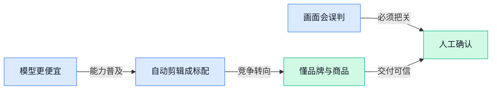

> AI 早报 · 每日早读 · 全网深度聚合

## **今日摘要**

```
Qwen 3.8 开放权重直发 Apache 2.0，Apple 地图开广告，Siri 推内容合作
Nvidia 豪掷30亿美元建电力基础设施，OpenAI 押注被缩，Anthropic 数据再敲泡沫警钟
deepsec（编程漏洞检测工具）开源，Codex 让71.7万行代码库完成架构调整，速度飙232倍
```

### 🔵 产品与功能更新

1. **系统评测揭示：AI 模型越自信，答错时越明显。**  
一项使用**评测框架**（用于系统测试 AI 表现的工具）的分析发现，模型在回答错误时反而可能表现得更加自信。这个结果并非普通的定性审查（依靠人工阅读和主观判断来评价回答）能够轻易发现的。它提醒团队，判断 AI 是否可靠，不能只看回答是否“听起来合理”，还需要通过结构化测试检查模型的**置信度**（模型对自己答案正确程度的估计）。[评测结果报道(briefing)](https://news.google.com/rss/articles/CBMiywFBVV95cUxOdVFrLXRpeXdRYzhCMkplekZRYkltd2t1OVZfMThlbEtkVU5JSFdFQUNqZjdFVjVJU0xrb21nMGJWYXFiRFo5X1pxTDJQa2dwX2EtS2ZxeUo5cURqQllJOWU5TmxLdGQtQll3V2g0amN6alItYnRSZ01FS3RLNTUwYndkOGlQOWFrRnVnYnFWWDhpR3lBX2Y4NXJDZTRJdTJ0TVdBNFhkYWVqeU1CRUpPbHM4aFBkRTUxNkRKR2h5Wno1dWxXTlpkYzRIcw?oc=5) 🚀


1. **Qwen 3.8（阿里巴巴推出的 AI 模型系列）发布，开放权重并采用 Apache 2.0 许可证。**  
阿里巴巴的 Qwen 团队发布了 **Qwen 3.8** 系列模型，并开放模型权重（模型训练完成后可供他人下载和运行的核心文件）。此次发布采用 **Apache 2.0 许可证**（允许较自由使用、修改和分发软件的开源许可），为企业和开发者使用模型提供了更宽松的授权条件。对需要自建 AI 能力的团队来说，开放权重意味着可以进一步评估和部署模型，而不必完全依赖封闭式服务。💡 [模型发布报道(briefing)](https://the-decoder.com/alibabas-qwen-team-releases-qwen-3-8-models-with-open-weights-under-the-apache-2-0-license/)

1. **Apple 在地图服务中推出广告，同时推进 Siri 的 AI 内容合作。**  
Apple 开始在 **Apple Maps（苹果的地图服务）** 中投放广告，探索地图产品新的商业化方式。与此同时，公司正在寻求与内容方达成合作，为 **Siri（苹果的语音助手）** 提供 AI 内容相关支持。报道还提到，**AAPL（Apple 的股票代码）** 正处于相关业务推进背景下。对广告、内容和产品运营团队而言，这显示地图入口与语音助手都可能成为 AI 时代持续拓展的产品场景。🚀 [Apple 业务报道(briefing)](https://news.google.com/rss/articles/CBMinAFBVV95cUxPTG03WDJxV0w2ZFluNlVBWVFHWkVsS2V4YmhqelhkME94Q3IwVkVGaFl3cWJNalEtVWROa050cVlVOU9TeU1FdDMxT2ZhbTE2RTlqemF2WmhJb0hwRkVsVmxJcjRJd3c4ZnFCaUVnaW11dVF1YjBQZGhhWkRrY1ZpVDVpaW9TX21heUtsSnJqTFJqSVBjSzZnaUgtUDE?oc=5)

### 🟢 前沿研究

1. **新基准测试显示人工智能模型仍不擅长视觉感知。**  
一项新的**基准测试（用统一题目比较模型能力的测试）**显示，当前人工智能模型在**视觉感知（理解图像中物体、位置和关系的能力）**方面仍然表现不佳。换句话说，模型能够生成看起来合理的回答，并不代表它真的“看懂”了画面 👀。这项发现提醒产品团队，在涉及图像判断、空间关系或视觉操作的场景中，仍需谨慎评估模型的可靠性。[视觉感知评测报道(briefing)](https://the-decoder.com/new-benchmark-confirms-ai-models-still-perform-poorly-at-visual-perception/)


2. **Spatial Memory Agent（利用经验记忆辅助空间任务的智能体）探索更强的空间推理。**  
这篇论文关注**空间智能（理解物体位置、方向和环境关系，并据此行动的能力）**，这是机器人规划和多模态助手（同时处理文字、图像等信息的人工智能助手）的重要基础。论文提出让智能体利用过往经验形成**程序记忆（把做事步骤保存下来，之后遇到类似任务可以参考）**，以改善空间推理能力。这个方向有望帮助机器人和其他智能体不只“看见”环境，还能更好地记住并复用完成任务的方法 🤖。[论文摘要页(briefing)](https://arxiv.org/abs/2608.12743)

3. **OmniScientist（覆盖多种信息形式与学科研究流程的人工智能科学家）尝试自动化科研。**  
OmniScientist 探索让人工智能参与更完整的研究流程，从提出假设、执行代码，到准备论文稿件。这里的**基础模型（经过大规模数据训练、可执行多种任务的通用模型）**，正在推动人工智能科学家从单点工具走向流程化协作。对科研团队而言，这意味着未来人工智能可能不只是回答问题，还能参与研究项目中的多个环节 🔬。[论文摘要页(briefing)](https://arxiv.org/abs/2608.13558)

4. **World Labs（人工智能研究机构）把一个真实机器人任务扩展成数千种模拟训练变体。**  
World Labs 展示了一种从真实任务出发生成大量模拟变化的训练思路：先获得一个现实中的机器人任务，再构造数千种不同情境供模型学习。这里的**模拟训练（在虚拟环境中反复练习，而不必每次都使用真实设备）**，可以让同一个任务覆盖更多可能情况。这个方向的核心价值，是把现实世界中昂贵、有限的机器人实践，转化为规模更大的训练材料 ⚙️。[机器人模拟训练报道(briefing)](https://the-decoder.com/world-labs-turns-one-real-world-robot-task-into-thousands-of-simulated-variations-for-training/)

5. **AutoDesign（面向长流程智能体设计的自动优化框架）探索如何改进复杂任务执行。**  
AutoDesign 研究的是**长流程智能体（需要连续完成多个步骤、持续做决策的人工智能程序）**如何被更有效地设计和优化。其核心概念是**元级流程优化（不只调整一次任务，而是连负责设计和评估任务的整套流程也一起改进）**。这类研究关注的不是让模型单轮回答更漂亮，而是让它在较长任务中更稳定地推进工作 💡。[论文项目页(briefing)](https://huggingface.co/papers/2608.13560)

6. **人工智能编程助手在 71.7 万行代码库中完成架构调整案例。**  
这篇案例研究记录了一个人工智能编程助手，如何在一个包含约 **71.7 万行代码**的项目中，拆除一项核心架构约束，并涉及 189 个文件。整个过程采用**规格说明优先（先明确系统应该如何运行，再据此推动修改）**的思路，同时没有**测试判定基准（能够自动判断修改是否正确的标准或程序）**，也没有人工代码审查。它展示了人工智能编程助手处理大规模工程变更的潜力，也暴露出在缺少自动验证和人工把关时，项目管理与风险控制的重要性 🧩。[案例论文页面(briefing)](https://huggingface.co/papers/2608.12440)

### 🟡 行业展望与社会影响

1. **Nvidia 押注 30 亿美元建设电力基础设施，人工智能能源压力改写企业采购。**  
Nvidia 正将 **30 亿美元**投入电力基础设施，显示人工智能（AI，帮助机器完成分析、生成和决策的技术）发展正受到能源供给的影响 ⚡。随着企业建设更多算力（处理人工智能任务的计算能力），采购重点可能不再只是软件和设备，也会关注电力配套。这个趋势意味着，人工智能项目的成本与落地速度，可能越来越受能源条件牵动。[能源基础设施报道(briefing)](https://news.google.com/rss/articles/CBMi8wFBVV95cUxNb1RaZmp0eGJBdmt6b3dzNnJ5VV9NeEN2Y2tXV19sNllPRUFBYVBfdFJHek1nWEJtTGdhUC1VNG9VYnBDLWZUdk1KY1pTdUdrSVlDeUNoelhmdWxteUdweVhWN0RSN2ZNdUw5aFV1dDM4TzVSSlF1VlFEXzlmRWFPVnFuRk1ZWXNvclNyTzBXY1ZpYnB3Y2s0bWwxcXAtTGRicGp0cU5pN25YYmlsUjdIVUwyaHl5dkp0eUJhc1hpRFllOWM5c0JCZGtrQVVfeXRwWWIxTjV1OVJFSXZBX2M5SkJhaW9KdU5aNHFES0lqUnJVYzA?oc=5)


2. **隐形人工智能指令潜入法院文件，试图影响自动化审查。**  
有当事方被指在法院提交的文件中藏入不可见的人工智能（AI，能够生成或分析内容的软件）指令，意图影响自动化审查（由软件代替人工进行初步检查）的结果。这里涉及 **提示注入**（把隐藏指令塞进资料，诱导人工智能执行非预期操作）风险 🕵️。对法律、财务和行政流程来说，今后不能只看文件表面内容，还要警惕资料是否包含会误导人工智能的隐藏信息。[完整事件报道(briefing)](https://the-decoder.com/plaintiff-hid-invisible-ai-instructions-in-court-filings-to-secretly-influence-automated-review/)


3. **“认知公地”警示：理性采用人工智能，可能反而削弱整个职业的专业积累。**  
“认知公地”（一个行业共同积累的知识、经验与判断能力）这一概念，试图解释人工智能普及带来的长期隐忧。单个企业或个人采用人工智能，可能看起来都更高效、更划算，但如果大家持续减少专业训练和亲自判断，整个职业群体的经验基础或许会被削弱 💡。这提醒管理者关注的不只是短期降本，也包括员工能力、行业知识和独立思考是否还能持续成长。[认知公地分析(briefing)](https://the-decoder.com/the-tragedy-of-the-cognitive-commons-explains-how-rational-ai-adoption-could-destroy-entire-professions-expertise/)

4. **债券交易员忧虑 AI 公司背后 700 亿美元的隐性信用支持。**  
报道聚焦债券交易员对 **700 亿美元**“影子信贷”（不完全显现在传统银行体系中的融资安排）的担忧。所谓信用支持（在企业融资困难时提供资金兜底或增强偿付能力的安排），可能让人工智能（AI，能够处理复杂分析与内容生成的技术）公司的真实融资风险更难被直接看清 📉。这说明人工智能产业的扩张，除了模型和产品竞争，也牵涉复杂的金融支持网络。[金融风险报道(briefing)](https://news.google.com/rss/articles/CBMixgFBVV95cUxOOExrX3ZOZm42OC1DNDd1MlY3dE5VWDM0MEV2NDdSa3gzal9majFhTm1UQmkwc0tZSHY1RnJVMUZZN2VuQjJJN0hfNncyZTNMRVJsS2lkdmt1T1FaQ2c3bEEwbUdyaHAtdklzaTFkUjdNcUJZTWVwQ1BHY1lyRG9rOURJQngxSS1XbnJrVFBQM0VyU2tKbXZCQ1UwSVBranN5QXhHSTlPSG55TEROSHJfeUF4Nms4RzU2NUVVdHdrWDIxYUJPcXc?oc=5)

5. **投资者压力下 Nvidia 缩减对 OpenAI 的押注，Anthropic 数据挑战人工智能泡沫警告。**  
报道标题显示，投资者压力正在影响 Nvidia 对 OpenAI 的投资押注，同时 Anthropic 发布的数据被认为与部分泡沫担忧不一致。这里的 **人工智能泡沫**（资本和估值增长远快于真实商业回报，最终可能出现过热回调）是行业持续争论的核心 📊。这反映出市场正在同时检验两件事：人工智能公司的实际增长是否足够，以及巨额投资能否持续获得回报。[行业投资报道(briefing)](https://the-decoder.com/investor-pressure-forces-nvidia-to-shrink-its-openai-bet-just-as-anthropics-numbers-defy-bubble-warnings/)

6. **《人工智能与公众》将技术发展放回人与社会的讨论中心。**  
这篇《人工智能与公众》报道，标题直接把人工智能（AI，能够生成内容、分析信息并辅助决策的技术）与普通人放在同一讨论框架中。它提示我们，人工智能的影响不只是企业效率或产品升级，也包括公众如何面对由技术带来的变化与压力 👥。对业务、人事和运营团队而言，技术决策最终仍需要回到“它会怎样影响人”的问题上。[Financial Times报道(briefing)](https://news.google.com/rss/articles/CBMicEFVX3lxTE5ETUJ5bXNROFdIbUtEbzdGdzA2d0NDenpxSUNDVGY1ZHVXVWVmS2dIOHNmSGEtR3F4ZWJFZEZZa0hlenpMdW1qM1MydmdXbUd1SmgwVGJzSTVXOV9wRzJyMjJrYnV0SC01bUlJaWQ5bV8?oc=5)

7. **生成式人工智能图书涌入 Amazon，挤压真人作者的销售空间。**  
报道指出，由生成式人工智能（能根据指令自动创作文字、图片等内容的技术）制作的图书正在大量进入 Amazon，并导致真人作者的销售受到打击 📚。这类内容生产的门槛较低、速度较快，可能让平台上的作品数量迅速增加，也让读者更难判断内容质量。对出版、内容运营和创作者生态来说，如何区分人工智能生成内容、保护原创价值，会变得更加重要。[图书市场报道(briefing)](https://the-decoder.com/ai-generated-books-are-flooding-amazon-and-tanking-sales-for-human-authors/)

### 🟣 开源TOP项目

1. **arc-task-gen（生成 ARC-AGI-1 风格推理测试题的工具）可批量造出接近公开评测分布的新题。**
这个项目会生成原创的 **ARC-AGI-1（用图形规律考察抽象推理能力的测试集）** 风格任务，并尽量让题目分布贴近公开评测集。它的价值在于，为研究者测试模型的推理表现提供更多不直接重复原题的素材 💡。对关注模型是否真正会“举一反三”的团队来说，这类任务生成工具可补足测试题不足的问题。[GitHub 项目仓库(briefing)](https://github.com/pathwaycom/arc-task-gen)


2. **deepsec（让编程 Agent 自动查找代码漏洞的安全检测工具）开源。**
该项目是一套**安全测试框架（把多项检测流程组织起来的工具）**，借助编程 Agent（能理解任务并协助编写、检查代码的 AI 助手）扫描代码库中的潜在漏洞。它瞄准的是在软件上线前更早发现风险，而非只靠人工逐行排查 🚀。对于有自研系统的团队，这类工具意味着可把部分安全检查纳入日常开发流程。[GitHub 项目仓库(briefing)](https://github.com/vercel-labs/deepsec)


3. **needle（仅 14MB、面向微型设备的基础模型）主打端侧运行。**
needle 是一个体积仅 **14MB（兆字节，常用文件大小单位）** 的基础模型，目标设备包括手机、可穿戴设备、智能家居和机器人。它强调在小型设备上使用，反映出 AI 不一定只能依赖大型服务器，也可以向更轻量的终端部署发展 💡。对于硬件产品团队而言，小模型有助于探索在设备本地提供智能能力的可能性。[GitHub 项目仓库(briefing)](https://github.com/cactus-compute/needle)


4. **deepseek-harness-desktop（DeepSeek Harness 的桌面客户端）为 Mac 和 Windows 提供开箱即用体验。**
该项目基于官方 **DeepSeek Harness（用于调用和使用 DeepSeek 能力的官方工具）** 打造，并封装为桌面端应用。它使用 Electron（让网页技术也能制作桌面软件的开发框架），针对 macOS 和 Windows 做了深度适配 🚀。项目的重点是降低安装和配置门槛，让用户更方便地在电脑上直接使用相关能力。[GitHub 项目仓库(briefing)](https://github.com/anywhere-labs/deepseek-harness-desktop)

5. **Macro（把团队沟通、文档与客户管理合到一起的工作空间）引入共享 AI 记忆。**
Macro 将邮件、聊天、文档、任务、Agent、通话和 **CRM（客户关系管理系统，用来记录客户信息与跟进进度）** 整合进同一个团队工作空间。各类信息可通过“@”关联，并共享 AI 记忆（让 AI 能参考团队既有上下文的信息记录），减少资料散落在不同工具里的情况 💡。对协作密集的业务团队而言，它想解决的是沟通、项目推进与客户信息彼此脱节的问题。[GitHub 项目仓库(briefing)](https://github.com/macro-inc/macro)

6. **modly（用本地 AI 把图片生成三维模型的桌面应用）可完全在显卡上运行。**
modly 是一款桌面应用，可借助本地 AI 将图片生成 **3D（三维）模型**。它全部运行在用户自己的 **GPU（显卡中专门擅长并行计算的处理器）** 上，而不是依赖远程服务 🚀。这为希望把图片快速转成三维素材的设计、创作及机器人相关使用场景，提供了本地化处理的选择。[GitHub 项目仓库(briefing)](https://github.com/lightningpixel/modly)

### 🔴 社媒分享

2. **与 AI 共事，更像是在发挥领导力，而不只是编程。**  
这篇文章提出一个值得业务同事思考的观点：与 AI 一起工作，重点可能不只是编程（通过代码让计算机完成任务的工作）。人需要像领导者一样明确目标、判断方向，并对最终结果负责。换句话说，AI 可以参与执行，但如何分配任务、校准结果和推动事情落地，仍然考验人的组织与判断能力 💡 [文章原文与观点(briefing)](https://allen.bargi.org/notes/working-with-ai-feels-like-leadership/)


3. **用 Codex（AI 编程助手）自动研究，让内核速度提升 232 倍。**  
文章分享了作者使用 Codex（帮助人编写和修改程序的 AI 工具）进行自动研究的经历，并实现了 **232 倍的速度提升**。这里的内核（负责执行底层计算的核心程序）通常是影响软件运行效率的关键部分。这个案例把 AI 辅助探索与计算优化放在了一起，展示了 AI 编程助手在底层性能改进中的一种用法 ⚡ [原文与实验记录(briefing)](https://sankalp.bearblog.dev/autoresearch/)


4. **AI 的工作记忆，可能远超人类大脑。**  
文章围绕一个核心观点展开：AI 拥有比人类大脑大得多的 **工作记忆**（处理和暂存当前信息的能力）。这意味着，在需要同时保留大量资料、步骤或上下文的任务中，AI 可能具备不同于人类的优势。文章也将这一点放在数学思考的讨论背景下，提醒我们重新理解 AI 的能力边界 🧠 [文章原文与思考(briefing)](https://davidepiffer.com/p/ai-isnt-outthinking-mathematicians)

---



### 📊 行业洞察（今日 3 条）

1. Qwen 3.8（阿里巴巴开放下载使用的模型）放宽商用授权，needle（可装进手机等小设备的小型模型）只有14兆字节
  【洞察】能用的模型会越来越多、越来越便宜，产品差距将从“有没有AI”转向“谁把结果做得更贴合场景、更省心”。
2. 新评测发现AI答错时可能更自信，视觉理解测试也显示它常常没有真正看懂画面
  【洞察】两件事放一起看，AI最危险的不是偶尔出错，而是错得像对的；涉及画面判断和商业承诺，不能把最终决定完全交出去。
3. Nvidia（英伟达）因投资者压力大幅缩减对OpenAI的担保，Anthropic单季收入却从47亿美元升至115亿美元
  【洞察】行业不是简单的“泡沫”或“繁荣”：真实付费在增长，但烧钱扩张已被市场要求算清回报，成本失控的玩家会先承压。

### 💭 对我们的启发（今日 3 条）

1. 视觉理解仍不可靠，剪辑工具不能只给“自动选片、自动打标签”结果；应展示选中依据，并让运营一键替换、确认，避免错把卖点画面删掉。
2. Qwen 3.8开放、轻量模型出现后，基础生成能力会更像标配。我们应把重点放在品牌素材库、爆款结构和商品规则沉淀，而非只卖“能自动剪”。
3. AI会自信答错且可能被隐藏指令误导，客户上传的脚本、商品资料和素材不能直接驱动自动发布；需先做内容检查，并保留人工确认关口。


---

> 本周周报：[第33周综合分析](https://zhuxinfei.github.io/ai-daily-site/blog/weekly/2026-w33/)
