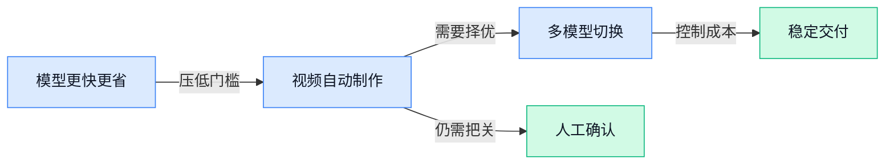

> AI 早报 · 每日早读 · 全网深度聚合

## **今日摘要**

```
Anthropic 推出 Claude Opus 5 主打低成本，生物武器过滤器停摆近一年涉 1.33 亿次请求
Stripe 敲定超 70 亿美元收购 OpenRouter（多模型接入平台），AI 模型入口争夺升级
阿里巴巴 AI 模型下载量突破 30 亿次，超过 Google 和 Meta 屠榜
```

### 🔵 产品与功能更新

1. **Anthropic 推出 Claude Opus 5（面向企业的高能力模型版本），主打更低成本。**  
报道称，Anthropic 已发布 **Claude Opus 5**，定位是让企业以更低成本使用人工智能能力 🚀。这里的**企业级人工智能**（可接入公司业务流程、通常更重视稳定性与管理能力的 AI 服务）意味着，它主要面向组织而非单个消费者。对预算敏感的团队而言，**成本降低**（在同等工作需求下减少模型使用支出）可能会直接影响 AI 工具能否大规模落地 💡。[相关发布报道(briefing)](https://news.google.com/rss/articles/CBMiW0FVX3lxTE95cVhDX3ZOU096WGRmMVp2SFlDUWVJdWRRNVZKOEx3N3RYSmJuTmFNd0NHcHFkdDZmM0tlcVQwRjN5aC1tdVBGTTlqRTBja1AwSmQteFpGS1lEeDg?oc=5)

2. **Google 发布 Gemini 3.7 Flash（强调快速响应的 AI 模型版本）。**  
Google 推出了 **Gemini 3.7 Flash**，这是其最新的人工智能模型更新 🚀。名称中的 **Flash**（强调更快生成和响应速度的产品定位）表明，这一版本关注使用过程中的即时反馈。对日常办公场景来说，**模型响应速度**（从输入问题到获得结果所需的时间）会影响资料整理、内容起草等任务是否顺手；具体新增能力则可关注报道后续说明 💡。[模型更新报道(briefing)](https://news.google.com/rss/articles/CBMi3AFBVV95cUxQNnlpVzN3ck02cGM4X0dUVVVaMGszclBFUVZzYnZIanZrRWx0Qkxmd1VQNkVCdno2OV96MHZHODNWOVViLUw5X3pjLUdjRzhrTElJS0padlZialdBQ2dyY0trRFQ3Rkxjekl5V181dC1iVnlZRENWTHE5S0tRUzVRMU9hZC1XTnUtVlVrOEYxano3eDg1VTBZMG5fZ2FBV2VsMnEtWG8zY296QVlndUNzNGtRYzB5R3pIN3plcHpqTzV1VkFBYjlCTDFuUFh2Y1NUUUt1ZTk0LW4ybU1L0gHjAUFVX3lxTFBRZjdiaW42OTdsRF9GQnVmdDV6VFJtVUdSNXB4VThzS0xpRU1hTGRtSmpoSF9zenVfZmZDN1pqSVFBLTBPSUlrRjlWazVKcTRJakVmV2hTaGlrU09Zak9va2JENi1TMWxmRlJjWk1oa2huMkc1WkQtUTlxOExrbW5MOEFyY3YzU3h4Zl9xdTF3UHg3NVlWMjdfbDNJckJRZ0NrcUVxcjVtWm02aTY5NHVDTmdBMGNBQWg5R0UwNkdReV9xREhqcGRSa1c0UTRIR0JhWUhuMFBsZlI3UWQtYXE1UkNB?oc=5)

3. **Semantic XEO（帮助品牌提升 AI 回答中可见度的服务）推出 AI 可见性工程。**  
Semantic XEO 宣布推出面向 ChatGPT、Claude 与 Agent 的 **AI 可见性工程**（让品牌信息更容易被 AI 找到、理解和引用的优化服务）🚀。它所关注的不是传统网页搜索排名，而是品牌能否出现在人工智能的回答及自动执行任务的流程中。**Agent**（能根据目标自动拆解并执行多步任务的 AI 助手）逐渐参与检索与决策后，企业的内容如何被这些系统识别，正成为新的运营议题 💡。[服务发布报道(briefing)](https://news.google.com/rss/articles/CBMi5AFBVV95cUxQY1BYNmpTRV9JVEk2N25nMzhCRFozcDdrUFhSc1JvOHFLV0hyNHkySmVpZW9GNXgzSmxjcFZaOUVDcDRrNmtLby10WC1nSzJkREp4S0FZX2dJUW1XME45M3RRc2ZVR05yaHgwd2Uyd1BfM3E3ZmtUdGd5U1B4WTlGTTlCY3VYejl2VDBQaXFZdm9IdWtDYWZIRTgxQmh3Ulk5RHVZOHJrbUdSSFpreFVjWEo1dHkzRGc2bFk5VUU3SDBQMmlaM1o0b3FIMTlrMEJmWGxpMUVGaTdXSERFd0x4U2ttNWI?oc=5)

### 🟢 前沿研究

1. **Alaya-EVOKE（从线性规模监督走向无限世界的研究）探索更大范围的 AI（人工智能）学习方式。**  
这篇研究关注如何从**线性规模监督**（训练监督成本随数据量同步增长的方式）走向“无限世界”式的持续学习 🌍。简单说，它讨论的是：当 AI 需要面对不断扩展的环境时，训练和理解能力如何继续增长。标题没有提供具体实验结果，但研究主题指向了更长期、更开放的智能系统构建。[arxiv 论文页面(briefing)](https://huggingface.co/papers/2608.13546)


2. **Spatial Memory Agent（具备空间记忆的智能体）让 AI 更好地记住并复用行动经验。**  
这项研究聚焦**空间智能**（理解位置、方向和空间关系并据此行动的能力）以及**程序记忆**（把完成任务的步骤保存下来，之后照着经验执行）。它试图让 Agent（能够自主分步骤完成任务的 AI）不只依赖当前观察，还能参考过去积累的操作经验 🧭。对于需要在复杂环境中重复执行流程的智能系统来说，这类记忆能力是重要研究方向。[arxiv 论文页面(briefing)](https://huggingface.co/papers/2608.12743)

3. **限制 AI 自我反思，可能改变它对世界的整体理解。**  
这篇报道讨论了一个值得关注的问题：如果 AI 模型不能进行**自我反思**（回看自己的判断、发现问题并重新思考），它对信息和世界的理解可能会发生整体变化 🤔。这里的“世界观”并不是指 AI 拥有人类情感，而是指模型在长期生成内容时形成的稳定判断倾向。这个议题提醒我们，模型是否能检查和修正自己的回答，可能会影响它最终呈现出的行为方式。[完整报道(briefing)](https://the-decoder.com/when-ai-models-arent-allowed-to-reflect-on-themselves-it-changes-their-entire-worldview/)

4. **DreamX-Phi 1.0（面向机器人操作的动作条件视频世界模型）尝试让 AI 预测行动后的结果。**  
这项研究关注**世界模型**（在 AI 内部模拟环境变化、预测下一步会发生什么的模型）与机器人操作 🤖。它把机器人的具体动作作为条件，让视频模型学习“采取某个动作后，环境可能如何变化”。这类研究的核心意义在于，让机器人在真正动手前先进行模拟，从而更好地处理连续的操作流程。[arxiv 论文页面(briefing)](https://huggingface.co/papers/2608.13489)

5. **Intern-S2-Preview（面向科学研究的智能体基础模型）瞄准科研任务中的自主协作。**  
这项研究提出了一个面向科学场景的**基础模型**（经过大规模训练、可作为多种任务通用底座的 AI 模型）🔬。标题中的 Scientific Agentic Model 指的是能够围绕科研目标进行分步骤处理的智能系统，而不是只完成单轮问答的聊天工具。它关注的是 AI 如何更好地支持科学研究流程，但候选材料没有进一步说明具体能力或实验结论。[arxiv 论文页面(briefing)](https://huggingface.co/papers/2608.13505)

6. **PlayWorld（用智能体玩家评测世界模型的长期任务基准）重新考察 AI 的持续决策能力。**  
这项研究提出通过 Agent 玩家（能够自主行动的 AI 角色）来评测**世界模型**（预测环境变化并支持行动规划的模型）🎮。重点是**长时程目标**（需要经过很多步骤才能完成的任务），而不是只看 AI 能否做出一次正确判断。这样的评测更接近真实工作流程，可以观察模型在连续行动中是否仍能保持目标和策略。[arxiv 论文页面(briefing)](https://huggingface.co/papers/2608.13552)

7. **LLMRouter（统一的大语言模型路由基础设施）覆盖模型选择、评测与部署流程。**  
LLM（大语言模型）Router（路由器，即根据任务选择合适模型的调度工具）旨在把相关开发流程集中起来 🛠️。它覆盖**开发、评估和部署**三个环节，解决的是不同模型之间如何统一管理和比较的问题。对使用多种 AI 模型的团队而言，这类基础设施有助于把“该用哪个模型、效果如何、如何上线”放进同一套工作流程中。[arxiv 论文页面(briefing)](https://huggingface.co/papers/2608.06867)

8. **DarwinX（通过自然选择演化智能体运行框架）探索让 Agent 自动改进工作方式。**  
这项研究关注**智能体运行框架**（负责组织 AI 任务步骤、工具调用和执行流程的整体结构）如何持续进化 🧬。它借用了**自然选择**的思路，让不同的 Agent harness（用于承载和管理智能体执行过程的框架）经过比较与筛选，寻找更有效的方案。研究方向的重点，是让 AI 系统的工作流程不再完全依赖人工设计，而能围绕任务表现逐步演化。[arxiv 论文页面(briefing)](https://huggingface.co/papers/2608.07545)

### 🟡 行业展望与社会影响

1. **Anthropic 的生物武器过滤器（识别和拦截危险生物技术请求的安全机制）停摆近一年，涉及 1.33 亿次请求。**  
据报道，Anthropic 用于拦截生物武器相关内容的**安全过滤器**曾近一年没有正常运行，期间累计有约 **1.33 亿次请求**暴露在这一安全缺口下 ⚠️。这类过滤器相当于给 AI 加上的“危险问题拦截网”，目的是降低模型被用于高风险用途的可能性。事件也提醒企业，安全机制即使已经上线，也需要持续监测运行状态和覆盖范围。[事件完整报道(briefing)](https://the-decoder.com/anthropics-bio-weapons-filter-was-down-for-nearly-a-year-exposing-133-million-requests/)


2. **调查显示：美国每五名员工中，就有一人开始把任务交给 AI，而不是同事。**  
一项调查发现，美国约 **五分之一的员工**已经会把部分工作任务直接交给 **AI（能根据指令生成内容、分析信息或执行任务的软件）**，而不是像过去一样交给同事处理 📊。这说明 AI 正从“个人办公助手”逐渐进入团队分工，可能影响任务分配、协作方式以及岗位职责。对企业来说，真正需要讨论的不只是要不要用 AI，还包括哪些工作适合交给 AI、哪些环节仍需要人工复核。[职场调查完整报道(briefing)](https://the-decoder.com/one-in-five-us-workers-now-delegates-tasks-to-ai-instead-of-colleagues-survey-finds/)


3. **Stripe 据报将以超过 70 亿美元收购 OpenRouter（帮助应用接入多种 AI 模型的平台）。**  
据报道，支付公司 Stripe 正考虑以 **70 亿美元以上**的价格收购 OpenRouter。OpenRouter 被称为 **AI 网关（统一连接不同 AI 模型、方便应用切换和比较的平台）**，其 CEO 此前还将公司形容为“AI 领域的 Stripe” 💰。如果交易最终完成，市场关注点将从单个模型竞争，进一步转向谁能掌握企业使用多种模型时所依赖的基础入口。[交易报道(briefing)](https://techcrunch.com/2026/08/16/stripe-will-reportedly-acquire-ai-gateway-startup-openrouter-for-7b/)


4. **Anthropic CEO：AI 引发的反弹，本质上是一场“信任危机”。**  
Anthropic CEO 达里奥·阿莫代伊表示，公众对 AI 的反感和质疑，根本问题在于**信任不足**，而不只是人们认为他对 AI 的发展前景描述得过于悲观。这里的“信任危机”涉及多个层面：人们是否相信 AI 的回答可靠、企业是否会透明说明 AI 的用途，以及出现问题后谁来负责 🤝。这也意味着，AI 产品的竞争不只看能力和速度，**可解释性（让用户知道系统为何这样回答或行动）**与责任机制同样重要。[CEO 观点完整报道(briefing)](https://techcrunch.com/2026/08/16/anthropic-ceo-says-ai-backlash-is-fundamentally-a-crisis-of-trust/)

5. **OpenAI 解散负责发现灾难性 AI 风险的团队，相关工作转交其他团队。**  
OpenAI 已解散一个专门负责识别**灾难性 AI 风险（可能造成大范围严重后果的模型风险）**的团队，并将其工作重新分配给其他团队 ⚠️。这类工作通常关注模型能力增强后可能带来的极端风险，而不只是日常使用中的错误。团队调整并不等于相关风险消失，但会让外界更加关注安全研究由谁负责、资源是否充足，以及不同团队之间如何共享风险评估结果。[团队调整报道(briefing)](https://the-decoder.com/openai-dissolved-the-team-built-to-catch-catastrophic-ai-risks-reassigning-its-work-to-other-groups/)

6. **顶尖数学家认为：大语言模型（能理解和生成文字的 AI 模型）擅长计算，却不擅长创造性思考。**  
多位顶尖数学家表示，当前的大语言模型在**计算和模式处理**方面表现很强，但在真正的创造性思考上仍然较弱 🧮。这意味着模型可能很会根据已有信息快速整理答案，却不一定能像人类研究者那样提出全新的问题、建立未经验证的想法，或跳出既有规律进行探索。对企业使用者来说，AI 更适合承担资料整理、计算辅助和初步分析，涉及原创判断和重要决策时仍需要专业人员把关。[数学家观点报道(briefing)](https://the-decoder.com/top-mathematicians-say-llms-are-strong-calculators-but-poor-creative-thinkers/)

7. **阿里巴巴 AI 模型下载量达到 30 亿次，超过 Google 和 Meta。**  
报道显示，阿里巴巴的 **AI 模型（经过训练、可以执行特定任务的人工智能程序）**累计下载量达到 **30 亿次**，超过 Google 和 Meta 🚀。模型下载量反映的是开发者和企业对相关模型的获取与使用兴趣，但它并不直接等同于商业收入或最终用户数量。这个数据仍说明，AI 的竞争正从少数海外公司主导，扩展到全球开发者社区对不同模型的广泛采用。[下载量报道(briefing)](https://news.google.com/rss/articles/CBMiwwFBVV95cUxPNnBoUUtCUy1kYy1JS18wSG9XcU1pM0daWFpJRWxMajJsNGsyZFJ0TEJvakFBQm1LSVAzR2h1VGk2OHdOS2dtQVdWdmdDYXFKVHdSbDRUTElHVmt6TjdsR0lYM1BxaU1DX3h4T1hucmZuemU3V2dOd1BlOHBrWGxFUlZERWljakFoOHBZdzR0cDNYNWFoZU9mSHZpWEwyX1h2U0RkLURiUnl4Tkd5bUVfcS1OcEtCeEhnaGRUdWwwb05jRnc?oc=5)

8. **Bloomberg：Stripe 敲定超过 70 亿美元收购 OpenRouter（帮助应用接入多种 AI 模型的平台）。**  
Bloomberg 的报道显示，Stripe 已敲定一项金额超过 **70 亿美元**的交易，目标是收购 OpenRouter。OpenRouter 属于 **AI 网关（统一管理多个 AI 模型调用入口的服务）**，可以被视为连接应用与不同模型之间的中间层 🔗。同一收购消息从不同媒体传出，说明这笔交易本身已成为行业关注焦点，也反映出模型接入和调度服务的战略价值正在上升。[Bloomberg 交易报道(briefing)](https://news.google.com/rss/articles/CBMiswFBVV95cUxNT2VMMXR1X3Jzd1hQZ0pobFMxT0gzQWFFNjFnekt4dlR1ak9lS2NUc3V2RjVodU5BemxCSmFqVDFBUUJRbHJuUEQxb1dyT3JXWk1YSi0zRDI1NU0yNTJuMnNIZkRMVHB2TTEtc0dPbjNMSnJpTm1CUVUlVmg5Q2x4X0VQZXNiZTRJcFpTdDljbHRwVVM1eE51dmt2XzNFemRqTnZMRUJFZ3ZPMDJuX0ZjZndiWQ?oc=5)

### 🟣 开源TOP项目

1. **diagram-design（为 Claude Code 提供的 29 种编辑图示模板）开源。**  
这个项目收录了 **29 种编辑风格图示**，可供 Claude Code 在生成内容时直接调用，帮助把抽象想法整理成更清晰的视觉表达 🚀。每种图示均采用独立的 HTML（网页内容结构语言）与 SVG（可无限缩放且不失真的矢量图格式）文件制作，方便单独使用和修改。项目特别强调不使用阴影效果，也不采用 Mermaid（把文字自动转换成流程图的图表工具）式的模板化图表风格 💡。[项目仓库与模板说明(briefing)](https://github.com/cathrynlavery/diagram-design)


2. **watermarks-remover（多厂商 AI 来源标记清理工具）开源。**  
该项目用于清除多家厂商添加的 **AI（人工智能）内容来源标记**，覆盖文本、图片、文档、网页等多类文件 🚀。它包含 Unicode（统一字符编码标准，用于让不同设备正确识别文字）文本清理，以及统计式改写挂钩（为文本重写流程预留的调用接口）。同时，项目可处理 C2PA（记录内容来源与真实性信息的标准）和元数据（写在文件中的来源、创建方式等附加信息），涉及图片、矢量图、PDF（便于跨设备保持排版的文档格式）、办公文档及 Markdown（轻量标记文本格式）等文件类型 💡。[项目仓库与功能说明(briefing)](https://github.com/guillaumemeyer/watermarks-remover)


### 🔴 社媒分享

1. **Qwen 3.8 27B（通义千问的 270 亿参数模型）很强，但默认会把问题想得太复杂。**  
本周发布的 **Qwen 3.8 27B（拥有约 270 亿个参数的模型）** 来自阿里巴巴 Qwen 研究团队，支持理解图片等视觉内容。它采用 **Apache 2 开源许可（允许用户较自由地使用、修改和分发软件的授权协议）**，定位是一个体量适中的大模型。文章认为它整体表现出色，但默认会出现“过度思考”（面对简单问题也进行过长、过复杂推理）的情况，使用时可能需要额外控制回答方式 🤔。[Qwen 3.8 27B 模型介绍(briefing)](https://simonwillison.net/2026/Aug/16/qwen-38-27b/)


2. **模型正在“故意变笨”：更聪明不一定总是更好。**  
这篇文章讨论 **模型变笨（降低模型表现或推理强度）** 这一现象，并将其视为一种有意的选择，而不只是能力退化。对日常使用者来说，这意味着模型有时可能会被设计成少绕弯、少消耗资源，更快给出直接答案。文章标题也提醒我们，评价大模型不能只看“智力”高低，还要看它是否适合具体任务和使用场景 💡。[文章原文解读(briefing)](https://w4g1.dev/blog/models-are-getting-dumber-on-purpose)

3. **Claude：System Prompts（系统提示词，规定模型如何工作的内部指令）公开更新。**  
Claude 的 **System Prompts（系统提示词，告诉模型角色、行为边界和回答方式的内部指令）** 页面记录了相关发布信息。它可以帮助读者了解模型背后的规则如何变化，以及这些规则怎样影响 Claude 的回答表现。对于使用 AI 办公的同事来说，这类内容有助于理解：同一个问题的回答差异，可能来自模型能力，也可能来自系统层面的行为设定 🧩。[Claude 系统提示词页面(briefing)](https://platform.claude.com/docs/en/release-notes/system-prompts)

4. **AI（人工智能）信用转售经济正在形成新的交易话题。**  
这篇文章聚焦 **AI Credit Resale Economy（人工智能额度转售经济，即围绕 AI 使用额度进行再销售的经济活动）**。其中的“信用”可以理解为使用 AI 服务时可消耗的额度，而“转售”则指这些额度在不同参与者之间再次流通。这个话题显示，AI 服务除了模型和产品本身，也开始引出围绕使用额度展开的商业模式讨论 📊。[AI 额度转售文章(briefing)](https://vectoral.com/blog/who-are-the-token-brokers)

---



### 📊 行业洞察（今日 3 条）

1. Anthropic发布更低成本的Claude Opus 5，Google推出更快的Gemini 3.7 Flash，Stripe又以超70亿美元收购多模型接入平台OpenRouter  
  【洞察】模型正在同时卷“更便宜、更快、可随时切换”，单押一家模型的产品会越来越被动，真正值钱的是按任务选模型并稳定交付结果的能力。

2. Anthropic承认危险内容过滤器停摆近一年、涉及1.33亿次请求；OpenAI解散灾难风险团队，Anthropic首席执行官又称行业面临信任危机  
  【洞察】安全承诺和实际执行出现明显落差，用户不再只听公司说“我们很安全”，而会看出了问题能否发现、说明和追责。

3. 调查显示五分之一美国员工已把任务交给AI，数学家同时指出AI擅长整合旧方法，却不擅长真正原创  
  【洞察】AI替代的是重复执行和初稿工作，不是业务判断本身；把它当全自动员工容易翻车，把它当高效率制作助理更现实。

### 💭 对我们的启发（今日 3 条）

1. Claude Opus 5降成本、Gemini 3.7 Flash提速度，剪辑软件应按任务分配：字幕整理、脚本改写优先快且便宜，成片创意再调用更强能力，避免每一步都花高价。

2. Stripe高价收购OpenRouter，验证“多模型切换”会成为基础能力。我们不能把视频生成、文案和素材分析绑死一家供应商，要能比较成片质量、耗时和单条成本后再选。

3. Anthropic过滤器长期失效说明，品牌商不会只信“AI自动出片”。产品需保留清晰的人工确认点：发布前展示素材来源、修改记录和敏感风险，让客户敢用也能追责。


---

> 本周周报：[第34周综合分析](https://zhuxinfei.github.io/ai-daily-site/blog/weekly/2026-w34/)
