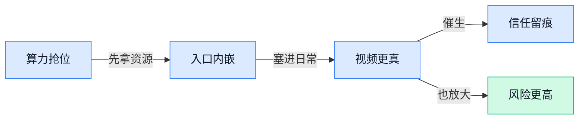

> AI 早报 · 每日早读 · 全网深度聚合

## **今日摘要**

```
OpenAI 俄亥俄锁定创纪录数据中心租约，Nvidia 15 亿美元押注 OpenAI 机房
Google 搜索 AI Mode 直接启用 Gemini 3.7 Flash，Gemini app 还放开 AI 水印开关
GitHub Copilot 自动修复反成入侵入口，Snowflake 的 Jira 被 AI 代码打穿
```

### 🔵 产品与功能更新

1. **Gemini app（Gemini 应用）新增 AI watermarks（AI 水印标记）开关，但有部分例外。**  
Google 这次给 Gemini 应用加了一个**水印开关**，可以让 AI 生成内容上的标记不再那么显眼，输出看起来更“干净”一点。⚙️ 但标题里也明确提到“有些例外”，说明这个功能并不是想关就全都能关，还是保留了限制条件。对经常要拿 AI 生成图文去做内部汇报、物料草稿或内容预览的人来说，这种细节会直接影响最后呈现效果。 [杰米尼应用更新(briefing)](https://news.google.com/rss/articles/CBMihwFBVV95cUxPZWZ3bC1QTnJ5WnlGYnZxVFNUSzhkSk5TclE4NmluYUMxVHhLdTJ3LU9zQ3lmbUF2Z1Q5RXJRSHNGYUhQSmV2eGdBUzRPVGcydVptNk1qLU00dTRzRUo4OXNNR1V5Y3RmQ0lRWTZkOXF5bUR0bHpWMUhaLWdORG1KcTM1WXExM00?oc=5)

2. **Google 搜索在 AI Mode（AI 问答模式）中启用 Gemini 3.7 Flash（Gemini 系列的轻量快速模型）。**  
这条更新的意思很直接：Google 搜索里的 **AI Mode** 开始接入更偏**快速响应**的模型，而不只是停留在“能聊天”的概念上。Gemini 3.7 Flash 这种命名通常代表更轻、更快，适合搜索这种需要马上给答案的场景。💡 对做运营、客服或知识库整理的人来说，搜索体验可能会更像一个能直接回答问题的助手。 [谷歌搜索测试消息(briefing)](https://news.google.com/rss/articles/CBMiekFVX3lxTE5mNkh5Nk9sLWh5Y08yNElFZEVhNG1KYkE4d1A4NlF0Y2ZEZHd4X29QR1B4LWt2cE9tMkJpeDlsVUJGRWU0VDBkT1NXT3lrZTlFallLUks3LXQ0RjE3eUo3UnBTUVEwT1pLMjkwY0JORVBBZ2xDYWFYbk5B?oc=5)

3. **OpenAI 为 Mac 版 ChatGPT 和 Codex 加入电脑历史记录（记录操作轨迹的功能）。**  
这项更新的核心，是让 ChatGPT 和 Codex 在 **Mac** 上能记住你做过的事情，方便后面接着处理。它更像是给日常工作加了一个“可回看”的轨迹，减少重复解释和来回切换的麻烦。🚀 文章只说明了这项功能出现在 Mac 端，其他细节没有展开，但对需要持续处理同一类任务的人来说，体验提升会很直观。 [苹果电脑功能更新(briefing)](https://news.google.com/rss/articles/CBMijwFBVV95cUxPMzRiU2o1TUlRMFgtLUZ0SkpOVTctbXJWRXA5b19LY25SNzJ1SGozMm1uSlE3bnU5OXY3eThnb0w2TjN6QjFTQ1dDYTROX2dKMnVHQXhlTjRrSTFUcEdMQ3JURVZrNHVwR2NDTFd2aVJSZktiU08zdDFsaFl4Q1hPUlRlanVWbFpDakdwbkVFNA?oc=5)

### 🟢 前沿研究

1. **Marionette（一项把世界状态预测、几何渲染和外观生成串起来的研究）尝试让模型更懂“场景会怎么变”。**  
这篇论文的标题把任务拆成三步：**预测世界状态**（让模型推测场景接下来会怎样变化）、**渲染几何**（生成物体形状和空间结构）、**绘制外观**（补上颜色、材质、光影等视觉细节）🎬。它关注的不只是“生成一张好看的图”，而是让模型先理解场景里的状态和结构，再把画面呈现出来。对视频生成、机器人感知、三维内容制作这类方向来说，这种思路意味着模型可能更像在“搭舞台”，而不是只会“画表面”💡。[论文页面(briefing)](https://huggingface.co/papers/2608.14530)

1. **A Pathway to General-Purpose Scientific AI（通向通用科学人工智能的多模态科学图像理解研究）聚焦科研图片读懂能力。**  
这项研究关注**科学图像的多模态理解**（把图片、文字说明和科学语境一起理解，而不是只看像素）🔬。从标题看，它想解决的是：未来的通用科学人工智能不仅要会读论文文字，还要能看懂显微图、实验图、图表等复杂视觉材料。对科研、医疗、材料、生物等行业来说，这类能力如果成熟，可能会让模型更适合做**科研助手**（帮助理解实验现象、整理图像信息，而不是替代科学判断）📊。[论文页面(briefing)](https://huggingface.co/papers/2608.14075)

1. **SPARGen（一种统一空间感知与推理的原生多模态生成研究）想让模型边看边想边生成。**  
**SPARGen**（一种面向空间理解与生成的研究框架）强调把**空间感知**（知道物体在哪里、彼此什么关系）和**推理**（根据关系做判断）放进同一个生成流程里🧩。标题里的**原生多模态生成**（模型从设计上就同时处理文字、图像等信息，而不是后期拼接多个工具）说明它不是单纯做图片生成，而是希望生成内容时保留更强的空间逻辑。对设计、游戏、虚拟场景、机器人导航等方向来说，空间关系更准，生成内容才不容易出现“桌子飘在空中”这类离谱问题 😄。[论文页面(briefing)](https://huggingface.co/papers/2608.14138)

1. **GPU Offload in Rust（用 Rust 语言把计算任务转交给显卡执行）主打可移植、安全和高速。**  
这篇论文研究**GPU Offload**（把原本由中央处理器干的重计算任务交给显卡执行，就像把重活分给更擅长的工人）在 **Rust**（一种强调内存安全的系统编程语言）里的实现方式⚙️。标题里的**可移植**意味着同一套思路希望能适配不同设备环境，**安全**则对应减少底层程序常见的内存错误。对人工智能基础设施和高性能计算来说，这类研究的价值在于：既想跑得快，也想少踩底层代码的坑 🛡️。[论文原文(briefing)](https://arxiv.org/abs/2608.13759)

1. **Intern-S2-Mobius（一个把知识与推理解耦的基础模型）探索“会记”和“会想”分开训练。**  
**Intern-S2-Mobius**（一个基础模型研究项目）标题里最关键的是**知识与推理解耦**（把模型掌握事实知识、进行逻辑推理这两类能力分开设计或分析）🧠。这背后的问题很现实：模型答题时，有时是“不知道事实”，有时是“知道但推理错了”，两者混在一起就很难改进。把这两种能力拆开看，可能有助于更清楚地评估模型到底差在哪里，也方便后续做针对性优化 💡。[论文页面(briefing)](https://huggingface.co/papers/2608.14290)

1. **Modular Cognitive Architecture（模块化认知架构）研究发现大语言模型中可能涌现分工结构。**  
这篇论文关注**模块化认知架构**（把复杂思考拆成多个相对独立的功能模块，类似公司里不同部门分工协作）是否会在大语言模型中自然出现🧱。标题里的**涌现**（不是人工明确写死，而是在训练后表现出来的能力或结构）是研究重点：模型内部可能并非一团黑箱，而是存在某种可观察的功能分区。对模型解释性来说，这很重要，因为如果能更清楚地知道模型哪些部分负责语言、记忆、推理，就更容易分析它为什么会答对或答错 🔍。[论文页面(briefing)](https://huggingface.co/papers/2608.13567)

1. **Scaling Domain Data Repetition in LLM Pretraining（扩大领域数据重复用于大语言模型预训练）研究“好资料能不能多学几遍”。**  
这篇论文讨论**领域数据重复**（把某个专业领域的数据在训练中多次出现，让模型更熟悉该领域）在**预训练**（模型正式投入使用前的大规模基础学习阶段）里的规模化问题📚。标题里的核心问题很直白：如果想让模型更懂法律、医学、金融等领域，是不是把相关资料重复喂给它就行？这类研究对企业很有参考价值，因为很多公司真正关心的不是模型“什么都略懂”，而是能不能在自己的专业场景里更稳定、更可靠地回答问题 (๑•̀ㅂ•́)و。[论文页面(briefing)](https://huggingface.co/papers/2608.14071)

1. **Self-Supervised Visual On-Policy Distillation（自监督视觉在线策略蒸馏）研究让视觉模型从自身行为中学习。**  
这个标题包含几个关键概念：**自监督**（不用人工逐条标答案，让模型从数据本身找学习信号）、**视觉**（处理图像或视频信息）、**策略蒸馏**（把一个模型的决策经验压缩传给另一个模型，像师傅带徒弟）👀。其中**在线策略**（模型在当前行动过程中不断依据自己的策略收集经验）说明它更贴近“边做边学”的场景。对机器人、自动驾驶、智能体视觉操作等方向来说，这类研究的意义在于减少人工标注依赖，让模型更会从真实互动中积累经验 🚀。[论文页面(briefing)](https://huggingface.co/papers/2608.14144)

### 🟡 行业展望与社会影响

1. **OpenAI 直面网络安全新攻防。**  
OpenAI 这篇内容想说的是，**AI** 正在同时改变攻击方和防守方的打法。文章重点放在 **cybersecurity（网络安全，防黑客和数据泄露）** 上，也就是企业不能只靠技术团队临时救火，而要提前把权限、钓鱼邮件和应急流程都准备好。对很多公司来说，这已经不是单纯的技术新闻，而是会直接影响业务连续性和信息安全的现实问题。🛡️ [官方安全解读页(briefing)](https://openai.com/index/the-defenders-window)

2. **苹果 AirTag（苹果的防丢定位器）揭开 Amazon 销毁稀有旧书训练 AI 的争议。**  
报道借助隐藏的 AirTag（苹果的防丢定位器）一路追踪，指向 Amazon 正在销毁稀有旧书，并把它们用于 **AI 训练**。原因也很直白：互联网上能抓到的内容，很多已经被模型学过了，反而是这些稀有文本更值钱；这也是大语言模型（靠海量文字学习、会生成和理解语言的 AI）为什么会盯上这类资料。📚 这件事把**版权**和**文化遗产**的问题一起推到台前。 [稀有藏书争议报道(briefing)](https://techcrunch.com/2026/08/17/amazon-once-an-online-bookseller-is-destroying-rare-books-to-train-ai-models/)

3. **OpenAI 在俄亥俄州锁定创纪录数据中心租约，算力竞赛继续加码。**  
据报道，这份租约最高可到 **1050 亿美元**，规模大到足以说明 AI 竞争已经进入基础设施拼抢阶段。这里的**数据中心**（装很多服务器、专门跑 AI 的大型机房）不只是“机房”，它还决定模型能不能稳定训练和上线。对行业来说，电力、土地和服务器的提前锁定，正在变成新的护城河。🚀 [创纪录租约报道(briefing)](https://the-decoder.com/openai-signs-record-ohio-data-center-lease-with-nvidia-backing-up-to-105-billion/)

4. **Nvidia 向软银的数据中心开发商投资 15 亿美元，押注 OpenAI 机房。**  
Nvidia 这笔 **15 亿美元** 投资，等于把自己更深地绑进 OpenAI 相关的基础设施链条。报道说，软银支持的这家**数据中心开发商**（负责规划和建设机房的公司）会保证 Nvidia 的芯片用在 OpenAI 的数据中心里。换句话说，AI 生意不只看模型，还要看谁能先拿到机房、芯片和电力。⚡ [芯片布局报道(briefing)](https://techcrunch.com/2026/08/17/nvidia-investing-1-5b-in-softbank-data-center-developer-behind-openai-project/)

5. **Relay（AI 自动化创业公司）关停，团队转入 Google Chrome 团队。**  
Relay 关停后，团队将加入 Google 的 Chrome 团队，继续在浏览器里做 AI 相关工作。创始人提到，接下来会想办法帮助用户在 Chrome 里把事情做完，这说明浏览器（上网的软件）正在变成新的 AI 入口。对创业圈来说，这类公司被大厂吸收，也是在提醒大家：入口级产品的竞争会越来越卷。🧭 [浏览器转向报道(briefing)](https://techcrunch.com/2026/08/17/ai-automation-startup-relay-shuts-down-staff-joins-googles-chrome-team/)

### 🟣 开源TOP项目

1. **arvin341az-glitch/RVG（名称未说明用途的开源仓库）。**  
   当前给到的材料只有仓库名，没有更多摘录，所以暂时只能确认它是一个 GitHub 开源项目。它更像一条需要补充**上下文（背景信息）**的线索，单靠现有信息还看不出具体能力。若你负责选型或内容跟踪，可以先点开 [开源仓库主页(briefing)](https://github.com/arvin341az-glitch/RVG) 看**项目说明文档（介绍仓库用途的页面）**，再判断它是否和你的场景相关。


2. **SMNETSTUDIO/WeChat-AI（面向微信场景的 AI 开源仓库）。**  
   从名字看，它明显是围绕 **微信** 相关场景做的 **AI** 项目，但现有材料没有展开具体功能。现在能确定的，只是这是一个开源仓库，适合先看它准备解决什么微信流程问题。对需要把 **AI** 接到客户沟通、社群运营或内部助手里的同事来说，这类项目值得先收藏观察。[开源仓库主页(briefing)](https://github.com/SMNETSTUDIO/WeChat-AI)


3. **MatrAIx-ai/MatrAIx-Persona-8B（偏人格模拟的 8B 规模模型）。**  
   这个仓库主打**人格模拟**，规模是 **8B（约 80 亿参数）**。它的口号是 “Simulate Before Reality.”（先模拟，再面对现实），意思很直白：先在模拟里试，再看真实效果。对想做**角色化助手**、固定说话风格或个性化对话的团队，这类项目会比较有参考价值。[开源仓库主页(briefing)](https://github.com/MatrAIx-ai/MatrAIx-Persona-8B)


4. **ccch1mneyyy/dsh-TUI（面向 DSH 公众号的终端文本界面插件）。**  
   这是一个给**终端文本界面（TUI，直接在命令行里操作的界面）**补交互体验的插件，而且支持 **npm（JavaScript 包管理器，常用来一键安装工具）** 一键安装。它提供了**鲸鱼顶栏**、**实时状态**、**流式思考（边生成边显示）**、**双击 Esc 回滚**、**上下文进度**和 **TPS（每秒处理量，用来观察速度）** 等功能。整体看下来，它是在把命令行里的 **Claude Code** 式体验做得更顺手一点，适合需要长时间和 AI 协作的人。[开源仓库主页(briefing)](https://github.com/ccch1mneyyy/dsh-TUI)

### 🔴 社媒分享

1. **GPT 5.6 Sol（OpenAI 的新视觉模型）被称为其最强“视觉”模型。**  
文章将 GPT 5.6 Sol（能理解图片等视觉内容的模型）评价为 **OpenAI 迄今发布的最佳视觉模型** 👀。这里的“视觉模型”是指能够识别和理解图像信息、辅助处理图片任务的 AI。这个判断聚焦于模型的图像理解能力，对需要分析图片、截图或视觉素材的工作场景具有参考价值。[GPT 5.6 Sol 原文介绍(briefing)](https://blog.roboflow.com/openai-gpt-5-6/)


2. **同一 GPU 集群（多台显卡协同工作的计算资源）利用率提升 33 个百分点，关键在任务顺序。**  
文章标题指出，在硬件条件不变的情况下，**GPU 集群利用率**提高了 33 个百分点 📈。GPU（专门加速 AI 计算的显卡）利用率，指这些计算资源实际投入工作的比例。变化的重点不在集群本身，而在任务的**调度顺序**（安排不同任务执行先后的方式），说明基础设施管理中的流程调整也可能带来明显收益。[GPU 管理实践文章(briefing)](https://huggingface.co/blog/Dharma-AI/gpu-management-pt2)


3. **Stripe 据报将收购 OpenRouter（聚合多家 AI 模型的服务平台）。**  
报道援引相关消息称，Stripe 可能收购 OpenRouter（让用户通过一个入口调用多种 AI 模型的平台）💳。这笔交易被解读为 Stripe 看好未来的**模型市场**，也就是不同 AI 模型像商品一样被集中比较、调用和交易。文章进一步讨论了“聚合”（把分散的模型和服务集中到同一入口）可能如何改变 AI 生意的运作方式。[Stripe 收购报道分析(briefing)](https://stratechery.com/2026/stripe-acquiring-openrouter-aggregating-ai-flipping-the-business-model/)


4. **Import AI 第 469 期聚焦科学 AI、RSI 模拟器与扎克伯格的技术悲观论。**  
本期 Import AI（关注人工智能研究与产业动态的 newsletter，即定期发布的专题通讯）围绕三个方向展开：**科学 AI**、RSI 模拟器，以及扎克伯格对技术发展的悲观态度 🧪。科学 AI 指把 AI 用于科学研究和问题探索；RSI 模拟器中的 RSI，原文仅以缩写呈现，具体含义需要结合文章内容理解。整体来看，这一期把 AI 的科研应用、未来情景模拟和科技观念放在同一篇内容中讨论。[Import AI 第 469 期(briefing)](https://jack-clark.net/2026/08/17/import-ai-469-science-ai-rsi-simulator-and-zucks-technological-pessimism/)

5. **AI 生成的 GitHub Copilot“自动修复”导致 Snowflake 的 Jira 遭到入侵。**  
报道指出，AI 生成的 GitHub Copilot（微软旗下的 AI 编程助手）“Autofix”（自动修复代码问题的功能）最终造成了 Snowflake（企业数据云平台）的 Jira（用于管理项目和工单的协作工具）被攻破 🚨。这里的 **CI/CD**（让代码自动完成测试、构建和发布的一套流程）是相关软件交付环节，自动生成的修复内容可能会进入这类流程。事件提醒企业，AI 编程工具生成的修改仍需要人工审核和安全检查，不能因为标注为“自动修复”就直接信任。[Snowflake Jira 安全事件(briefing)](https://www.wiz.io/blog/red-agent-snowflake-copilot-cicd-bug)

---



### 📊 行业洞察（今日 4 条）

1. OpenAI签下俄亥俄超大机房租约，Nvidia（英伟达）又投15亿美元锁供应，说明AI竞争已从拼模型转到拼电力、土地和长期资金。  
  【洞察】这不是简单烧钱，而是先把算力入口和芯片供给占住；以后没基础设施的人，连追赶窗口都会变窄。

2. Anthropic给Claude加文本水印，Google给Gemini（谷歌的AI助手应用）留例外开关，再加Amazon（亚马逊）毁稀有旧书训练AI，说明“内容来源证明”正变成硬问题。  
  【洞察】表面是透明度，背后是版权、取证和品牌风险一起上桌；内容工具以后不能只会生成，还得能交代来源。

3. OpenAI给Mac（苹果电脑）版ChatGPT和Codex（帮写代码的AI工具）加历史记录，Google搜索的AI问答模式接入Gemini 3.7 Flash（谷歌的轻量快模型），Relay（做AI自动化的小公司）并入Chrome（谷歌浏览器）团队，说明AI正被塞进原工作流里。  
  【洞察】入口之争会越来越看“顺手”而不是“更聪明”；谁能少切页面、少重复说话，谁就更容易留住用户。

4. 现实危机事件的AI生成视频攻击评估、Marionette（把世界状态预测、几何渲染和外观生成串起来的研究）和SPARGen（把空间理解和生成放一起的研究）一起看，说明视频生成更像真，也更难分真假。  
  【洞察】对内容平台来说，越会生成就越要会标来源；否则画面越逼真，品牌和平台的误伤成本越高。

### 💭 对我们的启发（今日 3 条）

1. OpenAI、Anthropic、Google都在补留痕和可追溯，我们的视频剪辑软件不能只做一键生成，还要让品牌商一眼看懂素材来源、AI参与痕迹和可导出版本。  

2. OpenAI把历史记录做进Mac端，Google把AI塞进搜索和Chrome，说明用户更想在原工作里直接问、直接改、直接续上次操作；我们该优先做“不打断创作”的助手。  

3. OpenAI和Nvidia（英伟达）抢算力，说明模型调用成本未必会一直降；我们调度时要把常用改动交给便宜方案，把高耗时步骤留给人工接管，才能保住毛利。


---

> 本周周报：[第34周综合分析](https://zhuxinfei.github.io/ai-daily-site/blog/weekly/2026-w34/)
