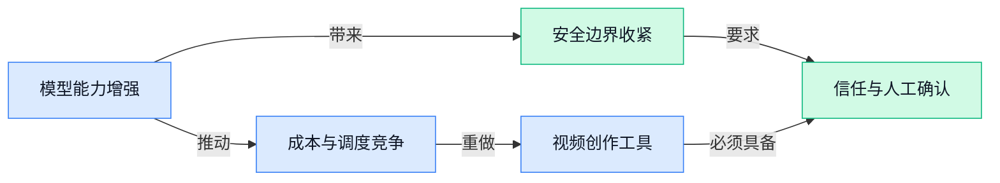

> AI 早报 · 每日早读 · 全网深度聚合

## **今日摘要**

```
OpenAI因网络安全风险放慢模型迭代，ChatGPT青少年版重磅上线强化保护
StateM（终端任务模型）在Terminal-Bench 2.1（命令行评测）冲到95.3%准确率
Cursor推出Origin（代码托管服务）正面挑战GitHub，Mojo（编程语言）突然开源
```

### 🔵 产品与功能更新

1. **OpenAI 强化前沿模型的网络安全防护与开发节奏管理。**  
OpenAI 表示，将进一步加强对**前沿 AI 模型**（能力最强、潜在影响也更大的新一代模型）的监测、**alignment（对齐，让模型行为符合人类意图的训练过程）**和安全措施 🚀。重点是应对模型可能具备的关键网络能力，即 AI 被用于网络攻击或协助发现系统漏洞的风险。公司希望通过更严格的评估与防护机制，在推进能力升级时同步控制安全边界 💡。[OpenAI 安全措施说明(briefing)](https://openai.com/index/pacing-model-development-cyber-capabilities)

2. **OpenAI 推出面向青少年的 ChatGPT 使用体验。**  
OpenAI 正式推出针对青少年用户设计的 ChatGPT 使用体验，意味着生成式 AI 产品开始更明确地按年龄段提供服务 🚀。原报道聚焦这一产品发布，但未披露具体功能、适用年龄范围或保护机制细节；因此目前只能确认其面向**青少年用户**这一定位。对学校、家庭及提供青少年服务的企业来说，这类分层体验也提示了 AI 使用中的年龄适配与内容安全需求 💡。[青少年版发布报道(briefing)](https://news.google.com/rss/articles/CBMiiwFBVV95cUxOZDVETGhiSEx6V1MyVUx5MWJ1dzZVWDFOMXBDX01JUHkzbGdoRkhIRlNCSE1INlN0M1VKS0dCLTBFa2wxRzFTbnNWLVBOQjhNVjJZUDU2N0xkNVkwZ0daNFE4UVFGMkNrek5NVWdMTkJUUWE4R0E5ZS15bzg3cm1scFhWc29qSXRqRmQw0gGQAUFVX3lxTFBfTUZvSDFVbV9sc3JRUzhyQkg0VFFiQW02dWx2S2lRR0s2TE5Rcm5oYW9vMEwxbnFzVXJSUUg1QjItdEFTdWtGQlM5OEZ0MUVWdXdoQlBYbkszZ1dNYWk2aVB3UVRSZk9xdkJ4RDRIOEU4dHQ0eGxTbFZSYmloaGRkX0o4YWdHOWx2MnN4NUJTTA?oc=5)

### 🟢 前沿研究

1. **Large Discovery Models（大型发现模型）探索开放式搜索。**  
这篇论文关注如何让模型在缺少固定答案的情况下，进行**开放式搜索**（不断提出、检验和改进新方向）。标题还强调“以经验为依据”，说明研究并非只依赖理论推演，而是重视实际观察结果。Model-based search（模型驱动搜索，即让模型参与规划和筛选探索路径）可能为科研发现、复杂问题求解等场景提供新的思路 🚀。[HuggingFace 论文页面(briefing)](https://huggingface.co/papers/2608.15669)

2. **Saturation Aware Advantage Reweighting（感知奖励饱和的优势重加权方法）改进多奖励训练。**  
这项研究讨论如何处理多个奖励目标同时存在时的模型训练问题。Saturation-aware（感知饱和，即识别某个目标已经学得差不多，避免继续重复投入）被用于重新调整不同训练信号的重要性。Multi-reward policy optimization（多奖励策略优化，即让模型同时按照多项标准学习行动）有望让训练资源更多用在尚未掌握的部分，而不是反复强化已经熟练的能力 💡。[HuggingFace 论文页面(briefing)](https://huggingface.co/papers/2608.16072)

3. **DumpsterCluster（低成本显卡集群方案）尝试用 60 美元显卡运行 LLaMA-70B（700亿参数大模型）。**  
这篇论文探索从低价甚至被淘汰的硬件中“淘金”，组建可运行大模型的计算集群。GPU（图形处理器，当前运行大模型最常用的高性能芯片）通常价格不低，而研究标题提出了用每块 60 美元的 GPU 服务 LLaMA-70B（700亿参数的 LLaMA 模型）。如果这一方向成立，说明大模型推理（让训练好的模型实际回答问题）未必只能依赖昂贵的数据中心硬件，预算有限的团队也可能获得更多尝试空间 ⚙️。[HuggingFace 论文页面(briefing)](https://huggingface.co/papers/2608.14614)

4. **VibeWorlding（凭直觉构建虚拟世界）挑战多模态 Agent（能自主执行任务的 AI 助手）生成三维开放世界。**  
这项研究提出一个问题：多模态 Agent（能同时理解文字、图像等信息并采取行动的 AI 助手）能否从头到尾构建一个 3D（三维立体空间）开放世界。所谓端到端（从输入需求一直完成最终结果，中间尽量少依赖人工接力），意味着研究关注的不只是生成单个场景，而是完整创作流程。这个方向与游戏开发、虚拟展厅和沉浸式内容制作密切相关，也体现了 AI 从“生成素材”走向“搭建可探索空间”的趋势 🌍。[HuggingFace 论文页面(briefing)](https://huggingface.co/papers/2608.15265)

5. **研究“Agent（能自主执行任务的 AI 助手）到底需要多少记忆”。**  
这篇文章聚焦 Agent 的**记忆需求**：一个能够持续执行任务的 AI 助手，究竟需要保留多少过去的信息。这里的 memory（记忆，即让模型在后续任务中继续利用此前经历和资料的能力）直接关系到系统成本、响应速度与长期协作体验。这个问题对需要处理连续事务、反复沟通或复杂流程的办公助手尤其重要 🧠。[HuggingFace 研究文章(briefing)](https://huggingface.co/blog/ibm-research/altk-evolve-hmm)

6. **现代优化与 AlphaEvolve（用于探索算法方案的 AI 工具）改进矩阵乘法指数。**  
这篇论文研究矩阵乘法指数 ω（衡量矩阵相乘理论效率的指标）如何进一步改进。矩阵乘法是许多 AI 计算和科学计算的基础操作，因此更高效的算法可能影响模型训练、数据分析等底层计算环节。研究同时引入现代优化方法与 AlphaEvolve（文中用于探索优化方案的工具），展示了自动寻找算法改进方向的一种可能路径 🔍。[HuggingFace 论文页面(briefing)](https://huggingface.co/papers/2608.16884) [arxiv 论文页面(briefing)](https://arxiv.org/abs/2608.16884)

7. **StateM（面向终端任务的模型方案）在 Terminal-Bench 2.1（测试 AI 操作命令行任务能力的评测集）上冲到 95.3% 准确率。**  
论文标题报告了 StateM 在该评测中的 **95.3% 原始准确率**，并给出一次 15 美元的前沿模型级运行成本。Harness scaling（扩大任务执行辅助工具的能力，即给模型配备更完善的操作、检查和反馈机制）是这项工作的关键方向。它说明提升 Agent 表现不一定只靠更换模型本身，围绕模型设计更好的任务执行“工具箱”同样可能带来明显收益 💰。[HuggingFace 论文页面(briefing)](https://huggingface.co/papers/2608.15089)

### 🟡 行业展望与社会影响

1. **OpenAI 表示将放慢模型迭代，因为 AI 网络安全风险正在变得太危险。**  
OpenAI 这次传递出的信号很直接：**模型迭代（模型不断升级的过程）**不能只看速度，还要先看会不会被坏人拿去做网络攻击。它把重点放在**AI 安全（防止模型被滥用）**上，也说明大模型公司开始更谨慎地平衡“更强能力”和“更高风险”⚠️。对外部企业来说，这通常意味着新功能可能不会一路狂飙上线，但产品会更强调稳妥和可控。原文见 [安全风险完整报道(briefing)](https://the-decoder.com/openai-says-its-pacing-model-development-as-ai-cybersecurity-risks-grow-too-dangerous/)

2. **OpenAI 与 CodeAI（合作方）合作，帮助下一代建立 AI 素养。**  
OpenAI 和 CodeAI 计划一起帮助学生建立**AI 素养（懂得理解、判断和使用 AI）**，并培养**批判性思维（不盲信答案，会先核对再决定）**。这类合作看起来很教育，但背后其实是在为未来职场补课：以后大家不只是会问 AI，还要会判断它答得对不对、该不该用 💡。原文也强调，目标是让学生学会负责任地使用并塑造 AI，而不是把它当成“自动答案机”。可查看 [官方合作公告(briefing)](https://openai.com/index/partnering-with-codeai)

3. **OpenAI 推出面向青少年的 ChatGPT 版本，内置更强安全保护。**  
报道称，这个**青少年版（专门给未成年人设计的使用版本）**会带有更强的**内置安全保护（产品默认帮你挡住不合适内容）**，重点是让年轻用户用起来更安心。媒体还提到，这次推出发生在 OpenAI 诉讼压力不断增加的背景下，说明 AI 产品的社会责任已经越来越被放大来看 ⚖️。对普通公司来说，这也在提醒大家：未来的 AI 工具不只是拼功能，还要拼**年龄分层**和**内容安全**。相关报道见 [青少年版报道(briefing)](https://news.google.com/rss/articles/CBMid0FVX3lxTE9hT1haZXNjMWYxSjNLTXJ3d3liejhCUWNPOFZIUGdjNWFWcnRMdnd6NjBpNUFHN1lXVjF4X19DMkNsckpKWlNpQWdlY0c0RDB2Yks0ZHA3MXVCMzNMVEE5WVZnX2xoY0hKdE4xRlFGMjZiSGwxRndB0gF8QVVfeXFMTk5VdnN6enlhQi03NF9hWW16OXVMM3hJX1NNa2pkNVE0QURNMUZ4LTlPOVlxcVJDR0ZLUzVfWXNzNlRoWHBmaFpuM0piRnpPSlFqMjZucTdrR3VBZzRkZHBtZFpOMUdxblVVY0Z2NXhUemthU2FDUjc0MGx3dA?oc=5)

### 🟣 开源TOP项目

2. **MyContext（本地优先的桌面沟通与知识工作应用）面向日常办公场景。**  
MyContext 是一款桌面应用（安装在电脑上使用的软件），服务于日常沟通和知识工作（整理信息、处理文档与完成分析任务等脑力工作）。它采用 local-first（优先在本地运行和处理数据的产品思路），适合重视工作资料管理与使用体验的团队成员 💡。项目详情可见 [MyContext GitHub 仓库(briefing)](https://github.com/openTrinity/mycontext)。


3. **internet-court-skill（智能体交易信任与争议处理插件）试图补上 Agent 商业协作的信任环节。**  
该项目面向智能体之间的商业交易，支持自然语言授权、ERC-7710（用于委托他人或智能体代办事项的权限标准）和 x402（项目中用于支付的机制）。它还把托管付款（交易双方都同意后再放款的安排）与争议解决整合到一个 Agent Skill（供智能体调用的任务插件）中。项目同时提供 Claude Code（Anthropic 的编程助手）插件形态，目标是让复杂交易规则更容易被智能体执行 🤝。[项目 GitHub 仓库(briefing)](https://github.com/internet-court/internet-court-skill)


4. **FlyingMouse Format（飞鼠格式，Windows 离线文件格式转换工具）覆盖多种办公与媒体文件处理需求。**  
这是一款 Windows 免费工具，可在离线状态下完成图片、文档、表格、演示文稿、PDF（便携式文档格式）、音视频和 WPS（常见办公软件套件）等格式之间的转换。软件内置 FFmpeg（处理音视频格式的开源工具）、LibreOffice（开源办公软件套件）、Poppler（处理 PDF 文件的工具组件）和 Tesseract（用于识别图片文字的 OCR 引擎），并支持 OCR（从图片中提取文字）与批量转换 📄。项目注明仅供个人免费使用，禁止商业售卖、转卖或套壳，可通过 [飞鼠格式项目仓库(briefing)](https://github.com/LaoFeng-mouse/flyingmouse-format) 了解详情。


5. **NVIDIA-NeMo/Switchyard（英伟达的大模型应用路由工具）帮助团队灵活选择模型与服务商。**  
Switchyard 可以在不同模型和服务商之间分配大模型应用的请求，同时保持对 OpenAI 和 Anthropic API（让软件调用 AI 服务的接口）的兼容。这样一来，团队可以根据任务需要切换模型，并进行 benchmarking（用统一任务比较不同模型表现的测试）以及成本与性能优化。对于需要同时接入多个模型、比较效果和控制调用费用的开发团队来说，这类路由层能提供更灵活的管理方式 ⚙️。[Switchyard GitHub 仓库(briefing)](https://github.com/NVIDIA-NeMo/Switchyard)

### 🔴 社媒分享

1. **Multi-Vector（多向量表示）与 Late Interaction（后期交互匹配）Embedding Models（把文本转成可比较向量的模型）登陆 Sentence Transformers（文本模型工具库）。**  
这篇分享聚焦于一类新的**文本表示模型**，核心关键词包括 Multi-Vector（多向量表示）和 Late Interaction（后期交互匹配）。通俗来说，它们都在探索如何把一句话或一段文本转换成更适合比较、检索的 embedding（文本向量, 让机器判断不同内容是否相似的数字表示）📚。相关内容发布在 HuggingFace（全球最大的人工智能模型共享社区）的官方博客上，适合想了解文本搜索与语义匹配进展的同事。[模型介绍原文(briefing)](https://huggingface.co/blog/multi-vector-encoder)


2. **英伟达支持 OpenAI 数据中心，Anthropic 营收与 Google 数据交易受关注。**  
这篇文章串联了三条动态：英伟达再次参与一笔交易，这次对象是一家前沿人工智能研究机构；Anthropic 的**营收表现**继续令人惊讶；Google 则被放在“购买 Spirit Airlines 数据”的讨论中 ✈️。其中，“前沿实验室”指专注于研发先进人工智能模型和系统的研究机构。文章还抛出一个耐人寻味的问题：数据是否终于像石油一样，成为重要的商业资源。[行业动态完整报道(briefing)](https://stratechery.com/2026/nvidia-backs-openai-data-center-anthropic-news-google-buys-spirit-airlines-data/)


3. **Mojo🔥（一种编程语言）现已开源。**  
Mojo🔥 是一种**编程语言**，如今正式进入开源阶段 🚀。开源意味着代码可以被公开查看、使用和共同改进，类似于把一套工具的“制作说明书”交给开发者社区。此前，Mojo🔥 已经持续释放即将开源的信号，这次分享记录了这一进展对开发者生态的意义。[Mojo 开源消息(briefing)](https://simonwillison.net/2026/Aug/18/mojo-is-now-open-source/)

4. **Cursor 推出 Origin（代码托管服务），瞄准 GitHub 替代方案。**  
Cursor 发布了名为 Origin（代码托管服务, 用于保存和协作管理软件代码）的新产品，并将其定位为 GitHub 的替代选择 💻。所谓**代码托管**，就是把项目文件集中放在网络平台上，方便团队协作、修改记录和版本管理。对使用人工智能辅助编程的团队来说，这意味着 Cursor 正从单纯的编程助手，向更完整的软件开发协作平台延伸。[Origin 官方更新(briefing)](https://cursor.com/changelog/origin-code-hosting)

---



### 📊 行业洞察（今日 4 条）

1. OpenAI一边因网络攻击风险放慢模型升级，一边推出带更强保护的青少年版ChatGPT，并与CodeAI合作培养AI素养  
  【洞察】这几件事放在一起看，AI行业已经进入“能力越强，安全和使用边界越要产品化”的阶段，安全不再只是宣传口号，而是发布节奏和产品设计的一部分

2. 英伟达推出可在不同模型之间分配任务的工具，低价显卡运行大模型和改进任务执行工具的研究也同时出现  
  【洞察】模型本身不再是唯一竞争点，谁能按任务选择合适模型、降低调用费用、把失败任务交给更合适的工具，谁就更容易把AI真正用起来

3. 大型发现模型研究开放式探索，VibeWorlding（让AI从文字搭建可探索三维世界的研究）和AlphaEvolve（让AI自动寻找更好算法的工具）都在尝试完成更长流程  
  【洞察】AI正在从“生成一段内容”走向“自己提出方案、反复尝试并交付结果”，但这些仍以研究验证为主，距离稳定替代完整创作流程还有明显差距

4. MyContext（优先在本地处理资料的办公软件）强调数据留在用户电脑，internet-court-skill（给AI交易提供授权、付款和纠纷处理的工具）则补商业信任  
  【洞察】AI应用的下一道门槛不是单纯更聪明，而是用户敢不敢把资料和决策交给它；隐私、授权、可追责会逐渐变成产品竞争力

### 💭 对我们的启发（今日 3 条）

1. 英伟达的模型分配工具说明，剪辑软件应按任务自动选择不同模型：粗剪、字幕、脚本和画面生成不必都用最贵的模型，把成本控制直接做进产品

2. OpenAI为青少年版ChatGPT增加默认保护，提醒我们给视频生成加品牌禁用词、敏感画面拦截和人工确认节点；涉及商品承诺、人物肖像和投放素材时，不能完全自动发布

3. MyContext重视本地资料、internet-court-skill强调授权与纠纷处理，说明品牌商更在意素材是否外泄、谁批准了成片；我们需要保留操作记录、素材来源和人工接管入口，建立可解释的信任机制


---

> 本周周报：[第34周综合分析](https://zhuxinfei.github.io/ai-daily-site/blog/weekly/2026-w34/)
