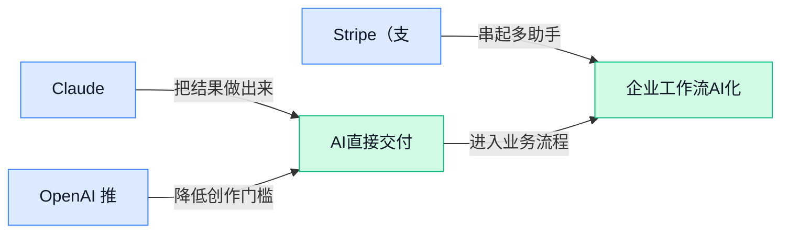

> AI 早报 · 每日早读 · 全网深度聚合

## **今日摘要**

```
中国少量放行 H200（英伟达高端 AI 芯片）入华，本土 AI 公司追赶节奏再提速
Anthropic 语言模型智能体跑完整蛋白设计流程，AI 从对话助手杀入生物科研
Stripe（支付科技公司）拟收购 OpenRouter（AI 模型市场），金融科技突袭 AI 基础设施
```

### 🔵 产品与功能更新

1. **Claude、GPT（OpenAI 的一类大模型名称）等数十个 AI 模型（能理解和生成文字等内容的智能程序）本周终身访问价 60 美元。**  
First Coast News 报道称，一个包含 **Claude、GPT** 以及数十个其他 AI 模型的访问套餐，本周以 **60 美元终身访问** 的形式促销 💰。对经常在不同模型之间切换的同事来说，这类“多模型入口”（一个账号里聚合多个 AI 工具，省去分别订阅的麻烦）听起来很有吸引力。需要注意的是，原文标题只披露了价格和覆盖范围，具体是否限量、是否有使用额度、售后规则如何，仍要以购买页说明为准 👀。[促销报道详情(briefing)](https://news.google.com/rss/articles/CBMipAJBVV95cUxPWUc5TElVTHlGd3g0Q0EwN0NETHNrSXB4VzhQOWJHbi1ZeFRzckcyR2RvMlY2b3VDNWxZSklkQ09wX0t1aU1LM05nTkNxODJsTWx1dnQyVWVZUGlkWHBuNkdnYk42NjNscmVzZUR4TU1xbWdDNHM4clNDYkE0clNzYmwtbS1Ta3ZWWG1wUklLM0Z3bFI1XzZMeFRCUEhyX3RobHRab3hzZGU4ZUxXb2RHRUtOdVpBTGhINUhqWml2X0lxWFJIb0ZjZDZPcDRfaThFckRrMTBKYndjbDFMVGxwYlNqcGxZZWtyWlZUc2JlYVc5bHNwOE8wVlF5cGpSOU0wVVk0dWZGYVdJU2kxZFhXUGJ2Ylc2SjBDLVFZZ0k2Tlo1TGRl?oc=5)

2. **OpenAI 推出青少年版 ChatGPT，儿童安全（保护未成年人免受不当内容或风险互动影响）成为焦点。**  
OpenAI 面向 **青少年用户** 推出 ChatGPT 新版本，但外界也同步呼吁加强 **儿童安全** 保护 🛡️。KJZZ 的报道提到，有专家提醒应谨慎看待这一上线动作；Silicon Republic 也把它放在“需要更强儿童安全”的讨论背景下。对学校、家庭和企业管理者来说，这意味着 AI 产品正在从“成年人效率工具”走向更敏感的未成年人场景，相关的内容过滤（自动拦截不适合内容的机制）和使用边界会越来越重要 💡。[专家谨慎提醒(briefing)](https://news.google.com/rss/articles/CBMikwFBVV95cUxNalpEOEdZa3VIemlPUS1zVWtUZ1cwcTVKNkR6d3N5UEhDMEE1cWs4Q3ZFdWhuNXU1SkNsZ3JoT0dMV0lGdnBUVHJrWDVkME5IalFtemRXcEdISTUyVGxzZFRkbTNkb2tTQkdhV2wxLWtBQUxQdW9PYTJYMlJlUVpmREVER0c2Nk9QTDRaT3dVenBSYVk?oc=5) [儿童安全报道(briefing)](https://news.google.com/rss/articles/CBMixgFBVV95cUxNMzZkaGlsSEJhdlpSd2tjdTFJT3VaYmU2S0FJRDB3WmNuam9xa1hnTV91dHljLWZzYkl3OHZPeERrV0twNmI5ZHlIbmRZLUU5QmhzNGJXQ0VoZ1NoXzlVM0VrVERjVGdFM0hkRS1BdEp5a3dFU0ZNV0xOblM1S09DZ3NCcVNNenBDRUZfVWhqZVRHYWx3VmZVcmVqdmM2U0NwcmV4NDh3Y2dBRm03anlDMUhqSTh0UHRnbmJfb19WNjFwclVIR1E?oc=5)

### 🟢 前沿研究

1. **HarnessRisk（一套评估智能体安全风险的生命周期基准）关注 Agent Harness（智能体运行外壳，负责连接工具、权限和执行环境）的安全。**  
这篇研究把重点放在**智能体从设计、部署到运行的全流程风险**上，而不只是看模型回答得好不好。这里的 **benchmark（基准测试，用统一题目衡量系统能力和风险）** 可以帮助团队更系统地检查：智能体在调用工具、处理权限、执行任务时会不会“越界”或出错 🚦。对业务同事来说，它的意义是：未来采购或上线智能体产品时，安全评估可能会从“看演示效果”变成“按生命周期逐项体检”。[论文页面(briefing)](https://huggingface.co/papers/2608.17597)

2. **Cross-Model Memory Transfer（跨模型记忆迁移，让一个模型的记忆被另一个模型利用）探索模型之间共享经验。**  
这项研究关注 **memory transfer（记忆迁移，把已有模型积累的信息转给新模型使用）**，核心问题是：不同大模型之间能不能更顺滑地“接力”已有知识。标题里的 **Target-Side Reader Adaptation（目标侧阅读器适配，让接收记忆的模型学会读懂外来记忆）**，可以理解为给新模型配一个“翻译员”，帮助它理解别的模型留下的资料 💡。如果这类方向成熟，企业更换模型或多模型协作时，可能减少重复配置和重复学习成本。[论文页面(briefing)](https://huggingface.co/papers/2608.17050)

3. **StartupBench（一套用真实创业流程测试通用智能体的基准）把 Agent 放进端到端商业任务里考。**  
这篇论文提出 **StartupBench（创业任务基准，用市场验证过的完整工作流测试智能体）**，重点不是单题问答，而是让智能体处理更接近真实业务的连续流程。所谓 **end-to-end workflow（端到端工作流，从任务开始到结果交付的一整套流程）**，就像从调研、规划到产出方案都要连贯完成，而不是只回答一个小问题 🚀。这类测试对运营、产品、市场团队很有参考价值，因为它更接近“这个智能体到底能不能独立推进一件事”。[论文页面(briefing)](https://huggingface.co/papers/2608.17800)

4. **Anthropic 让语言模型智能体跑完整蛋白设计流程。**  
报道称，Anthropic 表示任何实验室现在都可以让一个语言模型智能体运行**完整的蛋白设计栈**，也就是把一串科研工具和步骤串起来使用。这里的 **protein design stack（蛋白设计工具链，用于设计、筛选和验证蛋白相关方案的一整套软件流程）**，原本通常需要专业人员协调多个环节，现在被语言模型智能体接管更多流程 🧬。这件事说明，智能体正在从“帮人写文字”走向“帮科研团队操作复杂流程”，但原文强调的是能力开放本身，并未展开具体效果数据。[完整报道(briefing)](https://the-decoder.com/anthropic-says-any-lab-can-now-let-a-language-model-agent-run-the-whole-protein-design-stack/)

5. **ASI-Bench（一套面向人工超级智能早期能力的基准）试图衡量更高阶 AI 能力。**  
这篇研究的标题指向 **Artificial Superintelligence（人工超级智能，理论上在多数任务上超过人类的 AI）**，并提出用 **ASI-Bench（超级智能能力基准）** 来讨论相关能力评估。它关注的不是普通聊天体验，而是更宏观地看模型是否接近更强、更综合的能力阶段 🔭。对非技术团队来说，这类研究的价值在于提供一套“怎么判断 AI 变强了”的参考框架，而不是只靠营销口号判断先进程度。[论文页面(briefing)](https://huggingface.co/papers/2608.17271)

6. **Agent Lightning v1.0（一套面向智能体强化学习的研究框架）推动更可控的智能体训练。**  
这篇论文提出 **Agent Lightning v1.0（智能体训练框架，目标是让智能体在任务环境中边做边学）**，关键词是 **RL（强化学习，像训练员工一样通过奖励和反馈让系统学会更优行为）**。标题里的 **Harnessed Agentic RL（带运行外壳约束的智能体强化学习）**，可以理解为让智能体在受控环境里训练，而不是随意行动 ⚡。这对企业应用很重要：未来智能体若要处理真实流程，既要变聪明，也要被边界和规则“拴住”。[论文页面(briefing)](https://huggingface.co/papers/2608.17528)

7. **DiSCO（一种保护文生图生成的提示词优化方法）尝试防御图像生成风险。**  
这篇研究聚焦 **text-to-image generation（文生图生成，用文字描述生成图片）** 的防御问题，提出 **DiSCO（一种通过提示词优化增强防护的方案）**。标题中的 **contrastive prompt optimization（对比式提示词优化，通过比较安全与风险表达来调整提示词）**，可以理解为给图像模型加一道更聪明的“提示词过滤与引导”机制 🛡️。对设计、品牌和内容团队来说，这类研究关系到未来生成图片时如何减少违规、误导或不安全内容。[论文页面(briefing)](https://huggingface.co/papers/2608.17067)

8. **Capability-Centric Data Design（以能力为中心的数据设计）探索通用图像生成模型如何持续进化。**  
这篇论文从 **corpora（语料库或数据集合，用来训练模型的大量样本）** 出发，讨论如何围绕模型能力来设计数据，而不是简单堆更多图片。标题里的 **Co-Evolving Capabilities（共同进化的能力，指数据设计和模型能力相互促进）**，说明研究重点在于让通用图像生成模型更系统地成长 🎨。如果这类思路有效，未来图像生成产品可能不只是“数据越多越好”，而是更讲究用什么数据培养什么能力。[论文页面(briefing)](https://huggingface.co/papers/2608.18076)

### 🟡 行业展望与社会影响

1. **Stripe（支付科技公司）拟收购 OpenRouter（AI 模型市场），金融科技继续向 AI 基础设施延伸。**  
Stripe（支付科技公司）准备把触角伸到 OpenRouter（AI 模型市场）这类平台上，说明它不只想做支付，还在往 **AI** 入口和交易链路里加码 🚀。OpenRouter 像“模型超市”，让企业更方便地接入不同模型；如果这笔收购落地，企业以后在采购和结算上的路径可能会更一体化 💡。对行业来说，这也是一个清晰信号：**金融科技**公司正在把自己嵌进 AI 生态的底层环节。[路透收购报道(briefing)](https://news.google.com/rss/articles/CBMipwFBVV95cUxQVkl3Q1p0eG5uR21ZT0lMdnRnd0UydUJlc3J3M1lSckFjMndEX29fNG9lUXN3YmxLeDFwRms1MU0zME80TmUzb291Y3psVm0taE9fWDdYX2stOWs4cFRBUUgxN2hhRllfLXF0djJzSC0xN3pZZ0REMVZrWUxJSy03dE9uUVdWbWdoWDhnYjdpekIxeDNQSUh1SnJKUUtoLUtoU0xocEh4QQ?oc=5)


2. **中国少量放行 H200（英伟达面向 AI 训练的高端芯片）入华，帮助本土 AI 公司追赶节奏。**  
中国开始让 H200（英伟达面向 **AI 训练** 的高端芯片）以**小批量**方式进入大陆，给本土 AI 公司补上一点算力供给 🚀。这里的重点不是全面放开，而是“慢慢流入”，也就是在供应还紧的时候多一个补给口 💡。对企业来说，这可能缓解部分压力，但并不意味着算力环境已经彻底宽松。[英伟达芯片入华报道(briefing)](https://the-decoder.com/china-lets-nvidias-h200-chips-trickle-onto-the-mainland-to-help-its-ai-firms-keep-pace-with-the-us/)

3. **OpenAI 推出民主监督倡议，帮政府机构管住 AI 的国家安全场景。**  
OpenAI 启动了一项面向**国家安全**的倡议，重点是支持政府机构用**工具包（帮助机构把规则落地的支持资源）**、培训和专业经验来加强监督 🚀。这说明 AI 已经不只是企业内部提效工具，也开始进入更敏感的公共治理场景 💡。对普通人来说，这类动作传递的信号很直接：越是高风险用途，越需要先把规则、流程和责任划清楚。[民主监督倡议说明(briefing)](https://openai.com/index/strengthening-democratic-oversight-in-national-security)

4. **OpenAI 在网络攻击后放慢先进 AI 训练，安全风险开始反向影响研发节奏。**  
据报道，OpenAI 在遭遇**网络攻击**后，正在放慢先进 AI 的**训练节奏（模型继续学习的速度）** 🚀。这件事说明，前沿模型研发不只是拼速度，也越来越受安全风险牵制 💡。对行业来说，训练越往前跑，外部攻击和内部防护的重要性就越高，研发计划也可能因此被迫踩刹车。[训练放缓报道(briefing)](https://news.google.com/rss/articles/CBMiWkFVX3lxTFBSR3lWUFJhTEpMMW5EVlZIWVl2LVRxREtoMUZyRDJTU2FKbmFveEhfY1NCMmNuNkxPTEpyYk9RbzRNcmV6ak9XaEY3ZE5CU2EzckZSYXV4RnQwdw?oc=5)

5. **ChatGPT Ads（ChatGPT 广告服务）扩展到欧洲 31 个市场，AI 产品商业化再往前一步。**  
ChatGPT Ads（ChatGPT 广告服务）正在进入欧洲 31 个市场，说明聊天式产品开始更认真地做**广告变现（把用户使用转成收入）** 🚀。从用户角度看，广告主有机会在大家**探索、比较、做决定**的过程中触达用户；从平台角度看，这也是把流量价值继续放大的方式 💡。这类变化会让 AI 产品不再只是“问答工具”，而是越来越像一个新的商业投放场。[欧洲广告扩张说明(briefing)](https://openai.com/index/chatgpt-ads-expands-across-europe)

### 🟣 开源TOP项目

1. **llmfit（本地模型适配测试工具）一条命令找出你机器能跑哪些模型。**
它主打帮你快速筛出哪些**模型**和**服务商**能在你的硬件（hardware，电脑或服务器的算力配置）上运行。对需要先做选型、再决定部署路线的人来说，这种工具能少掉很多试错。简单说，它更像一张“模型适配清单”，让你在动手前先心里有数。更多细节看 [开源项目仓库(briefing)](https://github.com/AlexsJones/llmfit) 🚀


2. **OpenViking（面向 AI Agent 的上下文数据库）把记忆、知识和技能统一起来。**
它的核心是给 AI Agent 搭一个会自己演进的**上下文数据库**，让模型不只是一次性回答，还能保留之前积累的信息。这里的 RAG（检索增强生成，先查资料再回答）和技能模块被放到同一套体系里，方便做长期任务。对企业知识助手、客服机器人这类场景，这种底座会更有用。更多细节看 [项目开源仓库(briefing)](https://github.com/volcengine/OpenViking) 💡


3. **OpenSandbox（给 AI Agent 用的隔离运行环境）主打安全、快速、可扩展。**
它提供的 sandbox（隔离运行环境，像给程序套上安全笼子）和 runtime（运行时，负责把任务真正跑起来的底座）适合让 AI 在受控环境里执行任务。这样既方便控制风险，也更容易把自动化流程做得稳定。对需要让 AI 去跑工具、做任务编排的团队来说，这类项目很实用。更多细节看 [项目开源仓库(briefing)](https://github.com/opensandbox-group/OpenSandbox) 🚀


4. **learn-harness-engineering（模型运行与评测搭建入门教程）从 0 到 1。**
它面向刚入门的人，讲的是 harness engineering（搭建模型运行、测试和接入流程的工程方法）怎么做。通俗点说，就是教你把 AI 放进一套可重复、可检查的环境里，方便比较效果和排查问题。对于第一次接触 AI 产品落地的同事，这更像一份“搭环境说明书”。更多细节看 [入门教程仓库(briefing)](https://github.com/walkinglabs/learn-harness-engineering) 💡

5. **munder-difflin（本地多智能体协作框架）专注把多个 AI 角色组织起来。**
它的重点是 multi-agent（多智能体，多个 AI 分工协作）加上 harness（运行脚手架，负责把任务流程串起来的底座）。简单理解，就是让几个 AI 不是各干各的，而是按流程配合完成任务。对想试协作式自动化流程的人来说，这类框架很适合拿来做实验。更多细节看 [开源项目仓库(briefing)](https://github.com/chaitanyagiri/munder-difflin) 🚀

6. **dsh-anchored-standard（DeepSeek 两阶段运行预设）把启动和完整工具集分成两步。**
它先用 minimal-aligned bootstrap（最小对齐启动配置，先把基础环境拉起来）起步，再切到 Standard tools（标准工具集，完整功能配置）。这种设计的好处是先能跑，再慢慢补功能，比较适合想快速落地的人。原文还带了 98/99 这样的版本标记，说明它是按特定配置路线来组织的。更多细节看 [预设项目仓库(briefing)](https://github.com/xiaobright/dsh-anchored-standard) 💡

### 🔴 社媒分享

1. **一个大语言模型知识库改变了工作方式。**  
文章分享了一个 **LLM wiki（围绕大语言模型整理、可持续查阅的知识库）**，并表示它已经改变了自己的工作方式。这个做法的核心，是把与大模型相关的知识集中整理，方便日常查阅和复用。对经常接触 AI 工具的同事来说，它提供了一种把零散经验沉淀成个人资料库的思路 💡 [完整文章(briefing)](https://www.platformer.news/karpathy-llm-wiki-journalism-productivity/)


2. **OpenRouter（AI 模型调用平台）加入 Stripe（支付与金融基础设施公司）。**  
OpenRouter 宣布加入 Stripe，意味着这场合作已经从此前的传闻进入正式公告阶段。此前曾有报道称，Stripe 可能以 **70 亿美元以上** 的价格收购 OpenRouter，但原文使用的是“据报道”的谨慎表述。对 AI 行业来说，这也让模型服务与支付基础设施之间的结合更受关注 🚀 [官方公告(briefing)](https://openrouter.ai/blog/announcements/openrouter-is-joining-stripe/)


3. **Unsloth Dynamic 3.0 GGUFs（适合本地运行的模型文件）发布。**  
Unsloth 发布了名为 **Dynamic 3.0 GGUFs** 的内容，其中 GGUF（便于保存和加载大模型的文件格式）是面向模型使用者的一种文件封装方式。对普通用户而言，这类文件更像是“可直接拿来使用的模型安装包”，重点在于让模型更方便地被下载和运行。相关页面集中介绍了这一版本的基础信息，适合希望了解本地模型文件的读者 📦 [官方文档(briefing)](https://unsloth.ai/docs/basics/dynamic-3.0-ggufs)

4. **HuggingFace（AI 模型共享社区）发布 Q4_0 Checkpoints（量化模型快照）。**  
HuggingFace 发布了一篇关于 **Q4_0 Checkpoints** 的文章，这些 Checkpoints（训练或处理过程中保存的模型快照，像文档编辑时的“存档”）采用了量化感知蒸馏。**量化（用更少的数字精度压缩模型，降低存储和运行成本）** 与蒸馏（让较小模型学习较大模型的回答能力）结合后，目标是得到更易于使用的模型版本。对需要在本地设备或有限算力环境中运行模型的人来说，这类成果值得关注 ⚙️ [HuggingFace 文章(briefing)](https://huggingface.co/blog/LiquidAI/qad)

---



### 📊 行业洞察（今日 3 条）

1. OpenAI将ChatGPT Ads（广告服务）扩展至欧洲31个市场。
  【洞察】商业化加速，但体验风险上升，因为用户在比较决策时更在意内容中立性。
2. Anthropic称Claude（AI模型）蛋白设计命中率最高35%。
  【洞察】专业场景机会扩大，但结论需审慎，因为独立复核尚未完成。
3. OpenRouter（模型服务平台）宣布加入Stripe（支付公司）。
  【洞察】模型入口与交易能力整合，但选择空间或收窄，因为平台控制权更集中。

### 💭 对我们的启发（今日 2 条）

1. OpenRouter加入Stripe（支付公司）。
  【洞察】我们的Agent平台可为视频创作提供多模型选择；机会是降低接入门槛，风险是过度依赖单一入口。
2. ChatGPT Ads（广告服务）扩展至欧洲31个市场。
  【洞察】平台可加入素材商业标识；机会是探索创作者变现，风险是影响内容中立性与用户信任。


---

> 本周周报：[第34周综合分析](https://zhuxinfei.github.io/ai-daily-site/blog/weekly/2026-w34/)
