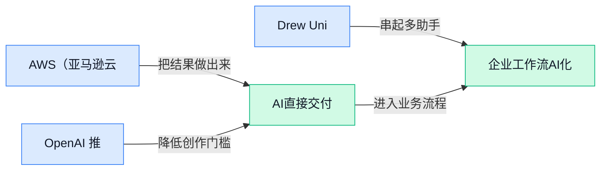

> AI 早报 · 每日早读 · 全网深度聚合

## **今日摘要**

```
Sony（索尼音乐）和 Warner（华纳音乐）起诉 Anthropic，AI 版权战升级
Financial Times（金融时报）称科技巨头持股AI公司收益达1600亿美元
OpenAI 青少年版 ChatGPT 登场，Cursor（AI代码编辑器）开放插件生态
```

### 🔵 产品与功能更新

1. **AWS（亚马逊云服务）GovCloud（美国版政府云）新增多种 AI（人工智能）模型可选。**  
AWS（亚马逊云服务）在 GovCloud（美国版政府云）里增加了多个 **AI（人工智能）模型** 选项，重点是让对 **安全** 和 **合规** 要求更高的客户，也能按任务挑模型用。[政府云更新说明(briefing)](https://news.google.com/rss/articles/CBMizgFBVV95cUxPVHdlSmRVZFRyMWpBajFQSTVlN042dGxDd0VwTmRxaGhjTHpIWno5Tkt4eFo2b1RNZklEYVprTHc2WkRCSFJUVVk4LTdBUmdBZ3pqd0txemNDcHMyajV6SXVrdlROcjFjajd6LURucV81VVlmQ1kzQVcwTzE4MjdldG9ieDJwMUpMOXdnQ2RKb2xvYUVaVjRNbFVUSGpTTGc0S0dBT2Y4bS1ock90MjdxQnNZajdoZ0tCbzBPQ1RZUTNsR2RUMjJ0YlVyalVDUQ?oc=5)  
这类变化看起来像“多了几个按钮”，但本质上是把模型选择变成更容易管理的企业能力。🚀 对政府和大型机构来说，价值不只是灵活，更是更容易在受控环境里落地。

2. **OpenAI 推出青少年版 ChatGPT，家长该知道什么。**  
OpenAI 这次把 ChatGPT 的触角继续往青少年场景延伸，报道重点放在家长应该先了解哪些信息。[家长关注报道(briefing)](https://news.google.com/rss/articles/CBMiW0FVX3lxTE96N2V5TmlhOVN5Q1VXZ2F1bmlZMUtRTjdocTAyR0J4NWRqeVJmdFRsUHdjVDFPdEhhX3lvdUpycFp3RXJTcVEyUkJRQ3dXRkRObWMwbjFMM09QSTTSAWBBVV95cUxPU0tTekNvX0g5aTJuWk01MUpxZm95RlQzcUxrMWxKelFrM0lCbmd3M0VEbGc5Q1E0MExvd19GNVZDSGFuVFlPS2FYT0M1a1h6NlpMYW5kUDFrY3RmNjVodVk?oc=5)  
这说明 **AI（人工智能）助手** 正从办公室和个人使用，慢慢走进家庭和校园。🚀 对学校、家长和平台来说，接下来更关键的不是“会不会用”，而是“怎么用得更稳妥”。

3. **Drew University（德鲁大学）要办 AI（人工智能）驱动的 1 到 8 年级私立学校。**  
Drew University（德鲁大学）计划开办一所面向 1 到 8 年级的私立学校，并把 **AI（人工智能）** 直接写进办学定位里。[学校开办报道(briefing)](https://news.google.com/rss/articles/CBMiyAFBVV95cUxPYU93SVVYZWJqT2k1OWhKS3FQdXItWUhIQ3dWS2x1N1BnaThxQk9WZUE4ZV9RMDVFWlZEMFBBVWdpN2p6SUZLSXNFeU12c2JnYTJrWnltZWVIQnNVZmtlR1Z6am9XYnd6dE9tUWUtQnpDam80ME9KSm5JVGpZYnNRNERoQnQ3WURGZ2toVE1GMF92OGZXX2xvR0JiQVo0aXNmMDRRYmJaZnhBeDZqdlNkX09YOXdqdzBaUjV6Qmd0YVlfR2Z4N25uSg?oc=5)  
这不是单纯加一个教学工具，而是把人工智能当成学校特色来设计。🚀 对教育行业和家长来说，这类动作往往意味着课程、招生和日常管理都会一起被重新包装。

### 🟢 前沿研究

1. **TTPO（测试时策略优化，一种让模型在回答当下再优化决策的思路）聚焦“边用边调”的模型能力。**  
这篇论文关注 **Test-Time Policy Optimization（测试时策略优化，模型不是只靠训练阶段学到的规则，而是在实际解题/回答时继续调整策略）** 🚀。从题目看，它把重点放在“测试时”这个阶段，也就是用户真正使用模型、模型现场做决策的时候。对业务同事来说，这类研究的潜在意义是：未来 AI 可能不只是“照本宣科”，而是能在任务过程中更灵活地修正自己的做法 💡。[论文页面(briefing)](https://huggingface.co/papers/2608.27448)

2. **Self-OPD（无教师在策略蒸馏，一种让模型自己压缩学习经验的方法）探索更省依赖的生成模型训练。**  
这篇论文讨论 **On-Policy Distillation（在策略蒸馏，让模型根据自己当前产生的结果来学习，而不是只模仿外部老师）**，并强调 **without Teacher（不依赖教师模型，不需要另一个更强模型来带着学）**。它面向的是 **Flow Matching Models（流匹配模型，一类用于生成图片、音频等内容的生成模型）**，核心看点是如何让模型在没有“老师”的情况下完成自我改进 🚀。如果这条路线走通，可能意味着部分生成式 AI 的训练流程会更轻量、更少依赖昂贵的大模型老师。[论文页面(briefing)](https://huggingface.co/papers/2608.26872)

3. **UrbanGround（真实城市尺度空间智能研究）把 AI 从“看见局部”推向“理解城市”。**  
这篇论文题目里的 **Local Perception（局部感知，像人只看到眼前街道、路口、建筑）** 和 **Spatial Agency（空间行动能力，能在空间里判断位置、规划行动）** 是重点。它关注真实尺度城市中的 AI 能力，而不是只在小地图或简化场景里做实验 🚀。通俗说，这类研究可能帮助 AI 更好理解“我在哪里、周围有什么、下一步该往哪走”，对机器人、城市导航、虚拟环境等方向都有参考价值 💡。[论文页面(briefing)](https://huggingface.co/papers/2608.27456)

4. **GameWAM（面向电子游戏的世界动作模型）研究 AI 如何理解游戏里的“行动后果”。**  
这篇论文提出 **World Action Model（世界动作模型，用来预测“做一个动作后，环境会怎样变化”的模型）**，场景放在电子游戏中 🎮。电子游戏天然有清晰规则、可重复操作和可观察反馈，因此常被用来训练或评估 AI 对世界变化的理解。对非技术同事来说，可以把它理解成：AI 不只是看画面，而是在学习“按下这个按钮之后，游戏世界会发生什么”。[论文页面(briefing)](https://huggingface.co/papers/2608.26200)

5. **AI agents（AI 智能体，能自己拆任务和执行步骤的 AI）被指出缺乏时间感。**  
这篇报道的核心观点很直接：**AI agents（AI 智能体，能代替人完成多步骤任务的 AI）** 没有真正的时间感，而且它们自己也意识不到这一点 ⏰。这对很多自动化场景很关键，因为现实工作里“多久以后”“先后顺序”“等待时机”经常决定任务成败。换句话说，AI 能写计划不代表它真的理解时间流逝，这提醒我们在使用智能体做长期任务时仍要保留检查和约束机制 💡。[完整报道(briefing)](https://the-decoder.com/ai-agents-have-no-sense-of-time-and-are-not-aware-of-it/)

6. **Agentic Game Development（智能体式游戏开发）被用作可验证轨迹数据引擎。**  
这篇论文把 **Agentic Game Development（智能体式游戏开发，让 AI 像开发者一样参与生成和推进游戏过程）** 和 **Trajectory Data（轨迹数据，记录每一步操作、状态变化和结果的数据）** 结合起来。题目强调 **Verifiable（可验证，结果能被检查是否正确）**，说明它关注的不只是生成数据，还包括这些数据是否可靠 ✅。它的目标指向 **World Models（世界模型，让 AI 学会预测环境如何变化的模型）** 的扩展训练，也就是让 AI 通过更可检查的过程理解复杂环境。[论文页面(briefing)](https://huggingface.co/papers/2608.25518)

7. **PAWBench（概率对齐世界建模评测）追问 AI 离可靠预测世界还有多远。**  
这篇论文从标题看提出了 **PAWBench（概率对齐世界建模评测，用来衡量模型预测世界变化时是否符合概率规律的测试集/基准）**。其中 **Probabilistically Aligned（概率对齐，模型不只给一个答案，还要让不确定性判断更接近真实情况）** 是关键概念。简单说，现实世界很多事不是“必然发生”，而是“有多大可能发生”，这类评测就是在考 AI 是否懂这种不确定性 🎯。[论文页面(briefing)](https://huggingface.co/papers/2608.27345)

8. **ACE Lens（ACE 视角，一种分析智能体数据质量的框架）讨论什么才是好智能体数据。**  
这篇论文关注 **Agentic Data（智能体数据，用来训练 AI 自主拆解任务、调用工具、完成步骤的数据）** 的质量问题。题目里的 **LLM Agents（大语言模型智能体，基于大模型、能执行多步骤任务的 AI）** 指向一个现实痛点：不是数据越多越好，关键是数据能不能教会 AI 更稳定地做事 💡。它提出用 **ACE Lens（ACE 视角，一种从特定维度审视数据生成质量的分析框架）** 来看数据生成，帮助研究者判断“什么样的数据更适合训练智能体”。[论文页面(briefing)](https://huggingface.co/papers/2608.27260)

### 🟡 行业展望与社会影响

1. **Caterpillar（卡特彼勒，全球工程机械巨头）把矿山自动化经验带进 AI deployment（AI 落地部署，让模型真正进入业务现场）。**  
卡特彼勒过去几十年一直在偏远矿区部署**自动化机器**，现在准备把这套经验迁移到**人工智能（AI，用机器模拟理解、生成和决策能力）落地**上 🚜。这件事的看点不只是“造更聪明的机器”，而是把矿山这种高风险、远距离、强现场管理的经验，用到企业真正使用 AI 的过程中。对行业来说，AI 竞争可能会从“谁模型更强”逐步转向“谁更会把 AI 安全、稳定地放进复杂现场”💡。[卡特彼勒报道(briefing)](https://techcrunch.com/2026/08/30/caterpillar-is-bringing-to-ai-deployment-what-it-learned-from-automating-mining/)


2. **Bloomberg（彭博社，国际财经媒体）关注“Don’t Ask, Don’t Tell AI Economy（不问不说的 AI 经济）”。**  
这篇文章把正在形成的 AI 使用现象概括成一种“**不问不说**”的经济状态：很多人可能在工作中用了 AI，但组织、同事或客户并不一定清楚具体怎么用 🤔。这里的**AI 经济（围绕 AI 工具、服务、效率和岗位变化形成的新经济活动）**，不只是技术话题，也牵涉管理透明度、绩效评估和信任边界。对公司来说，真正的挑战可能不是“要不要用 AI”，而是如何制定清晰规则，让效率提升和责任归属都说得明白。[彭博观点文章(briefing)](https://news.google.com/rss/articles/CBMiogFBVV95cUxOcjMtS1FKSmRMamtFYmhxc2lGT1hueGs0aWw5WHFweGEzXzJHNVBmcmVJZ0RXLXdMS0E4WlIyV194YkZrNDh3Z056bWVfMzJfLW0xZDdVTDNabFlkWnpka1lKdTJ0d3ZiTEFNWDVwb3NhYWdBY09TeXZreFhVU25HTTcyZjkzMFB5SXUwWU9leVlUX3lNMjdzYmxoaFZjOThneFE?oc=5)


3. **Sony（索尼音乐，全球大型音乐版权方）和 Warner（华纳音乐，全球大型音乐版权方）起诉 Anthropic，AI 版权战继续升级。**  
索尼音乐和华纳音乐起诉 Anthropic，并称其行为是“史上规模最大、最明目张胆的持续性知识产权盗窃之一”⚖️。这里的**知识产权（作品、音乐、文字等内容的法律权利）**问题，核心在于 AI 公司训练和提供服务时，是否使用了受保护内容，以及是否获得授权。对普通企业也有提醒：使用 AI 生成文案、音乐或素材时，不能只看“能不能生成”，还要关注内容来源与版权风险。[音乐版权诉讼(briefing)](https://the-decoder.com/sony-and-warner-sue-anthropic-over-one-of-the-largest-and-most-blatant-ongoing-thefts-of-intellectual-property-in-history/)

4. **The Economist（《经济学人》，国际商业与经济媒体）追问：除了程序员，还有谁会像他们一样高频使用 AI？**  
《经济学人》提出一个很现实的问题：目前**程序员（写软件代码、搭建系统的人）**可能是使用 AI 最深入的一群人，但其他岗位会不会跟上？这背后涉及**工作流（把一项工作从开始到完成的步骤安排）**是否适合被 AI 嵌入：写代码天然可拆解、可测试，所以更容易让 AI 参与。对运营、财务、人事、行政等岗位来说，AI 的普及速度可能取决于工具是否真正贴合日常流程，而不是模型参数多漂亮 ✨。[经济学人报道(briefing)](https://news.google.com/rss/articles/CBMiiwFBVV95cUxPLUdCc0ZudnpKQzdJY0h6M1lma1RicVJWOTYyaGdtb1JmTjJGZ0lsVEJSbXN6MVM0WV9aMldSY1JYU09GZkl1dzJFQWthd2dhZW9KZmVtUlpvYWhJQkxWWnYwZkV4Qk9pUnlhdXpsMUxYUFZ0MUIzeHBOWjBRQ25mNEdNcWRUdnkweGtJ?oc=5)

5. **Financial Times（《金融时报》，国际财经媒体）称科技巨头从其他 AI 公司持股收益中获利 1600 亿美元。**  
《金融时报》关注到，科技巨头因持有其他 AI 公司股权，获得了约**1600 亿美元**收益 📈。这里的**股权收益（公司持有另一家公司股份后，因估值或价格上涨带来的账面或实际收益）**说明，AI 热潮不只发生在产品和模型层面，也正在深刻影响资本市场。换句话说，AI 产业链的财富流动，可能既来自卖云服务、卖工具，也来自投资布局本身。[金融时报报道(briefing)](https://news.google.com/rss/articles/CBMihAFBVV95cUxPQmhueDJ3VU5EdlhTZW5jMzRkc3hzN2ZFOEoxcGF0MjhtdDJTM0twRWlud05TZGl0N0Rsa2ZzZ3REdlFiZ2FBTEpSQjRnY2ZWcWdIWi1ma3pEVjdfb1VnaFVoeXRYcVh0N2RPaVNkbXdzWkloU1J0X1h2YUdpQVdVYVJVLW8?oc=5)

6. **员工评价显示 AI sentiment（员工对 AI 的情绪与态度）正在转冷。**  
一项基于员工评价的观察显示，职场里对 AI 的情绪正在变得更负面，越来越多员工表达出挫败感 😟。这里的**员工评价（员工在工作平台或评价渠道留下的反馈）**很重要，因为它反映的不是发布会上的愿景，而是工具进入日常工作后的真实摩擦。对企业管理者来说，推广 AI 不能只算节省了多少时间，还要关注员工是否获得培训、是否担心被替代，以及流程是否真的变顺。[员工情绪观察(briefing)](https://the-decoder.com/ai-sentiment-is-turning-sour-as-employee-reviews-reveal-growing-frustration-across-the-workforce/)

7. **Gates Notes（比尔·盖茨个人博客）提醒：动荡 AI 时代已到，眼下选择很关键。**  
Gates Notes 文章强调，**AI 时代（人工智能深度影响工作、教育、医疗等领域的阶段）**已经进入更动荡的时期，而现在做出的选择会非常重要 🧭。这类判断关注的不是某一个工具更新，而是 AI 对社会结构、行业规则和个人能力的长期影响。对组织来说，这意味着不能只追逐短期效率，更要提前思考治理、教育和责任边界这些“慢变量”。[盖茨观点文章(briefing)](https://news.google.com/rss/articles/CBMif0FVX3lxTE5vNHRZblJwZHNZZEZfZ285LUdncWl0YUk0UHVfTDM1b05YSU9rVHRhYUpkQ1VwV1RJaXZ4SzZwV2dBd2ZYeEZtbUpGNkpDdng5WjRTa28yOVdIM3drTERSVVVoeWI0WnpWT3dQbGVQcVhvdEZIZE1oaTB4cHdRb0E?oc=5)

### 🟣 开源TOP项目

1. **OpenMAIC（一键开启多智能体互动课堂的开源项目）主打沉浸式学习体验。**  
OpenMAIC 把 **Multi-Agent（多智能体，多个 AI 角色分工协作）** 用在课堂场景里，目标是让用户“一键”进入更有互动感的学习环境 🚀。它强调 **Interactive Classroom（互动课堂，不只是单向听讲，而是能与多个角色交流）**，适合关注 AI 教育、培训产品和学习体验设计的同事参考。简单说，它不是只给你一个聊天窗口，而是尝试把课堂里的不同角色“搬进”AI 系统里 💡。[GitHub 项目页(briefing)](https://github.com/THU-MAIC/OpenMAIC)


2. **JiuwenSwarm（基于 openJiuwen 的 AI Agent 助手）把大模型能力接入日常通讯应用。**  
JiuwenSwarm 是一个智能 **AI Agent（AI 代理，能按目标自动帮人处理任务的助手）**，建立在 **openJiuwen（九问相关开源基础项目）** 之上。它的重点是把**大语言模型**能力延伸到用户每天使用的各种通讯应用里，让 AI 不只停留在单独网页或软件中，而是更贴近日常工作流 📱。对运营、行政、业务同事来说，这类项目的趋势很明确：AI 助手正在从“你去找它”变成“它出现在你常用的沟通场景里” (๑•̀ㅂ•́)و。[GitHub 仓库页(briefing)](https://github.com/openJiuwen-ai/jiuwenswarm)


3. **Cursor plugins（Cursor 插件规范与官方插件）开放插件生态入口。**  
这个仓库提供 **plugin specification（插件规范，告诉开发者插件该按什么格式和规则接入）** 以及 Cursor 的官方插件。**插件**可以理解为给软件加“小工具包”，让原本的编码助手扩展出更多能力或适配更多场景 🧩。对非技术同事也有启发：当一个 AI 工具开始建设插件体系，往往意味着它不只想做单点功能，而是想变成一个可扩展的平台。[Cursor 插件仓库(briefing)](https://github.com/cursor/plugins)


4. **awesome-dsh-plugin（DeepSeek Harness 插件精选列表）整理 DeepSeek 工具生态。**  
这个项目是 **DeepSeek Harness（简称 dsh，一个围绕 DeepSeek 使用场景的工具框架）** 的插件精选列表，作用类似“资源导航站” 🗂️。其中 **awesome list（精选清单，社区常用来汇总优质工具和资料的列表形式）** 能帮助用户更快找到可用插件，而不是在零散仓库里到处翻。对关注开源生态的人来说，这类清单虽然不是模型本身，但常常能反映某个工具链是否开始聚集开发者和使用者 💡。[插件精选列表(briefing)](https://github.com/awesome-dsh-plugin/awesome-dsh-plugin)

5. **PRAXIST（可执行研究的自主研究系统）瞄准可衡量科研流程。**  
PRAXIST 被描述为一个 **Autonomous research system（自主研究系统，能围绕研究目标自动推进部分流程的系统）**，重点是面向“可衡量、可由计算机执行”的研究任务。这里的 **computer-executable research（计算机可执行研究，研究步骤能被程序明确运行和验证）**，可以理解为把研究从“写想法”推进到“能跑起来、能检查结果”的形式 🔬。这类项目对科研、数据分析和自动化实验方向有参考意义：AI 不只是辅助写报告，也在尝试参与更结构化的研究流程。[GitHub 项目页(briefing)](https://github.com/sapientinc/PRAXIST)

6. **FreeToken（把数据中心级模型服务搬到个人电脑的开源项目）主打本地高效运行大模型。**  
FreeToken 的目标是把 **datacenter-scale model serving（数据中心级模型服务，原本需要大型服务器来承载大模型运行）** 带到桌面电脑上，让用户能在本地快速、高效运行大型模型 ⚡。这里的 **model serving（模型服务，让训练好的 AI 模型稳定接收请求并输出结果）**，可以类比成“给模型开一个长期在线的服务窗口”。如果这个方向持续成熟，个人或小团队使用大模型的门槛会更低，不一定每次都依赖远程服务器或云端接口。[FreeToken 仓库(briefing)](https://github.com/FlashML-org/FreeToken)

### 🔴 社媒分享

1. **Agency（主动行动能力）与 Agents（能自主执行任务的 AI 代理）正在决定 AI 下一步。**  
这篇文章把焦点从“AI 能不能更聪明”转向“谁在主动推动事情发生” 🚀。作者强调，**Agency（主动行动能力，指不等别人下指令、愿意尝试和推进事情的能力）**会越来越影响 AI 的发展方向：是人类主动实验、掌握节奏，还是把更多决策交给 **Agents（AI 代理，能按目标自动执行一连串任务的 AI 系统）**。这对普通职场人也很关键：未来差距可能不只在“会不会用 AI”，而在于谁更愿意带着问题去试、去改、去落地 💡。[AI 主动性思考(briefing)](https://www.oneusefulthing.org/p/agency-and-agents)


2. **ChatGPT Work（面向复杂工作的 ChatGPT 产品形态）到底强在哪、乱在哪。**  
Simon Willison 这篇分享梳理了 OpenAI 在 7 月 9 日发布的 **ChatGPT Work（面向更复杂工作场景的 ChatGPT 产品形态）**，并指出它之后一直在快速迭代 ⚡。他的核心判断很直接：这个产品“非常强大”，但也“非常令人困惑”，说明 OpenAI 正在把 ChatGPT 从聊天工具推向更复杂的工作系统。对业务、运营、行政同事来说，重点不是记住功能名，而是意识到 **Work（工作版产品形态，通常意味着更贴近企业任务、流程和资料处理）** 可能会改变日常协作方式。[ChatGPT Work 解读(briefing)](https://simonwillison.net/2026/Aug/30/understanding-chatgpt-work/)


---



### 📊 行业洞察（今日 4 条）

1. Sony Music、Warner Music 起诉 Anthropic，称其用受版权歌曲训练 Claude。  
   【洞察】这表明内容生成赛道已进入版权硬约束期，机会在合规素材工具，风险是训练和商用成本上升。

2. AWS GovCloud（政府云）新增多种 AI 模型可选。  
   【洞察】这说明高合规客户开始追求按任务选模，机会是企业级入口，风险是接入和治理复杂度提高。

3. OpenAI 推出青少年版 ChatGPT，重点面向家长了解。  
   【洞察】这表示 AI 正从办公延伸到家庭与校园，机会是教育场景扩张，风险是边界与使用责任更敏感。

4. 研究称 Claude Code 和 Codex 这类 AI agents（AI 代理）没有时间感。  
   【洞察】这说明长任务自治能力仍不稳，机会是更强自动化，风险是对进度与先后关系判断失真。

### 💭 对我们的启发（今日 3 条）

1. 参考 AWS GovCloud 多模型选择，Agent 编排平台可做按场景选模型与权限隔离，机会是更稳，风险是配置更复杂。

2. 从 ChatGPT Work 和青少年版看，Agent 编排平台要强化角色分级与结果解释，机会是更易上手，风险是流程变重。

3. 结合 Sony、Warner 诉 Anthropic，视频剪辑软件要先管素材授权再做自动成片，机会是商用更安全，风险是版权争议。


---

> 本周周报：[第36周综合分析](https://zhuxinfei.github.io/ai-daily-site/blog/weekly/2026-w36/)
