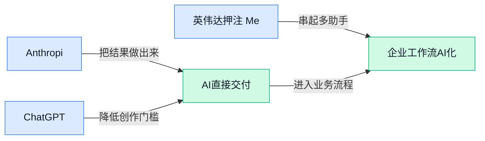

> AI 早报 · 每日早读 · 全网深度聚合

## **今日摘要**

```
ChatGPT 被欧盟按超大型搜索引擎监管，广告年化收入已达10亿美元
英伟达押注 MediaTek（芯片设计公司），硬刚科技巨头自研 AI 芯片
Hugging Face（模型社区）攻击比预想更重，Anthropic 恢复外测
```

### 🔵 产品与功能更新

1. **Anthropic 将恢复 AI 模型外部测试。**  
Anthropic 计划在发生**安全事件**后，恢复让外部人员参与 AI 模型测试的流程 🔍。这里的**外部测试**（让公司以外的研究者或合作方提前试用模型、帮助发现风险）通常是新模型发布前的重要安全环节；**安全事件**（可能影响系统、数据或测试流程可信度的问题）则会让企业重新审视开放节奏。对普通用户和企业客户来说，这意味着 Anthropic 仍在推进模型迭代，但会把**发布前风控**放在更显眼的位置 💡。[路透报道摘要(briefing)](https://news.google.com/rss/articles/CBMiuwFBVV95cUxQV3Y5eFQ4dWtTbDlKWE1yeXpuR25wNXBRMzVpeTJMM01vdzBiREpsR1IxSTVTWTU0YUxTNzZyZjBsQUVfS1I2bzJQRWtUcGVLaUJKbmxhLUJhQ2RGaWdjN3c4ZjZvcWVQdExIbWlHb3hpQ3lXXzlRcUZhNlVkLVBRMlFpRWFySk1XVzlSbmxNNkx4bTZhMXZMR3FpTVU4bTg2dzQtVG14b3FNZXZvcVM1QWV2Yk5BMllIMkxV?oc=5)

### 🟢 前沿研究

1. **Google Research（Google 的研究团队）提出 Earth AI（地球人工智能）驱动的全球模型自动化引擎。**  
这条来自 Google Research 的研究动态，核心关键词是 **Planetary prediction engine（行星级预测引擎，面向全球尺度环境/地球系统建模的预测系统）** 🌍。标题显示，它希望用 **Earth AI（把人工智能用于地球系统建模与预测）** 来自动化 global models（全球模型，用来模拟气候、环境等大范围系统变化的模型）。对非技术同事来说，可以把它理解成：让 AI 帮科学家更高效地搭建和运行“地球级沙盘”，减少纯手工调模型的复杂度 🚀。[Google 研究动态(briefing)](https://news.google.com/rss/articles/CBMimwFBVV95cUxPdEF4M0hBeGhzT29JVWpXT2FkekJmYjhhVXQ1Q1VHNzZ4YjVDaFhjQktUTVBXVHNmZWNDNjFqTTRSMW05Nk9mR0RLRzZRNTBFUllMTWE2bzNuRDdpZFkxODIwRFUtWm1wcWdNdTlmejdFUXFmVk1fZFBFVXFxN0FaSHl4ZTZveTNrU3JDcFo3em9JZmRSR1VoUHZNUQ?oc=5)

2. **Acquire, Repair, Preserve（面向小模型对话游戏智能体的后训练方案）强调“学会、修复、保留”三步走。**  
这篇论文标题里的 **small-model dialogue game agents（小模型对话游戏智能体，能在文字互动游戏里对话和行动的轻量 AI）**，关注的是不靠超大模型也能提升任务表现 🎮。它提出的 **post-training（后训练，模型基础训练完成后再针对具体能力补课）** 思路，被概括成 acquire（获得能力）、repair（修补问题）、preserve（保留已有能力）。这对产品侧的启发是：未来一些低成本、小体量 AI，也可能通过更精细的训练流程变得更实用，而不是一味“堆大模型” 💡。[论文页面(briefing)](https://huggingface.co/papers/2608.28458)

3. **Fast Weight Attention（快速权重注意力，一种帮助模型持续学习的机制）探索模型如何边学边不忘。**  
这篇论文指向 **continual learning（持续学习，让模型不断学习新知识，同时尽量不忘旧知识）** 这个老大难问题 🧠。标题中的 **Fast Weight Attention（快速权重注意力，可理解为让模型临时调整内部记忆重点的机制）**，看起来是在为持续学习提供新的结构思路。普通人可以类比成：员工学新流程时，最好不要把旧流程全忘了；AI 也是一样，需要在“吸收新内容”和“保住旧能力”之间找平衡 ⚖️。[论文页面(briefing)](https://huggingface.co/papers/2608.27763)

4. **Rubric-to-Code Credit Assignment（把评分标准转成代码来分配奖励）试图让强化学习反馈更可执行。**  
这篇论文聚焦 **reinforcement learning（强化学习，让 AI 通过奖励和惩罚学会更好决策）** 里的 credit assignment（奖励归因，判断一连串动作里到底哪一步该被表扬或批评）问题 🎯。标题里的 **Rubric-to-Code（评分标准转代码，把文字规则变成可执行判断逻辑）**，意味着研究者想让“怎么打分”不只停留在描述层面，而是能更清楚地落到程序执行。对业务同事来说，这像是把绩效评分表变成自动判分规则：标准越清晰，AI 学到的行为越可能稳定 💡。[论文页面(briefing)](https://huggingface.co/papers/2608.27906)

5. **LoopArena（用于评测模型控制循环工程能力的基准）把大模型放进运行时控制场景里考验。**  
这篇论文标题中的 **benchmarking（基准评测，用统一题目和规则比较模型能力）**，说明它更像是一套“考试系统” 🧪。它考察的是 models as runtime controllers（把模型当作运行时控制器，让 AI 在程序运行过程中做调度或决策），以及 **loop engineering（循环工程，围绕程序重复执行步骤进行优化和控制）**。简单说，不只是问 AI 会不会写答案，而是看它能不能在复杂流程中持续观察、判断、控制，像一个更主动的“流程管理员” 🤖。[论文页面(briefing)](https://huggingface.co/papers/2608.28281)

6. **Video Generative Models as Geometry Learner（把视频生成模型当作几何学习器）关注 AI 是否能从视频里理解空间。**  
这篇论文标题很有意思：它不只把 **video generative models（视频生成模型，用文字或图像生成视频的 AI）** 当作内容创作工具，而是当作 **geometry learner（几何学习器，学习物体位置、形状和空间关系的模型）** 来研究 📹。这意味着研究重点可能从“生成的视频好不好看”，转向“模型是否真的理解三维空间和运动关系”。对设计、内容和产品团队来说，这类研究如果继续发展，可能会让视频生成更懂镜头、结构和空间逻辑，而不只是拼贴画面 ✨。[论文页面(briefing)](https://huggingface.co/papers/2608.28549)

7. **EvoUndo（带可恢复约束的智能体自我进化框架）让大语言模型智能体“会改也能撤”。**  
这篇论文标题里的 **LLM Agent harnesses（大语言模型智能体运行框架，负责把模型、工具和任务流程组织起来的外壳系统）**，是让 AI 能调用工具、执行任务的重要底座 🛠️。**Recoverability-Constrained Self-Evolution（带可恢复约束的自我进化，允许系统优化自己但必须能回退）** 的关键词非常务实：AI 可以尝试改进自己，但不能一改坏就无法恢复。对企业应用来说，这个方向像是在给自动化系统加“撤销键”，让探索和安全之间更有边界感 🚦。[论文页面(briefing)](https://huggingface.co/papers/2608.28363)

8. **Beyond Data Scaling（超越单纯堆数据）转向视觉-语言-动作模型的表征中心持续预训练。**  
这篇论文把重点放在 **Vision-Language-Action Models（视觉-语言-动作模型，能看图像、理解文字并决定动作的 AI）** 上 🤖。标题中的 **continued pre-training（持续预训练，在已有模型基础上继续用数据训练以增强能力）** 和 **representation-centric（以表征为中心，关注模型内部如何理解和组织信息）**，说明研究不只是扩大数据量，而是更在意模型“怎么理解世界”。这对机器人、自动化操作、复杂界面助手等方向都有启发：未来模型能力提升，可能不只是喂更多数据，还要让它形成更好的内部认知结构 💡。[论文页面(briefing)](https://huggingface.co/papers/2608.27550)

### 🟡 行业展望与社会影响

1. **ChatGPT 被欧盟按“超大型搜索引擎”加强监管。**  
ChatGPT 现在在欧盟面临更严格监管，原因是它被纳入 **very large search engine（超大型搜索引擎，用户规模大到会影响公共信息获取的在线服务）** 的监管视角 🚦。这意味着 AI 助手不再只是“聊天工具”，而越来越像入口级的信息基础设施，监管部门会更关注它如何呈现答案、影响用户判断。对企业来说，未来使用 AI 做搜索、客服、内容分发时，**合规透明度**会变得更重要。[欧盟监管报道(briefing)](https://the-decoder.com/chatgpt-now-faces-stricter-eu-oversight-as-a-very-large-search-engine/)


2. **英伟达押注 MediaTek（联发科，台湾芯片设计公司）应对科技巨头自研 AI 芯片。**  
英伟达计划向 MediaTek 投资 **35 亿美元**，强化 AI 芯片合作 🤝。这笔交易透露出一个信号：当大型科技公司开始自研 **AI chip（AI 芯片，专门加速 AI 训练和推理的处理器）** 时，英伟达也在通过生态合作保持自己在 **AI infrastructure（AI 基础设施，支撑模型训练、部署和运行的硬件与软件体系）** 里的关键位置。简单说，AI 算力竞争不只是“谁芯片更强”，也是“谁能把产业链绑得更紧”。[投资合作报道(briefing)](https://techcrunch.com/2026/08/31/nvidias-3-5b-mediatek-bet-reveals-its-plan-for-tackling-big-techs-ai-chip-buildout/)


3. **Instagram（一款图片和短视频社交平台）开始限制未披露 AI 虚拟账号。**  
Instagram 承认，用户经常分不清 **AI profiles（AI 虚拟账号，由 AI 生成头像、内容或人设的社交账号）** 和真实用户 👀。在外界对 **AI influencers（AI 网红，用虚拟人设经营粉丝和商业影响力的账号）** 不满增加后，Instagram 开始限制未披露 AI 身份账号的传播范围。这个变化说明，平台正在把“是否明确告诉用户这是 AI”变成重要规则，未来品牌营销、达人合作也要更重视身份披露。[用户识别报道(briefing)](https://the-decoder.com/instagram-admits-users-often-cant-tell-ai-profiles-from-real-people/) [平台限制报道(briefing)](https://techcrunch.com/2026/08/31/instagram-puts-new-limits-on-undisclosed-ai-profiles/)


4. **OpenAI 等实验室大量采购 Mac mini（苹果小型台式电脑）训练“会用电脑”的 Agent。**  
OpenAI 和竞争对手 AI 实验室正在购买数以万计的 **Mac mini（苹果小型台式电脑，常用于批量搭建测试环境）**，用于训练 **computer-use agents（会操作电脑的 AI 助手，能像人一样点击、输入、使用软件）** 🖥️。这类 Agent 的目标不是只回答问题，而是学会在真实电脑界面里完成任务，比如打开应用、处理文件或操作网页。它反映出 AI 行业正在从“会说”走向“会做”，未来办公自动化可能会更贴近日常电脑操作流程。[采购训练报道(briefing)](https://the-decoder.com/openai-and-rival-ai-labs-are-buying-tens-of-thousands-of-mac-minis-to-train-computer-use-agents/)

5. **OpenAI 称 ChatGPT 广告业务年化收入达到 10 亿美元。**  
OpenAI 表示，ChatGPT 的 **ad business（广告业务，通过展示或分发商业信息获得收入的模式）** 已达到 **10 亿美元 annual run rate（年化收入规模，把当前收入速度折算成一整年的金额）** 💰。这说明 ChatGPT 正在从订阅和 API 之外，探索更大众互联网化的商业模式。对行业的影响很直接：当 AI 助手成为信息入口，广告、推荐和用户信任之间的平衡会变得更敏感。[广告业务报道(briefing)](https://the-decoder.com/openai-says-its-chatgpt-ad-business-hits-a-1-billion-annual-run-rate/)

6. **Anthropic 强化 alignment（AI 对齐，让模型行为更符合人类意图）与安全工作。**  
Anthropic 发布了关于改进 **alignment（AI 对齐，让模型更少偏离人类期望和安全边界）** 与 **security（安全防护，减少模型或系统被滥用、攻击和泄露风险）** 的更新 🔐。虽然原文标题没有展开细节，但它指向 AI 公司越来越重视的核心问题：模型能力越强，越需要同步提升安全治理。对企业用户来说，这类投入关系到 AI 是否能更稳妥地进入客服、办公、研发等真实业务场景。[官方安全更新(briefing)](https://www.anthropic.com/news/improving-alignment-security-efforts/)

### 🟣 开源TOP项目

### 🔴 社媒分享

1. **ChatGPT Work Tool and Skill Reference（ChatGPT 工作工具与技能参考表）被整理成可查资料。**  
这条分享指向一个专门整理 **ChatGPT 工作工具与技能参考** 的页面，适合把 ChatGPT 当日常办公助手的人收藏 🧰。其中的 Work Tool（工作工具，指 ChatGPT 在特定工作场景里可调用的能力）和 Skill Reference（技能参考表，像说明书一样列出能做什么）有助于快速判断“这个任务能不能交给 AI”。对运营、行政、设计同事来说，它的价值在于少试错：先看能力边界，再设计 prompt（给 AI 的任务指令）会更省时间。[工具参考页(briefing)](https://codex-tool-reference.simonw.chatgpt.site/)


2. **Meta 内容监管和解案，再次暴露科技治理的两难。**  
Stratechery 这篇文章认为，Meta 的和解对各方来说都有现实合理性，但也让一个更大的问题浮出水面：技术平台的内容监管很难找到“完全舒服”的方案 ⚖️。这里的 content regulation（内容监管，指平台如何处理违规、争议或有害信息）不仅是法律问题，也会影响产品体验、用户信任和商业风险。文章还把视角扩展到 Big Tech（大型科技公司群体，通常指掌握海量用户和平台规则的公司），提醒大家监管不是简单“管或不管”，而是规则、执行和社会期待之间的拉扯。[深度评论文章(briefing)](https://stratechery.com/2026/meta-settles-a-framework-for-regulating-content-the-rest-of-big-tech/)


3. **Hugging Face（全球最大 AI 模型共享社区）攻击事件被指比想象更严重。**  
Platformer 的这篇专栏把焦点放在 Hugging Face 遭遇的攻击事件上，并直接点出“情况比我们以为的更糟” 🚨。Hugging Face（全球最大 AI 模型共享社区，很多 AI 团队会在上面下载、发布模型）一旦出现安全问题，影响不只是某个网站，而可能波及依赖它的研究者、创业团队和企业项目。对非技术同事来说，可以把它理解成“AI 行业的模型仓库”出了安全警报：如果基础平台不稳，很多上层应用也会跟着紧张起来。[事件专栏报道(briefing)](https://www.platformer.news/openai-huggingface-metr-report-slowdown/)

4. **Import AI 471（AI 行业观察通讯）关注 Hugging Face、太空采矿与 Five Eyes（五眼情报联盟）AI 动向。**  
Jack Clark 的 Import AI 471（AI 行业观察通讯，定期整理 AI 研究、产业和政策信号）这一期覆盖了几个跨度很大的议题：为什么 Hugging Face 让作者担忧、space mining（太空采矿，指开发小行星等太空资源的设想），以及 Five Eyes（五眼情报联盟，由美英加澳新组成的情报合作机制）对 AI 的关注 🌍。这种内容的价值在于把技术、产业和地缘政策放在同一张图里看，而不是只盯着模型参数或产品更新。对业务同事来说，它提醒我们：AI 越往前走，越会和安全、资源、国际规则这些“非技术因素”绑在一起。[行业观察通讯(briefing)](https://jack-clark.net/2026/08/31/import-ai-471-why-hugging-face-worries-me-space-mining-five-eyes-on-ai/)

---



### 📊 行业洞察（今日 4 条）

1. Anthropic 将恢复 AI 模型外部测试（外部人员提前试用找风险）
  【洞察】判断是谨慎重启开放流程，因为安全事件后仍需借外部视角补足风控盲区。
2. Google Research 提出 Earth AI（地球人工智能）全球模型引擎
  【洞察】判断科研 AI 正走向复杂系统建模，因为全球环境预测依赖跨学科数据理解。
3. OpenAI 称 ChatGPT 广告业务年化收入达 10 亿美元
  【洞察】判断 AI 助手商业化加速，因为信息入口价值提升，但广告会放大信任风险。
4. Video Generative Models as Geometry Learner 研究视频生成模型空间理解
  【洞察】判断视频 AI 正从画面生成转向结构理解，因为镜头运动需要几何学习器（理解空间关系的模型）。

### 💭 对我们的启发（今日 3 条）

1. Video Generative Models 事件提示，剪辑工具可强化镜头空间理解；机会是自动分镜，风险是误判场景关系。
2. Anthropic 恢复外部测试提示，视频创作智能体需可试用验收；机会是降门槛，风险是错误剪辑影响成片。
3. ChatGPT 广告收入事件提示，内容工具可探索免费层；机会是扩大创作者覆盖，风险是商业内容损害体验。


---

> 本周周报：[第36周综合分析](https://zhuxinfei.github.io/ai-daily-site/blog/weekly/2026-w36/)
