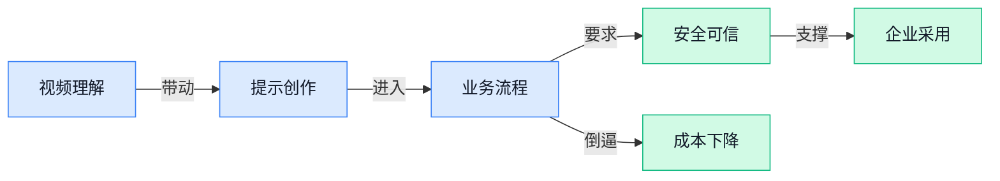

> AI 早报 · 每日早读 · 全网深度聚合

## **今日摘要**

```
Anthropic 发布 Claude Fable 5.1，降成本还要减少误报
OpenAI 让数字病历接入 ChatGPT，Google Pics（作图工具）挑战 Canva
Nori Robotics（人形机器人）1688 美元开卖，双臂移动机器人压价袭来
```

### 🔵 产品与功能更新

1. **Anthropic 发布 Claude Fable 5.1（Claude 系列的新版本更新），主打降成本和减少误报。**  
Anthropic 推出 **Claude Fable 5.1**，外媒重点提到它带来**更低使用成本**和**更少误报**：误报就是系统把正常内容错判成有问题，类似安检把普通物品当成危险品 🚦。这次发布还发生在 Anthropic 与 Lambda（提供云端算力服务的公司，企业可租用其服务器训练或运行 AI）签下 **350 亿美元云服务协议**之后，说明模型升级和算力采购正在同步推进。[新品发布报道(briefing)](https://news.google.com/rss/articles/CBMickFVX3lxTE9zWVpsbEM4NFFQdXhMRS1FUzhqQjdQZ1M1bmtFd1Nac0JjN2ZQbHFVTVRENGxkS0hUazBEN3dUbTRTdm5BdWRrbXVQaUtsZ1lULU10QzhUNWVLNVhJSE1xWkN3OElrVjNDZkhfOFRvTEpxZw?oc=5) 另一篇报道也把焦点放在它能否减少 **AI 仿冒者**问题上，也就是让系统更会识别“像但不真”的内容或行为 💡。[仿冒治理报道(briefing)](https://news.google.com/rss/articles/CBMihgFBVV95cUxQdmM0NUtMT01qek9wZXJOR01wQ0VaazlRZ1dJR2oyV2dMTjRndldSLXVFS1FiVWlaOHd2bjRHeGxnZkdqYWk2V1hXa3c0cFQ1M2FJQlRwVTZLRloxODNtbzlOcGhDZ2d0cVVIVUJmQ0NUcXBTbkx6ZTFPNUx3bHpLNkxCNUZwQQ?oc=5) 对普通企业用户来说，这类更新的意义很直接：如果误判更少、成本更低，AI 工具就更适合进入客服、内容审核、知识管理等高频业务场景 🚀。

### 🟢 前沿研究

1. **归一化低秩适配（Normalized Low-Rank Adaptation，让 LoRA（低秩适配，一种低成本微调模型的技术）训练更稳）**
   这篇论文盯住的是一个很实际的问题：**LoRA** 虽然很常用，但它在训练时怎么保持稳定，还没被讲透。作者想做的是给这种**参数高效微调**（用更少参数调整大模型）加一层更稳的“约束感”，让优化过程不那么容易飘。对需要频繁微调模型、又不想多烧算力的团队来说，这类改进很有现实价值 🚀。原文可看 [原始论文页(briefing)](https://arxiv.org/abs/2608.31036)。

2. **跨语言功能向量（Cross-lingual Functional Vectors，用来在不同语言里抓情绪信号）用于大语言模型情绪检测**
   这项研究关心的是：同样是“开心、愤怒、难过”，模型能不能在不同语言里都认得准。文中提到的 **functional vectors**（功能向量，把模型内部某种能力提炼成可分析的向量表示）是核心工具，目的是帮 **大语言模型** 做更稳的**情绪检测**。如果业务上要做多语言客服、用户反馈分析或内容审核，这类方法就很像给模型补上“跨语言识别情绪”的眼睛 💡。详情见 [论文详情页(briefing)](https://huggingface.co/papers/2608.29613)。

3. **先学会评估再改进：面向自动研究 Agent（自动研究助手，能自己查资料、整理结论的 AI 助手）的评分规则自动生成**
   这篇工作很像给 AI 研究助手先装上一套“打分标准”，再让它去自我优化。所谓 **rubric induction**（评分规则自动生成），就是先把“什么算好答案”结构化出来，避免模型只顾着改进，却不知道朝哪个方向改。对做知识整理、竞品研究、材料汇总的人来说，这意味着未来的研究型 **Agent** 可能不只是会搜，还会先评估自己搜得好不好 ✨。原文可看 [论文详情页(briefing)](https://huggingface.co/papers/2608.31076)。

4. **我们看得见的谎言：VLM（视觉语言模型，能同时看图和读文字的模型）Agent 在具身社交互动中的语言与非语言欺骗**
   这篇论文很有意思，它研究的不只是模型会不会“说谎”，还看它会不会配合**肢体动作**和**语言**一起骗别人。这里的 **具身社交互动**（带有身体动作、面对面参与感的互动场景）让问题更接近真实世界，而不是只在聊天框里比拼。对做陪伴机器人、虚拟人、智能导购的人来说，这类研究提醒我们：AI 的“可信度”不只是嘴上说了什么，还包括动作和表现是否一致 ⚠️。可读 [论文详情页(briefing)](https://huggingface.co/papers/2608.30428)。

5. **不确定性感知的端到端 AI 天气预报：拆分观测数据和模型本身各自的作用**
   这项研究不只是看“能不能预测天气”，还进一步问：预测结果的波动，到底有多少来自**观测数据**，有多少来自**模型**本身。这里的 **端到端**（从输入直接到结果，不靠中间人工拆步骤）和 **不确定性感知**（把“预测有多稳”也一起算进去）是重点。它对天气这种天然有噪声的场景很关键，因为业务上真正有用的往往不是“报一个死数”，而是知道这次预测到底靠不靠谱 🌦️。原文见 [论文详情页(briefing)](https://huggingface.co/papers/2608.30795)。

6. **BenchMIRT：LLM（大语言模型）评测集到底在测什么？**
   这更像一篇“反思型”的研究解读，核心问题不是再造一个新榜单，而是追问现有 **benchmarks（评测集，用来比较模型好坏的考试卷）** 到底测到了什么。对于经常看模型排名的人来说，这很重要，因为榜单高不一定等于真实业务场景也更好。它提醒我们：评测指标如果设计得偏，模型就可能学会“刷题”，而不是真正变强 🧠。可看 [研究解读原文(briefing)](https://huggingface.co/blog/allenai/benchmirt)。

### 🟡 行业展望与社会影响

1. **Anthropic 与客户共建 Enterprise Frontier Safeguards（企业前沿安全防护，用于企业采用尖端模型时管理风险）。**  
Anthropic 发布了面向企业客户的 **Enterprise Frontier Safeguards（企业前沿安全防护）**相关公告，重点是和客户一起打磨更适合企业落地的安全机制 🛡️。这里的 **frontier model（前沿模型，能力很强但也更需要风险管理的大模型）**，对企业来说既是效率工具，也可能带来合规、数据和流程风险。这个方向说明，AI（人工智能）进入企业核心业务后，厂商不只拼模型能力，也要拼**可控、可审计、可放心使用**。[Anthropic 官方公告(briefing)](https://www.anthropic.com/news/enterprise-frontier-safeguards)


2. **OpenAI 支持医疗机构把 EHR（电子健康记录，医院里的数字病历系统）等行业数据接入 ChatGPT。**  
OpenAI 表示，医疗机构现在可以把 **EHR（电子健康记录，类似医院内部的数字病历档案）**以及更多行业数据连接到 ChatGPT 🏥。这意味着 ChatGPT 不只是“通用聊天助手”，也在往更贴近行业工作流的方向走，比如围绕医疗数据提供辅助信息处理。对行业影响在于，未来 AI（人工智能）产品的竞争重点会越来越靠近**专业数据连接能力**，谁能安全接入业务数据，谁就更可能进入真实办公场景。[OpenAI 医疗数据接入(briefing)](https://news.google.com/rss/articles/CBMihwFBVV95cUxQUFZLUDY4VnlYRGpwSVJOUk9LNVI5T29GeE1hdzBNLUxXZTBVbmNXYjRPWWlNWERvSDFwMC1pc2dNaXhXcGtFZ3IyVFlYNy1CLXpWQ3d1cXBDczI2Zm5iajQ5X0JLOUFlbVNqdFRHajN6MUFzYnF2S1lnUEhtbndaVXpuU2d0UVU?oc=5)

3. **Google Pics（谷歌推出的提示词作图设计工具）想用 AI（人工智能）挑战 Canva（在线设计平台）。**  
TechCrunch 报道称，Google 正通过 **Google Pics（谷歌推出的创意设计工具）**进一步进入创意软件市场 🎨。它的思路不是让用户从零开始摆版，而是用**提示词（用自然语言告诉 AI 想要什么）**来完成设计，更像“说出需求，工具帮你做”。这也反映出创意软件正在从“会不会操作工具”转向“能不能清楚表达需求”，对运营、市场、行政同事都很有启发 💡。[TechCrunch 完整报道(briefing)](https://techcrunch.com/2026/09/01/googles-answer-to-canva-is-an-ai-tool-where-you-prompt-instead-of-design/)

### 🟣 开源TOP项目

1. **slotstream（一款让低内存 Mac 跑大模型的开源工具）让 48GB Mac 跑起 Qwen3.8-Flash-Next（千问系列的超大参数语言模型）。**  
这个项目展示了一个很实用的方向：原本需要 **100GB+ 内存 / RAM（电脑临时工作区，越大越能装下大模型）** 的 **125B 参数模型（约 1250 亿个参数，参数越多通常模型越“重”）**，现在可以通过 **slotstream（一款面向 Mac 的本地大模型运行工具）** 在低内存机器上尝试运行 🚀。它用到 **expert-offloading（把部分模型“专家模块”临时挪到硬盘，减轻内存压力）** 和 **SSD-streaming（从固态硬盘持续读取模型数据，像边播边加载视频）**，让 4 位量化版本（把模型数字压缩到更省空间的表示方式）能在 16GB 起步的 Mac 上运行。作者实测在 48GB Mac 上约有 **12 tok/s（每秒生成约 12 个词元，词元可以理解为 AI 输出文字的小单位）**，速度不算飞快，但对本地离线运行超大模型来说很有参考价值 💡。[GitHub 项目仓库(briefing)](https://github.com/carloslfu/slotstream)


### 🔴 社媒分享

1. **Nvidia 财报背后的 Dollars Per Gigawatt（每吉瓦电力能创造多少收入的衡量口径）与 Hugging Face（AI 模型共享社区）讨论。**  
Stratechery 这篇文章把 Nvidia 的财报形容为既“惊人”又“无聊”：惊人的是数字表现，无聊的是它看起来像一台稳定运转的增长机器 💰。作者的核心观察是，Nvidia 做的很多事都在避免行业走向**高度集中**，也就是不希望算力、模型和平台被少数玩家完全锁死。[深度分析文章(briefing)](https://stratechery.com/2026/nvidia-earnings-dollars-per-gigawatt-open-and-hugging-face/) 其中提到的 Hugging Face（AI 模型共享社区）代表更开放的模型生态，而 Dollars Per Gigawatt（用电力规模反推商业产出的指标）则提醒大家：AI 竞争不只看模型，也看**能源和基础设施** ⚡。


2. **小型 Transformer（让 AI 理解上下文的神经网络结构）训练 1.5 小时，表现超过不少 LLM（大语言模型）。**  
这位作者分享了一个很有意思的实验：只训练了一个**小型 Transformer（擅长处理文字序列、理解前后关系的模型结构）**，耗时 1.5 小时，却能打败许多 LLM（大语言模型，比如能聊天、写作、解题的 AI）🚀。[训练实验记录(briefing)](https://mvakde.github.io/blog/44-on-arc-1/) 这类内容之所以值得关注，是因为它挑战了“模型越大越强”的直觉，也让人看到**小模型**在特定任务上的潜力。对业务同事来说，可以理解为：不是每个问题都需要“超级大脑”，有些场景用更小、更便宜的模型也可能够用 💡。


3. **Atlas（面向空间智能的世界模型）发布，World Labs 展示 AI 理解三维世界的新方向。**  
World Labs 介绍了 Atlas，一个用于 **Spatial Intelligence（空间智能，让 AI 理解物体位置、空间关系和环境结构的能力）** 的 World Model（世界模型，让 AI 在脑中形成对现实世界运行方式的内部模拟）🌍。[官方介绍文章(briefing)](https://www.worldlabs.ai/blog/atlas) 这类模型关注的不只是“会说话”，而是让 AI 更好地理解**三维场景**和现实空间。放到产品视角，它可能影响未来的机器人、设计、游戏、影视和虚拟场景生成等方向，因为这些领域都需要 AI 真的“看懂空间”而不是只会描述图片。


4. **Codex 捆绑 LibreOffice（开源办公软件套件），被开发者在缓存目录里发现。**  
Simon Willison 在用 OmniDiskSweeper（Mac 上查看磁盘空间占用的工具）翻看 `~/.cache`（缓存目录，应用临时存放文件的地方）时，发现 OpenAI 的 Codex 桌面应用里带了 LibreOffice（开源办公软件套件，类似免费的文档、表格、演示工具）📂。[开发者观察记录(briefing)](https://simonwillison.net/2026/Sep/1/codex-libreoffice/) 这条分享的重点不在“办公软件本身”，而在于 AI 编程工具可能需要处理更多真实文件格式，比如文档、表格等。对普通用户来说，这意味着 AI 工具正在从“只写代码”走向“能读写更多办公资料”的方向靠近。

5. **Nori Robotics（面向开发者的低成本人形机器人公司）推出 1688 美元双臂移动机器人。**  
Nori Robotics 在 Launch HN（Hacker News 的新品发布区，创业团队常在这里介绍新产品）上介绍了他们的机器人：一台面向 robotics developers（机器人开发者）和 researchers（研究人员）的**双臂移动机器人**，价格为 1688 美元 🤖。[产品官网介绍(briefing)](https://www.norirobotics.com/) 文中提到团队在旧金山制造这款设备，目标是做一个低成本的人形机器人开发平台。这里的 bimanual mobile robot（双臂移动机器人，可以移动并用两只机械臂操作物体）很关键，因为它更接近真实世界里的“动手干活”场景，而不只是固定在桌面上的机械臂。

6. **Hugging Face 推出 @huggingface/kernels（本地 AI 加速计算组件），带来 200 多个 WebGPU（浏览器调用显卡加速的标准）内核。**  
Hugging Face（AI 模型共享社区）发布了 @huggingface/kernels（给本地 AI 运行提供底层加速的小组件集合），主打 200 多个 WebGPU Kernels（基于浏览器显卡加速标准的计算内核，可以让 AI 运算更快）⚙️。[官方技术博客(briefing)](https://huggingface.co/blog/webgpu-kernels) 这件事的关键词是 **Local AI（本地 AI，在自己电脑或浏览器里运行 AI，而不是全部发到云端）**。对普通同事来说，它代表一个趋势：未来部分 AI 功能可能不必每次都联网调用服务器，而是能在本机更快、更私密地完成一部分任务 💡。

---



### 📊 行业洞察（今日 4 条）

1. Google 推出 Gemini（Google 的人工智能模型）视频理解，Google Pics（提示词作图工具）挑战 Canva（在线设计平台）
  【洞察】创意工具正从“人操作软件”变成“人提需求，人工智能交付草稿”，设计和视频都会被重做一遍

2. OpenAI 接入电子病历，Anthropic 共建企业安全防护，还开放 Claude 水印检测接口（给外部查文本是否由 Claude 生成）
  【洞察】大模型进企业不再只拼聪明，而是拼“敢不敢接业务数据、出了问题能不能说清楚”

3. Anthropic 降低 Claude Fable 5.1（Claude 新版）成本，Hugging Face（人工智能模型共享社区）推动本地人工智能加速
  【洞察】行业在同时压云端成本和本地成本，说明人工智能高频使用正在从“尝鲜”走向“算账”

4. BenchMIRT（反思模型评测是否靠谱的研究）质疑榜单，研究 Agent（能自动拆任务的人工智能助手）又在自动生成评分规则
  【洞察】大家开始承认“模型排名高不等于业务好用”，未来更关键的是每个场景自己的验收标准

### 💭 对我们的启发（今日 3 条）

1. Google 同时做视频理解和提示词设计，说明剪辑软件不能只做“剪得快”，还要能读懂素材、脚本、商品卖点，直接给出可用成片方案。

2. Anthropic 减少误报、OpenAI 接行业数据，提醒我们做带货视频工具时，品牌词、功效词、合规话术要有可解释审核，不能只给一个“通过/不通过”。

3. 本地人工智能加速和小模型实验都在降成本，我们可以把字幕、切片、粗筛素材这类低风险任务放到便宜方案，高风险成片再用更强模型和人工接管。


---

> 本周周报：[第36周综合分析](https://zhuxinfei.github.io/ai-daily-site/blog/weekly/2026-w36/)
