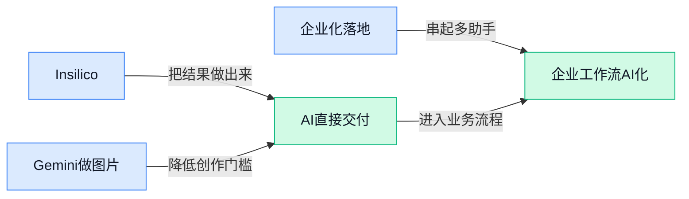

> AI 早报 · 每日早读 · 全网深度聚合

## **今日摘要**

```
OpenAI称Astra迄今最危险，枪击案再引30起诉讼
Google Pics（图片工具）开放试用，Fairwind（防御计划）直供政企
Meta Muse Spark 1.3（AI模型）开放，Claude明拒复现歌词
```

### 🔵 产品与功能更新

1. **Insilico Medicine（人工智能药物研发公司）发布用于新药发现的前沿模型。**  
Insilico Medicine（用人工智能辅助找药物靶点、设计候选药物的公司）发布了面向**药物发现**的新一代前沿模型 💊。这里的药物发现，简单说就是在真正做临床试验之前，先用模型帮助研究人员更快筛选可能有价值的分子和研究方向。对医药行业来说，这说明人工智能正在从“写文案、做图片”继续深入到高门槛研发场景里。[医药模型报道(briefing)](https://news.google.com/rss/articles/CBMisgFBVV95cUxPRlRZcHFoRGR5N0R6dklCT3ZzVHN2TFVtMmY3My1XTU4zQllsZjNCY2NQZGdvVFVFeEV1aU56V2czeEp0elRrT0VCQUd4dUtTWGlIQkJNb00xZjd1aF9fVXZSYzdacTJFZVlZcVV0S2twMFJoS3VIZnhQZVVEYmFNSU5faUJ3MVo2TC03aWFYV3UwLUJqLTEzMF9JdHBDVDVLd3R6ZXlBQ2NrSnNoajJkQUFR?oc=5)


2. **Google Pics（Google 办公套件里的图片生成与编辑工具）开放试用。**  
Google 推出 **Google Pics**，这是一个面向 Google Workspace（Google 的办公协作套件，把文档、表格、邮件等办公工具放在一起）的**图片创建与编辑工具** 🎨。它基于 Nano Banana（Google 最新图像模型，负责把文字需求变成图片、也能按指令改图），主打让普通办公用户更轻松做配图、海报或视觉素材。对运营、行政、市场和设计同事来说，这类工具的价值在于：不用从零打开专业设计软件，也能更快把想法变成可用图片。[官方发布页(briefing)](https://blog.google/products-and-platforms/products/workspace/google-pics/)

3. **Faye（企业软件服务商）推出 Claude 落地服务，帮公司从规划走到受控上线。**  
Faye 宣布推出 **Claude 实施服务**，目标是帮助企业把 Claude 从“人工智能路线图”推进到真正可管理的上线阶段 🧭。这里的“受控上线”可以理解为：不是让员工随便试用，而是按企业规则、流程和责任边界来部署，降低混乱使用的风险。对管理层和职能部门来说，这类服务说明企业采用人工智能正在进入更务实的阶段：不只看模型有多强，还要看能不能安全、稳定、可治理地用起来。[企业服务报道(briefing)](https://news.google.com/rss/articles/CBMirAFBVV95cUxPU0txazdjUjA0X1lYM1FWbW5GTlI1eUpnLU1XRUxqQXdobkpBbkZHZ1Q0LXg4WDNhLXIteHhYZ1pERHVDRmtYbFJpdWZsWFo5ZExZMXlRdDVyS1RlZFFPUVEtSWpRYmVBLTNiZFBaNWRQV21hcWtnS0ZqY3lycE5GZlNjZnFNSFF2RWhVZldWNG9uUGpJXzJlZGtpQVVUNF95cUtGN014SDZORmRY?oc=5)

### 🟢 前沿研究

1. **Multimodal LLMs（多模态大语言模型，能同时理解文字和图像的 AI）被用来评估无人机控制能力。**  
这篇研究关注一个很前沿的问题：能不能让**多模态 LLMs**像“通用飞手”一样，根据语言和视觉信息去控制无人机 🚁。标题里提到的任务包括**Commanding（按指令行动）**、**Approaching（靠近目标）**、**Tracking（跟踪目标）**和**Searching（搜索目标）**，这些都属于把 AI 从“聊天”推向“现实世界行动”的关键场景。它的意义在于，如果模型能稳定理解画面、听懂任务并转化为动作，未来巡检、安防、搜救等业务会更容易接入智能自动化。[论文页面(briefing)](https://huggingface.co/papers/2609.01404)


2. **SMELT（研究 MoE 循环 Transformer 扩展规律的论文）探索同等算力下模型怎么更高效。**  
这篇论文标题里的 **MoE（混合专家模型，像一个团队里不同专家分工处理问题）** 和 **Looped Transformers（循环式 Transformer，让模型重复使用部分结构来思考）** 都指向一个核心问题：在算力有限时，模型结构该怎么设计才更划算 ⚙️。**Compute-Matched（同等计算量对比）**意味着研究不是单纯比谁更大，而是在相近成本下比较不同架构的效果。对行业来说，这类研究可能帮助团队在训练大模型时更好地平衡**成本、速度和效果**。[论文页面(briefing)](https://huggingface.co/papers/2609.01343)

3. **H3-World（把语言理解转成世界控制的研究）想让 AI 从“会说”走向“会做”。**  
这篇研究的关键词是 **World Control（世界控制，让 AI 根据理解去影响环境或执行动作）**，方向明显不只是提升问答能力，而是让模型把语言理解变成可执行的控制能力 🌍。标题中的 **Language Understanding（语言理解）**可以理解为 AI 读懂人的意图，而“控制”则意味着它可能要进一步规划动作、操作系统或影响虚拟/现实环境。对非技术同事来说，这代表 AI 研究正在从“生成内容工具”逐步靠近“能完成任务的行动系统”。[论文页面(briefing)](https://huggingface.co/papers/2609.01560)

4. **DiagEvo（基于诊断引导的自我进化方法）让模型从错误记忆里改进自己。**  
这篇论文标题里的 **Diagnosis-Guided（诊断引导，先分析错在哪里再改进）** 很像员工复盘：不是只说“做错了”，而是定位错误原因再优化 ✅。**Hierarchical Error Memory（分层错误记忆，把不同层级的错误记录下来，方便后续避免重复犯错）**则说明它关注模型如何系统性保存和利用失败经验。它讨论的是 AI 如何通过“看见自己的问题”来实现 **Self-Evolution（自我进化，模型在反馈中持续改进）**，这对提升复杂任务表现很有价值。[论文页面(briefing)](https://huggingface.co/papers/2609.00768)

5. **EM²Mem（面向大语言模型的事件中心多模态记忆）研究 AI 如何记住复杂经历。**  
这篇论文关注 **Event-Centric Multimodal Memory（事件中心多模态记忆，把图像、文字等信息围绕同一事件组织起来）**，重点不是让模型记一堆零散资料，而是让它像人一样按“发生了什么事”来整理信息 🧠。**Multimodal（多模态，文字、图片、音频等不同信息形式）**在这里很关键，因为现实中的任务往往不是单靠文字就能理解。对产品层面来说，这类研究可能影响未来 AI 助手的长期记忆能力，让它更会结合上下文理解用户过去的操作和需求。[论文页面(briefing)](https://huggingface.co/papers/2609.00551)

6. **Claude 的 System Prompt（系统提示词，规定 AI 行为边界的隐藏指令）更明确拒绝复现歌词。**  
Simon Willison 关注到 Anthropic 发布了 Claude 消费端应用的 **system prompts（系统提示词，开发者预先写给 AI 的“行为说明书”）**，覆盖 Claude.ai 和 Claude 移动应用，但摘要里提到并不包括其他所有形态 📱。这次标题重点是 Claude 的新提示词明显不希望模型复现**歌曲歌词**，说明内容版权和安全边界仍是大模型产品的重要议题。对普通用户来说，这意味着 AI 不只是“想答什么就答什么”，背后其实有一套细致规则在约束它能不能输出特定内容。[系统提示词分析(briefing)](https://simonwillison.net/2026/Sep/2/claudes-new-system-prompt/)

7. **OpenAI 的 Astra（OpenAI 新推理模型）因 Recurrent Depth（循环深度推理）引发安全专家担忧。**  
TechCrunch 报道称，OpenAI 的新 **Astra model（Astra 模型，OpenAI 新的推理模型）**将使用 **recurrent depth（循环深度，让模型不只按固定顺序一步步想，而是可反复加深处理）**这一推理技术 ⚠️。报道指出，这种方式让模型可以在传统推理模型常见的**顺序思考**之外运行，因此引发 AI 安全专家警惕。通俗理解，它可能让模型“想得更深”，但也让外界更关心：这种思考过程是否更难预测、监控和约束。[完整报道(briefing)](https://techcrunch.com/2026/09/02/openais-new-reasoning-technique-alarms-ai-safety-experts/)

8. **UI-Venus-2（面向用户界面任务的 AI 模型技术报告）发布研究细节。**  
这份 **Technical Report（技术报告，通常用来说明模型设计、实验和能力边界）**围绕 **UI（用户界面，比如网页、App 页面和按钮表单）**相关能力展开，意味着研究重点可能与 AI 理解和操作界面有关 🖥️。相比单纯聊天，UI 类任务更接近真实办公流程：看懂页面、理解按钮含义、完成操作步骤。对业务和运营同事来说，这类方向值得关注，因为它关系到未来 AI 是否能真正帮人处理系统里的重复性操作，而不只是给建议。[论文页面(briefing)](https://huggingface.co/papers/2609.00028)

### 🟡 行业展望与社会影响

1. **OpenAI 称 Astra（OpenAI 的新模型）是迄今最危险的，观察它在做什么也越来越难。**  
OpenAI 在这篇报道里被描述为把 **Astra（OpenAI 的新模型）** 视作“最危险”的一代模型，真正让人头疼的点，不只是它更强，而是更难看清它到底在干什么。这里的**可观测性（让人能追踪模型行为和决策过程）**变差，意味着外部更难判断它是在认真回答，还是在悄悄走偏。对公司里要把人工智能接进客服、审核、自动化流程的团队来说，这类消息的提醒很直接：模型越强，越不能只看结果，还得看过程。这个话题本质上是在提醒行业，**安全**和**透明度**以后会越来越重要。 [完整原文报道(briefing)](https://the-decoder.com/openai-calls-astra-its-most-dangerous-model-yet-watching-what-it-does-is-only-getting-harder/)


2. **OpenAI 因 Tumbler Ridge（图姆布尔里奇枪击案）再遭 30 起诉讼。**  
报道说，Edelson PC 正在围绕 Tumbler Ridge（图姆布尔里奇枪击案）向 OpenAI 提起 30 起新诉讼，指控方向已经升级到 **aiding and abetting（协助犯罪）**。文章同时提到，相关证据目前仍未被证实，所以这件事还处在争议很大的阶段。对行业来说，这类案件说明，人工智能公司的**法律责任边界**正在被不断拉扯：一旦产品被认为和现实伤害有关，诉讼风险就会迅速放大。也就是说，人工智能不只是产品问题，也越来越像一个**社会责任**问题。 [完整新闻报道(briefing)](https://techcrunch.com/2026/09/02/openai-faces-30-more-lawsuits-tied-to-tumbler-ridge-shooting/)


3. **Google 推出 Fairwind Program（限量开放的网络防御计划），面向政府和企业。**  
Google 这次放出的 **Fairwind Program（限量开放的网络防御计划）**，是给政府和**受信任合作伙伴**先行使用网络防御工具的项目，走的是**主动防御**路线（先提前加固防线，而不是等被攻击后再补救）。这类项目的信号很明确：人工智能不只是在生成内容，也开始更直接地进入安全防护场景，帮组织更早发现和应对网络威胁。因为它是**限量开放**，也说明这类能力目前还在受控试点阶段，不是人人都能直接用的通用服务。对企业和公共部门来说，这代表网络安全工具正在变得更“智能”，但也更强调权限和筛选。 [官方博文原文(briefing)](https://blog.google/innovation-and-ai/technology/safety-security/fairwind-program/)


### 🟣 开源TOP项目

1. **Fable 5.1 World Modeling（PhiloLabs 开源的世界建模项目）亮相 GitHub。**  
这个项目以 **World Modeling（世界建模，让 AI 维护并理解一个“虚拟世界”的状态变化）** 为核心方向，已在 GitHub 上公开仓库 🚀。从条目信息看，它属于 **开源项目**，意味着开发者可以直接查看代码、研究实现思路，后续也可能围绕虚拟环境、交互式内容或 AI 模拟展开探索。对非技术同事来说，可以把它理解成：让 AI 不只是回答一句话，而是尝试“记住并推演一个世界里发生了什么”💡。[GitHub 开源仓库(briefing)](https://github.com/PhiloLabs/fable51-worlds)


### 🔴 社媒分享

1. **Fable 5.1（一次产品版本更新）临时取消争议数据留存政策。**  
Fable 5.1 发布后，最受关注的变化是：此前被用户反感的**数据留存政策**（平台保存用户输入或输出内容的规则）不是简单修改，而是“暂时完全移除”🚀。这类调整直接关系到企业用户对**隐私合规**（公司能否放心把业务资料交给工具处理）的信任。文章还提到更高比例的**缓存**（把重复请求结果临时保存，减少重复计算）可能带来“双赢”，既能改善体验，也可能降低系统压力。[Fable 更新解读(briefing)](https://stratechery.com/2026/fable-5-1-enterprise-frontier-safeguards/)


2. **Perplexity（人工智能问答搜索工具）引用了大量“最佳软件”批量页面。**  
一项报告指出，有 3 个网站制作了 215,128 个“最佳软件”页面，而 Perplexity（人工智能问答搜索工具）会引用这些页面作为回答来源 😯。这提醒我们，**人工智能推荐**（由模型根据网页资料生成的建议）并不天然等于客观，因为它可能被批量制造的内容影响。对运营、采购和管理同事来说，看到“某工具最好”的结论时，最好回头看一下**来源质量**（信息是不是来自真实评测、官方资料或可信媒体）💡。[来源操纵报告(briefing)](https://trellner.com/reports/manufactured-sources-behind-ai-recommendations/)


3. **llm-gemini 0.34（连接 Gemini 的命令行插件）加入新版模型支持。**  
Simon Willison 发布了 llm-gemini 0.34（连接 Gemini 的命令行插件，方便开发者在电脑命令窗口里调用模型）⚙️。这次更新新增了 gemini-3.8-flash（Google 的一个 Gemini 快速响应模型版本），意味着使用该插件的人可以更方便地切换到新模型。对非技术同事可以简单理解为：这类插件像“模型遥控器”，让开发者不用打开网页，也能把模型接进自己的工作流。[插件发布说明(briefing)](https://simonwillison.net/2026/Sep/2/llm-gemini/)


4. **Mistral（欧洲人工智能模型公司）说明用户能否退出训练数据使用。**  
Mistral（欧洲人工智能模型公司）的帮助文档聚焦一个很现实的问题：用户的输入或输出内容，能不能不被拿去做模型训练 🔐。这里的**训练数据**（用来改进模型表现的材料）和**输出数据**（模型给出的回答内容）都涉及企业信息安全。对公司内部使用人工智能工具的人来说，这类说明很关键：它决定了哪些资料可以放心输入，哪些内容应该继续走更严格的保密流程。[数据训练退出说明(briefing)](https://help.mistral.ai/en/articles/455207-can-i-opt-out-of-my-input-or-output-data-being-used-for-training)

5. **Muse Spark 1.3（Meta 推出的人工智能模型）开放开发者页面。**  
Meta 开发者页面上线了 Muse Spark 1.3（Meta 推出的人工智能模型版本）相关信息 ✨。从页面归类看，它属于面向开发者的**模型资源**（给技术团队查看能力、接入方式或使用说明的资料）。这类发布虽然看起来偏技术，但对产品和设计团队也有参考价值：新模型往往意味着内容生成、创意辅助或自动化工作流可能出现新的选择。[模型开发者页面(briefing)](https://developer.meta.com/ai/models/muse-spark/)

---



### 📊 行业洞察（今日 4 条）

1. Google DeepMind 介绍 Gemini 的智能体视频理解（能按目标分析视频的AI）。
  【洞察】视频AI正从识别片段走向理解意图，因为它强调按任务解读画面，机会在剪辑辅助，风险在误判语境。

2. Google 推出 Gemini 3.8 Flash 与 Cyber 版本（面向安全场景的模型）。
  【洞察】大厂在速度与专业场景并进，因为通用模型之外出现行业版本，机会是低成本应用，风险是能力边界不清。

3. OpenAI Astra 采用 recurrent depth（反复加深思考的推理方式）引发担忧。
  【洞察】强推理模型进入更难解释阶段，因为内部过程更不透明，机会是复杂任务更强，风险是错误更难发现。

4. Meta 开放 Muse Spark 1.3 开发者页面（供技术团队了解模型能力）。
  【洞察】内容生成模型选择继续增多，因为平台把能力资料交给开发者，机会是创意工具扩展，风险是同质化竞争。

### 💭 对我们的启发（今日 3 条）

1. Gemini 视频理解提示我们，剪辑软件可让Agent读懂素材意图；机会是粗剪更快，风险是剧情理解偏差。

2. Google Pics 说明低门槛创作会进入办公场景；我们可强化封面、贴图生成，风险是版权与品牌一致性。

3. Astra 事件提醒，Agent参与剪辑决策要给用户可改入口；机会是自动成片，风险是黑箱选择影响质量。


---

> 本周周报：[第36周综合分析](https://zhuxinfei.github.io/ai-daily-site/blog/weekly/2026-w36/)
