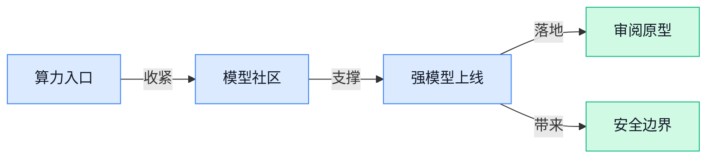

> AI 早报 · 每日早读 · 全网深度聚合

## **今日摘要**

```
Anthropic 连发 Claude Fable 5.1、Mythos 5.1，OpenAI 直言最新模型已超越 Anthropic
英伟达重磅 129 亿美元收购 Hugging Face（模型社区），Anthropic 350 亿美元押注 Lambda（云算力公司）
OpenAI 公开 GPT-6 Astra 安全概览，ARC-AGI-3 登顶，Legora 41 份文件几分钟审完
```

### 🔵 产品与功能更新

1. **Anthropic 推出 Claude Fable 5.1（Claude 系列新版本）和 Mythos 5.1（同系列新版本）。**  
这条消息主要是在说 Anthropic 又给 **Claude** 体系做了一次版本更新，名字里直接带上了 **5.1**。原文没有展开具体改了什么，但从“推出新版本”这个信号看，重点更像是继续打磨现有能力，而不是另起炉灶做新产品。对已经在用 Claude 的团队来说，这类更新通常意味着后续体验还会继续往前走。 [原文报道(briefing)](https://news.google.com/rss/articles/CBMivwFBVV95cUxNbjRvaWhmT2plTjhwWjBOXzZON0x5WkxPeEFaX3N6dzNIT1EzTklicGRkUlFQU29xSTRSU05wNVlBMHRLUDh3dE9uWmpnOWF0SFQ4YVpHM1Mxb0wxNDJYbEVYTG5RSVUyeWxVa2dXakdoNVMxR3lQVjhXb2hfcmt3a2ZzNXFJU1V5ZHNSeW1vZzdhLVdDTXhSZWRRa3hqNGxRa1dFekhJY3ZSSldZX042Umxpd3ZfeGp3ZHg4anVkOA?oc=5)

2. **OpenAI 称其最新 AI（人工智能）模型已超越 Anthropic。**  
这条消息的重点不是某个具体功能，而是 OpenAI 释放出一个很明确的信号：它认为自家最新 **AI（人工智能）模型** 已经在竞争里压过了 Anthropic。对于外界来说，这类表态通常代表大模型赛道的领先位置还在快速变化 🚀。对普通使用者最实际的影响，往往是后续产品更新会更快，体验也可能继续提升。 [完整报道(briefing)](https://news.google.com/rss/articles/CBMihAFBVV95cUxPVFcxemxHOTBaaDF0M1dGZGY2eGwtZE1VQjBkeFVVMnRCbXktam5PVlZnYkxXbGFtcHUzRk1VbjdtdnctOXMySkZiVXlRLUlwY1BfUXJ3VF90OGZNNFZXYWNEdWd3M1JGUXVld044M1F0MGZZemZIRDJLdGpYbHNNblJ2TDE?oc=5)

3. **一人运营四个 AI（人工智能）产品，第五个三天做完，Claude 还包办了设计。**  
这篇文章讲的是一个很有画面感的实战案例：有人一个人同时跑着 **四个 AI（人工智能）产品**，而第 **五个** 只用了 **3 天** 就做出来了。更有意思的是，标题直接点出 **Claude** 还参与了整个设计过程，说明它已经不只是“写写文案”那么简单了 💡。对业务、运营或设计同事来说，这类故事最值得关注的地方是，AI 正在更早地进入产品构思和落地阶段。 [原文链接(briefing)](https://news.google.com/rss/articles/CBMisAFBVV95cUxNQ2IzQ0c3T0FrSVpJeGlWaGRzS21rSlFqX1JjMWtFeW93YzdMS01VTHFxNC11M2FtLWZIa1gwUnBzdTJEc2NVWjc0WEJjSHM0ZTdPejFWdGVSNlZmNk9EWE1vOG9iNS1WSFgzNmJPMzRQczBTM0pSZ2d4NWkxUGoweFRtdDNSemZ5cFRzcU0zUUtjZGFpVEtYUUpUQ3Z4WTB5cThfcUFnd2lvTXBiV1FOaw?oc=5)

### 🟢 前沿研究

1. **探索语言型智能体与非语言型智能体如何协作（Exploring Collaboration between a language and a non-language agent）**  
   这篇论文聚焦的是两类 **智能体**（能自主完成任务的 AI 系统）怎么分工协作：一种更擅长“理解和表达”，另一种更像“执行和操作”。它的价值在于提醒我们，未来的 AI 不一定是一个大而全的单体，而可能是多个专长不同的模块一起配合。对业务同事来说，这种思路很像“一个人负责沟通，一个人负责落地”，会更适合复杂流程。简单说，它在探索更像团队协作的 AI 组织方式。[原始论文详情页(briefing)](https://huggingface.co/papers/2609.00474)

2. **CRISP（基于结构质量感知路由的输入自适应稀疏预填充）**  
   这项工作看起来是在优化 **预填充**（模型正式生成前先把输入内容读一遍并做计算）这一步的效率。它提出的 **稀疏路由**（只让一部分计算路径参与，像“按需开灯”一样节省算力）思路，重点是根据不同输入自动决定该算多少、算到哪。对产品和运营同学来说，这类研究的意义很现实：在不明显牺牲效果的前提下，模型可能更快、成本更低。说白了，就是让大模型别“见啥都全力跑”，而是更聪明地挑重点算。[原始论文详情页(briefing)](https://huggingface.co/papers/2609.01925)

3. **后训练让语言模型冲击编程竞赛金牌（Post-Training Language Models for Gold-Medal Performance in Coding Competitions）**  
   这里的关键词是 **后训练**（模型先预训练好，再用更针对性的材料继续优化），目标则是把模型推到 **编程竞赛** 的高水平。它说明研究重点不是从零造一个新模型，而是在现成模型基础上继续“补课”，让它更会解题、更会写代码。对业务同事来说，这意味着 AI 的能力正在从“能聊会答”升级到“能拿分、能过关”。如果这类方法成熟，代码助手、自动化开发和技术支持都会更强。[原始论文详情页(briefing)](https://huggingface.co/papers/2609.02849)

4. **语言模型可以自己控制注意力（Language Models Can Control Their Own Attention）**  
   这篇论文围绕 **注意力**（模型在阅读时决定“重点看哪里”）展开，核心意思是模型不只是被动接受注意力分配，还可能学会自己调节关注点。对普通用户来说，这有点像让 AI 不只是“会回答”，还会“先盯住关键线索”。如果这条路走通，模型在长文本理解、信息筛选和多步骤任务上会更稳。对日常使用体验的影响，就是回答可能更少跑题、更少漏重点。[原始论文详情页(briefing)](https://huggingface.co/papers/2609.02737)

5. **Repo-To-Skill（把仓库变成可复用技能的系统）**  
   这篇工作在做一种 **蒸馏**（把大而杂的内容压缩成更小、更可用的能力包），目标是把 GitHub 仓库整理成 AI 能直接调用的 **技能**。对团队来说，这特别有现实感，因为很多知识都散落在代码仓库里，真正难的是把它们变成能复用、能调用的东西。标题里的 **AI4AI**（面向 AI 的 AI 技能）说明它不是单纯给人看的文档，而更像给其他 AI 或自动化系统准备的能力模块。简单理解，就是把“仓库里的经验”提炼成“现成可用的本事”。[原始论文详情页(briefing)](https://huggingface.co/papers/2609.02749)

6. **Cliff（从第一次失误开始学习过程奖励）**  
   这篇论文关注的是 **过程奖励**（不是只看最终对错，而是给模型每一步打分）怎么学得更准。它特别强调“从第一次失误开始”，意思是一旦模型走偏，就尽早识别、尽早纠正。对产品或运营同学来说，这类方法的意义在于：AI 不只是最后答对才算好，而是中间过程也要尽量少犯错。放到复杂任务里，这种训练思路通常会让模型更稳、更不容易一路跑偏。[原始论文详情页(briefing)](https://huggingface.co/papers/2609.02817)

7. **NeoMME（单塔多模态原生多语言基础编码器，兼顾微调和推理效率）**  
   这里的 **单塔**（不同输入走同一套主干网络）和 **多模态**（能同时处理文字、图片等不同类型内容）是最核心的信息。它还是一个 **基础编码器**（把内容转成机器更容易比较和检索的表示），并且特别强调 **微调**（用少量特定数据继续适配）和 **推理**（模型正式回答时的运行过程）都更高效。对需要做企业知识库、跨语言内容处理或多媒体检索的团队，这类模型会很有吸引力。直白一点说，它想用更统一的架构，把“多语言 + 多模态”一起装进去。[原始论文详情页(briefing)](https://huggingface.co/papers/2609.01657)

8. **PaperCompiler（把论文要求编译成代码的系统）**  
   这篇工作瞄准的是 **paper-to-code**（把论文里的方法自动变成代码）这个老难题。它强调 **faithful**（忠实还原），意思不是随便写个能跑的版本，而是尽量按照论文原意实现。标题里的 **repository-level specification compilation**（按整个代码仓库粒度把需求整理成可执行规格说明）听起来很硬，但本质上是在减少“论文看懂了、代码却对不上”的落差。对研发团队来说，这类工具如果成熟了，会很适合做论文复现、内部原型验证和技术调研。[原始论文详情页(briefing)](https://huggingface.co/papers/2609.02272)

### 🟡 行业展望与社会影响

1. **英伟达确认将以 129 亿美元收购 Hugging Face（全球最大人工智能模型共享社区）。**  
   这家社区平台据称托管了超过 **300 万个模型**，使用者超过 **1800 万开发者**。如果这笔交易落地，意味着**算力巨头**和**模型分发生态**会靠得更近，开发者后续找模型、用模型的路径可能更集中。对行业来说，这类并购不只是“买公司”，更像是在抢占下一代**人工智能入口**。 [英伟达收购消息(briefing)](https://techcrunch.com/2026/09/03/nvidia-confirms-it-will-buy-hugging-face-for-12-9-billion/)


2. **Anthropic 通过 350 亿美元 Lambda（云算力公司）大单加码 Claude（Anthropic 的聊天助手）基础设施。**  
   这笔合作说明 Anthropic 正在继续补强**底层算力**，给 Claude 预留更大的服务空间。对企业用户来说，模型背后的“机器房”更大，通常也意味着后续的**稳定性**和**承载能力**更值得关注。这样的投入，往往也是大模型竞争从“会不会回答”走向“能不能长期稳定跑大规模业务”的信号。 [基础设施合作(briefing)](https://the-decoder.com/anthropic-ramps-up-claude-infrastructure-with-35-billion-lambda-deal/)


3. **OpenAI 公开 GPT-6 Astra（新一代通用模型）安全概览，称其网络安全能力已达最高级别。**  
   OpenAI 表示，这个模型是目前最强、也是部署最广的模型之一，并且首次在 Preparedness Framework（模型安全预备评估框架）下达到 Critical（关键）级网络安全能力。对公司管理层来说，这类信息很重要：能力越往上走，**安全评估**和**可控边界**就越不能省。它提醒大家，模型升级不只是提效，也会同步带来新的治理要求。 [安全概览(briefing)](https://openai.com/index/safety-overview-gpt-6-astra)

4. **Legora（企业审阅工具）借助 GPT-6 Astra（新一代通用模型）几分钟审完 41 份财务文件。**  
   OpenAI 的案例显示，Legora 用这个模型在几分钟内就完成了 41 份文件审阅，还找出了全部 4 个预埋错误。它的表现比之前版本提升了将近 **40%**，对**财务审阅**、**法务核对**这类重复性高的工作很有参考价值。更直白地说，AI 在这里更像是先帮人把粗活做快，再把精力留给真正要判断的地方。 [财务审阅案例(briefing)](https://openai.com/index/legora-financial-statement-review-with-astra)

5. **Playco（游戏公司）用 GPT-6 Astra（新一代通用模型）做出三款主题原型，人工修正减少 50%。**  
   OpenAI 说，Playco 是在同一个基础框架上做出三款主题游戏原型的，并且相比上一代模型，人工修正少了 **50%**。这对做**产品原型**或**创意提案**的人很有启发：从想法到可展示版本的速度更快了，试错成本也会更低。对内容、设计和运营团队来说，这类能力最直接的价值就是“更快看到结果”。 [游戏原型案例(briefing)](https://openai.com/index/playco-game-prototyping-with-astra)

### 🟣 开源TOP项目

### 🔴 社媒分享

1. **Funes（给编程 Agent 配私有记忆的项目）想让代码助手拥有“你自己的记忆”。**  
这条分享来自 Hugging Face（全球最大 AI 模型共享社区）的博客，核心卖点很直白：给 **Coding Agents（能自动写代码、改代码、跑任务的 AI 助手）** 配一个由用户掌控的 **memory（长期记忆，让 AI 记住项目偏好和上下文）** 🧠。这意味着代码助手不只是“每次从零开始聊天”，而是可能持续理解你的项目习惯、代码风格和历史决策。对团队来说，这类方向值得关注，因为它关系到未来 AI 编程工具能否真正沉淀组织知识，而不是只做一次性问答。[HuggingFace 博客(briefing)](https://huggingface.co/blog/funes)


2. **GPT-6 Astra（OpenAI 新一代模型版本）开始向部分组织推出。**  
Simon Willison 的分享提到，**GPT-6 Astra（OpenAI 新发布/测试的 GPT-6 系列模型版本）** 已经“今天开始”向一部分组织开放，并将在接下来几天面向 ChatGPT Plus、Pro、Business 和 Enterprise 用户可用 🚀。这里的 **rolling out（分阶段上线）** 很关键：不是所有人同时拿到，而是先小范围放量再逐步扩大。对普通办公用户来说，重点是观察它进入 ChatGPT 付费版后，在写作、分析、办公协作等场景是否带来明显体验变化。[Simon 分享解读(briefing)](https://simonwillison.net/2026/Sep/3/gpt6-astra/)

3. **Qwen 3.8 27B（通义千问系列 270 亿参数模型）在 Cerebras（AI 芯片与推理平台）上达到 1500 tokens/s。**  
这条社媒信息显示，**Qwen 3.8 27B（阿里通义千问系列的大模型，27B 表示约 270 亿参数规模）** 已可在 Cerebras（主打 AI 加速芯片和云端推理服务的公司）上使用，并标出 **1500 tokens/s（每秒生成 1500 个文本小片段，通常代表回答速度很快）** ⚡。其中 **inference（模型推理，指训练好的 AI 正式回答问题的过程）** 速度，是企业部署 AI 时非常关心的成本和体验指标。简单说，如果这个速度在实际使用中稳定，就意味着长文本生成、批量处理等任务可能更顺滑。[模型列表文档(briefing)](https://inference-docs.cerebras.ai/models/overview)

4. **Google Antigravity（Google 的 AI 编程工具）服务条款引发账号风险提醒。**  
这条分享指出，**Google Antigravity（Google 推出的 AI 编程/开发辅助工具）** 的 **TOS（Terms of Service，服务条款，规定用户能做什么不能做什么）** 中，第三方使用可能导致 Google 账号被暂停 ⚠️。这里的 **3rd party usage（第三方使用，比如非官方客户端、外部工具或间接调用）** 是风险点，尤其对公司账号和开发者账号更需要谨慎。对企业用户来说，别只看工具好不好用，也要看条款边界，否则账号、数据和合规都可能受影响。[社媒风险提醒(briefing)](https://twitter.com/GergelyOrosz/status/2095453567955968398)

5. **K2 Horizon（由六个开放模型组成的模型舰队）发布。**  
这条博客介绍了 **K2 Horizon（一个由六个开放模型组成的模型组合）**，标题强调它是一支 **connected fleet（互相连接/协同的一组模型，而不是单个模型）** 🌐。其中 **open models（开放模型，通常指可被外部查看、使用或部署的模型）** 是重点，意味着开发者和机构可能有更多自主使用空间。相比单一大模型，“模型舰队”的说法暗示不同模型可能分工处理不同任务，但具体能力仍要以官方博客披露为准。[K2 官方博客(briefing)](https://ifm.ai/blog/k2/)

6. **GPT-6 Astra（OpenAI 新一代模型版本）登上 ARC-AGI-3（衡量 AI 通用推理能力的测试）。**  
ARC Prize 的文章聚焦 **OpenAI 的 GPT-6 Astra（GPT-6 系列中的 Astra 版本）** 在 **ARC-AGI-3（一个测试 AI 抽象推理和泛化能力的评测）** 上的表现 🧩。这类 **benchmark（基准测试，用统一题目比较不同 AI 能力）** 不等于日常使用体验，但能帮助行业观察模型是否更接近“会举一反三”。对非技术同事来说，可以把它理解成 AI 的“能力考试”：不只看会不会背答案，更看能不能面对新题目推理。[ARC 评测文章(briefing)](https://arcprize.org/blog/astra)

---



### 📊 行业洞察（今日 4 条）

1. OpenAI发布 GPT-6 Astra（新一代通用模型），又拿出财务审阅和游戏原型案例  
  【洞察】强模型竞争已从“跑分好看”转向“能不能在真实业务里少返工、快交付”

2. 英伟达拟收购 Hugging Face（全球最大 AI 模型共享社区），Anthropic又砸350亿美元买算力  
  【洞察】大模型战争正在向“谁掌握算力和模型入口”转移，小公司会更依赖巨头生态

3. GPT-6 Astra（新一代通用模型）被称网络安全能力达最高级，又被宣传进入通用智能时代  
  【洞察】能力越强越不是纯好事，企业用它做关键工作时，审核和权限边界必须同步升级

4. K2 Horizon（六个开放模型组合）发布，论文也在研究不同 Agent 如何分工协作  
  【洞察】未来不一定靠一个万能 AI，而是多个专长工具配合，关键在谁能把流程管顺

### 💭 对我们的启发（今日 3 条）

1. Playco（游戏公司）用 GPT-6 Astra（新一代通用模型）做原型、人工修正少50%，说明我们的视频工具也要把“先出可看版本”做强，而不是只堆剪辑按钮。

2. Legora（企业审阅工具）几分钟审完41份财务文件，给我们的启发是：视频成片前也要有“自动质检”，比如口播错字、卖点遗漏、违规词先拦一遍。

3. 英伟达收购 Hugging Face（全球最大 AI 模型共享社区）和 Anthropic买算力，提醒我们别把能力绑死在单一模型上；视频生成、脚本、质检要能灵活切换，控制成本和风险。


---

> 本周周报：[第36周综合分析](https://zhuxinfei.github.io/ai-daily-site/blog/weekly/2026-w36/)
