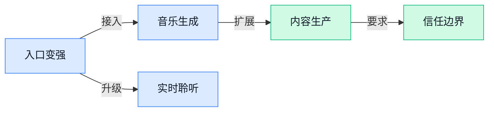

> AI 早报 · 每日早读 · 全网深度聚合

## **今日摘要**

```
Google 把 Lyria 3.5 塞进 Gemini，AI Travel Tools 再添 5 个 AI Mode 旅行功能
Nvidia 13 亿美元加码 Hugging Face，重押 AI 软件平台与模型社区
OpenAI 编程智能体提速改写实验节奏，Meta real-time audio model 逼近持续聆听助手
```

### 🔵 产品与功能更新

1. **Google 把 Lyria 3.5（Google 新一代 AI 音乐生成模型）直接塞进 Gemini。**  
Google 正把**AI 音乐生成**带进 Gemini 应用，核心是新模型 **Lyria 3.5（Google 用来根据文字等输入生成音乐的模型）** 🎵。这意味着用户不必跳到单独工具里，就能在熟悉的聊天入口里尝试生成音乐，Gemini 的定位也从“问答助手”继续扩展到**创意生产工具**。对内容、品牌、运营同事来说，这类功能未来可能降低配乐、灵感小样的制作门槛，但具体商用规则仍要看产品说明 💡。[Gemini 音乐生成报道(briefing)](https://the-decoder.com/google-brings-ai-music-generation-directly-into-the-gemini-app-with-its-new-lyria-3-5-model/) 另一家媒体也关注到 Google 在 Gemini 中推出 **Lyria 3.5** 的动作，说明音乐生成正在成为主流 AI 助手的新增战场。[Lyria 发布报道(briefing)](https://news.google.com/rss/articles/CBMilAFBVV95cUxOaUo3S045dE1WNDdiY1ZRb09ZZF9xdHJObnpjdFY1WkdPRFQ3ZmgwdDF3S3dNdGhWWGVSajRlaVhILTFZUmZscXQxSm16WjJHck5SMS1sUDY5QXgzaTVVZVAxU0Y1MDRwTDBFRGU5RXdVWjQ2a0ItVmFDNmdHZERQbVpFdWJISUdITVEtR0VWWVNoRmEt?oc=5)

2. **Google AI Travel Tools（Google 面向旅行规划的 AI 工具）新增 5 个 AI Mode（Google 搜索里的 AI 问答模式）旅行功能。**  
Google 的旅行相关 AI 工具迎来更新，报道聚焦 **5 个新的 AI Mode 功能** ✈️。这里的 **AI Mode（Google 搜索中的 AI 问答模式，会把搜索结果组织成更像对话的答案）**，正在从单纯“查信息”走向更贴近“帮你规划”的使用方式。对行政、运营、商务等经常安排差旅的人来说，这类更新值得关注，因为它可能让机票、酒店、行程灵感等信息获取更集中、更省时间 🚀。目前候选信息只给出了功能数量和旅行场景，具体每项能力还需要查看原报道进一步确认。[旅行工具报道(briefing)](https://news.google.com/rss/articles/CBMidkFVX3lxTE15UTdrdGYyNnEwaGZlV3BTR2NJelRucGEtd2RCam5jdVBRN2k0Q3dhUTd2dGJJRkdzUWg1M1lkVGR4bHc1MlNpVUhWYkYyWWVWR0hVRjdtNDY2NmFEVmM3OHZ5T1oycXFIMUN1VnFINDd4VHhCN3c?oc=5)

### 🟢 前沿研究

1. **OpenAI 内部研究提速：编程智能体正在改写实验节奏。**  
OpenAI 分享了公司内部如何用**编程智能体**（能自动写代码、跑实验、修改问题的人工智能助手）加速研究工作 🚀。文章提到，他们观察了**智能体使用情况**、**实验速度**、**任务复杂度**和**研究加速**等早期数据，重点不是“替代研究员”，而是让研究员更快验证想法、推进复杂任务。对普通团队也有启发：未来很多知识工作可能会从“自己一步步做”变成“把目标讲清楚，再监督智能体完成”💡。[OpenAI 官方文章(briefing)](https://openai.com/index/research-acceleration-view-inside-openai)

2. **Conditional Experience Transfer（条件式经验迁移，让模型判断旧经验何时该复用）关注大模型后训练。**  
这篇研究的核心问题很接地气：大模型在**后训练**（模型预训练完成后，再用任务数据和反馈继续打磨能力）阶段，不能什么经验都照搬，要学会“什么时候不要复用”🤔。所谓**经验迁移**（把过去任务中学到的做法带到新任务里）听起来高效，但如果场景变了，旧经验也可能帮倒忙。论文标题显示，它关注的是**自主大模型**（能自己执行任务、根据反馈调整行为的模型）在训练中更有条件地使用经验，这对提升智能体稳定性很关键。[HuggingFace 论文页(briefing)](https://huggingface.co/papers/2608.26730)

3. **Puffin-World（带原生三维世界状态的统一多模态模型）探索让模型更懂真实空间。**  
Puffin-World 这项研究聚焦**统一多模态模型**（把文字、图像、视频等多种信息放进同一个模型里理解和生成）🧩。标题中的**原生三维世界状态**（模型内部直接表示物体位置、空间关系和场景变化，而不只是看平面图片）说明，它想让人工智能更像人一样理解“空间里发生了什么”。如果这类方向成熟，未来可能帮助机器人、自动驾驶、三维设计等系统更好地理解真实世界，而不只是识别画面内容。[HuggingFace 论文页(briefing)](https://huggingface.co/papers/2609.04196)

4. **Progressive Latent Memory Evolution（渐进式潜在记忆演化，让模型持续理解视频）瞄准流式视频理解。**  
这篇论文关注**流式视频理解**（视频一边播放，模型一边实时理解，而不是等全部看完再分析）🎥。标题里的**潜在记忆**（模型内部保存的“压缩记忆”，类似边看边记重点）说明，它希望模型不只靠检索旧片段，而是让记忆随着视频推进不断演化。对会议记录、安防巡检、直播内容分析等场景来说，这类研究意味着人工智能可能更擅长理解长时间、连续变化的信息流。[HuggingFace 论文页(briefing)](https://huggingface.co/papers/2609.04131)

5. **DRACO（用动态评分标准训练长任务智能体的方法）改进复杂任务里的责任分配。**  
DRACO 研究的是**长周期智能体训练**（让人工智能助手完成很多步骤组成的复杂任务，而不是只答一个问题）🛠️。标题中的**细粒度信用分配**（判断一整串操作里，到底哪一步做得好、哪一步拖了后腿）很关键，因为复杂任务失败时，不能只给最终结果打一个笼统分。它还提到**动态评分标准**（根据任务进展调整评价规则），这有助于让智能体在长期任务中学得更精准，而不是“蒙对了也算好”。[HuggingFace 论文页(briefing)](https://huggingface.co/papers/2609.04094)

6. **RealSWE（用真实用户请求评测编程智能体的基准）让代码助手考试更贴近工作现场。**  
RealSWE 关注的是**编程智能体**（能理解需求、修改代码、完成软件任务的人工智能助手）的评测问题 👨‍💻。标题里的**组合式评估**（把多个小能力组合起来测试，而不是只考单一题目）说明，它想模拟更接近真实工作的需求：用户往往不会只问一个干净的小问题，而是提出带背景、带约束的请求。这样的评测对判断代码助手是否真的能帮工程团队干活更有意义，也能减少“榜单分数高、实际不好用”的落差。[HuggingFace 论文页(briefing)](https://huggingface.co/papers/2608.27831)

7. **WorldReward（面向摄像机条件世界模型的奖励建模）研究如何给虚拟世界训练打分。**  
WorldReward 聚焦**世界模型**（让人工智能在内部模拟环境变化，像先在脑中预演再行动）🌍。标题中的**摄像机条件**（模型会根据视角、镜头位置等条件理解场景）说明，它面向的是更接近视觉世界的模拟任务。**奖励建模**（设计一套评价机制，告诉模型哪些行为或预测更好）则像给模型配一位裁判，帮助它在复杂视觉场景中学会更合理地预测和决策。[HuggingFace 论文页(briefing)](https://huggingface.co/papers/2609.03952)

### 🟡 行业展望与社会影响

1. **Nvidia 加码 Hugging Face（全球最大 AI 模型共享社区），13 亿美元押注 AI（人工智能）软件平台。**  
Nvidia 确认将把 **13 亿美元**投向 Hugging Face（全球最大 AI 模型共享社区，很多开发者会在上面发布和下载 AI 模型）这类 **AI 软件平台**，说明算力巨头不只卖芯片，也在向模型生态和开发工具层延伸 🚀。这对行业的信号很直接：未来 AI 竞争不只是“谁的 GPU（图形处理器，大模型训练常用的高性能芯片）更多”，还包括谁能掌握模型分发、协作和落地入口。对企业来说，AI 供应链可能会越来越集中在少数硬件和平台公司手里，采购与合作选择也会更战略化。[投资报道详情(briefing)](https://news.google.com/rss/articles/CBMirgFBVV95cUxOWHlNb3oxa01lOG9fak9vamN1dkUyWU1pYkp0LUwzYWgwR1gwT1VEVDNiS3lLU2pLUmpud014c2kyTU5vYlFjVzJDa3BoaGFaX2hWTUlEUVdibXZvOFlGdl94UWdyOURxU0tqcUgxNXFVR1hobm9qc3VIU3lucTc1aEpmVkd3MzlVdkZwNDRyZTN3VzlLTGZmd2VDQk1BOG40X0kwY3BMWTBYSTB5bGc?oc=5)

2. **An Alien Mind（“异质心智”：OpenAI 对强 AI 风险的反思）提醒业界重视对齐问题。**  
OpenAI 的 Jakub Pachocki 在文章中讨论了越来越强大的 AI（人工智能）可能带来的挑战，核心是如何让它保持 **aligned（对齐，让模型行为符合人类意图和安全边界）** 💡。他强调需要更强的 **safeguards（安全护栏，限制模型做危险或不可控行为的机制）**，也呼吁国际层面的协调，而不是各家公司各自为战。对普通企业来说，这意味着未来使用 AI 不只是看“好不好用”，还要看供应商有没有可靠的安全治理和责任机制。[OpenAI 原文(briefing)](https://openai.com/index/an-alien-mind)

3. **Google Lyria 3.5（谷歌 AI 音乐生成模型）让 Gemini 和 API（应用程序接口，方便软件调用 AI 能力）生成完整歌曲。**  
Google 的 Lyria 3.5（谷歌用于生成音乐的 AI 模型）被接入 Gemini 和 API（应用程序接口，让其他产品也能调用这项能力），重点是支持 **full-length AI songs（完整长度的 AI 歌曲）** 🎵。这说明 AI 音乐正在从“生成几秒片段”走向更接近真实创作流程的阶段，对营销、短视频、游戏和内容团队都很有想象空间。与此同时，音乐版权、创作者收益和平台审核也会变得更重要，因为生成式音乐越像成品，越需要清楚规则边界。[Lyria 报道详情(briefing)](https://news.google.com/rss/articles/CBMiiwFBVV95cUxNN1FQZnZYekNnY2xfRjA1V3E5WDAtdE1kLTdocENWUF81T2ktNnVIelA0elI1aUF1QmowVXdJLTl4YWQ5c3FtTmFiQ1RRN21JbTR1R1FxVlhhVkYwZFQ0amVDelBVN3lSdjBfZGY5X1Y5MFc3N3dpazljVmVaUW5SX0pYczVBTmxZU1E4?oc=5)

4. **Meta 推出 real-time audio model（实时音频模型），为“持续聆听”的 AI（人工智能）助手铺路。**  
Meta 的新 **real-time audio model（实时音频模型，能边听边处理声音，而不是等录音结束再分析）** 被定位为下一代 AI 助手的基础能力，方向是让助手可以长期处在“随时响应”的状态 👂。这类能力会让语音助手更自然，比如会议、客服、车载或智能眼镜场景里，用户不必反复唤醒和重复上下文。社会影响也很明显：当设备“never stop listening（持续聆听）”时，隐私、授权和数据边界会成为产品能否被接受的关键。[Meta 音频模型报道(briefing)](https://the-decoder.com/metas-new-real-time-audio-model-is-the-foundation-for-ai-assistants-that-never-stop-listening/)

### 🟣 开源TOP项目

### 🔴 社媒分享

1. **An Alien Mind（“异星心智”，OpenAI 发布的一篇思考型文章）上线。**  
OpenAI 页面收录了一篇题为 **An Alien Mind（异星心智，通常用来形容 AI 像“非人类思维”一样处理问题）** 的内容，但候选材料只提供了标题，未给出更多正文信息 🤔。从标题看，它更像是一篇围绕 **AI 心智（用来讨论 AI 如何“理解”、推理或表现出智能的概念）** 的讨论型文章，而不是具体产品发布。感兴趣的同事可以先看原文入口，后续若有完整内容再进一步拆解它对行业认知的影响 💡。[OpenAI 原文页面(briefing)](https://openai.com/index/an-alien-mind/)

---



### 📊 行业洞察（今日 4 条）

1. Google把音乐生成塞进 Gemini（Google 的聊天式 AI 助手），Meta做实时听声音模型  
  【洞察】AI助手正从“会聊天”变成“会做内容、会听现场”，入口价值越来越大。

2. OpenAI用 Astra（内部编程助手）提速研发，RealSWE（真实需求评测工具）也在逼近真实工作  
  【洞察】智能体竞争不再只看演示多炫，而是看能否稳定完成复杂真实任务。

3. 英伟达投 Hugging Face（全球最大 AI 模型共享社区），Google又把模型能力接进自家入口  
  【洞察】大公司在抢“模型分发权”，小团队会更依赖少数平台，议价空间可能变小。

4. OpenAI谈强AI安全，Meta的“持续聆听”助手又带来隐私争议  
  【洞察】AI越像员工和随身助手，信任成本越高；能力强不等于用户敢放心用。

### 💭 对我们的启发（今日 3 条）

1. Google让 Gemini（Google 的聊天式 AI 助手）直接生成完整音乐，说明短视频工具不能只管画面，配乐、节奏、版权提示要一起做成闭环。

2. Meta实时音频模型能边听边处理声音，视频剪辑软件可考虑“边看边剪”：直播、口播、素材审片时实时标记爆点，但必须给用户明确开关。

3. OpenAI内部智能体把计划提前半年，说明我们做剪辑自动化不能只堆功能，要把“脚本、选段、剪辑、审核”拆成可接管的小步骤。


---

> 本周周报：[第37周综合分析](https://zhuxinfei.github.io/ai-daily-site/blog/weekly/2026-w37/)
