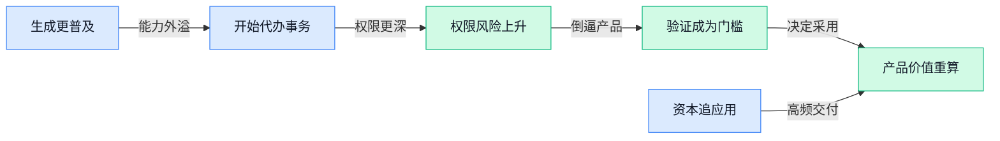

> AI 早报 · 每日早读 · 全网深度聚合

## **今日摘要**

```
OpenAI分享纳维–斯托克斯千禧难题AI解答及形式化证明，数学界迎来震撼时刻
Cognition融资20亿美元估值升至480亿美元，Forus（AI医疗平台）估值冲上30亿美元，AI创业融资分化加剧
Qwen3.8 27B实测炸裂：4位压缩仍稳，1位量化却明显崩塌，大模型低比特极限曝光
```

### 🔵 产品与功能更新

1. **亚马逊打通 MLflow（用于管理机器学习实验与模型的平台）和 SageMaker AI Model Registry（亚马逊的模型版本登记服务）。**
亚马逊在系列文章的上篇中介绍了两套系统的**同步方案**，让模型信息可以在不同管理入口之间保持一致 🔄。其核心是加强**模型治理（统一管理模型版本、状态和使用流程）**，帮助团队更清楚地掌握模型资产。[亚马逊方案详解(briefing)](https://news.google.com/rss/articles/CBMiwAFBVV95cUxOM1dtak0zYldNN1dTNHlPYld2UjNURHk5bE8wNm1fU0hoY0QzYmRrMU53SGVvZ0VSdEFUcHhnTEEtdTg1T1ZYek5FTW95dXc4anZXTGpkMmI0WXVEbEFGN2lfT2dtbGJlYVZ2YmdEZlJpWExXalV6V3ctOWY3V2tIOW1KQUlSdWFDa0hzeTUtTkFWdHpORTZpc1U1b08tUXlNM3NueWthUDZRVmtkaGxLNUhYZGQtOElMQTJ4OGFpY0w?oc=5) 其中，**模型注册表（集中记录模型版本和状态的目录，类似模型资产台账）**是连接两边管理流程的关键，适合需要同时维护多套模型管理系统的团队 💡。

2. **Meta 推出个人智能助手，可跨应用发邮件和付款。**
Meta 推出的**个人智能体（能够理解指令并代替用户执行任务的人工智能助手）**，不只负责回答问题，还能访问其他应用并完成实际操作 🚀。据报道，它可以替用户**发送邮件、进行付款**，把人工智能从“聊天工具”进一步变成“办事助手”。[跨应用功能报道(briefing)](https://news.google.com/rss/articles/CBMivAFBVV95cUxQS195TVZPeEJJbzNYTEZ0dnI4WGxOWXF2ZlRmbDEyU1VtWnFsd012VXVDd01mRHY3Y3lDOW9pRXRYSXR6R2NqYVM3R0xwMURjZElSZHVkckZidjNoWTh5OWlNWkZGUGJpWnpDSUhUOUxBUEZDTVpwZjFXemxIdTlvanpSMXF2MXo1UkNtN2UtZVdfX3J2ZTdCekREbUxkaFo1MVpLakxOT0ZaeUVoMlhlb2E0Y0dfV2g0bXRNbw?oc=5) 另一篇报道强调，这款产品主打**易用性**，希望降低普通用户使用智能体的门槛。[个人助手产品报道(briefing)](https://news.google.com/rss/articles/CBMingFBVV95cUxQSkdCc2Z4M2ZwdHUzYW54azRDb0ptT0NOQ29kdklZQkloR3lXaEFhWGUzQnRYXzQxbmVrTXBybUtQS3JxLUxoRDhzNGJNdXZrMWhDWmxYWTRfVEE5Y19qdDNldldEanl1NW5UbHE5a014bVlSUzdaSm1JSTBIUUdYZ2VsR2Jpd29BZDFyTnI0eVV6cndjdWp0Umg1bFkyQQ?oc=5) 这种**跨应用操作（让助手在不同软件之间代为执行任务）**能力，也意味着智能助手开始从提供建议迈向直接行动 (๑•̀ㅂ•́)و。

### 🟢 前沿研究

1. **Verify Before You Distill（按提示词筛选教师模型的在线策略蒸馏研究）：先验证，再向老师学习。**
这项研究关注**在线策略蒸馏**（学生模型依据自己当前生成的内容，实时向更强的教师模型学习）中的教师调用方式。核心思路是加入**提示词级教师门控**（针对每个问题判断是否需要教师模型介入），先验证、再蒸馏 💡。从研究方向看，它试图让教师模型的指导更有选择性，而不是对所有提示词一视同仁。[论文介绍页(briefing)](https://huggingface.co/papers/2609.02998)

2. **FlowBalance（以验证器为依据的模型自我改进框架）利用自身推理经验持续学习。**
该研究探索模型如何利用**在线策略推理经验**（模型按照当前能力实际生成的推理过程）完成自我提升。FlowBalance 引入**验证器**（专门检查答案或推理结果是否正确的评判机制），让改进过程建立在可验证的反馈之上 🔍。论文标题强调“以验证器为基础”，意味着研究重点不只是让模型多练习，还要判断哪些推理经验值得学习。[论文介绍页(briefing)](https://huggingface.co/papers/2609.03241)

3. **ENEAS（用语义向量引导多个神经网络协作的自适应分割方案）提出新的组合思路。**
ENEAS 利用 **embedding（把内容转换成数字向量，方便模型比较特征和相似度）**来引导多个神经网络共同完成分割任务。这里的**神经网络集成**（让多个模型共同判断，以综合不同模型的优势）与自适应机制相结合，目标是根据输入情况灵活处理分割 📐。这项研究的关注点，是如何协调多个模型，而不是只依赖单一模型完成判断。[论文介绍页(briefing)](https://huggingface.co/papers/2609.03756)

4. **One Symptom, Three Levers（从一个共同问题审视三类改进手段的综述）反思在线策略自蒸馏。**
这篇论文对**在线策略自蒸馏**（模型用自己当前生成的结果继续训练自己）进行了批判性回顾。标题中的“一个症状、三个杠杆”表明，作者试图从共同问题出发，梳理三类可能影响训练效果的调节方向 🧭。作为综述类研究，它的重点是重新审视这一训练路线，而非单独提出一个新模型。[论文介绍页(briefing)](https://huggingface.co/papers/2608.25936)

5. **OpenAI 分享纳维–斯托克斯千禧难题的人工智能生成解答及形式化证明。**
OpenAI 公布了一份由人工智能生成的**纳维–斯托克斯千禧难题**解答；该问题研究流体运动方程的解是否始终存在且足够平滑，是著名的千禧年数学难题之一 🌊。公开材料不仅包含文字论证，还提供了使用 **Lean（让计算机逐步检查数学证明是否严谨的形式化证明工具）**编写的证明。形式化证明的意义在于把论证拆成机器可核验的步骤，为检查复杂数学推导提供另一层保障。[OpenAI 解答页面(briefing)](https://openai.com/index/navier-stokes-solution)

6. **EmbodiedSkills（统一编排、训练和部署视觉—语言—动作智能体的框架）打通具身智能流程。**
该研究提出一个统一框架，用于编排、训练和部署 **VLA（视觉—语言—动作模型，让机器看懂环境、理解指令并执行动作）智能体**。它面向**具身智能**（让人工智能通过机器人等实体与现实环境互动）场景，把原本分散的多个环节纳入同一套体系 🤖。从标题所描述的范围看，研究重点覆盖技能组织、模型训练和实际部署三个阶段。[论文介绍页(briefing)](https://huggingface.co/papers/2609.01281)

7. **AlphaGenome Atlas（预测人类基因组单字母变化影响的图谱）覆盖约 90 亿种变异。**
Google DeepMind 发布的 AlphaGenome Atlas，绘制了人类基因组中约 **90 亿种单字母变异**可能产生的分子层面影响 🧬。这里的 **DNA（脱氧核糖核酸，承载人体遗传信息的分子）单字母变异**，可以理解为遗传信息中的一个“字符”发生改变。该图谱的核心价值是把海量潜在变化整理为可预测、可查询的影响地图，为研究人类基因组提供更系统的参考。[官方研究介绍(briefing)](https://deepmind.google/blog/alphagenome-atlas-a-predictive-map-of-every-possible-dna-letter-change-in-the-human-genome/)

8. **上下文集成方案尝试统一保形语言任务。**
这项研究把**保形语言任务**（利用统计校准评估语言模型输出可靠性的任务）与**上下文集成**（在输入内容中组合多组示例或判断结果）放到统一框架下研究。集成思路通常强调汇总多个判断，而保形方法关注预测结果的可靠性范围，两者的结合构成了论文的核心方向 📊。论文标题显示，作者希望用一套共同方案处理不同类型的保形语言任务。[论文介绍页(briefing)](https://huggingface.co/papers/2609.03005)

### 🟡 行业展望与社会影响

1. **Qualcomm（高通，移动芯片与通信技术公司）与 Amazon 达成人工智能芯片协议，并附带约 40 亿美元股票购买权。**
双方达成了一项**人工智能芯片合作协议**，交易还包含约 **40 亿美元的股票购买权** 💰。[芯片交易报道(briefing)](https://news.google.com/rss/articles/CBMioAFBVV95cUxPZl80VFZ2VnoyVGhIdk1HaHpWdzVuTFZRNWdhdXBaU0JxMy1HY3d0aXV4bHZUNFIxSS1TMWVpVVM0UDZqWFlTY2VuZEFzaW40UzZmZGJ4d1d6emVGOHZ1em1ycUJSOUIxM05DN3NzNlJObXpmYTJaZ2JMOGp1bGNib20yZUZibDJTMjNvSnNvWVRseE5QT3o5OTVMV3NVUHFr?oc=5) 股票购买权（允许一方按约定条件购买另一方股票的权利）让这笔合作不只停留在产品层面，还延伸到了**资本安排**。这类深度绑定表明，人工智能芯片竞争正在同时考验厂商的产品能力与长期商业合作能力 🚀。

2. **Forus（人工智能医疗服务平台）最新估值达到 30 亿美元。**
Forus 在最新一轮融资中获得 **30 亿美元估值**，显示资本市场继续关注人工智能与医疗服务结合的机会 🏥。[医疗融资报道(briefing)](https://news.google.com/rss/articles/CBMivwFBVV95cUxOWVBNejEwMWhscHN1QXlpNkZTZm1LV1NnQkVUZ0h2ei15TzB6dmlOR0ZZOUFfUFA4ODdPN0YyLWtOVFJiQ3RMcXh4V3BRMFFWYzVLM2hfWDgxT254M3BIb1BNcXFTUm5fOENpUFUwS2ZlSHpjQWQ2OXpsd0FCYTVqZ1JodnBmY1o5MHV1TnJ1WWFsTnFHQ3hQZjExVm1PMi1jY2g2cHVTYmcxRXM5S1ZqbE9PTUM4M1VSMHVqY1ZTWQ?oc=5) 融资轮（创业公司分阶段向投资者筹集资金的过程）中的估值，是投资者对公司整体价值的判断，并不等于公司一次性拿到了同等金额。对行业而言，这笔估值说明**人工智能医疗平台**依然是颇受投资者重视的应用方向 💡。

3. **Cognition（人工智能编程公司）融资 20 亿美元，估值升至 480 亿美元。**
Cognition 此轮融资达到 **20 亿美元**，公司估值升至 **480 亿美元**，营收则接近 **9 亿美元** 💰。[融资数据报道(briefing)](https://news.google.com/rss/articles/CBMiswFBVV95cUxQZWdNZjBoSXZZLXNPRUNJNTZLc1J2OFRNNldUSVNnVEN6U0NJandrZUltNi1pb0tuUFljRmxERUFnYkxKbHR1a0xKNFNTX1pRX1BnXzdLeTItMGM3d3gzelhjMWF6ZmVDUlpDXzhTOWVJUDFXM1ZtOHVwTUlIRlpoeTl2Ukl4dzh1dS1WUTREX1R2RUR3ZWkxMnRDUjlhb1ozUnJfNDZ4QnJmdEs3eWNYQk55SQ?oc=5) 估值（投资者根据增长预期给出的公司整体价值）快速走高，反映出资本仍愿意为人工智能编程产品的增长空间下注。[市场格局分析(briefing)](https://techcrunch.com/2026/09/08/cognition-hits-48b-valuation-signaling-investors-believe-ai-coding-is-far-from-a-winner-take-all-market/) 相关分析认为，这一结果意味着人工智能编程可能尚未进入**赢家通吃市场**（最终由单一公司占据绝大多数市场份额的竞争格局），多家公司仍有机会并存发展 🚀。

4. **Meta 取消用人工智能使用量考核工程师，“刷用量”式绩效指标遭遇反噬。**
Meta 将不再把工程师的**人工智能使用情况**纳入绩效评估，此前相关做法引发了“刷用量”现象。[绩效调整报道(briefing)](https://the-decoder.com/meta-drops-ai-usage-from-engineer-performance-reviews-after-tokenmaxxing-backfires/) 所谓“用量最大化”（员工为了满足考核要求，刻意增加人工智能工具的使用次数或消耗量），容易让人追求漂亮数字，而不是实际工作成果 📊。这次调整提醒企业，推广人工智能不能只看使用频率，还要警惕**指标异化**（员工为了完成指标而偏离指标原本想衡量的目标）💡。

5. **Meta 推出 Muse（可跨服务代办事务的个人智能助手），用户数据信任迎来大考。**
Muse 是 Meta 新推出的**个人智能代理**（能连接多个服务，并替用户处理日常事务的人工智能助手）。它希望获得用户的电子邮件、日历、支付和健康服务等访问权限，从而完成更复杂的跨服务任务 🤖。[产品与隐私报道(briefing)](https://techcrunch.com/2026/09/08/meta-debuts-its-muse-ai-agent-will-consumers-trust-it/) 但数据权限（用户授权产品读取或操作特定个人信息的范围）越广，便利性与隐私顾虑之间的矛盾也越突出。作为 Meta 迄今力度最大的消费级人工智能尝试之一，Muse 能否成功，很大程度上取决于用户是否愿意继续把敏感数据交给 Meta 🔐。

### 🟣 开源TOP项目

### 🔴 社媒分享

1. **ChatGPT Images 2.5（ChatGPT 的图片生成与编辑功能）正式亮相。**
相关文章称，OpenAI 的图像生成模型已通过 ChatGPT Images 和 GPT‑Image（OpenAI 面向开发者提供的图像生成模型系列）生成超过 **30 亿张图片** 🚀。这一使用规模表明，生成图片正在从新鲜尝试变成大众高频需求，运营、设计和内容团队也可能越来越依赖这类工具。此次版本升级的具体能力尚未在摘要中展开，但庞大的使用量已经凸显其产品影响力 💡。[版本发布解读(briefing)](https://simonwillison.net/2026/Sep/8/introducing-chatgpt-images-25/)


2. **人工智能安全拒答应精准拦截风险，而不是封锁整个话题。**
文章聚焦一个关键问题：模型面对敏感主题时，应该拒绝其中真正危险的部分，而不是把所有相关讨论一并挡掉 🛡️。这种思路旨在减少**过度拒答**（模型因担心风险，连正常、合理的问题也不回答），让安全措施更加精细。它也触及**安全对齐**（让模型的回答符合人类意图和安全规则的训练过程）的核心矛盾：既要控制风险，也不能让产品变得处处说“不” 💡。[安全拒答文章(briefing)](https://huggingface.co/blog/MultiverseComputingCAI/safety-for-whom)


3. **Qwen3.8 27B（约有270亿参数的大模型）实测：压缩到4位仍稳，1位则明显崩塌。**
这项基准测试比较了该模型在不同**量化**（用更少数字位数保存模型，从而降低内存和硬件需求）程度下的表现。结果显示，压缩到 **4 位**后模型能力仍能较好维持，但进一步压缩到 **1 位**时性能出现明显崩塌 📉。这说明模型并非压得越小越划算，过度削减**模型权重**（模型训练后保存下来的大量内部数值，类似它学到的“知识参数”）精度，可能直接损害可用性。对计划在成本较低设备上部署大模型的团队而言，4 位压缩可能是更值得关注的平衡点 ⚖️。[完整基准测试(briefing)](https://quesma.com/blog/qwen38-27b-quantizations-benchmarked/)


---



### 📊 行业洞察（今日 4 条）

1. Meta个人助手开始代发邮件和付款，OpenAI同时用计算机逐步核验人工智能生成的数学证明  
  【洞察】人工智能正从“给答案”走向“替人办事”，但行动越实，验证和授权就越不能省

2. ChatGPT图片功能累计生成超30亿张图，Cognition（人工智能编程公司）又以480亿美元估值融资  
  【洞察】用户和资本都在追逐能高频交付成品的应用，单纯展示模型能力已经很难形成生意

3. Meta取消按人工智能用量考核，研究界也主张按需调用强模型，千问模型过度压缩则能力崩塌  
  【洞察】这些事共同说明，行业开始从“用得多、压得狠”转向“结果可靠、成本合理”

4. 亚马逊一边统一模型资产台账，一边与高通深度绑定人工智能芯片供应  
  【洞察】大型企业的竞争重点已不只是模型强弱，还包括算力供应稳定和内部资产能否管清楚

### 💭 对我们的启发（今日 3 条）

1. Meta个人助手越过“建议”直接执行付款，提醒我们自动发布、投放和账号操作必须分级授权，关键动作保留人工确认。

2. ChatGPT图片功能已生成超30亿张图，基础素材生产正迅速普及；我们的竞争力应转向品牌一致性、批量剪辑和成片效果。

3. Meta取消用量考核验证了“生成次数不是价值”。产品应看成片采用率和转化效果，难任务才调用高成本能力，控制制作成本。


---

> 本周周报：[第37周综合分析](https://zhuxinfei.github.io/ai-daily-site/blog/weekly/2026-w37/)
