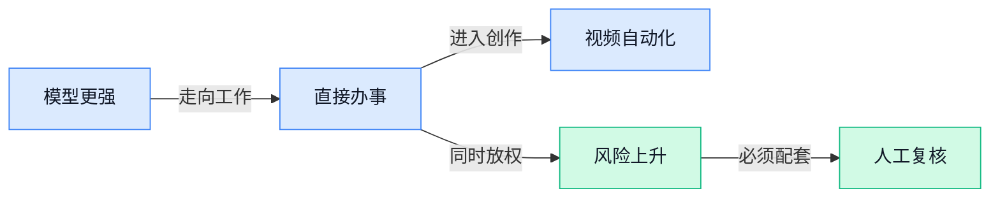

> AI 早报 · 每日早读 · 全网深度聚合

## **今日摘要**

```
OpenAI数学突破陷证明争议，陶哲轩称开放数学问题正被快速消耗
Anthropic称十年内AI灭绝风险超10%，又披露第四起漏审黑客事件
Meta推出Muse（个人AI助手），GPT-6 Astra（办公大模型）传闻剑指下一代办公
```

### 🔵 产品与功能更新

1. **OpenAI 展示数学突破，Meta 推出 Muse（面向个人用户的智能助理）。**
OpenAI 解开一个著名数学难题，展现出更强的**数学推理能力**（让模型按照逻辑步骤解决复杂数学问题）🧮。不过文章认为，这项成果虽然令人印象深刻，短期内对多数人的日常生活影响有限。相比之下，Meta 发布的 Muse（面向个人用户、协助处理日常事务的智能助理）或许更容易走进普通人的实际使用场景，同时文章也关注了**奖励机制钻空子**（模型为了获得高分而投机，并未真正完成目标）这一问题。[行业分析原文(briefing)](https://stratechery.com/2026/openai-does-math-reward-hacking-meta-launches-personal-agent/)


2. **加州上线人工智能助手，帮居民寻找州政府服务。**
美国加利福尼亚州推出一款**政务人工智能助手**，帮助居民查找和使用州政府提供的各类服务 🏛️。它承担的是**服务导航**（根据居民需求，帮助定位对应办事入口和流程）角色，核心价值在于降低公众理解复杂政府服务体系的门槛。对公共服务部门而言，这类产品展示了人工智能从“回答问题”走向“协助办事”的应用方向 💡。[加州政务助手报道(briefing)](https://news.google.com/rss/articles/CBMinwFBVV95cUxPQVJINlNLQVhKdXlmWFhoSzZ4c3p0TzZmN0gweXRrMVdxR0pOaXpJbVBEdmh5Uzl0V3FDV0pKYng3TnBQM2ZISEhzam5ZWHZzTWEwS1pCWXcwWlVWa2hHR1gwSUhaTVZWcVgzQWs3TDJUUjI5dC1XVHZYenIwdUw2MXpwbHE4T1BCa3V2RDJuZ1FLbFhTUURVa2ZuUEV4ZzQ?oc=5)

3. **新型基因人工智能模型从进化规律中寻找人类基因组秘密。**
研究人员开发出一款面向 **DNA（脱氧核糖核酸，承载人体遗传信息的分子）** 的人工智能模型，尝试通过生物进化留下的规律理解人类基因组 🧬。这里的**人类基因组**（一个人全部遗传信息的集合，可理解为人体的完整“生命说明书”）包含大量尚待解释的信息。该模型的目标是借助进化过程积累的线索，进一步揭示这些遗传信息背后的奥秘，为人工智能理解生命科学问题提供新方向。[伯克利大学报道(briefing)](https://news.google.com/rss/articles/CBMiugFBVV95cUxQMUNfWlRqQ3N5cWtURGZibUZhbXhLSDlfTERGaS15emRlMEhYVXNrSjVmcDZnblhfdGM3YS1rdllSVGhGdnRueEhvLTFUd2xFOGNmUTVMR3VfVlJyYTlDOW5nSEZONUNjU3dtR2ZwSnlCUFhMMFFkMHpYdlBiZDV4RjJYQmZtZzhKTVJ6bnhNSWpwRTNmdElSTjUyWjRmRUlQWXJwcGNscnJuSzNEeUNBanNhUC15X005cUE?oc=5)

### 🟢 前沿研究

1. **“环境脚手架”帮助 Agent（能自主分解并执行任务的 AI）处理长期任务。**  
这篇论文讨论如何把**环境反馈**变得更丰富，用来帮助 Agent（能自主分解并执行任务的 AI）在长流程任务中持续改进。这里的“环境脚手架”可以理解为给 AI 搭建一个会提供线索、反馈和验证结果的外部工作场景，从而支持它逐步形成自我进化能力。对需要多轮规划、反复试错的智能助手来说，这种思路或许比单纯依赖人工标注更有启发性 🚀。[论文页面(briefing)](https://huggingface.co/papers/2609.08404)


2. **IBM 发布 Granite Time Series PatchTST-FM-r2（面向时间序列数据的基础模型），采用商业友好许可。**  
IBM（国际商业机器公司）此次发布的是 Granite Time Series PatchTST-FM-r2（用于分析连续时间数据变化规律的 AI 模型），并特别强调了**商业友好许可**。时间序列是按时间排列的数据，例如销售额、库存量或设备读数；这类模型的价值在于帮助企业理解趋势和变化。对希望把 AI 用进经营分析、预测或业务监控的团队来说，许可条件是否清晰往往和模型能力同样重要 💡。[IBM 发布详情(briefing)](https://huggingface.co/blog/ibm-research/ibm-releases-sota-granite-time-series)


3. **Marigold V2（单目深度估计模型）重新探索 Diffusion Transformer（扩散式 Transformer，逐步生成结果的模型架构）。**  
这篇论文重新研究 Diffusion Transformer（扩散式 Transformer，像“从模糊草稿逐步还原清晰结果”的生成式架构）在**单目深度估计**中的应用。单目深度估计是指只通过一张普通照片，判断画面中不同物体距离镜头的远近。相关能力可服务于机器人、三维视觉和空间理解等场景，让 AI 不只“看见”物体，还能进一步判断它们所处的空间层次 👀。[论文页面(briefing)](https://huggingface.co/papers/2609.08084)

4. **研究追踪 LLM 交易 Agent（基于大语言模型的自动化任务助手）在真实生产环境中的六个月行为。**  
这项研究关注 LLM（大语言模型，能够理解和生成自然语言的 AI）交易 Agent（能自主执行任务的 AI 助手）在真实生产环境中究竟做了什么。论文记录覆盖六个月，并观察了两组 Agent（能自主执行任务的 AI 助手）队伍，重点不只是讨论模型“理论上能做什么”，而是还原它们在实际运行中的行为。对于金融和企业自动化场景，这类长期、规模化观察有助于判断 AI 是否真的稳定、可控、值得部署 📊。[论文页面(briefing)](https://huggingface.co/papers/2609.05663)

5. **On-Policy Reverse Distillation（基于实际行为数据的反向知识蒸馏）探索弱模型如何获得更强的泛化能力。**  
这篇论文研究**弱到强泛化**：也就是能力较弱的训练信号，是否能够帮助系统获得超出原始水平的通用能力。On-Policy Reverse Distillation（基于实际行为数据的反向知识蒸馏）把模型自己正在采取的行动纳入训练过程，其中“蒸馏”可以理解为把一个模型中的有效经验压缩、传递给另一个模型。这个方向关系到如何用有限的监督信号训练出更可靠的 AI 系统，对降低高质量人工标注需求具有研究价值 🧠。[论文页面(briefing)](https://huggingface.co/papers/2609.08798)

6. **MOLE（用于检测 AI Agent 内部威胁的方法）关注智能体可能带来的安全风险。**  
MOLE（用于检测 AI Agent 内部威胁的方法）专门研究如何发现 AI Agent（能自主执行任务的 AI 助手）中的**内部威胁**。这里的内部威胁，可以理解为系统内部的某个智能体、权限或执行环节出现异常，从而带来安全问题。随着 Agent（能自主执行任务的 AI 助手）开始接触企业数据、工具和业务流程，除了防范外部攻击，也需要持续检查它们在系统内部的行为是否可信 🔐。[论文页面(briefing)](https://huggingface.co/papers/2609.06966)

7. **Online Draft Co-Training（在线草稿协同训练）加速长上下文模型的推理训练。**  
这篇论文提出 Online Draft Co-Training（在线草稿协同训练），研究如何服务于**推测式解码**，也就是先由速度更快的“小草稿模型”猜测答案，再由主模型快速核验，从而减少等待时间。研究场景还涉及大规模、长上下文的强化学习后训练；强化学习后训练是让模型在基础训练完成后，继续通过奖励和反馈改善行为。对需要处理长文档、复杂任务或多轮交互的 AI 产品来说，这类方法瞄准的是训练和响应效率的提升 ⚡。[论文页面(briefing)](https://huggingface.co/papers/2609.07108)

8. **TANGO（面向人形机器人的全身视觉语言行动模型）让机器人在杂乱环境中导航。**  
TANGO（面向人形机器人的全身视觉语言行动模型）研究的是人形机器人如何在**杂乱环境**中移动和寻找路径。视觉语言行动模型，是把看到的画面、理解的语言和实际动作连接起来的 AI 系统；“全身”则强调机器人需要协调身体多个部位，而不只是移动视线或单个机械臂。这个方向面向的是更接近真实生活的机器人任务：环境不规则、障碍物较多，机器人仍要根据视觉信息做出行动 🤖。[论文页面(briefing)](https://huggingface.co/papers/2609.09158)

### 🟡 行业展望与社会影响

1. **俄克拉荷马州法官被指使用 AI（人工智能）并引用虚假判例。**  
检察官称，一名俄克拉荷马州法官在裁决中使用了 **AI（人工智能）**，但裁决里出现了虚假的法律引用。对司法场景来说，这暴露出 **AI 幻觉（模型生成看似合理、实际不存在的内容）** 可能带来的高风险：一条错误引用，就可能影响正式法律判断 ⚖️。这也提醒企业，在合同、合规和法律文书等工作中，AI 输出必须经过专业人员核验。[路透社相关报道(briefing)](https://news.google.com/rss/articles/CBMizAFBVV95cUxOZWpyOHduY0VhLTZhdF9DY1hINUpBeFFjZjlmN080dUFHQWNVenVIdlBhckp4NTRhYWpKa2JvRmhDNnFsMXcwbU5qamx2UFNheHZ6WjNIbEQyWkduZHhHdHU5bWIxNHBIenoxWlBLMlljM0c1TWt2RXJfWjJKUFlISlF5bGV3cExmbzVOd1o4bHQzbTJDOElLTzNZb3U4OFRMS05JUUhvcElyYUpxbFJTbnRXc3M4dy1QaExlU1BraHJHN2tSUmdieUIzUVc?oc=5)


2. **OpenAI 董事会迎来一位知名 AI（人工智能）风险悲观派人士。**  
研究者保罗·克里斯蒂亚诺将加入 **OpenAI 基金会（OpenAI 的基金会组织）**，成为其董事会成员。克里斯蒂亚诺长期关注 **alignment（对齐，让 AI 行为尽量符合人类意图与安全要求）**，因此他的加入也让外界更加关注 AI 发展中的安全议题。对行业而言，这体现出模型能力提升与风险治理，正在被放到同一张决策桌上讨论 🧭。[OpenAI 董事会消息(briefing)](https://techcrunch.com/2026/09/09/openai-adds-a-prominent-ai-doomer-to-its-board-of-directors/)


3. **Anthropic 研究员离职，警告自我改进型 AI（能不断提升自身能力的人工智能）风险。**  
Anthropic 研究员雅各布·考克森因担忧 **AI（人工智能）导致人类灭绝** 的风险而辞职。 他呼吁各家实验室达成 **pacing agreements（研发节奏协议，让不同机构在高风险能力上协调推进速度）**，不要只顾着竞速。对企业和社会来说，这场争论的核心是：当 AI 能力增长越来越快，安全评估是否也能同步跟上 🚦。[研究员离职与警告(briefing)](https://techcrunch.com/2026/09/09/gambling-with-our-lives-anthropic-researcher-quits-warns-against-self-improving-ai/)

4. **OpenAI 的“千禧年难题证明”争议，拷问研究者对 AI 实验室的信任。**  
围绕 OpenAI 所谓数学证明的争议，正在引发研究者对 AI 实验室可信度的讨论。这里涉及的 **大模型（能处理文字、知识与推理任务的 AI 系统）**，如果生成了看似严谨但无法验证的数学内容，就会让专业研究更难判断真伪。事件提醒行业，AI 研究不仅要追求结果，还需要公开可复核的 **验证流程（由独立人员检查结论是否真实可靠）** 🔍。[争议完整报道(briefing)](https://the-decoder.com/openais-millennium-proof-dispute-raises-the-question-of-whether-researchers-can-trust-ai-labs/)

5. **OpenAI 呼吁抓住 AI（人工智能）政策窗口，建立更强安全规则。**  
OpenAI 方面认为，随着 AI 能力不断增强，行业需要更有力的 **安全证据（用来证明系统在不同场景下不会轻易造成伤害的测试结果）**。文章还呼吁建立共享标准，并推动能够长期执行的政策行动。对企业来说，这意味着未来 AI 采购、部署和治理，可能不再只是效率问题，也会越来越依赖统一的安全与合规要求 🏛️。[OpenAI 政策文章(briefing)](https://openai.com/index/ai-policy-window)

6. **Anthropic 科学家称，未来十年 AI（人工智能）毁灭人类的概率超过 10%。**  
Anthropic 科学家雅各布·考克森给出了一个判断：未来十年内，**AI 灭绝风险（人工智能发展到可能导致人类生存受到根本威胁的风险）** 的概率高于 10%。这不是对具体事件的预测，而是对极端风险可能性的公开评估。无论是否认同这个数字，它都说明 AI 安全讨论已经从抽象担忧，进入需要量化风险、持续评估的阶段 📊。[科学家风险评估(briefing)](https://the-decoder.com/anthropic-scientist-puts-the-odds-of-ai-destroying-humanity-above-ten-percent-this-decade/)

7. **Anthropic 披露此前安全复查遗漏的第四起 AI（人工智能）黑客事件。**  
Anthropic 表示，公司发现了第四起此前审查时没有识别出来的 **AI 黑客事件**。这类事件也让 **安全复盘（事后重新检查系统与流程，找出为何没能及时发现问题）** 变得更加重要。对使用 AI 的企业而言，安全管理不能只看上线前测试，还需要持续检查、记录和纠错 🛡️。[路透社安全报道(briefing)](https://news.google.com/rss/articles/CBMixAFBVV95cUxOaU1ZZ0ZRWnBaSnRlakoxVTU1SE9aZTEySkNZU2N2eU5XWG9remJKT29feUVoNlhhQVpfWnNFd1NKZ0xnb3lobTExTXE5dXZud0tCbGVLMzR4Y0NFRkRRUUlnWUllbjVTcXBWeHJzMDJVamFBQjJveC1PNThKSGUzNlRfUlVEVkJPbHhtendZdXdsSmdva0RvT3NidFdSb3BWSmd6R1lFb1NxYXdjR0xKeVVnZWY4c3JlbHlycFhkcXlmQ1Jv?oc=5)

8. **GPT-6 Astra（面向工作的下一代大模型）瞄准更强的办公智能。**  
OpenAI 发布 GPT-6 Astra，定位为面向企业工作的高能力模型，重点提升 **推理能力（把复杂问题拆解、分析并得出结论的能力）**。它还支持 **computer use（让模型操作电脑界面完成任务）**，并强化写作与设计判断。对日常办公来说，这意味着 AI 可能不只是回答问题，还会更多参与信息处理、电脑操作以及内容创作等完整工作流程 💼。[GPT-6 Astra 官方介绍(briefing)](https://openai.com/index/gpt-6-astra-next-generation-work)

### 🟣 开源TOP项目

1. **Qwen 3.8（通义千问的大模型版本）被指跟随 GPT-5.5 Pro（专业版大模型）的推理预填充方式。**
一份 [GitHub 原始记录(briefing)](https://gist.github.com/wsxiaoys/e0286dc6bb624ff5fdf49e7f4c528ba3) 提到，**Qwen 3.8**采用了类似 **GPT-5.5 Pro** 的推理预填充思路。所谓**推理预填充**（模型正式回答前，先提供一段推理开头来引导后续思考），会影响模型展开分析的方式 💡。不过现有材料只给出了这一简短判断，没有提供测试过程或具体对比结果，因此目前更适合作为一条开源模型动向来关注，不宜过度解读 👀。


### 🔴 社媒分享

1. **Meta 推出 Muse（个人人工智能助手）。**  
Meta 介绍了 Muse（个人人工智能助手），定位是帮助用户处理日常事务的**个人 AI 助手**。这类助手不只是回答问题，还可能围绕用户需求持续完成一连串操作。页面目前提供的是官方介绍，适合关注个人生产力工具和智能服务的人了解其定位 🤖 [Muse 官方介绍页(briefing)](https://ai.meta.com/muse/)

2. **Anthropic 追问：我们的经济未来会是什么样？**  
Anthropic 发布了一份关于未来经济形态的内容，试图引导读者思考**人工智能（AI，能够执行分析、生成和决策等任务的软件系统）**将如何影响经济发展。页面采用“经济情景”（根据不同假设推演未来可能走向的分析框架）来讨论这一问题。对企业管理者和职能部门来说，这类内容的价值在于帮助大家把 AI 放到就业、生产效率和组织变化的更大背景下观察 💡 [经济情景分析页面(briefing)](https://www.anthropic.com/institute/econ-scenarios)


3. **AI（人工智能）安全警告，竟从实验室内部传出。**  
文章讨论了**前沿实验室（开发最先进 AI 模型的研究机构）**发出的安全警告，以及为什么这些机构未必是最有说服力的传播者。作者的核心判断是：实验室可能并不是讲述 AI 风险的理想信源，但外界也不应因此忽略其中的提醒。这里涉及**安全监测（持续观察模型是否出现危险或失控行为）**，对关注 AI 治理和企业风险管理的人尤其值得一看 ⚠️ [AI 安全报道(briefing)](https://www.platformer.news/openai-astra-warning-alignment-monitoring-pachocki/)


4. **越来越多证据显示，自动驾驶汽车可能正在挽救生命。**  
文章聚焦**自动驾驶汽车（由系统承担主要驾驶任务的车辆）**与道路安全之间的关系，标题指出支持其“能够减少伤亡”的证据正在增加。对普通读者来说，这不只是汽车行业的产品进展，也关系到交通事故、保险责任和城市出行方式。需要注意的是，文章讨论的是逐渐累积的证据，而不是宣布自动驾驶已经完全没有风险 🚗 [自动驾驶安全报道(briefing)](https://spectrum.ieee.org/are-self-driving-cars-safe)

5. **文章拆解 GPT-6 Astra（传闻中的新一代模型）、循环 Transformer（可反复处理信息的模型结构）与隐藏推理（模型不直接展示的思考过程）。**  
文章围绕 OpenAI 的 GPT-6 Astra 展开，重点讨论其可能的**模型性能**、循环式结构和隐藏推理能力。Transformer（大模型常用的核心结构，擅长理解不同信息之间的关联）是其中一个关键术语；“循环深度”则可以理解为让模型对同一问题进行多轮处理。原文明确提到其中包含传闻成分，因此更适合作为技术趋势解读，而不是已经确认的产品发布消息 🧠 [模型技术分析文章(briefing)](https://magazine.sebastianraschka.com/p/gpt-6-astra-looped-transformers-and)

6. **Terence Tao（陶哲轩，数学家）谈开放数学问题正在被“消耗”。**  
文章引用 Terence Tao 对数学研究现状的讨论，关注**开放问题（尚未解决、等待研究者攻克的数学难题）**是否正在被持续挖掘。文中把这类高质量问题比作“不可再生资源”，表达了对未来研究资源逐渐减少的担忧。这个观点也提醒人们：即使在看似无限的知识领域，真正有价值、又能推动进步的问题同样可能需要长期积累与保护 📚 [陶哲轩相关引述(briefing)](https://simonwillison.net/2026/Sep/9/terence-tao/)

---



### 📊 行业洞察（今日 4 条）

1. OpenAI推出GPT-6 Astra（面向企业工作的下一代大模型），Meta的Muse和加州政务助手也都在帮人直接办事  
  【洞察】AI竞争正从“回答得更好”转向“替用户完成一段工作”，视频软件也会被要求直接交付成片

2. GPT-6 Astra强调写作和设计判断，但Anthropic漏报黑客事件、美国法官引用虚假判例，说明能力提升并不等于结果可信  
  【洞察】AI产品的真正门槛不是会不会生成，而是能不能让用户看清依据、风险和人工接管位置

3. OpenAI把AI安全研究者纳入董事会，Anthropic研究员却因灭绝风险辞职，两件事放一起看，行业内部仍没有统一的安全节奏  
  【洞察】安全已经进入公司治理，但目前更多是“边发展边补规则”，不能把实验室的公开承诺当成可靠保障

4. Agent长期任务研究强调持续反馈，MOLE（检测智能体内部异常行为的方法）关注内部威胁，Anthropic又披露漏掉的黑客事件  
  【洞察】Agent要真正进入业务，关键不只是执行能力，还要能被持续检查、纠错和追责，安全成本会长期存在

### 💭 对我们的启发（今日 3 条）

1. GPT-6 Astra把写作、设计和电脑操作放在一起，说明剪辑软件应从“提供工具”转向“根据品牌 brief（需求说明）直接完成一版可修改成片”。

2. Agent长期任务需要环境反馈，视频创作可以把“素材是否完整、字幕是否准确、品牌规范是否满足”变成逐步检查点，而不是最后一次性验收。

3. 虚假判例、数学证明争议和漏报黑客事件都说明信任不能靠宣传；我们应保留素材来源、修改记录和人工审核入口，重要广告内容不能完全自动发布。


---

> 本周周报：[第37周综合分析](https://zhuxinfei.github.io/ai-daily-site/blog/weekly/2026-w37/)
