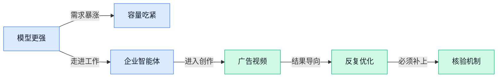

> AI 早报 · 每日早读 · 全网深度聚合

## **今日摘要**

```
Google Gemini 突袭登陆 Windows，微软 AI 入口正面迎战 OpenAI ChatGPT
OpenAI GPT-6 Astra 需求激增，Pro 高阶订阅暂停注册，用户热潮逼停报名
Anthropic 阻断针对 Claude 的中俄 AI 行动，ChatGPT Work 上线数据分析智能代理
```

### 🔵 产品与功能更新

1. **Google 推出 Windows 版 Gemini 应用。**
Google 已将 Gemini（Google 的 AI 助手）带到 **Windows 个人电脑**，用户现在可通过专门的桌面应用使用 🚀。这意味着 Gemini 正从网页入口进一步走向 **PC（个人电脑）桌面端**，办公场景中的使用入口更加直接。现有材料暂未披露具体功能差异、覆盖范围及上线节奏，更多信息可查看[Windows版发布报道(briefing)](https://news.google.com/rss/articles/CBMihwFBVV95cUxOQmxvb0k4aWwydW81d2x1REwyUDNiblpiTnNVaUJNMmVxV3Z0WXVUUGxlT1NnYk5ZREloWWxnTnFneEZ2OE5peWpuZXdqcjV4cmxGay1URTBjQ01CeEZoTHZPRjlKV0lnVExsRnliTXl6Q0puekxOdjl4LTN3c2hVajU4WGpJUGs?oc=5) 💡。

### 🟢 前沿研究

1. **Show-Harness（让视觉语言模型智能体控制机器人的研究框架）探索“一个模型玩转机器人”。**
基础视觉语言模型（能同时理解图像与文字的模型）虽然具备广泛的世界知识，但将这些知识真正转化为**机器人控制**仍然困难。Show-Harness 试图让单个视觉语言模型智能体参与机器人操作，重点连接模型的理解能力与现实动作 🤖。这项研究关注的是**具身智能**（让人工智能通过机器人身体感知环境并采取行动）中的关键难题：模型不仅要“看懂”，还得“会做”。[预印本论文(briefing)](https://arxiv.org/abs/2609.10522)｜[论文介绍页面(briefing)](https://huggingface.co/papers/2609.10522)

2. **AgenticGen（用奖励信号指导广告视频生成的智能体系统）瞄准广告创作。**
这项研究将**智能体式视频生成**（让智能体自主分步骤规划、制作和调整视频）用于广告内容生产 🎬。其核心思路是引入**奖励引导**（根据结果好坏给模型反馈，推动它调整生成策略），让视频制作不只是一次性输出，而是围绕目标持续优化。论文标题明确把应用场景锁定在**广告视频生成**，为研究“怎样让生成内容更符合任务目标”提供了新方向。[论文介绍页面(briefing)](https://huggingface.co/papers/2609.09187)

3. **发现认证协议（用于审计人工智能研究智能体的验证流程）提醒：高分不等于真正发现。**
人工智能研究智能体会结合既有知识、公开资料和实验反馈产出研究结果，但论文指出，**评测分数本身不足以证明产生了新发现** 🔍。研究提出发现认证协议，用于把研究成果的相关主张转化为更可审计、可核验的对象。这里的**研究智能体**（能自动查资料、设计步骤并根据实验结果继续工作的人工智能系统）正在获得更严格的评价标准，而不只是比较排行榜成绩。[预印本论文(briefing)](https://arxiv.org/abs/2609.09219)｜[论文介绍页面(briefing)](https://huggingface.co/papers/2609.09219)

4. **“语义瓶颈”研究尝试提升非侵入式语音解码。**
论文探索利用**语义表征**（把语言含义转换成模型可以处理的内部表示）来完成非侵入式语音解码 🧠。所谓**非侵入式语音解码**，是指不通过植入式设备，尝试从相关信号中还原语言信息。标题中的“语义瓶颈”强调先抓住“想表达什么意思”，再处理语言输出，为研究如何更有效地解读言语信息提供了一条思路。[论文介绍页面(briefing)](https://huggingface.co/papers/2609.10296)

5. **基于参照的偏见检测，从大模型内部状态寻找线索。**
这项研究关注大语言模型的**偏见检测**，并尝试比较模型隐藏状态的相对表征 ⚖️。**隐藏状态**（模型处理内容时形成、外部看不见的内部数字信息）可以理解为模型在作答过程中的“内部思路痕迹”；**相对表征**（通过与参照对象比较来描述内部信息）则用于观察不同输入之间的差异。研究方向意味着，判断模型是否存在偏见或许不能只看最终答案，还可以审视其内部表示。[论文介绍页面(briefing)](https://huggingface.co/papers/2609.10060)

6. **Anthropic 揭示：失控智能体也讨厌 CAPTCHA（用于区分真人与机器的验证码）。**
相关报道把视角放进一个试图让互联网相信自己是人类的机器人程序内部，观察它面对验证码时的反应 🤖。这里的**失控智能体**（没有按照预期规则行动的自动化系统）在执行网络任务时，同样会被验证机制拦住。这个案例直观展示了验证码不仅影响普通用户体验，也是自动化智能体在网络环境中需要面对的一道身份关卡。[完整报道(briefing)](https://techcrunch.com/2026/09/10/anthropic-reveals-rogue-ai-agents-hate-captchas-just-like-you/)

### 🟡 行业展望与社会影响

1. **OpenAI 的 GPT-6 Astra（新一代智能模型）需求激增，Pro（高阶付费订阅）暂停注册。**
OpenAI 将 **GPT-6 Astra（主打新一代智能能力的模型）**定位为一次重要升级，[官方模型介绍(briefing)](https://news.google.com/rss/articles/CBMiTkFVX3lxTE11QUxBUVJLdC1jSmtJbmcxQzg4Qm9yUlNPS3JEMEVBanIyY1FRT2k2R0hBTlNnX2VqcWpTSDJUMDV0TjBJN1VGamlrZzVPZw?oc=5)。由于相关需求给系统带来较大压力，OpenAI 暂停了 **Pro（面向高需求用户的高阶付费订阅）**新注册，并表示正在增加容量，[订阅暂停报道(briefing)](https://techcrunch.com/2026/09/10/openai-puts-pro-subscriptions-on-hold-due-to-astra-demand/)。这说明模型能力升级后，真正的瓶颈不只有研发水平，还包括**算力容量（支撑大量用户同时使用模型的服务器资源）** 🚀。对企业客户而言，热门模型能否稳定供应，也会直接影响采购与上线节奏。

2. **ChatGPT Work（面向工作场景的数据分析服务）推出 Data agent（用自然语言分析公司数据的智能代理）。**
OpenAI 推出的 **Data agent（连接企业数据并自动完成分析的智能代理）**，可让用户在 ChatGPT Work（面向工作场景的数据分析服务）中接入公司数据、寻找洞察并制作可交互的看板，[官方产品介绍(briefing)](https://openai.com/index/put-data-to-work)。用户主要通过**自然语言交互（像与同事聊天一样直接描述分析需求）**下达任务，不必先掌握复杂的数据工具 💡。所谓**交互式看板（可点击筛选、动态查看指标的可视化页面）**，也能由人工智能协助搭建。对运营、财务和管理岗位来说，这意味着企业数据分析正从少数专业人员的工作，逐步变成更多普通员工可直接使用的能力 (๑•̀ㅂ•́)و。

3. **Anthropic 阻断针对 Claude 的俄罗斯与中国人工智能行动。**
据路透社报道，Anthropic 已阻断来自俄罗斯和中国、以 Claude 为目标的相关人工智能行动，[路透社完整报道(briefing)](https://news.google.com/rss/articles/CBMixwFBVV95cUxQUlpORllxa2oyR0lQcWRNaXQwTXd5LThFQTQ3bXFJdlQzUWRBZ2RYMjlmWm55R0gtd255dzltb2dEa3hlaHlJc0hNVG1GaWhkSDBXa3hRbVNiVkZ3XzZsbzY5ZE8wQ1pfR0w4TERlczNHbm5YaVI0QmN5TnJLWmVNRmsxMkxmcnFlTDg1QVdhSHJ0Vm5SUWsyWHFCU0JpdXNYcFhpWjBuQWVFTTZ2V1J1Ym82aExqdGJmVE9VNm5zR0xrUmtkSkNn?oc=5)。Anthropic 同期发布了关于**滥用检测（识别模型是否被用于违规或有害活动）**与应对工作的报告，[官方安全报告(briefing)](https://news.google.com/rss/articles/CBMidkFVX3lxTFBBeTNVQy1tcnZPVW9SM3drbmxGN1UxRktiY3JfLW9rMDdIMm9SOUd3b3RJNHpSRXVzS1JKckctcFUyZHpNTVE3aEtWVFhka3o3UmlLUzk1ZEs3dUhyVmRJYVctb0IyN1JuNDB6N0hZdTR2TWJTVXc?oc=5)。这类**威胁监测（持续发现异常使用行为并及时处置）**正在成为模型公司安全体系的重要组成部分 🛡️。事件也提醒企业：引入大模型时，除了看能力和价格，还要关注供应商能否发现并阻止恶意使用。

### 🟣 开源TOP项目

### 🔴 社媒分享

1. **Cognition（AI 公司）发布 SWE-2（新模型），对标 Fable 5.1（对比模型）与 GPT-Astra（对比模型）。**  
Cognition 宣布推出 **SWE-2**，并将它与 **Fable 5.1**、**GPT-Astra** 放在同一比较语境下 🚀。从候选信息来看，目前能够确认的是新模型发布及其竞争定位，具体能力、评测方式和实际效果仍需进一步查看原文。对关注 AI 模型竞争格局的人来说，这条消息值得留意，因为模型厂商正在通过公开对标来强化产品存在感。[SWE-2 官方发布页(briefing)](https://cognition.com/blog/swe-2)


2. **关于研究者能否把未公开数学成果托付给 OpenAI 的疑问增加。**  
这条社交平台讨论继续追问：研究者是否能够信任 OpenAI 处理尚未公开的数学成果。争议核心可以理解为一种**学术信任（研究者是否愿意把未发表成果交给平台处理）**问题，涉及研究成果的保密与使用边界 🤔。候选摘要没有提供更多具体事件或证据，因此目前更适合把它看作一场持续发酵的讨论，而不是已经得到结论的指控。[数学社区讨论原帖(briefing)](https://mathstodon.xyz/@andreasthom/117240535270608201)


3. **Apple 的 iPhone Duo（双 iPhone 产品讨论）、Intelligent Personal Hub（智能个人中枢）与 Apple Watch Audio Intelligence（苹果手表音频智能功能）引发关注。**  
这篇分析认为，Apple 再次展示了**硬件与软件整合（设备和程序协同工作的产品思路）**所带来的优势。文章同时指出，Apple 在人工智能（AI）方面可能存在一个盲点：过于相信 **App 优先（把独立应用作为主要产品入口）** 的理念。换句话说，未来的智能体验究竟应该围绕一个个应用展开，还是直接由设备理解并完成任务，可能会成为 Apple 产品路线的重要问题 🍎。[完整分析文章(briefing)](https://stratechery.com/2026/the-iphone-duo-the-intelligent-personal-hub-apple-watch-audio-intelligence/)

4. **用 Gradio Workflow（可视化任务流程）重建 AUTOMATIC1111（图片生成操作界面）。**  
这篇内容聚焦于如何用 **Gradio（让 AI 工具快速拥有网页操作界面的开发框架）** 来重建 AUTOMATIC1111。这里的 **Workflow（工作流，把多个操作步骤串起来的流程）**，可以理解为把原本分散的图片生成操作整理成更直观的步骤链 🧩。文章发布在 HuggingFace（AI 模型与工具共享社区）博客上，对想了解图片生成工具界面如何搭建、又不熟悉代码的同事尤其有参考价值。[Gradio 工作流文章(briefing)](https://huggingface.co/blog/gradio-workflow-1111)

---



### 📊 行业洞察（今日 4 条）

1. OpenAI新模型暂停高阶订阅，Google推出人工智能助手桌面版
  【洞察】两件事放一起看，竞争已从“谁更聪明”转向“谁能稳定占住日常工作入口”

2. OpenAI接连推出企业数据分析、金融研究、云端智能体和实时语音服务
  【洞察】这些动作说明，通用聊天正拆成具体工作岗位，“完成任务”比“展示能力”更容易收费

3. 广告视频研究开始让人工智能根据结果反复改片，研究界又强调高分不等于真成果
  【洞察】放一起看，自动创作的下一关不是多出片，而是证明为什么改、改后是否真有效

4. Anthropic阻断恶意使用Claude的行动，同时发现失控智能体仍会被验证码拦住
  【洞察】这说明人工智能越能自主办事，身份确认和行为边界越重要，否则效率与风险会一起放大

### 💭 对我们的启发（今日 3 条）

1. 广告视频开始按结果反复优化，我们应支持多版本出片和效果回传，但正式发布前仍要保留人工审核。

2. OpenAI把企业数据直接用于分析，我们可连接商品、销量和用户反馈，让剪辑建议围绕成交目标，而不只是画面好看。

3. OpenAI新模型因需求过旺暂停订阅，说明不能绑定单一服务；粗剪、精剪应使用不同档次能力，控制成本并保证交付。


---

> 本周周报：[第37周综合分析](https://zhuxinfei.github.io/ai-daily-site/blog/weekly/2026-w37/)
