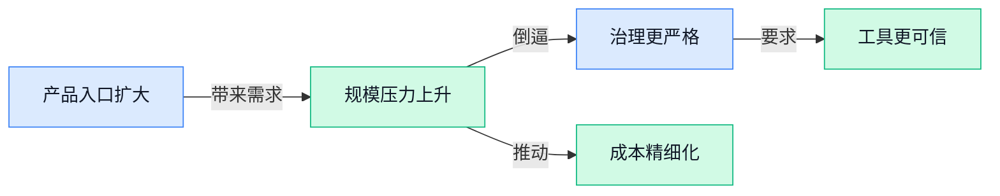

> AI 早报 · 每日早读 · 全网深度聚合

## **今日摘要**

```
Google终于推出Windows版Gemini应用，OpenAI上线面向金融行业的ChatGPT专版
Anthropic卷入订阅权益集体诉讼，Claude仅向18岁以上用户开放，15亿美元和解分配再起争议
OpenAI为超10亿ChatGPT用户扩容在线存储，Codex联手ChatGPT从基因组发现新型抗菌分子
```

### 🔵 产品与功能更新

1. **Google 终于推出 Windows 版 Gemini 应用。**
Google 正式把 Gemini 带到 Windows，补上其在这一主流电脑平台的产品入口 🚀。这是**桌面应用**（安装在电脑上、可直接打开使用的软件），意味着 Windows 用户多了一个使用 Gemini 的专门渠道。对企业而言，此举也让 Gemini 进一步进入**办公系统生态**（围绕电脑系统形成的软件与服务环境），方便其触达更多日常办公人群 💡。[Windows 版发布报道(briefing)](https://news.google.com/rss/articles/CBMioAFBVV95cUxPR0NIUU1JaHBLa1RxdEhiTGJoMm0tc3dsY0RnMlBVM0p0QnBKa0xRcEpaWDBUTVR6YzB5SkRrTDNKYmEtWTQzYzUxQjc4T1Q0YW9wQmNPVk1oY1JWWXpia1djUGxtMmdGMUViYjRKU1JoZ2g4RWNwendDVUZ5U0thNExabHpxV1pZeXZqVTFHSjJDZmkyb0t2d3ltZl9TT0tj?oc=5)

2. **OpenAI 推出 ChatGPT 金融服务版（面向金融行业的专门产品）。**
OpenAI 正式发布面向**金融服务行业**的 ChatGPT 产品，开始把通用助手进一步带入专业业务场景 🚀。这类**行业专用产品**（针对某个行业的工作特点进行设计的产品）与普通聊天工具不同，重点是服务更明确的职业人群和工作环境。此次发布也体现出 ChatGPT 正从大众化工具向**垂直行业应用**（专门服务金融、医疗等特定领域的应用）继续延伸，金融从业者将成为其新的重点用户群体 💡。[金融服务版发布报道(briefing)](https://news.google.com/rss/articles/CBMieEFVX3lxTE01Mi1EeGVoYl80ZEZDYWxjZ05DNl9hV2drRE1YZjcwQXowaU1YUlJPc1RvTmh2TV9RX0ZLem1nbk54TGpWRTNyTnJXR2V3U09CM1puNmEzRHVUdEdIejI5dGRidmMxMll1c2oxR2J5Rzc0ZEhISVJ0dQ?oc=5)

### 🟢 前沿研究

1. **Nemotron（英伟达的大模型系列）探索通往 IMO 金牌（国际数学奥林匹克竞赛最高级别成绩）的开放训练方案。**  
这篇研究聚焦如何训练 **Nemotron（英伟达的大模型系列）**，让模型更好地处理国际数学奥林匹克竞赛题目。所谓“开放配方”，可以理解为把模型训练过程中的关键思路和步骤公开出来，方便研究者复现与改进 🧠。目前候选信息主要给出了研究主题，具体训练数据、方法和成绩仍需查看论文原文。[论文页面(briefing)](https://huggingface.co/papers/2609.10712)

2. **Generative Reward Models（生成式奖励模型）让自动形式化不只看“解题器判定”。**  
这项研究讨论 **autoformalization（自动形式化，把自然语言数学题转换成计算机可验证的数学表达）** 中的一个关键问题：数学解题器只能判断形式表达式是否成立，却未必能发现它有没有准确保留原问题的含义。研究提出用 **Generative Reward Models（生成式奖励模型，让模型像评审一样给出质量判断和反馈）**，补足单纯“对/错”判定的不足。对数学推理系统来说，这意味着评价标准可能从“结果能不能算出来”扩展到“翻译得是否忠实” 📐。[arxiv 论文(briefing)](https://arxiv.org/abs/2609.11085) 另见[论文项目页(briefing)](https://huggingface.co/papers/2609.11085)

3. **SenseNova-U1.5（商汤推出的统一视觉智能模型）瞄准更原生的视觉理解。**  
SenseNova-U1.5（商汤推出的统一视觉智能模型）关注 **unified visual intelligence（统一视觉智能，让同一个模型协同处理多种视觉任务）**。从标题来看，这项工作并非只针对单一图片识别，而是探索让模型具备更一体化的视觉能力。对于产品团队而言，这类研究可能影响图像理解、视觉问答和多模态助手等方向，但候选材料没有提供具体指标和应用案例 👀。[论文页面(briefing)](https://huggingface.co/papers/2609.11929)

4. **NCP-ArchPreview（下一概念预测架构预览）探索“概念级”语言模型。**  
这份技术报告提出 **Next Concept Prediction（下一概念预测，即预测接下来要表达的意思，而不只是逐字预测）**，尝试把语言模型从文字序列推进到 **latent space（潜在空间，模型内部用来表示抽象概念的“思维草稿区”）**。传统模型通常按一个个词或词片段生成内容，而概念级预测更像是先规划“下一步想表达什么”，再组织成具体文字。若这一方向成熟，可能为更高效、更连贯的语言生成提供新思路，不过当前材料未说明其具体效果和落地场景 💡。[论文页面(briefing)](https://huggingface.co/papers/2609.10715)

5. **Negative Self-Distillation（负向自蒸馏）让模型通过避开错误来学习推理。**  
这项研究探索一种不同于传统自我提升的训练思路：模型不只学习哪些答案是好的，也学习识别和避开推理中的缺陷。**Self-Distillation（自蒸馏，让模型利用自身生成的信息反过来训练自己）** 可以理解为“自己给自己讲题”，而负向版本则进一步关注错误示范和失败路径。研究背景还涉及 **On-Policy Self-Distillation（在模型自身生成结果上进行的自蒸馏）**，目标是让大模型的推理过程更可靠，而不只是碰巧得到正确答案 🧩。[arxiv 论文(briefing)](https://arxiv.org/abs/2609.11699) 另见[论文项目页(briefing)](https://huggingface.co/papers/2609.11699)

6. **研究人员用 Codex 和 ChatGPT 从基因组中寻找新型抗菌分子。**  
César de la Fuente 的实验室正在使用 Codex 和 ChatGPT，搜索现存及已灭绝生物的 **genome（基因组，即生物遗传信息的完整“说明书”）**，寻找可用于对抗耐药感染的抗菌候选分子。这里的核心价值不只是让人工智能回答问题，而是把它用于扩大科研人员筛选生物信息的范围。若候选分子后续得到实验验证，这类工作可能为抗菌药物研发提供新的探索路径 🧬。[OpenAI 官方案例(briefing)](https://openai.com/index/using-codex-chatgpt-to-search-for-new-antimicrobials)

### 🟡 行业展望与社会影响

1. **OpenAI 探讨“共同放缓人工智能发展”，并将议题带到国会。**  
OpenAI 正把**人工智能发展速度是否需要集体放缓**这一议题带入美国国会讨论，核心涉及行业增长与公共治理之间的平衡 🏛️。这里的“共同放缓”并不等于停止研发，而是意味着企业、监管者和政策制定者可能需要重新讨论发展节奏与安全边界。对企业来说，这类讨论可能影响未来的**监管要求、产品上线节奏和合规成本**。[完整报道(briefing)](https://the-decoder.com/openai-floats-a-shared-ai-slowdown-takes-it-to-congress/)


2. **Anthropic 面临集体诉讼，被指夸大 Claude 订阅权益。**  
Anthropic 遭遇**集体诉讼（多人因相似原因联合起诉）**，原告指控其在 Claude 订阅中使用具有误导性的**使用量倍数（用数字显示用户可获得多少使用额度）**。如果相关指控成立，争议可能影响人工智能产品如何展示套餐权益、使用上限和计费规则 ⚖️。对普通用户和企业客户而言，订阅页面是否清楚说明“能用多少、怎么计算”，将成为越来越重要的信任问题。[诉讼事件报道(briefing)](https://the-decoder.com/class-action-lawsuit-accuses-anthropic-of-overselling-claude-subscriptions-with-deceptive-usage-multipliers/)


3. **深度学习先驱 Bengio 认为，人工智能的训练过程本身可能带来危险。**  
深度学习（让模型通过大量数据逐步学会识别规律的训练方式）先驱 Bengio 提出，人工智能的风险可能不只来自最终用途，也可能隐藏在**训练过程**本身 🤖。这意味着，单纯在产品发布前做安全检查，未必足以覆盖模型成长过程中形成的潜在问题。对行业而言，这一观点会把安全讨论从“模型上线后怎么管”进一步推向“模型在训练时如何被塑造”。[观点报道(briefing)](https://the-decoder.com/deep-learning-pioneer-bengio-argues-the-training-process-itself-makes-ai-dangerous/)


4. **Anthropic 15 亿美元图书和解协议陷入分配争议。**  
Anthropic 涉及一项金额达**15 亿美元的图书和解协议**，但作者与出版商正在争论这笔钱究竟应如何分配 📚。这里的**和解协议（诉讼双方通过支付或约定条件来结束争议的安排）**，原本旨在处理相关版权纠纷，却进一步引发了受益对象和分配标准的争议。对内容行业来说，这说明人工智能训练数据的版权问题，不仅关乎“能不能使用”，还关乎之后“谁能获得补偿、如何公平分账”。[和解争议报道(briefing)](https://the-decoder.com/anthropics-1-5-billion-book-settlement-descends-into-chaos-as-authors-and-publishers-fight-over-who-gets-paid/)

5. **Claude 被指被用于导弹、无人机集群和监控等高风险行动。**  
Anthropic 表示，Claude 曾被用于**武器、间谍活动和网络行动**等高风险场景；报道还提到，黑客利用 Claude 处理相关任务，部分中国实验室则从中获取训练数据 ⚠️。**无人机集群（多架无人机由系统协同执行任务）**和**网络行动（通过计算机系统实施攻击、侦察或干扰）**，都意味着人工智能的影响可能从办公软件扩展到现实世界的安全领域。对企业而言，模型权限管理、使用追踪和高风险场景限制，正在从技术问题变成公共安全与治理问题。[事件调查报道(briefing)](https://the-decoder.com/how-hackers-used-claude-for-missiles-drone-swarms-and-surveillance-while-chinese-labs-mined-it-for-training-data/) [路透社相关报道(briefing)](https://news.google.com/rss/articles/CBMitAFBVV95cUxPQ2o0V3htdFZCT1R5VFoxR0JHNDk3QzRxOHdlYXdzdUE4c2hXbUI2WFVLUmM0RFRwN2V2TUdUVlFEcy0tY0Z6eEVySHhaN213M29CdTIwYmJyNjBqU1BkYUhOQVpVYTlXam9jbnNvTV9LVS0zd2xodVBvdVlsRThtcTVCeDExdGRKYnA5S3o0bjllMk1WMFc1NXVCYS1JSFNCNkFfX09ZY1NscGNORFEzTW0xZFc?oc=5)

6. **OpenAI 为超过 10 亿 ChatGPT 用户扩展在线存储能力。**  
OpenAI 介绍了如何将 **Habitat（OpenAI 用于管理数据存储的系统）**，从一个 **Python（常用的计算机编程语言）库**发展成面向全球的大规模在线存储平台 🚀。该平台目前需要服务超过 10 亿 ChatGPT 用户，并处理每秒 2200 万次请求，反映出人工智能产品的基础设施规模已经接近大型互联网服务。这里的**在线存储（持续保存并快速读取用户数据的系统）**，直接关系到产品能否稳定响应、保存记录并支撑高峰期访问。[OpenAI 技术解读(briefing)](https://openai.com/index/scaling-storage-one-billion-users-part-one)

### 🟣 开源TOP项目

### 🔴 社媒分享

1. **《双重威胁》一文的具体指向仍待补充。**  
目前候选材料只提供了文章标题和配图，没有给出正文内容，因此无法确认作者所说的“两种威胁”具体是什么。若直接转发，读者可能只知道文章在讨论双重风险，却不了解风险对象和结论。建议补充完整摘要后再做进一步解读，以免断章取义。🧐 [完整文章页面(briefing)](https://stratechery.com/2026/duo-threats/)


2. **美国环保署计划取消数据中心污染项目的公众审查。**  
美国环保署（EPA，美国负责环境监管的联邦机构）正计划取消数据中心污染相关项目的**公开审查规则**。这里的公开审查机制（让公众在许可前查看材料并提出意见）是这项计划的争议核心。若政策最终实施，数据中心排放许可过程中的公众参与方式可能发生变化，但现有摘要没有说明具体时间表和适用范围。⚖️ [完整政策报道(briefing)](https://capitalbnews.org/data-centers-permit-rules-epa/)


3. **人工智能安全讨论出现“氛围转向”。**  
这篇评论文章讨论了人工智能安全领域的**舆论与工作重心变化**，标题中的“氛围转向”（指行业关注点和讨论语气发生明显改变）是文章的核心概念。作者特别披露，自己的未婚夫在 Anthropic 工作，因此这篇内容带有个人关系披露，不能视为 Anthropic 的官方声明。对企业读者来说，这提醒我们关注人工智能安全时，也要区分独立评论、个人观点和公司正式立场。💡 [安全趋势评论(briefing)](https://www.platformer.news/ai-safety-vibe-shift-coxon-anthropic/)


4. **Claude 现仅向年满 18 岁的用户开放。**  
Anthropic 的官方说明显示，Claude 目前只提供给**18 岁以上用户**使用。相关页面涉及年龄核验（确认用户是否达到服务规定年龄要求），这是人工智能产品在未成年人保护和合规管理上的一项基础措施。现有材料没有进一步说明核验流程、地区差异或具体执行方式，企业在推广相关工具时仍需留意账号管理和使用规范。🔞 [官方年龄政策(briefing)](https://support.claude.com/en/articles/15171100-age-assurance-on-claude)

5. **RTK（减少人工智能编程文本消耗的工具）节省费用的说法受到质疑。**  
RTK（一款面向人工智能编程场景的工具）声称能够减少 token（模型处理文字时切分出的计费单位）使用量，但文章中的成本基准测试（在统一条件下比较实际花费）并没有得出一致结论。也就是说，**减少 token 不一定等于降低总成本**，实际费用还要看工具运行方式和整体工作流程。对于正在评估人工智能编程工具的团队，这是一提醒：宣传中的用量节省，最好通过自己的真实业务测试验证。📊 [成本测试分析(briefing)](https://quesma.com/blog/does-rtk-make-ai-coding-cheaper/)

6. **Boris Cherny（原文引用的发言者）认为 Claude 生成的生产代码应接受更高标准审核。**  
Boris Cherny 的原话大意是：由 Claude 生成并进入生产环境的代码，应比人类编写的代码接受更高标准的审核。这里的**生产代码**（已经部署、真正提供给用户使用的程序）意味着错误可能直接影响业务运行；他还提到 Anthropic 已设置多重防护措施（用规则、检查和流程降低风险），以确保这类代码达到要求。这个观点对企业很有参考价值：人工智能可以加快开发，但上线前的审查责任并不会因此消失。🛡️ [原文引述内容(briefing)](https://simonwillison.net/2026/Sep/11/boris-cherny/)

---



### 📊 行业洞察（今日 4 条）

1. OpenAI 一边发布 Agents API（让开发者搭建可长时间自主工作的智能助手的接口），一边扩容服务超10亿用户的存储系统  
  【洞察】AI竞争正从“模型聪不聪明”转向“服务稳不稳定、能不能持续承载真实业务”，基础设施会成为产品体验的一部分

2. Claude 被曝用于武器和监控，OpenAI 又把“共同放缓AI发展”带到国会，Bengio还警告训练过程本身可能有风险  
  【洞察】行业治理已经从限制最终输出，扩展到训练、使用和权限全过程，AI产品的人工接管与风险边界会越来越重要

3. Anthropic 因订阅权益展示遭集体诉讼，RTK（声称能降低AI编程成本的工具）的节省效果也被测试质疑  
  【洞察】AI收费不能只讲额度和消耗量，用户最终看的是实际完成了多少工作，虚高的省钱宣传会直接透支信任

4. Nemotron（英伟达的大模型系列）公开冲击数学竞赛金牌的训练方案，负向自蒸馏（让模型专门学习避开错误）则研究如何减少推理缺陷  
  【洞察】模型进步不只靠堆规模，也在靠公开训练过程和系统识别错误；但目前多项研究仍缺具体成绩，距离稳定落地还有距离

### 💭 对我们的启发（今日 3 条）

1. OpenAI 扩容存储却仍受到新模型需求冲击，说明视频剪辑平台必须优先保证素材上传、保存和生成过程可恢复，稳定性本身就是竞争力。

2. Agents API 支持长时间工作和任务接力，我们可以把“素材理解、脚本生成、粗剪、人工确认”拆开调度；涉及品牌卖点和敏感表述时，必须保留人工接管。

3. Anthropic 订阅争议和RTK成本质疑提醒我们，视频生成与剪辑功能要展示真实消耗、预计费用和失败重试成本，不能只宣传“省多少时间”或“无限使用”。


---

> 本周周报：[第37周综合分析](https://zhuxinfei.github.io/ai-daily-site/blog/weekly/2026-w37/)
