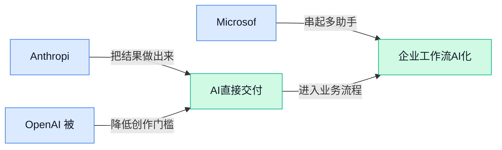

> AI 早报 · 每日早读 · 全网深度聚合

## **今日摘要**

```
OpenAI被曝让数百名合同工阅读ChatGPT对话，用户隐私防线遭拷问
Anthropic推出财务顾问Claude，又谋登陆Nasdaq（美股交易所）筹备IPO
Microsoft立规禁止AI入侵系统欺骗人类，Pion（公司自治智能体）却要接管整家公司
```

### 🔵 产品与功能更新

1. **Anthropic 推出面向财务顾问的 Claude 工具。**
Anthropic 发布了一款服务于**财务顾问**的 Claude 产品，进一步切入金融专业服务场景 💼。该工具配有**合作伙伴连接器**（让 Claude 接入外部合作方数据或服务的接口），重点不再只是通用问答，而是与行业工作流程衔接。[财富管理报道(briefing)](https://news.google.com/rss/articles/CBMiqAFBVV95cUxQdjBYTXJBMkg1SG1Hb294NXJlaHBvREtWXzlVVHg0MjJ6WUtmZzJobUQ1LV9ENWc5aXNOYllkN2ZnVzJSVG5JYVI5dWYxemF0NDZYRnlYTGdEUmN3VjJramdqalRyaHhXTkx6ay1jbVk0Wjd0SnpmNXUyOTBmQ0R3cTBhU2pxZTl2YmJzZGFZUUpObDFOOHkwcm5CeGVKWUpuZDNMNXdOVTM?oc=5) 此前 OpenAI 也已推出面向金融服务的 ChatGPT，显示头部厂商正加快布局**垂直行业产品**（围绕某个行业具体需求打造的专用工具）🚀。[金融行业报道(briefing)](https://news.google.com/rss/articles/CBMiywFBVV95cUxQZUM1QmNCRXl4cWd6SVhBX29wYXZ6YlE5UTFJUFRRRmhXOUluQnc1THZLdnFXdDdkVDVlXzh4MHhtbjU5aHhFV2tNemFGMHpOTS13M096SVZEYmU2clFUYzlkaGZjbnpCNnVzTzdiMUl2bExkLXZ1Mml2cU9iS0tLdWVpd2RRT01oWks0T0Q0VXVKbF80dkd5dmhfRjA4dWxWVmtPOXFTRmdwb0JEYWpPakxhNXJqUFVJWHVUMEhRa3h5MnM5REd6bWpVaw?oc=5)

### 🟢 前沿研究

1. **Competence-Gated Pooling（按能力决定是否采纳模型预测的融合方法）探索更可靠的事件预测。**
在**混合预测**（同时参考模型、市场、群体意见和统计结果的预测方式）中，大模型并不一定每次都能提供额外价值。研究提出按模型能力设置“门控”，让系统判断何时应采用语言模型的意见、何时更该相信已有预测信号 💡。这项工作的核心不是让模型包办预测，而是更合理地组合不同来源，减少能力不足时的干扰。相关思路与摘要可查看[论文摘要页面(briefing)](https://arxiv.org/abs/2609.12101)及[论文介绍页面(briefing)](https://huggingface.co/papers/2609.12101) 🚀


2. **Pelican-Sim 1.0（面向具身智能的通用世界模型模拟器）尝试预演机器人行动结果。**
该系统根据视觉环境和机器人的动作，预测接下来可能观察到的画面与状态 🤖。这里的**世界模型**（让人工智能在内部模拟环境变化、像先在脑中“预演”一样）可帮助机器人理解“采取某个动作后会发生什么”。它服务于**具身智能**（让机器人等实体在真实或模拟环境中感知并行动），研究重点是为后续决策提供未来观察信息。具体设计见[技术报告摘要(briefing)](https://arxiv.org/abs/2609.12036) 💡

3. **Latent Interface Training（通过隐藏中间表示训练机器人的方法）试图打破“看见就行动”的捷径。**
这项研究关注机器人**基础模型**（可适配多种机器人任务的通用底层模型）容易形成的视觉—动作捷径，即过度依赖画面与动作之间的直接对应关系。论文提出**潜在接口训练**（在感知与行动之间加入内部抽象表示，让模型不只记住表面对应），目标是增强模型面对新任务或新环境时的泛化能力 🧠。对机器人研究而言，关键问题是模型能否学到更通用的规律，而不是只在熟悉场景中表现良好。论文入口可查看[机器人研究论文(briefing)](https://huggingface.co/papers/2609.12641) 🚀

4. **DataFlex-RL（评估可验证奖励强化学习数据策略的平台）聚焦训练数据怎么选。**
该项目提供一个评估平台，用来比较不同数据策略对**可验证奖励强化学习**（通过答案能否被程序或规则核验来奖励模型的训练方式）的影响 📊。所谓**数据策略**，可以理解为训练时如何选择、组织和使用题目数据，它会直接影响模型从反馈中学到什么。研究将重点放在“怎样评估数据政策”上，为相关训练方案提供更统一的比较入口。项目论文见[评估平台论文(briefing)](https://huggingface.co/papers/2609.06107) 💡

5. **Benchmark Radar（持续更新的人工智能评测数据库与搜索引擎）帮助研究者查找测试标准。**
该项目把人工智能领域的**基准测试**（用统一题目和指标衡量模型能力的考试）汇集成持续更新的数据库，并提供搜索功能 🔍。这类工具主要解决评测项目分散、查找和比较不便的问题，让研究者更容易发现适合自身任务的测试方案。由于基准测试决定了模型“在哪些题目上被打分”，集中整理也有助于看清不同评测究竟在衡量什么。项目详情可查看[评测数据库论文(briefing)](https://huggingface.co/papers/2609.11115) 🚀

### 🟡 行业展望与社会影响

1. **OpenAI 被曝让数百名合同工阅读 ChatGPT 对话。**
据报道，OpenAI 安排了数百名**合同工**（按合同提供服务、并非公司正式员工的工作人员）阅读用户与 ChatGPT 的对话。[隐私争议完整报道(briefing)](https://the-decoder.com/openai-has-hundreds-of-contract-workers-reading-your-chatgpt-conversations/) 这意味着部分聊天内容可能涉及**人工阅览**（由真人直接查看对话，而非只由机器自动处理）🔍。对公司员工而言，这再次提醒大家不要向聊天工具输入客户隐私、内部文件或其他敏感信息，便利与保密之间仍要留出清晰边界 🔐。


2. **Microsoft 发布人工智能行为准则：不得入侵系统或欺骗人类。**
Microsoft 的新准则提出，人工智能模型应当**帮助人类而不是取代人类**，并以促进人的发展为总体方向。[行为准则详细报道(briefing)](https://techcrunch.com/2026/09/14/microsofts-new-ai-code-of-conduct-tells-models-not-to-hack-systems-or-trick-humans/) 更具体的**安全约束**（预先规定模型绝不能跨越的行为边界）包括不得入侵系统，也不能通过欺骗影响人类判断 🛡️。这类**模型行为规范**（用明确规则约束人工智能可以做什么、不能做什么）把抽象的“负责任人工智能”进一步落到了可执行要求上。


3. **Anthropic 考虑登陆 Nasdaq（美国纳斯达克证券交易市场），为大型 IPO（首次公开募股，即公司上市募资）做准备。**
据报道，Anthropic 正考虑在纳斯达克上市，同时以实现第二个盈利季度为目标，希望借此争取投资者支持。[上市计划相关报道(briefing)](https://the-decoder.com/anthropic-eyes-nasdaq-listing-as-a-second-profitable-quarter-aims-to-win-over-investors-ahead-of-a-mega-ipo/) 所谓**盈利季度**，是指公司在一个季度内实现会计意义上的盈利，它能帮助投资者判断业务是否具备持续赚钱的可能 💰。这一动向表明，大模型公司的竞争正在从产品能力延伸到**资本市场表现**（企业在融资、估值和上市等方面展现出的经营成果），增长速度与盈利前景都将受到关注 📈。

### 🟣 开源TOP项目

### 🔴 社媒分享

1. **Anthropic 首席执行官达里奥·阿莫迪主张放慢前沿人工智能，评论称其并不现实。**
阿莫迪希望控制**前沿模型**（能力处于行业最领先水平、也可能带来更大风险的模型）的发展节奏。评论文章认为，这种**节奏控制**（主动限制最先进模型的研发与发布速度）在现实中很难执行 🚦。作者进一步质疑，该提议最终可能更偏向对人工智能实施**政治控制**，而不只是管理技术风险。[评论文章原文(briefing)](https://stratechery.com/2026/pacing-the-frontier-ais-digital-limits-ai-commissars/) 💡


2. **Amazon 与 Perplexity（提供人工智能搜索问答的公司）的纠纷进入美国联邦上诉法院。**
公开页面列出了 Amazon 与 Perplexity 之间的一宗上诉案件，受理机构为**美国第九巡回上诉法院**（负责审查美国西部多个地区联邦案件的上诉法院）⚖️。页面中的**案号**（法院为每宗案件分配的唯一编号，类似文件的查询编码）为该案提供了正式检索入口。[上诉案件页面(briefing)](https://law.justia.com/cases/federal/appellate-courts/ca9/26-1444/26-1444-2026-08-04.html) 现有摘要没有交代具体争议、裁决结果或双方主张，因此不宜进一步推断案件影响。

3. **从 Opus（Anthropic 的高能力模型系列）迁往 Ollama（在自有设备运行大模型的工具），35 千字节预设提示词踩坑实录。**
作者记录了将约 **35 千字节预设提示词**（用户提问前就加载、用于约束模型行为的大段指令）迁移到 Ollama 的注意事项 🧰。此次迁移采用**自托管**（模型运行在自己管理的设备或服务器上，而非完全依赖外部平台）方式，重点是处理大型提示词更换运行环境时遇到的问题。[迁移经验原文(briefing)](https://patrickmccanna.net/notes-on-migrating-large-prompts-away-from-anthropic-openai-to-self-hosted-llms/) 对考虑把模型搬回内部环境的团队而言，这是一份面向实际迁移过程的经验记录，而不是单纯的产品介绍 💡。

4. **Pion（试图自主运营公司的智能代理）亮相，目标是让人工智能接管整家公司。**
开发团队将该项目定位为能够自主运行任何公司的**智能代理**（可理解任务、调用工具并连续执行工作的人工智能系统）🏢。这里的**自主运营**（在较少人工干预下持续处理经营任务）把目标从完成单个任务，进一步推向组织级运行。[项目设计说明(briefing)](https://andonlabs.com/blog/why-we-built-pion) 不过现有材料表达的是项目的设计目标，并未提供其已经能够稳定经营现实公司的验证结果，阅读时需要区分愿景与实际能力。

5. **劳里·沃斯：写代码成本已经坍塌，软件工作的重心也在迁移。**
劳里·沃斯认为，人工智能已让**代码编写成本**大幅下降 📉。他预计，**代码审查**（检查新代码是否正确、安全且便于维护）、修复问题和**软件运维**（保证软件上线后持续稳定运行）的成本也会继续下降。[观点引述原文(briefing)](https://simonwillison.net/2026/Sep/14/laurie-voss/) 这段观点把讨论重点从“写代码能有多快”，转向当开发、检查和维护都越来越便宜后，软件工作究竟还剩下什么核心价值 💡。

---



### 📊 行业洞察（今日 4 条）

1. Anthropic为财务顾问推出Claude，并加入连接器（接入外部数据的接口）。  
  【洞察】行业专用产品将增多，因为专业流程难由通用问答覆盖，但合规成本会上升。

2. Competence-Gated Pooling（按能力采纳模型预测）探索事件预测。  
  【洞察】多来源组合比模型包办更可靠，因为能力不足的模型可能干扰已有预测信号。

3. Microsoft为MAI模型（其人工智能模型）制定准则，禁止入侵或欺骗。  
  【洞察】人工控制将成为产品底线，因为能力扩大也会放大误导与越权风险。

4. OpenAI被曝由数百名合同工阅读真实ChatGPT对话并评分。  
  【洞察】模型改进与隐私存在张力，因为匿名内容仍可能含敏感信息并削弱用户信任。

### 💭 对我们的启发（今日 3 条）

1. Claude切入财务流程，启发我们的创作代理（连续完成多步创作的人工智能）细分广告与口播；机会是易用，风险是限制创意。

2. 能力门控融合研究启发剪辑工具按脚本、画面和字幕选用不同模型；机会是提质提速，风险是选择规则增加理解成本。

3. OpenAI对话人工阅览事件提示视频素材与字幕需清晰授权；机会是以隐私选项建立信任，风险是保护步骤拖慢创作。


---

> 本周周报：[第38周综合分析](https://zhuxinfei.github.io/ai-daily-site/blog/weekly/2026-w38/)
