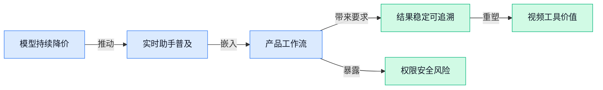

> AI 早报 · 每日早读 · 全网深度聚合

## **今日摘要**

```
Google 推出 Gemini 3.8 Live（实时交互模型），低成本对标 OpenAI GPT-Live-1
Strix（AI安全测试团队）25分钟拿到 Baseten（模型部署平台）生产 GitHub 管理权限
Anthropic 推出理财顾问版 Claude，Salesforce 合作三周后转头自研模型
```

### 🔵 产品与功能更新

1. **Anthropic 推出面向理财顾问的 Claude，瞄准财富管理自动化。**
这项新产品主要服务于**理财顾问**，帮助其自动处理财富管理（为客户配置、跟踪和调整资产的服务）相关事务 🚀。核心方向是**工作流自动化**（让系统按照既定步骤完成重复任务），减少从业者在日常流程上的手工操作。对金融机构而言，这意味着 Claude 正从通用聊天助手进一步进入具体业务场景 💡。[产品发布完整报道(briefing)](https://news.google.com/rss/articles/CBMieEFVX3lxTE1yRFNlV1pTYzZDeC0xMndKNE85MEc4cE12S0VxaEJaMFVYMWlrZS10M2VNUnMxRUs0ZjBPS1FmS0xvOGZidTU0QkM1V3d1VGphcGhmZ29vSWdodlBESlQyaHJ4T2l0VFltY3BKcjdtVlJfWXhoWWtwbA?oc=5)

2. **Salesforce（企业客户关系管理软件公司）与 Claude 达成合作三周后，又开始自研人工智能模型。**
Salesforce 在与 Claude 达成合作仅三周后，便着手打造自己的**人工智能模型**（从大量数据中学习规律、进而生成内容或完成任务的系统）🤖。这显示公司并未只依赖外部模型，而是在同步推进内部研发。对于使用其客户关系管理系统（帮助企业记录和运营客户信息的软件）的企业来说，未来相关人工智能能力可能更多由 Salesforce 自身掌控 💡。[自研模型相关报道(briefing)](https://news.google.com/rss/articles/CBMirAFBVV95cUxOSXdVT0dYZFdnY05ETXZ4UEsxRGVQemVObHhZYWtzeGFhbHdnajBVN1dnMTJudmhHYTE1aE5jUXFMZ2FOejh0UlpXbDdWai1MWmtSMmQ4c3F0Tzc4dlE3OXM2UXIwX0JQVTlvVzdER21nWnJBbHUxb2hhb2d5WUZZRjNOeVBxTXpXdmJiaW9zMkRZQk8xVUQ1QXB1Z0VxaFlhaGtyWlY1cEp6V0Fi?oc=5)

3. **Google 推出 Gemini 3.8 Live（实时交互人工智能模型），以低成本对标 GPT-Live-1（OpenAI 的实时交互模型）。**
Google 正式推出 **Gemini 3.8 Live**，直接瞄准 OpenAI 的同类产品 ⚡。这类实时交互模型（面向即时对话场景、强调快速来回响应的模型）可用于需要连续沟通的产品体验。报道强调其成本仅为竞品的一部分，意味着企业在选择模型时，除了效果，也会更重视**调用成本**（企业按使用量支付的模型服务费用）💰。[实时模型发布报道(briefing)](https://news.google.com/rss/articles/CBMisgFBVV95cUxQMlNfRk1mUFVONnBqdWFQLWVtSFJZbmFySTF1MXhRanFna20wNV9lMnA2NjhvNTBWSzVGS2tDUlhrdUhZQnhkYTZTRnRXVEt4RUpFZGY1c3RIcEt5X0l0dWRSTjBpV2xpYkhncjhUMWpNN1hOZC14akFpdEo4blBBOE1tMF84OThUdFBwOS1Jb1hmWTFYWTlBOEJlbHptR1hYQkdNS3p2cGY0MF93NXR1a1Fn?oc=5)

### 🟢 前沿研究

1. **HazardAuditor（从可执行威胁出发、审查电脑操作风险的安全框架）让智能体用电脑更安全。**  
这项研究关注**电脑操作智能体**（能像人一样点击鼠标、输入文字和使用软件的人工智能）可能遇到的安全问题，并从**可执行威胁**（不只是文字描述，而是能够实际运行并造成影响的危险操作）入手开展审查。它把重点放在智能体采取行动之后可能产生的真实风险，而不只是检查回答内容是否合规 🔍。这类研究有助于理解：当智能体开始代替员工处理网页、文件和软件时，安全评估也需要覆盖它“做了什么”。可查看[论文介绍页(briefing)](https://huggingface.co/papers/2609.15134)了解其研究定位。


2. **ZGCM-1（面向数学与自主搜索的全开放基础模型）主打高效率。**  
这篇论文提出 **ZGCM-1**，定位是一款用于**数学推理**和**自主搜索**（让人工智能自行规划并查找所需信息）的基础模型。其标题特别强调**全开放**与**极高效率**，意味着研究重点不仅是解决问题，也包括降低模型使用与研究门槛 🚀。所谓**基础模型**（可继续适配多种任务的通用底层模型），可以理解为后续应用的“公共底座”。目前候选材料未提供测试成绩与参数细节，具体设计可查阅[模型论文页面(briefing)](https://huggingface.co/papers/2609.13356)。

3. **“永不放弃”训练思路，瞄准大模型难题求解能力。**  
这项研究探讨如何利用**强化学习**（让模型通过反复尝试和结果反馈改进策略），帮助大模型持续应对更困难的问题。论文标题中的“永不放弃”，指向一种避免模型过早停止探索、继续尝试潜在解法的训练方向 💪。这里的**探索策略**（面对未知答案时决定继续尝试哪些路径的规则）可能直接影响模型处理复杂任务时的耐心与成功机会。不过材料没有披露具体训练流程和实验结果，完整内容见[强化学习论文(briefing)](https://huggingface.co/papers/2609.13443)。

4. **长流程智能体失败后，根因定位被重新定义为“持续搜索”。**  
这篇论文认为，寻找智能体失败的**根本原因**，本身就是一个搜索问题，而不是简单查看最后一步哪里出错。研究聚焦**长流程任务**（需要连续执行许多步骤、前一步会影响后一步的任务）中的智能体故障，并提出持续追查问题来源的研究方向 🔎。其中的**根因归因**（从一连串行为中判断究竟是哪一步或哪个因素引发最终失败），很像排查复杂业务流程中的连锁错误。对未来承担多步骤工作的智能体而言，“为什么失败”可能与“能不能完成任务”同样重要，详情可参考[智能体故障论文(briefing)](https://huggingface.co/papers/2609.13463)。

5. **Atria Dawn（探索自主型超级智能的研究项目）讨论智能体能力新阶段。**  
这项名为 **Atria Dawn** 的研究以**自主型超级智能**（能够主动规划并执行复杂任务、能力目标高于普通智能助手的设想）为主题。标题使用“黎明”来描述这一方向，显示论文试图讨论智能体进一步走向高度自主化的可能性 🌅。这里的**自主规划**（模型自己拆解目标、安排步骤并根据结果调整行动）是理解该研究定位的关键。不过候选材料只有标题，没有提供能力指标或验证结果，因此不宜把它直接视为超级智能已经实现；具体论述见[项目论文页面(briefing)](https://huggingface.co/papers/2609.15818)。

6. **智能体这次任务满分，下次还能稳定复现吗？**  
这篇研究把注意力从“完成一次任务”转向**重复执行的一致性**，也就是智能体面对相同或相近任务时，能否持续交出可靠结果 🎯。这种**一致性评估**（多次测试同一能力，观察结果是否稳定）可以避免一次成功掩盖后续表现波动。对企业使用场景来说，偶尔成功和长期可靠是两回事，而标题正是在追问这种稳定性问题。候选材料没有给出具体实验数据，研究背景可查看[智能体一致性研究(briefing)](https://huggingface.co/blog/ibm-research/altk-evolve-consistency)。

7. **LLaDA-UI（采用分块扩散机制的视觉语言界面智能体）探索新的电脑操作方式。**  
这篇论文将**分块扩散**（把生成过程拆成多个内容块并逐步修正的机制）引入视觉语言界面智能体。所谓**视觉语言界面智能体**（既能看懂屏幕画面和文字，又能在软件界面中采取操作的人工智能），可用于研究模型如何理解并使用图形化界面 🖥️。与一次性生成完整操作方案相比，这一研究方向更关注按内容块逐步处理信息。候选摘要尚未提供效果对比和应用案例，具体架构可查阅[界面智能体论文(briefing)](https://huggingface.co/papers/2609.13287)。

8. **Grouped Value Attention（通过按需重建键数据节省缓存的注意力机制）瞄准推理效率。**  
这项研究提出一种新的**注意力机制**（模型判断当前内容应重点参考哪些历史信息的计算方式），重点优化大模型运行时的缓存占用。其核心方向是通过**按需重建**（需要某部分数据时再临时恢复，而不是始终全部保存）处理键数据，从而更高效地使用 **KV 缓存**（模型生成内容时保存历史计算结果、避免重复计算的临时存储）⚡。这类底层优化关注的不是模型“会不会回答”，而是回答时如何更节省存储资源。材料尚未披露具体节省比例与速度表现，技术细节见[注意力机制论文(briefing)](https://huggingface.co/papers/2609.13285)。

### 🟡 行业展望与社会影响

1. **Google 人工智能与经济 ATLAS（全球数据互动观察工具）开放体验。**  
Google 将**数百万个全球数据点**整理成可交互体验（用户能主动探索数据，而非只阅读静态报告）🌍。该工具采用**开放访问**（公众可以直接查看和使用相关内容）的形式，让复杂的全球人工智能与经济信息更容易被理解，具体可查看[官方互动数据说明(briefing)](https://blog.google/innovation-and-ai/technology/ai/ai-economy-atlas-september-2026/)。这类工具的价值在于把分散数据变成直观信息，帮助企业和公众更方便地观察人工智能带来的经济变化 💡。


2. **Gemini 3.8 Live（Google 的实时语音推理模型）把“边听边想”带进更多产品。**  
Google 推出 **Gemini 3.8 Live（能够实时听取语音并同步思考、回答的模型）**，支持开发实时语音应用和**实时推理**（模型在对话过程中同步理解信息并作出判断）；同时亮相的 Gemini 3.5 Transcribe（将语音实时转换成文字的模型）则聚焦语音转写，[实时语音开发介绍(briefing)](https://news.google.com/rss/articles/CBMitAFBVV95cUxORklOLTI2REdZOWdBZFJmbEg1S3J3ejNuTGhGMVBlWmVXeGtZRkxXcW1zSUtOVnR5eWd2aG9ibWdmd2xUTmllTDhrZWF2UXpRb1V1SWUzNVIzOEJrZEdNYVYyM1NTaS1oMmZaWWZyNEpSRUowR1dsd2otTV9UQkdaZVpKMGwwSkxGeG11U1J1M1RnVEF4S0dCbjNMRUpKcDNqdm9wWDl5THFKVTluOEp6RGVfNTM?oc=5)提供了更多信息 🎙️。其**扩展思考能力**还被用于 Gemini Live（Google 的实时语音对话功能）、Gmail（Google 的电子邮件服务）和 Keep（Google 的笔记工具），应用范围可参考[产品落地报道(briefing)](https://news.google.com/rss/articles/CBMibEFVX3lxTFBHVmhEclltdDg3Zlg5RHZ5aWVHSHo1RGJ2LUN0RUVicXhTZDkzOTU0TWJkSmp2UWF2UVlFaXhyd2F0OXBMRUpiQ1Z4ZExvTmI4Z0MtbW5wQzcycUtxdFZxWkJJM1pfUkxiQms0Sw?oc=5)。另有报道指出，它正以明显更低的成本挑战 OpenAI 的 GPT-Live-1（面向实时语音交互的模型），详见[成本对比报道(briefing)](https://the-decoder.com/google-launches-gemini-3-8-live-to-take-on-openais-gpt-live-1-at-a-fraction-of-the-cost/)。这意味着实时语音助手不仅会更会“听”和“想”，也可能因成本下降而进入更多办公与服务场景 🚀。

### 🟣 开源TOP项目

### 🔴 社媒分享

1. **Gemini 3.8 Live（Google 的实时语音交互模型）亮相，并提供延长思考版本。**
Google 发布了 **Gemini 3.8 Live（可进行实时语音互动的模型）**和 **Gemini 3.8 Live Extended Thinking（回答前可进行更长时间思考的版本）** 🚀。从命名来看，两者分别突出**即时语音交流**与**延长思考**能力，覆盖不同的对话需求。开发者西蒙·威利森还分享了相关语音工具，方便外界进一步了解这项更新 💡。可查看 [Google 官方发布页(briefing)](https://blog.google/innovation-and-ai/models-and-research/gemini-models/gemini-3-8-live-gemini-3-8-live-extended-thinking/) 和 [语音工具介绍页(briefing)](https://simonwillison.net/2026/Sep/15/gemini-live/)。


2. **ChatGPT 广告开始奏效，Amazon Ads（亚马逊广告业务）被指找到聊天机器人突破口。**
文章认为，**ChatGPT 广告已经有效运作**，并解决了亚马逊在聊天机器人（通过对话帮助用户查找信息或完成任务的软件）上的一个核心难题 📣。这意味着广告可能不再只是搜索结果旁的展示位，而是逐渐进入用户与 ChatGPT 的对话场景。文章同时讨论了沃尔玛接受 **Apple Pay（苹果的移动支付服务）**一事，并将其视为企业最终顺应用户习惯的案例 💡。相关分析可见 [广告与支付趋势分析(briefing)](https://stratechery.com/2026/openai-ads-amazon-ads-in-chatgpt-walmart-to-accept-apple-pay/)。


3. **有人用一个月为 M4 Mac Mini（搭载苹果 M4 芯片的小型电脑）打造 Linux（开源操作系统）GPU（图形处理器）驱动。**
这篇文章记录了作者在一个月内，为 **M4 Mac Mini（搭载苹果 M4 芯片的小型台式电脑）**构建 **Linux（可自由修改和分发的开源操作系统）GPU 驱动**的经历 🛠️。GPU 驱动（让操作系统能够识别并调用图形处理器的软件）就像硬件与系统之间的“翻译官”，缺少它，显卡能力便难以正常发挥。仅从项目周期看，这是一项相当紧凑的底层开发实践，也为关注苹果硬件兼容性的读者提供了观察窗口。完整过程见 [显卡驱动开发记录(briefing)](https://codyho.dev/blog/gpu-driver/)。

4. **Strix（人工智能安全测试团队）称 25 分钟拿到 Baseten（模型部署服务平台）的生产 GitHub 管理权限。**
文章称，该团队仅用 **25 分钟**便获得了与 Baseten 生产业务相关的 GitHub 管理权限 🔐。生产环境（企业实际向用户提供服务的系统）一旦关联高权限账号，安全风险往往会被放大；管理员权限（可以管理代码、成员及关键设置的高等级权限）尤其敏感。对企业来说，这则分享提醒大家：代码平台的账号、授权范围和访问入口，同样属于需要重点防守的基础设施。事件经过可查看 [生产权限安全复盘(briefing)](https://www.strix.ai/blog/baseten-harbor-github-pat-takeover)。

---



### 📊 行业洞察（今日 4 条）

1. Google推出Gemini 3.8 Live（实时语音交互模型），每小时约1.38美元；Apple重做Siri并采用Gemini，说明实时助手正快速进入成熟产品
  【洞察】模型能力正在变成基础设施，竞争重点从“谁的模型最强”转向“谁能用更低成本把能力嵌进真实工作流”，模型公司的独立溢价会被压缩

2. Salesforce（企业客户关系管理软件公司）与Claude合作三周后又自研模型，日报同时称Anthropic为理财顾问推出专用Claude
  【洞察】大公司正在一边采购外部能力、一边保留自建选项，因为单押一家模型供应商会带来成本、数据和产品控制权风险

3. “永不放弃”训练、智能体一致性评估与长流程失败追因研究同时出现，研究关注点已从“偶尔完成一次”转向“能否稳定完成并解释失败”
  【洞察】Agent真正进入企业业务后，最难的不是展示一次成功，而是持续复现、及时纠错和让人敢于接管，可靠性会成为商业化门槛

4. Gemini 3.8 Live强调低成本，ZGCM-1（面向数学和自主搜索的开放模型）与Grouped Value Attention（减少模型运行时存储消耗的方案）也都主打效率
  【洞察】AI行业正在同时压低模型价格和运行成本，应用公司会获得更多试错空间，但“接入AI”本身会越来越便宜，也越来越难形成竞争壁垒

### 💭 对我们的启发（今日 3 条）

1. Gemini 3.8 Live成本下降且已进入邮件、笔记等产品，我们的视频剪辑软件可以探索语音改稿、口述剪辑意图，但必须按任务价值控制调用成本，不能把所有操作都交给高价模型。

2. 一致性评估、失败追因和HazardAuditor（检查智能体实际电脑操作风险的安全框架）共同提醒我们：剪辑Agent每次改动都应可预览、可撤回，涉及发布、删素材和品牌承诺时必须人工确认。

3. Salesforce既合作Claude又自研模型，说明长期竞争不在“接了哪家模型”，而在是否掌握品牌商的素材、模板和出片流程；我们的产品应把客户工作习惯沉淀成可复用能力，降低替换风险。


---

> 本周周报：[第38周综合分析](https://zhuxinfei.github.io/ai-daily-site/blog/weekly/2026-w38/)
