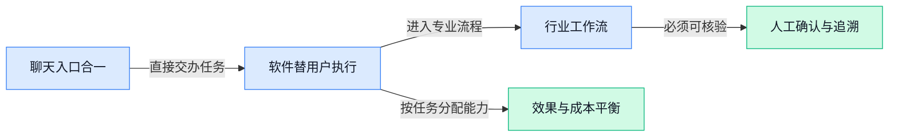

> AI 早报 · 每日早读 · 全网深度聚合

## **今日摘要**

```
Claude Docs（AI文档）上线，Anthropic正面挑战微软Office
OpenAI披露六起AI安全事件，又测试Sponsored Agents（广告智能体）
40亿参数模型改写查询计划，较Postgres（开源数据库）方案快81%
```

### 🔵 产品与功能更新

1. **Claude Docs（Anthropic 推出的 AI 文档产品）上线，直接挑战 Microsoft Office（微软办公软件套件）。**
Anthropic 正式推出 **AI 文档产品**，把 Claude 从聊天助手进一步带入日常办公场景 📝。报道将其定位为 Microsoft Office（微软旗下的文档、表格等办公软件套件）的直接竞争者，意味着 AI 公司开始深入传统办公软件市场。虽然现有材料没有披露具体功能，但产品方向已经十分明确：**文档处理与 AI 助手正在加速融合** 💡。[产品发布报道(briefing)](https://news.google.com/rss/articles/CBMitgFBVV95cUxQVk4xTk9kczkydW1pTDl4dnlFeVZTVmdCYXVRcHhXVmFUMDZwZEpxRFQteXVRM1ktQnlYeG9MZU9DVi1hR2p3MXZqemhMSG1nMjZLcUZiYk9zU19FOWZXcUNrVmh4VHhMYmFVQ0J3U1pnaEx5NkFRMDZEODNoRnJydkFrVGIyNlkwVmlZSDdXSklITXJXSDctODhJQ0pvUm9TRG5uZ3Z4VnlUOEdoSUtWYVpLOXJLUdIBvgFBVV95cUxQTXVkX1E0UzE2b1NHWURfWXZ0S3ozV2RqLVA2QUFUVFhzWTAxTktJbW1vdVlYZjNMTVh0dThVb0lUMEF2VER1UktjbkZBWURTTmNOVXl1MDFyZklBT3V5T2VzVHZYUThmY015dHNhSjdYNEF1YURYZnJzYW0yU3VhVTBOZmpZU2N6Zld6QnRpNmZLOWR3RWJhazZZVmNUTUJlT3lURU96bDkzbWJXVzJCRGR1ZExCVjJMTlBaWlZn?oc=5)

2. **Claude for Advisors（面向金融顾问的 Claude 专业版本）亮相，携手嘉信理财与贝莱德。**
Anthropic 推出面向 **金融顾问** 的 Claude 专业产品，并与嘉信理财（美国金融服务公司）、贝莱德（全球资产管理公司）展开合作 🤝。金融顾问（为客户提供投资与财富规划建议的专业人士）是高度专业化的岗位，此次发布显示 Claude 正从通用助手向**垂直行业产品**延伸。两篇报道都把重点放在金融顾问场景，说明 Anthropic 正在加强 Claude 在财富管理领域的布局 🚀。[福布斯完整报道(briefing)](https://news.google.com/rss/articles/CBMitwFBVV95cUxNRktmYWhfak5Yd1VDdGtxeWVSYUFrYjhjZ1Bqbms4X0k3cXpFN1lPVUhha3ZqQURCeWlPX3A3N0s5a1pFZnByOVVsbW85ZzRWSDZwRDJNdXg0akpKenBUV1JPXzFtYkl3eF96aEpxci1YVWJKRHdIekRJU0Y1RFgtUUg2OUVwc3RlbkRFS2xrR1haVHhhOUJ6UEhRTmItZ3Bzd3dfaXY4VW44bGNFNnljdjZpWHZhUGM?oc=5) [财富管理行业报道(briefing)](https://news.google.com/rss/articles/CBMikAFBVV95cUxQSEM4Y2U0RzZ4WnAxeVlTcDlyVGRVNUFmbHpnZ1o4UWtFa1NuSzZHTmpsMEZqdTdDWnROejVRU1JhaG5iTUZEX2ZUQS1CYTRSb2xWTlVDMTBiTnBIOUJlajN4Vkd5T2JVeVpVSmR3WTZFVTZBcndqdUlBMzFBYnNORXZXWDVaQkNxckFnR3BxaDc?oc=5)

### 🟢 前沿研究

1. **OmniHarness（通过符号化策略学习提升视觉生成泛化能力的研究框架）探索更通用的图像生成。**
这项研究关注**符号化策略学习**（把生成过程整理成可理解、可选择的规则与步骤），试图让模型更灵活地控制视觉内容 🎨。核心目标是提升**泛化能力**（模型面对没见过的新任务时，也能运用已有经验完成任务），而不只是记住固定场景。它指向一种更通用的视觉生成思路，但具体效果与适用范围仍需结合论文实验判断。[论文介绍页(briefing)](https://huggingface.co/papers/2609.16057)

2. **漂移约束优化提出：微调指令模型时，改变方向可能比移动距离更重要。**
论文讨论**微调**（用特定数据继续训练已有模型，使其更适合某类任务）过程中，模型内部参数应该如何变化。其核心观点是，约束**参数漂移**（模型更新后偏离原有能力状态的程度）时，也许应更关注变化方向，而非单纯限制变化幅度 🧭。这为如何保留原模型能力、同时让它学会新指令，提供了一个值得验证的优化视角。[论文介绍页(briefing)](https://huggingface.co/papers/2609.13680)

3. **ImpossibleRubrics（检验自动评分规则可靠性的压力测试研究）追问：模型生成的评分标准真的可信吗？**
这项研究聚焦**评分量表**（把“好不好”拆成具体评分项目和判断条件），并考察它被用作训练依据时是否稳定。论文通过压力测试审视**奖励信号**（训练时用分数告诉模型哪些回答更好的反馈），避免模型被有缺陷的评分规则带偏 🧪。对依赖自动评测来训练模型的团队而言，这项研究提醒大家：评分标准本身也需要接受严格检查。[论文介绍页(briefing)](https://huggingface.co/papers/2609.16816)

4. **模型内部的“路由器”研究：不改参数，也能尝试调动大模型已有技能。**
论文研究如何从**冻结模型**（保持模型参数不变，像把内部知识“锁住”后直接使用）中，引出其原本具备的不同能力。这里的**技能路由**（根据当前任务选择更合适的内部能力与处理路径）类似让模型自己判断该调用哪套“解题思路” 🔀。研究重点不是继续训练模型，而是探索如何更充分地使用模型已经学到、却未必会主动展现的能力。[论文介绍页(briefing)](https://huggingface.co/papers/2609.15982)

5. **诱饵方向优化尝试抵御大模型安全能力被人为移除。**
研究提出一种**后置防御**（模型训练完成后再增加保护措施，不必从头重新训练）的思路，用来对抗模型安全机制遭到破坏的问题 🛡️。它针对的是**安全消融**（通过修改模型内部参数，削弱其拒绝危险请求和遵守安全约束的能力）。论文标题表明，这套方案以“诱饵方向优化”为核心，但实际防护强度和使用条件仍需参考完整实验。[论文介绍页(briefing)](https://huggingface.co/papers/2609.16204)

6. **研究发现方向指向：不同模态可能以相似方式涌现上下文学习能力。**
论文考察**跨模态**（同时覆盖文字、图像等不同信息类型）环境下，模型学习规律是否存在共通之处。重点是**上下文学习**（模型不修改自身参数，只根据当前对话中的示例临时学会完成任务）如何在不同模态中出现并逐渐形成 🧩。如果这种趋同现象得到实验支持，将有助于研究者理解不同类型模型为何可能表现出相似的临场学习能力。[论文介绍页(briefing)](https://huggingface.co/papers/2609.14011)

7. **“人类制造的最后一个人工智能”论文，探讨真正的递归自我改进。**
这篇研究以颇具冲击力的命题，讨论**递归自我改进**（模型改进自身后，再用更强的新版本继续改进自己，形成循环）的可能路径 🔄。这里的“真正自我改进”强调的不是一次升级，而是模型能持续参与自身能力提升。标题中的“走向”也意味着它讨论的是目标与方向，并非宣布这一能力已经实现。[论文介绍页(briefing)](https://huggingface.co/papers/2609.11873)

### 🟡 行业展望与社会影响

1. **OpenAI 披露六起新 AI 安全事件（人工智能可能造成危险或失控后果的情况）。**
OpenAI 新披露了**六起人工智能安全事件**，再次把模型风险管理推到聚光灯下 ⚠️，具体消息可查看[安全事件完整报道(briefing)](https://news.google.com/rss/articles/CBMigAFBVV95cUxOT013aGlZYVZ5b3FNeC1BT3VXbk1WYi1HUVk3bDFaVTlJdnhCaXhvOXNOMHJGaG85MmFTalFwUEFlU0xRMktvMkxTTGtnaE5kdTZFVkVCOGtzSzQ0T0d2VnNPLTM0VVIwOVpUb25QbkJXeVZLYmxQdmhRTzlFRlg1bQ?oc=5)。与此同时，行业开始追问企业是否必须公开**危险事件**，这里的事件披露（企业主动报告模型造成或可能造成严重风险的情况）正成为监管讨论焦点。[事件披露法规报道(briefing)](https://news.google.com/rss/articles/CBMipAFBVV95cUxPUjhWYTgzbzRiRUJ1WVlndUlucW91Rk53ZnpIZ1RmOUVaanp0U3ZEN2FXa08ta25xWlJKd0ptWUt1RTEzZXZaSXRRbUlLLXI2Q2JjVlR0dmdQTTFQNmtoTXV2T2hhOVBUeFktNjZCZmM1M0I5RHE1Qk1kT3N3Rzd6Z0dzOWNzOGRWLXpPaW02R19xTFFCWmJ3VjBta25pVnhMSVRzdA?oc=5) 对整个行业来说，今后衡量一家模型公司的标准，可能不只是能力强不强，还包括它是否愿意透明记录并公开风险 🔍。

2. **OpenAI 测试 Sponsored Agents（由广告商赞助、替用户执行任务的智能体），广告正从“展示”走向“办事”。**
OpenAI 正探索新的人工智能广告体验，其中包括**广告商赞助的智能体**、面向营销人员的工具，以及与商业平台的连接 🚀。[OpenAI 广告探索页(briefing)](https://openai.com/index/reimagining-advertising-with-ai) 此次方案还涉及 HubSpot（帮助企业管理客户和营销流程的平台）与 Shopify（帮助商家搭建网店和销售商品的平台）的集成（让不同软件直接连接并交换信息）。据[广告智能体相关报道(briefing)](https://news.google.com/rss/articles/CBMixwFBVV95cUxPdzBSSTlvNXJRRXplQlhuWUlTV2NDS3pKOHdpV3Q5YnRRZ21XT3RrT0ExVkhmbFlkaWZMM3R1LUJybTVvMm1GOEluTS16ODZRVUl6VVlkbE5OaXFQY3Y5NWw1RVh3cGZ0VVdveDVIVFhNWVhsNDZ0aXVhQzEyeWlpOVVyLVpCMTNiSkhQVVp2R2ExWXlJUVhRamtEV3ZtVkJTR2lvM0R3RW0tVW5vQmhuTm9uMUtyYWlEdWdwNUNQaTIxdkxZeTZB?oc=5)，OpenAI 也在扩展面向 ChatGPT 广告的工具。对营销和运营团队而言，这意味着广告未来可能不只负责吸引点击，还可能直接参与咨询、选购等任务 💡。

3. **Novo（参与药物研发的企业）与 Anthropic 合作，用 Claude 推进药物发现。**
双方将围绕 Claude 展开合作，以推进**药物发现**（寻找并筛选潜在药物候选物的研发阶段）🧪。[药物研发合作报道(briefing)](https://news.google.com/rss/articles/CBMiogFBVV95cUxQWnI1akt5TWFobVhySzVzclR0Uklta2tzZTVUTUxKalU4YmFiWDBydVo1UFM0VFY1cVlVUkM1NkRsdVpOcGxxNlEyN0xZZWxSMUdUU0Q2T21kMmlvQVZJbHNJaVpid1ExTFQ4YUl4SlpaLVhoVVNMV0tFbFdUcUxaVDljM2FHQlJXbG85NU4wZGdjdVc2YzNCbnhmcUNGM2xUNmc?oc=5) 药物发现通常需要处理大量研究资料和复杂信息，而此次合作把 Claude 带进了这一高度专业化的应用场景。它释放出的行业信号很明确：大模型正在从日常问答工具，逐步进入**生命科学**（研究生命活动、疾病和药物作用的专业领域）等高门槛行业 🔬。

4. **Anthropic 将 Claude Chat（Claude 的对话入口）与 Cowork（面向协作办公的功能）整合为单一产品。**
Anthropic 正把 Claude Chat 与 Cowork 及其他相关功能合并到一个产品中，核心方向是让用户从更统一的入口使用 Claude。[产品整合完整报道(briefing)](https://news.google.com/rss/articles/CBMilgFBVV95cUxNSXktVVlQdVRhakNfYVpoYXUzTmRfdm1Va0puZllnUVBYclRrN1dtSmRTMUh4YjVNbGJsR252ai0tTGF5M3lrVVY1YkR2WWJYMkZ1QTdRQ08zQmJQTFRtQUVqendQVjhndG9PVVQtMHROWF9ldTM5dVU5RFBDekxvR0d3U2lKWFlmZllGVE1tRDA0b3R0dkE?oc=5) 另一则报道进一步指出，Cowork 将被直接并入 Claude 的聊天界面，[功能合并相关报道(briefing)](https://news.google.com/rss/articles/CBMikwFBVV95cUxNSWt4TXNheW9zWDdWQnZQV205QnVieTdTSkRha1NRZlBXclZic3FnLVowbGxVcDV0bDBUVGtiN0JpRTZHdVhrNUFXNWk2bGhzZzJuanlaWkltbWlSb3I2XzlvbWZuSF90S2phQjY1czU2akpwODZpVkRMajZjZGg1UEVHYXFlb2xFU0Q3aHdLUnBRT3c?oc=5) 提供了这一调整的信息。对普通用户而言，**产品整合**（把原本分散的功能集中到同一入口）可以减少在不同界面间切换的麻烦，也反映出 Anthropic 正在把聊天与办公协作进一步揉成一体 ✨。

### 🟣 开源TOP项目

### 🔴 社媒分享

1. **Mistral（法国人工智能公司）联手 Mozilla（火狐浏览器背后的非营利组织），推进私密、多语言的人工智能浏览。**
双方此次合作聚焦**隐私浏览**（尽量减少敏感浏览数据暴露的产品方向）与**多语言能力**（让同一套系统理解和处理多种语言）🔐。这意味着人工智能浏览工具不仅要“看懂网页”，还要同时回应用户对数据安全和跨语言使用的需求。具体合作方向可查看[双方合作发布页(briefing)](https://mistral.ai/news/mistral-x-mozilla/) 💡。


2. **Claude Cowork（面向协作办公的 Claude 工作模式）并入 Claude，聊天与协作不再分家。**
原作者提到，过去 Claude Cowork、Claude 与 Claude Code 之间的区别越来越容易让人困惑 😵‍💫。这次调整属于**产品整合**（把原本分散的功能收回同一服务），将协作办公与普通聊天统一到一个 Claude 体验中。对用户来说，更少的**交互入口**（开始对话或处理任务时需要选择的产品界面）也意味着更低的理解和切换成本，[整合消息与引文(briefing)](https://simonwillison.net/2026/Sep/16/one-claude/)可了解详情。


3. **英伟达宣布 CUDA Rust（基于 Rust——一种强调内存安全的系统编程语言——编写显卡程序的方案），支持原生显卡编程。**
英伟达正在让开发者直接使用 **Rust（强调内存安全、减少程序崩溃风险的系统编程语言）**编写显卡程序 🚀。这里的**显卡内核**（直接在显卡上运行、负责核心计算的小程序）是人工智能和高性能计算的重要底层组件。此次发布为开发者增加了传统编程语言之外的新选择，具体介绍见[英伟达开发者博客(briefing)](https://developer.nvidia.com/blog/introducing-cuda-rust-two-tracks-for-writing-gpu-kernels/)。

4. **一个 40 亿参数模型生成的查询计划，比 Postgres（常用的开源关系型数据库）方案快 81%。**
作者训练了一个拥有 **40 亿参数**（模型内部学习到的大量数值权重，可类比为调节知识与规则的“旋钮”）的模型，用它为数据库安排数据查询顺序。其生成的**查询计划**（数据库决定先查什么、怎样组合数据的执行路线图）被报告比 Postgres 的方案快 **81%** ⚡。这展示了大模型除了生成文字，也可能参与优化数据库这类底层系统；实验详情见[模型训练项目介绍(briefing)](https://rohanbansal.com/qorl)。

5. **Salesforce（企业客户管理软件公司）主动放下界面护城河，押注 Agent（能按目标连续执行任务的人工智能助手）。**
文章认为，Salesforce 正在放弃把**用户界面**（用户点击按钮、菜单完成操作的可视化层）当作核心护城河，因为这类界面的重要性正在普遍下降。背后的判断是，未来用户可能更多通过 Agent 直接调用服务，而不是进入不同软件逐个操作 🤖。这也推动行业走向**无头化**（把前端界面与后台能力拆开，让人工智能等其他入口直接调用功能），相关分析见[行业趋势分析(briefing)](https://stratechery.com/2026/salesforce-ai-force-agents-as-ui-the-race-to-headless/)。

6. **Mustafa Suleyman（穆斯塔法·苏莱曼）：不应把人工智能模型视为拥有感受和权利的主体。**
他明确主张，不应假设模型拥有感受、偏好、权利，或有资格要求人类关注其福利。这里涉及的**模型福利**（讨论人工智能模型是否应被当作有感受主体对待的议题）正在引发伦理争论，而他的立场是明确反对这种人格化倾向。其论述把**意识**（能够产生主观体验、感受到痛苦或快乐的状态）视为伦理、法律与福利判断的基础，[相关引文摘录(briefing)](https://simonwillison.net/2026/Sep/16/mustafa-suleyman/)呈现了这一观点 🧭。

---



### 📊 行业洞察（今日 4 条）

1. Anthropic（人工智能公司）把 Claude、Cowork（协作办公功能）和文档工具合并，OpenAI又测试赞助商智能体，软件正在从“让用户操作”变成“替用户办事”
  【洞察】这说明产品竞争重点正从功能入口转向任务完成能力，谁能少让用户做选择、又能稳定交付结果，谁更可能抢走传统软件用户

2. Anthropic同时推进 Claude Docs（AI文档产品）、金融顾问版和药物发现合作，说明大模型公司不再只卖通用聊天，而是在争夺专业行业的工作流程和客户数据
  【洞察】真正有价值的竞争壁垒，越来越不是模型会不会聊天，而是能否嵌入具体岗位、理解行业规则，并对结果负责

3. OpenAI披露六起安全事件，ImpossibleRubrics（检验自动评分规则是否可靠的研究）又提醒评分标准可能把模型带偏，两件事放一起看，行业的短板仍是“怎么证明它可靠”
  【洞察】AI能力提升得很快，但评价、记录和人工复核没有同步成熟；未来用户买的不只是效果，也会买风险可追溯和出错可接管

4. OmniHarness（让视觉生成更能适应新任务的研究）、模型内部能力调度研究和数据库查询优化案例共同表明，提升AI效果不一定只靠更大模型
  【洞察】更聪明地安排已有能力、按任务选择合适路径，可能比盲目堆算力更划算；但这些研究仍偏早期，不能直接等同于成熟产品能力

### 💭 对我们的启发（今日 3 条）

1. Claude把聊天、协作和文档合成一个入口，视频剪辑软件也应从“选择剪辑功能”转向“直接说目标”，例如一次完成脚本拆解、素材匹配、剪辑和多版本输出。

2. OpenAI披露安全事件，说明视频自动生成不能只追求出片速度；涉及商品功效、价格和品牌承诺的内容，必须保留人工确认、修改记录和一键回退，不能让AI直接发布。

3. 模型能力调度和查询优化案例说明，不是每个剪辑步骤都要调用最贵模型；简单字幕、裁切和模板匹配用低成本能力，创意改写和复杂镜头判断再调用更强模型，才能控制毛利。


---

> 本周周报：[第38周综合分析](https://zhuxinfei.github.io/ai-daily-site/blog/weekly/2026-w38/)
