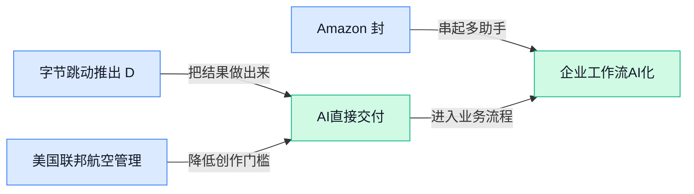

> AI 早报 · 每日早读 · 全网深度聚合

## **今日摘要**

```
字节跳动推出 Dramagic（AI短剧制作平台），从剧本直达成片
Amazon 封禁 Meta Muse（购物智能助手），AI代理大战烧进电商入口
美国联邦航空管理局上线AI工具，直接辅助华盛顿地区机场空管
```

### 🔵 产品与功能更新

1. **字节跳动推出 Dramagic（从剧本到成片的人工智能短剧制作平台）。**  
Dramagic（把短剧多个制作环节集中到一起的平台）主打**从剧本到画面成片**的全流程生产 🎬。所谓全流程（在同一平台内衔接策划、生成与成片等步骤），意味着创作者不必把工作拆散到多个工具中完成。此次发布显示，字节跳动正把人工智能内容生成进一步推向**短剧制作**这一具体场景 💡。[Dramagic 发布报道(briefing)](https://the-decoder.com/bytedance-launches-dramagic-a-full-pipeline-ai-platform-for-producing-short-dramas-from-script-to-screen/)


2. **美国联邦航空管理局上线人工智能工具，辅助华盛顿地区机场空管。**  
这款工具将用于协助华盛顿特区主要机场的**空中交通管制**（协调飞机起降和空中航线、避免运行冲突的工作）✈️。它的定位是辅助型人工智能工具（为工作人员提供信息或建议，但不等于完全替代人工决策），服务于对安全和响应速度要求极高的机场场景。人工智能由此进一步进入关键公共基础设施，不过原始条目暂未披露具体功能和应用范围。[华盛顿邮报报道(briefing)](https://news.google.com/rss/articles/CBMiuAFBVV95cUxObG96dEhjSEU5VkpOTzBndzFrN0RTRmFCRHVLcWtUQlZwMndkbmx5dlVMUkUtUnEtNkNEWkhHRmV3UEt5cEhWbFdpR2tadTFvVy1FbjZCRUFONHl6dWdFVUxWeTF3ajVKLUlKc2JSZFFOVnpUS2hKN2NmMi1nSkh0b0VNMzE1cDA1aXVJRGVqbkN1ZG0zb1ZNX1VwWGlNdVNnSVAxSkVMd0JraTRYeUZsM0VPamNKblpp?oc=5)

### 🟢 前沿研究

1. **OmniVChat（原生音视频对话研究项目）探索让人工智能同时理解声音、画面与对话。**  
这篇论文聚焦**原生音视频对话**，也就是让模型直接结合语音和视觉信息进行交流，而不是只处理文字。研究内容覆盖数据合成、能力评测和模型训练三个环节，试图建立一套完整的研究流程。对产品团队来说，这类方向可能影响未来的语音助手、视频客服和实时会议助手 🚀。[论文页面(briefing)](https://huggingface.co/papers/2609.21465)


2. **Designer-RSI（从用户使用反馈中进化设计经验的智能体系统）面向自动化平面设计。**  
这项研究关注如何让设计智能体从真实的**用户流量与使用行为**中积累经验。这里的**程序性记忆**，可以理解为把“先做什么、后做什么”的操作步骤保存下来，方便之后重复完成类似设计任务。论文将这种记忆进化与智能体式平面设计结合，探索人工智能如何逐步形成更稳定的设计工作流程 💡。[论文页面(briefing)](https://huggingface.co/papers/2609.22086)

3. **When AI Reviews Train AI Reviewers（人工智能互评训练审稿模型）警示科学判断可能陷入失真。**  
论文研究一种循环：先让人工智能生成评审意见，再用这些意见训练新的人工智能评审者。作者关注的核心问题是**科学判断崩塌**，也就是评审内容可能在反复模仿中逐渐偏离真实质量标准。研究同时讨论相应的**缓解措施**，提醒科研机构和企业在使用自动评审时，不能只依赖机器之间的相互打分 ⚠️。[论文页面(briefing)](https://huggingface.co/papers/2609.20942)

4. **BI-Agent（自动完成商业分析的智能体）与 BI-Bench（商业智能评测基准）瞄准端到端数据决策。**  
这项研究试图自动化完成从数据处理到分析结论的完整**商业智能**流程，也就是把业务数据转化为可支持决策的信息。BI-Agent 代表负责执行任务的智能体，BI-Bench 则用于衡量这类系统在实际商业分析场景中的表现。对企业而言，这个方向的意义在于，未来人工智能可能不只是生成图表，还能协助完成更完整的数据分析工作 📊。[论文页面(briefing)](https://huggingface.co/papers/2609.20886)

5. **IntBMoE（让所有专家都参与工作的混合专家模型）探索更充分地组合模型能力。**  
这项研究聚焦**混合专家模型**，即把多个擅长不同任务的小模型组合起来，由系统根据需要调用它们。论文引入**区块级条件控制**，可以理解为让模型在更细的内部模块层面决定哪些专家如何协作，而不是只在整体层面做选择。研究目标是推动“全参与”专家组合，让不同专家在模型运行时获得更充分的协同机会 🧩。[论文页面(briefing)](https://huggingface.co/papers/2609.21346)

6. **GraphSkillEvo（以图结构进化智能体技能的优化方法）尝试让复杂任务能力持续改进。**  
这项研究把智能体技能组织成**图结构**，也就是用节点表示步骤或能力，再用连接关系表示它们之间的先后与依赖。它进一步采用**进化优化**思路，类似不断保留较好的方案、淘汰较弱方案，从而逐步调整技能组合。对使用多步骤智能体的团队来说，这意味着系统可能更容易管理复杂流程，并持续改进任务执行路径 🔄。[论文页面(briefing)](https://huggingface.co/papers/2609.21749)

7. **从预训练到熟练操作：真实世界子任务强化学习推动长流程机器人减少人工干预。**  
论文研究如何让机器人从已有的**预训练**能力出发，通过真实环境中的子任务训练，逐步掌握更长、更复杂的操作流程。这里的**强化学习**，可以理解为机器人根据行动结果获得反馈，再不断调整行为策略，像是在反复练习中找到更有效的做法。研究特别强调尽量减少人工介入，关注机器人从基础能力走向实际熟练操作的过程 🤖。[论文页面(briefing)](https://huggingface.co/papers/2609.21788)

8. **CodeMidas（从代码本身扩展智能体编程训练环境）探索更大规模的软件开发训练。**  
这项研究关注如何利用现有代码构建和扩展**智能体编程**训练环境，让人工智能在更接近真实软件开发的任务中学习。这里的**强化学习环境**，就是让系统可以反复尝试编写或修改代码，并根据结果获得反馈的练习场。论文的核心方向是从代码本身获得训练资源，为自动编程智能体提供更大规模的学习空间 💻。[论文页面(briefing)](https://huggingface.co/papers/2609.22068)

### 🟡 行业展望与社会影响

1. **Amazon 封禁 Meta 的 Muse（可代用户执行购物任务的人工智能助手）。**
Meta 的 Muse 原本可代用户在网上完成购物操作，如今已被 Amazon 电商网站拒之门外 🛒。Amazon 自己拥有**基础模型**（可继续训练并支撑多种人工智能应用的通用模型），也运营**模型推理平台**（让训练好的模型在线生成回答或执行任务的基础服务），因此双方既是合作对象，也是潜在竞争者。[封禁事件完整报道(briefing)](https://the-decoder.com/amazon-blocks-metas-ai-agent-muse-from-online-shopping/) TechCrunch 的报道指出，在没有法律义务开放平台的情况下，Amazon 缺乏让竞争对手助手进入自家购物体系的动力。[行业竞争分析(briefing)](https://techcrunch.com/2026/09/21/metas-ai-agent-has-been-blocked-from-using-amazon-com/) 这场冲突也把一个现实问题摆上台面：当人工智能助手开始替人消费，**谁能进入平台、读取商品并完成交易**，可能成为下一阶段行业竞争的关键 🔐。


2. **OpenAI 呼吁为人工智能下一阶段建立全球共同标准。**
OpenAI 提出，各方应围绕人工智能建立更协调的**模型评估**（用统一测试判断模型能力与风险）、信息报告和治理安排 🌍。其核心思路是，不只让企业各自制定安全规则，而是通过共同标准提高风险信息的可比较性与透明度。[OpenAI 官方说明(briefing)](https://openai.com/index/building-standards-next-phase-ai) 其中的**治理机制**（明确谁负责制定规则、监督执行并处理风险）将直接影响企业怎样开发和部署人工智能。对普通公司而言，这意味着未来采用人工智能产品时，可能需要更系统地关注**安全评估、使用记录和责任边界** 💡。

### 🟣 开源TOP项目

1. **ai-memory（面向智能体编程工具的长期记忆方案）助力不同工具交接。**  
这个开源项目旨在为**智能体编程工具**提供长期记忆，让人工智能助手能够保留更持久的任务背景。它还关注不同厂商的智能体之间如何进行**任务交接**，减少更换工具后需要重新说明上下文的问题。项目中的“编程命令行工具”（通过文字指令在终端里操作的开发工具）面向开发流程使用，适合关注人工智能开发效率和团队协作的读者了解。[GitHub 项目仓库(briefing)](https://github.com/akitaonrails/ai-memory)


2. **AutoClip（人工智能视频高光提取与剪辑工具）面向二次创作。**  
AutoClip 是一款用于**智能提取视频高光片段**的开源工具，能够帮助用户从素材中找到值得保留的内容。它同时支持自动剪辑和二次创作，目标是减少人工反复浏览、筛选和拼接视频的工作量。对内容运营、短视频制作和社交媒体团队来说，这类工具可以作为视频初剪与素材整理的辅助工具 💡。[GitHub 项目仓库(briefing)](https://github.com/zhouxiaoka/autoclip)


### 🔴 社媒分享

1. **Cloudflare（全球网络与云服务公司）的云端 Python（常用于数据处理和人工智能开发的编程语言）运行服务正式可用。**
这项功能经历了**两年预览期**，如今正式结束测试阶段 🚀。开发者可以在 Workers（Cloudflare 的服务器端代码运行平台）上直接执行 Python 代码。对非技术同事来说，可以把它理解为：用 Python 编写的数据处理、自动化等程序，现在可以更正式地部署到 Cloudflare 平台运行。这次更新的重点是**产品成熟度升级**，而非刚刚开始的新实验，具体可查看[正式发布解读(briefing)](https://simonwillison.net/2026/Sep/21/cloudflare-python-worker/)。


2. **Jev（首个“系统一模型”示例）亮相，尝试定义“决策模型”新类别。**
TypeSafe AI（推出该模型的人工智能公司）发布了 **Jev**，并将其称为新类别“系统一模型”的首个示例 💡。团队也使用“决策模型”来描述这一类别，试图探讨一种不同的大语言模型形态。这里的模型类别（按照用途和工作方式对模型进行划分）比普通版本更新更值得注意，因为团队想提出一套新的模型定位。关于这一概念的具体表述，可阅读[决策模型介绍(briefing)](https://simonwillison.net/2026/Sep/21/jev/)。


3. **大语言模型剪枝（删除不重要结构以缩小模型）被改写成伊辛优化（用大量“二选一开关”寻找较优组合）问题。**
文章从物理学角度讨论**模型剪枝**，核心问题是该删除哪些模型区块、保留哪些区块 🔍。其中，区块（模型内部成组的计算结构）可以理解为模型里的“功能模块”，而伊辛优化则负责寻找更合适的保留与删除组合。这个思路相当于把复杂的模型压缩任务，转化成一组“留或不留”的选择题 (๑•̀ㅂ•́)و。候选材料没有提供具体实验结果，但完整思路可查看[模型剪枝原文(briefing)](https://huggingface.co/blog/MultiverseComputingCAI/pruning-llms-like-a-physicist-block-removal-as-an)。


---



### 📊 行业洞察（今日 4 条）

1. 字节跳动推出Dramagic（人工智能短剧工具），支持从剧本直接生成成片。  
  【洞察】短剧制作趋向一体化，因为切换工具更少，但前段偏差可能延续至成片。

2. OmniVChat（音视频对话研究）探索同时理解声音、画面与对话。  
  【洞察】视频交互将更自然，因为理解不再只靠字幕，但能力评测与实际表现仍有差距。

3. Designer-RSI（设计智能体研究）尝试从用户行为中积累可复用经验。  
  【洞察】设计工具会更强调持续改进，因为真实使用反馈可优化操作路径，但也可能固化偏好。

4. When AI Reviews Train AI Reviewers（人工智能互评研究）发现机器评审可能逐渐失真。  
  【洞察】全自动质量评价风险上升，因为模型互相模仿会偏离真实标准，人工复核仍不可少。

### 💭 对我们的启发（今日 3 条）

1. Dramagic表明剧本、画面与剪辑可在同一产品衔接；机会是缩短成片路径，风险是生成偏差连续影响后续结果。

2. AutoClip（智能高光剪辑工具）显示素材筛选可显著提速；机会是强化粗剪体验，风险是高光标准单一导致内容趋同。

3. OmniVChat与Designer-RSI提示可结合音画理解和用户反馈改善剪辑建议；机会是减少重复操作，风险是错误偏好被持续强化。


---

> 本周周报：[第39周综合分析](https://zhuxinfei.github.io/ai-daily-site/blog/weekly/2026-w39/)
