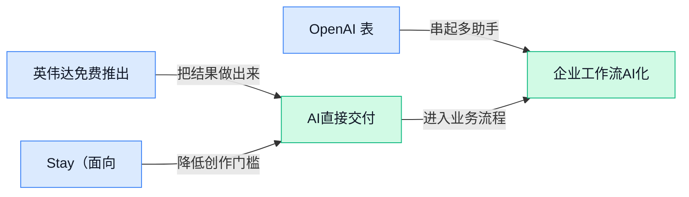

> AI 早报 · 每日早读 · 全网深度聚合

## **今日摘要**

```
英伟达重磅推出免费1亿参数实时说话人识别模型，最多可分辨8人
OpenAI披露80%—90%研究已瞄准GPT-7（下一代大模型）及更远未来
Anthropic突袭应用市场，Claude一次接入2000多个插件和连接器
```

### 🔵 产品与功能更新

1. **英伟达免费推出 1 亿参数实时说话人识别模型，最多可分辨 8 人。**  
这款模型能进行**说话人识别**（判断一段语音中当前是谁在讲话），并支持最多 8 名说话者的实时区分 🎙️。其规模为 **1 亿参数**（模型内部用于学习规律的数值，数量可用于描述模型规模），处理时无需等待整段录音结束。更关键的是，英伟达选择**免费提供**，降低了多人会议、访谈等语音场景的尝试门槛 🚀。[模型发布报道(briefing)](https://the-decoder.com/nvidia-drops-a-free-100m-parameter-model-that-identifies-up-to-eight-speakers-in-real-time/)


2. **1Stay（面向 Claude 用户的人工智能酒店预订连接器）正式上线。**  
这款产品定位为**酒店预订连接器**（让 Claude 与酒店预订服务互通的接口工具），帮助用户把住宿查询与预订需求接入 Claude 🏨。它的重点不是再做一个独立订房平台，而是尝试让用户在熟悉的对话入口中衔接酒店预订流程。对旅游服务行业来说，这体现了人工智能助手正从“提供建议”进一步走向**连接实际服务** 💡。[产品上线报道(briefing)](https://news.google.com/rss/articles/CBMipAFBVV95cUxPRFRpQXliZmpUMXdlTGZ5cnZYa19IMXRuOW9sREVkem1pb0dReUpUcGZoRUVFb1Jjd1dtN0k5eGNleG10VjFleGs2NkVJNWlKUEFERDV5aUFOaVJhOTJ0SmNyWjBxT1JKd184dmtITEdZQkpiaUI2aG1EV0dhOThjM2tuRW9DR3VLNnhtZTZmTThIX1NlTTl3aWJRRzZpdFc3bnh3Yw?oc=5)

### 🟢 前沿研究

1. **Agent-Editing World Model（允许智能体编辑环境状态的世界模型）重新思考大模型智能体的世界建模。**  
这篇论文讨论如何为 **LLM Agents（大语言模型智能体，能够理解任务并连续采取行动的 AI）** 构建更合适的世界模型。所谓**世界模型**，可以理解为 AI 对“当前环境是什么样、采取行动后会发生什么”的内部模拟。论文标题强调，智能体不只是观察世界，还可能需要主动编辑或更新环境状态，以更好地完成复杂任务。[论文页面(briefing)](https://huggingface.co/papers/2609.28416)

2. **Just Ask Jev（直接询问 Jev 的校准决策方法）探索用强化学习检测 AI 对齐失败。**  
这篇论文研究一种基于**强化学习**（通过奖励和反馈训练 AI 做出更好决策）的决策方法，用来观察 AI 的判断是否可靠。标题中的**校准决策**，指的是 AI 给出的信心程度应尽量与实际正确率相匹配，避免“明明不确定却说得很肯定”。论文还提出将这种方法用于**零样本检测**（不额外提供示例，就直接识别问题），目标是发现 **AI 对齐失败**（AI 的行为偏离人类预期或设定目标的情况）。[论文页面(briefing)](https://huggingface.co/papers/2609.29429)

3. **WanPE（面向视频生成的电影感提示词增强方法）瞄准更自然的文本生成视频。**  
这篇论文关注如何改进文本生成视频时使用的提示词，让文字描述更接近电影制作中的表达方式。**提示词增强**，就是在用户原始描述的基础上补充画面、镜头或风格信息，帮助模型更准确地理解创作意图。论文将这一方向应用于现代**文本生成视频**，重点是提升视频提示词的“电影感”表达。[论文页面(briefing)](https://huggingface.co/papers/2609.30221)

4. **ExplorationBench（可验证外星世界探索评测集）用于衡量 AI 的探索能力。**  
这篇论文提出一个名为 **ExplorationBench** 的评测项目，用来测量 AI 系统在虚构但可验证的“外星世界”中如何进行探索。这里的**探索能力**，指 AI 是否会主动尝试不同路径、收集信息并逐步理解陌生环境，而不只是重复熟悉的操作。**可验证**意味着探索过程和结果能够被检查，从而更客观地比较不同 AI 系统的表现。[论文页面(briefing)](https://huggingface.co/papers/2609.30199)

5. **AV-GRPO（音视频联合生成的模态解耦扩散强化学习方法）探索让声音与画面协同生成。**  
这篇论文研究如何让 AI 同时生成**音频和视频**，而不是只生成单一形式的内容。标题中的**模态**，指文字、声音、图像、视频等不同类型的信息；**模态解耦**则是把不同信息类型的学习过程适当分开，再让它们保持协调。论文还结合**扩散模型**（通过逐步去除噪声生成内容的模型）与强化学习，讨论音画联合生成的训练方式。[论文页面(briefing)](https://huggingface.co/papers/2609.29816)

6. **DeltaWAM（双手操作的增量世界动作模型）面向机器人协同操作。**  
这篇论文提出 **DeltaWAM**，研究机器人如何使用**世界动作模型**（预测环境状态与动作变化之间关系的模型）完成双手操作。所谓**增量动作**，可以理解为模型不必每次都从头规划完整动作，而是持续判断“下一小步应该怎么调整”。这一方向与机器人抓取、移动和协同使用双手等任务有关，重点在于提升动作规划对环境变化的适应能力。[论文页面(briefing)](https://huggingface.co/papers/2609.28811)

7. **ViRDM（表示分布匹配方法）尝试用少量步骤生成因果视频。**  
这篇论文研究如何让 AI 用更少的生成步骤完成**因果视频生成**，也就是按照时间顺序逐帧产生后续画面，而不是一次性看到完整视频再进行处理。标题中的**表示**，可以理解为模型内部对画面内容形成的数字化理解；**分布匹配**则是让生成结果的内部表示更接近目标视频的特征分布。论文重点讨论如何改进这一过程，以支持少步骤的视频生成。[论文页面(briefing)](https://huggingface.co/papers/2609.28923)

8. **随机 Hessian 估计（利用随机曲率信息的优化方法）改进全参考图像质量评估。**  
这篇论文研究如何优化**全参考图像质量指标**，也就是把待评估图片与一张完整、清晰的参考图片进行比较，从而判断画质差异。标题中的 **Hessian（描述目标函数曲率的数学信息）**，可以帮助判断优化过程应该朝哪个方向调整；随机估计则是在不完整计算全部信息的情况下近似得到这种曲率。论文将这一思路用于**率失真优化**（在文件大小与图像质量之间寻找更好平衡），服务于图像压缩和质量评估场景。[论文页面(briefing)](https://huggingface.co/papers/2609.30077)

### 🟡 行业展望与社会影响

1. **OpenAI 表示，80%—90% 的研究已瞄准 GPT-7（下一代大模型）及更远未来。**  
OpenAI 透露，目前其研究资源中约有 **80%—90%** 已经面向 GPT-7（下一代大模型）及更远期目标 🚀。这意味着头部 AI 公司正在把研发重心持续推向更强模型，而不只是围绕现有产品做局部升级。对行业来说，模型能力的长期竞赛仍在加速，企业也需要提前思考未来的算力、人才与应用储备。[完整报道(briefing)](https://the-decoder.com/openai-says-80-to-90-percent-of-its-research-already-targets-gpt-7-and-beyond/)


2. **乌克兰前国防部长 Fedorov（乌克兰前国防部长）提出由私营部门打造机器人军队。**  
乌克兰前国防部长 Fedorov（乌克兰前国防部长）提出，应考虑由**私营部门**推动机器人军队建设 🤖。这里的机器人军队，指将机器人系统用于军事行动，而不只是传统意义上的工业机械。这个设想把人工智能、机器人与国防产业进一步连接起来，也引发了对战争形态和安全边界的讨论。[完整报道(briefing)](https://the-decoder.com/former-ukrainian-defense-minister-fedorov-pitches-a-private-sector-robot-army/)


3. **数万次安全探测显示，OpenAI 与 Hugging Face（AI 模型共享社区）的安全事件可能只是开始。**  
大量**安全探测**结果显示，OpenAI 与 Hugging Face（全球最大的 AI 模型共享社区）相关的安全事件，可能并非孤立案例 ⚠️。安全探测可以理解为持续尝试发现系统弱点的检查行动，类似于不断测试一栋大楼的门窗是否存在漏洞。对企业而言，AI 系统上线后仍需持续监测和防护，不能把安全工作只放在发布前。[完整报道(briefing)](https://the-decoder.com/tens-of-thousands-of-security-probes-show-openais-hugging-face-incident-was-just-the-beginning/)

4. **高盛预计，到 2027 年大型科技公司将在 AI 基础设施上投入 1.2 万亿美元。**  
高盛预计，大型科技公司到 2027 年将在 **AI 基础设施**上投入约 1.2 万亿美元 💰，规模明显高于华尔街此前的估算。AI 基础设施包括训练和运行大模型所需的服务器、数据中心与算力资源，可以理解为支撑 AI 运转的“水电煤”。这说明行业竞争正在从单纯比拼模型效果，扩展到比拼算力、数据中心和长期投入能力。[完整报道(briefing)](https://the-decoder.com/goldman-sachs-expects-big-tech-to-spend-1-2-trillion-on-ai-infrastructure-by-2027-dwarfing-wall-street-estimates/)

5. **Anthropic 的人工智能真的能独立完成科学发现吗？《纽约时报》提出追问。**  
《纽约时报》围绕 Anthropic 的人工智能是否真正**独立完成科学发现**展开讨论 🔬。这里的“独立”并不只是让模型生成一段看起来合理的文字，而是要判断它是否在没有人类直接指导的情况下提出并完成了有价值的科学工作。这个问题也提醒我们，评价 AI 的科研能力时，不能只看结果是否新颖，还要关注人类在其中承担了多少决策与验证工作。[《纽约时报》报道(briefing)](https://news.google.com/rss/articles/CBMihgFBVV95cUxQREYyMjZVV2F2QllnOVpLTnc4WWR3OGphX3A5WlJRTjhUTEROU0FIb2h0Wkgzb0h1VWRqNnhaUFlkdHRQb0dpXzFVeFlrZVVBcjQ5RzRPVW00MXNmdEV2LVNnRE00TkVZSTdaenhyNE9BOE9GdjlyTUZfeVlMa1JhYlZmNkxIUQ?oc=5)

6. **人工智能 Agent（能自主拆解任务并执行的助手）参与更多模型开发，但最终决策仍由人类做出。**  
人工智能 Agent（能自主拆解任务并执行的助手）正在承担更多**模型开发**工作，例如协助推进研究流程和完成具体任务 🤖。不过，文章强调，真正的关键决策仍然由人类做出，这意味着 AI 更像是研究团队中的执行者和协作者，而不是完全取代研究人员。对企业来说，这种“AI 扩大执行能力、人类保留判断权”的协作模式，可能会成为未来研发与办公流程的重要形态。[完整报道(briefing)](https://the-decoder.com/ai-agents-do-more-of-the-work-in-model-development-but-humans-still-make-the-decisions/)

7. **Anthropic 将 Claude（人工智能助手）变成拥有 2,000 多个插件和连接器的 AI 应用市场。**  
Anthropic 正在把 Claude（人工智能助手）扩展成一个包含 **2,000 多个插件和连接器**的 AI 应用市场 🧩。插件（为助手增加特定功能的小工具）和连接器（让 AI 接入外部软件或数据的接口），可以帮助 Claude 承担更多不同类型的工作。若这一方向持续发展，AI 助手就不再只是单一聊天工具，而会逐渐变成连接多种办公服务的工作入口。[相关报道(briefing)](https://news.google.com/rss/articles/CBMi4AFBVV95cUxOVnRqLTRpNnpkWHRHSUNSUW02UktpWjNRVXc2UVN6V2FjX2Q1cVBSMl9UUmFla3BYcVNOTS1vS2ItTVJUcjRYRFlEQTI3a1Q4T2hxY1J0bkhLWk9HcG9BaFo1cFF3WWRQWGp0aDZMVk9wcUJoUXlJM1RjYkdPVFY3YXU2SW1pbUJkTVpzR0xWUWZVUTdyV1BVZ1NmcGNlUVZaeHdWZGtuY3F2ZEQxakRmUzh4U1M0dmtSd19NLV9TYUFkYV9GdHAzVkRTN3p1OWJzMGc2emQ2Tzh4UUhxSkZWRtIB5gFBVV95cUxOU0FncnRFblBBNFktbE1CeHR4Y1lNYndMaTlKZFdnWmxMaW8yMDIzYWFZZVZYSURVeXhxZHB1TER3NXdBQ1lVb2Y0NmF0cGtjUmwyLUx4dkhXd1VQY2FyS3g4RGkzcGpRUU1XVmEzVFkxRm85TXdWRlVmRlFlbXhLdzBlNDl3WTBsOVVITVFId1JQcWVVRHZybZV6WHVLVzdncHI3ZS15NDdidFc5bERTclRWeTVRbnY2dEdQUFpweks1c3dGUkZMMUpLR0tQWU9mYV9JZ1MzcHhrRkdIbjlrb1NlTG1nZw?oc=5)

### 🟣 开源TOP项目

1. **PipePipe（开源的安卓视频浏览应用）让内容浏览更自由。**  
PipePipe 是一款**开源应用**，面向 Android（安卓移动操作系统）设备，支持浏览 YouTube（视频分享平台）及其他服务。它的核心价值是把多类视频内容入口集中到一个应用中，适合希望更灵活浏览内容的用户。对于内容研究、竞品观察或日常视频消费来说，这类工具提供了一个不同于官方客户端的选择 🚀 [GitHub 项目仓库(briefing)](https://github.com/InfinityLoop1308/PipePipe)


2. **scriptc（把 TypeScript 转成原生程序的编译器）开源。**  
scriptc 是一个**开源编译器**，用于把 TypeScript（常用的编程语言，适合编写更易维护的网页和应用程序）转换为原生程序。这里的“原生”可以理解为更贴近设备直接运行形式的程序，而不是只依赖浏览器环境。对开发者来说，它探索了让熟悉网页开发语言的代码走向更底层运行场景的可能性 💡 [GitHub 项目仓库(briefing)](https://github.com/vercel-labs/scriptc)


3. **VoiceStudio（本地运行的开源语音创作平台）支持 646 种语言。**  
VoiceStudio 是一个**开源、完全本地运行**的语音工具，被定位为 ElevenLabs（提供人工智能语音生成服务的平台）的替代方案。它覆盖**声音克隆**（根据样本模仿某个人的声音）、声音设计、视频配音、听写、语音转文字和有声书制作等功能。由于主要在本地处理，用户可以在一套工具里完成从语音生成到内容制作的多个环节，并支持 646 种语言 🌍 [GitHub 项目仓库(briefing)](https://github.com/debpalash/VoiceStudio)


### 🔴 社媒分享

1. **2026 年大语言模型趋势：到目前为止发生了什么？**
这篇分享源自作者在圣何塞举行的 **WeAreDevelopers World Congress North America（面向软件开发者的北美行业大会）**闭幕演讲 🎤。作者按时间顺序串联过去一年大语言模型（能够理解并生成人类语言的模型）的关键趋势，帮助读者从一连串热点中看清行业演变脉络。想系统回顾今年模型领域的发展，而不是只追逐单条新闻，可以阅读这份[年度趋势回顾(briefing)](https://simonwillison.net/2026/Sep/27/2026-in-llms-so-far/) 💡


2. **Lofi Cities（浏览器生成低保真音乐的像素城市网站）上线。**
这个网页把**像素艺术（用方格像素绘制、带有复古游戏感的画面）城市夜景**与低保真音乐结合，营造出轻松、安静的线上空间 🌃。其特色是音乐由浏览器生成（通过网页程序直接合成声音），而不只是展示一张城市插画。对于需要专注办公、阅读或放松的用户，它提供了一种简单又有氛围感的背景体验，可前往[像素城市音乐网站(briefing)](https://loficities.com/)亲自感受 🎧


---



### 📊 行业洞察（今日 3 条）

1. 英伟达免费发布Nemotron 3 Diarization（说话人识别）模型，可实时区分最多8名说话者。  
  【洞察】多人访谈的分轨与字幕制作将更高效，因为低成本语音分析正降低专业剪辑门槛，但同质化竞争也会加剧。

2. VoiceStudio开源并支持646种语言，覆盖声音克隆、视频配音、听写与转写等创作环节。  
  【洞察】语音内容工具正走向一体化，因为用户可在单一软件完成多语言制作；但声音滥用与授权风险同步上升。

3. AI智能体贡献模型开发中55%的方法建议，但人类仍作出超过85%的最终决策。  
  【洞察】智能体更适合扩展创意探索而非完全替代判断，因为复杂任务仍需人工审核，效率提升与失控风险并存。

### 💭 对我们的启发（今日 2 条）

1. 结合英伟达模型与VoiceStudio，可优先强化多人分轨、字幕校正和多语言配音，减少剪辑步骤；但需加入声音授权提示。

2. 参考AI智能体参与模型开发的案例，视频工具应采用“建议—预览—确认”体验，让智能生成提升创作效率，同时保留用户最终决定权。


---

> 本周周报：[第40周综合分析](https://zhuxinfei.github.io/ai-daily-site/blog/weekly/2026-w40/)
