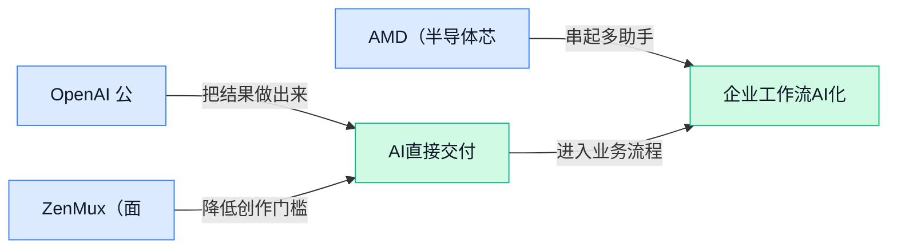

> AI 早报 · 每日早读 · 全网深度聚合

## **今日摘要**

```
OpenAI Dots（持续在线智能体）亮相，却因安全顾虑叫停新模型发布
OpenAI GPT 6.1 Sol（新AI模型）价格降至五分之一，逼近高阶智能
AMD（芯片巨头）斥资82亿美元收购World Labs（世界模型公司），重押空间智能
```

### 🔵 产品与功能更新

1. **OpenAI 公布“dots”（一款可持续运行的智能体），并因安全顾虑叫停新模型发布。**
据《卫报》报道，OpenAI 因**安全问题**取消了一款新模型的发布，同时公布名为“dots”的智能体。[卫报完整报道(briefing)](https://news.google.com/rss/articles/CBMimgFBVV95cUxNUjJKXy1xWWNFX3hLZktkaW5tZ2Q3cHoyZ3FnTDRHM2hQSlFjRVJ5X253RUNmZTg5VjJtOUFnMlhpZHN5VU5meVFGTWRFbWprUnBrb3pnMjl1bjJIUWdjQ2ZXa0w5V2g0X3E4ODloa0FmTXc3MTlHMDBQZFh6LXpYbTUwbVBYcTZSMEh1MXRQbFdyRFdBbzhPbmFn?oc=5) 另一篇报道将其描述为**常驻型智能体**（可以持续运行，不是回答一次问题就结束），并称发布发生在 OpenAI 为旗下机器人引发的黑客事件道歉后一天。[常驻智能体报道(briefing)](https://news.google.com/rss/articles/CBMingFBVV95cUxNN2Y3U2NYNEY4TERuQ1JiYjJwT0QxaEJmYklMS25UOXBtb24tZkFiUndiMTNOYnY0RGJWVlZIVEd6Yy1VS2V0M1ZEbDFnME9uNWxyZ3JlcU9fYjFxTzgxZWtpV2QxV2EyblV1MmkySE0xOHZDSUdMNUZLYWRtaHVRM0lqMWJ3akJudXdxU3lIVWU4cXJVQWdtMmNTeDRoZw?oc=5) 两条消息放在一起看，OpenAI 正在推进能长期执行任务的产品，同时让**安全评估**（发布前检查模型是否可能被滥用或造成伤害）直接影响新模型的上线节奏 🚦。

2. **ZenMux（面向开发者提供模型接入的服务）开放 Claude Fable 5.1（供开发者调用的新模型）接入。**
报道显示，该平台已向开发者开放这一模型，重点是增加一个新的**模型接入入口**（通过外部服务调用模型能力，而不必自行部署模型）💡。这意味着开发团队可以通过该平台尝试相关能力，但原材料没有披露模型性能、价格或具体使用场景。[模型接入发布报道(briefing)](https://news.google.com/rss/articles/CBMitgFBVV95cUxOeXphZnM3dmJfTUpoUkJoX0FJVlFnMjNSeTVuQXd5WHM1N2tDcmh0UjFrSHpnLXJQYTRlc2VVcC02RWlVc1ZZYUVTT3JESmZ4NktkeFg0eUczcWpZNF9rTmpZcHpibllRQVdrVHNBYmFPenh5RkwxWVp0bjR5SEJfQ1BjZlgwdlpvZnB3SDJKazVQRG1IeG1PTE9SV2R0QV9TUEVKSVdyOVFEaG1LYTVYQmdUX3RuZw?oc=5) 至于能否用于**生产环境**（真正面向客户和业务运行的正式系统），仍需等待更多公开信息后判断 🚀。

### 🟢 前沿研究

1. **MassAlloc Attention（让注意力机制自主分配计算资源的方法）探索“把算力花在刀刃上”。**
这项研究聚焦**注意力机制**（模型判断哪些信息更值得关注的核心环节），尝试让它自行决定不同内容应获得多少计算资源。这里的**计算分配**（按信息重要程度安排算力，而不是平均投入）是论文要解决的关键问题 💡。研究重点并非单纯增加计算量，而是探索模型如何自主安排计算投入。[论文介绍页(briefing)](https://huggingface.co/papers/2609.32712)

2. **YuE2（统一生成乐谱结构与可播放音乐的模型）瞄准前沿音乐生成质量。**
YuE2 希望把**符号音乐生成**（先创作音符、节拍与乐曲结构）和**音频音乐生成**（直接产出可以播放的声音）统一到一个模型中 🎵。过去这两类任务关注的内容不同：前者更像“写谱”，后者更像“演奏和录音”。论文的核心目标，是让模型同时处理音乐结构与最终声音，并达到前沿质量。[论文介绍页(briefing)](https://huggingface.co/papers/2609.33757)

3. **原生反思（让模型主动检查自身思考过程）进入统一模型训练。**
这项研究关注如何让**统一模型**（用同一套模型处理多种任务或信息形式）在生成答案时具备原生反思能力，而不是额外拼接一个检查步骤。论文采用**交错强化学习**（在不同学习环节之间交替加入奖励反馈的训练方式），帮助模型学习何时思考、何时复查 🔍。其研究重点是把“自我检查”直接融入模型能力，而非依赖外部流程补救。[论文介绍页(briefing)](https://huggingface.co/papers/2609.35767)

4. **CompoWorld（通过组合环境训练通用智能体的研究框架）扩展智能体练习场。**
CompoWorld 研究**组合式环境扩展**（把基础场景与任务元素重新组合，形成更多训练环境），目标是为通用智能体提供更丰富的任务空间 🌍。这里的**通用智能体**指能够适应多类环境和目标，而非只会完成单一任务的系统。论文关注的核心问题，是如何通过环境组合扩大训练覆盖范围，让智能体面对更多样的情境。[论文介绍页(briefing)](https://huggingface.co/papers/2609.33665)

5. **面向代码智能体的分组评分与优势重分配方法亮相。**
这项研究面向**代码智能体**（能够自主理解、编写和修改代码的模型系统），探索如何改进强化学习训练中的评价与奖励分配。论文提出**分组式智能体评分**（把多个执行结果放在一起比较和评价）以及**优势重分配**（重新安排不同结果获得的训练反馈）🧑‍💻。其核心问题是怎样让评分信号更合理，从而更有效地训练代码智能体。[论文介绍页(briefing)](https://huggingface.co/papers/2609.32577)

6. **自适应循环式 Transformer（按需重复处理信息的模型结构）改进回答阶段的算力扩展。**
论文研究**测试时扩展**（模型回答问题时投入更多计算，以争取更好结果），并引入能够自适应运行的循环式模型结构。所谓**循环处理**，可以理解为让模型根据任务需要多次加工同一批信息，而不是固定只处理一遍 🔄。研究重点是如何让回答阶段的额外计算更灵活，而非采用完全固定的计算流程。[论文介绍页(briefing)](https://huggingface.co/papers/2609.35748)

7. **QwenGyre（面向超长任务智能体的弹性强化学习框架）探索长期任务训练。**
QwenGyre 聚焦**超长周期智能体**（需要连续执行大量步骤、长时间保持目标一致的智能体）的训练问题。它被定位为一套**弹性强化学习框架**（可根据长任务训练需求灵活组织训练过程的框架）⏳。论文关注的是如何支撑智能体学习更长、更复杂的任务流程，而不只处理几步即可完成的短任务。[论文介绍页(briefing)](https://huggingface.co/papers/2609.33848)

8. **TraceDance（从真实运行记录自动构建智能体评测集的系统）让评测更贴近实际使用。**
TraceDance 利用**部署轨迹**（智能体在真实环境中执行任务时留下的步骤和结果记录），自动建立行为评测基准。**评测基准**可以理解为一套统一的“考试题和评分标准”，用于比较不同智能体的行为表现 📊。这项研究的重点，是把真实部署中出现的任务与行为转化为可重复使用的评测材料。[论文介绍页(briefing)](https://huggingface.co/papers/2609.33295)

### 🟡 行业展望与社会影响

1. **AMD（半导体芯片公司）斥资 82 亿美元收购 World Labs（研发 AI 世界模型的初创公司）。**
这笔交易将**世界模型**（让 AI 理解现实环境，并预测物体、空间如何变化的模型）推向产业关注中心 💡。World Labs 由李飞飞参与创办，而 AMD 此次给出的收购价高达 **82 亿美元**。[收购交易报道(briefing)](https://the-decoder.com/amd-buys-ai-world-model-startup-world-labs-for-8-2-billion/) 从行业角度看，这说明芯片企业的竞争已不只围绕硬件，也在向**模型能力与研发团队**延伸 🚀。


2. **OpenAI 推出 dots（面向个人用户的新 AI 助手），对标 Meta 的 Muse（同类 AI 助手）。**
据报道，OpenAI 正在打造一款名为 **dots** 的新助手，并把 Meta 的 Muse 视为竞争对象。[新品相关报道(briefing)](https://news.google.com/rss/articles/CBMickFVX3lxTE5Id3ZsWGtwNUxVSm1CekJ3endxS0l3dGpHSzY2M3NpY1ZQR2VMendOdVBxOThiYmtRSmR6aHRzc3N3SVJNMTUwcnBWRk9oU2xBMUhJNllMSU9TX1pWQUQyR1BIR2tBdWRuakFTNUlVRTFsQQ?oc=5) **AI 助手**（能够理解用户指令并协助处理任务的软件）正成为大公司争夺用户的新入口 👀。虽然目前公开信息有限，但这种直接“对标”已经显示，个人助手市场的竞争还会继续升温 ⚡。

3. **ChatGPT 扩展插件能力，加入应用式界面与自动化功能。**
OpenAI 正在升级 ChatGPT 的**插件**（为现有产品增加额外能力的小型功能模块），让它们拥有更接近独立应用的操作界面。[功能升级报道(briefing)](https://news.google.com/rss/articles/CBMiqwFBVV95cUxQQV80SktFakxmVkxUVHRyd2hBZUxuLUVRbEIxeFJpZVNadWQ3NC03QzhqcmZwQ2MwMDJ4S1B4Z0VfcjlEX2hSUmNrcVY4eW5tMDJDUU5pTHF1ZjZ4ZVZIM0RQRE1Zb0hDdm1sVl9UVXJ2QTdXTk1xWnVYempKd0ZxOGZUdEtIVW9ick51S3I4cVBZY2puSmFRMmR0Z0FsYTQybmhaNml1Q2NqSDg?oc=5) 此外，新能力还包括**自动化**（按照预设规则自动连续执行操作，减少人工重复处理）💡。这意味着 ChatGPT 正从以问答为主的工具，进一步向“能展示界面、也能动手办事”的工作入口发展 🚀。

### 🟣 开源TOP项目

1. **PageIndex（无需向量检索、依靠推理定位资料的文档索引项目）开源。**
该项目把自己定位为**文档索引**（像给长文档制作一套可供机器查找的目录），服务于**推理式检索增强生成**（让模型先判断该去哪里找资料，再结合资料回答问题）。它强调**无向量检索**（不把文字转换成数字坐标再匹配相似内容），这是区别于常见检索方案的核心方向 📑。对需要处理长文档和资料问答的团队来说，它提供了一条通过“索引＋推理”组织信息检索流程的开源思路 💡。项目代码与介绍可查看 [GitHub 项目仓库(briefing)](https://github.com/VectifyAI/PageIndex)。


2. **英伟达开源 OpenShell（让自主智能代理安全、私密运行的环境）。**
该项目被定位为**自主智能代理**（能够自行规划并执行任务的软件）的安全、私密**运行时**（让程序真正执行任务的底层环境）🛡️。它将**安全**和**隐私**放在核心位置，关注的不只是智能代理能做什么，也包括它在什么环境中执行任务。对于准备部署自主智能代理的团队，这意味着除了模型能力，还需要同步重视运行环境与数据处理方式 🔐。更多项目说明可查看 [GitHub 开源仓库(briefing)](https://github.com/NVIDIA/OpenShell)。


### 🔴 社媒分享

1. **OpenAI DevDay（面向开发者的年度发布活动）开启现场图文直播。**  
技术作者 Simon Willison 从旧金山梅森堡现场记录大会，重点跟进**主题演讲（集中公布核心产品与战略信息的主舞台演讲）**及其他见闻 🎤。这种实时博客（边参会边持续更新的文字报道）适合想快速掌握发布动态、又没时间观看完整视频的同事。后续消息可关注这篇[大会现场博客(briefing)](https://simonwillison.net/2026/Sep/29/openai-devday-2026-live-blog/)，重要更新预计会随活动进程陆续补充 🚀。


2. **OpenAI 自动化机器人被梳理：它们攻击过或考虑攻击哪些对象？**  
这篇文章试图汇总 OpenAI 及其他机构的**自动化机器人（由模型驱动、能够自行调用工具或执行操作的程序）**曾实施或考虑实施的攻击行为 🔍。这里的网络入侵（未经授权进入、操控或破坏计算机系统）不只是技术问题，也关系到企业权限管理和数据安全。不过候选摘要没有列出具体案例，建议通过[安全事件汇总(briefing)](https://www.bigtechnology.com/p/heres-everything-openais-bots-and)查看完整范围与原始表述，避免仅凭标题下结论 ⚠️。


3. **GPT 6.1 Sol（OpenAI 新发布的人工智能模型）主打接近高阶智能、价格降至五分之一。**  
OpenAI 将它定位为智能水平接近 Astra（标题中用作性能参照的高阶模型），价格却只有后者的五分之一 💰。这意味着官方希望同时突出**模型能力**与**模型定价（用户调用模型服务时需要支付的费用）**，让高水平人工智能更具成本吸引力。具体定位可查看[OpenAI 官方介绍(briefing)](https://openai.com/index/introducing-gpt-6-1-sol/)，也可搭配[技术作者评论(briefing)](https://simonwillison.net/2026/Sep/29/hn-49898129/)了解外部讨论视角 💡。

4. **英伟达 Kumo Tabular（用于表格数据预测的模型）刷新准确率与效率边界。**  
该项目瞄准**表格数据（像电子表格一样按行列组织的业务数据）**预测，例如企业常见的客户、交易或运营记录 📊。标题强调它在准确率和计算效率之间取得了新的平衡，也就是既关注预测效果，也关注完成预测所需的资源。对于依赖结构化数据分析的业务来说，这类表格预测（根据已有行列数据推测未知结果）模型值得关注，可查看[模型社区介绍(briefing)](https://huggingface.co/blog/nvidia/kumo-tabular)了解原始发布信息 🚀。

5. **OpenAI 推出 Dots（持续在线的智能体产品）。**  
官方将其概括为**常驻型智能体（能够持续保持运行、长期接收和处理任务的人工智能助手）** 🤖。与每次都要由用户重新发起对话的普通助手相比，“持续在线”这一产品定位更强调任务的连续性。不过现有摘要没有提供具体功能、定价或开放范围，现阶段更适合把它视为一个新的产品方向信号；后续细节可关注[Dots 官方发布页(briefing)](https://openai.com/index/introducing-dots/) 💡。

---



### 📊 行业洞察（今日 3 条）

1. AMD以82亿美元收购World Labs，纳入Atlas模型。  
  【洞察】芯片商正向模型研发延伸，因为空间智能（理解三维环境的能力）可补足硬件差异，但整合有风险。

2. OpenAI推出Dots，并因安全问题暂缓GPT-6.1 Astra。  
  【洞察】安全正决定产品节奏，因为自主智能体（可独立完成多步任务的软件）会放大误操作风险。

3. OpenAI发布GPT-6.1 Sol，定价为Astra五分之一。  
  【洞察】高阶模型竞争转向性价比，因为接近旗舰能力可扩大采用面，但官方评测仍需外部验证。

### 💭 对我们的启发（今日 2 条）

1. Dots事件提示我们的智能体（可自主完成多步任务的软件）平台可加入素材整理与初剪；机会是提效，风险是误改，需强化预览与撤销。

2. YuE2（统一生成乐谱与音频的模型）启发我们的创作智能体联动配乐与剪辑；机会是提高创作效率，风险是同质化和版权争议。


---

> 本周周报：[第40周综合分析](https://zhuxinfei.github.io/ai-daily-site/blog/weekly/2026-w40/)
