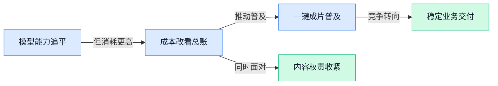

> AI 早报 · 每日早读 · 全网深度聚合

## **今日摘要**

```
Google发布Gemini 4 Argon，号称迄今最强却仍未明显领先
FTC调查OpenAI、Anthropic，两大AI实验室陷消费者保护审查
Synopsys（芯片设计软件公司）联手OpenAI，AI模型直攻芯片设计
```

### 🔵 产品与功能更新

1. **Google 发布迄今最先进的 Gemini 人工智能模型。**  
Google 发布了目前被称为最先进的 **Gemini 人工智能模型**（能够理解并生成文字等内容的软件系统）🚀。这意味着 Gemini 的产品能力又向前推进了一步，但原报道摘要没有披露具体升级了哪些功能、面向哪些用户或何时全面开放。对企业用户来说，后续值得关注它是否会带来更强的内容生成、分析和办公协作能力。[《金融时报》报道(briefing)](https://news.google.com/rss/articles/CBMihAFBVV95cUxONHZCTWxBOEZWZTVseDhUeFdNMTZoTTRqa242NDFQRWdrMEdWYlEtWVNwQkRjUXdmX1dzUEhkZlV2bDY2aTVPbnBfNGJhXzk5NWVPRWlqbTJKTkZDU0k2dTJENXo1N2dDRHVGdHYyWVJGNUxiWVczMlBnV0JRWC12d1llUVk?oc=5)


2. **美国联邦贸易委员会调查 OpenAI、Anthropic 等人工智能实验室的消费者保护问题。**  
美国联邦贸易委员会（FTC，美国负责监督市场公平与消费者权益的监管机构）启动了一项范围广泛的调查，关注 OpenAI、Anthropic 等人工智能实验室是否存在 **消费者保护** 方面的问题 ⚖️。这类监管通常意味着，人工智能产品如何面向普通用户提供服务、如何处理潜在风险，正在受到更严格审视。对企业而言，未来推出人工智能产品时，除了功能和效率，也需要重视用户权益、信息透明度与合规要求。[监管调查完整报道(briefing)](https://the-decoder.com/ftc-launches-sweeping-probe-into-openai-anthropic-and-other-ai-labs-over-consumer-protection-concerns/)

3. **Google 发布 Gemini 4 Argon（Google 推出的新一代人工智能模型），号称迄今最强。**  
Google 发布了 **Gemini 4 Argon**（Google 推出的新一代人工智能模型），并被称为目前能力最强的 Gemini 模型 🚀。原报道摘要没有进一步说明它在文字、图片、推理或办公任务上的具体表现，因此暂时无法判断它与上一代产品相比提升了多少。若该模型后续进入更多产品或服务，可能会继续扩大 Google 在人工智能助手和企业应用市场的竞争力。[科技媒体报道(briefing)](https://news.google.com/rss/articles/CBMiogFBVV95cUxOaThYZG00MENsWUtiaDkwbW44Z3BDNlNkcDRoSldzZGNBcnVEc3FSLVU3UXVRMDhtRmI0MnJXSnRsWC1IbEVtMVRnWlY2b3M2TnN1bkk5VURBNFp0RmtmU2JkZl94RC03c29OOTJuenJ2cS1BUFRlWDVEZExGLXVpRDZqd1B2OU5aMlVTbFVKc0xpMnZJYmgxeHNCMjZ5a2hYblE?oc=5)

### 🟢 前沿研究

1. **开放式语音合成排行榜瞄准多语言与声音克隆评测。**
这套排行榜希望以统一、可扩展的方式，比较不同模型将文字转换为语音的能力 🎙️。它同时覆盖**多语言语音合成**和**声音克隆（根据声音样本模仿特定说话人音色）**，让模型之间的差异更容易被看见。所谓**可扩展评测（模型和语言数量增加后，仍能持续进行统一比较的评估方式）**，重点是让后续新增模型也能进入同一套比较体系。对语音产品团队而言，这类公开排行榜可为模型研究与选型提供更直观的参考 💡。[排行榜发布说明(briefing)](https://huggingface.co/blog/open-tts-leaderboard)


2. **Gemini 4 Argon（报道中的模型版本名称）缩小与 OpenAI、Anthropic 的差距，但尚未明显领先。**
报道显示，Google 的这一模型版本进一步追近了 OpenAI 和 Anthropic，但还没有形成清晰的整体优势 🏃。这里的**差距缩小**并不等于全面超越，而是说明头部模型之间的竞争仍然十分胶着。模型评测通常依靠**基准测试（用一组统一任务比较不同模型表现的“标准化考试”）**，单项成绩与实际使用体验也不能简单画等号。对企业用户来说，这意味着选择模型时仍需结合自身任务，而不是只看谁暂时排在第一 💡。[模型表现完整报道(briefing)](https://the-decoder.com/google-gemini-4-argon-closes-the-gap-with-openai-and-anthropic-but-doesnt-take-a-clear-lead/)


3. **同一字节为何拥有不同权限？新研究审视聊天模板中的提示注入风险。**
论文关注一个容易被忽视的安全问题：内容即使对应相同的**字节（计算机保存和传输文本的基础数据单位）**，采用不同的保留标记表示后，也可能被模型赋予不同权限 🔐。**保留标记（模型用来区分系统指令、用户消息等角色的特殊符号）**会与聊天模板共同决定一段内容在模型眼中的“身份”。这可能影响**提示注入（通过恶意内容诱导模型忽略原有指令或越权行动）**的判断与防护。研究提醒产品团队，安全检查不能只看用户表面输入，还要检查内容进入模型后的实际表示方式 🛡️。[安全研究论文页(briefing)](https://huggingface.co/papers/2609.35932)

4. **视觉标记极限压缩不再只靠删减，而是探索新的参数化方式。**
这项研究关注如何大幅减少模型处理图片时所需的**视觉标记（模型把图像切分、编码后形成的基本信息单位）** 🖼️。以往压缩往往侧重从现有标记中挑选少量内容，论文则进一步研究**标记参数化（用可调整的表示来概括视觉信息，而非简单保留或删除原标记）**。其目标是在极高压缩比例下，仍尽量保留模型理解图像所需的信息。若这一方向有效，可能有助于减少视觉模型面对长图片内容时的处理负担，但具体效果仍需以论文实验为准 💡。[视觉压缩论文页(briefing)](https://huggingface.co/papers/2609.35232)

5. **大模型预训练尝试采用低精度注意力计算，探索更节省资源的训练路径。**
论文研究在模型的注意力环节中使用**量化归一化计算（用更低精度的数字近似计算各部分信息的重要程度）** ⚙️。量化的核心思路类似把高精度数据换成更简洁的刻度，从而降低计算和存储压力。值得注意的是，该研究把这种做法放进**预训练（模型先用大量数据学习通用能力的基础训练阶段）**，而不只是训练完成后再压缩。它关注的是能否从训练起点就减少资源消耗，具体收益与模型表现则需结合论文实验判断 📉。[量化训练论文页(briefing)](https://huggingface.co/papers/2609.33591)

6. **EngiWorld（评测智能体在专业工程环境中交付能力的项目）追问：前沿智能体究竟能完成多少真实工作？**
这项研究把关注点从“模型会不会回答问题”推进到“它能否在专业工程环境里完成交付” 🏗️。**专业工程环境（包含实际工具、流程和任务约束的工作场景）**通常要求智能体持续操作、处理复杂条件，而非只输出一段文字。项目通过**评测基准（用统一任务检验不同模型能力的一套标准化考试）**考察前沿智能体可以真正完成哪些工程任务。它有助于区分模型的演示效果与真实工作能力，为企业判断智能体是否能进入专业流程提供研究参考 💡。[工程智能体论文页(briefing)](https://huggingface.co/papers/2609.37686)

7. **SplitMoE（让多个专家模块分工处理视频生成任务的模型结构）试图打破视频模型的“统一扩展陷阱”。**
论文研究如何利用 SplitMoE 扩展**视频扩散模型（通过逐步去除噪声来生成视频的模型）** 🎬。其核心涉及**混合专家模型（由多个子模型分工协作，并按任务需要调用其中一部分的架构）**，希望避免所有计算模块都以同一种方式扩展。标题所说的“统一性陷阱”，指向视频模型在扩大规模时过度采用整齐划一结构所带来的限制。该研究为提升视频生成模型规模提供了新的结构思路，但实际效率和画面效果仍应以论文实验为准 🚀。[视频生成论文页(briefing)](https://huggingface.co/papers/2609.38140)

8. **大模型路由也要“赚回成本”，稀疏监督瞄准更经济的模型调度。**
这项研究关注**模型路由（根据问题特点，把请求分配给不同模型处理的调度机制）**，目标是在保证任务效果的同时减少不必要的模型调用 💰。路由系统本身也需要训练和运行，因此论文强调，它带来的节省应足以覆盖自身成本。研究采用**稀疏监督（只用有限的标注或反馈数据，指导系统学习如何选择模型）**，探索更经济的路由方式。对同时使用多个大模型的产品而言，这一方向关系到如何把简单任务交给低成本模型、把困难任务留给能力更强的模型 ⚖️。[经济路由论文页(briefing)](https://huggingface.co/papers/2609.37402)

### 🟡 行业展望与社会影响

1. **Synopsys（芯片设计软件公司）与 OpenAI 联手开发芯片设计人工智能模型。**  
Synopsys 与 OpenAI 达成合作，计划共同开发用于**芯片设计**的人工智能模型，目标是让模型参与原本需要资深工程师完成的设计工作。这里的芯片设计软件通常涉及 **EDA（电子设计自动化，用软件辅助设计、验证和优化芯片）**，属于人工智能正在深入渗透的专业行业。对企业来说，这意味着人工智能的应用边界正在从办公协作扩展到研发、制造等高门槛领域 🚀。[路透社报道(briefing)](https://news.google.com/rss/articles/CBMiqgFBVV95cUxNSUQ2UF9xa0tYb2VKRTFLNVpwb04xbnJCMld6TWx3Wm1IYTA0V2lXRmFEZC1hRm5zUXNOV3djUUo2SmRHbEFNbWRpMzQ0TFAzUzZGenQ1bEV4eGtkWXdWUnF4bGZmZXprb0lvOHdCcWhZU080QzU1aTl1WVBfR0V3NmNpNFVBM1Z6cWNEaDFFYkQ0eU5MLVdmNjJJTkFCSDg4eElUSUZqZ0Ntdw?oc=5) [合作报道(briefing)](https://the-decoder.com/openai-and-synopsys-team-up-to-build-an-ai-model-that-designs-chips-like-a-seasoned-engineer/)


2. **OpenAI 联手美国小企业发展中心，帮助小企业真正用上人工智能。**  
OpenAI 正与 America’s SBDC（美国小企业发展中心网络，为小企业提供咨询和培训支持的机构）合作，扩大面向小企业的**人工智能实操培训**和本地化支持。与此同时，OpenAI 还发布了一份报告，介绍小团队目前如何把人工智能用于日常工作。对资源有限的小企业而言，这类合作的价值在于不只是提供工具，还帮助员工理解怎么把工具落到业务流程里 💡。[OpenAI 官方公告(briefing)](https://openai.com/index/helping-small-businesses-put-ai-to-work)

3. **Google 被指几乎没有为人工智能回答所使用的媒体内容付费。**  
一篇报道关注了一个日益突出的行业矛盾：Google 的人工智能回答可能会使用新闻网站和其他内容出版商的资料，但相关出版商获得的内容使用回报被指非常有限。这里的**内容出版商**，包括新闻媒体、专业网站等持续生产原创内容的机构；而**人工智能回答**则是用户提问后，由模型直接整理并生成的答案。若这一趋势持续，媒体可能需要重新评估内容生产、流量获取与授权收费之间的关系 ⚖️。[行业报道(briefing)](https://the-decoder.com/google-is-paying-almost-no-publishers-almost-nothing-for-content-used-in-ai-answers/)

4. **Google 请求欧盟法院暂缓开放搜索服务给人工智能聊天机器人和竞争对手。**  
Google 已向欧盟法院提出申请，希望暂缓执行要求其向**人工智能聊天机器人**和其他搜索引擎竞争对手开放相关服务的命令。这里涉及的**搜索服务开放**，可以理解为监管机构要求平台不要只把关键能力锁在自家产品内，而要让符合条件的竞争者接入。案件反映出，人工智能的发展正在把传统搜索市场的竞争规则和平台监管推向新的阶段 🏛️。[路透社监管报道(briefing)](https://news.google.com/rss/articles/CBMivAFBVV95cUxONnNtRVF3cTN2WHcyR1JTUDRpc3NocUVoS2tIRzdsancybUZIWUZ3dXBYWTlBUkdDYlJPaVV5NzF2bGFRWDJIY3NkVG1uZl8tNkFHQnd2Mm1HQlFVdWNGb1BWVUU5TGFRbHV6OFRrTmRkek5kTXlsSHExb3luOWpuMU9DVkpqOWwxMjhjbVRCNi03ZWRWTU85TFUzdFR5NFA4eXdPR1lkZUJpc3RFUzh6bUxoQlpGZVRqY2lISA?oc=5)

5. **Google 发布 Gemini 4 Argon（新一代前沿人工智能模型）。**  
Google DeepMind 发布了 Gemini 4 Argon，并将其定位为面向下一阶段**前沿智能**的模型。这里的**前沿模型**，通常指代表当前人工智能能力边界、用于处理更复杂任务的一类模型；不过候选材料没有提供更多具体性能或功能细节。无论最终能力如何，这类产品持续迭代都说明大模型竞争正在从单纯聊天，走向更广泛的复杂任务处理与行业应用 🚀。[Google DeepMind 官方介绍(briefing)](https://deepmind.google/blog/gemini-4-argon-our-next-era-of-frontier-intelligence/)

### 🟣 开源TOP项目

1. **modelcontextprotocol/servers（模型上下文协议服务器集合）集中收录相关服务端项目。**
该仓库围绕 **MCP（模型上下文协议，让人工智能应用以统一方式连接外部工具和数据）**整理服务器项目。这里的**协议服务器（按照统一规则提供工具或数据连接能力的程序）**，是模型与外部能力建立连接的关键环节 💡。对希望了解模型如何连接更多服务的读者，这个项目提供了一个集中查看的入口。[GitHub 项目仓库(briefing)](https://github.com/modelcontextprotocol/servers)


2. **MoneyPrinterTurbo（根据主题一键生成高清短视频的工具）用人工智能打通视频制作流程。**
用户只需提供一个主题或关键词，项目就能利用**大模型（经过海量数据训练、能够理解并生成内容的人工智能模型）**制作高清短视频 🎬。它采用**自动化工作流（把多个制作步骤串联起来并自动执行的流程）**，重点减少从选题到成片之间的手工操作。对于需要频繁生产短视频的运营或内容团队，这种“一键生成”的思路值得关注 🚀。[GitHub 项目仓库(briefing)](https://github.com/harry0703/MoneyPrinterTurbo)


3. **OpenClaw（主打跨系统执行任务的人工智能项目）强调“真的能做事”。**
该项目将自己定位为能够实际执行任务的人工智能，而不只是进行文字交流 🦞。它强调支持**跨操作系统（可在不同电脑系统环境中使用）**和**跨平台（不局限于单一设备或软件环境）**，把适用范围作为核心卖点。项目还用“龙虾方式”作为鲜明口号，但现有摘要没有进一步说明其具体含义，感兴趣的读者可从仓库继续了解 💡。[GitHub 项目仓库(briefing)](https://github.com/openclaw/openclaw)


### 🔴 社媒分享

1. **SDF（有向距离场文字渲染技术） vs. MSDF（多通道有向距离场技术） vs. Slug（高质量文字渲染方案）：如何让 GPU（图形处理器）绘制文字。**  
这篇文章比较了 **SDF、MSDF 和 Slug** 三种文字渲染路线，重点关注它们如何借助 GPU 呈现清晰文字。对做界面、游戏或视觉设计的同事来说，这类技术决定了文字在不同尺寸和画面中的清晰度。简单说，它讨论的是“文字怎么既好看，又能被机器高效地画出来”这一幕后问题 💡。[GPU 文字渲染对比(briefing)](https://alphapixeldev.com/sdf-vs-msdf-vs-slug-vs-rive-gpu-text-rendering/)


2. **OpenAI Dev Day（开发者大会）、Dot（相关产品）与产品转型：Sign In With ChatGPT（使用 ChatGPT 登录）。**  
文章回顾了 **OpenAI Dev Day** 上展示的一款产品，并直言其定位目前有些令人困惑。作者同时认为，这场展示背后其实体现出比表面更清晰的产品方向和发展愿景。标题还把 **Dot**、OpenAI 的产品转型，以及使用 ChatGPT 登录的方式放在一起讨论，适合关注 AI 产品如何从工具走向平台的同事阅读 👀。[OpenAI 产品转型分析(briefing)](https://stratechery.com/2026/openai-dev-day-dot-and-openais-product-transition-sign-in-with-chatgpt/)


3. **Edge Functions（边缘函数：在离用户更近的服务器执行代码）提速 5 倍：从 V8 isolates（V8 隔离运行环境）到 Firecracker MicroVMs（轻量虚拟机）。**  
文章介绍了一种让 **Edge Functions** 提速 5 倍的实现路径，核心是从 **V8 isolates** 切换到 **Firecracker MicroVMs**。前者可以理解为把不同任务放进彼此隔离的小运行空间，后者则像启动更完整但仍然轻量的“小型电脑”。这类底层改进最终会影响网页应用的响应速度、稳定性，以及用户等待页面加载的时间 ⚡。[边缘函数提速方案(briefing)](https://www.netlify.com/blog/edge-functions-firecracker-microvms/)


4. **“你说不要 MCP（模型上下文协议：让 AI 连接外部工具和资料的通用规范）”。**  
这篇文章直接围绕 **MCP** 展开，标题带有明显的观点和讨论意味。MCP 可以理解为一套让 AI 更方便调用外部工具、读取资料的“连接规则”，因此它会影响 AI 能不能从只会聊天，进一步走向执行任务。对于正在评估 AI 工具接入、数据权限和自动化流程的团队来说，这个话题值得关注 🔗。[MCP 相关观点文章(briefing)](https://earendil.com/posts/you-said-no-mcp/)

5. **Gemini 4 Argon（Google 的新模型项目）。**  
页面聚焦 **Gemini 4 Argon**，并进一步关联到一篇围绕模型智能水平、性能与价格的分析文章。这里的“性能与价格”可以帮助读者从实际使用成本和能力表现两个角度理解模型，而不只是关注名称或发布消息。对于需要比较不同 AI 模型采购和使用价值的团队，这类信息尤其有参考意义 📊。[Gemini 4 Argon 官方页面(briefing)](https://blog.google/innovation-and-ai/models-and-research/gemini-models/gemini-4-argon/)

---



### 📊 行业洞察（今日 4 条）

1. Google新模型单次任务耗字量超过OpenAI同级模型两倍，同时研究开始强调模型分配必须省回成本
  【洞察】模型竞争已从“谁单价低”转向“谁完成任务更省”，企业不能再只看价格表

2. SplitMoE（让多个小模型分工生成视频）、视觉信息压缩和低精度训练都在减少计算消耗
  【洞察】行业不再只靠做大模型提升能力，而是开始拼效率；成本有望下降，但论文效果不等于稳定产品

3. MoneyPrinterTurbo（按主题一键生成短视频的工具）降低制作门槛，OpenAI则开始培训小企业实际使用
  【洞察】两件事放一起看，竞争重点正从“能否生成”转向“普通团队能否稳定用它完成工作”

4. Google同时面临内容付费和开放搜索争议，OpenAI、Anthropic又遭消费者权益调查
  【洞察】监管已从抽象的安全讨论，深入到内容给不给钱、平台是否开放、用户权益怎么保障

### 💭 对我们的启发（今日 3 条）

1. Google新模型证明单价低不等于总成本低。剪辑软件应让字幕、文案等简单任务用便宜模型，复杂画面再用强模型，并按可用成片核算成本。

2. MoneyPrinterTurbo（按主题一键生成短视频的工具）说明一键成片正在迅速普及。我们的竞争点应转向品牌风格锁定、成片可修改和带货效果，而不是只比生成按钮。

3. 消费者权益调查和内容付费争议提醒我们：素材来源、声音授权、生成标识必须可查看，涉及品牌发布时还要保留人工复核与接管入口。


---

> 本周周报：[第40周综合分析](https://zhuxinfei.github.io/ai-daily-site/blog/weekly/2026-w40/)
