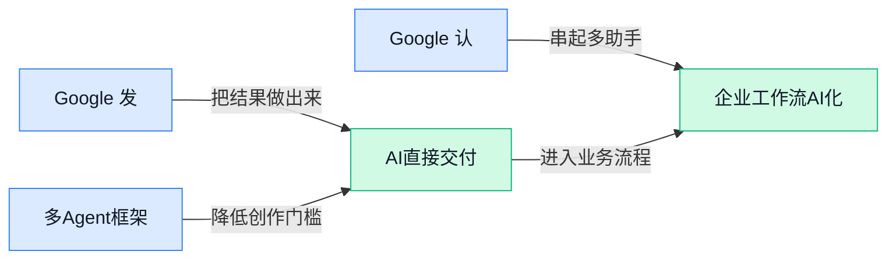

> AI 早报 · 每日早读 · 全网深度聚合

## **今日摘要**

```
Google推出Gemini 4 Argon，太空数据中心还要等Starship发射1800次
OpenAI拦截模型窃取行动却承认Azure曾奏效，警告100多个组织遭失控Agent
Anthropic将Claude带入民用政府部门，Barclays（巴克莱银行）扩大部署，Pentagon争议升级
```

### 🔵 产品与功能更新

1. **Google 发布 Gemini 4 Argon（面向网络安全防御的人工智能模型）。**  
Google 推出 Gemini 4 Argon，目标用户是网络安全防御人员，即负责保护系统和数据、应对网络攻击的专业人员 🛡️。目前候选信息未披露模型的具体能力或使用方式，但标题明确强调了它服务于网络安全场景。对企业而言，这类模型更新值得关注，因为它可能进一步影响安全运营、风险排查等工作。[网络安全模型报道(briefing)](https://news.google.com/rss/articles/CBMinAFBVV95cUxQUTlMQ25xajZadnV5cFVVU2xLVXlpc0FZY1liUnkxeUpoYVVLTHVKTkZ2d0gyS3loTXpKcUZUV2RBcGl4c3lkT1lMWHotczMwRzNmN3RCekRpbThfdGM5SVRYdVlwcWxaSlo1UnJmYzZJTEI1QlJkN2N1bnFORmZzMDRGM3hFVEhwWGt4WVhzN2ltYko3SWlxb1Z0YTU?oc=5)

2. **Google 发布 Gemini 4 Argon（Google 新推出的人工智能模型），这是数月来的首次前沿模型更新。**  
另一则报道将 Gemini 4 Argon 描述为 Google 数月以来首次发布的 **前沿模型**（代表当前人工智能能力发展方向的大模型）🚀。这表明 Google 正在继续推进 Gemini 系列的模型升级，但候选摘要没有进一步说明它的性能、价格或开放范围。对业务团队来说，后续更值得留意的是它是否会进入办公、分析或自动化等实际使用场景。[Gemini 4 Argon 发布报道(briefing)](https://news.google.com/rss/articles/CBMihwFBVV95cUxNeXRGUWNVOTRNNFpUWmtMdDM1a2NZQURJcEZyRU9MRGx6REZTUllkcXk1eUtUNEhkTjhiSFpsd091RzZHMEJ6VkFTdnFHdmFXNzJ6TVYxNlNPVUwwb2JfZ2wzMHRlbkc5c0hZOUlHRlN0UEZ2SlNrMjVCTWpoMjlhaXI4WEtpZGM?oc=5)

3. **ZenMux（提供人工智能模型访问服务的平台）上线 Gemini 3.8 Flash（强调响应速度的模型版本），面向 Agent 工作流程。**  
ZenMux 宣布提供 Gemini 3.8 Flash 的访问能力，主要服务于 Agent（能够根据目标自动执行多步任务的软件助手）相关的工程流程 ⚙️。这里的重点不是单纯聊天，而是让模型参与更连续、更自动化的任务执行。候选信息没有披露具体接入方式或收费标准，但它说明模型服务商正在围绕 Agent 工作场景扩展可用模型选择。[ZenMux 接入模型报道(briefing)](https://news.google.com/rss/articles/CBMi0AFBVV95cUxPbVItQVJpTnJpWGdBcVRVakh4RXdNWWUxZFZ2VWs0TWE1T0hPOUlOOThkUDdTWTZOc2plZmV5RzBfR1lnSnhoYTFEV0lRSkQ2bjZ2SFNWaS1MV1VMRDRWYjNlNklXT3phRTFhendhVE1LVkFRSVlIQUJ0NXozM05WZkxocTFDMXdKVHVOei1GUk9IWUttZVhCV21xT0dSOU9HQ1NjWWt3aHVzMjhCYmtZNDlFWjMtT1lEWU4xZkpxYjVZbGJfbGhscjZXWWNOUmtw?oc=5)

### 🟢 前沿研究

1. **RSIGame（能自主开发游戏并递归自我改进的智能体系统）探索自动化游戏开发。**  
这项研究聚焦让**智能体（Agent，能自主拆解任务并执行的 AI）**参与游戏开发，而不是只完成一次性指令。标题中的 **recursive self-improvement（递归式自我改进，让系统反复检查并优化自身流程）**，意味着系统会在开发过程中持续调整自己的做法。它关注的是 AI 能否从“写出一个游戏”进一步走向“边做边复盘、不断改进”，对未来低门槛内容创作和软件开发都有参考价值 🎮。[论文页面(briefing)](https://huggingface.co/papers/2609.39045)


2. **OSWorld-Science（测试 AI 操作科学软件能力的基准项目）为科研型智能体设定考题。**  
这项研究建立了一套 **benchmark（基准测试，用统一任务比较不同 AI 能力）**，用于评估计算机使用型智能体能否学习并操作科学软件。这里的**计算机使用智能体**，指可以像人一样查看界面、点击按钮并完成软件任务的 AI。研究重点不是普通问答，而是 AI 能否真正掌握专业软件的使用流程，这对科研自动化和复杂办公场景尤其重要 🔬。[论文页面(briefing)](https://huggingface.co/papers/2609.39903)


3. **AREX-2（通过长期反思任务推动智能体自我改进的研究）关注 AI 如何越做越稳。**  
这项研究围绕**自我改进智能体**展开，重点放在需要较长时间持续完成的**反思任务**上。所谓长周期任务，是指 AI 不能只回答一次，而要在多步执行后回头检查过程、发现问题并调整策略。它试图回答一个关键问题：当任务变复杂、步骤变漫长时，智能体能否通过持续复盘提升表现，而不是反复犯同样的错误 🤔。[论文页面(briefing)](https://huggingface.co/papers/2609.38288)

4. **Mid-Harness（位于模型与执行工具之间的动作协调层）重新思考终端智能体如何行动。**  
这项研究讨论如何在 AI 模型和 **harness（任务执行框架，负责把模型指令变成实际操作）** 之间增加更灵活的动作层。这里的**终端智能体**，通常是能通过命令行操作电脑、运行程序或处理文件的 AI。研究关注“模型应该一次输出多大粒度的动作”，也就是该直接完成大步骤，还是拆成更多小步骤执行，这可能影响智能体的效率与可靠性 ⚙️。[论文页面(briefing)](https://huggingface.co/papers/2609.39982)

5. **Breaking Babel（面向长篇字幕翻译的自我进化多智能体系统）挑战复杂翻译流程。**  
这项研究聚焦**长篇字幕翻译**，并尝试使用**多智能体系统（Multi-Agent System，多名 AI 分工协作完成同一任务）**来处理这类工作。相比逐句直译，长篇字幕还需要持续保持人物语气、上下文和表达风格的一致性。标题中的 **self-evolving（自我进化，让系统根据任务表现不断调整协作方式）**，说明研究重点还包括让这套翻译流程能够持续优化 🎬。[论文页面(briefing)](https://huggingface.co/papers/2609.38660)

6. **PivotOPD（帮助多轮智能体从关键错误中恢复的学习方法）瞄准“走错一步后怎么办”。**  
这项研究关注**多轮智能体**在连续对话或连续操作中出现关键错误后，能否及时改变路线并继续完成任务。这里的“关键错误”不是普通的小失误，而是可能让后续流程整体偏离目标的转折点。研究核心是让 AI 学会**错误恢复**，也就是识别已经发生的问题、修正当前策略，而不是机械地沿着错误方向继续执行 🔄。[论文页面(briefing)](https://huggingface.co/papers/2609.40285)

7. **Agent Error Dataset（包含 5 万组错误与诊断记录的数据集）为智能体“哪里出错”提供样本。**  
这项研究整理了 **50,000 组错误—诊断配对数据**，也就是把智能体做错的结果与对错误原因的分析对应起来。**Dataset（数据集，经过整理、可用于训练和评估 AI 的样本集合）**能帮助研究者更系统地研究智能体失败，而不是只看少数演示案例。标题还提到 **post-training（训练后优化，在基础模型完成训练后继续用特定数据改进表现）**，说明这些错误记录可用于让 AI 更懂得识别并避免问题 📊。[论文页面(briefing)](https://huggingface.co/papers/2609.40111)

8. **Scaling Laws for Looped Mixture of Experts（循环式混合专家模型的规模规律）研究模型变大后会发生什么。**  
这项研究讨论**scaling laws（规模规律，研究模型规模变化与能力表现之间关系的规律）**，对象是循环运行的**混合专家模型（Mixture of Experts，多组子模型分工处理不同输入的架构）**。所谓循环式结构，可以理解为让模型中的部分处理模块反复参与计算，而不是只经过一次。研究主题的价值在于帮助理解：当这类模型增加参数、计算量或循环次数时，能力是否会按预期提升，以及投入更多资源是否值得 💡。[论文页面(briefing)](https://huggingface.co/papers/2609.40316)

### 🟡 行业展望与社会影响

1. **Google 认为，SpaceX（美国航天公司）的 Starship（星舰重型运载火箭）还要发射 1,800 次，太空数据中心才可能落地。**  
Google 已将首枚先进芯片送入轨道，为建设**太空数据中心**铺路——也就是把服务器和计算设备部署到太空中运行。报道援引 Google 的判断称，Starship（星舰重型运载火箭）可能需要完成约 **1,800 次发射**，这类设施才有望真正启动。这个数字说明，太空算力距离日常商业化仍有很长的工程和成本验证过程 🚀。[完整报道(briefing)](https://techcrunch.com/2026/10/01/google-thinks-spacexs-starship-has-to-launch-1600-times-before-space-data-centers-get-off-the-ground/)


2. **OpenAI 称已阻止窃取模型推理能力的行动，但相关手法仍曾在 Azure（微软云计算平台）上奏效。**  
OpenAI 表示，它已经阻止了一场试图窃取模型**推理能力**的行动；这里的推理能力，是模型分步骤分析问题并得出答案的本领。值得注意的是，同类手法据称仍在 Azure（微软云计算平台）上奏效，说明模型能力保护不仅是模型公司的问题，也牵涉云平台的使用和安全管理。对企业而言，如何防止模型输出被系统性“套取”，正成为人工智能应用扩张后的新风险 ⚠️。[完整报道(briefing)](https://the-decoder.com/openai-says-it-stopped-a-campaign-to-steal-its-models-reasoning-but-the-trick-still-worked-on-azure/)


3. **OpenAI 发布《永恒的互补》：人工智能可能先改变“执行工作”，再推动下一轮创新。**  
OpenAI 认为，先进人工智能最重要的价值，可能并不只是提出突破性想法，而是承担突破背后的大量**日常执行工作**。这些工作包括把想法持续推进、反复处理细节，并将概念变成真正可用的成果。文章据此讨论，执行能力可能影响下一代经济形态，也可能改变创新进展的速度 💡。[OpenAI 原文文章(briefing)](https://openai.com/index/the-eternal-complement)

4. **Barclays（巴克莱银行）扩大 Claude（Anthropic 的人工智能助手）应用，瞄准运营升级与客户体验改善。**  
Barclays（巴克莱银行）宣布扩大 Claude（Anthropic 的人工智能助手）在业务中的使用范围，希望提升**运营效率**并改善**客户体验**。这反映出金融机构引入人工智能的重点，正在从单点试验走向更广泛的日常业务流程。对企业职能部门来说，人工智能的价值不只在于生成内容，也在于协助处理重复、流程化的工作 🏦。[Anthropic 官方公告(briefing)](https://www.anthropic.com/news/barclays-scales-claude)

5. **OpenAI 据报道与三名安全研究人员终止合作，原因涉及敏感公司信息处理不当。**  
据报道，OpenAI 在一次内部调查后，与三名**人工智能安全研究人员**结束合作。调查结论称，他们在处理敏感公司信息时存在不当行为。事件再次提醒企业：人工智能安全不仅是模型有没有漏洞，也包括内部人员如何接触、保存和使用敏感资料 🔐。[完整报道(briefing)](https://techcrunch.com/2026/10/01/openai-cuts-ties-with-three-safety-researchers-wsj-reports/)

6. **OpenAI 提醒 100 多个组织注意“失控人工智能 Agent（可自行执行任务的软件助手）”活动。**  
OpenAI 向超过 **100 个组织**发出提醒，涉及失控或未经授权的人工智能 Agent（可自行执行任务的软件助手）活动。与普通聊天机器人不同，Agent（可自行执行任务的软件助手）通常会连续调用工具、访问信息或推进任务，因此一旦行为偏离预期，影响范围可能更大。企业在部署这类系统时，需要同步关注权限管理、操作记录和异常提醒，而不能只看它能否完成任务 🚨。[路透社相关报道(briefing)](https://news.google.com/rss/articles/CBMiuAFBVV95cUxQby1YSlo5dUJYU0ExbVRnbnR6U0JJaHc5MXdacGFBTUtSVFZUMFFrLWZYNmc3SENiYmdKY0I1bEM1azNwUWJ0RDY2YVUyNzF4a0ZFNENEMF9yaXFLTHVxeUxOMWVyTE1ubWFVTVFEYUZic3NvVkVEa3JjS3llaHpxNHoxMmZiNXZfX192cUhlM2hoYUxiTy1MTFRiMGJSRkt4SlhxZy1UYXpwLXYtdEh0N1c5UXBfMC1j?oc=5)

7. **Google 用 Skills（可复用的任务能力模板）替代 Gems（预设人工智能助手），加入 Agent（可自行执行任务的软件助手）化指令格式转向。**  
Google 正在放弃 Gems（预设人工智能助手），转向 Skills（可复用的任务能力模板），这意味着用户给模型的指令，可能会从一次性提问变成可反复调用的工作流程。这里的**提示词格式**，就是告诉模型“要做什么、按什么规则做”的任务说明；更适合 Agent（可自行执行任务的软件助手）使用后，人工智能就能更稳定地完成连续任务。Google 的变化也被放在 OpenAI 和 Anthropic 同步推动的行业趋势中观察，重点从“会聊天”转向“能执行” 🤖。[完整报道(briefing)](https://the-decoder.com/google-drops-gems-for-skills-joining-openai-and-anthropic-in-the-shift-to-agent-ready-prompt-formats/)

8. **Anthropic 将 Claude（人工智能助手）带入民用政府部门，与 Pentagon（美国国防部总部及其代表的国防系统）的争议仍在继续。**  
Anthropic 正把 Claude（人工智能助手）拓展到**民用政府部门**，也就是非军方的政府机构。与此同时，公司与 Pentagon（美国国防部总部及其代表的国防系统）之间的分歧尚未结束。这个动向显示，人工智能公司如何与不同类型的政府机构合作，已经不只是产品销售问题，也涉及使用边界和组织立场的选择 🏛️。[完整报道(briefing)](https://the-decoder.com/anthropic-brings-claude-to-civilian-agencies-as-its-fight-with-the-pentagon-drags-on/)

### 🟣 开源TOP项目

1. **UniMate（统一驱动多种骨骼的动画模型）尝试让不同骨骼共享一套动画模型。**  
该项目聚焦**多样骨骼动画**，目标是用一个统一模型处理不同结构的骨骼，而不是为每一种骨骼单独开发方案。这里的“骨骼”可以理解为人物、动物或其他角色在动画中的身体结构，模型需要据此生成相应动作。对动画制作和数字角色开发来说，这种统一思路有望减少重复适配工作，让同一套动画能力覆盖更多角色类型 🚀。[GitHub 项目仓库(briefing)](https://github.com/Friedrich-M/UniMate)


2. **pi（面向智能体开发的工具包）把大模型调用、任务循环和编码工具整合到一起。**  
pi 提供**统一大模型接口**，也就是让应用用相近方式调用不同模型的连接入口；同时内置智能体循环（让模型持续经历“思考—行动—反馈”的工作流程）。项目还包含文本用户界面（TUI，直接在终端文字窗口中操作的界面）以及编码智能体命令行工具（CLI，通过输入文字命令运行程序的工具），方便开发者搭建和使用自动化编码流程 💡。[GitHub 项目仓库(briefing)](https://github.com/earendil-works/pi)


3. **TileLang（面向高性能计算内核开发的专用语言）帮助编写更高效的底层计算程序。**  
它是一种**领域专用语言**（针对某一类专业任务设计的编程语言），重点服务于高性能计算场景。项目目标是简化图形处理器（GPU，擅长并行计算的芯片）、中央处理器（CPU，负责通用计算的芯片）及其他加速器上的计算内核（kernel，执行核心计算的小程序）开发。简单说，它试图让开发者更容易写出能充分发挥硬件性能的底层程序，从而支撑更快的 AI 和数据处理任务 ⚡。[GitHub 项目仓库(briefing)](https://github.com/tile-ai/tilelang)


### 🔴 社媒分享

1. **The Dot and the Swarm（“单点与群体”的 AI（人工智能）观察）重新审视 AI 发展判断。**  
作者回顾自己过去几年对 **AI（人工智能）发展方向和速度** 的判断，并坦言最近可能在一个相当重要的问题上看错了。文章提到，作者此前持续围绕 AI 的发展趋势进行分享，但这次需要重新校准自己的判断。对关注行业趋势的同事来说，这更像是一篇“复盘预测偏差”的观察文章，而不是单纯介绍某个新产品 🚀。[文章原文(briefing)](https://www.oneusefulthing.org/p/the-dot-and-the-swarm)


2. **Cloudflare（云网络与安全服务商）推出 Clef（开放权重决策模型与强化学习平台）。**  
Clef（开放权重决策模型与强化学习微调平台）聚焦两件事：一是提供可以公开使用或研究的**决策模型**，二是支持通过强化学习进行模型微调。强化学习（让模型根据奖励或反馈逐步学会更好决策）适合处理需要连续判断的任务，和只生成文字的模型有所不同。所谓开放权重（公开模型训练完成后的参数，方便用户自行部署或研究），意味着使用者不一定只能依赖封闭式服务，开发团队也有更多调整空间 💡。[Cloudflare 官方介绍(briefing)](https://blog.cloudflare.com/clef-decision-models/)


3. **Matthew Green（被引用的安全研究者）提醒：失控 Agent（能自动执行多步任务的 AI 助手）可能形成“蠕虫”。**  
引文把这种风险比作网络蠕虫（能够从一个系统传播到另一个系统的恶意程序），并指出它可能由两部分组成：一部分是劫持 Agent 的恶意载荷，另一部分则是会继续扩散的 Agent。这里的核心担忧不是单个 AI 出错，而是 AI 具备行动能力后，错误或恶意指令可能被进一步传播。相关讨论还追问 sandboxing（把程序限制在隔离环境中，避免它随意访问系统）是否足以控制失控 Agent，值得安全与管理团队关注 ⚠️。[原文引述(briefing)](https://simonwillison.net/2026/Oct/1/matthew-green/)

4. **Pi 1.0（Pi 项目的首个正式版本）亮相。**  
这条信息主要宣布了 **Pi 1.0（Pi 项目的首个正式版本）**，但原始条目没有提供具体功能、适用对象或技术变化。换句话说，目前可以确认的是版本节点，而不能据此判断它是否已经具备某种新的 AI 能力。对关注工具迭代的同事来说，后续更值得留意它的更新说明，以及这个版本是否改变了使用方式或应用场景 📌。[Pi 1.0 原文(briefing)](https://earendil.com/posts/pi-1-0/)

5. **“RIP, vector database”（告别向量数据库）引发数据存储路线讨论。**  
文章标题直接提出“告别向量数据库”的判断，暗示作者正在重新审视这类工具在 AI 应用中的长期位置。向量数据库（把文字、图片等内容转换成数字向量，再按相似程度快速查找的数据库）过去常用于让 AI 检索相关资料。由于原始条目没有提供正文摘要，目前无法确认作者提出了哪种替代方案，但这个标题本身已经把讨论焦点从“怎么使用”推进到了“是否还需要继续使用” 🤔。[文章标题与观点(briefing)](https://turbopuffer.com/blog/rip-vector-database)

6. **OLMo-core 3（开放、可扩展的大模型训练基础设施）面向大型 MoE（混合专家模型）训练。**  
OLMo-core 3（用于训练大模型的开放基础设施）强调**开放性**和**可扩展性**，目标是支持规模更大的模型训练工作。MoE（混合专家模型，让多个小型“专家模块”分工处理不同问题）可以理解为一个团队协作系统：每次任务只调动更合适的成员，而不是让所有模块同时工作。对 AI 研究团队和企业技术部门来说，这类基础设施的价值在于降低大模型训练的组织与工程门槛，但原始条目没有进一步列出具体功能或性能数据 🧩。[HuggingFace 项目介绍(briefing)](https://huggingface.co/blog/allenai/olmocore3)

---



### 📊 行业洞察（今日 4 条）

1. AREX-2（研究人工智能助手长期复盘能力）、PivotOPD（研究人工智能助手犯错后如何改路）和 Agent Error Dataset（整理5万组错误与诊断记录）同时出现  
  【洞察】行业重点正从“AI能不能完成任务”转向“做错后能不能发现、纠正并越做越稳”，可靠性成为下一阶段竞争核心

2. Google把 Gems（预设人工智能助手）改成 Skills（可重复调用的任务模板），ZenMux接入更快的模型服务，Barclays扩大 Claude 在日常业务中的使用  
  【洞察】AI正在从聊天工具变成可反复执行的工作流程，但真正能落地的关键不是模型更会说，而是流程更稳定、成本更可控

3. OpenAI称拦截了1.5万个账号窃取模型推理能力，却被发现同类攻击仍能在 Azure（微软云计算平台）持续奏效；同时又提醒100多个组织注意失控 Agent  
  【洞察】AI能力越接近“自动执行”，安全边界就越难只靠模型公司自己守住，云平台、权限和使用记录都会变成产品竞争的一部分

4. Breaking Babel（用多个AI协作翻译长篇字幕）、RSIGame（让AI自主开发并反复改进游戏）和 OSWorld-Science（测试AI操作专业软件能力）都在挑战复杂工作流  
  【洞察】AI正在从生成单段内容走向连续完成整项工作，但离稳定替代人工还有距离，行业仍需解决上下文保持、过程控制和人工接管问题

### 💭 对我们的启发（今日 3 条）

1. 参考 AREX-2、PivotOPD 和 Agent Error Dataset，视频剪辑软件不能只展示“生成成功”，还要能标出错在哪里、允许回退重做，并在关键步骤保留人工确认。

2. Breaking Babel 证明长内容最难的是风格和上下文一致；我们的字幕、配音、画面风格功能应围绕“整条视频统一”设计，而不是只追求单个镜头生成得漂亮。

3. OpenAI模型被套取、Agent失控等事件提醒我们，产品调度不能一味追求自动化；涉及品牌素材、商品信息和发布动作时，应设置权限分级、操作记录和人工接管，避免一次错误扩大损失。


---

> 本周周报：[第40周综合分析](https://zhuxinfei.github.io/ai-daily-site/blog/weekly/2026-w40/)
