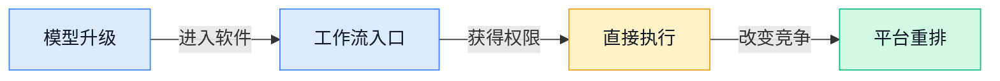
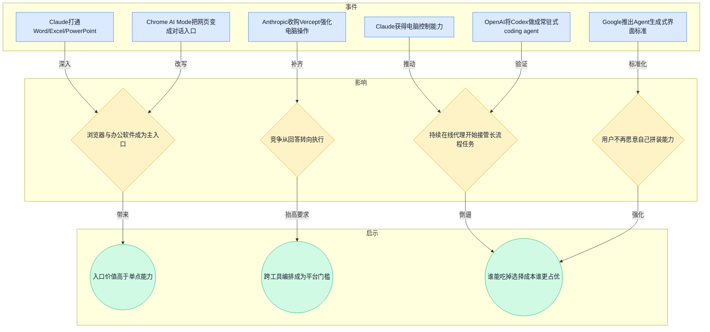
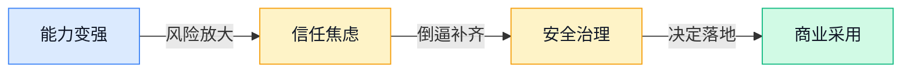
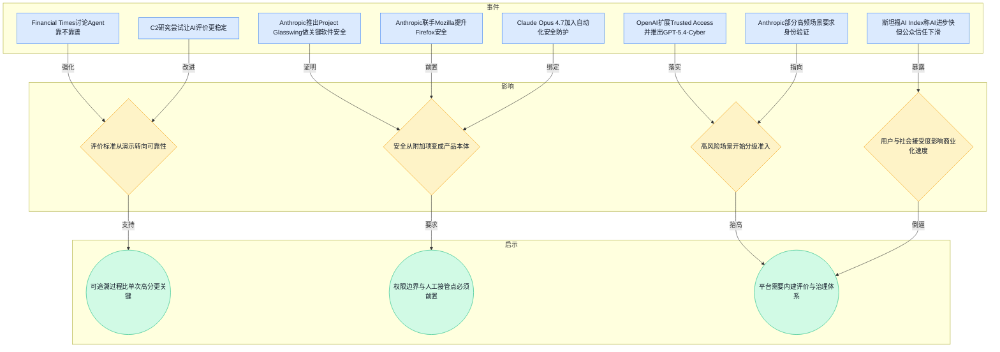
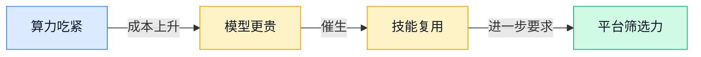
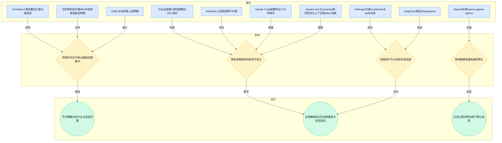
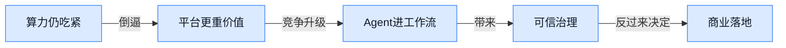
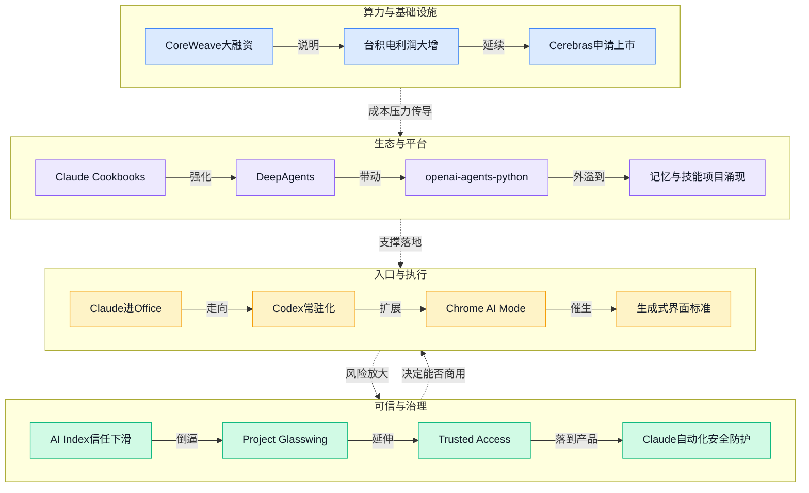

> 2026-04-13 ~ 2026-04-19 | 本周共 6 期日报

**本周日报**: [04-13](/ai-daily-site/2026/2026-04/2026-04-13/) | [04-14](/ai-daily-site/2026/2026-04/2026-04-14/) | [04-15](/ai-daily-site/2026/2026-04/2026-04-15/) | [04-16](/ai-daily-site/2026/2026-04/2026-04-16/) | [04-17](/ai-daily-site/2026/2026-04/2026-04-17/) | [04-19](/ai-daily-site/2026/2026-04/2026-04-19/)

---

## 本周聚焦

### Agent从“会回答”走向“直接做事”，入口与执行权正在重排

展开详细图谱

本周最清晰的一条线索，是大模型厂商不再满足于“回答得更像人”，而是在争夺“谁能直接进入用户工作流把事做完”。这条线索来自多天日报的连续事件：4月14日，Anthropic收购 Vercept，继续强化 Claude 的电脑操作能力；同日，Claude 打通 Word、Excel、PowerPoint。4月15日，Claude 又获得“电脑控制”能力，Claude Code routines 开始自动修 bug、做代码审查；Google 给 Chrome 加上 AI Skills（可保存复用的提示与流程）；Cloudflare Agent Cloud 接入 OpenAI，推动企业级工作流更快落地。4月17日，OpenAI 把 Codex 做成常驻式 coding agent（持续在线的编程代理），Google 推出 Chrome AI Mode，把“浏览网页”变成“和网页对话”。4月19日，Google 进一步推出面向 AI Agent 的“生成式界面”标准，说明厂商已开始试图定义下一代软件界面。

为什么这件事重要？因为一旦 AI 能进入办公软件、浏览器、电脑桌面，它的价值就不再是“提供建议”，而是“代替用户完成步骤”。这意味着竞争维度发生了根本变化：过去比的是模型能力，现在比的是入口位置、权限深度、软件集成能力和任务闭环能力。用户并不想在十个 Agent、五个模型、三种插件之间自己拼装方案，他们更倾向于选择一个已经嵌入日常工具、能少学一步、少配一层的产品。谁先占住浏览器、Office、代码环境等高频入口，谁就更有机会成为默认助手。

对行业意味着什么？第一，独立聊天框的重要性会继续下降，浏览器、办公套件、代码环境会成为主战场。第二，Agent 平台竞争正在从“搭得出来”变成“能不能跨软件稳定执行”。第三，软件界面的控制权正在变化：如果未来越来越多操作先由 AI 理解和拆解，再决定调用哪个工具，传统应用的品牌感可能被上层 AI 助手稀释。对创业公司来说，这不是一个抽象趋势，而是现实压力：如果平台只停留在模型路由（把请求分发给不同模型），价值会越来越薄；真正有价值的是把跨工具执行、流程复用、任务状态可见化做成基础能力。

### Agent热度越高，可信、治理与可追责越成为落地前提

展开详细图谱

如果说上一条主线是“Agent开始真正做事”，那本周另一条同样重要的线索就是：Agent 越接近真实执行，行业越不能再只讲能力，必须回答“出错怎么办、谁来负责、用户凭什么信它”。这不是单一事件，而是一组互相印证的信号。4月14日，斯坦福 AI Index 2026 指出 AI 飞速进步，但安全担忧上升、公众信任下滑；Google 还专门在华盛顿举办“AI for the Economy Forum”，把政商学界拉到一起讨论。同期 Anthropic 推出 Project Glasswing，瞄准 AI 时代的关键软件安全，并与 Mozilla 合作提升 Firefox 安全。4月15日，OpenAI 扩展 Trusted Access（审核后开放的分层访问计划）并推出 GPT-5.4-Cyber。4月16日，英国《金融时报》直接讨论 Agent 到底靠不靠谱，Anthropic 在部分高频 Claude 场景要求身份验证。4月17日，Claude Opus 4.7 在提升编程和多步任务能力的同时，加入自动化安全防护；研究侧还有 C2 这类尝试稳定 AI 评价标准的方法。

为什么重要？因为 Agent 和传统聊天机器人最大的不同，不是“更聪明”，而是“更有行动力”。一旦它能够操作电脑、浏览网页、调用企业系统、持续推进长流程任务，它犯错的成本就会迅速上升。用户今天愿意容忍一个聊天回答不够准，但很难容忍 AI 替自己误发文件、误改表格、误触发支付、误执行高权限动作。也就是说，行业的瓶颈正在从“模型够不够强”切换到“系统是否可控”。安全、身份验证、分级开放、可追溯记录、人工接管点，这些过去容易被当成企业采购清单里的“合规要求”，现在正在变成产品体验本身。

对行业意味着什么？第一，高风险场景会优先走分级准入，而不是全面开放。网络安全、金融、企业内控等领域会先形成“有资格的人才能调用更强能力”的结构。第二，可靠性评估会比排行榜更重要。只看任务是否完成已经不够，行业会越来越重视失败模式（系统在哪些情况下容易出错）、边界条件、回滚机制和人工介入设计。第三，治理能力将成为商业竞争的一部分。头部公司已经在把“能力”和“约束”捆绑出售，这意味着未来没有治理能力的平台，很难承接真正高价值的工作流。

### 算力与生态仍在上游集中，平台价值被迫从“接模型”转向“选模型、管模型、复用技能”

展开详细图谱

本周第三条需要深拆的线索，是上游资源和开发者生态同时强化，迫使平台公司重新定义自己的价值。4月13日，CoreWeave 几天内拿到数百亿美元级资金，台积电被预期连四季创新高；同日 HumanX 大会“人人都在聊 Claude”，Anthropic 还开源 Claude Cookbooks。4月14日，行业同时出现算力紧张、限额和 GPU 涨价。4月16日，ASML 和台积电上调预期，台积电利润大增 58%，Anthropic 还上调高频用户价格，显示“越火越贵”的现实；同天开源社区冒出 oh-my-claudecode、Ralph、open-agents 等一批编排工具。4月19日，Cerebras 申请上市，Cursor 传出超大融资，OpenAI 又开源 openai-agents-python；同时 claude-mem、caveman 这类项目开始直接优化上下文记忆和 token（模型处理文本的计量单位）成本。

为什么重要？因为这说明两个表面矛盾、实则并行的趋势正在同时发生：一方面，基础设施和算力资源更加集中，模型调用成本并没有像外界想象的那样快速“廉价化”；另一方面，Agent 框架、技能仓库、示例手册、上下文优化工具快速开源，导致“把一个 Agent 跑起来”这件事越来越不稀缺。换句话说，底层更贵了，上层更卷了。对于平台型创业公司，这意味着不能把未来寄托在“模型会越来越便宜，所以只要接更多模型就行”；也不能把护城河放在“我们也有一个 Agent 框架”。真正稀缺的，是在成本波动、能力差异和生态变化中，帮助用户做出可靠选择，并把一次性能力沉淀为可复用技能和可比较结果。

对行业意味着什么？第一，算力和模型价格波动会持续影响产品形态，配额、限额、分层订阅会变成常态，而不是临时现象。第二，开发者生态心智变得极其重要。Claude 相关技能仓库、Cookbooks、会场讨论热度说明，一个模型是否“好用”，不仅取决于性能，也取决于能否形成一套大家会用、敢用、愿意复用的生态。第三，平台价值会越来越体现在“选择与治理”而不是“连接与展示”。谁能把模型、技能、记忆、成本、风险和用户目标放在一个统一框架里，谁才更像下一阶段的基础平台。

---

## 信号与噪音

1. OpenAI 称 ChatGPT 女性用户已超过男性，和早期“技术圈男性主导”的印象相反。点评：这说明 AI 已经从极客工具走向更大众的日常产品，to C 市场的竞争重点会更偏向场景理解、语气风格与易用性，而不只是技术参数。

2. OpenAI 想在 ChatGPT 里卖更多广告，但广告主连基础投放工具都还嫌不够用。点评：这提醒我们，AI 产品即便拥有流量，也不代表商业模式立刻成立；如果缺少清晰的归因、控制和投放体系，广告未必比订阅更容易做。

3. Cursor 传出新一轮超大融资，企业市场增长把 AI 编程工具推上高估值。点评：资本依然愿意为“高频、强付费、能替代部分人力”的 AI 应用买单，但高估值也意味着市场会更快进入份额争夺和功能同质化阶段。

4. Claude Opus 4.7 上线 Amazon Bedrock（亚马逊企业模型云平台）。点评：企业采购越来越偏向在已有云体系里买 AI，而不是额外引入独立供应商；这对创业公司是双刃剑，接入大平台更容易成交，但也更容易被平台层吞掉议价权。

5. Anthropic CEO 继续押注规模化，认为 AI 扩展还远没到尽头；与此同时 OpenAI 高层与研究骨干离开，战略继续收缩副线任务。点评：这两条放在一起看，说明头部公司仍在相信更大模型和更强执行力，但组织形态开始分化：有人继续扩张，有人开始集中资源、缩短战线。

6. Google 用 AI 重做暑期出行攻略，旅行规划正变成日常级 AI 场景；Gemini 还新增“个性化图片生成”。点评：AI 正在从生产力工具进一步渗透到消费决策与个性化内容，这类场景未必最深，但用户触达频次高，容易培养“先问 AI 再行动”的习惯。

7. 多个开源项目围绕记忆、状态可视化和技能复用展开，比如 claude-mem 自动记住开发上下文、claude-hud 展示 AI 在忙什么、andrej-karpathy-skills 把个人能力做成技能集。点评：这说明行业正在补 Agent 最容易被忽视的中间层——记忆、过程可见、经验复用；未来用户比较的将不只是结果，还包括系统是否会成长、是否能解释自己在做什么。

---

## 宏观趋势

展开详细图谱

1. 趋势名称：AI 从聊天框走向真实工作流。验证事件包括 Claude 打通 Office、获得电脑控制能力，Codex 常驻化，Chrome AI Mode 让网页可对话，Google 推出 Agent 生成式界面标准。未来走向是：浏览器、办公软件、代码环境将继续成为主入口，能跨工具闭环执行的 Agent 会比单轮问答产品更有竞争力。

2. 趋势名称：可信与治理成为 Agent 商业化前提。验证事件包括斯坦福 AI Index 提到公众信任下滑，Project Glasswing、Mozilla 安全合作、Trusted Access、Claude 4.7 自动化安全防护，以及身份验证要求提升。未来走向是：高风险场景会先走分级开放，平台需要把权限、日志、接管点和失败处理做成默认配置。

3. 趋势名称：上游算力继续强势，应用层被迫寻找高附加值。验证事件包括 CoreWeave 融资、台积电和 ASML 上调预期、Cerebras 申请上市、算力紧张和 GPU 涨价、Anthropic 上调高频用户价格。未来走向是：模型不会快速无差别降价，应用公司需要更重视任务价值、成本控制和复用效率，而不是只拼调用规模。

4. 趋势名称：Agent 框架开源化，竞争转向生态与评价体系。验证事件包括 Claude Cookbooks、skills 仓库、DeepAgents、openai-agents-python、open-agents，以及大量围绕记忆和技能复用的开源项目。未来走向是：基础搭建门槛会继续下降，真正稀缺的是生态心智、效果评估、任务对比和用户信任机制。

---

## 对我们的启发

产品方向上，优先级应继续放在“跨工具任务编排 + 过程可见 + 人工接管”三件事上，而不是把平台做成单纯模型超市。本周大量事件都在说明，用户真正需要的是“帮我把事做完，但我能看懂、能接管、能追责”。

竞争策略上，不要和大厂直接比底模能力，也不要把护城河押在“接入更多模型”。更值得做的是建立一套面向任务的评价体系：同一任务下，不同 Agent 的成功率、失败类型、成本、耗时、所需权限是否清晰可比。谁能把“怎么选、为什么信、出了错怎么办”讲清楚，谁就更有平台价值。

时机判断上，现在仍是适合切入的窗口期。原因不是市场已经稳定，而是恰恰因为它还不稳定：上游算力贵、下游框架卷、用户认知混乱，这反而给“帮助普通人做选择并建立信任”的产品留下空间。但也要接受一个现实：如果没有治理层和评价层，只做调用壳子，窗口会很快关闭。

---

## 本周思考

当 AI 越来越像一个会持续做事的“数字员工”时，用户真正购买的到底是能力，还是一种“出了问题也知道怎么收回来”的安全感？如果后者更重要，我们的产品核心是否应该从“调度最强 Agent”转向“管理可被信任的执行过程”？
