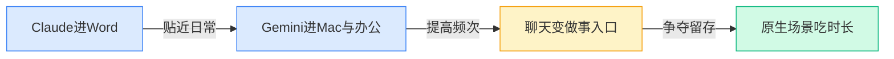
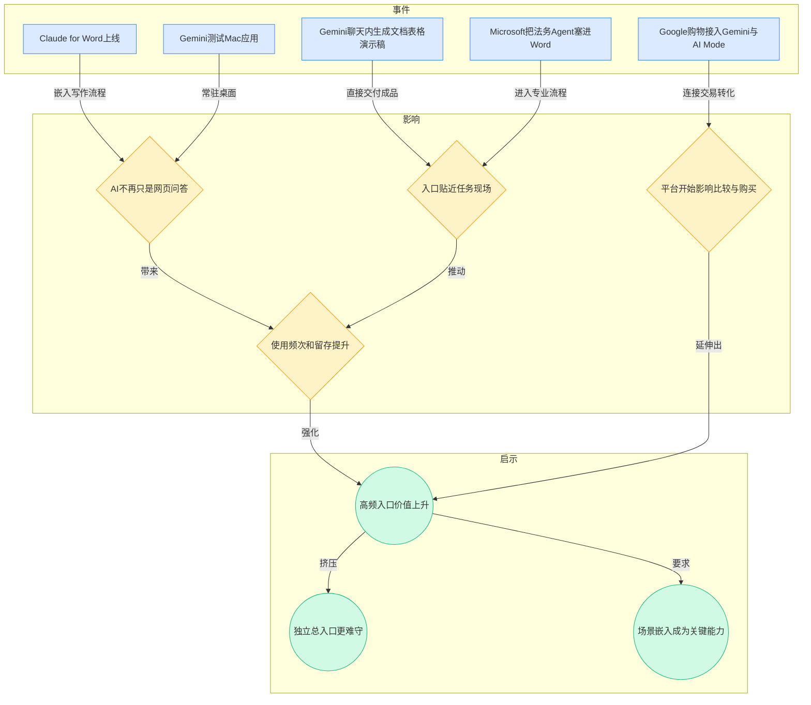
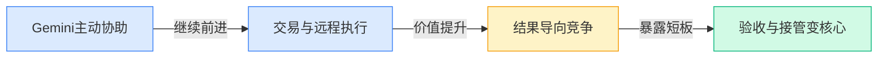
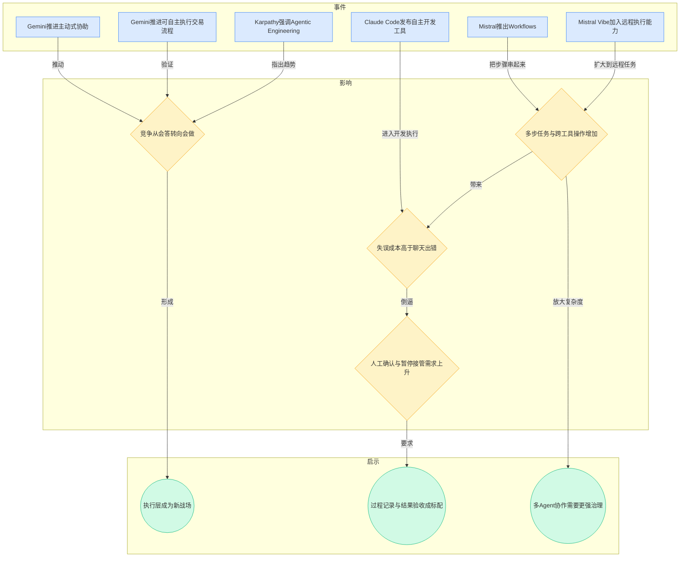
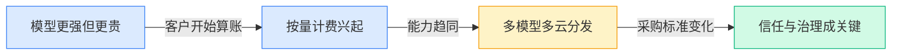
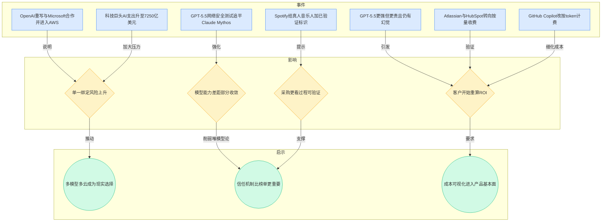
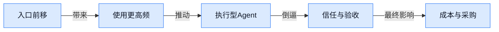
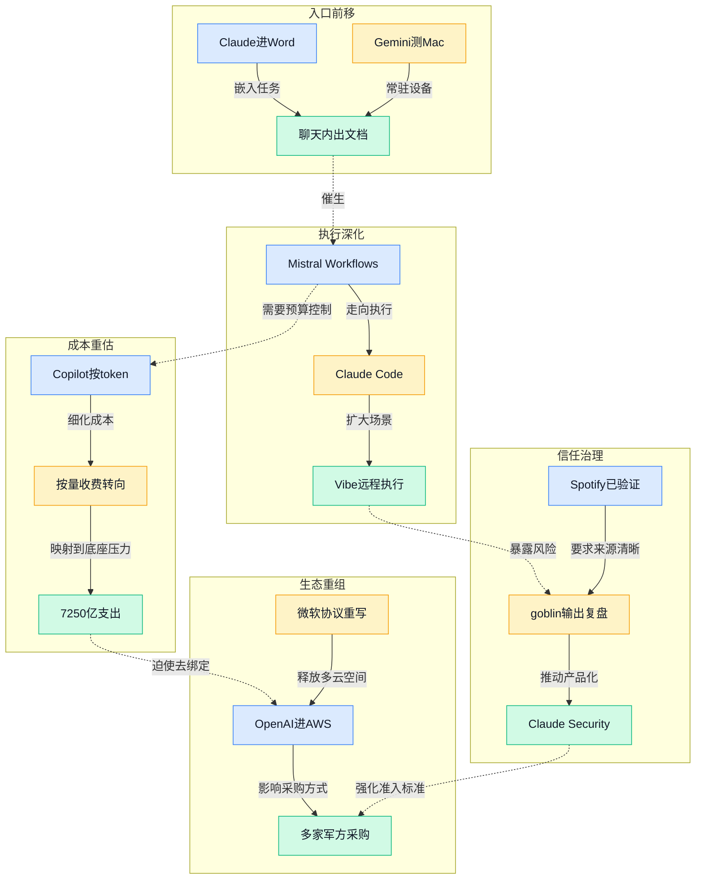

> 2026-04-27 ~ 2026-05-03 | 本周共 7 期日报

**本周日报**: [04-27](/ai-daily-site/2026/2026-04/2026-04-27/) | [04-28](/ai-daily-site/2026/2026-04/2026-04-28/) | [04-29](/ai-daily-site/2026/2026-04/2026-04-29/) | [04-30](/ai-daily-site/2026/2026-04/2026-04-30/) | [05-01](/ai-daily-site/2026/2026-05/2026-05-01/) | [05-02](/ai-daily-site/2026/2026-05/2026-05-02/) | [05-03](/ai-daily-site/2026/2026-05/2026-05-03/)

---

## 本周聚焦

### 入口正在前移：AI 从聊天页走进真实工作流

展开详细图谱

本周最连续的一条线索，是 AI 正快速离开“打开网页问一下”的形态，进入用户原本就在完成任务的软件和设备里。4 月 27 日，Anthropic 推出 Claude for Word；同日 Google 被曝测试 Gemini 的 Mac（苹果电脑操作系统）应用。4 月 30 日，Gemini 又能在聊天里直接生成文档、表格和演示稿。5 月 2 日，Microsoft 把法务 Agent（能自动审阅合同的智能助手）直接放进 Word。5 月 3 日，Google 进一步把购物能力接入 Gemini、AI Mode（AI 搜索模式）和 Circle to Search（圈选即搜）。这些不是孤立更新，而是在说明一件事：入口竞争已经从“谁的模型更会回答”，转向“谁离用户的真实动作更近”。

为什么这件事重要？因为多数用户并不会主动维护一个“总控台”。他们会在写文档时想起写作助手，在看网页时想起搜索助手，在比较商品时想起推荐助手。入口越贴近日常动作，越容易抢到高频使用时长，也越容易积累上下文（前后文信息）、记忆与历史数据。Google 在 4 月 30 日还上线 Gemini 记忆功能，并试图迁入 ChatGPT 历史，本质上就是在争夺“你以后的默认助手是谁”。这意味着，未来用户未必会刻意寻找最强模型，而更可能停留在“最顺手、最少切换、最能直接出结果”的那个入口里。

对行业意味着什么？第一，独立 AI 应用如果只提供一个聊天框，会越来越难守住用户时长。第二，产品价值会从“回答质量”部分迁移到“任务衔接能力”，也就是能不能接上文档、表格、浏览器、支付、搜索、设备端权限。第三，入口前移也会把信任问题一起带进来：当 AI 不只提供建议，而是直接生成文件、修改合同、影响购买决策时，用户对依据、可撤回、可替换选项的要求会明显提高。换句话说，入口优势会先带来增长，随后立刻带来责任。

### Agent 从会回答走向会执行，但验收成为真正瓶颈

展开详细图谱

本周第二条主线，是 Agent 正从“会聊天”升级为“会干活”。4 月 28 日，Gemini 一边做 proactive assistance（主动式协助），一边推进 agentic trading（可自主执行的交易流程）。4 月 29 日，Mistral AI 推出 Workflows，把多个 AI 步骤串成自动流程；Amazon Quick 则主打跨应用协作。4 月 30 日，Karpathy 明确提醒，Vibe Coding（凭感觉让 AI 帮你写代码）只是前菜，真正重要的是 Agentic Engineering（以 AI 代理协作方式做软件工程）。5 月 1 日，Anthropic 发布 Claude Code Agentic Developer Tool（面向程序员的自主式编码工具）。5 月 3 日，Mistral Vibe 增加远程执行能力。行业显然不再满足于“回答不错”，而是开始把价值定义为“最后有没有把事做完”。

为什么这很重要？因为一旦 AI 能跨步骤、跨工具、跨界面执行任务，价值密度会显著提高。过去一个聊天机器人只能给建议，现在它可能直接去查资料、整理文档、执行交易、改代码、调用外部服务。对于用户而言，这比更聪明的回答更接近真实回报。但问题也同步升级：聊天出错，通常只是答案不好；执行出错，可能直接造成错误下单、错误改写、错误提交，返工和损失都更真实。

因此，本周的关键信号不只是“Agent 更强了”，而是“验收成为瓶颈”。4 月 27 日 OpenAI 提醒旧 prompt（给 AI 的指令写法）会拖累 GPT-5.5 表现，并把 Codex 并入 GPT-5.5，说明固定用法、固定模型、固定基准测试都在失效。4 月 30 日日报同时提到 Karpathy、OpenAI 开源 Symphony，以及 Zig 严防 AI 贡献，三者放在一起，恰好揭示行业分歧：大家并不怀疑 AI 能做更多事，真正争议在于这些结果能否低成本验收。5 月 2 日多项研究与观察也都转向真实流程中的每一步表现，而不是最终展示效果。

这对行业意味着，下一阶段比拼的不只是自动化深度，而是“可控执行”。谁能把人工确认、暂停、回滚（撤回到前一步）、证据展示、步骤评分做得更自然，谁才更可能在高价值场景中被采用。执行能力会让 Agent 更像产品，验收能力则决定它能否变成业务。

### 模型差距在缩小，竞争转向信任、成本与多方绑定

展开详细图谱

第三条线索，是行业正在从“追最强模型”转向“算账、避险、建信任”。4 月 27 日日报指出 GPT-5.5 基准测试领先，但更贵、幻觉（模型自信地输出错误内容）仍多，同时“AI 比人还贵”开始出现；Atlassian 和 HubSpot 转向按量收费。4 月 29 日 GitHub Copilot 改按 token（模型处理文字的计量单位）计费。4 月 28 日和 4 月 30 日，OpenAI 重写与 Microsoft 合作协议，拿掉排他性条款，并把 AWS 纳入销售与部署空间；同一周 OpenAI 既扩建 Stargate（超大规模 AI 数据中心计划），又落地 AWS，说明即便头部公司也不敢押单一底座。5 月 2 日，科技巨头全年 AI 支出被推高到 7250 亿美元。另一边，GPT-5.5 在网络安全测试中追平 Claude Mythos，说明部分高价值能力上的模型差距正在收敛。

为什么重要？因为这意味着客户的采购逻辑正在变化。过去企业和用户愿意为“最先进”买单，现在开始追问三个更现实的问题：第一，值不值；第二，稳不稳；第三，能不能换。按量计费、细化 token 成本、云平台去绑定，都是这个阶段的典型症状。模型仍重要，但它不再足以单独构成护城河。尤其在若干垂直任务里，当多个供应商的能力逐步接近后，用户会更关注结果透明度、失败兜底、供应商锁定风险和总拥有成本（长期使用的综合成本）。

对行业意味着什么？一是商业化进入更硬的一轮，免费送 AI 拉新的阶段正在结束。二是多模型、多云、多供应商策略会从“技术预案”变成“商务要求”。三是信任机制会从加分项变成准入项。5 月 2 日 Spotify 给真人音乐人加“已验证”标识，就是很好的类比：当 AI 内容、AI 决策、AI 执行越来越多，市场会要求知道“是谁做的、依据是什么、能否核验”。未来赢家未必是单点能力最强者，而可能是最会把能力、成本与责任一起讲清楚的人。

---

## 信号与噪音

1. OpenAI 与 Microsoft 重写合作协议、取消排他性条款，同时把 AWS（亚马逊云服务平台）纳入销售与部署空间。点评：头部模型公司开始主动降低单一伙伴依赖，说明渠道、算力、企业采购都在进入多平台分发时代。

2. Meta 对 Manus（主打 AI Agent 的创业公司）的 20 亿美元收购被中国叫停，Google 又收到欧盟要求帮助 AI 对手更易接入自家服务。点评：监管已不再只是事后审查，而是在直接改写并购、分发和生态接入规则，创业公司不能只看产品竞争。

3. Google 与五角大楼合作扩大，五角大楼又与 Nvidia、Microsoft、AWS 及多家科技巨头签约，把 AI 部署到机密网络。点评：国防体系正在成为高价值订单来源，但伦理争议、品牌风险和合规门槛会让这类收入并不“轻松”。

4. Microsoft 财报称 AI 业务同比增长 123%，Meta 称其商业 AI 每周已促成 1000 万次对话。点评：AI 已经不是单纯资本故事，收入和使用量正在验证需求存在，但也意味着市场对 ROI（投资回报）的要求会迅速提高。

5. Google 释放 Gemini 可能加入广告的信号，Stripe 又把 AI 购物能力带进 Gemini 和 AI Mode。点评：聊天式 AI 正从信息入口走向交易入口，但一旦商业利益介入推荐链路，用户会更强烈追问“这到底是在帮我，还是在卖我”。

6. Spotify 给真人音乐人加上“已验证”标识，奥斯卡则明确排除纯 AI 生成演员与剧本参评资格。点评：内容行业开始建立“人类创作”与“AI 生成”的制度边界，这说明身份认证和来源标注会成为更广泛的平台基础设施。

7. Anthropic 推出 Claude Security，OpenAI 限制 GPT-5.5 Cyber（网络安全测试工具）访问，英国安全研究机构又观察到 GPT-5.5 在网络攻击测试中追平 Claude Mythos。点评：安全领域一边在加速产品化，一边在加强访问控制，能力越接近危险边界，信任与开放节奏就越不可能完全市场化。

---

## 宏观趋势

展开详细图谱

1. 趋势名称：AI 正在吞掉原生工作入口。验证事件包括 Claude for Word、Gemini 测试 Mac 应用、Gemini 直接生成文档表格演示稿、Microsoft 把法务 Agent 放进 Word。未来走向是，独立聊天框会继续存在，但更高频的使用将被嵌入式入口吃掉，谁能贴住真实动作，谁就更容易形成默认习惯。

2. 趋势名称：竞争焦点从回答质量转向执行闭环。验证事件包括 Gemini 主动式协助与交易流程、Mistral Workflows、Claude Code、自主远程执行的 Mistral Vibe。未来走向是，Agent 会越来越像“做事软件”，但行业分水岭不在炫技演示，而在人工确认、异常处理、结果验收这些不性感但决定落地的能力。

3. 趋势名称：模型优势正在被成本与治理稀释。验证事件包括 GPT-5.5 更强但更贵、Atlassian/HubSpot/Copilot 转向更细计费、OpenAI 去绑定 Microsoft 并进入 AWS、科技巨头支出升至 7250 亿美元。未来走向是，客户会更少为“最强”单独买单，更多为“可控成本、可替换供应、可解释结果”付费。

4. 趋势名称：信任基础设施开始浮出水面。验证事件包括 Spotify 的“已验证”标识、OpenAI 对 goblin outputs（怪异人格化输出）的复盘、真实流程评测研究升温、网络安全产品进入“先严控后开放”阶段。未来走向是，身份标识、证据展示、过程回放、操作者认证会逐步从高级功能变成平台标配。

---

## 对我们的启发

产品方向：第一，不要把平台理解成单一总入口，应优先布局可嵌入任务流的形态，比如文档、网页、表单、购物决策等轻量场景入口。第二，要把“过程可见、证据可查、人工可接管”当成核心能力，而不是上线后的补丁，因为执行型 Agent 一旦失误，用户质疑的是整个平台。

竞争策略：第一，坚持多模型、多供应商设计，避免平台价值被“谁家模型更强”吞没；本周多起去绑定和能力收敛事件都说明，调度层的独立性会越来越值钱。第二，尽早建设任务级成本看板与效果对比，让用户知道一次任务为什么选这个 Agent、花了多少钱、是否值得。

时机判断：市场不是太早，而是叙事方式要变。单讲“最强 AI”会越来越弱，讲“帮你挑、帮你控、帮你验收”的平台价值，反而更贴近本周行业真实需求。

---

## 本周思考

当 AI 逐步接管“选择、执行、推荐、购买”这些原本由人亲自完成的动作时，用户真正愿意交出的到底是任务，还是判断权？如果判断权不愿交出，我们的平台该怎样定义“帮忙”与“代替”的边界？
