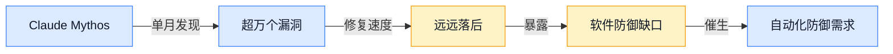
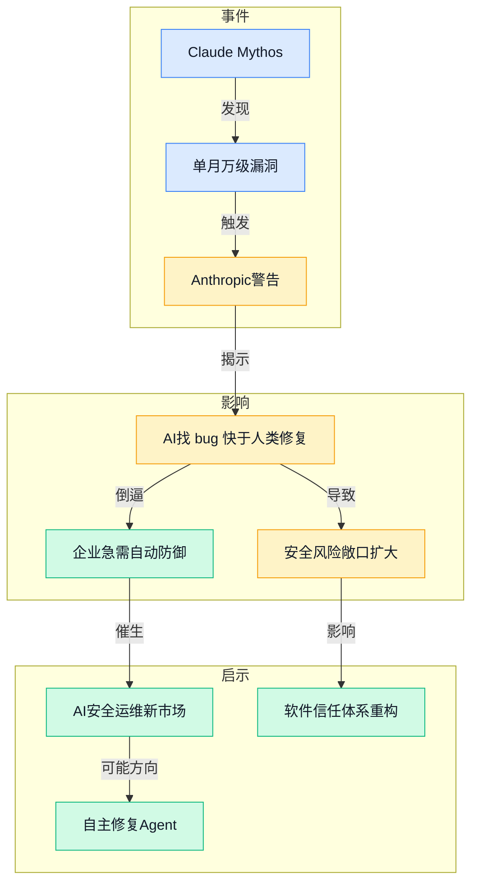
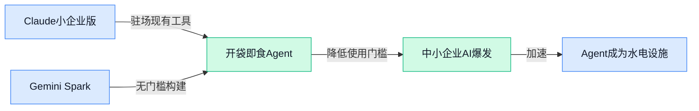
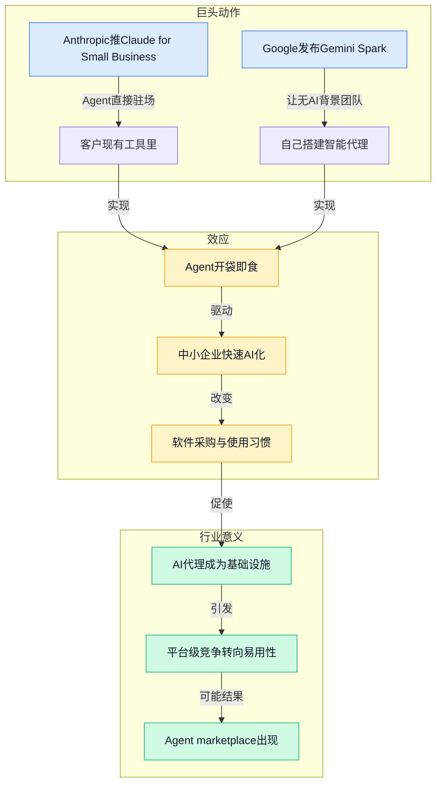
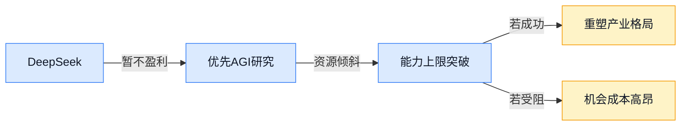
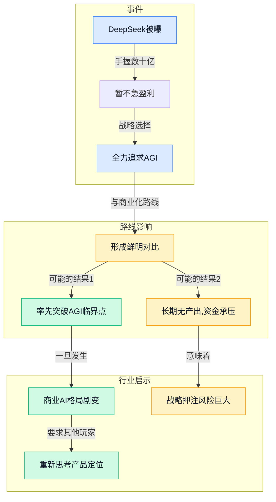
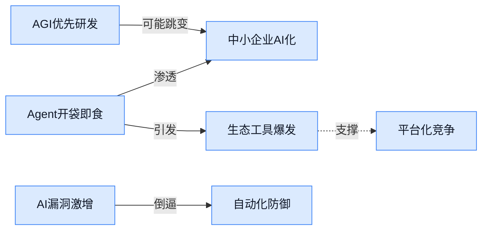
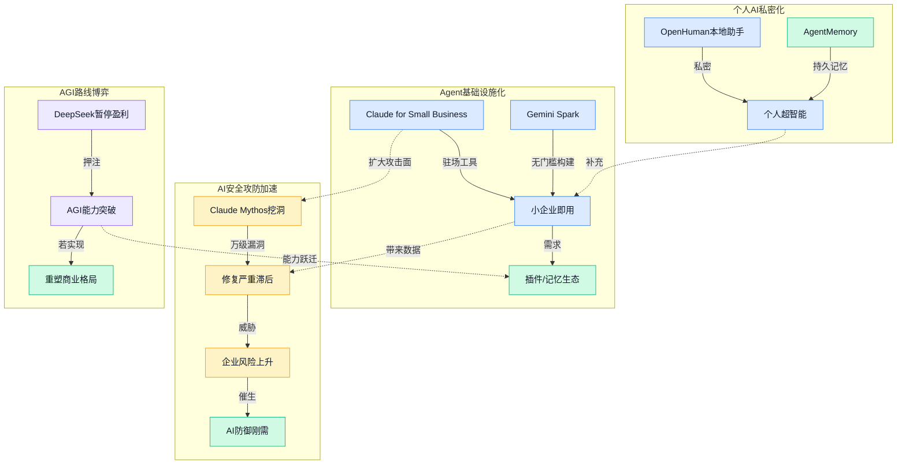

> 2026-05-18 ~ 2026-05-24 | 本周共 1 期日报

**本周日报**: [05-24](/ai-daily-site/2026/2026-05/2026-05-24/)

---

## 本周聚焦

### 漏洞发现自动化远超人工修复，AI攻防角色倒置

展开详细图谱

本周，Anthropic 的漏洞挖掘系统 Claude Mythos 单月发现超过一万个软件漏洞；同时，该公司又警告其预览版工具 Claude Mythos Preview“找 bug 比开发者修得还快”。这两件事放在一起，生动地揭示了当下 AI 在安全领域角色的结构性倒置：以前是人写工具去挖漏洞，现在变成 AI 自主大规模发现漏洞，而人类的修复能力完全跟不上。这不是量的差距，而是攻防双方时间尺度的错位——AI 能在分钟内扫描出海量脆弱点，而企业可能需要数周才能完成修复和测试。对于行业来说，这意味着传统的“补丁周期”模式正在失效，安全防御体系必须内嵌同样由 AI 驱动的自动化响应、隔离甚至自主修复能力。谁能先把“AI 防守”做成标准化服务，谁就可能在这个新缺口里建立起信任壁垒。

### Agent“开袋即食”，AI 代理以基础设施姿态渗入中小企业

展开详细图谱

同一天，Anthropic 推出 Claude for Small Business，让 AI 助手直接“驻场”在企业的现有工具里；Google 则发布 Gemini Spark，宣称没有 AI 技术背景的团队也能自己构建智能代理。这不是偶然的巧合，而是 AI 巨头集体将 Agent 从“需要专家调校的精密仪器”降维成“开袋即食”的标准化服务。对中小企业来说，过去要使用 AI 代理，要么雇佣昂贵的人才，要么支付高额定制费用。现在，他们可以直接在已有的 SaaS 工具里唤醒一个能理解上下文、执行任务的 Agent。这标志着 AI 代理正式脱离精英试验场，开始像当年的云计算一样向最广泛的商业土壤渗透。未来，Agent 的差异点可能不再只是模型的能力，而是谁能更好地融入日常工作流，谁能提供更可靠的“即插即用”体验。

### DeepSeek 放弃短期盈利，全力押注 AGI 能力上限

展开详细图谱

本周传出消息，DeepSeek 手握数十亿资金却明确不急于盈利，优先追求通用人工智能（AGI）研究。这条消息之所以值得深度解读，是因为它代表了 AI 竞赛中的一条“异类”路线：当大部分公司在大模型商业化上激烈拼抢时，DeepSeek 选择继续往能力上限深钻。这种选择背后的逻辑是，如果 AGI 真的在可预见的未来显现，整个产业的游戏规则将被彻底改写，早期商业化的许多护城河可能瞬间消失。当然，这也意味着巨大的风险——如果 AGI 迟迟不实现，他们将消耗大量资源却无法交出可商业化的产品。对行业而言，这一动向提醒所有从业者：你基于当前模型能力构建的产品，是否预留了面对能力跃迁时的灵活接口？是选择在现有平台上精耕细作，还是在架构上为“天降猛男”留出位置，将成为每个产品团队需要回答的问题。

---

## 信号与噪音

1. CodeGraph 预索引代码知识图谱助 Claude Code 省 token 提效率，全本地运行。点评：开发者工具从“用更聪明的模型”转向“用更聪明的上下文管理”，token 经济成为新的优化战场。
2. Academic Research Skills 工具包让 Claude Code 按学术规范走完研究到定稿全流程。点评：AI 不仅执行单点任务，开始接管需要逻辑连贯和领域规范的完整工作流，知识工作的链条式自动化正在成形。
3. Anthropic 为 Claude Code 推出官方插件目录，高质量扩展一站精选。点评：插件生态的官方化意味着平台正从工具本身延伸到周边服务网络，生态健康度成为竞争胜负手。
4. AgentMemory 在基于真实基准的测试中夺冠，为 AI 编程助手提供持久记忆库。点评：记忆能力是 Agent 从“一次性工具”升级为“长期搭档”的关键瓶颈，这项进展将直接拉高用户对 Agent 持续服务能力的期待。
5. OpenHuman 开源个人 AI 助手，主打私密、简单与强大，可本地自建超智能。点评：本地化、私密化的个人 AI 需求正在崛起，反映出用户对数据掌控权的焦虑，也可能倒逼中心化服务提供更透明的隐私方案。
6. CloakBrowser 隐身浏览器替代 Playwright，30 项反爬检测全通过。点评：数据采集与反采集的技术对抗螺旋上升，这类工具的进化将会影响公开数据获取的难易度，进而波及依赖公开数据训练的模型生态。
7. AI 预测科学进展的研究出现，用量化手段预判科研突破。点评：AI 开始介入科研决策的前端——预测哪里可能出现突破，这或许比直接加速实验更具杠杆效应，也引发关于科研方向控制权的讨论。

---

## 宏观趋势

展开详细图谱

趋势一：AI 代理服务加速下沉为中小企业的基础设施。本周 Claude for Small Business 和 Google Gemini Spark 同时指向同一个方向——让没有 AI 专家的团队也能像使用水电一样调用 Agent。这表明巨头的竞争焦点已从“谁模型更强”转移到“谁能让客户更快上手”，未来几个月可能出现大量面向垂直行业的即用型 Agent 模板。

趋势二：软件安全进入“非对称加速”时代。Claude Mythos 单月挖掘超万个漏洞，而人类修复速度远跟不上，这一矛盾将推动安全行业从“人工响应”转向“AI 自主防御”。未来安全产品的价值可能不再仅体现在检测率上，而在于能否以 AI 速度自动隔离、补丁甚至反制。

趋势三：AGI 路线分化加剧，部分顶尖实验室暂搁商业化。DeepSeek 的例子说明，即使在市场狂热期，仍有团队把长期能力上限置于短期盈利之上。这种分化会让产业链上的应用层公司陷入抉择：是紧跟当前最强模型做深度优化，还是预留架构弹性等待能力突变。两种选择的时间窗口可能并不重叠。

趋势四：个人 AI 助手向本地化、私有化演进。OpenHuman 以及相关记忆、隐私工具的出现，显示一部分用户不再满足于纯云端的智能助理，开始追求完全本地运行、数据不外泄的超个性助手。这会催生“个人 AI 服务器”或类似家用设备的新品类。

---

## 对我们的启发

在产品方向上，Agent 大规模渗入中小企业的趋势提醒我们，调度平台不能只面向技术型用户。必须提供足够简单的封装，让一个开小店的老板也能用自然语言把自己的一套业务流程“教”给我们的平台，然后由平台自动编排多 Agent 执行。这要求我们在交互设计上做更多减法。

在竞争策略上，安全攻防失衡的信号极其宝贵。我们的 Agent 调度与进化平台天然涉及多个智能体之间的信息交换和任务执行，信任将是核心资产。可以考虑将“Agent 行为安全审计”和“可信执行环境评估”作为差异化功能，让用户在选择和信任 Agent 方案时有据可依，这在对手普遍只强调能力时可能构成降维打击。

在时机判断上，DeepSeek 等团队死磕 AGI 意味着未来 12-24 个月可能出现基础能力的剧烈跃迁。我们现在构建的调度逻辑、评价体系和接口设计，需要保持与底层模型的松耦合，不能把自己锁死在某一代模型的行为模式上。保持“模型无关”架构，反而能在能力突变时最快吸收红利。

---

## 本周思考

当 Agent 真的像今天的短信和电子邮件一样无处不在，我们平台的核心价值是来自“帮用户挑出最合适的那个”，还是来自“让合适的 Agent 们自己组成一支团队”？这个选择将决定我们最终是一家评测机构，还是一家协作网络。
