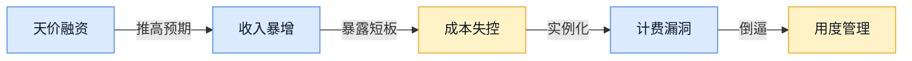
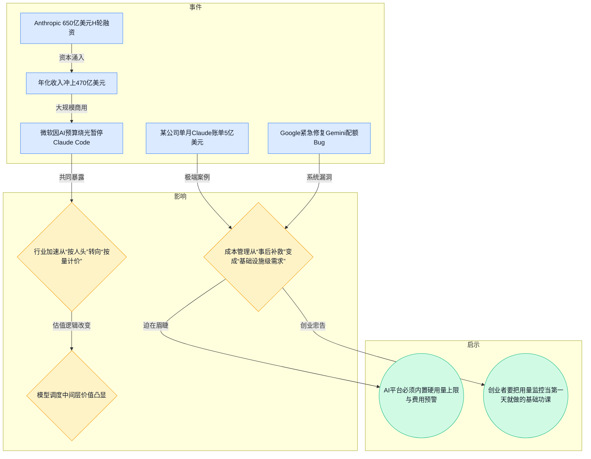
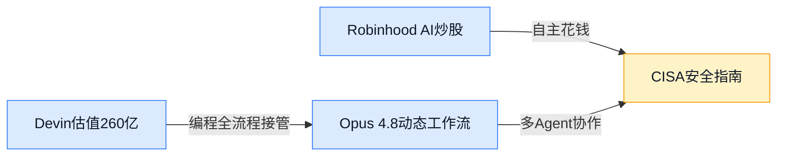
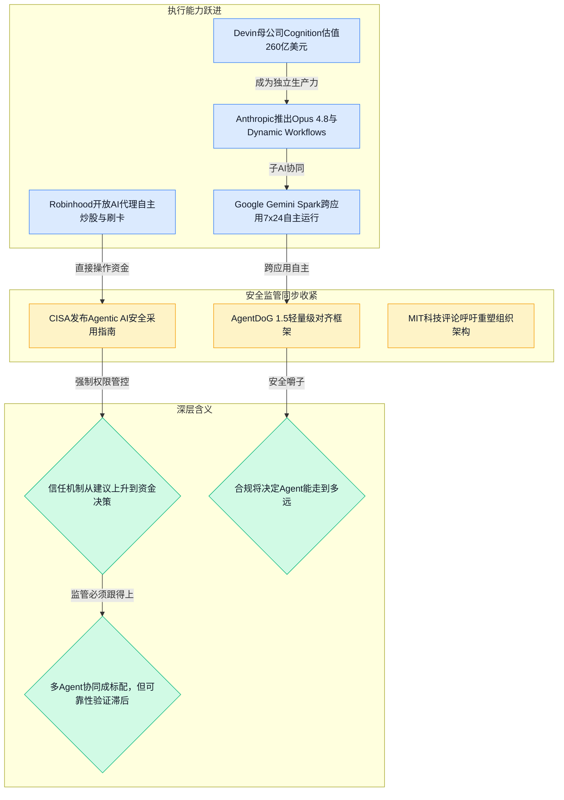
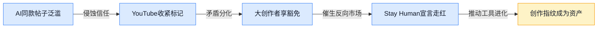
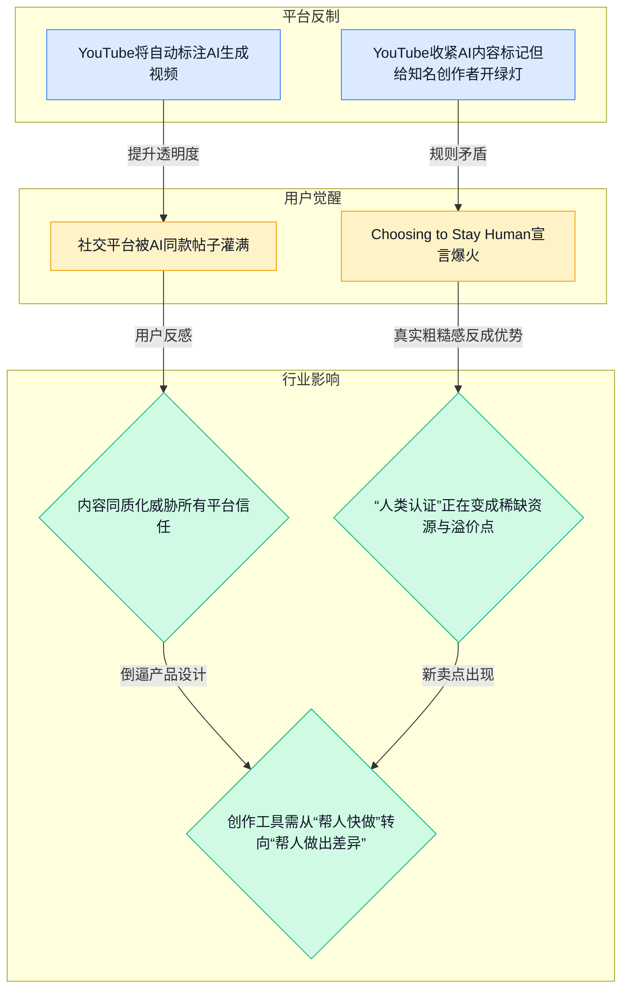
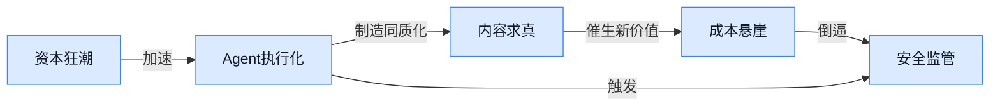
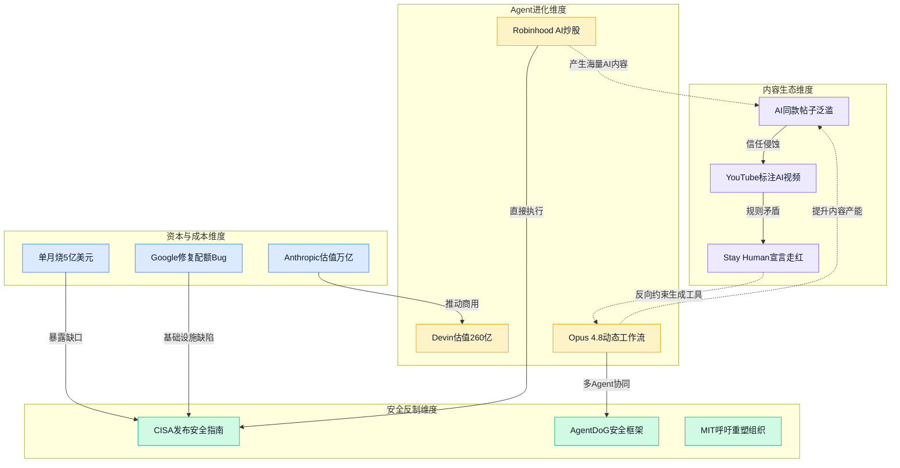

> 2026-05-25 ~ 2026-05-31 | 本周共 7 期日报

**本周日报**: [05-25](/ai-daily-site/2026/2026-05/2026-05-25/) | [05-26](/ai-daily-site/2026/2026-05/2026-05-26/) | [05-27](/ai-daily-site/2026/2026-05/2026-05-27/) | [05-28](/ai-daily-site/2026/2026-05/2026-05-28/) | [05-29](/ai-daily-site/2026/2026-05/2026-05-29/) | [05-30](/ai-daily-site/2026/2026-05/2026-05-30/) | [05-31](/ai-daily-site/2026/2026-05/2026-05-31/)

---

## 本周聚焦

### 一、Anthropic估值狂飙揭开AI成本黑洞

简版图谱

展开详细图谱

本周 An thropic 完成 650 亿美元 Series H 融资，估值逼近万亿美元，年化收入冲上 470 亿美元，俨然成为 AI 商业化的绝对顶流。然而几乎在同一时间，一连串成本失控的新闻撕开了光鲜外衣：微软因 AI 预算几个月就烧光全年经费，不得不在 6 月底暂停 Claude Code；有一家公司单月调用 Claude 花费 5 亿美元，原因仅仅是“没设置用量上限”；Google 甚至紧急修复了 Gemini 配额异常消耗的 Bug。

这些事件串联起来，揭示了 AI 行业正在经历“高速增长—成本失控—计费粗糙”的三位一体撕裂。资本仍在疯狂押注，但企业的实际使用成本已变成悬崖边缘的盲开快车。Snowflake CEO 本周直言传统订阅制已死，AI 时代需要按实际消耗计费，这说明定价模式也在被迫转型。

对行业而言，这波信号明确指向一个结论：AI 平台若不能帮用户管好“钱袋子”，再强的能力也会被账单劝退。从基础设施漏洞到大企业翻车，整个产业链都在呼唤更专业的成本控制中间层——而这正是 Agent 调度平台可以切入的天然位置。如果能把用量监控、智能路由到更便宜的模型、异常熔断等功能做成“隐形的保险丝”，远比单纯卖更强的 AI 响应更有黏性。

### 二、AI Agent跨越信任红线：从建议者变身执行者

简版图谱

展开详细图谱

本周有多件事标志着 AI Agent 正撕掉“聊天玩具”标签，成为能直接花钱、写代码、调度一支部下 AI 团队的数字员工。Robinhood 允许 AI 代理自主炒股、刷卡消费；Devin 母公司 Cognition 估值冲到 260 亿美元，说明资本认定“全流程编程代理”是价值真实存在；Anthropic 紧接着发布 Opus 4.8 和 Dynamic Workflows，让一个模型能指挥一群子 AI 协同干活；Google 的 Gemini Spark 则实现跨应用 7×24 小时自主执行任务。

但兴奋的另一面，安全监管的脚步声同样急促。美国 CISA 当天就发布了 Agentic AI 安全采用指南，要求权限管控和人工复核；开源界冒出轻量级对齐框架 AgentDoG 1.5，专给自主 Agent 戴“安全嚼子”；MIT 科技评论甚至呼吁企业为 Agent 时代重新设计组织架构。

这件事对行业的冲击在于：Agent 的信任机制正在经历一次结构性的跳跃。过去我们问 AI“你觉得该买什么”，现在直接让它“帮我去买”，这意味着安全不再是技术团队内部的小事，而是涉及资金、隐私、业务连续性的董事会级别议题。对做 Agent 调度平台的公司来说，如何让“一群 AI 协同干活”在合规边界内完成，将是比“跑得更快”更值钱的能力。若能在调度层内置安全审计、角色权限切分、人工关键节点确认，就能成为企业敢于大规模部署 Agent 的基础设施，而不是又一个出事就下线的半成品。

### 三、AI内容泛滥催生“人味”溢价，平台紧急筑墙

简版图谱

展开详细图谱

本周内容平台的动向异常整齐：YouTube 宣布将自动标注 AI 生成视频，但又特意给有影响力的创作者留出豁免空间；社交平台被 AI 批量产出的“同款帖子”灌满，用户开始主动用“Choosing to Stay Human”这样的宣言表态，对未经 AI 修饰的粗糙真实感付费意愿上升。

这件事之所以重要，是因为它勾勒出一个清晰的转折点——AI 内容不再只是效率工具，它已经开始侵蚀内容生态的信任账本，而平台和用户都在用自己的方式筑墙。YouTube 的两难尤为典型：既想通过标记规则建立公信力，又怕得罪能带来流量的头部创作者；观众则干脆用脚投票，“人做的”正在变成一种新的内容消费偏好。

对视频创作工具行业来说，这释放了一个明确信号：未来品牌商在投放时，最怕的未必是 AI 不够聪明，而是自己的广告视频和竞争对手的“撞脸”。如果剪辑软件只能比拼生成速度，最终只会把客户卷入同质化泥潭。反过来，谁能帮客户证明“这条视频有人的痕迹”——比如内置创作指纹、记录编辑操作节点、保留口播瑕疵或手动修改的历史——谁就能把合规成本转化为信任资产。这不是反 AI，而是用透明的方式，让 AI 辅助人更好地表达，而不是替代人。

---

## 信号与噪音

1. **教皇发布首份AI通谕，Anthropic联合创始人公开站台**：梵蒂冈将AI伦理上升为普世议题，Anthropic迅速回应，这是在为AI企业获得全球社会许可铺路。点评：伦理叙事不再是锦上添花，而是头部AI公司争夺定义权的战略动作。

2. **美国国防部欲砸近300亿美元打造AI武库，中国据悉限制AI顶尖人才出境**：军事AI投入与人才管控同步升级，标志着AI的国家队竞赛进入新维度。点评：大国博弈让AI供应链和人才流动带上地缘政治色彩，创业公司需关注政策风险，但也可能迎来国防订单外溢的to B机会。

3. **Google推出微型开发板，本地离能跑Gemma 3，小模型“从弱点学习”研究冒头**：巴掌大的硬件就能运行轻量模型，袖珍AI还能通过专精训练变成专家。点评：边缘智能正从概念走进硬件，对需要数据不出本地、离线也能干的剪辑终端来说，技术基础已成熟。

4. **OpenRouter估值翻倍至13亿美元，Vercel推出Agent专属编程语言Zero**：多模型路由平台受资本热捧，Agent开发工具链开始向下沉到语言层。点评：市场用钱投票证明“单一模型不够用”，而开发门槛的降低意味着未来会有更多非技术人员拼装Agent，调度平台的差异化会越来越难做，必须在“更懂工作流”上找生路。

5. **YoCausal测评显示视频生成模型不懂物理因果，EarlyTom让视频分析快几倍**：视频AI呈现两极分化——生成侧仍在补逻辑课，理解侧却在大幅提效。点评：做视频工具的公司要分清自己是扎根于生成端还是理解端，两条路的产品逻辑和价值主张完全不同。

6. **波士顿儿童医院借AI诊断40余种罕见病，CollectionLoRA用一个模型收纳50种视觉风格**：AI在垂直领域的专业突破和多风格灵活生成能力同时出现。点评：这验证了AI工具若能从海量素材中挖掘出“爆款规律”，远比单纯提供剪辑功能更带黏性；同时多风格能力也提示我们应该让客户一键生成多种创意版本，快速试错。

7. **“LLM Smells”文章盘点大模型常见坏毛病，LiveBrowseComp抽检发现搜索AI经常靠猜而非真搜**：业界开始系统记录大模型的“异味”，而实时信息获取的可靠性远未达标。点评：对依靠AI做实时运营、风控决策的公司，这类研究等于提前标出了雷区——必须为AI输出搭配交叉验证，不能把决策权轻易交出。

---

## 宏观趋势

展开详细图谱

**趋势一：AI资本狂潮与成本悬崖并存**。本周Anthropic的万亿美元估值梦、年收入冲470亿，与微软因预算枯竭暂停Claude Code、某公司月烧5亿美元形成尖锐对照。这验证了一个趋势：行业总成本并未随单价下降而减少，只是从计算向内存、从显性调用费向隐性管理成本转移。未来数月，能提供智能成本控制和用量优化能力的中间层产品会迎来需求爆发。

**趋势二：Agent从辅助走向执行，安全框架同步加速构建**。从Robinhood的AI炒股、Devin全流程编程，到CISA发布安全指南和AgentDoG轻量对齐框架，本周密集事件表明Agent正在跨越“建议-执行”的信任红线，监管不再是未来的事，而是此刻就要装上的刹车。未来，安全合规能力将从加分项变成Agent产品上架的硬门槛。

**趋势三：AI内容泛滥催生“真实性”反向红利**。You Tube自动标记AI视频、大创作者获豁免、用户追捧“Stay Human”宣言，一系列事件印证了同质化AI内容正让“人味”成为稀缺品。这提示内容创作工具需要从效率竞争转向“帮人印记”竞争，未来可能诞生“内容溯源即服务”的新品类。

**趋势四：小模型与离线化推动边缘智能落地**。谷歌微型开发板、专精小模型研究、“袖珍AI熟练工”思路的涌现，说明AI正从云端下沉到设备端。对于视频剪辑这类需要低延迟、保护隐私的场景，离线版剪辑终端具备了技术和成本可行性。

---

## 对我们的启发

**产品方向**：本周事件反复敲击一个关键词——**信任**。成本失控让我们看到用量管控的刚需，内容同质化揭示了创作指纹的价值，Agent自主化则凸显安全审核的紧迫。我们的调度平台不能只做“帮用户选模型”的轻量路由，应该把**用量监控+费用熔断+内容溯源+行为审计**融为一体，成为企业敢大规模用Agent的基础设施。同时，抓住多Agent协同的趋势，把复杂视频任务拆解为脚本、分镜、配音等子Agent流水线，让品牌商说出需求就能出片，不是功能堆砌而是工作流重塑。

**竞争策略**：Snowflake CEO宣布传统订阅制已死、OpenRouter靠多模型调度跻身独角兽，都说明市场正在奖励“按消耗介人”的中间层。我们的切入点不应该是又一个模型路由，而是 **“懂视频行业工作流的Agent调度”** 。差异化不在谁接的模型多，而在于谁能记住每个品牌商的风格惯性，让AI越用越懂客户。这是OpenRouter等通用平台做不到的垂直深水区。

**时机判断**：CISA安全指南、YouTube标注规则、AgentDoG框架几乎同步涌现，说明安全合规的窗口正在快速收紧。现在是设计阶段就把这些内建进去的最佳时机，等监管硬性要求出台再补救，成本将成倍放大。另外，谷歌微型开发板和小模型研究证实离线化技术已经ready，我们应该立刻着手离线版剪辑终端的原型，在数据隐私上打穿金融、医疗等保密需求强的垂直客户。

---

## 本周思考

当CISA要求Agent每一步都留脚印、YouTube要给AI内容打上烙印，我们作为调度平台，是在帮用户更自由地驾驭AI，还是在帮系统更严密地监控用户？两者的边界，可能就是我们未来十年需要回答的定位问题。
