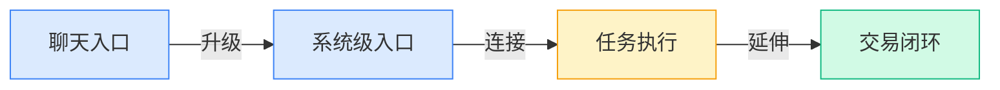
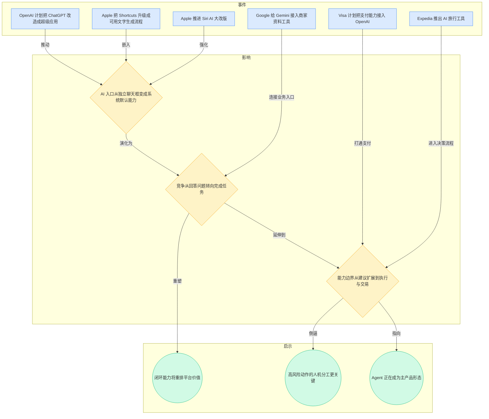
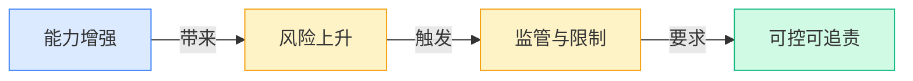
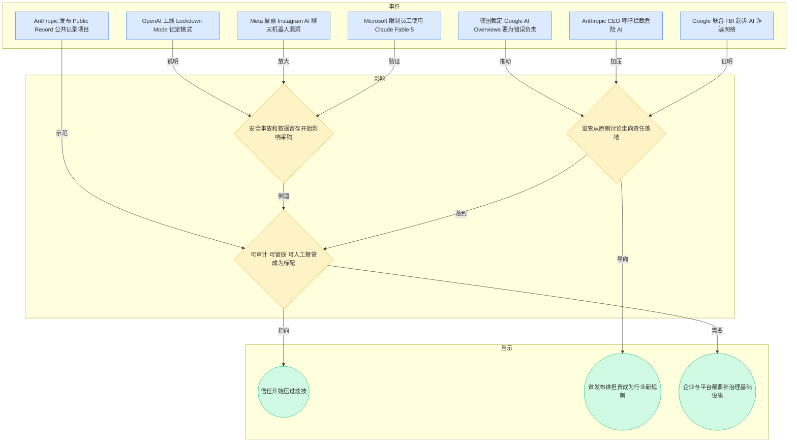
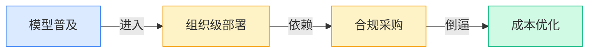
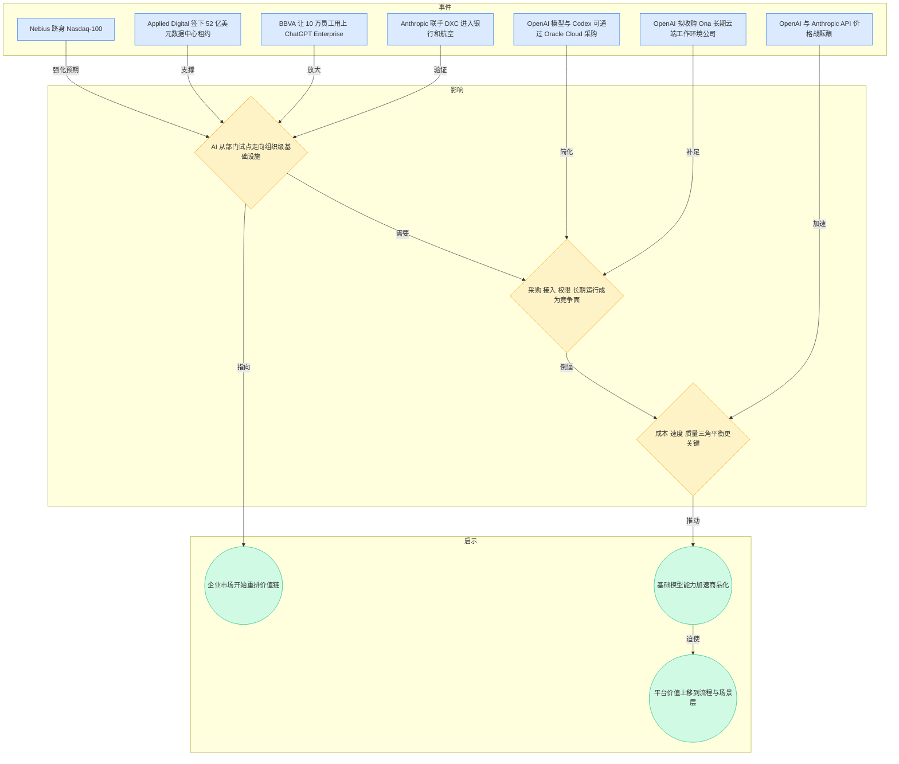
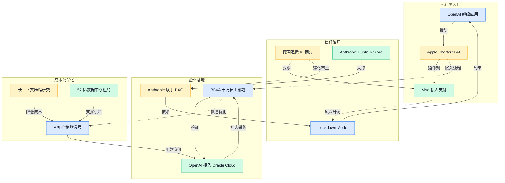

> 2026-06-08 ~ 2026-06-14 | 本周共 7 期日报

**本周日报**: [06-08](/ai-daily-site/2026/2026-06/2026-06-08/) | [06-09](/ai-daily-site/2026/2026-06/2026-06-09/) | [06-10](/ai-daily-site/2026/2026-06/2026-06-10/) | [06-11](/ai-daily-site/2026/2026-06/2026-06-11/) | [06-12](/ai-daily-site/2026/2026-06/2026-06-12/) | [06-13](/ai-daily-site/2026/2026-06/2026-06-13/) | [06-14](/ai-daily-site/2026/2026-06/2026-06-14/)

---

## 本周聚焦

### Agent 从聊天框走向执行入口

展开详细图谱

本周最清晰的一条主线，是 AI 入口正在从“你来问，我来答”的聊天框，升级成“你一句话，我替你做”的执行入口。6 月 8 日，OpenAI 计划把 ChatGPT 改造成“超级应用”，并把重心明确转向 Agent（能自己拆解任务并连续执行的 AI 助手）；6 月 9 日，Apple 在 WWDC（苹果全球开发者大会）上把 Shortcuts（苹果自动化快捷指令工具）升级成可用 prompt（文字指令）搭工作流的 AI 入口，同时推进 Siri 的 AI 大改版；6 月 11 日，Google 给 Gemini 接入商家资料工具；6 月 14 日，Visa 计划把支付能力接入 OpenAI，Expedia 也把 AI 塞进订票决策流程。

这些事放在一起看，重点不是又多了几个新功能，而是 AI 正在跨过一个产品边界：从信息层走向操作层，从建议层走向成交层，从“辅助你”走向“代表你”。Apple 把 AI 塞进系统动作里，意味着入口不一定再是单独 App；OpenAI 想把 ChatGPT 做成超级应用，意味着它想掌握更长的任务链；Visa 接入支付，则说明行业已开始试图把最后一步——付款——也纳入 Agent 闭环。

为什么这很重要？因为一旦 AI 能真正完成任务，竞争逻辑就会变。过去大家比的是模型回答质量、生成效果和演示惊艳度；接下来比的是谁能更稳定地接入真实业务入口、串起更多步骤、把结果安全地交付。Google 给 Gemini 接入商家资料，不是为了聊天更自然，而是为了让 AI 更像能上手干活的数字员工。Expedia 的意义也类似：AI 不只是推荐旅行方案，而是开始进入“预订决策”这种高价值环节。

对行业意味着什么？第一，Agent 主战场已经从概念验证转向入口争夺。系统入口、支付入口、商家后台入口，都会成为下一阶段的卡位点。第二，真正的壁垒不只是模型能力，而是“能否串起流程”和“能否承担后果”。第三，AI 产品的价值单位会从“回答一次问题”变成“完成一次任务”。这对创业公司是机会也是压力：机会在于很多细分任务链仍未被大平台吃透，压力在于没有闭环能力的产品会越来越像可替换插件。

### 信任、安全与可追责成为硬门槛

展开详细图谱

如果说 Agent 化回答的是“AI 能不能做更多事”，那本周另一条同样强的主线回答的是“谁敢让它做”。6 月 8 日，OpenAI 一边筹划 ChatGPT 最大改版，一边上线 Lockdown Mode（锁定模式，关闭联网和自动执行来防数据泄露）；6 月 9 日，Meta 披露 Instagram AI 聊天机器人漏洞，影响超 2 万账号；6 月 11 日，Microsoft 因数据留存顾虑限制员工使用 Claude Fable 5；6 月 12 日，德国裁定 Google 的 AI Overviews（搜索顶部 AI 摘要）要为错误答案负责；6 月 13 日，Google 联合 FBI 起诉 AI 诈骗网络；Anthropic 还推出 Public Record（定期公开安全与滥用情况的机制）。

这些事件共同说明，行业对 AI 的评估标准正在明显变化。过去“安全”常常是发布会上的免责声明，现在它已开始进入真实约束：能不能采购、能不能接企业数据、出错谁负责、滥用怎么披露、自动化能开到哪一步。尤其是德国裁决意义很重——它把“AI 说错了怎么办”从舆论问题推进成责任问题。对平台来说，这比模型跑分更具现实约束力。

为什么这很重要？因为越靠近真实执行，风险就越具体。聊天出错，用户可能一笑而过；摘要出错，平台可能承担责任；AI 接入企业系统，数据留存规则就会影响采购；AI 能写能发能付款，滥用与误操作的代价会急剧放大。Microsoft 限制员工使用 Claude Fable 5，本质上就不是“模型不够强”，而是“数据怎么留、风险怎么兜”还不够让企业放心。

对行业意味着什么？第一，信任机制正在从品牌加分项变成准入条件。第二，产品设计必须默认存在人工接管，而不是把人工当异常流程。第三，可追责能力会变成新的基础设施，包括来源标记、操作留痕、权限分层、发布确认、错误回溯。Anthropic 的 Public Record 说明，一部分头部公司已经意识到，治理透明本身会成为竞争要素。未来真正能吃下企业与高风险场景市场的，不一定是最激进自动化的产品，而是最会管理自动化边界的产品。

### 企业级落地加速，但比拼点转向合规、采购与成本

展开详细图谱

本周第三条值得深拆的线索，是企业级 AI 正在明显加速，但竞争重点已经从“谁模型更强”转向“谁更容易被大组织采买和长期运行”。6 月 12 日，OpenAI 拟收购 Ona（为 AI 代理提供长期云端工作环境的公司），并让企业可通过 Oracle Cloud（甲骨文云服务平台）现有采购额度接入 OpenAI 模型与 Codex；Anthropic 则联手 DXC（全球企业技术服务公司）把 Claude 接入银行和航空等强监管行业；BBVA 把 ChatGPT Enterprise（面向企业的 ChatGPT 版本）铺到 10 万员工。与此同时，OpenAI 与 Anthropic 的 API（应用编程接口，让企业把大模型接入自家系统）价格战信号出现，Applied Digital 签下 52 亿美元数据中心租约，Nebius 跻身 Nasdaq-100（纳斯达克 100 指数）。

这说明两件事在同时发生。第一，企业不再只是小范围试点，正在把 AI 当作组织级能力铺开。BBVA 的案例最典型：不是某个团队偷跑，而是大规模纳入员工体系。第二，头部厂商已经知道，企业真正难搞的并不是“让模型能回答”，而是采购流程、权限体系、长期运行环境、老系统接入、合规证明和预算归口。OpenAI 想买 Ona、接 Oracle Cloud，本质上是在补这些“脏活累活”。

为什么这很重要？因为这会直接改变价值分配。底层模型能力在继续进步，但 API 价格战和大量降成本研究已经暗示，基础能力会更快商品化（指能力越来越像标准化供给，差异和溢价下降）。当调用模型越来越便宜、越来越容易替换时，真正值钱的层会往上移：谁更懂具体业务流程，谁更能把 AI 嵌进组织动作里，谁更能处理例外情况，谁就更有议价权。

对行业意味着什么？第一，企业级市场会持续放量，但进入门槛不是炫技，而是合规、集成与服务能力。第二，算力与资本开支仍然高压存在，成本控制不会因为模型更强而消失，反而更重要。第三，创业公司的机会不一定在自建最强模型，而可能在“帮用户把多模型、多步骤、多角色编排成可用结果”的中间层和场景层。特别是在基础模型价格趋向竞争的情况下，场景化工作流、可信执行机制和跨模型编排能力，会比单次生成效果更能沉淀长期价值。

---

## 信号与噪音

1. OpenAI 把 ChatGPT 改造成“超级应用”的计划，与 Apple 在 WWDC 把 AI 做进 Siri、Shortcuts、Photos 等系统入口，说明入口竞争已经从单点 App 升级为“谁更贴近日常动作”。点评：对用户而言，未来未必是“打开 AI”，而是“做事时默认有 AI”；独立工具如果不能融入流程，留存会越来越吃力。

2. AdaPlanBench（用于评估大模型 Agent 自适应规划能力的测试基准）、Hardening Agent Benchmarks with Adversarial Hacker-Fixer Loops（用对抗式攻防循环加固 Agent 测评）等研究同时出现，聚焦的都是 Agent 遇到变化、攻击、限制时是否还靠谱。点评：行业已经不再满足于 demo（演示）好看，评测重点正在从“会不会”转向“稳不稳、抗不抗压”。

3. FlashMemory-DeepSeek-V4（面向超长上下文的大模型推理方案）、端到端上下文压缩、复杂度平衡的扩散拆分方法等连续出现，本周关于“如何把同样效果做得更便宜”的研究密度很高。点评：模型层的主旋律正在从极限能力秀肌肉转向成本工程，未来很多产品差异会被压缩到速度、成本和可靠性的组合上。

4. Anthropic 一边发布 Claude Fable 5 和 Mythos 5，一边又发布风险说明、呼吁拦截危险 AI，并承认 AI 可在数小时内从安全补丁推导攻击路径。点评：前沿模型公司正在进入“边踩油门边踩刹车”的矛盾状态，这既说明能力确实在提高，也说明商用边界会被安全压力反复重画。

5. BBVA 让 10 万员工使用 ChatGPT Enterprise，Anthropic 分别与 DXC、TCS（塔塔咨询服务公司，印度大型企业技术服务商）合作进入银行、航空等强监管行业。点评：企业市场不是没在动，而是在快速动；只是吃到大单的往往不是最会讲故事的产品，而是最能进采购体系、过审计要求的方案。

6. Google 联合 FBI 起诉 AI 诈骗网络，OpenAI 此前也封禁相关影响力操作集群，Meta 则披露账号安全漏洞。点评：AI 滥用已从偶发事件走向规模化经营问题，平台型产品必须预设对抗场景，而不是默认用户都会“善意使用”。

7. Fable 5 一键生成小游戏、Clypra 复刻高级视频编辑、Huashu Design 让 AI 直接产出高保真设计稿，开源和产品两侧都在快速抹平基础创作门槛。点评：基础生成和基础编辑正在加速变成标配，真正还没被打平的价值，越来越集中在行业 know-how（场景经验）、结果稳定性和后续协作流程上。

---

## 宏观趋势

展开详细图谱

1. **AI 从对话工具转向执行系统**：本周 OpenAI 的“超级应用”计划、Apple 的 Shortcuts 与 Siri 更新、Google 给 Gemini 接商家资料、Visa 接入支付、Expedia 把 AI 放进交易流程，都在验证同一个方向。未来可能走向是：AI 不再以聊天框为中心，而是以任务链和交易闭环为中心，谁掌握高频入口和关键动作，谁就更像平台。

2. **信任机制前置，治理能力产品化**：Lockdown Mode（锁定模式）、Meta 漏洞、Microsoft 的使用限制、德国对 AI Overviews 追责、Anthropic Public Record、Google 起诉 AI 诈骗网络，共同说明治理问题已进入产品核心。未来可能走向是：可审计、可回溯、可人工接管、可分权限，会从企业需求外溢到消费级产品。

3. **企业级 AI 进入组织部署阶段**：BBVA 的 10 万员工部署、Anthropic 与 DXC/TCS 合作、OpenAI 打通 Oracle Cloud 采购，说明 AI 正从试点项目向组织基础设施演进。未来可能走向是：大客户采购将更看重接入成本、权限体系、长期运行环境，而非单点模型指标。

4. **基础模型商品化加速，价值上移到场景与编排**：API 价格战信号、长上下文压缩研究、扩散降本研究、开源工具普及，说明底层能力会持续变便宜。未来可能走向是：单纯“调用模型”的产品更难维持溢价，价值将更多沉淀在多模型编排、行业工作流和结果交付机制上。

---

## 对我们的启发

产品方向上，最直接的启发是：我们不能只做“帮用户找一个模型”，而要做“帮用户完成一段任务链”。本周 Visa、Expedia、Gemini 商家资料、Apple Shortcuts 都说明，用户最终买单的是结果闭环，不是模型清单。对我们来说，重点应放在任务拆解、候选 Agent 组合、结果可比较、人工接管点清晰，而不是堆更多单点能力。

竞争策略上，要把“可信编排”当成差异化。OpenAI 的锁定模式、Microsoft 的限制、德国追责、Anthropic 的公开披露都说明，未来用户不会轻易信任一个会自动执行的黑箱系统。我们的平台应尽早强化：来源说明、执行记录、可撤销、权限分层、关键动作确认，以及多 Agent 方案为何被推荐的解释层。

时机判断上，本周信号偏积极但不乐观。积极的是，Agent 入口、企业部署、支付闭环都在往前走，说明赛道不是伪命题；不乐观的是，安全、监管、成本、模型商品化正在同时压缩粗放型机会。对早期团队而言，现在仍是适合切入的窗口，但前提不是做“另一个聊天框”，而是尽快找到一个高频、可验证、能体现信任机制价值的具体任务场景。

---

## 本周思考

当 AI 真能替用户做事、下单、修改、发布之后，用户真正愿意托付给平台的，到底是“最强能力”，还是“最清楚边界的能力”？如果后者才是答案，我们该如何把“可信”做成第一产品特性，而不是合规附件？
