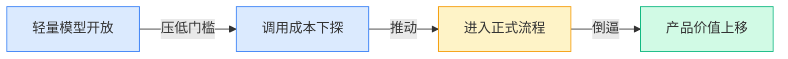
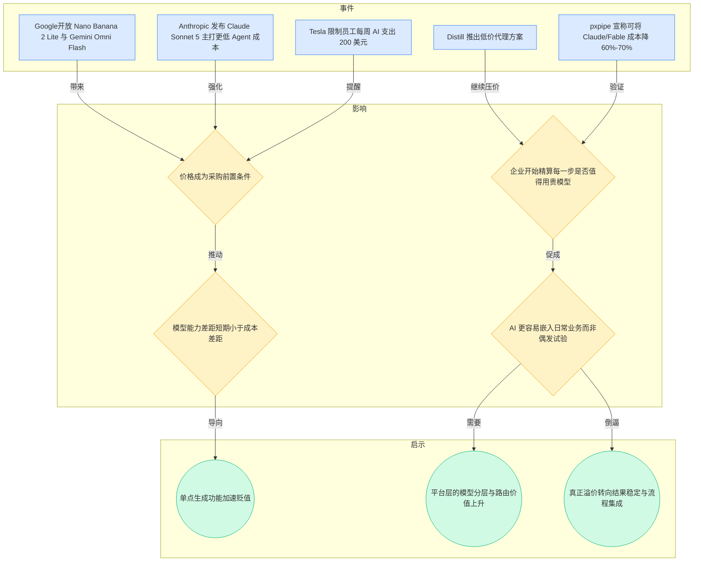
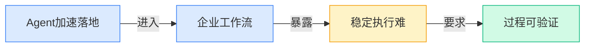
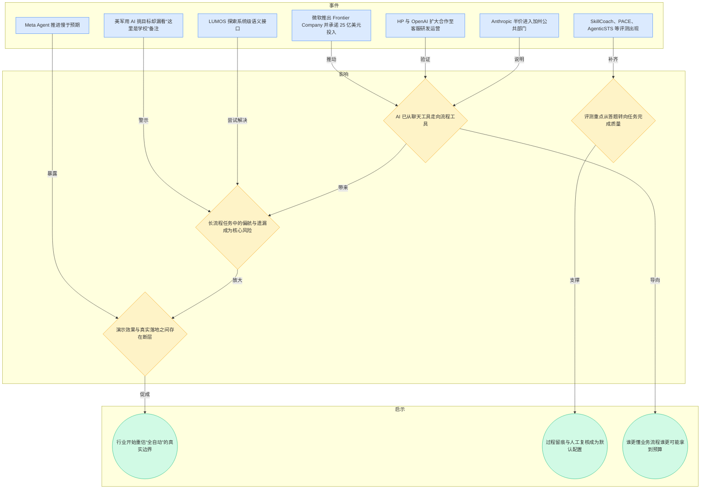
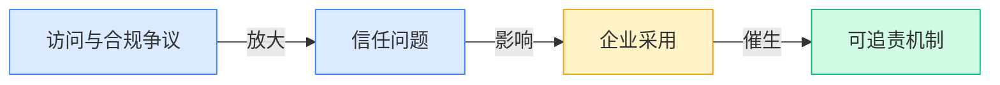
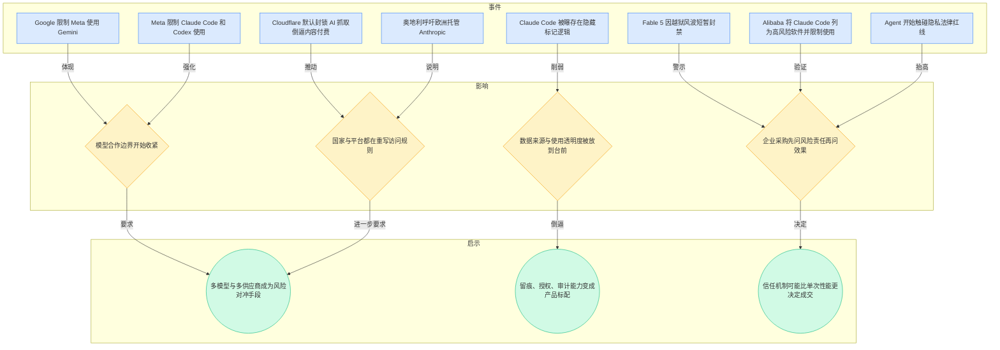
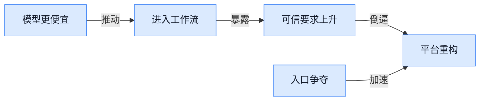
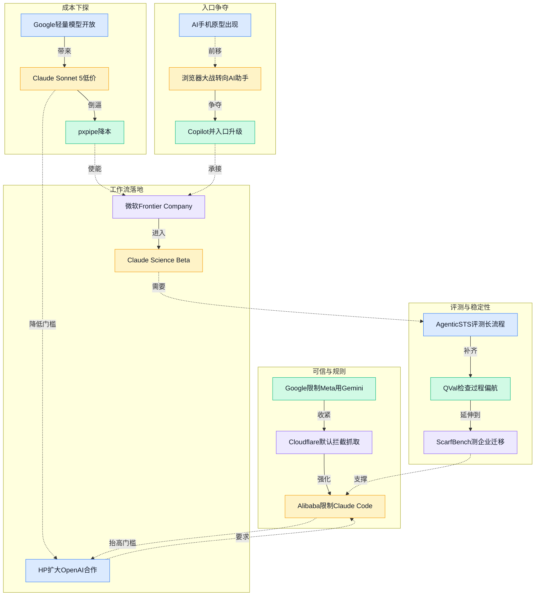

> 2026-06-29 ~ 2026-07-05 | 本周共 7 期日报

**本周日报**: [06-29](/ai-daily-site/2026/2026-06/2026-06-29/) | [06-30](/ai-daily-site/2026/2026-06/2026-06-30/) | [07-01](/ai-daily-site/2026/2026-07/2026-07-01/) | [07-02](/ai-daily-site/2026/2026-07/2026-07-02/) | [07-03](/ai-daily-site/2026/2026-07/2026-07-03/) | [07-04](/ai-daily-site/2026/2026-07/2026-07-04/) | [07-05](/ai-daily-site/2026/2026-07/2026-07-05/)

---

## 本周聚焦

### 低价模型全面铺开，竞争从“最强”转向“可常驻”

展开详细图谱

本周最清晰的一条主线，是模型价格和使用成本继续快速下探。7月1日，Google 同时推出更快更省的 Nano Banana 2 Lite 和 Gemini Omni Flash，Anthropic 则把 Claude Sonnet 5 明确打成低价主力；7月2日，Distill 用每月 4 美元代理方案切入；7月5日，pxpipe 这类“把文本转成图片再交给模型处理”的降本工具继续走红；连 Tesla 都在 7月4日对员工 AI 支出设置每周 200 美元上限。这些事件放在一起，不是零散新闻，而是在说明：AI 已经从“要不要试试”进入“每一步值多少钱”的经营阶段。

为什么重要？因为价格变化会重排产业价值。过去大家更容易被模型排行榜和单次惊艳效果吸引，但当轻量模型变快、变便宜、够用，企业和产品团队就会开始拆算：哪些步骤可以交给便宜模型，哪些步骤才值得调用高价模型，哪些步骤甚至不该默认交给模型做。这意味着，单纯“接了一个强模型接口”的产品会越来越难守住毛利，也越来越难解释自己的收费。

对行业的意义在于，AI 的竞争逻辑正在从“能力展示”切到“长期可驻留”。只有当一个能力足够便宜，企业才敢把它放进客服、研发、运营、内容生产等正式流程里。本周 HP 扩大与 OpenAI 的合作、Claude 全面登陆 Azure（微软云平台）、微软提出 Frontier Company，都是同一逻辑的后续：不是模型更强就自然落地，而是成本降到可控后，流程改造才开始成立。

这也解释了为什么本周大量研究和开源项目都在做省算力：如 ReFreeKV（压缩模型短期记忆开销的方法）、Gist Tokens（关键信息压缩标记）、MultiHashFormer（更省算力的模型结构）、DSpark（推理加速技术）等。它们未必直接改变用户感知，但会改变单位任务成本，进而影响谁能留下来做平台、谁只能做演示。

对创业公司尤其关键的一点是：成本下探不等于机会变少，反而意味着价值重心上移。便宜模型会把基础生成能力变成“水电煤”，真正稀缺的会是选择哪个模型、在什么环节使用、出错时如何接管、结果如何比对和复用。谁能把“便宜但不稳”和“昂贵但可靠”之间的平衡变成产品能力，谁就更接近下一阶段的基础设施位置。

### Agent 进入真流程，但“会做事”比“会回答”难得多

展开详细图谱

本周第二条主线，是 Agent 正在从“聊天框里的能力演示”走向“真正代办任务”，但一进入真实流程，问题立刻变得更具体也更棘手。6月29日的日报就点出关键：AI 要成为真正同事，关键不是会回答，而是能把任务做完。随后几天，这个判断被一连串事件反复验证。6月30日，美军使用 AI 挑出目标，却漏看“这里是学校”的备注；7月3日，微软推出面向企业落地的 Frontier Company，直接用大量工程与服务资源进入客户流程；7月4日，Meta 的 Agent 推进慢于预期，说明即便巨头也没能轻松跨过落地门槛；同一周，LUMOS、SkillCoach、PACE、AgenticSTS、QVal 等研究或工具集中出现，几乎都在回答同一个问题：怎么判断一个 Agent 在长流程里有没有走偏。

为什么重要？因为这代表产业瓶颈已经明显迁移。过去难点是“模型会不会”，现在更难的是“它能不能持续做对”。一旦 AI 要处理多步骤任务，比如搜集资料、理解界面、修改内容、判断是否合规、交付最终结果，每一步都可能出小错，而这些小错会在流程里累积，最后形成大事故。美军案例就是极端版本：模型不是完全失效，而是在关键备注上漏看，这种“局部正确、整体危险”的问题，恰恰最难靠炫目的演示发现。

对行业意味着什么？意味着未来几个月，单纯强调“任务成功率”已经不够，行业会越来越看重过程可验证性。也就是说，用户不只关心最后结果，还关心：模型依据了什么、在哪一步不确定、何时应该转人工、失败后如何恢复。这也是为什么评测体系开始从通用跑分转向 ScarfBench（企业 Java 迁移测试集）、OpenBioRQ（科研问题集）、AgenticSTS（长流程稳定性测试）这类贴近真实工作的基准。大家不再轻信“平均分高”，而是要看在高风险、长链条、跨工具的环境里到底稳不稳。

更深一层看，这会改变产品定义。能替用户完成任务的产品，不再只是“一个更聪明的对话框”，而更像“带规则、带节点、带交接的工作台”。微软、HP、Anthropic 推进的方向都不是单点功能，而是把 AI 插进正式业务流程。这个变化对早期公司既是压力也是机会：压力在于，单点能力很快会被复制；机会在于，谁先把复杂任务拆成可靠步骤，谁就更接近真实价值。

### 信任、权限与上游规则，正在成为 Agent 商业化前提

展开详细图谱

本周第三条主线，不是模型性能，而是围绕权限、数据和规则的信任重构。6月29日，Google 限制 Meta 使用 Gemini；6月30日，Meta 又限制 Claude Code 和 Codex 使用，以防竞争对手拿走训练数据；7月2日，Cloudflare 通过默认封锁新规则，倒逼 AI 公司为媒体内容付费；同日，Claude Code 被曝存在隐藏标记逻辑，Fable 5 又因越狱（绕过安全限制）问题短暂封禁；7月3日，Agent 开始触碰隐私法律红线；7月5日，Alibaba 被曝将 Claude Code 列为高风险软件并限制员工使用。看似分散，其实都指向同一个结论：AI 商业化已不只是技术问题，而是访问权、解释权和责任边界问题。

为什么重要？因为一旦 AI 进入企业或公共部门流程，风险不再只是“答错一句话”，而可能是泄露资料、误用内容、越过授权边界、无法解释决策依据。此时采购者最先问的往往不是“你用的是哪个最强模型”，而是“如果出事谁负责、证据留不留得下、能不能限制范围、能不能切换供应商”。本周 Anthropic 半价进入加州公共部门、Claude 登陆 Azure，恰恰说明大客户愿意买 AI，但前提是责任边界更清楚。

对行业意味着什么？第一，上游规则不再稳定，任何产品都不能把单一模型供应商当成理所当然。Google 对 Meta 的限制、Meta 对 Claude/Codex 的限制，都说明模型能力本身可能买得到，但使用权未必持续。第二，数据抓取与内容供给的旧模式正在被重写。Cloudflare 的动作意味着，未来训练数据、实时内容和网站访问可能都要重新定价。第三，黑箱式 Agent 的商业阻力会越来越大。隐藏标记逻辑、越狱争议、跨境合规问题，都在削弱用户对“全托管智能体”的天然信任。

更现实的影响是：未来的产品胜负，很可能取决于谁能把“可信”做成默认体验。这里的可信，不是口头承诺，而是可见的权限控制、明确的人工确认节点、完整的结果依据、可切换的供应商策略，以及必要时的审计（事后检查）能力。对于 Agent 平台来说，这些能力不是附属品，而是进入真实市场的门票。

---

## 信号与噪音

1. Coinbase 转向中国 AI 模型，给西方实验室带来价格压力测试。一方面说明中国模型的性价比正在跨境外溢，另一方面也提醒市场，模型竞争已不只看性能榜，国际企业开始用真实采购行为给出更残酷的价格比较。

2. Ford 在 AI 效果不达预期后重新聘用资深工程师。这不是“AI 失败”，而是再次证明复杂工作里的隐性知识（难写成规则的经验）仍很难被完全替代，短期内“AI 先做、人工兜底”仍会是许多高责任场景的主流组织方式。

3. OpenAI 发布《欧洲 AI 劳动力地图》，加州又上线 AI 岗位流失追踪器。两件事共同说明，AI 对就业的影响正在从抽象争论转向可量化观察，政策制定者和企业管理者都会更频繁地要求看到岗位变化证据，而不只接受宏大叙事。

4. Meta 准备把闲置 AI 算力卖出去，英伟达则推出面向创业公司的收入分成模式。算力正在从单纯采购商品变成合作筹码，对创业公司是双刃剑：短期门槛可能下降，长期却可能更容易被平台型上游绑定。

5. SpaceX 展示搭载 xAI 技术的 AI 手机原型，浏览器厂商也在争 AI 助手入口。这说明“入口战”已经从网页和应用层继续前移到终端与浏览器层，未来谁能最先接住用户第一步意图，谁就更可能吃到后续任务链路的价值。

6. Kling 融资 20 亿美元冲刺香港上市，Google DeepMind 同时与 A24 启动电影研究合作。视频方向正在同时出现“工业化批量生产”和“高端创意实验”两条线，说明赛道空间在放大，但也意味着资源、资本和人才会更快向头部集中。

7. Anthropic 一边推出 Claude Science Beta，一边亲自下场做药物发现项目，Insilico 又与 SK 启动高额合作。这表明头部公司正从“卖工具”走向“做结果”，但生命科学验证周期极长、监管极重，短期更适合把它视作战略卡位，而不是能快速复制到所有垂直行业的模板。

---

## 宏观趋势

展开详细图谱

1. 低成本 AI 正在成为主航道。Google 的轻量模型、Claude Sonnet 5、Distill、pxpipe、DSpark、ReFreeKV 等事件都在验证，行业焦点正从“更强一点”转向“便宜很多且足够好”。接下来更可能出现的不是单一价格战，而是按任务复杂度自动分层的定价与模型组合。

2. Agent 的战场从对话转向工作流。微软 Frontier Company、HP 扩大合作、Anthropic 进公共部门、Claude Science，以及 LUMOS、QVal、AgenticSTS 等研究，都说明市场已默认 Agent 要进入真实流程。未来胜负会更取决于任务拆解、节点控制和异常处理，而不是单轮回答质量。

3. 信任基础设施正在补课。Google/Meta 互相设限、Cloudflare 默认拦截抓取、Claude Code 隐藏标记争议、Fable 5 越狱封禁、Alibaba 限制高风险软件使用，这些都表明“可信、可控、可追责”正成为采购前提。未来更多产品会把权限、依据展示、人工确认做成显性卖点。

4. 入口与平台边界同步收紧。浏览器、AI 手机、统一工作台在争用户入口；同时模型许可、内容访问、跨境合规、云平台托管也在收紧边界。未来中小公司想长期生存，既要争取离用户更近，也要避免被单一上游规则卡住。

---

## 对我们的启发

1. 产品方向：本周最明确的启发，是“模型选择器 + 过程工作台”比“单一超级 Agent”更贴近现实。低价模型普及后，我们应优先把任务拆成可编排节点：查询、生成、判断、复核、交付分别选不同模型，并向用户展示依据、版本与接管点。

2. 产品方向：Agent 平台不能只强调自动完成，还要把“何时不该自动做”产品化。长流程稳定性、人工确认、失败回退、结果比对，会比再多接一个热门模型更影响真实采用。

3. 竞争策略：上游规则波动明显，多模型接入和供应商切换能力应尽早成为底层能力，而不是以后再补。谁能帮用户对冲模型许可、价格、区域可用性风险，谁就更像平台而不是工具壳。

4. 时机判断：现在不是押注“终局大模型”的时候，而是占住“AI 使用操作系统”的窗口期。因为行业已进入成本下降、流程重构、信任补课并行阶段，市场更需要的是把碎片能力组织成可交付方案的平台。

---

## 本周思考

当模型越来越便宜、越来越多时，用户真正愿意长期付费的，会是“最强的 AI”，还是“出了问题也能被信任的选择系统”？如果答案是后者，我们要构建的核心壁垒到底是能力，还是治理能力？
