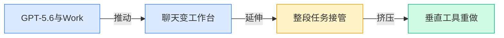
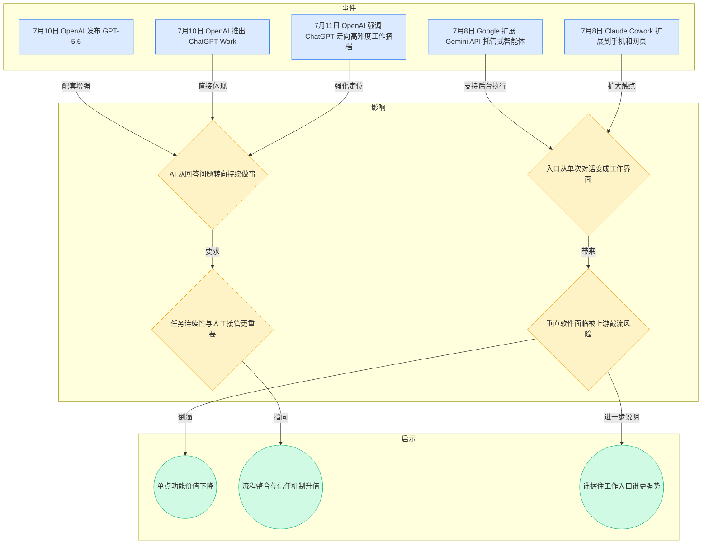
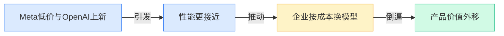
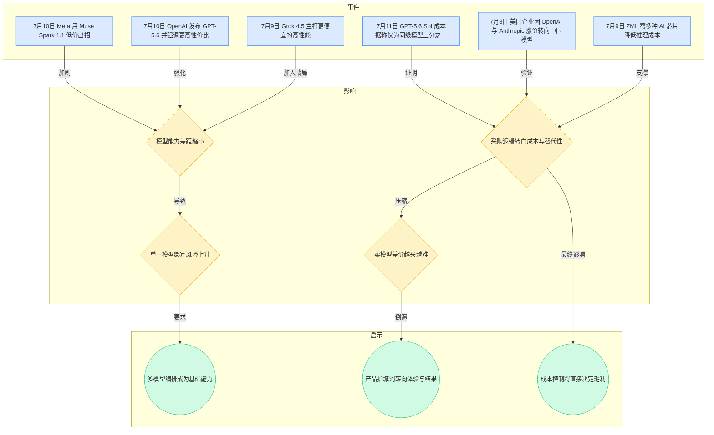
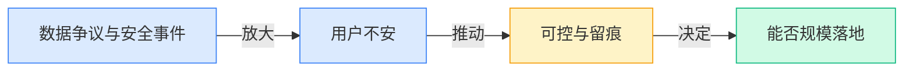
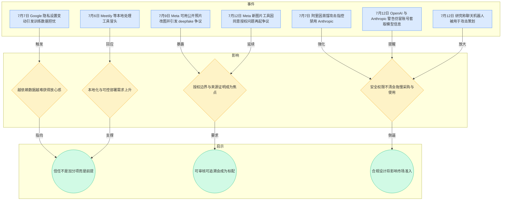
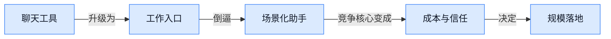
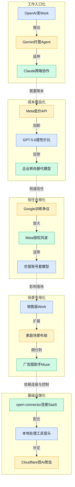

> 2026-07-06 ~ 2026-07-12 | 本周共 7 期日报

**本周日报**: [07-06](/ai-daily-site/2026/2026-07/2026-07-06/) | [07-07](/ai-daily-site/2026/2026-07/2026-07-07/) | [07-08](/ai-daily-site/2026/2026-07/2026-07-08/) | [07-09](/ai-daily-site/2026/2026-07/2026-07-09/) | [07-10](/ai-daily-site/2026/2026-07/2026-07-10/) | [07-11](/ai-daily-site/2026/2026-07/2026-07-11/) | [07-12](/ai-daily-site/2026/2026-07/2026-07-12/)

---

## 本周聚焦

### 大厂把 AI 从“会聊”推向“能接整段工作”，入口争夺开始升级

展开详细图谱

本周最值得重视的一条主线，是大厂在系统性把 AI 从“回答你的问题”，推进到“替你处理一整段工作”。最集中的是 7 月 10 日 OpenAI 同时发布 GPT-5.6 和 ChatGPT Work，并明确把产品往企业工作流推进；7 月 11 日又继续强调 ChatGPT 正从聊天工具走向“高难度工作搭档”。这不是一次普通版本更新，而是在重画产品边界：AI 不再只是一个调用能力的底层模型，而是想直接占据用户工作的入口。

这件事重要，是因为它改变了竞争对象。过去创业公司主要和同类功能产品比“哪个结果更好”；现在更大的威胁是，用户是否还需要离开 ChatGPT、Gemini、Claude 这些通用平台。7 月 8 日 Google 扩展 Gemini API 的 Managed Agents（托管式智能体能力，指任务可在后台持续执行），Claude Cowork 也扩展到手机和网页，说明各家都在做同一件事：让 AI 不止一次性回答，而是跨设备、跨时间、持续接手任务。竞争点因此从模型答得聪不聪明，转向能否持续执行、是否可中途接管、出了问题能否回退。

对行业的意义在于，垂直产品会被迫从“功能型工具”升级为“流程型工具”。如果只是包装一个生成按钮，价值会被上游通用助手快速吞掉；但如果你能把任务拆解、审阅、交接、复用偏好、保留责任链（谁改了什么、为什么改）整合起来，反而更有机会留下来。通俗说，大厂在抢“前门”，垂直产品就必须守住“后厨”。谁能把复杂工作变成可信、可复用、可接管的流程，谁才不会被入口型产品挤掉。

### 模型价格战全面升温，“最强模型”不再等于“最好生意”

展开详细图谱

第二条主线，是模型层面的价格战已经从“预期”变成“现实”。7 月 10 日 Meta 用 Muse Spark 1.1 低价出招，OpenAI 同天发布 GPT-5.6 并强调单位成本下更高智能；7 月 11 日又出现 GPT-5.6 Sol 在接近同级性能时成本仅为三分之一的消息。7 月 8 日还有美国企业因 OpenAI、Anthropic 涨价而转向中国模型，7 月 9 日 Grok 4.5 和 ZML 也都在围绕“更便宜地跑起来”做文章。这一周的信息拼起来很清楚：行业正在从“谁最强”切到“谁够强而且更便宜”。

这件事重要，是因为它直接改变产品公司的利润结构和议价能力。以前上游模型贵、能力差距大，很多应用还能靠“接入某个最强模型”当卖点；现在能力收敛、替代增多，用户会越来越自然地问：为什么这件事非要用最贵那一个？一旦采购方形成按任务切换模型的习惯，所有只依赖单一模型溢价的产品都会被压价。

对行业意味着两层变化。第一，模型本身会更像水电煤（基础能力），应用层如果没有自己的流程资产、用户习惯数据、复核体系和结果责任，就很难拿到长期价值。第二，成本分层会成为默认设计，而不是高级玩法。7 月 12 日关于 GPT-5.6 Sol Ultra 的讨论就已经在提示：更强能力往往意味着更高成本，因此产品需要先用低成本模式处理简单任务，再在复杂任务上升级算力。未来优秀产品比拼的不是“默认全开最高档”，而是能否聪明地决定何时省、何时花。

### 信任、授权与安全从附属问题变成入场门票

展开详细图谱

第三条主线不是某一家大厂的新功能，而是整周持续出现的“信任赤字”。7 月 7 日 Google 隐私设置变动引发用户数据可能被用于训练 AI 的担忧，阿里又因“蒸馏攻击”（通过输出结果反推或复制模型能力的攻击方式）指控禁用 Anthropic；7 月 9 日到 12 日，Meta 围绕公开照片改图、deepfake（AI 伪造内容）和同意授权问题连续陷入争议；7 月 12 日 OpenAI 与 Anthropic 还警告仿冒账号在套取模型信息，另有研究称主流聊天机器人正被恐怖组织用于攻击策划。再往前看，7 月 6 日 Meetily 这类本地处理工具起量，也是在回应同一个问题：用户担心数据外流和边界失控。

它为什么重要？因为 AI 行业过去常把安全、授权、隐私当成“后面再补”的功能，但本周的信号说明，这些已经开始决定产品能不能进入正式场景。尤其当 AI 从聊天走向工作流后，系统接触到的不再只是几段提示词，而是合同、客户名单、品牌素材、内部知识、行为习惯。能力越强，接触面越广，信任成本就越高。

对行业意味着，下一阶段真正稀缺的不是“再强一点的生成”，而是“让人敢用的机制”。包括素材来源是否清楚、是否参与训练、谁有权限看、是否支持本地处理、关键步骤能否人工确认、产出是否可回溯。谁先把这些机制产品化，谁就更有机会穿越接下来的监管收紧和企业采购审查。反过来，增长如果建立在模糊授权和黑箱生成上，跑得越快，未来补课成本可能越高。

---

## 信号与噪音

1. 7 月 7 日 Microsoft 近 5000 人裁员，Xbox 与商业销售受影响较大。点评：这不是单一公司的坏消息，而是大厂在 AI 投入和传统业务之间重新分配资源，说明“全面拥抱 AI”并不意味着每条旧线都能被保留。

2. 7 月 7 日 Amazon Mechanical Turk 停止接收新客户，7 月 7 日日报又指出这一最早的人力众包标注平台正在谢幕。点评：传统“人工假装智能”的数据外包模式走到拐点，未来高价值数据会更靠企业内部沉淀、合成数据（人工生成的训练数据）和更少量但更高质量的人类反馈。

3. 7 月 6 日特朗普对私有 AI 模型设限，叠加 Mistral CEO 对专有模型控制业务流程的警告。点评：政治和商业两条线同时把“模型主权”推到台前，开源、本地处理、私有化部署不再只是技术偏好，而在逐渐变成组织风险管理选择。

4. 7 月 8 日 Cloudflare 改用更细颗粒度的 AI 爬虫管理，内容方开始争夺“谁能拿我的内容去喂模型”的控制权。点评：这件事短期看像网站策略升级，长期看则可能重塑内容供给链；未来模型公司获取数据的成本未必下降，授权和分成机制反而可能更复杂。

5. 7 月 9 日 OpenAI 发布新语音模型，Gemini 也在 7 月 12 日进入 Android Auto，车载语音体验改善明显。点评：语音正从附属输入方式变成主要交互层，特别是在开车、走路、做家务这些双手不方便的场景里，AI 的竞争边界会被重新打开。

6. 7 月 11 日 Bun 借助 Claude Fable 5 在 11 天内改写超百万行代码，7 月 10 日 OpenAI 的 AI 还在 AtCoder 编程竞赛中击败全部人类选手。点评：AI 在代码生产上的突破是真实存在的，但同周 OpenAI 也指出大量热门编程测试本身有问题，这提醒我们“能生成很多”不等于“能稳定上线使用”。

7. 7 月 12 日 open-connector 这类连接 1000 多个 SaaS 的开源认证网关出现。点评：这类基础设施新闻不够热闹，却很关键，因为 Agent 真正进入企业与消费场景，卡点往往不在模型，而在能否安全接通真实工具和账户体系。

---

## 宏观趋势

展开详细图谱

1. 趋势名称：AI 从对话界面走向工作入口。本周验证事件包括 OpenAI 推出 ChatGPT Work、Google 扩展托管式智能体、Claude Cowork 覆盖手机和网页。未来走向是，用户会越来越习惯把“交代任务”而不是“提问聊天”当成 AI 的主要用法，拥有入口的一方将更强势。

2. 趋势名称：模型能力商品化，成本管理成为核心能力。本周验证事件包括 Meta 低价推进 Muse Spark 1.1、OpenAI 强调 GPT-5.6 的性价比、美国企业转向更便宜的中国模型、Grok 4.5 与 ZML 继续压低推理成本。未来走向是，多模型混用、按任务分档、自动控制成本会成为优秀产品的默认配置。

3. 趋势名称：信任机制前置，合规设计产品化。本周验证事件包括 Google 训练数据争议、阿里禁用 Anthropic、Meta 在照片改图和授权上连续引发争议、OpenAI 与 Anthropic 警告仿冒账号套取模型信息。未来走向是，权限、留痕、授权来源、本地处理能力会直接影响转化和市场准入。

4. 趋势名称：AI 助手快速场景化。本周验证事件包括 OpenAI 面向销售团队推出 Work 方案、押注家庭场景、Meta 的广告图片工具 Muse、教育和高尔夫等行业助手持续出现。未来走向是，“通用聊天机器人”会继续存在，但更高商业价值会流向懂岗位流程、能承担结果责任的专用助手。

---

## 对我们的启发

产品方向上，第一，不要把自己定义成“接几个模型的生成器”，而要做成“可交付的任务流程层”：先理解需求，再调用合适能力，最后给出可复核结果。第二，要尽早把多模型切换、成本分档、人工确认、授权留痕做成产品默认能力，而不是售后解释。

竞争策略上，第一，大厂在抢通用入口，我们不该正面拼“谁更全能”，而应深挖用户最痛的高频任务，把方案评价、结果对比、可信交付做成差异化。第二，模型价格战会持续，真正可守的不是模型供应，而是我们能否积累任务路由规则、用户偏好、质量反馈和结果责任机制。

时机判断上，当前是一个窗口期：上游能力快速成熟，但用户对“怎么选、怎么信、出问题谁负责”仍缺乏解决方案。只要我们能把选择、评价、复核和信任做顺，Agent 平台的价值会比单个 Agent 更容易被看见；但窗口不会太久，因为大厂也在往工作流和场景化快速推进。

---

## 本周思考

当上游通用 AI 逐步占据用户入口后，用户为什么还需要一个独立的 Agent 平台？答案也许不在“更强”，而在“谁替用户承担选择、比较与信任的复杂性”。
