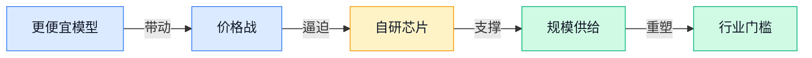
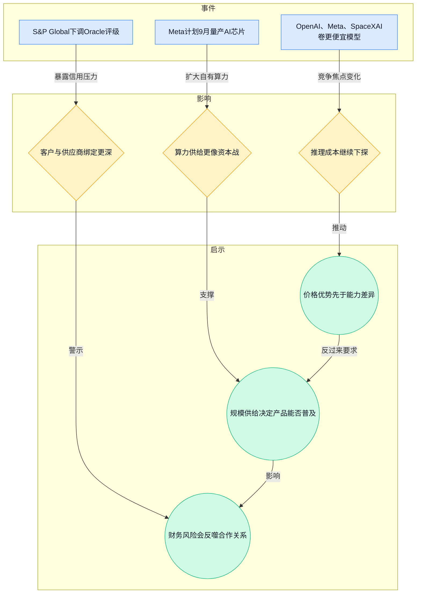
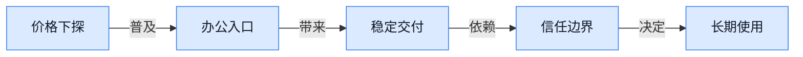
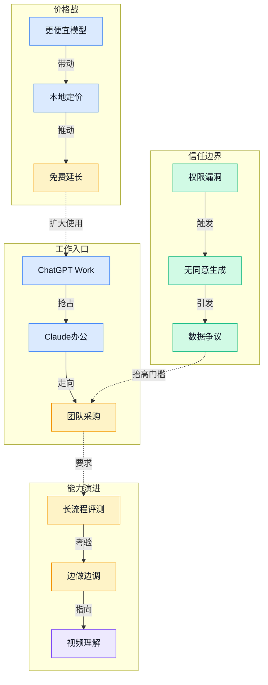

> 2026-07-13 ~ 2026-07-19 | 本周共 2 期日报

**本周日报**: [07-13](/ai-daily-site/2026/2026-07/2026-07-13/) | [07-14](/ai-daily-site/2026/2026-07/2026-07-14/)

---

## 本周聚焦

### 1）AI 竞争从“更聪明”转向“更便宜、更供得起”

展开详细图谱

本周最清楚的一条线，是头部公司都在把“更聪明”让位给“更便宜且供得起”。7 月 13 日的日报里，OpenAI、Meta 与 SpaceXAI 围绕更省钱的模型展开竞争，Meta 还计划 9 月量产 AI 芯片、把计算能力翻倍；同一天，标普全球下调 Oracle 评级，并把 OpenAI 点名为关键信用风险。7 月 14 日，Anthropic 在印度推进 Claude 本地定价，又延长 Fable 5 免费使用，进一步把价格战推向大众市场。

这件事重要，不只因为“降价”本身，而是它改变了行业的胜负手。过去大家拼的是一次回答有多惊艳，现在拼的是能不能长期、稳定、便宜地提供服务。对平台来说，这意味着算力、模型、分发和资金一起进场，谁都不再只是软件公司。对创业公司来说，单纯追求“模型更强”会越来越难形成壁垒，因为能力差距很快会被价格和规模抹平。

对行业的含义也很直接：AI 正在从“技术竞赛”走向“基础设施竞赛”。谁能把成本压到足够低，谁就更容易进入大众使用场景；反过来，谁的商业模式建立在高算力和高预期上，谁就更容易被财务风险反噬。

---

## 信号与噪音

1. Anthropic 的 Claude Cowork 最先跑通的是报表、清单、幻灯片这类琐碎办公活。点评：这说明“AI 同事”短期更像替人接碎活，而不是整岗替代。
2. 中国通报 Claude code 存在安全漏洞。点评：编码助手一旦接触代码和权限，安全问题会比演示效果更先决定能否被企业接受。
3. Meta 下线 Muse Image，原因是未经同意生成他人形象引发反弹。点评：人像和身份类生成内容的边界，已经从“能不能做”变成“敢不敢上线”。
4. 布朗大学禁用 AI 后成绩从 96% 跌到 48%。点评：这类数据更像提醒——一旦学习过程被外包，真实能力会迅速退化。
5. LinkedIn 被研究指为 AI 灌水重灾区。点评：平台内容数量可能更好看，但信息密度和可信度会被稀释。
6. Rich Sutton 创办 Oak Lab，聚焦“自我学习”Agent。点评：学术顶级人物下场，说明行业正在寻找比“固定流程自动化”更进一步的路线。
7. OpenAI 推出 ChatGPT Work，Anthropic 又做印度本地定价。点评：办公入口和本地价格一起推进，说明 B 端采购逻辑正在向“默认工具”靠拢。

---

## 宏观趋势

展开详细图谱

1. 价格下探、普及加速：OpenAI、Anthropic、Meta 都在压价或扩大供给，说明 AI 正从尝鲜品变成日常服务，未来会更像订阅软件而不是实验室产品。
2. 信任边界前置：Meta 下线 Muse Image、Claude code 漏洞、Grok CLI 传输内容被拆解，都在说明“能做”不够，授权、透明和权限控制会成为上线门槛。
3. 工作入口之争升温：ChatGPT Work、Claude 本地定价、Fable 免费延长，验证头部公司都在抢“团队长期使用”的位置，未来竞争会更像争夺办公默认入口。
4. 从生成走向理解：Long-Horizon-Terminal-Bench 和视频生成相关研究一起出现，意味着行业不只追求出内容，还要让模型看懂、评估并持续完成任务。

---

## 对我们的启发

1. 产品方向上，本周再次证明我们不能只卖“生成结果”，而要把价值放在可交付、可回退、可审阅上。对 Agent 调度平台来说，先把碎活拆开、把节点管住，比追求一次性全自动更现实。
2. 竞争策略上，便宜模型会越来越多，真正能形成壁垒的是工作流、素材资产和信任机制。我们需要默认支持授权确认、修改记录和人工终审，而不是把它们当附加功能。
3. 时机判断上，行业正在从“能不能用”进入“敢不敢长期用”。这对早期产品是机会：只要能在一个高频、低风险场景里先建立可信流程，就有机会成为入口。

---

## 本周思考

如果未来最值钱的不是“最强模型”，而是“最让人放心交给它的流程”，我们现在到底是在做一个工具，还是在做一种新的工作制度？
