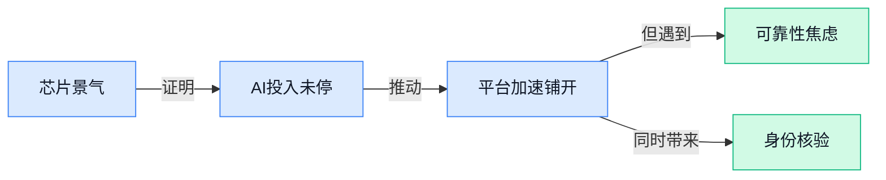

> AI 早报 · 每日早读 · 全网深度聚合

## **今日摘要**

```
台积电利润大增58%、台湾股市总市值反超英国，ASML与台积电齐喊AI投资热潮未退
Anthropic 上调高频用户价格并在部分 Claude 场景强制验身份，越火越贵的 AI 开始收紧闸门
DeepSeek 更新 DeepGEMM 并测试 Mega MoE（超大规模混合专家模型），Google 还把 Gemini Mac 应用推上桌面
```

### 🔵 产品与功能更新

1. **Google 为 Gemini 推出 Mac 应用，但功能仍有取舍。**
Google 把 **Gemini** 带上了 **Mac 应用**，意味着苹果电脑用户可以更直接地调用 AI 助手，不必总在浏览器里来回切换 💻。不过从报道看，这次更新并不是“全功能搬家”，它能做什么、暂时还做不了什么，依然有明显边界，说明桌面端体验还在持续补齐中。对日常办公同事来说，这类原生应用（直接安装在电脑里的软件，通常比网页更顺手）最大的价值，是让写作、整理资料、快速问答更贴近日常工作流。想看具体支持与限制，可以参考[Mac 应用功能报道(briefing)](https://news.google.com/rss/articles/CBMi2gFBVV95cUxNalhadFphT3R5X1ZZejA0djA3LVdYYjFOTHpVMXV1N0thQ2RDbXN1bTlBTUdlUFVFUVUxNXQ0ZjFpa0JMRWxrRXNndG4ydDNYVzZKUk9rSDlDQVpWYTNnbkg2X3RSTlM4b1Eza2pDcGtra0VqbDV0QldMZm1nRXlIZFlieUdGQUtpRXlCTVBVejR1d2ZEZHAwbllXSFVNT3FtTVd3Q3doNVdqYXgtQlpMNVBYM3M0Z01nSTE5TEpaNEtrYVB4T2NjZ3ZlWFhwQzNiXzkxeVdCdnpLd9IB3wFBVV95cUxQQmJCVTk4R2stUFlzZkJCaVFPWEU5OGlpY2UzcGFUMU45dUVwNzlyWk1pYW5GSEVacVlxQTBwQzVYSERvcG12WU4tTFBfdkdFOElPeDJZVEFBR3NpNXUzWURxZTlWU0FiWk5NaE5GUlFVbnlNa2NjdlA3bUVwZXJNZFdQUGtBV3NIbnRNQ3RRWXhvejZDXzBfQWlHWWhERXJEeGMzMkxLaDJLSExtaTNab19hWHFldUpEeEFQakc1WUdqS09FMEhQU3RzZklpeTUtQ2l6UVR4M3V4LTNlMnZv?oc=5)。

2. **Microsoft 将协助 Stellantis（旗下拥有多品牌的跨国汽车集团）把 AI 接入更多运营环节。**
这次合作不只是给汽车加个“智能助手”，而是要把 **AI** 更系统地融入车企的日常运营，包括更广泛的业务流程与工作环节 🚗。换句话说，AI 正在从“面向消费者的功能”进一步走向“企业内部提效工具”，对制造业尤其关键。对非技术岗位同事来说，这类动作意味着未来从客服、供应链到内部协作，很多流程都可能被 AI 重新梳理。更多背景可看[车企合作新闻报道(briefing)](https://news.google.com/rss/articles/CBMi6AFBVV95cUxNRTJ5Vk5keFZyek5IWXlJTnJJNnlfNW91bjdHZ19tOEQwZ1BWemFhOFlMOTh2WnMzbkhoaTJVOHJPMFg3b3g2WjVmSGJKQk1qRXZSRmdZQVpjSFZEQTE0Z3BvTTIwc1ZGM2ZDbVZQdDVWdUJjY1BVM1hrdmVkeE1pT0NnTjJUT0NOTlBSeHQ3R3FqcTVqWW1HdEo3MUdMYi1MdGVSczc4NVR6bFlSWkxVdHVBazljcXdKakV5R2pKZzBnQjdYcVY2VTc0RHRENzgtV3Vyc09GVWQ5RjdFaW5YcDNrWXR3VFNp?oc=5)。

3. **Google 让 Gemini 对更多用户变得“更好用”了。**
这条更新的重点，不只是模型能力变强，更在于 **覆盖人群扩大**，也就是更多用户能用上改进后的 Gemini 🙌。对产品竞争来说，这很关键：AI 工具再强，如果只有少数人能体验，实际影响力就有限；一旦放量，才会真正改变大家的使用习惯。对普通办公场景而言，这通常意味着更稳定的回答、更容易接触到的新功能，或更少门槛的使用方式。具体变化可参考[功能扩展报道(briefing)](https://news.google.com/rss/articles/CBMipwFBVV95cUxPb3BaVTNXcGdZc1ZPTTVSR1VmMDV6MlZsWGxnMFFxYjBvRzlsX1c0aXlYd2JUS2hjSG5kSW5VZTVtMkE3cTlqcWNJWjF4UWpDbXdGLTl4OVhoTk5ybGlKaTBpR3lGWUdib0tWdVZhRXAtQnpnT3k5ZFlMR2JyTk8yTVJlY04wdlAwRGlOSjJKSGdJdmpZT3VLaXVzT1RMc0JKZ2p4YmM0QQ?oc=5)。

4. **Anthropic 将在部分 Claude 使用场景中要求用户验证身份。**
Anthropic 表示，针对“少数使用场景”，**Claude** 用户将需要进行 **身份验证**，这反映出 AI 平台正在把安全、合规和滥用防范放到更前面 🔐。所谓身份验证，可以理解为平台确认“你是谁、是否真实可追溯”，常见于涉及更高风险或更敏感权限的功能。对企业用户来说，这类机制虽然会增加一点操作步骤，但也可能让平台在合规管理上更容易落地。相关细节可看[身份验证消息报道(briefing)](https://news.google.com/rss/articles/CBMivgFBVV95cUxNN2FzYy1Ud2dDRTB4S1JXdHNDMXlzVTlWQU05aV9mSXNKUUpSdHh5T0JxeWhoMXFUR2wzMUxGNWFWTXRQbk9JNENMXzBoRlRmc1k0MTBvNUpfRnVxUC1mMHE2LWNnY1NuSFhDLWZpMWpzaTRTaGJVSTJITXJyclVObkpwZ3JuWFhUdUNaX0RHSUlBeW5jVWl5a240YkVUTml3QU1Edzc1LWRQVDAtT0JuN1E2VThySFdjY0h4SllB?oc=5)。

5. **Avid（影视与视频剪辑软件公司）把 Google Cloud 的 Gemini AI 接入编辑工具。**
Avid 正在把 **Google Cloud（Google 的企业云服务平台）** 里的 **Gemini AI** 接入自家剪辑工具，这说明 AI 正进一步进入专业内容生产流程 🎬。对视频团队来说，这类集成通常不是“做个聊天框”那么简单，而是要让 AI 真正嵌进编辑、整理、协作等具体步骤里。对于企业内容部门、品牌团队和媒体行业，这类更新意味着未来视频生产可能更快、更省人力，也更容易规模化。更多信息可查看[剪辑工具集成报道(briefing)](https://news.google.com/rss/articles/CBMiugFBVV95cUxPZVl4T3h2NkpnZUxRT2VyZmVJVWYtaEtOMWZBLTAwdDJ3S3dFckR3bmFnMGZrMTl1UXR3VV9YNThIZnNYNVN4b0tZVFptZzZRLUY0UnBCUWQ3RFB6M2VzcVdZRjcweE03ZGhaSzNLXzFhNTZXTzVNYXlkV2tFbmF4dm5fbGpLcEFNS1BhaUtHX1AxSXNaSlJjVFgwTGF4MjQ5VVJKNFVOeXg4REUzWGUzekdnMHo5cnluQWc?oc=5)。

### 🟢 前沿研究

1. **Out of Context（一篇研究多模态异常检测的论文）指出：AI 发现异常不能只看“怪不怪”，还得看上下文。**
这篇论文聚焦**多模态异常检测**（让 AI 同时看图像、文本等多种信息来发现异常）里的一个核心问题：很多系统只学“正常样本长什么样”，却不真正理解场景语境，所以容易误判 💡。作者强调，判断异常不能脱离**contextual inference（上下文推断，即结合环境和前后关系来理解当前情况）**，否则“看起来奇怪”不一定真有问题。对企业场景来说，这会直接影响安防巡检、质检审核、医学辅助判断等应用的可靠性，提醒大家别把“识别异常”想得太简单。[arxiv 论文原文(briefing)](https://arxiv.org/abs/2604.13252)

2. **Peer-Predictive Self-Training（一种让模型自我提升的训练方法）探索了语言模型不靠人工标注继续进步的新路。**
这篇研究提出 **PST**（Peer-Predictive Self-Training，同行预测式自训练：让模型通过彼此预测和校验来继续学习），目标是解决大模型离开人工老师后怎么持续提升的问题 🚀。它属于**label-free fine-tuning（无标签微调，即不用人工一条条标注答案，也能继续优化模型）**思路，重点在于让模型推理能力能靠内部机制迭代增强。对公司来说，这类方法如果成熟，意味着未来训练和维护专业 AI 助手时，可能更省标注成本、更新也更快。[论文摘要页(briefing)](https://arxiv.org/abs/2604.13356)

3. **KV Packet（一种改进大模型缓存的方案）想让长上下文调用更快，而且不用反复重算。**
论文关注大模型推理时非常关键的 **KV caching（键值缓存，简单理解就是把模型已经“看过”的内容先记下来，下次少算一遍）** 问题。作者提出的 **recomputation-free（免重计算）**、**context-independent（与上下文解耦）** 方案，想解决“同一段文档换个新问题又得重算”的低效痛点 ⚡。这对做知识库问答、文档助手、客服机器人尤其重要，因为长文档场景里，速度和成本往往是产品能不能落地的关键。[arxiv 论文页面(briefing)](https://arxiv.org/abs/2604.13226)

4. **English is Not All You Need（一篇多语言后训练研究）提醒行业：大模型不能只围着英语转。**
论文指出，虽然很多大模型已经全球化部署，但**post-training（后训练，即模型预训练完成后，再针对能力、安全、对话风格做进一步优化）**流程仍明显偏向英语，导致不同语言表现不均衡 🌍。作者系统研究了**multilinguality（多语言能力）**在后训练中的作用，核心是在问：模型变强时，是否把非英语用户也真正带上了。对出海业务、跨语种客服、国际招聘与内容运营团队来说，这类研究很重要，因为它关系到 AI 工具在不同市场里是不是“同样好用”。[arxiv 论文原文(briefing)](https://arxiv.org/abs/2604.13286)

5. **HETA（一种解释大模型输出依据的方法）试图回答：模型到底是被哪些词“带着走”的？**
这篇论文提出 **HETA**（Hessian-Enhanced Token Attribution，利用二阶信息增强的词元归因方法），用于解释**autoregressive LLMs（自回归大模型，即一个词接一个词往下生成内容的模型）**为什么会给出某个输出 🧠。这里的 **token attribution（词元归因）** 可以理解为：把模型生成一句话的“功劳”分摊到输入里的不同词，看看到底谁影响最大。对需要审计 AI 决策过程的场景，比如金融、法务、医疗辅助等，这类可解释性研究能帮助团队更清楚地判断模型是否“有理有据”。[论文详情页(briefing)](https://arxiv.org/abs/2604.13258)

6. **DF3DV-1K（一个新型三维视角合成数据集）为“去干扰物”的画面生成提供了统一测试标准。**
论文发布了 **DF3DV-1K**，这是一个面向 **novel view synthesis（新视角合成，即根据已有画面生成物体或场景从其他角度看到的样子）** 的大规模数据集与基准 📷。它特别强调 **distractor-free（无干扰物）**，也就是尽量减少杂物、背景噪声等因素对评测的影响，让模型能力对比更公平。对电商展示、游戏内容制作、数字孪生（把现实物体或空间做成可交互数字副本）等行业来说，更稳定的评测集意味着相关视觉生成能力更容易走向可用和可比。[arxiv 数据集论文(briefing)](https://arxiv.org/abs/2604.13416)

7. **MERRIN（一个网页环境评测基准）把 AI 上网找证据这件事，测得更接近真实世界了。**
这项研究提出 **MERRIN**，一个用于评估 **multimodal evidence retrieval and reasoning（多模态证据检索与推理：从网页里的文字、图片等材料中找证据并综合判断）** 的基准。论文特别强调真实网络环境往往**noisy（噪声很多，指结果杂乱、冲突、真假混杂）**，而且用户问题常常是 **multi-hop（多跳推理，即需要查好几步、拼接多个线索才能回答）** 的 🔎。这意味着未来 AI 搜索、投研助手、情报分析工具不能只会“搜到一条链接”，还得会在混乱信息里做更靠谱的取证和推理。[arxiv 论文原文(briefing)](https://arxiv.org/abs/2604.13418)

8. **Unified Conditional Flow（一种统一动作生成框架）想把生成、编辑和动作适配放进同一套系统。**
这篇论文提出一个统一框架，处理 **motion generation（动作生成）**、**editing（动作编辑）** 和 **intra-structural retargeting（同结构动作重定向：角色骨架结构相同，但身高、骨长不同，也能把动作自然迁移过去）** 三类任务 🤖。作者想解决过去流程割裂的问题：不同任务用不同管线，彼此不兼容，导致制作和调整成本高。对动画制作、数字人、游戏角色以及虚拟主播行业来说，这类统一方案的意义在于，未来动作内容可能更容易复用、修改也更高效。[论文摘要页(briefing)](https://arxiv.org/abs/2604.13427)

### 🟡 行业展望与社会影响

1. **ASML（全球最重要的光刻机制造商）和台积电上调预期，AI 投资热潮仍在继续。**
路透这条信息释放的信号很直接：哪怕市场偶尔担心 AI 过热，上游设备商和芯片代工商的预期依然很强，说明企业真金白银的**资本开支**还没踩刹车 💰。ASML 负责提供制造先进芯片所需的**光刻机**（芯片工厂里最关键的“刻刀”设备），台积电则是全球最核心的**晶圆代工**（帮苹果、英伟达等公司生产芯片）厂商，它们的判断往往比口号更接近产业真实温度。对普通企业来说，这意味着 AI 不是“试试看”的短期项目，而是在持续拉动硬件、云服务和应用预算的长期趋势。[路透相关报道(briefing)](https://news.google.com/rss/articles/CBMiqAFBVV95cUxQNWdsakpJVzdMNzZYY0xnWnB4cnh1NWdRUmg3UHY2LUEzZlhVT3dpUUNjbnFDeXZTNEg0QzF2SUJxYzhmM1hWNDMwQmY4YTNwRnBGckNCR00tbHhUSnpweVpkVVRscFMtLWJqN3dveGlpME5NOTRTUWxOSWhhcUZwNW9PUUtSTkJOQUJ2cFUtWlNUMW4zOU5lVzZQOHVkM28xZEt2TmdJVms?oc=5)

2. **台积电利润大增 58%，AI 芯片需求正在改写制造业景气。**
台积电利润大涨，不只是“一家公司赚更多了”，更像是 AI 基础设施建设进入深水区的温度计 📈。台积电是**晶圆代工**（专门替品牌客户生产芯片的工厂）龙头，它业绩走强，往往代表下游客户对高性能芯片的订单确实在增加。对行业观察者来说，这说明 AI 的影响已经从聊天机器人，扩展到供应链、设备投资和国家级产业竞争。也就是说，AI 带来的变化不只在软件界面上，更在工厂、产线和资本市场里同步发生。[Euronews 报道原文(briefing)](https://news.google.com/rss/articles/CBMiugFBVV95cUxQNlhNeHE3a1ZaRkZFSmY2b3cyVlcwTjQ5M1V5SGxEdmsxdW5fVzBTbm9rbTJpUG5SM201clBFOWJIQWtxVUdHNFlsVkhZYVpVa2VYWkZhSlY0SWp6NFdWcm1QeFI0b1FNSjFqLVVQaUxDR2RRZWJZTnBSOU53VXktcVRPcXg4a3JFYkM0Wm9vNVoxT1YtVm1LV0NLUGhBMlp6TDNvR3Y0VTJ5RC1EbjJmV3hTdkY4Yll3NHc?oc=5)

3. **AI Agent（能自主拆解任务并执行步骤的 AI 助手）到底靠不靠谱，正成为企业落地前的关键问题。**
Financial Times 把焦点放在一个很现实的话题上：AI Agent 看起来能“自己干活”，但它的**可靠性**究竟够不够，决定了它能不能真正进入日常业务流程 🤖。这里的可靠性不只是答对问题，还包括会不会误操作、漏步骤，或者在多环节任务里“越做越偏”。对公司里的运营、人事、财务等岗位来说，这意味着 AI Agent 更适合先做“可复核、可回退”的工作，而不是一上来就放手让它独立处理关键事务。AI 从“会聊天”走向“会办事”的路上，真正难的不是演示效果，而是稳定性和责任边界。[金融时报相关分析(briefing)](https://news.google.com/rss/articles/CBMicEFVX3lxTE42MjZKZnhjN2l5MzVIQ2w3SWpLcWR1eXFEWXBvdjdmVVZpN1l6TnMzaFVnZmpXeWd2c2QtMWhCbTVmeDgtdGJsbTRFYk0zRURZMlJrdHU4WWs1UlhCZ0N6S2daellvb2R1RDFPbVQzUG4?oc=5)

4. **AI 领军人物会不会成长为福特或洛克菲勒式的超级权力中心？**
《经济学人》提出的不是技术问题，而是**权力结构**问题：当 AI 成为通用基础能力，掌握模型、芯片、云平台的人，可能会像工业时代的巨头一样影响整个社会秩序 🏛️。这里讨论的核心，是 AI 是否会催生新一代“基础设施型”商业帝国——它们不仅卖产品，还可能左右信息分发、生产效率和行业规则。对普通企业和职场人而言，这提醒我们关注的不只是“哪个模型更好用”，还有市场集中度、议价权以及未来工作方式会被谁定义。AI 的社会影响，正在从工具竞争升级为资源与权力的再分配。[经济学人观点文章(briefing)](https://news.google.com/rss/articles/CBMirgFBVV95cUxNdm5FaUJRcUI0bFJyWWg5WnVLMnhGbERXOHJFSkxiNzIzUlVWOVdCSUczLVNOMFQ0eVZmVUN3NVhGZUJQdHUyMGdxci1xZkZrUGptNHJHbGFwX0RoTWVCV2Nlc0NkRTMzbE9NY2RpNWEzZS03UVJqVXFhdERKMUhuejZINVZYdm9NMmxteVVBVjhXa25sWTBlWFRoajFQcWhzREVZRUp4TmxTb1lRZ2c?oc=5)

5. **AI 芯片热带动台湾股市总市值超过英国，资本市场也在被 AI 重排座次。**
这条 Financial Times 新闻很能说明 AI 的外溢效应：一波芯片需求上涨，不只让企业赚钱，还可能直接改变一个地区在全球资本市场中的位置 🌍。台湾此次受益，核心在于其拥有全球最关键的**半导体**（现代电子设备的核心芯片产业）制造能力，而 AI 恰恰在放大这种能力的价值。对非技术同事来说，可以把它理解成：谁掌握 AI 时代的“发电站”和“高速公路”，谁就更容易吸引资金、人才和产业链。AI 的竞争，已经不是单个产品的竞争，而是地区经济实力的重新估值。[金融时报完整报道(briefing)](https://news.google.com/rss/articles/CBMihAFBVV95cUxOYTRYOXB2TElqUUJRckZmUERsYWJnUDNvT2lpQk9vTEtoRDdDMUlVOVByRkFXNXRoa0NwWnR3TU1QUHVUdm9wUThVWTE5UjZZSmZCUEVhLUVVY09YVG9KdnlUSDJJYzVzSDhyMmhkZGd1a25tNzJJSTJYallrX0dwUnE2Qk8?oc=5)

6. **Anthropic 上调高频用户价格，也暴露出大模型服务“越火越贵”的现实张力。**
Gizmodo 这篇报道把一个用户很敏感的问题摆上台面：一边是 Anthropic 提价，另一边又有用户抱怨模型体验变差，说明 AI 订阅市场正在进入更复杂的平衡期 💸。这里的“高频用户”本质上是**重度使用者**，他们消耗更多**算力**（运行 AI 所需的计算资源，背后就是昂贵的服务器和芯片），平台在成本压力下往往会调整定价。对企业采购和团队管理来说，这意味着未来选用 AI 工具时，不能只看演示效果，还要看价格稳定性、使用上限和服务体验是否持续一致。AI 普及得越快，围绕成本和用户预期的摩擦也会越明显。[Gizmodo 报道原文(briefing)](https://news.google.com/rss/articles/CBMiwAFBVV95cUxQOFZoMncwY2NrU2NJR1h4aldTeUJnVnNCenRpR044dktKb1hrZXpIVnJyWkJQRWFBOGlBdXc4RTdpR0NvTXVXUzA0N0IzMjhhV1RncXlId0pLMVhPSldoZ01QZWRGcnJGSGV4b0ZmckZtc3FVenNNZG9SWFo3alBVeEdNOVBHNlBHYWVTU0tMYnY1VGtjdDNfSWtDVGFwWlowT19UbTRtcVExUnVEMnFEMEM0OGV2M2RJYXVDQlZYMi0?oc=5)

7. **Anthropic 扩大英国业务，Claude 需求增长正在转化为本地招聘与布局。**
华尔街日报这条消息说明，AI 热潮不只体现在产品使用量上，也开始体现在区域扩张、团队建设和市场落地上 🇬🇧。一家模型公司选择扩大英国业务，通常意味着当地企业客户、监管沟通和人才储备都变得更重要。对行业来说，这反映出 AI 正从“总部研发驱动”，转向更强调本地服务和商业化执行的阶段；对职场人来说，相关岗位机会也会从纯技术岗，外溢到销售、运营、法务和客户成功等职能。换句话说，Claude 的增长不只是用户增长，也是组织规模和全球布局的增长。[华尔街日报相关报道(briefing)](https://news.google.com/rss/articles/CBMilwFBVV95cUxQVklJQkRVaFR6dTQ4Zmw0ellHaVlsb3BLU3dOY2g3SkVRQnc1bG9RWHBYaFcydUJFSGtTbEFNR1c5SFZHSkxGeHd3czB1WkkxQzdfYlJmZ1lMbTRESTFUakkzWklyOU5WcHJqdkJGRkZDR09oakZURlIxZ3ZFMzVjZEgtYXBYUGItUXloQkhrNmhsUnJnS2RV?oc=5)

### 🟣 开源TOP项目

1. **oh-my-claudecode（面向团队协作的 Claude Code 多 Agent 编排工具）让多人分工写代码更顺手。**
这个项目主打 **Teams-first（优先面向团队协作）**，核心是把多个 **Agent（能自动执行任务的 AI 助手）** 组织起来，一起配合 Claude Code 完成开发流程 💡。对于需要多人协作的研发团队来说，它像是给 AI 助手加了一层“项目经理”，帮助不同角色分工、衔接和协调。哪怕你不写代码，也能理解它的价值：未来一个团队可能不只是“人和人协作”，还会变成“人带着一群 AI 助手协作” 🤖。[GitHub 项目主页(briefing)](https://github.com/Yeachan-Heo/oh-my-claudecode)


2. **Claude-Code-Game-Studios（把 Claude Code 变成游戏工作室的多 Agent 系统）把 AI 协作玩出了“公司架构感”。**
这个开源项目的思路很直白：把 Claude Code 组织成一个完整的游戏开发团队，内置 **49 个 AI agents（不同分工的 AI 助手）**、**72 个 workflow skills（工作流技能, 指一套可重复执行的任务流程）**，还模拟了真实工作室的层级协同 🚀。它最有意思的地方，不只是“能做游戏”，而是展示了 **多 Agent 协同** 怎么从单点工具升级成一整套组织系统。对业务同事来说，这类项目也在提醒我们：以后 AI 不一定只是一个聊天框，而可能像一个可调度的“虚拟部门”一样工作。[GitHub 仓库(briefing)](https://github.com/Donchitos/Claude-Code-Game-Studios)


3. **Ralph（会反复执行直到 PRD 全部完成的自主 Agent 循环工具）瞄准“做完再停”的执行型 AI。**
Ralph 的特点是 **autonomous agent loop（自主运行的 Agent 循环, 会一轮轮自动检查和继续任务）**，它会持续运行，直到 **PRD（产品需求文档, 产品经理写给研发看的需求说明）** 里的事项全部完成为止 ⚙️。这和普通“你问一句、AI答一句”的模式很不一样，更接近一个会盯进度、会持续推进的数字同事。对团队管理来说，这类工具的意义在于，AI 正在从“回答问题”走向“对结果负责”的执行模式。[项目主页说明(briefing)](https://github.com/snarktank/ralph)


4. **open-agents（Vercel Labs 推出的云端 Agent 开源模板）降低了搭建云上 AI 助手的门槛。**
这是一个用于构建 **cloud agents（云端 Agent, 部署在服务器上可长期在线执行任务的 AI 助手）** 的开源模板，适合想快速搭建 AI 应用原型的团队 ☁️。模板型项目的价值在于，它不是直接给你一个成品，而是提供一套现成骨架，让开发者少走很多基础搭建的弯路。对企业来说，这意味着未来做客服、运营支持、内部知识助手时，启动速度可能会更快。[GitHub 开源模板(briefing)](https://github.com/vercel-labs/open-agents)

5. **sub2api（统一接入 Claude、OpenAI、Gemini 等订阅的开源中转服务）瞄准更省钱的 AI 接入方式。**
这个项目提供一站式 **中转服务**，把多个模型订阅统一接入，方便团队共享和分摊成本 💰。摘要里提到它支持 **拼车共享** 和 **原生工具无缝使用**，也就是尽量不改变原本使用习惯，就能把不同模型服务接到一起。对预算敏感的小团队尤其有吸引力，因为 AI 工具越来越多后，怎么统一管理和控制成本，已经是很现实的问题了。[GitHub 项目页(briefing)](https://github.com/Wei-Shaw/sub2api)

6. **obsidian-skills（给 Obsidian 笔记工具里的 Agent 补技能的开源项目）让 AI 更懂你的知识库。**
这个项目是给 Obsidian（很受欢迎的 Markdown 笔记和知识管理工具）里的 **Agent skills（Agent 技能, 让 AI 学会调用特定功能的能力包）** 准备的一套能力扩展 📚。它让 AI 更好地使用 **Markdown（一种轻量文本排版格式）**、**JSON Canvas（一种可视化组织内容的数据画布格式）**，以及 **CLI（命令行界面, 通过输入文字命令操作电脑的方式）**。简单说，就是让你的 AI 助手不只是“会聊天”，而是真的更会翻笔记、整理内容、调用工具干活。[GitHub 技能库(briefing)](https://github.com/kepano/obsidian-skills)

### 🔴 社媒分享

1. **DeepSeek 更新 DeepGEMM（用于大模型高效矩阵计算的底层组件），开始测试 Mega MoE（超大规模混合专家模型，多组“小专家”分工协作）。**
这条社媒讨论的核心，是 DeepSeek 在 **DeepGEMM** 仓库里新增了和 **Mega MoE** 相关的测试内容，说明它可能正在为更大规模的 **MoE** 架构做底层准备 💡。**MoE（混合专家模型，让多个子模型按任务分工）** 的价值在于：不必每次都让整个大模型“全员上班”，而是更省算力地调用部分“专家”，这对大模型训练和部署都很关键。虽然这还只是代码仓库层面的变动，不等于正式产品发布，但对关注 **DeepSeek 技术路线** 的人来说，已经是很有信号意义的动作了 🚀。可先看这条 Reddit 讨论和关联线索：[社区讨论帖(briefing)](https://www.reddit.com/r/LocalLLaMA/comments/1sn0ob0/deepseek_updated_their_repo_deepgemm_testing_mega/)、[相关代码变更页(briefing)](https://github.com/deepseek-ai/DeepGEMM/pull/304)

2. **有人把 Apple Silicon（苹果自研芯片平台）做成全离线图片转 SVG（可无限放大的矢量图）流水线。**
这位开发者分享了一个运行在 macOS 上的本地工具，会把整批照片处理成**分层 SVG** 和 **TIFF alpha matte（带透明区域信息的图层文件，方便后续抠图和设计）**，而且整个过程都在本机完成，**数据不出电脑** 🔒。它串联了多种模型与工具：比如 **Moondream（轻量级视觉语言模型，让 AI 看图并理解内容）**、**GroundingDINO（先找出图片里目标位置的检测模型）**、**SAM 2.1 HQ（Meta 的图像分割模型高质量版本，用来精细抠出主体）**、**VitMatte（专门处理发丝、半透明边缘等复杂抠图细节的模型）** 和 **VTracer（把位图转成矢量线条的工具）**。对设计、品牌、电商素材团队来说，这类**全离线批处理**思路很有吸引力：既能保护素材隐私，也可能大幅减少重复抠图和描边的人工操作 ✨。原帖里有完整流程说明：[作者分享原帖(briefing)](https://www.reddit.com/r/LocalLLaMA/comments/1sn1j0g/built_a_fully_offline_batch_imagetosvg_pipeline/)

3. **GGUF（适合本地运行的大模型压缩文件格式）量化模型竞技场，比较了 24GB 显存机器上的 MMLU（通识学科测试集）成绩。**
这篇分享做的事很实在：在一台 **24GB VRAM（显存，显卡里给模型临时“工作”的高速内存）+128GB RAM（电脑主内存）** 的机器上，对多种 **GGUF** 量化模型进行了 **MMLU** 测试，看看谁在“本地可跑”的前提下成绩更好 📊。这里的 **量化（把模型参数压缩成更省空间、推理更省资源的版本）**，本质上是在“性能”和“资源消耗”之间找平衡；而 **llama.cpp（让大模型能在普通电脑本地运行的轻量工具）** 则是这类测试里很常见的运行环境。对公司里想自建本地 AI、又担心硬件预算不够的团队来说，这种横向对比比单看宣传参数更有参考价值：它更接近“这台机器到底能跑到什么水平”。具体排名和设置可见原帖：[测试结果汇总帖(briefing)](https://www.reddit.com/r/LocalLLaMA/comments/1smyp6e/gguf_quants_arena_for_mmlu_24gb_vram_128gb_ram/)

4. **旧 Android 手机也能改造成本地 AI 语音助手。**
原作者把一台旧 **Pixel 5a** 改成了本地语音助手：手机负责交互，笔记本电脑上跑模型，通过局域网协同工作，整个方案偏“自己动手搭一套” 🛠️。帖子提到的核心组件包括 **llama.cpp（让大模型在本地设备运行的轻量工具）**、**gemma-3-4b-q4.gguf（经过压缩量化的 Gemma 模型版本，更适合普通设备运行）**，以及 **Flask（一个轻量级网页服务框架，可把电脑上的模型能力开放给手机调用）**。这类方案的意义不在于马上替代商业语音助手，而在于证明：**本地 AI** 已经可以用低成本旧设备拼起来，兼顾隐私和可控性，对想做内部原型或智能硬件试验的人很有启发 🚀。搭建思路可看原帖：[改造方案分享(briefing)](https://www.reddit.com/r/LocalLLaMA/comments/1smt6qj/turn_an_old_android_phone_into_a_local_ai_voice/)

---



### 📊 行业洞察（今日 4 条）

1. ASML（全球最重要的光刻机制造商）和台积电同时上调预期，台积电利润还大增58%
  【洞察】这说明 AI 投入并没降温，真金白银还在往上游砸；行业短期不是“泡沫熄火”，而是基础建设继续加码

2. Google 一天里既推 Gemini Mac 应用，又把 Gemini 的改进能力放给更多用户
  【洞察】大厂竞争重点正在从“谁更聪明”转向“谁更容易被日常使用”；能装进工作流、覆盖更多人，比参数领先更重要

3. Financial Times（英国《金融时报》）讨论 Agent 可靠性，Anthropic 又在部分 Claude 场景要求身份验证
  【洞察】行业已经从“能不能做出来”转向“出了事谁负责”；Agent 真正卡住落地的，不是演示能力，而是信任和追责

4. 开源里同时冒出 oh-my-claudecode、Claude-Code-Game-Studios、Ralph、open-agents 等一批 Agent 组织工具
  【洞察】Agent 编排正在快速商品化，基础搭建越来越不稀缺；以后难的不是“搭出来”，而是“怎么评估、选用和管住它们”

### 💭 对我们的启发（今日 3 条）

1. Google 把 Gemini 往 Mac 应用和更广覆盖推，说明用户不会专门来学 Agent；我们得先把调用入口做得像日常工具，而不是像 AI 控制台。

2. Financial Times（英国《金融时报》）谈 Agent 可靠性、Anthropic 加身份验证，这正验证我们的方向：平台价值应放在可追溯、可评价、可接管，而不是只会调度。

3. 开源项目一口气涌出多种 Agent 编排方案，说明“搭系统”会越来越便宜；我们更该提前做评价体系、结果对比和信任机制，别把自己做成又一个壳子。


---

> 本周周报：[第16周综合分析](https://ylzsdafei.github.io/ai-daily-site/blog/weekly/2026-w16/)
