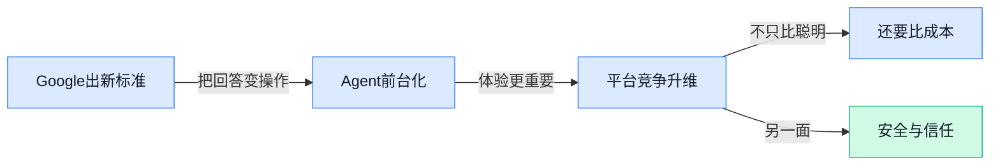

> AI 早报 · 每日早读 · 全网深度聚合

## **今日摘要**

```
Anthropic Opus 4.7 被曝实际 token 消耗明显高于 4.6，收入猛增后万亿美元估值争议升温
Cursor 融资传闻冲上 500 亿美元估值，OpenAI 开源多 Agent 框架，AI 编程赛道彻底白热化
Google 推生成式界面标准让 Agent 直接长出可操作页面，SK hynix 量产 SOCAMM2 抢位英伟达下一代服务器
```

### 🔵 产品与功能更新

1. **Google 推出生成式界面标准，让 AI Agent（能自动执行任务的智能助手）不只会“说”，还能直接“长出”可操作页面。**
Google 发布了一套面向 **AI Agent** 的**生成式界面标准**，重点是让模型在完成任务时，能动态生成更适合用户操作的界面，而不只是吐出一大段文字 💡。这背后可以理解为给 Agent 补上“前台展示层”，让订票、填表、比价这类流程更顺手，也更容易嵌进现有产品。对企业来说，这意味着以后接入 AI 时，不一定要从零设计每个交互页面，标准化程度会更高、落地也可能更快。[Google 新标准报道(briefing)](https://the-decoder.com/google-launches-generative-ui-standard-for-ai-agents/)


2. **Anthropic 的 Opus 4.7（Claude 背后的新模型版本）实际 token（模型处理文字的计量单位，像“按字数收费”的内部尺子）消耗被曝明显高于 4.6。**
虽然 Anthropic 对外仍维持**平价定价**口径，但首批统计数据显示，**Opus 4.7** 的实际 **token** 用量比 **4.6** 高出不少，意味着同样一项任务，后台真实成本可能更高 ⚠️。这件事对普通用户未必立刻体感明显，但对做预算、采购 API（让企业系统调用 AI 能力的接口）和评估大规模部署的团队来说很关键，因为“单价不变”不等于“总成本不变”。简单说，企业以后比模型，不能只看官方价目表，还得盯实际任务里消耗了多少 token。[成本变化完整报道(briefing)](https://the-decoder.com/first-token-counts-reveal-opus-4-7-costs-significantly-more-than-4-6-despite-anthropics-flat-pricing/)

3. **Anthropic 的 Mythos（一款未公开发布的 AI 系统）因潜在网络安全风险引发担忧，暂不对公众开放。**
报道指出，Anthropic 这套名为 **Mythos** 的 AI 因被认为存在一定**网络安全**层面的风险，因此选择暂缓公开发布，而不是直接推向市场 🚨。这类担忧通常不只是“回答错了”这么简单，而是担心模型可能被滥用于发现漏洞、辅助攻击或放大安全威胁。对行业来说，这释放了一个明确信号：新模型不再只是比谁更强，还要比谁更能控风险、过安全审查。[完整新闻报道(briefing)](https://news.google.com/rss/articles/CBMi3wFBVV95cUxPX0I4SWt1ZWZaNmFIV0cyakliQXB4LURmZkZFZjJZWnFCQzRydElmSlppamhYeGFWOXVtUEVZTk1MbF8zem1kUklNUDFPWDJldmlJNjBkcWdzM3lrOHd4dW4wNlNhcGtmQ3hPd2tIYnJZTGg5aGtYSDVzVi1OZUdFdDY2SU9Hd29PZHd5aWtBR3ZXQXBweTllclBHTUtiYzh6M2l6Ujk1bkJ0ei03TEdLelpnUDlJQmxGcTRrZHZXTVhjbHA4LUR3V1pVbVZtVWZrWERwM084Y2tPQndxb0440gHzAUFVX3lxTFB1UEd5NFNYMHJPSHZoczFoa3BoSl94amdCQmVGWThQRkdTUmFITmxQX1VBd01zNlVpOG9CZmZjRU5zcWgzcGlhLW9tNWdWMHBjb0pST21mbm1qellwTDA0cGRScXk0TGJGQllzZXNaS1J4M2Mtb3lNS3h3YWRaczhBLWFib1hVM3FteERiZHJVaU0yNmFra1FiN3lLR1htQTV0elQzNEtKbjJHNzhSSUxjWkZTWkxRNjBsYVZyVDN1TTAxRGhsNFpxOGlCZThTM3hZdi1vdGt2V3ZVVkFvR21XYzNac2Y4SmYxT2NvMEFyV0pDaw?oc=5)

### 🟢 前沿研究

1. **Model Capability Dominates（“模型能力更重要”研究）总结了 AIMO 3（数学推理竞赛）里推理时优化的关键经验。**
这篇研究想回答一个很实际的问题：到底是把模型“想更久”更重要，还是先把模型本身做强更重要 🤔。论文基于 AIMO 3（面向 AI 数学推理的比赛）经验指出，**模型能力**往往比单纯堆**inference-time optimization（推理时优化，让模型在回答阶段多尝试、多筛选）**更关键，也就是“底子好”比“临场补救”更有决定性。对企业用 AI 的同事来说，这意味着别迷信让模型反复重答就一定更准，选对基础模型依然是第一位。[论文页面(briefing)](https://huggingface.co/papers/2603.27844)


2. **RAD-2（生成器-判别器强化学习框架）探索了如何把强化学习进一步做大。**
RAD-2 讨论的是 **reinforcement learning（强化学习，让模型通过奖励与惩罚学会更好决策）** 怎么在 **generator-discriminator framework（生成器-判别器框架，一边负责生成答案，一边负责挑错打分）** 里更高效扩展 🚀。通俗说，它像让一个“写答案的人”和一个“审卷老师”长期搭档，帮助模型持续迭代得更聪明。对行业的意义在于，未来大模型不只是靠喂更多数据训练，还可能越来越依赖这种“生成+评审”双角色机制来提升复杂任务表现。[论文页面(briefing)](https://huggingface.co/papers/2604.15308)


3. **GlobalSplat（高效 3D 高斯泼溅重建方法）想更快生成三维场景。**
这项工作聚焦 **3D Gaussian Splatting（3D 高斯泼溅，一种把大量“模糊小点”拼成真实三维场景的重建方法）**，并提出 **global scene tokens（全局场景标记，让模型先抓住整体布局再细化局部）** 来提高效率 💡。它的重点是 **feed-forward（前向一次生成，不用反复慢慢优化）**，这通常意味着速度更快、更适合产品化。对非技术团队来说，可以把它理解为：未来做电商展示、空间设计、游戏资产或数字人场景时，AI 生成 3D 内容可能会更快、更省成本。[论文页面(briefing)](https://huggingface.co/papers/2604.15284)

4. **ASGuard（激活缩放防护机制）瞄准定向越狱攻击，想让模型更不容易被带偏。**
所谓 **jailbreaking attack（越狱攻击，用户通过特殊话术诱导模型绕过安全限制）**，是当前 AI 安全领域的核心问题之一；这篇论文提出 ASGuard，用 **activation-scaling（激活缩放，动态调整模型内部信号强弱）** 来减轻这类定向攻击的影响 🛡️。直白说，它不是只在表面拦截危险提示词，而是试图从模型内部“稳住情绪”，减少被精准操控的概率。对公司场景尤其重要，因为一旦模型接入客服、知识库或办公流程，安全防护不只是技术问题，也直接关系到品牌和合规风险。[论文页面(briefing)](https://huggingface.co/papers/2509.25843)

5. **HY-World 2.0（多模态世界模型）希望同时完成 3D 世界重建、生成与模拟。**
这篇论文提出的 **world model（世界模型，让 AI 学会理解和预测一个环境如何运转）**，能处理 **multi-modal（多模态，文字、图像等多种信息一起理解）** 的 3D 世界任务，包括重建、生成和模拟 🌍。如果说普通生成模型是在“画一张图”，那这类系统更像是在“理解一个世界并让它动起来”。它的潜在价值很大：从机器人训练、游戏内容生产，到数字孪生（现实场景的虚拟映射）和空间交互，都会受益于更完整的 3D 世界理解能力。[论文页面(briefing)](https://huggingface.co/papers/2604.14268)

6. **Teacher-Student Cooperation（师生协作框架）研究如何更好微调推理模型。**
这项研究关注 **fine-tuning（微调，用特定数据把通用大模型调成更适合某类任务）** 推理模型时，一个常见难题：训练数据怎么更贴合“学生模型”自己的能力边界。论文提出 **teacher-student cooperation（教师-学生协作框架，由更强模型帮助生成更适合较弱模型学习的数据）**，并围绕 **SFT data（监督微调数据，用标准答案教模型按目标方式作答的数据）** 展开设计 📚。对实际落地很有启发：不是把最强模型的答案原样塞给小模型就行，而是要给它“听得懂、学得会”的材料，训练效果才更稳定。[论文页面(briefing)](https://huggingface.co/papers/2604.14164)

7. **DR³-Eval（深度研究评测框架）想让 AI“深度研究”能力的测评更真实、更可复现。**
现在很多 AI 评测看起来分数很高，但离真实工作场景还有距离，这篇论文就聚焦 **deep research evaluation（深度研究能力评测，考察模型能否像研究助理一样做多步信息搜集与分析）** 的现实性问题。它强调 **reproducible（可复现，别人按同样流程也能得到近似结果）**，因为只有评测稳定，行业才知道模型到底是真的进步了，还是只是“刷题刷熟了” 📊。对业务团队来说，这类研究能帮助大家更理性看待各种“榜单第一”，也提醒企业在采购或试用 AI 时要关注真实任务表现，而不只是宣传数字。[论文页面(briefing)](https://huggingface.co/papers/2604.14683)

8. **Dive into Claude Code（对 Claude Code 的研究拆解）讨论了当下与未来 AI Agent 系统的设计空间。**
这篇论文把 Claude Code 当作切入口，分析今天的 **AI Agent systems（AI 智能体系统，能自主拆解任务、调用工具、连续执行多步操作的系统）** 是怎么设计的，以及未来还能怎么演化 🔍。其中的核心价值不只是看某个产品本身，而是梳理 Agent 在工具调用、任务规划和协作方式上的设计取舍。对非技术同事也很值得关注，因为这关系到未来办公软件会不会从“你下指令它回答”升级成“你交代目标它自己推进事情”。[论文页面(briefing)](https://huggingface.co/papers/2604.14228)

### 🟡 行业展望与社会影响

1. **Cursor 融资传闻升温：这家 AI 编程工具公司估值或超 500 亿美元。**
如果报道属实，Cursor 这一波融资谈判说明资本市场仍在大举押注**AI 办公生产力**，尤其是“帮人写代码”的助手型产品 💼。对普通公司同事来说，这类工具的信号很直接：AI 不只是聊天玩具，而是在真实工作流里持续替代一部分重复脑力劳动。也意味着未来企业采购软件时，会更看重“能不能直接省时间、提效率”，而不只是功能多不多。[CNBC 转引报道(briefing)](https://news.google.com/rss/articles/CBMiekFVX3lxTFBtWGxMZUVoMl8tdFBkRW9nbnJCYlNoVkRJZEtKd1Fnb0ZFdHdLOVFzcDlXVG9PcFBESGwxcnNEb0hXQnZhR19tdTBNaVlpaERRWE1tZURKcFZoeWlPRGprTFdESTNPdU1vc0RGV2VWTC1sS24xMmNDdlpB0gF_QVVfeXFMTkZRem9QRXBjUFc2WXNjSldGV1puME44VUxkWVI1MlFvX1k1MVUtRU8xX0MzTExIQU51VmlTWnRzNmtjM2wzX1VsUzhOdVNoNmtISGl1Z3pDT0t3VWJpVVdXQkpyczN4MzFWWDlieXozODBhRnBPUjFDdE53elhDRQ?oc=5)


2. **OpenClaw（可调用浏览器/邮箱/日历的通用 AI 代理框架）让 Ray-Ban Meta（Meta×雷朋联名智能眼镜）“常开待命”加速日常任务。**
这项研究的重点不是又一副新眼镜，而是**可穿戴 AI**开始从“你开口它才帮忙”，走向“它持续看环境、主动协助你” 👓。研究团队把 OpenClaw（AI 代理框架）接到 Ray-Ban Meta 眼镜上（项目代号 VisionClaw），让数字世界的执行力 + 物理世界的感知力合起来跑，可帮助用户更快完成日常事务，意味着 AI 正从手机屏幕进一步走向现实世界。对行业来说，这会把竞争焦点从单纯模型能力，推向**交互方式**和**使用场景**——谁更自然地嵌入生活，谁就更容易占领入口。[研究解读报道(briefing)](https://the-decoder.com/always-on-ray-ban-meta-glasses-powered-by-openclaw-speed-up-everyday-tasks-in-new-study/)


3. **Anthropic 收入猛增，市场开始讨论“万亿美元估值”可能性。**
这条消息释放出的核心信号是：头部 AI 公司正在从“讲故事”逐步转向“讲收入” 📈。如果一家大模型公司能靠企业客户和 API（应用程序接口，让别的软件也能调用 AI 能力）持续放大营收，资本市场给出的想象空间就会明显抬升。对产业而言，这说明 AI 商业化正在进入更现实的阶段，未来比拼的不只是模型聪不聪明，还包括销售能力、客户留存和基础设施成本控制。[完整报道(briefing)](https://the-decoder.com/anthropics-revenue-surge-reportedly-fuels-talk-of-trillion-dollar-valuation/)

4. **德国法院裁定：AI 改编受版权保护照片为漫画风，不必然侵犯原作。**
这是一条很关键的**版权边界**判例信号 ⚖️。简单说，法院认为把一张受版权保护的照片改编成 AI 漫画版本，并不自动等于复制原作，关键要看新作品是否形成了足够不同的表达。对设计、市场、内容团队都很重要：AI 生成内容不是“完全无法可管”，但法律正在尝试区分“照搬”与“再创作”，企业以后做海报、物料、品牌内容时，会越来越需要理解这条边界。[法院裁定解读(briefing)](https://the-decoder.com/german-court-rules-ai-comic-adaptation-of-copyrighted-photo-doesnt-violate-the-original/)

5. **《经济学人》：AI 监管不该放任自流，但也不宜一上来就“重手治理”。**
这代表一种越来越主流的政策思路：既不能让 AI 在市场里完全野蛮生长，也不能因为担心风险就把创新直接压住 🧭。所谓 **laissez-faire（放任自流的自由放任政策）** 和 **light touch（轻量监管，先立基本规则不过度干预）**，本质是在找平衡点。对企业最现实的意义是，未来合规要求大概率会逐步增加，但不会一夜之间把业务卡死，关键是谁更早建立内容审核、数据使用和责任归属机制。[经济学人观点(briefing)](https://news.google.com/rss/articles/CBMingFBVV95cUxOTGUxR0FwNkxGWDE1RkpHelRRMGJCSWRGOVVFczNmQXpzR2dfaEJaZmVMY3Z0M25RNEJOY3pfOWo0bWF4ZTRfOWIxN2x5YkVyLTNUZkFzZ0dNVVNZaUIwNzg2TVZCclJsSmtuSTA5V3lpMDctUUhjME5yR3R3VG1YWXA1bVYzc2VZLUd1NlBiWkFKZTNvMFBHUzVfS3J4UQ?oc=5)

6. **《经济学人》提醒：你的 AI 助手，可能正在悄悄变成“销售员”。**
当 AI 助手越来越像“入口”时，商业模式问题就来了：它到底是替你做决定，还是替品牌把东西卖给你 🛍️？这篇报道点出的变化很关键——AI 助手如果承担搜索、推荐、代办任务，就天然掌握了用户注意力和购买路径，商业植入的诱惑会迅速上升。对普通用户和企业都值得警惕：未来我们要讨论的不只是广告有没有消失，而是广告会不会伪装成“贴心建议”混进 AI 对话里。[经济学人分析(briefing)](https://news.google.com/rss/articles/CBMimgFBVV95cUxNczd5Mkwxb01DeElMNUZURmNRdWJVNHdNRURMZk5RY20tTjhLNHFnLS1BWVBwVi15OTdhSU00SHRBeEc5MTkybV9lSzJDNXQxeUpFay10ZlRuNFp0TVBLQlpvYVdWWmxFZ0x2VEZDN0t1YXJsQ1ZJSEhTNExBZi1HVEtkblZIcHNYTGI5S0lLUXFRQ2RYeGwzSjVn?oc=5)

7. **AI 生成网红在美国中期选举前密集发布亲特朗普内容，社交平台信息污染加剧。**
这条新闻提醒我们，AI 对社会的影响已经不只是“效率工具”，还直接碰到**舆论操控**和**公共信任**问题 🗳️。所谓 AI 生成网红，就是用生成式模型批量制造看似真实的人设、头像和内容，再在社交平台持续发声，放大某种政治立场。对平台治理、品牌投放甚至企业公关都很重要：以后判断“一个账号值不值得信”“一波讨论是否真实”，门槛会越来越高。[完整报道(briefing)](https://the-decoder.com/ai-generated-influencers-flood-social-media-with-pro-trump-content-ahead-of-midterms/)

8. **Cerebras（美国 AI 芯片公司）申请上市，AI 硬件热正在向资本市场外溢。**
Cerebras 不是做聊天机器人的，而是做 AI 芯片的公司；它启动上市流程，说明市场对**算力基础设施**的关注还在继续升温 🧠。这里的算力基础设施，可以理解为支撑大模型训练和运行的“电厂+机器设备”组合，没有它，再强的模型也跑不起来。对行业展望来说，这意味着 AI 竞争不只在应用层，真正的大机会仍在底层硬件、数据中心和企业级交付能力。[纽约时报转引报道(briefing)](https://news.google.com/rss/articles/CBMihAFBVV95cUxQX3pjLVFSbGItbWoyalpNUU5oYXRtTWJfUjczZ2FfNXpMZnZrRU1VSXpTVHpnY2xVYjZmVFpVREVPMlpRa3VMWHMxN216ZDNuMmFJbERIdThrd2hpVFVMTG5xYjJZSWtOVjNLcC1NQm4ydkFTUVczZ2dzUVZkNlI1ZXRHVkg?oc=5)

### 🟣 开源TOP项目

1. **openai-agents-python（OpenAI 开源的多 Agent 协作开发框架）让多助手分工更简单。**
这个项目主打**轻量**但功能不弱，核心用途是搭建**多 Agent 工作流**，也就是让多个 AI 助手像团队成员一样分工协作完成任务 🚀。对业务团队来说，它的价值在于：以后很多“拆任务、分步骤、互相接力”的流程，更容易被做成可复用的 AI 自动化流程。这里的 framework（开发框架，相当于搭积木的基础工具箱）能帮开发者少写很多底层代码，更快把想法做成产品。[GitHub 仓库页(briefing)](https://github.com/openai/openai-agents-python)


2. **EvoMap/evolver（让 AI Agent 自我迭代的开源引擎）瞄准“会进化的助手”。**
这个项目强调 **GEP**（Genome Evolution Protocol，一套用“基因进化”思路让 AI Agent 不断试错和变强的机制），想解决的是 Agent 做任务时如何持续自我优化 💡。通俗说，它不是只让 AI 执行命令，而是希望它在一轮轮尝试中找到更好的做法，像团队里会复盘、会改进的同事。对于关注自动化和长期效率的团队，这类 self-evolution engine（自我演化引擎，让系统自己迭代能力）很值得留意。[项目仓库说明(briefing)](https://github.com/EvoMap/evolver)


3. **Kronos（面向金融市场语言的基础模型）把大模型带进金融语境。**
Kronos 被定义为一个 **foundation model**（基础模型，可作为多类金融任务底座的大模型），聚焦的是金融市场这套“语言体系” 📈。这意味着它不是通用聊天模型，而是更强调对市场表达、金融文本和相关语境的理解，对投研、分析、金融信息处理场景更有针对性。对非技术同事来说，可以把它理解成“更懂金融黑话和市场上下文”的 AI 底座。[Kronos 项目页(briefing)](https://github.com/shiyu-coder/Kronos)


4. **MemPalace（开源 AI 记忆系统）想解决 Agent“容易失忆”的老问题。**
这个项目主打 **AI memory system**（AI 记忆系统，让助手能记住上下文、历史偏好和过去任务结果），并强调自己在公开基准测试里表现突出 🧠。很多 Agent 之所以体验差，不是不会回答，而是记不住前文、不了解长期背景；这类 memory（记忆模块，相当于给 AI 配“长期工作笔记”）正是为了解决这个痛点。对于企业应用来说，记忆能力往往直接影响 AI 能不能真正“越用越懂你”。[开源仓库主页(briefing)](https://github.com/MemPalace/mempalace)

5. **FinceptTerminal（面向投资研究的现代金融分析工具）把市场数据探索做得更顺手。**
从项目介绍看，它把**市场分析**、**投资研究**和**经济数据工具**整合到一个更易用的应用里，强调 interactive exploration（交互式探索，边看数据边调整分析方式）和数据驱动决策 📊。这类工具对金融从业者或企业研究团队的意义很直接：不只是看数据，而是更方便地比较、观察和形成判断。对不写代码的同事也更友好，因为它强调的是 user-friendly environment（用户友好环境，尽量降低使用门槛）。[项目 GitHub 页(briefing)](https://github.com/Fincept-Corporation/FinceptTerminal)

6. **GenericAgent（可操控电脑桌面的 AI Agent）让桌面自动化更进一步。**
这个项目聚焦 **PC agent loop**（电脑任务执行闭环，让 AI 能持续观察、操作、再判断下一步），目标是做桌面自动化和智能任务执行 🖥️。简单说，它不只是在聊天框里回答问题，而是朝着“直接帮你点、帮你做、帮你跑流程”的方向走。对企业场景而言，这类 desktop automation（桌面自动化，让电脑重复操作由 AI 接手）如果成熟，会很适合处理大量规则明确的日常流程。[仓库详情页(briefing)](https://github.com/lsdefine/GenericAgent)

### 🔴 社媒分享

1. **“Headless”（无界面后台服务）思路走红，个人 AI 可能越来越依赖“只提供能力、不提供页面”的服务。**
这篇分享讨论了一个很有意思的变化：未来很多服务可能不再强调自己的网站界面，而是变成可被 AI 直接调用的**后台能力接口** 💡。所谓 **Headless（无界面后台服务）**，你可以把它理解成“只有厨房、没有餐厅”——普通人未必直接打开它，但 AI 助手能在背后替你下单、查数据、串流程。对日常办公来说，这意味着以后我们用 AI 处理报销、查制度、订差旅时，前台可能只剩一个聊天窗口，真正干活的是背后接上的各种服务。[原文讨论(briefing)](https://simonwillison.net/2026/Apr/19/headless-everything/#atom-everything)

2. **SK hynix 量产 SOCAMM2（面向 AI 服务器的新型高容量内存模块），瞄准英伟达下一代 AI 服务器。**
这条消息的核心不是“又一块新硬件”，而是 AI 服务器最头疼的**内存瓶颈**可能在被缓解 🚀。文中提到的 **SOCAMM2（新一代服务器内存模组形态）** 单条容量达到 **192GB**，并采用 **LPDDR5X（常见于手机和轻薄设备、功耗更低的一类高速内存）**，目标是给 AI 服务器提供更高密度、同时更省电的内存方案。对行业来说，训练和 **inference（模型推理，让训练好的模型真正回答问题的过程）** 都很吃内存，谁能更省电、更高密度，谁就更有机会把 AI 成本压下来。[Reddit 讨论帖(briefing)](https://www.reddit.com/r/LocalLLaMA/comments/1sqap57/sk_hynix_starts_mass_production_of_192gb_socamm2/)

3. **llama.cpp（让大模型能在本地电脑运行的轻量工具）合并 speculative checkpointing（推测式存档加速机制），部分场景可提速。**
这次更新来自 **llama.cpp（本地运行大模型的开源工具）** 社区，新增的 **speculative checkpointing（先做“推测性尝试”，再把可复用结果存下来以减少重复计算）** 已经合并进主项目 ⚙️。原帖也说得很实在：它不是“无脑全场景加速”，有些提示词会更快，有些则未必，效果还和任务类型、重复模式有关。对普通用户来说，这类优化的意义是，本地跑模型时如果遇到重复性较高的工作，未来可能更顺、更省等待时间；但它仍需要继续调参数，离“一键通吃”还有距离。[社区原帖(briefing)](https://www.reddit.com/r/LocalLLaMA/comments/1sprdm8/llamacpp_speculative_checkpointing_was_merged/) [GitHub 合并记录(briefing)](https://github.com/ggml-org/llama.cpp/pull/19493)

4. **Claude Token Counter（Claude 用量统计工具）加入模型对比，方便更直观看不同模型“吃多少字”。**
这个小工具的新功能很实用：现在可以直接比较不同 Claude 模型对同一段内容会消耗多少 **token（模型处理文字时切分的最小单位，可理解为“计费和思考的小颗粒”）** 📏。对非技术同事来说，**token** 基本就关系到两件事：一是内容能不能塞得下，二是调用成本高不高；所以“模型对比”能帮助团队更快判断该用哪个版本更合适。做运营、客服、知识库整理的人尤其能受益，因为同样一份长文档，不同模型的处理开销可能并不一样。[工具更新介绍(briefing)](https://simonwillison.net/2026/Apr/20/claude-token-counts/#atom-everything)

---



### 📊 行业洞察（今日 4 条）

1. Google 推出生成式界面标准，让 Agent 不只吐文字，还能直接长出可操作页面
  【洞察】这说明 Agent 正从“聊天工具”变成“任务入口”，以后谁只会回答、不会把操作做顺，谁就更容易被边缘化

2. Anthropic 一边传出年收入已超 300 亿美元、估值冲向万亿美元，一边又被曝 Opus 4.7 实际更“吃字”
  【洞察】头部公司已经进入真商业化阶段，但行业繁荣不等于成本透明，模型越强越可能把利润吃回去

3. Anthropic 因潜在网络安全风险暂缓公开 Mythos，另有 ASGuard（从模型内部降低被诱导风险的方案）瞄准越狱攻击
  【洞察】行业主线正在从“能不能做出来”转向“敢不敢放出去”，安全不再是附加题，而是上线门槛

4. Google 做界面标准、OpenAI 开源多 Agent 协作框架、EvoMap/evolver 做 Agent 自我迭代，方向开始连成线
  【洞察】Agent 赛道正从单点能力竞争，走向“前台交互+后台协作+持续优化”的系统战，产品形态在变成熟

### 💭 对我们的启发（今日 3 条）

1. Google 的界面标准很关键：我们不能把平台只做成“Agent 排班器”，还要考虑结果怎么被用户看懂、接管和继续操作。

2. Anthropic “表面平价、实际更贵”提醒我们，平台调度不能只看模型标价，必须把真实任务成本和结果质量一起展示出来。

3. Mythos 暂缓发布和越狱防护研究都说明，信任会成为平台核心卖点；我们要尽早设计可追溯、可中断、可审查的机制，而不是后补。


---

> 本周周报：[第17周综合分析](https://ylzsdafei.github.io/ai-daily-site/blog/weekly/2026-w17/)
